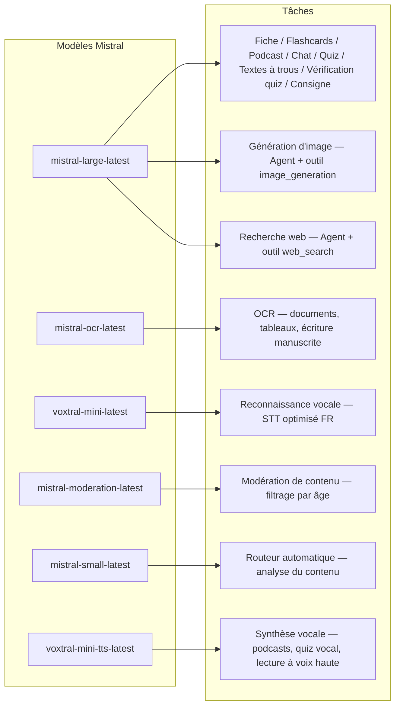
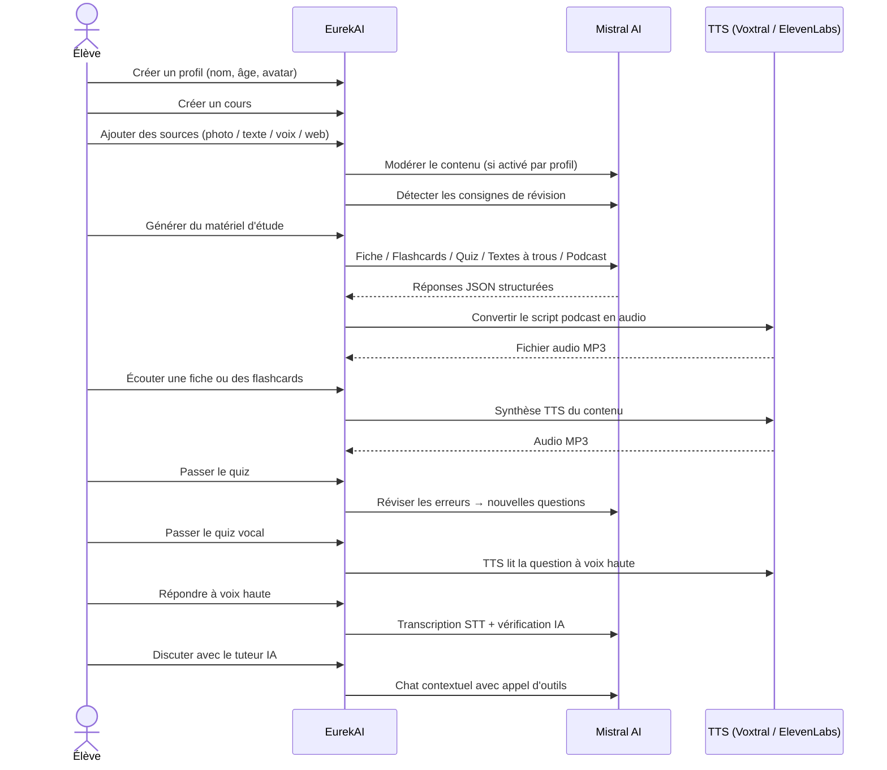

<p align="center">
  
</p>

<h1 align="center">EurekAI</h1>

<p align="center">
  <strong>حوّل أي محتوى إلى تجربة تعلم تفاعلية — مدعومة من <a href="https://mistral.ai">Mistral AI</a>.</strong>
</p>

<p align="center">
  <a href="README-en.md">🇬🇧 English</a> · <a href="README-es.md">🇪🇸 Español</a> · <a href="README-pt.md">🇧🇷 Português</a> · <a href="README-de.md">🇩🇪 Deutsch</a> · <a href="README-it.md">🇮🇹 Italiano</a> · <a href="README-nl.md">🇳🇱 Nederlands</a> · <a href="README-ar.md">🇸🇦 العربية</a><br>
  <a href="README-hi.md">🇮🇳 हिन्दी</a> · <a href="README-zh.md">🇨🇳 中文</a> · <a href="README-ja.md">🇯🇵 日本語</a> · <a href="README-ko.md">🇰🇷 한국어</a> · <a href="README-pl.md">🇵🇱 Polski</a> · <a href="README-ro.md">🇷🇴 Română</a> · <a href="README-sv.md">🇸🇪 Svenska</a>
</p>

<p align="center">
  <a href="https://www.youtube.com/watch?v=_b1TQz2leoI"></a>
</p>

<h4 align="center">📊 جودة الكود</h4>

<p align="center">
  <a href="https://sonarcloud.io/summary/new_code?id=jls42_EurekAI"></a>
  <a href="https://sonarcloud.io/summary/new_code?id=jls42_EurekAI"></a>
  <a href="https://sonarcloud.io/summary/new_code?id=jls42_EurekAI"></a>
  <a href="https://sonarcloud.io/summary/new_code?id=jls42_EurekAI"></a>
</p>
<p align="center">
  <a href="https://sonarcloud.io/summary/new_code?id=jls42_EurekAI"></a>
  <a href="https://sonarcloud.io/summary/new_code?id=jls42_EurekAI"></a>
  <a href="https://sonarcloud.io/summary/new_code?id=jls42_EurekAI"></a>
  <a href="https://sonarcloud.io/summary/new_code?id=jls42_EurekAI"></a>
</p>

---

## القصة — لماذا EurekAI؟

**EurekAI** وُلد خلال [هاكاثون Mistral AI العالمي](https://luma.com/mistralhack-online) ([الموقع الرسمي](https://worldwide-hackathon.mistral.ai/)) (مارس 2026). كنت بحاجة إلى موضوع — وفكرتي جاءت من شيء عملي جدا: أجهز بانتظام للاختبارات مع ابنتي، وفكرت أنه من الممكن جعل ذلك أكثر متعة وتفاعلية بفضل الذكاء الاصطناعي.

الهدف: أخذ **أي مدخل** — صورة من الكتاب، نص منسوخ-ملصوق، تسجيل صوتي، بحث ويب — وتحويله إلى **بطاقات مراجعة، بطاقات فلاش، اختبارات، بودكاستات، نصوص بفراغات، رسومات توضيحية، وأكثر**. كل ذلك مدعوم بنماذج Mistral AI الفرنسية، ما يجعله حلا ملائما بشكل طبيعي للتلاميذ الفرنسيي اللغة.

المشروع أُطلق خلال الهاكاثون، ثم استمرّ وتطوّر خارجه. كامل الكود مُولَّد بواسطة الذكاء الاصطناعي — بالأساس [Claude Code](https://docs.anthropic.com/en/docs/claude-code)، مع بعض المساهمات عبر [Codex](https://openai.com/index/introducing-codex/).

---

## الميزات

| | الميزة | الوصف |
|---|---|---|
| 📷 | **رفع OCR** | التقط صورة لكتابك أو ملاحظاتك — Mistral OCR يستخرج المحتوى |
| 📝 | **إدخال نصي** | اكتب أو الصق أي نص مباشرة |
| 🎤 | **إدخال صوتي** | سجّل صوتك — Voxtral STT ينقل كلامك إلى نص |
| 🌐 | **بحث ويب** | اطرح سؤالا — وكيل Mistral يبحث عن الإجابات على الويب |
| 📄 | **بطاقات مراجعة** | ملاحظات منظمة مع نقاط رئيسية، مصطلحات، اقتباسات، حكايات |
| 🃏 | **بطاقات فلاش** | 5-50 بطاقة سؤال/جواب مع مراجع للمصادر للحفظ النشط |
| ❓ | **اختبار اختيار متعدد (QCM)** | 5-50 سؤال اختيار متعدد مع مراجعة تكيفية للأخطاء |
| ✏️ | **نصوص بفراغات** | تمارين املأ الفراغات مع دلائل وتصحيح متسامح |
| 🎙️ | **بودكاست** | بودكاست قصير بصوتين محوّل إلى صوت عبر Mistral Voxtral TTS |
| 🖼️ | **رسوم توضيحية** | صور تعليمية مولّدة بواسطة وكيل Mistral |
| 🗣️ | **اختبار صوتي** | أسئلة تُقرأ بصوت عالٍ، إجابة شفهية، والذكاء الاصطناعي يتحقق من الإجابة |
| 💬 | **مدرّس بالذكاء الاصطناعي** | دردشة سياقية مع مستنداتك الدراسية، مع استدعاء أدوات |
| 🧠 | **موجّه تلقائي** | موجّه مبني على `mistral-small-latest` يحلل المحتوى ويقترح توليفة من المولّدات من بين 7 أنواع متاحة |
| 🔒 | **التحكم الأبوي** | تصفية حسب العمر، رمز PIN أبوي، قيود للدردشة |
| 🌍 | **متعدد اللغات** | الواجهة متاحة بـ 9 لغات؛ إمكانية توليد الذكاء الاصطناعي في 15 لغة عبر البرمجات |
| 🔊 | **القراءة بصوت مرتفع** | استمع إلى البطاقات وبطاقات الفلاش عبر Mistral Voxtral TTS أو ElevenLabs |

---

## نظرة عامة على البنية


---

## خريطة استخدام النماذج



---

## مسار المستخدم



---

## غوص عميق — الميزات

### إدخال متعدد الوسائط

EurekAI يقبل 4 أنواع من المصادر، يتم تصفيتها حسب الملف الشخصي (مفعّل افتراضيا للطفل والمراهق):

- **رفع OCR** — ملفات JPG، PNG أو PDF معالجة بواسطة `mistral-ocr-latest`. يتعامل مع النص المطبوع، الجداول والخط اليدوي.
- **نص حر** — اكتب أو الصق أي محتوى. يتم تصفيته قبل التخزين إذا كانت الفلترة مفعلة.
- **إدخال صوتي** — سجّل صوتا في المتصفح. يُنقَل بواسطة `voxtral-mini-latest`. الإعداد `language="fr"` يُحسّن التعرف.
- **بحث ويب** — أدخل استعلاما. وكيل Mistral مؤقت مع الأداة `web_search` يجلب ويُلخّص النتائج.

### توليد محتوى بالذكاء الاصطناعي

سبعة أنواع من المواد التعليمية المولّدة:

| المولّد | النموذج | المخرجات |
|---|---|---|
| **بطاقة مراجعة** | `mistral-large-latest` | عنوان، ملخص، 10-25 نقاط رئيسية، مفردات، اقتباسات، حكاية |
| **بطاقات فلاش** | `mistral-large-latest` | 5-50 بطاقة سؤال/جواب مع مراجع للمصادر للحفظ النشط |
| **اختبار اختيار متعدد (QCM)** | `mistral-large-latest` | 5-50 سؤال، 4 اختيارات لكل منها، شروحات، مراجعة تكيفية |
| **نصوص بفراغات** | `mistral-large-latest` | جمل لإكمالها مع دلائل، تصحيح متسامح (Levenshtein) |
| **بودكاست** | `mistral-large-latest` + Voxtral TTS | نص بصوتين → ملف صوتي MP3 |
| **رسوم توضيحية** | وكيل `mistral-large-latest` | صورة تعليمية عبر الأداة `image_generation` |
| **اختبار صوتي** | `mistral-large-latest` + Voxtral TTS + STT | أسئلة TTS → إجابة STT → تحقق بالذكاء الاصطناعي |

### مدرّس بالذكاء الاصطناعي عبر الدردشة

مدرّس محادثة مع وصول كامل لملفات الدروس:

- يستخدم `mistral-large-latest`
- **استدعاء أدوات**: يمكنه توليد بطاقات مراجعة، بطاقات فلاش، اختبارات أو نصوص بفراغات أثناء المحادثة
- سجل محادثة بحد 50 رسالة لكل مقرر
- فلترة المحتوى إذا كانت مفعلة للملف الشخصي

### الموجّه التلقائي

الموجّه يستخدم `mistral-small-latest` لتحليل محتوى المصادر واقتراح المولّدات الأكثر صلة من بين الأنواع السبعة المتاحة. الواجهة تعرض التقدم في الوقت الفعلي: أولا مرحلة التحليل، ثم التوليدات الفردية مع إمكانية الإلغاء.

### التعلّم التكيفي

- **إحصائيات الاختبار**: تتبع المحاولات والدقة لكل سؤال
- **مراجعة الاختبار**: يولّد 5-10 أسئلة جديدة تستهدف المفاهيم الضعيفة
- **كشف التعليمات**: يكتشف تعليمات المراجعة ("أنا أعرف درسي إذا كنت أعرف...") ويعطيها أولوية في المولّدات النصية المتوافقة (بطاقة مراجعة، بطاقات فلاش، اختبار، نصوص بفراغات)

### الأمان والتحكم الأبوي

- **4 فئات عمرية**: طفل (≤10 سنوات)، مراهق (11-15)، طالب (16-25)، بالغ (26+)
- **فلترة المحتوى**: `mistral-moderation-latest` مع 5 فئات محجوبة للأطفال/المراهقين (sexual, hate, violence, selfharm, jailbreaking)، لا قيود للطالب/البالغ
- **رمز PIN أبوي**: هاش SHA-256، مطلوب للملفات الشخصية أقل من 15 سنة. للنشر في الإنتاج، يفضّل هاش بطيء مع ملح (Argon2id, bcrypt).
- **قيود الدردشة**: الدردشة بالذكاء الاصطناعي معطلة افتراضيا لمن هم دون 16 عاما، يمكن تفعيلها بواسطة الوالدين

### نظام متعدد الملفات الشخصية

- ملفات شخصية متعددة مع اسم، عمر، صورة رمزية، تفضيلات اللغة
- مشاريع مرتبطة بالملفات الشخصية عبر `profileId`
- حذف تسلسلي: حذف ملف شخصي يحذف جميع مشاريعه

### TTS متعدد المزودين

- **Mistral Voxtral TTS** (افتراضي): `voxtral-mini-tts-latest`، لا حاجة لمفتاح إضافي
- **ElevenLabs** (بديل): `eleven_v3`، أصوات طبيعية، يتطلب `ELEVENLABS_API_KEY`
- يمكن تكوين المزود في إعدادات التطبيق

### التدويل

- الواجهة متاحة بـ 9 لغات: fr, en, es, pt, it, nl, de, hi, ar
- برمجات الذكاء الاصطناعي تدعم 15 لغة (fr, en, es, de, it, pt, nl, ja, zh, ko, ar, hi, pl, ro, sv)
- اللغة قابلة للتكوين لكل ملف شخصي

---

## المكدس التقني

| الطبقة | التكنولوجيا | الدور |
|---|---|---|
| **بيئة التشغيل** | Node.js + TypeScript 5.x | الخادم وضمان سلامة الأنواع |
| **الخلفية** | Express 4.x | API REST |
| **خادم التطوير** | Vite 7.x + tsx | HMR، partials Handlebars، بروكسي |
| **الواجهة** | HTML + TailwindCSS 4.x + Alpine.js 3.x | واجهة تفاعلية، TypeScript متجمّع عبر Vite |
| **التصميم القوالبي** | vite-plugin-handlebars | تركيب HTML عبر partials |
| **الذكاء الاصطناعي** | Mistral AI SDK 2.x | دردشة، OCR، STT، TTS، وكلاء، فلترة المحتوى |
| **TTS (افتراضي)** | Mistral Voxtral TTS | `voxtral-mini-tts-latest`، توليد صوت مدمج |
| **TTS (بديل)** | ElevenLabs SDK 2.x | `eleven_v3`، أصوات طبيعية |
| **الأيقونات** | Lucide | مكتبة أيقونات SVG |
| **Markdown** | Marked | عرض markdown في الدردشة |
| **رفع الملفات** | Multer 1.4 LTS | معالجة نماذج multipart |
| **الصوت** | ffmpeg-static | دمج مقاطع الصوت |
| **الاختبارات** | Vitest | اختبارات وحدية — التغطية مقاسة بواسطة SonarCloud |
| **التخزين** | ملفات JSON | تخزين بدون تبعيات |

---

## مرجع النماذج

| النموذج | الاستخدام | لماذا |
|---|---|---|
| `mistral-large-latest` | بطاقة مراجعة، بطاقات فلاش، بودكاست، اختبار، نصوص بفراغات، دردشة، تحقق اختبار صوتي، وكيل الصور، وكيل بحث ويب، كشف التعليمات | أفضل متعدد اللغات + متابعة التعليمات |
| `mistral-ocr-latest` | OCR للمستندات | نص مطبوع، جداول، خط يدوي |
| `voxtral-mini-latest` | التعرف على الصوت (STT) | STT متعدد اللغات، مُحسّن مع `language="fr"` |
| `voxtral-mini-tts-latest` | توليد الصوت (TTS) | بودكاست، اختبار صوتي، القراءة بصوت مرتفع |
| `mistral-moderation-latest` | فلترة المحتوى | 5 فئات محجوبة للأطفال/المراهق (+ jailbreaking) |
| `mistral-small-latest` | الموجّه التلقائي | تحليل سريع للمحتوى لاتخاذ قرارات التوجيه |
| `eleven_v3` (ElevenLabs) | توليد الصوت (TTS بديل) | أصوات طبيعية، بديل قابل للتكوين |

---

## بدء سريع

```bash
# Cloner le dépôt
git clone https://github.com/jls42/EurekAI.git
cd EurekAI

# Installer les dépendances
npm install

# Configurer les clés API
cp .env.example .env
# Éditez .env avec vos clés :
#   MISTRAL_API_KEY=votre_clé_ici           (requis)
#   ELEVENLABS_API_KEY=votre_clé_ici        (optionnel, TTS alternatif)
#   SONAR_TOKEN=...                          (optionnel, CI SonarCloud uniquement)

# Lancer le développement
npm run dev
# → Backend :  http://localhost:3000 (API)
# → Frontend : http://localhost:5173 (serveur Vite avec HMR)
```

> **ملاحظة** : Mistral Voxtral TTS هو المزود الافتراضي — لا حاجة لمفتاح إضافي بخلاف `MISTRAL_API_KEY`. ElevenLabs هو مزود TTS بديل يمكن تكوينه في الإعدادات.

---

## هيكل المشروع

```
server.ts                 — Point d'entrée Express, monte les routes + config
config.ts                 — Config runtime (modèles, voix, TTS provider), persistée dans output/config.json
store.ts                  — ProjectStore : CRUD projets/sources/générations, persistance JSON
profiles.ts               — ProfileStore : gestion des profils, hachage PIN
types.ts                  — Types TypeScript : Source, Generation (7 types), QuizStats, Profile
prompts.ts                — Tous les prompts IA centralisés (system + user templates, 15 langues)

generators/
  ocr.ts                  — Upload + OCR via Mistral (JPG, PNG, PDF)
  summary.ts              — Génération de fiche de révision (JSON structuré)
  flashcards.ts           — Flashcards Q/R (5-50, configurable)
  quiz.ts                 — Quiz QCM (5-50 questions, configurable) + révision adaptative
  fill-blank.ts           — Exercices à trous avec validation tolérante
  podcast.ts              — Script podcast 2 voix
  quiz-vocal.ts           — Quiz vocal : questions TTS + réponses STT + vérification IA
  image.ts                — Génération d'image via Agent Mistral (outil image_generation)
  chat.ts                 — Tuteur IA par chat avec appel d'outils
  router.ts               — Routeur automatique (contenu → générateurs recommandés)
  consigne.ts             — Détection de consignes de révision
  tts-provider.ts         — Dispatch TTS multi-provider (Mistral Voxtral / ElevenLabs)
  tts.ts                  — Génération audio podcast (concaténation de segments)
  stt.ts                  — Voxtral STT (audio → texte)
  websearch.ts            — Agent Mistral avec outil web_search
  moderation.ts           — Modération de contenu (filtrage par âge)

routes/
  projects.ts             — CRUD projets
  profiles.ts             — CRUD profils avec gestion du PIN
  sources.ts              — Upload OCR, texte libre, voix STT, recherche web, modération
  generate.ts             — Endpoints de génération (7 types + auto + route)
  generations.ts          — Tentatives de quiz/fill-blank, réponses vocales, lecture à voix haute
  chat.ts                 — Chat IA avec appel d'outils

helpers/
  index.ts                — safeParseJson, unwrapJsonArray, extractAllText, timer
  audio.ts                — collectStream (ReadableStream → Buffer)
  fill-blank-validate.ts  — Validation tolérante des réponses (normalisation, Levenshtein)

src/                      — Frontend (Vite + Handlebars)
  index.html              — Point d'entrée HTML principal
  main.ts                 — Entrée frontend (init Alpine.js + icônes Lucide)
  app/                    — Modules applicatifs Alpine.js
    state.ts              — Gestion d'état réactif
    navigation.ts         — Routage des vues + gardes par âge
    profiles.ts           — Logique du sélecteur de profils
    projects.ts           — CRUD des cours
    sources.ts            — Gestionnaires d'upload de sources
    generate.ts           — Déclencheurs de génération (individuel, tout, auto 2 phases)
    generations.ts        — Affichage + actions sur les générations
    chat.ts               — Interface de chat
    config.ts             — Interface de configuration (modèles, voix, TTS provider)
    render.ts             — Helpers de rendu HTML
    i18n.ts               — Changement de langue
    ...
  components/
    quiz.ts               — Composant quiz interactif
    quiz-vocal.ts         — Composant quiz vocal
    fill-blank.ts         — Composant textes à trous
    flashcards.ts         — Composant flashcards avec retournement
    step-by-step.ts       — Mixin navigation pas-à-pas (quiz, fill-blank, flashcards)
  i18n/
    fr.ts, en.ts, es.ts, — Dictionnaires par langue (9 langues)
    pt.ts, it.ts, nl.ts,
    de.ts, hi.ts, ar.ts
    languages.ts          — Registre des langues UI disponibles
    index.ts              — Chargeur i18n
  partials/               — Partials HTML Handlebars (header, sidebar, dialogues, vues)
  styles/
    main.css              — Entrée TailwindCSS
    theme.css             — Variables de thème personnalisées

public/assets/            — Ressources statiques (logo, avatars)
output/                   — Données d'exécution (projets, config, fichiers audio)
```

---

## مرجع API

### التهيئة
| الطريقة | Endpoint | الوصف |
|---|---|---|
| `GET` | `/api/config` | التهيئة الحالية |
| `PUT` | `/api/config` | تعديل التهيئة (النماذج، الأصوات، مزود TTS) |
| `GET` | `/api/config/status` | حالة واجهات البرمجة (Mistral, ElevenLabs, TTS) |
| `POST` | `/api/config/reset` | إعادة التهيئة إلى الافتراضي |
| `GET` | `/api/config/voices` | سرد أصوات Mistral TTS (اختياري `?lang=fr`) |

### الملفات الشخصية
| الطريقة | Endpoint | الوصف |
|---|---|---|
| `GET` | `/api/profiles` | سرد كل الملفات الشخصية |
| `POST` | `/api/profiles` | إنشاء ملف شخصي |
| `PUT` | `/api/profiles/:id` | تعديل ملف شخصي (رمز PIN مطلوب لأقل من 15 سنة) |
| `DELETE` | `/api/profiles/:id` | حذف ملف شخصي + حذف تسلسلي للمشاريع `{pin?}` → `{ok, deletedProjects}` |

### المشاريع
| الطريقة | Endpoint | الوصف |
|---|---|---|
| `GET` | `/api/projects` | سرد المشاريع (`?profileId=` اختياري) |
| `POST` | `/api/projects` | إنشاء مشروع `{name, profileId}` |
| `GET` | `/api/projects/:pid` | تفاصيل المشروع |
| `PUT` | `/api/projects/:pid` | إعادة تسمية `{name}` |
| `DELETE` | `/api/projects/:pid` | حذف المشروع |

### المصادر
| الطريقة | Endpoint | الوصف |
|---|---|---|
| `POST` | `/api/projects/:pid/sources/upload` | رفع OCR (ملفات multipart) |
| `POST` | `/api/projects/:pid/sources/text` | نص حر `{text}` |
| `POST` | `/api/projects/:pid/sources/voice` | صوت STT (audio multipart) |
| `POST` | `/api/projects/:pid/sources/websearch` | بحث ويب `{query}` |
| `DELETE` | `/api/projects/:pid/sources/:sid` | حذف مصدر |
| `POST` | `/api/projects/:pid/moderate` | فلترة `{text}` |
| `POST` | `/api/projects/:pid/detect-consigne` | كشف تعليمات المراجعة |

### التوليد
| الطريقة | Endpoint | الوصف |
|---|---|---|
| `POST` | `/api/projects/:pid/generate/summary` | بطاقة مراجعة |
| `POST` | `/api/projects/:pid/generate/flashcards` | بطاقات فلاش |
| `POST` | `/api/projects/:pid/generate/quiz` | اختبار اختيار متعدد |
| `POST` | `/api/projects/:pid/generate/fill-blank` | نصوص بفراغات |
| `POST` | `/api/projects/:pid/generate/podcast` | بودكاست |
| `POST` | `/api/projects/:pid/generate/image` | رسم توضيحي |
| `POST` | `/api/projects/:pid/generate/quiz-vocal` | اختبار صوتي |
| `POST` | `/api/projects/:pid/generate/quiz-review` | مراجعة تكيفية `{generationId, weakQuestions}` |
| `POST` | `/api/projects/:pid/generate/route` | تحليل التوجيه (خطة المولّدات التي ستنطلق) |
| `POST` | `/api/projects/:pid/generate/auto` | توليد تلقائي في الخلفية (توجيه + 5 أنواع: summary, flashcards, quiz, fill-blank, podcast) |

جميع مسارات التوليد تقبل `{sourceIds?, lang?, ageGroup?, count?, useConsigne?}`. `quiz-review` يتطلب أيضا `{generationId, weakQuestions}`.

### CRUD التوليدات
| الطريقة | Endpoint | الوصف |
|---|---|---|
| `POST` | `/api/projects/:pid/generations/:gid/quiz-attempt` | إرسال إجابات الاختبار `{answers}` |
| `POST` | `/api/projects/:pid/generations/:gid/fill-blank-attempt` | إرسال إجابات نصوص الفراغات `{answers}` |
| `POST` | `/api/projects/:pid/generations/:gid/vocal-answer` | التحقق من إجابة شفهية (audio + questionIndex) |
| `POST` | `/api/projects/:pid/generations/:gid/read-aloud` | تشغيل TTS بصوت عالٍ (بطاقات/بطاقات فلاش) |
| `PUT` | `/api/projects/:pid/generations/:gid` | إعادة تسمية `{title}` |
| `DELETE` | `/api/projects/:pid/generations/:gid` | حذف التوليد |

### الدردشة
| الطريقة | Endpoint | الوصف |
|---|---|---|
| `GET` | `/api/projects/:pid/chat` | استرجاع سجل الدردشة |
| `POST` | `/api/projects/:pid/chat` | إرسال رسالة `{message, lang, ageGroup}` |
| `DELETE` | `/api/projects/:pid/chat` | مسح سجل الدردشة |

---

## القرارات المعمارية

| القرار | التبرير |
|---|---|
| **Alpine.js بدل React/Vue** | بصمة صغيرة، تفاعل خفيف مع TypeScript مجمّع بواسطة Vite. مثالي لهاكاثون حيث السرعة مهمة. |
| **التخزين بملفات JSON** | صفر تبعيات، بدء فوري. لا قاعدة بيانات لإعدادها — تشغّل وتبدأ فوراً. |
| **Vite + Handlebars** | أفضل ما في العالمين: HMR سريع للتطوير، partials HTML لتنظيم الشيفرة، Tailwind JIT. |
| **Prompts centralisés** | جميع مطالبات الذكاء الاصطناعي في `prompts.ts` — سهل التكرار والاختبار والتكييف حسب اللغة/الفئة العمرية. |
| **Système multi-générations** | كل توليد هو كائن مستقل مع معرّف خاص به — يتيح عدة بطاقات، اختبارات قصيرة، إلخ لكل درس. |
| **Prompts adaptés par âge** | 4 مجموعات عمرية مع مفردات وتعقيد ونبرة مختلفة — نفس المحتوى يُعلّم بشكل مختلف حسب المتعلّم. |
| **Fonctionnalités basées sur les Agents** | توليد الصور والبحث في الويب يستخدم وكلاء Mistral مؤقتين — دورة حياة منفصلة مع تنظيف تلقائي. |
| **TTS multi-provider** | Mistral Voxtral TTS افتراضيًا (لا مفتاح إضافي)، ElevenLabs كبديل — قابل للتكوين دون إعادة تشغيل. |

---

## الاعتمادات والشكر

- **[Mistral AI](https://mistral.ai)** — نماذج ذكاء اصطناعي (Large، OCR، Voxtral STT، Voxtral TTS، Moderation، Small) + هاكاثون عالمي
- **[ElevenLabs](https://elevenlabs.io)** — محرك تحويل النص إلى كلام بديل (`eleven_v3`)
- **[Alpine.js](https://alpinejs.dev)** — إطار عمل تفاعلي خفيف الوزن
- **[TailwindCSS](https://tailwindcss.com)** — إطار عمل CSS يعتمد على الأدوات
- **[Vite](https://vitejs.dev)** — أداة بناء للواجهة الأمامية
- **[Lucide](https://lucide.dev)** — مكتبة أيقونات
- **[Marked](https://marked.js.org)** — مُحلل Markdown

انطلق أثناء هاكاثون Mistral AI العالمي (مارس 2026)، وتم تطويره بالكامل بواسطة الذكاء الاصطناعي باستخدام Claude Code وCodex.

---

## المؤلف

**Julien LS** — [contact@jls42.org](mailto:contact@jls42.org)

## الترخيص

[AGPL-3.0](LICENSE) — حقوق النشر © 2026 Julien LS

**تمت ترجمة هذا المستند من الإصدار الفرنسي إلى اللغة العربية باستخدام نموذج gpt-5-mini. لمزيد من المعلومات حول عملية الترجمة، راجع https://gitlab.com/jls42/ai-powered-markdown-translator**

