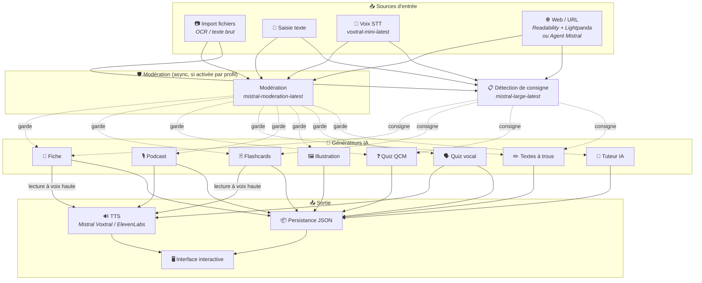
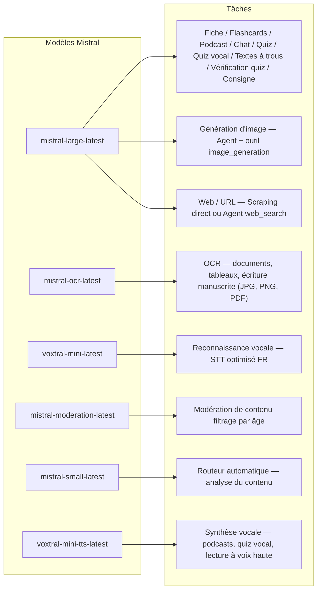
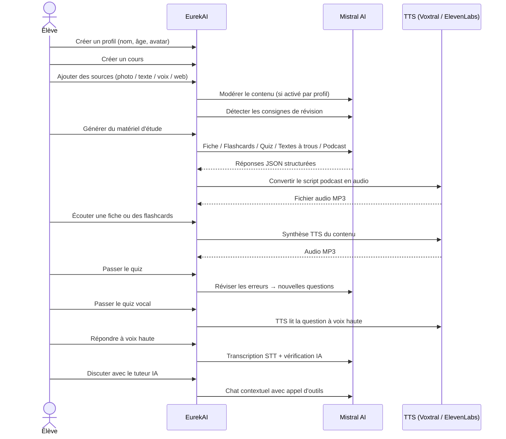

<p align="center">
  
</p>

<h1 align="center">EurekAI</h1>

<p align="center">
  <strong>حوّل أي محتوى إلى تجربة تعلم تفاعلية — مدعومة بواسطة <a href="https://mistral.ai">Mistral AI</a>.</strong>
</p>

<p align="center">
  <a href="README-en.md">🇬🇧 الإنجليزية</a> · <a href="README-es.md">🇪🇸 الإسبانية</a> · <a href="README-pt.md">🇧🇷 البرتغالية</a> · <a href="README-de.md">🇩🇪 الألمانية</a> · <a href="README-it.md">🇮🇹 الإيطالية</a> · <a href="README-nl.md">🇳🇱 الهولندية</a> · <a href="README-ar.md">🇸🇦 العربية</a><br>
  <a href="README-hi.md">🇮🇳 الهندية</a> · <a href="README-zh.md">🇨🇳 الصينية</a> · <a href="README-ja.md">🇯🇵 اليابانية</a> · <a href="README-ko.md">🇰🇷 الكورية</a> · <a href="README-pl.md">🇵🇱 البولندية</a> · <a href="README-ro.md">🇷🇴 الرومانية</a> · <a href="README-sv.md">🇸🇪 السويدية</a>
</p>

<p align="center">
  <a href="https://www.youtube.com/watch?v=_b1TQz2leoI"></a>
</p>

<h4 align="center">📊 جودة الشيفرة</h4>

<p align="center">
  <a href="https://sonarcloud.io/summary/new_code?id=jls42_EurekAI"></a>
  <a href="https://sonarcloud.io/summary/new_code?id=jls42_EurekAI"></a>
  <a href="https://sonarcloud.io/summary/new_code?id=jls42_EurekAI"></a>
  <a href="https://sonarcloud.io/summary/new_code?id=jls42_EurekAI"></a>
</p>
<p align="center">
  <a href="https://sonarcloud.io/summary/new_code?id=jls42_EurekAI"></a>
  <a href="https://sonarcloud.io/summary/new_code?id=jls42_EurekAI"></a>
  <a href="https://sonarcloud.io/summary/new_code?id=jls42_EurekAI"></a>
  <a href="https://sonarcloud.io/summary/new_code?id=jls42_EurekAI"></a>
</p>

---

## القصة — لماذا EurekAI ؟

**EurekAI** وُلِد أثناء [Mistral AI Worldwide Hackathon](https://luma.com/mistralhack-online) ([الموقع الرسمي](https://worldwide-hackathon.mistral.ai/)) (مارس 2026). كنت بحاجة إلى فكرة — وفكرتي جاءت من شيء عملي جداً: أنا أراجع باستمرار الاختبارات مع ابنتي، وفكرت أنه يجب أن يكون بالإمكان جعل ذلك أكثر متعة وتفاعلاً باستخدام الذكاء الاصطناعي.

الهدف: أخذ **أي مدخل** — صورة للدرس، نص منسوخ ولصق، تسجيل صوتي، بحث ويب — وتحويله إلى **ملاحظات مُلخّصة، بطاقات تعليمية، اختبارات، بودكاستات، نصوص مع فراغات، توضيحات، والمزيد**. كل ذلك مدعوم بنماذج Mistral AI الفرنسية، مما يجعل الحل مناسباً بطبيعته للمتعلمين الناطقين بالفرنسية.

كان [النموذج الأولي](https://github.com/jls42/worldwide-hackathon.mistral.ai) مصمماً خلال 48 ساعة أثناء الهاكاثون كدليل مفهوم حول خدمات Mistral — كان يعمل فعلاً، لكنه محدود. منذ ذلك الحين، أصبح EurekAI مشروعاً حقيقياً: نصوص مع فراغات، تنقل داخل التمارين، سحب محتوى الويب، إشراف أبوي قابل للتكوين، مراجعة شيفرة متعمقة، والمزيد. كامل الشيفرة مُولّدة بواسطة الذكاء الاصطناعي — بشكل أساسي [Claude Code](https://code.claude.com/)، مع بعض المساهمات عبر [Codex](https://openai.com/codex/) و[Gemini CLI](https://geminicli.com/).

---

## الميزات

| | الميزة | الوصف |
|---|---|---|
| 📷 | **استيراد الملفات** | استورد دروسك — صورة، PDF (عبر Mistral OCR) أو ملف نصي (TXT, MD) |
| 📝 | **إدخال نصي** | اكتب أو ألصق أي نص مباشرة |
| 🎤 | **إدخال صوتي** | سجّل صوتك — Voxtral STT ينقل كلامك إلى نص |
| 🌐 | **الويب / URL** | ألصق عنوان ويب (سحب المحتوى مباشرة عبر Readability + Lightpanda) أو اكتب بحثاً (Agent Mistral web_search) |
| 📄 | **ملاحظات المراجعة** | ملاحظات مُنظَّمة مع نقاط رئيسية، مفردات، اقتباسات، حكايات |
| 🃏 | **بطاقات تعليمية** | بطاقات سؤال/جواب مع مراجع للمصادر للحفظ النشط (عدد قابل للتعديل) |
| ❓ | **اختبار اختيار من متعدد** | أسئلة متعددة الاختيارات مع مراجعة تكيفية للأخطاء (عدد قابل للتعديل) |
| ✏️ | **نصوص مع فراغات** | تمارين لملء الفراغات مع دلائل وتحقق متسامح |
| 🎙️ | **بودكاست** | بودكاست قصير بصوتين — صوت Mistral افتراضياً أو أصوات مخصصة (الآباء!) |
| 🖼️ | **صور توضيحية** | صور تعليمية مولدة بواسطة Agent Mistral |
| 🗣️ | **اختبار صوتي** | أسئلة تقرأ بصوت عالٍ (يمكن استخدام صوت مخصص)، إجابة شفهية، تحقق بواسطة الذكاء الاصطناعي |
| 💬 | **مدرّس ذكي** | دردشة سياقية مع مستندات دروسك، مع استدعاء أدوات |
| 🧠 | **موجّه تلقائي** | موجّه قائم على `mistral-small-latest` يحلل المحتوى ويقترح مزيجاً من المولّدات بين الأنواع السبعة المتوفرة |
| 🔒 | **ضبط أبوي** | إشراف قابل للتكوين حسب الملف الشخصي (فئات قابلة للتخصيص)، رقم PIN أبوي، قيود الدردشة |
| 🌍 | **متعدد اللغات** | واجهة متاحة بـ9 لغات؛ التوليد عبر الذكاء الاصطناعي قابل للتشغيل في 15 لغة عبر الـ prompts |
| 🔊 | **القراءة بصوت عالٍ** | استمع للملاحظات والبطاقات عبر Mistral Voxtral TTS أو ElevenLabs |

---

## نظرة عامة على البنية



---

## خريطة استخدام النماذج



---

## مسار المستخدم



---

## غوص عميق — الميزات

### المدخلات متعددة الوسائط

EurekAI تقبل 4 أنواع من المصادر، يتم إشرافها بحسب الملف الشخصي (مفعّل افتراضياً للطفل والمراهق):

- **استيراد الملفات** — ملفات JPG, PNG أو PDF تُعالَج بواسطة `mistral-ocr-latest` (نص مطبوع، جداول، خط يد)، أو ملفات نصية (TXT, MD) تُستَورَد مباشرة.
- **نص حر** — اكتب أو ألصق أي محتوى. يخضع للإشراف قبل التخزين إذا كان الإشراف مفعّلاً.
- **إدخال صوتي** — سجّل صوتاً في المتصفح. يُحوّل إلى نص بواسطة `voxtral-mini-latest`. المعامل `language="fr"` يحسّن التعرف.
- **الويب / URL** — ألصق عنوان أو عدة عناوين URL لسحب المحتوى مباشرة (Readability + Lightpanda للصفحات JS)، أو اكتب كلمات مفتاحية للبحث عبر Agent Mistral. الحقل الواحد يقبل الاثنين — عناوين URL والكلمات المفتاحية يتم فصلهما تلقائياً، وكل نتيجة تنشئ مصدراً مستقلاً.

### توليد المحتوى بواسطة الذكاء الاصطناعي

سبعة أنواع من مواد التعلم المولدة:

| المولِّد | النموذج | المخرَج |
|---|---|---|
| **ملاحظة مراجعة** | `mistral-large-latest` | عنوان، ملخص، نقاط رئيسية، مفردات، اقتباسات، حكاية |
| **بطاقات تعليمية** | `mistral-large-latest` | بطاقات سؤال/جواب مع مراجع للمصادر (عدد قابل للتعديل) |
| **اختبار اختيار من متعدد** | `mistral-large-latest` | أسئلة متعددة الاختيارات، شروحات، مراجعة تكيفية (عدد قابل للتعديل) |
| **نصوص مع فراغات** | `mistral-large-latest` | جمل لملئها مع دلائل، تحقق متسامح (Levenshtein) |
| **بودكاست** | `mistral-large-latest` + Voxtral TTS | نص بصوتين → ملف صوتي MP3 |
| **رسم توضيحي** | Agent `mistral-large-latest` | صورة تعليمية عبر الأداة `image_generation` |
| **اختبار صوتي** | `mistral-large-latest` + Voxtral TTS + STT | أسئلة TTS → إجابة STT → تحقق بواسطة الذكاء الاصطناعي |

### المدرّس الذكي عبر الدردشة

مدرّس محادثة مع وصول كامل لمستندات الدروس:

- يستخدم `mistral-large-latest`
- **استدعاء أدوات** : يمكنه توليد ملاحظات، بطاقات، اختبارات أو نصوص مع فراغات أثناء المحادثة
- سجل محادثة 50 رسالة لكل مقرر
- إشراف على المحتوى إذا كان مفعّلاً للملف الشخصي

### الموجّه التلقائي

الموجّه يستخدم `mistral-small-latest` لتحليل محتوى المصادر ويقترح المولّدات الأكثر ملاءمة من بين السبعة المتوفرة. الواجهة تعرض التقدم في الوقت الحقيقي: أولاً مرحلة التحليل، ثم التوليدات الفردية مع إمكانية الإلغاء.

### التعلم التكيّفي

- **إحصاءات الاختبارات** : تتبع المحاولات والدقة لكل سؤال
- **مراجعة الاختبارات** : يولّد 5-10 أسئلة جديدة تستهدف المفاهيم الضعيفة
- **كشف التعليمات** : يكتشف تعليمات المراجعة ("Je sais ma leçon si je sais...") ويعطيها أولوية في المولّدات النصية المتوافقة (ملاحظة، بطاقات، اختبار، نصوص مع فراغات)

### الأمان والضبط الأبوي

- **4 مجموعات عمرية** : طفل (≤10 سنوات)، مراهق (11-15)، طالب (16-25)، بالغ (26+)
- **إشراف المحتوى** : `mistral-moderation-latest` مع 10 فئات متاحة، 5 محجوبة افتراضياً للطفل/المراهق (`sexual`, `hate_and_discrimination`, `violence_and_threats`, `selfharm`, `jailbreaking`). الفئات قابلة للتخصيص حسب الملف الشخصي في الإعدادات.
- **PIN أبوي** : تجزئة SHA-256، مطلوبة للملفات الشخصية دون 15 سنة. لنشر في الإنتاج، يُنصح بتجزئة بطيئة مع ملح (Argon2id, bcrypt).
- **قيود الدردشة** : دردشة الذكاء الاصطناعي معطّلة افتراضياً لمن هم دون 16 عاماً، ويمكن تفعيلها بواسطة الأهل

### نظام متعدد الملفات الشخصية

- ملفات شخصية متعددة مع اسم، عمر، صورة رمزية، تفضيلات اللغة
- مشاريع مرتبطة بالملفات الشخصية عبر `profileId`
- حذف متسلسل: حذف ملف شخصي يحذف جميع مشروعاته

### TTS مزوّد بعدة موفّرين وأصوات مخصصة

- **Mistral Voxtral TTS** (افتراضي) : `voxtral-mini-tts-latest`، لا حاجة لمفتاح إضافي
- **ElevenLabs** (بديل) : `eleven_v3`، أصوات طبيعية، يتطلب `ELEVENLABS_API_KEY`
- المزوّد قابل للتكوين في إعدادات التطبيق
- **أصوات مخصصة** : يمكن للوالدين إنشاء أصواتهم عبر API Mistral Voices (ابتداءً من عينة صوتية) وتعيينها للأدوار المضيف/ضيف — حينها تُقرأ البودكاستات والاختبارات الصوتية بصوت أحد الوالدين، مما يجعل التجربة أكثر غمراً للطفل
- دوران صوتيان قابلان للتكوين: **المضيف** (الراوي الرئيسي) و **الضيف** (الصوت الثاني في البودكاست)
- كتالوج كامل لأصوات Mistral متاح في الإعدادات، قابل للتصفية حسب اللغة

### التدويل

- الواجهة متاحة في 9 لغات: fr, en, es, pt, it, nl, de, hi, ar
- prompts الذكاء الاصطناعي تدعم 15 لغة (fr, en, es, de, it, pt, nl, ja, zh, ko, ar, hi, pl, ro, sv)
- اللغة قابلة للتكوين حسب الملف الشخصي

---

## الستاك التقني

| الطبقة | التقنية | الدور |
|---|---|---|
| **بيئة التشغيل** | Node.js + TypeScript 6.x | الخادم وضمان الأنواع |
| **الخلفية** | Express 5.x | واجهة برمجة تطبيقات REST |
| **خادم التطوير** | Vite 8.x (Rolldown) + tsx | HMR، partials Handlebars، بروكسي |
| **الواجهة** | HTML + TailwindCSS 4.x + Alpine.js 3.x | واجهة تفاعلية، TypeScript يتم تجميعه بواسطة Vite |
| **التمبليت** | vite-plugin-handlebars | تكوين HTML عبر partials |
| **الذكاء الاصطناعي** | Mistral AI SDK 2.x | دردشة، OCR، STT، TTS، Agents، إشراف |
| **TTS (افتراضي)** | Mistral Voxtral TTS | `voxtral-mini-tts-latest`، توليف صوتي مدمج |
| **TTS (بديل)** | ElevenLabs SDK 2.x | `eleven_v3`، أصوات طبيعية |
| **الرموز** | Lucide 1.x | مكتبة أيقونات SVG |
| **سحب الويب** | Readability + linkedom | استخراج المحتوى الرئيسي من صفحات الويب (تقنية Firefox Reader View) |
| **متصفح بدون رأس** | Lightpanda | متصفح headless خفيف جداً (Zig + V8) للصفحات JS/SPA — احتياطي للسحب |
| **ماركدوان** | Marked | عرض الماركداون في الدردشة |
| **رفع ملفات** | Multer 2.x | معالجة نماذج multipart |
| **الصوت** | ffmpeg-static | دمج مقاطع الصوت |
| **الاختبارات** | Vitest | اختبارات وحدة — التغطية مقاسة عبر SonarCloud |
| **الاستمرارية** | ملفات JSON | تخزين بدون اعتماديات خارجية |

---

## مرجع النماذج

| النموذج | الاستخدام | لماذا |
|---|---|---|
| `mistral-large-latest` | ملاحظة، بطاقات، بودكاست، اختبار، نصوص مع فراغات، دردشة، تحقق من الاختبار الصوتي، Agent صورة، Agent بحث ويب، كشف التعليمات | أفضل دعم متعدد اللغات + تتبع التعليمات |
| `mistral-ocr-latest` | OCR للمستندات | نص مطبوع، جداول، خط يد |
| `voxtral-mini-latest` | تعرف صوتي (STT) | STT متعدد اللغات، مُحسّن مع `language="fr"` |
| `voxtral-mini-tts-latest` | توليف صوتي (TTS) | بودكاستات، اختبار صوتي، قراءة بصوت عالٍ |
| `mistral-moderation-latest` | إشراف المحتوى | 5 فئات محجوبة للطفل/المراهق (+ jailbreaking) |
| `mistral-small-latest` | الموجّه التلقائي | تحليل سريع للمحتوى لاتخاذ قرارات التوجيه |
| `eleven_v3` (ElevenLabs) | توليف صوتي (TTS بديل) | أصوات طبيعية، بديل قابل للتكوين |

---

## بداية سريعة

```bash
# Cloner le dépôt
git clone https://github.com/jls42/EurekAI.git
cd EurekAI

# Installer les dépendances
npm install

# Configurer les clés API
cp .env.example .env
# Éditez .env avec vos clés :
#   MISTRAL_API_KEY=votre_clé_ici           (requis)
#   ELEVENLABS_API_KEY=votre_clé_ici        (optionnel, TTS alternatif)
#   SONAR_TOKEN=...                          (optionnel, CI SonarCloud uniquement)

# Lancer le développement
npm run dev
# → Backend :  http://localhost:3000 (API)
# → Frontend : http://localhost:5173 (serveur Vite avec HMR)
```

> **ملاحظة** : Mistral Voxtral TTS هو المزوّد الافتراضي — لا حاجة لمفتاح إضافي بخلاف `MISTRAL_API_KEY`. ElevenLabs هو مزوّد TTS بديل قابل للتكوين في الإعدادات.

---

## بنية المشروع

```
server.ts                 — Point d'entrée Express, monte les routes + config
config.ts                 — Config runtime (modèles, voix, TTS provider), persistée dans output/config.json
store.ts                  — ProjectStore : CRUD projets/sources/générations, persistance JSON
profiles.ts               — ProfileStore : gestion des profils, hachage PIN
types.ts                  — Types TypeScript : Source, Generation (7 types), QuizStats, Profile
prompts.ts                — Tous les prompts IA centralisés (system + user templates, 15 langues)

generators/
  ocr.ts                  — OCR via Mistral (JPG, PNG, PDF)
  summary.ts              — Génération de fiche de révision (JSON structuré)
  flashcards.ts           — Flashcards Q/R (5-50, configurable)
  quiz.ts                 — Quiz QCM (5-50 questions, configurable) + révision adaptative
  fill-blank.ts           — Exercices à trous avec validation tolérante
  podcast.ts              — Script podcast 2 voix
  quiz-vocal.ts           — Quiz vocal : questions TTS + réponses STT + vérification IA
  image.ts                — Génération d'image via Agent Mistral (outil image_generation)
  chat.ts                 — Tuteur IA par chat avec appel d'outils
  router.ts               — Routeur automatique (contenu → générateurs recommandés)
  consigne.ts             — Détection de consignes de révision
  tts-provider.ts         — Dispatch TTS multi-provider (Mistral Voxtral / ElevenLabs)
  tts.ts                  — Génération audio podcast (concaténation de segments)
  stt.ts                  — Voxtral STT (audio → texte)
  websearch.ts            — Agent Mistral avec outil web_search (fallback)
  moderation.ts           — Modération de contenu (filtrage par âge)

routes/
  projects.ts             — CRUD projets
  profiles.ts             — CRUD profils avec gestion du PIN
  sources.ts              — Import fichiers (OCR + texte brut), texte libre, voix STT, scraping URL + recherche web, modération
  generate.ts             — Endpoints de génération (7 types + auto + route)
  generations.ts          — Tentatives de quiz/fill-blank, réponses vocales, lecture à voix haute
  chat.ts                 — Chat IA avec appel d'outils

helpers/
  index.ts                — getContent, stripJsonMarkdown, safeParseJson, unwrapJsonArray, extractAllText, timer
  audio.ts                — collectStream (ReadableStream → Buffer)
  fill-blank-validate.ts  — Validation tolérante des réponses (normalisation, Levenshtein)
  diversity.ts            — Diversité des générations (exclusion du contenu déjà produit, randomSeed)

src/                      — Frontend (Vite + Handlebars)
  index.html              — Point d'entrée HTML principal
  main.ts                 — Entrée frontend (init Alpine.js + icônes Lucide)
  app/                    — Modules applicatifs Alpine.js
    state.ts              — Gestion d'état réactif
    navigation.ts         — Routage des vues + gardes par âge
    profiles.ts           — Logique du sélecteur de profils
    projects.ts           — CRUD des cours
    sources.ts            — Gestionnaires d'upload de sources
    generate.ts           — Déclencheurs de génération (individuel, tout, auto 2 phases)
    generations.ts        — Affichage + actions sur les générations
    chat.ts               — Interface de chat
    config.ts             — Interface de configuration (modèles, voix, TTS provider)
    render.ts             — Helpers de rendu HTML
    i18n.ts               — Changement de langue
    ...
  components/
    quiz.ts               — Composant quiz interactif
    quiz-vocal.ts         — Composant quiz vocal
    fill-blank.ts         — Composant textes à trous
    flashcards.ts         — Composant flashcards avec retournement
    step-by-step.ts       — Mixin navigation pas-à-pas (quiz, fill-blank, flashcards)
  i18n/
    fr.ts, en.ts, es.ts, — Dictionnaires par langue (9 langues)
    pt.ts, it.ts, nl.ts,
    de.ts, hi.ts, ar.ts
    languages.ts          — Registre des langues UI disponibles
    index.ts              — Chargeur i18n
  partials/               — Partials HTML Handlebars (header, sidebar, dialogues, vues)
  styles/
    main.css              — Entrée TailwindCSS
    theme.css             — Variables de thème personnalisées

public/assets/            — Ressources statiques (logo, avatars)
output/                   — Données d'exécution (projets, config, fichiers audio)
```

---

## مرجع API

### الإعداد
| طريقة | Endpoint | الوصف |
|---|---|---|
| `GET` | `/api/config` | الإعداد الحالي |
| `PUT` | `/api/config` | تعديل الإعداد (النماذج، الأصوات، موفّر TTS) |
| `GET` | `/api/config/status` | حالة الـ APIs (Mistral, ElevenLabs, TTS) |
| `POST` | `/api/config/reset` | إعادة الإعداد إلى الافتراضي |
| `GET` | `/api/config/voices` | سرد أصوات Mistral TTS (اختياري `?lang=fr`) |
| `GET` | `/api/moderation-categories` | فئات الإشراف المتاحة + الافتراضات حسب العمر |

### الملفات الشخصية
| طريقة | Endpoint | الوصف |
|---|---|---|
| `GET` | `/api/profiles` | سرد كل الملفات الشخصية |
| `POST` | `/api/profiles` | إنشاء ملف شخصي |
| `PUT` | `/api/profiles/:id` | تعديل ملف شخصي (PIN مطلوب لأقل من 15 سنة) |
| `DELETE` | `/api/profiles/:id` | حذف ملف شخصي + حذف متسلسل للمشاريع `{pin?}` → `{ok, deletedProjects}` |

### المشاريع
| طريقة | Endpoint | الوصف |
|---|---|---|
| `GET` | `/api/projects` | سرد المشاريع (`?profileId=` اختياري) |
| `POST` | `/api/projects` | إنشاء مشروع `{name, profileId}` |
| `GET` | `/api/projects/:pid` | تفاصيل المشروع |
| `PUT` | `/api/projects/:pid` | إعادة تسمية `{name}` |
| `DELETE` | `/api/projects/:pid` | حذف المشروع |

### المصادر
| طريقة | Endpoint | الوصف |
|---|---|---|
| `POST` | `/api/projects/:pid/sources/upload` | استيراد ملفات multipart (OCR لـ JPG/PNG/PDF، قراءة مباشرة لـ TXT/MD) |
| `POST` | `/api/projects/:pid/sources/text` | نص حر `{text}` |
| `POST` | `/api/projects/:pid/sources/voice` | صوت STT (audio multipart) |
| `POST` | `/api/projects/:pid/sources/websearch` | سحب URL أو بحث ويب `{query}` — يرجع مصفوفة من المصادر |
| `DELETE` | `/api/projects/:pid/sources/:sid` | حذف مصدر |
| `POST` | `/api/projects/:pid/moderate` | إشراف `{text}` |
| `POST` | `/api/projects/:pid/detect-consigne` | كشف تعليمات المراجعة | ### التوليد
| الطريقة | Endpoint | الوصف |
|---|---|---|
| `POST` | `/api/projects/:pid/generate/summary` | بطاقة مراجعة |
| `POST` | `/api/projects/:pid/generate/flashcards` | بطاقات مراجعة |
| `POST` | `/api/projects/:pid/generate/quiz` | اختبار اختيار من متعدد (QCM) |
| `POST` | `/api/projects/:pid/generate/fill-blank` | نصوص للإكمال (املأ الفراغات) |
| `POST` | `/api/projects/:pid/generate/podcast` | بودكاست |
| `POST` | `/api/projects/:pid/generate/image` | توضيح/رسم توضيحي |
| `POST` | `/api/projects/:pid/generate/quiz-vocal` | اختبار صوتي |
| `POST` | `/api/projects/:pid/generate/quiz-review` | مراجعة تكيفية `{generationId, weakQuestions}` |
| `POST` | `/api/projects/:pid/generate/route` | تحليل التوجيه (خطة المولّدات التي يجب تشغيلها) |
| `POST` | `/api/projects/:pid/generate/auto` | التوليد التلقائي للخلفية (التوجيه + 5 أنواع : summary, flashcards, quiz, fill-blank, podcast) |

جميع مسارات التوليد تقبل `{sourceIds?, lang?, ageGroup?, count?, useConsigne?}`. `quiz-review` يتطلب بالإضافة إلى ذلك `{generationId, weakQuestions}`.

### CRUD التوليدات
| الطريقة | Endpoint | الوصف |
|---|---|---|
| `POST` | `/api/projects/:pid/generations/:gid/quiz-attempt` | إرسال إجابات الاختبار `{answers}` |
| `POST` | `/api/projects/:pid/generations/:gid/fill-blank-attempt` | إرسال إجابات نصوص الإكمال `{answers}` |
| `POST` | `/api/projects/:pid/generations/:gid/vocal-answer` | التحقق من إجابة شفهية (audio + questionIndex) |
| `POST` | `/api/projects/:pid/generations/:gid/read-aloud` | قراءة TTS بصوت عالٍ (بطاقات/فلاش كارد) |
| `PUT` | `/api/projects/:pid/generations/:gid` | إعادة تسمية `{title}` |
| `DELETE` | `/api/projects/:pid/generations/:gid` | حذف التوليد |

### الدردشة
| الطريقة | Endpoint | الوصف |
|---|---|---|
| `GET` | `/api/projects/:pid/chat` | استرجاع سجل الدردشة |
| `POST` | `/api/projects/:pid/chat` | إرسال رسالة `{message, lang, ageGroup}` |
| `DELETE` | `/api/projects/:pid/chat` | مسح سجل الدردشة |

---

## القرارات المعمارية

| القرار | المبرر |
|---|---|
| **Alpine.js بدلاً من React/Vue** | بصمة صغيرة، تفاعل خفيف مع TypeScript المترجم بواسطة Vite. مثالي لهاكاثون حيث السرعة مهمة. |
| **التخزين المستمر في ملفات JSON** | بدون تبعيات، تشغيل فوري. لا حاجة لإعداد قاعدة بيانات — نبدأ مباشرة. |
| **Vite + Handlebars** | أفضل ما في العالمين: HMR سريع للتطوير، partials HTML لتنظيم الكود، Tailwind JIT. |
| **نصوص الإدخال (prompts) المركزية** | جميع prompts الذكاء الاصطناعي في `prompts.ts` — سهل التكرار والاختبار والتكييف بحسب اللغة/الفئة العمرية. |
| **نظام التوليدات المتعدد** | كل توليد كائن مستقل بمعرّف خاص به — يسمح بعدة بطاقات، اختبارات، إلخ لكل درس. |
| **نصوص مكيّفة حسب العمر** | 4 فئات عمرية مع مفردات، تعقيد ونبرة مختلفة — نفس المحتوى يُعلّم بشكل مختلف حسب المتعلّم. |
| **ميزات مبنية على الوكلاء (Agents)** | توليد الصور والبحث على الويب يستخدم وكلاء Mistral مؤقتين — دورة حياة نظيفة مع تنظيف تلقائي. |
| **استخلاص ذكي للـ URLs** | حقل واحد يقبل الروابط وكلمات البحث معًا — الروابط تُستخرج عبر Readability (صفحات ثابتة) مع حل احتياطي Lightpanda (صفحات JS/SPA)، وكلمات البحث تفعّل وكيل Mistral web_search. كل نتيجة تنشئ مصدرًا مستقلًا. |
| **TTS متعدد المزودين** | Mistral Voxtral TTS افتراضيًا (بدون مفتاح إضافي)، ElevenLabs كخيار بديل — قابل للتكوين دون إعادة تشغيل. |

---

## الاعتمادات والشكر

- **[Mistral AI](https://mistral.ai)** — نماذج الذكاء الاصطناعي (Large, OCR, Voxtral STT, Voxtral TTS, Moderation, Small) + هاكاثون عالمي
- **[ElevenLabs](https://elevenlabs.io)** — محرك تحويل النص إلى كلام بديل (`eleven_v3`)
- **[Alpine.js](https://alpinejs.dev)** — إطار تفاعلي خفيف
- **[TailwindCSS](https://tailwindcss.com)** — إطار CSS وظيفي
- **[Vite](https://vitejs.dev)** — أداة بناء للواجهة الأمامية
- **[Lucide](https://lucide.dev)** — مكتبة أيقونات
- **[Marked](https://marked.js.org)** — مُحلل Markdown
- **[Readability](https://github.com/mozilla/readability)** — استخراج محتوى الويب (تقنية Firefox Reader View)
- **[Lightpanda](https://lightpanda.io)** — متصفح headless خفيف جدًا لاستخلاص صفحات JS/SPA

انطلق أثناء Mistral AI Worldwide Hackathon (مارس 2026)، وتم تطويره بالكامل بواسطة الذكاء الاصطناعي مع [Claude Code](https://code.claude.com/)، [Codex](https://openai.com/codex/) و [Gemini CLI](https://geminicli.com/).

---

## المؤلف

**Julien LS** — [contact@jls42.org](mailto:contact@jls42.org)

## الترخيص

[AGPL-3.0](LICENSE) — حقوق النشر (C) 2026 Julien LS

**تمت ترجمة هذا المستند من النسخة الفرنسية إلى اللغة العربية باستخدام النموذج gpt-5-mini. لمزيد من المعلومات حول عملية الترجمة، اطلع على https://gitlab.com/jls42/ai-powered-markdown-translator**

