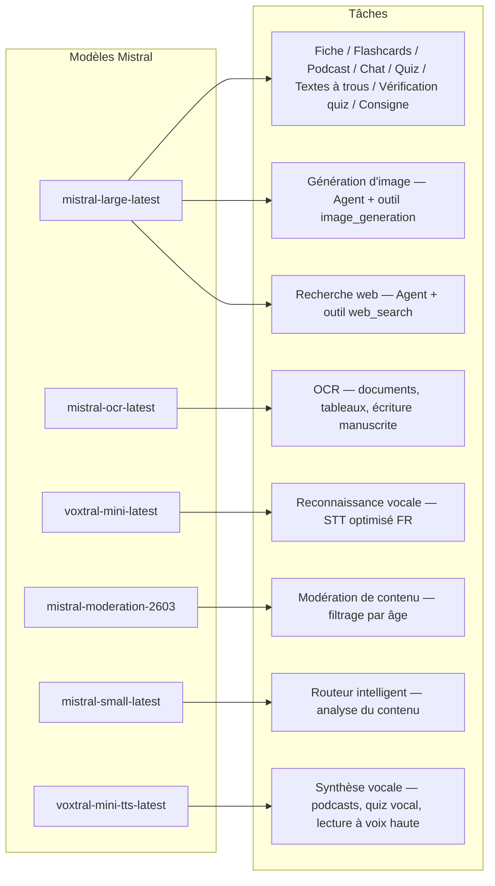
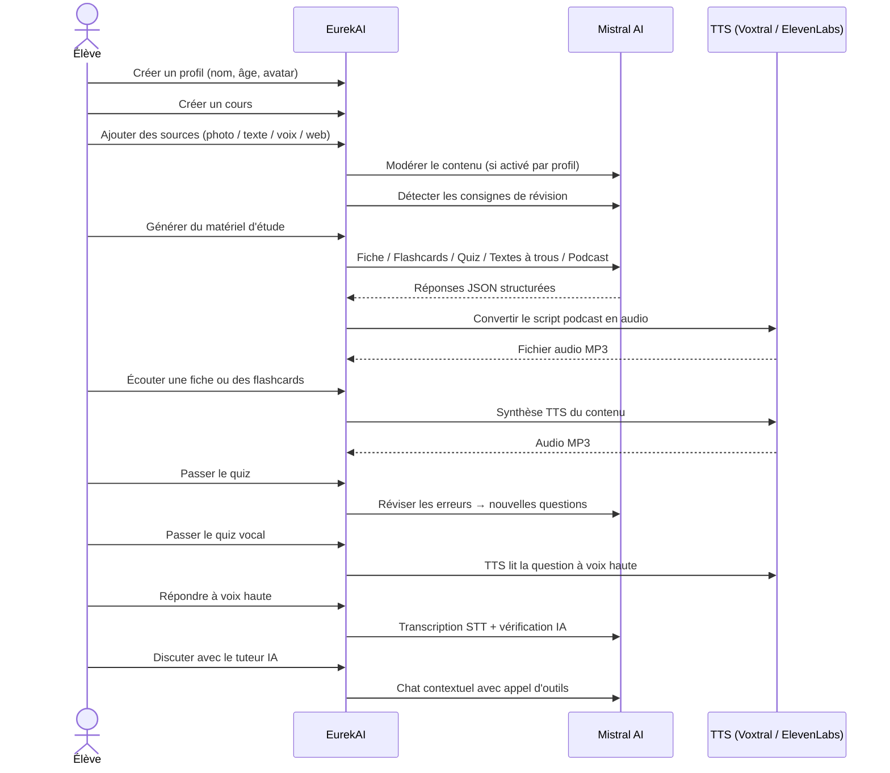

<p align="center">
  
</p>

<h1 align="center">EurekAI</h1>

<p align="center">
  <strong>حوّل أي محتوى إلى تجربة تعلم تفاعلية — مدعومة بواسطة <a href="https://mistral.ai">Mistral AI</a>.</strong>
</p>

<p align="center">
  <a href="README-en.md">🇬🇧 الإنجليزية</a> · <a href="README-es.md">🇪🇸 الإسبانية</a> · <a href="README-pt.md">🇧🇷 البرتغالية</a> · <a href="README-de.md">🇩🇪 الألمانية</a> · <a href="README-it.md">🇮🇹 الإيطالية</a> · <a href="README-nl.md">🇳🇱 الهولندية</a> · <a href="README-ar.md">🇸🇦 العربية</a><br>
  <a href="README-hi.md">🇮🇳 الهندية</a> · <a href="README-zh.md">🇨🇳 الصينية</a> · <a href="README-ja.md">🇯🇵 اليابانية</a> · <a href="README-ko.md">🇰🇷 الكورية</a> · <a href="README-pl.md">🇵🇱 البولندية</a> · <a href="README-ro.md">🇷🇴 الرومانية</a> · <a href="README-sv.md">🇸🇪 السويدية</a>
</p>

<p align="center">
  <a href="https://www.youtube.com/watch?v=_b1TQz2leoI"></a>
</p>

<h4 align="center">📊 جودة الكود</h4>

<p align="center">
  <a href="https://sonarcloud.io/summary/new_code?id=jls42_EurekAI"></a>
  <a href="https://sonarcloud.io/summary/new_code?id=jls42_EurekAI"></a>
  <a href="https://sonarcloud.io/summary/new_code?id=jls42_EurekAI"></a>
  <a href="https://sonarcloud.io/summary/new_code?id=jls42_EurekAI"></a>
</p>
<p align="center">
  <a href="https://sonarcloud.io/summary/new_code?id=jls42_EurekAI"></a>
  <a href="https://sonarcloud.io/summary/new_code?id=jls42_EurekAI"></a>
  <a href="https://sonarcloud.io/summary/new_code?id=jls42_EurekAI"></a>
  <a href="https://sonarcloud.io/summary/new_code?id=jls42_EurekAI"></a>
</p>

---

## القصة — لماذا EurekAI ؟

**EurekAI** وُلدت أثناء [الهاكاثون العالمي لـ Mistral AI](https://luma.com/mistralhack-online) ([الموقع الرسمي](https://worldwide-hackathon.mistral.ai/)) (مارس 2026). كنت بحاجة إلى فكرة — وفكرتي جاءت من شيء عملي جداً: أعد الاختبارات بانتظام مع ابنتي، وفكرت أنه من الممكن جعل هذه العملية أكثر تسلية وتفاعلية بفضل الذكاء الاصطناعي.

الهدف: أخذ **أي مدخل** — صورة من الكتاب، نص منسوخ، تسجيل صوتي، بحث ويب — وتحويله إلى **مُلخصات للمراجعة، بطاقات ذاكرة، اختبارات، بودكاست، نصوص لملء الفراغات، رسومات توضيحية، والمزيد**. كل ذلك مدعوم بواسطة نماذج Mistral AI الفرنسية، مما يجعل الحل ملائماً بشكل طبيعي للتلاميذ الناطقين بالفرنسية.

كل سطر كود كُتب أثناء الهاكاثون. جميع واجهات برمجة التطبيقات والمكتبات مفتوحة المصدر مستخدمة وفق قواعد الهاكاثون.

---

## الميزات

| | الميزة | الوصف |
|---|---|---|
| 📷 | **Upload OCR** | التقط صورة لكتابك أو ملاحظاتك — يقوم Mistral OCR باستخراج المحتوى |
| 📝 | **إدخال نص** | اكتب أو الصق أي نص مباشرة |
| 🎤 | **إدخال صوتي** | سجّل صوتك — يقوم Voxtral STT بتحويل صوتك إلى نص |
| 🌐 | **بحث ويب** | اطرح سؤالًا — وكيل Mistral يبحث عن الإجابات على الويب |
| 📄 | **ملخصات المراجعة** | ملاحظات مُنظّمة مع نقاط رئيسية، مفردات، اقتباسات، حكايات |
| 🃏 | **بطاقات تعليمية** | 5-50 بطاقة سؤال/جواب مع مراجع للمصادر للحفظ النشط |
| ❓ | **اختبار اختيار من متعدد (QCM)** | 5-50 سؤالاً مع اختيارات متعددة وشرح ومراجعة تكيفية للأخطاء |
| ✏️ | **نصوص لملء الفراغات** | تمارين لملء الفراغات مع تلميحات وتصحيح متسامح |
| 🎙️ | **بودكاست** | بودكاست صغير بصوتين محول إلى صوت عبر Mistral Voxtral TTS |
| 🖼️ | **رسوم توضيحية** | صور تعليمية مُولدة بواسطة وكيل Mistral |
| 🗣️ | **اختبار صوتي** | أسئلة مقروءة بصوت عالٍ، إجابة شفهية، الذكاء الاصطناعي يتحقق من الإجابة |
| 💬 | **مدرّس بالذكاء الاصطناعي** | دردشة سياقية مع مستنداتك الدراسية، مع إمكانية استدعاء الأدوات |
| 🧠 | **موجّه ذكي** | الذكاء الاصطناعي يحلل المحتوى ويوصي بالمولّدات الأكثر ملاءمة من بين 7 متوفرين |
| 🔒 | **رقابة الوالدين** | تصفية حسب العمر، رمز PIN للوالدين، قيود الدردشة |
| 🌍 | **متعدد اللغات** | الواجهة ومحتوى الذكاء الاصطناعي متوفران بالكامل بالفرنسية والإنجليزية |
| 🔊 | **القراءة بصوت عالٍ** | استمع إلى الملخصات والبطاقات عبر Mistral Voxtral TTS أو ElevenLabs |

---

## نظرة عامة على البنية


---

## خريطة استخدام النماذج



---

## مسار المستخدم



---

## نظرة متعمقة — الميزات

### إدخال متعدد الوسائط

EurekAI تقبل 4 أنواع من المصادر، مع تصفية حسب الملف الشخصي (مفعّلة افتراضياً للأطفال والمراهقين) :

- **Upload OCR** — ملفات JPG, PNG أو PDF معالجة بواسطة `mistral-ocr-latest`. يتعامل مع النص المطبوع، الجداول والكتابة اليدوية.
- **نص حر** — اكتب أو الصق أي محتوى. يخضع للتصفية قبل التخزين إذا كانت التصفية مفعّلة.
- **إدخال صوتي** — سجّل الصوت في المتصفح. يتم تحويله إلى نص بواسطة `voxtral-mini-latest`. الإعداد `language="fr"` يُحسّن التعرف.
- **بحث ويب** — أدخل استعلامًا. وكيل Mistral مؤقت مع الأداة `web_search` يجلب ويلخّص النتائج.

### توليد محتوى بالذكاء الاصطناعي

سبعة أنواع من المواد التعليمية المولّدة :

| المولد | النموذج | المخرجات |
|---|---|---|
| **ملخص مراجعة** | `mistral-large-latest` | عنوان، ملخص، 10-25 نقاط رئيسية، مفردات، اقتباسات، حكاية |
| **بطاقات تعليمية** | `mistral-large-latest` | 5-50 بطاقة سؤال/جواب مع مراجع للمصادر للحفظ النشط |
| **اختبار QCM** | `mistral-large-latest` | 5-50 سؤالاً، 4 خيارات لكل سؤال، شروحات، مراجعة تكيفية |
| **نصوص لملء الفراغات** | `mistral-large-latest` | جمل لملئها مع تلميحات وتصحيح متسامح (Levenshtein) |
| **بودكاست** | `mistral-large-latest` + Voxtral TTS | نص بصوتين → ملف صوتي MP3 |
| **رسوم توضيحية** | وكيل `mistral-large-latest` | صورة تعليمية عبر الأداة `image_generation` |
| **اختبار صوتي** | `mistral-large-latest` + Voxtral TTS + STT | أسئلة محوّلة إلى كلام → إجابة صوتية → تحقق بواسطة الذكاء الاصطناعي |

### مدرس بالذكاء الاصطناعي عبر الدردشة

مدرّس تفاعلي مع وصول كامل إلى مستندات المقرر:

- يستخدم `mistral-large-latest`
- **استدعاء أدوات** : يمكنه توليد ملخصات، بطاقات، اختبارات أو نصوص لملء الفراغات أثناء المحادثة
- سجل محفوظات يصل إلى 50 رسالة لكل مقرر
- تصفية المحتوى إذا كانت مفعّلة للملف الشخصي

### الموجّه التلقائي الذكي

الموجّه يستخدم `mistral-small-latest` لتحليل محتوى المصادر والتوصية بالمولدات الأنسب من بين الـ7 المتاحة — حتى لا يضطر التلاميذ للاختيار يدوياً. الواجهة تعرض التقدّم في الوقت الفعلي: أولاً مرحلة التحليل، ثم التوليدات الفردية مع إمكانية الإلغاء.

### التعلم التكيفي

- **إحصائيات الاختبارات** : تتبع المحاولات والدقة لكل سؤال
- **مراجعة الاختبار** : يولد 5-10 أسئلة جديدة تستهدف المفاهيم الضعيفة
- **كشف التعليمات** : يحدد تعليمات المراجعة ("أعرف درسي إذا عرفت...") ويعطيها أولوية في جميع المولدات

### الأمان ورقابة الوالدين

- **4 فئات عمرية** : طفل (≤10 سنوات)، مراهق (11-15)، طالب (16-25)، بالغ (26+)
- **تصفية المحتوى** : `mistral-moderation-2603` مع 5 فئات محجوبة للأطفال/المراهقين (المحتوى الجنسي، الكراهية، العنف، إيذاء النفس، كسر الحماية)، ولا قيود للطالب/البالغ
- **PIN للوالدين** : هاش SHA-256، مطلوب للملفات الشخصية دون 15 سنة
- **قيود الدردشة** : دردشة الذكاء الاصطناعي معطلة افتراضياً لمن هم دون 16 عاماً، ويمكن للأهل تفعيلها

### نظام متعدد الملفات الشخصية

- ملفات شخصية متعددة بالاسم، العمر، الصورة الرمزية، تفضيلات اللغة
- مشاريع مرتبطة بالملفات الشخصية عبر `profileId`
- حذف متسلسل: حذف ملف شخصي يحذف جميع مشاريعه

### TTS متعدد المزودين

- **Mistral Voxtral TTS** (الافتراضي) : `voxtral-mini-tts-latest`، لا حاجة لمفتاح إضافي
- **ElevenLabs** (بديل) : `eleven_v3`، أصوات طبيعية، يتطلب `ELEVENLABS_API_KEY`
- يمكن اختيار المزود في إعدادات التطبيق

### التدويل

- الواجهة كاملة متاحة بالفرنسية والإنجليزية
- مطالبات الذكاء الاصطناعي تدعم لغتين اليوم (FR, EN) مع بنية جاهزة لـ15 لغة (es, de, it, pt, nl, ja, zh, ko, ar, hi, pl, ro, sv)
- اللغة قابلة للتعيين في الملف الشخصي

---

## البنية التقنية

| الطبقة | التكنولوجيا | الدور |
|---|---|---|
| **وقت التشغيل** | Node.js + TypeScript 5.7 | الخادم وضمان الأنواع |
| **الخلفية** | Express 4.21 | واجهة REST API |
| **خادم التطوير** | Vite 7.3 + tsx | HMR، partials Handlebars، proxy |
| **الواجهة** | HTML + TailwindCSS 4.2 + Alpine.js 3.15 | واجهة تفاعلية، TypeScript مُجمّع بواسطة Vite |
| **التضمين** | vite-plugin-handlebars | تجميع HTML عبر partials |
| **الذكاء الاصطناعي** | Mistral AI SDK 2.1 | دردشة، OCR، STT، TTS، وكلاء، تصفية المحتوى |
| **TTS (افتراضي)** | Mistral Voxtral TTS | `voxtral-mini-tts-latest`، توليف صوتي مدمج |
| **TTS (بديل)** | ElevenLabs SDK 2.36 | `eleven_v3`، أصوات طبيعية |
| **الرموز** | Lucide 0.575 | مكتبة أيقونات SVG |
| **Markdown** | Marked 17 | عرض Markdown في الدردشة |
| **رفع الملفات** | Multer 1.4 | إدارة نماذج multipart |
| **الصوت** | ffmpeg-static | دمج مقاطع الصوت |
| **الاختبارات** | Vitest 4 | اختبارات وحدات — التغطية مقاسة بواسطة SonarCloud |
| **الاستمرارية** | ملفات JSON | تخزين بدون تبعيات |

---

## مرجع النماذج

| النموذج | الاستخدام | السبب |
|---|---|---|
| `mistral-large-latest` | ملخص، بطاقات، بودكاست، اختبار، نصوص لملء الفراغات، دردشة، تحقق اختبار صوتي، وكيل صور، وكيل بحث ويب، كشف التعليمات | أفضل متعدد اللغات + اتباع التعليمات |
| `mistral-ocr-latest` | OCR للمستندات | نص مطبوع، جداول، كتابة يدوية |
| `voxtral-mini-latest` | التعرف على الصوت (STT) | STT متعدد اللغات، محسن بواسطة `language="fr"` |
| `voxtral-mini-tts-latest` | توليد الصوت (TTS) | للبودكاست، الاختبارات الصوتية، القراءة بصوت عالٍ |
| `mistral-moderation-2603` | تصفية المحتوى | 5 فئات محجوبة للأطفال/المراهقين (+ كسر الحماية) |
| `mistral-small-latest` | الموجّه الذكي | تحليل سريع للمحتوى لاتخاذ قرارات التوجيه |
| `eleven_v3` (ElevenLabs) | توليد الصوت (TTS بديل) | أصوات طبيعية، بديل قابل للتهيئة |

---

## البدء السريع

```bash
# Cloner le dépôt
git clone https://github.com/jls42/EurekAI.git
cd EurekAI

# Installer les dépendances
npm install

# Configurer les clés API
cp .env.example .env
# Éditez .env avec vos clés :
#   MISTRAL_API_KEY=votre_clé_ici           (requis)
#   ELEVENLABS_API_KEY=votre_clé_ici        (optionnel, TTS alternatif)

# Lancer le développement
npm run dev
# → Backend :  http://localhost:3000 (API)
# → Frontend : http://localhost:5173 (serveur Vite avec HMR)
```

> **ملاحظة** : Mistral Voxtral TTS هو المزود الافتراضي — لا حاجة لمفتاح إضافي بخلاف `MISTRAL_API_KEY`. ElevenLabs هو مزود TTS بديل قابل للتكوين في الإعدادات.

---

## هيكل المشروع

```
server.ts                 — Point d'entrée Express, monte les routes + config
config.ts                 — Config runtime (modèles, voix, TTS provider), persistée dans output/config.json
store.ts                  — ProjectStore : CRUD projets/sources/générations, persistance JSON
profiles.ts               — ProfileStore : gestion des profils, hachage PIN
types.ts                  — Types TypeScript : Source, Generation (7 types), QuizStats, Profile
prompts.ts                — Tous les prompts IA centralisés (system + user templates, FR/EN)

generators/
  ocr.ts                  — Upload + OCR via Mistral (JPG, PNG, PDF)
  summary.ts              — Génération de fiche de révision (JSON structuré)
  flashcards.ts           — Flashcards Q/R (5-50, configurable)
  quiz.ts                 — Quiz QCM (5-50 questions, configurable) + révision adaptative
  fill-blank.ts           — Exercices à trous avec validation tolérante
  podcast.ts              — Script podcast 2 voix
  quiz-vocal.ts           — Quiz vocal : questions TTS + réponses STT + vérification IA
  image.ts                — Génération d'image via Agent Mistral (outil image_generation)
  chat.ts                 — Tuteur IA par chat avec appel d'outils
  router.ts               — Routeur automatique intelligent (contenu → générateurs recommandés)
  consigne.ts             — Détection de consignes de révision
  tts-provider.ts         — Dispatch TTS multi-provider (Mistral Voxtral / ElevenLabs)
  tts.ts                  — Génération audio podcast (concaténation de segments)
  stt.ts                  — Voxtral STT (audio → texte)
  websearch.ts            — Agent Mistral avec outil web_search
  moderation.ts           — Modération de contenu (filtrage par âge)

routes/
  projects.ts             — CRUD projets
  profiles.ts             — CRUD profils avec gestion du PIN
  sources.ts              — Upload OCR, texte libre, voix STT, recherche web, modération
  generate.ts             — Endpoints de génération (7 types + auto + route)
  generations.ts          — Tentatives de quiz/fill-blank, réponses vocales, lecture à voix haute
  chat.ts                 — Chat IA avec appel d'outils

helpers/
  index.ts                — safeParseJson, unwrapJsonArray, extractAllText, timer
  audio.ts                — collectStream (ReadableStream → Buffer)
  fill-blank-validate.ts  — Validation tolérante des réponses (normalisation, Levenshtein)

src/                      — Frontend (Vite + Handlebars)
  index.html              — Point d'entrée HTML principal
  main.ts                 — Entrée frontend (init Alpine.js + icônes Lucide)
  app/                    — Modules applicatifs Alpine.js
    state.ts              — Gestion d'état réactif
    navigation.ts         — Routage des vues + gardes par âge
    profiles.ts           — Logique du sélecteur de profils
    projects.ts           — CRUD des cours
    sources.ts            — Gestionnaires d'upload de sources
    generate.ts           — Déclencheurs de génération (individuel, tout, auto 2 phases)
    generations.ts        — Affichage + actions sur les générations
    chat.ts               — Interface de chat
    config.ts             — Interface de configuration (modèles, voix, TTS provider)
    render.ts             — Helpers de rendu HTML
    i18n.ts               — Changement de langue
    ...
  components/
    quiz.ts               — Composant quiz interactif
    quiz-vocal.ts         — Composant quiz vocal
    fill-blank.ts         — Composant textes à trous
    flashcards.ts         — Composant flashcards avec retournement
    step-by-step.ts       — Mixin navigation pas-à-pas (quiz, fill-blank, flashcards)
  i18n/
    fr.ts                 — Traductions françaises
    en.ts                 — Traductions anglaises
    index.ts              — Chargeur i18n
  partials/               — Partials HTML Handlebars (header, sidebar, dialogues, vues)
  styles/
    main.css              — Entrée TailwindCSS
    theme.css             — Variables de thème personnalisées

public/assets/            — Ressources statiques (logo, avatars)
output/                   — Données d'exécution (projets, config, fichiers audio)
```

---

## مرجع API

### التكوين
| الطريقة | نقطة النهاية | الوصف |
|---|---|---|
| `GET` | `/api/config` | التكوين الحالي |
| `PUT` | `/api/config` | تعديل التكوين (النماذج، الأصوات، مزود TTS) |
| `GET` | `/api/config/status` | حالة واجهات البرمجة (Mistral, ElevenLabs, TTS) |
| `POST` | `/api/config/reset` | إعادة التهيئة إلى التكوين الافتراضي |
| `GET` | `/api/config/voices` | قائمة أصوات Mistral TTS (اختياري `?lang=fr`) |

### الملفات الشخصية
| الطريقة | نقطة النهاية | الوصف |
|---|---|---|
| `GET` | `/api/profiles` | سرد جميع الملفات الشخصية |
| `POST` | `/api/profiles` | إنشاء ملف شخصي |
| `PUT` | `/api/profiles/:id` | تعديل ملف شخصي (يتطلب PIN لأقل من 15 سنة) |
| `DELETE` | `/api/profiles/:id` | حذف ملف شخصي + حذف المتعلقات |

### المشاريع
| الطريقة | نقطة النهاية | الوصف |
|---|---|---|
| `GET` | `/api/projects` | سرد المشاريع |
| `POST` | `/api/projects` | إنشاء مشروع `{name, profileId}` |
| `GET` | `/api/projects/:pid` | تفاصيل المشروع |
| `PUT` | `/api/projects/:pid` | إعادة تسمية `{name}` |
| `DELETE` | `/api/projects/:pid` | حذف المشروع |

### المصادر
| الطريقة | نقطة النهاية | الوصف |
|---|---|---|
| `POST` | `/api/projects/:pid/sources/upload` | Upload OCR (ملفات multipart) |
| `POST` | `/api/projects/:pid/sources/text` | نص حر `{text}` |
| `POST` | `/api/projects/:pid/sources/voice` | صوت STT (ملفات صوتية multipart) |
| `POST` | `/api/projects/:pid/sources/websearch` | بحث ويب `{query}` |
| `DELETE` | `/api/projects/:pid/sources/:sid` | حذف مصدر |
| `POST` | `/api/projects/:pid/moderate` | تصفية `{text}` |
| `POST` | `/api/projects/:pid/detect-consigne` | كشف تعليمات المراجعة |

### التوليد
| الطريقة | نقطة النهاية | الوصف |
|---|---|---|
| `POST` | `/api/projects/:pid/generate/summary` | ملخص للمراجعة |
| `POST` | `/api/projects/:pid/generate/flashcards` | بطاقات تعليمية |
| `POST` | `/api/projects/:pid/generate/quiz` | اختبار QCM |
| `POST` | `/api/projects/:pid/generate/fill-blank` | نصوص لملء الفراغات |
| `POST` | `/api/projects/:pid/generate/podcast` | بودكاست |
| `POST` | `/api/projects/:pid/generate/image` | رسم توضيحي |
| `POST` | `/api/projects/:pid/generate/quiz-vocal` | اختبار صوتي |
| `POST` | `/api/projects/:pid/generate/quiz-review` | مراجعة تكيفية `{generationId, weakQuestions}` |
| `POST` | `/api/projects/:pid/generate/route` | تحليل التوجيه (خطة المولدات للتشغيل) |
| `POST` | `/api/projects/:pid/generate/auto` | توليد تلقائي من الخادم (توجيه + 5 أنواع : ملخص، بطاقات، اختبار، ملئ فراغ، بودكاست) |

جميع مسارات التوليد تقبل `{sourceIds?, lang?, ageGroup?, count?, useConsigne?}`.

### CRUD للتوليدات
| الطريقة | نقطة النهاية | الوصف |
|---|---|---|
| `POST` | `/api/projects/:pid/generations/:gid/quiz-attempt` | إرسال إجابات الاختبار `{answers}` |
| `POST` | `/api/projects/:pid/generations/:gid/fill-blank-attempt` | إرسال إجابات النصوص لملء الفراغات `{answers}` |
| `POST` | `/api/projects/:pid/generations/:gid/vocal-answer` | التحقق من إجابة شفهية (صوت + questionIndex) |
| `POST` | `/api/projects/:pid/generations/:gid/read-aloud` | تشغيل TTS بصوت عالٍ (ملخصات/بطاقات) |
| `PUT` | `/api/projects/:pid/generations/:gid` | إعادة تسمية `{title}` |
| `DELETE` | `/api/projects/:pid/generations/:gid` | حذف التوليد |

### الدردشة
| الطريقة | نقطة النهاية | الوصف |
|---|---|---|
| `GET` | `/api/projects/:pid/chat` | استرجاع سجل الدردشة |
| `POST` | `/api/projects/:pid/chat` | إرسال رسالة `{message, lang, ageGroup}` |
| `DELETE` | `/api/projects/:pid/chat` | مسح سجل الدردشة |

---

## القرارات المعمارية

| القرار | المبررات |
|---|---|
| **Alpine.js بدلاً من React/Vue** | بصمة أصغر، تفاعل خفيف مع TypeScript مجمّع بواسطة Vite. مثالي لهاكاثون حيث السرعة مهمة. |
| **التخزين في ملفات JSON** | صفر تبعيات، انطلاقة فورية. لا حاجة لإعداد قاعدة بيانات — ابدأ فوراً. |
| **Vite + Handlebars** | أفضل ما في العالمين: HMR سريع للتطوير، partials HTML لتنظيم الكود، Tailwind JIT. |
| **المطالبات المركزية** | جميع مطالبات الذكاء الاصطناعي في `prompts.ts` — سهل التعديل والاختبار والتكييف بحسب اللغة/الفئة العمرية. |
| **نظام التوليد المتعدد** | كل توليد كائن مستقل بمعرّف خاص به — يسمح بعدة ملخصات، اختبارات، إلخ لكل مقرر. |
| **مطالبات ملائمة بحسب العمر** | 4 مجموعات عمرية بمفردات وتعقيد ونبرة مختلفة — نفس المحتوى يعلّم بشكل مختلف بحسب المتعلّم. |
| **ميزات معتمدة على الوكلاء** | يستخدم توليد الصور والبحث على الويب وكلاء Mistral مؤقتين — دورة حياة نظيفة مع تنظيف تلقائي. |
| **TTS متعدد المزودين** | Mistral Voxtral TTS افتراضيًا (لا حاجة لمفتاح إضافي)، ElevenLabs كخيار بديل — قابل للتكوين دون إعادة تشغيل. |

---

## الاعتمادات والشكر

- **[Mistral AI](https://mistral.ai)** — نماذج الذكاء الاصطناعي (Large, OCR, Voxtral STT, Voxtral TTS, Moderation, Small) + هاكاثون عالمي
- **[ElevenLabs](https://elevenlabs.io)** — محرك تحويل نص إلى كلام بديل (`eleven_v3`)
- **[Alpine.js](https://alpinejs.dev)** — إطار عمل تفاعلي خفيف
- **[TailwindCSS](https://tailwindcss.com)** — إطار عمل CSS للأدوات
- **[Vite](https://vitejs.dev)** — أداة بناء للواجهة الأمامية
- **[Lucide](https://lucide.dev)** — مكتبة أيقونات
- **[Marked](https://marked.js.org)** — محلل Markdown

بُني بعناية خلال هاكاثون Mistral AI العالمي، مارس 2026.

---

## المؤلف

**Julien LS** — [contact@jls42.org](mailto:contact@jls42.org)

## الترخيص

[AGPL-3.0](LICENSE) — حقوق النشر (C) 2026 Julien LS

**تمت ترجمة هذا المستند من النسخة الفرنسية إلى اللغة العربية باستخدام نموذج gpt-5-mini. لمزيد من المعلومات حول عملية الترجمة، راجع https://gitlab.com/jls42/ai-powered-markdown-translator**

