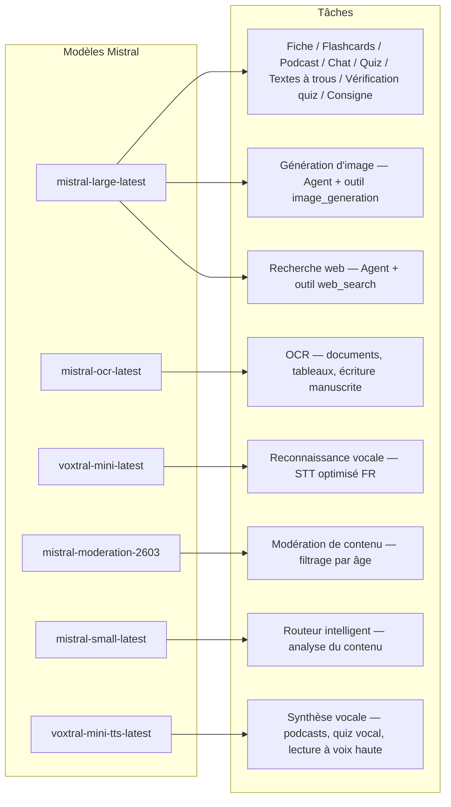
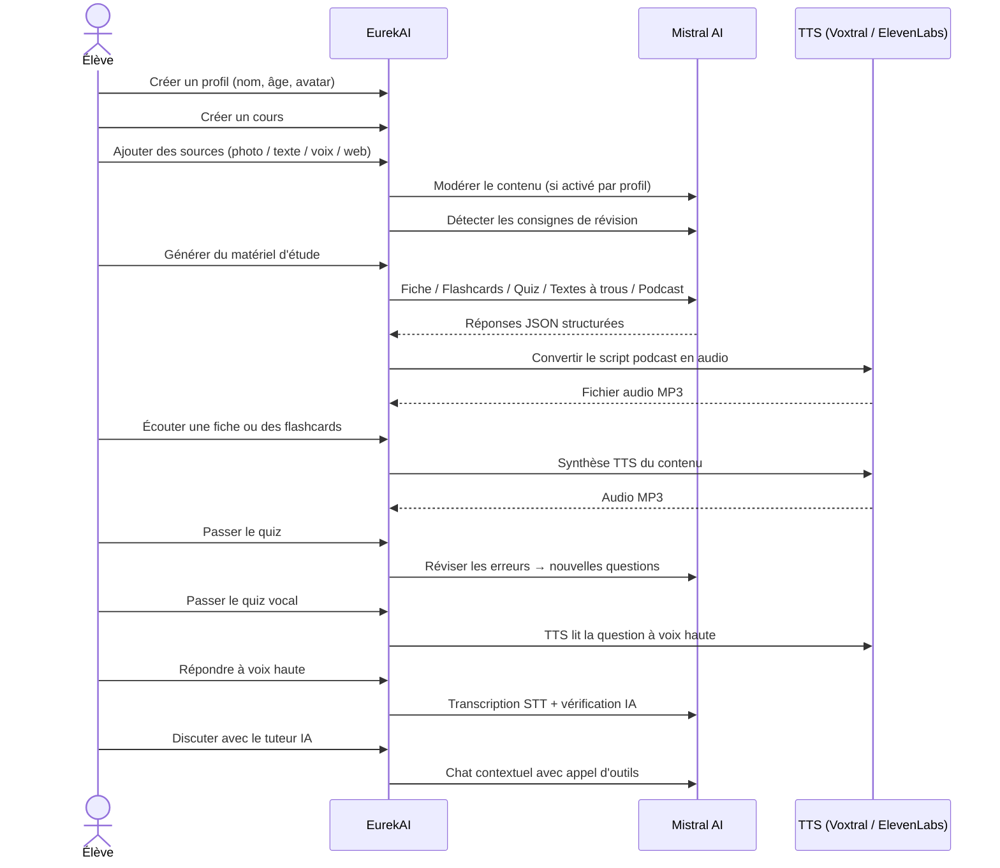

<p align="center">
  
</p>

<h1 align="center">EurekAI</h1>

<p align="center">
  <strong>حوّل أي محتوى إلى تجربة تعلم تفاعلية — مدعومة بالذكاء الاصطناعي.</strong>
</p>

<p align="center">
  <a href="https://mistral.ai"></a>
  <a href="https://www.typescriptlang.org"></a>
  <a href="https://mistral.ai"></a>
  <a href="https://elevenlabs.io"></a>
</p>

<p align="center">
  <a href="https://www.youtube.com/watch?v=_b1TQz2leoI">▶️ شاهد العرض التجريبي على YouTube</a> · <a href="README-en.md">🇬🇧 اقرأ بالإنجليزية</a>
</p>

<p align="center">
  <a href="https://sonarcloud.io/summary/new_code?id=jls42_EurekAI"></a>
  <a href="https://sonarcloud.io/summary/new_code?id=jls42_EurekAI"></a>
  <a href="https://sonarcloud.io/summary/new_code?id=jls42_EurekAI"></a>
  <a href="https://sonarcloud.io/summary/new_code?id=jls42_EurekAI"></a>
</p>
<p align="center">
  <a href="https://sonarcloud.io/summary/new_code?id=jls42_EurekAI"></a>
  <a href="https://sonarcloud.io/summary/new_code?id=jls42_EurekAI"></a>
  <a href="https://sonarcloud.io/summary/new_code?id=jls42_EurekAI"></a>
  <a href="https://sonarcloud.io/summary/new_code?id=jls42_EurekAI"></a>
</p>

---

## القصة — لماذا EurekAI؟

**EurekAI** وُلِد خلال [هاكاثون Mistral AI العالمي](https://luma.com/mistralhack-online) ([الموقع الرسمي](https://worldwide-hackathon.mistral.ai/)) (مارس 2026). كنت بحاجة إلى موضوع — وجاءت الفكرة من شيء عملي جدًا: أُحضّر بانتظام للاختبارات مع ابنتي، وقلت لنفسي أنه من الممكن جعل ذلك أكثر متعة وتفاعلية بفضل الذكاء الاصطناعي.

الهدف: أخذ **أي مدخل** — صورة للكتاب المدرسي، نص منسوخ ولصق، تسجيل صوتي، بحث على الويب — وتحويله إلى **بطاقات مراجعة، فلاشكاردز، اختبارات، بودكاست، نصوص مع فراغات، رسوم توضيحية، والمزيد**. كل ذلك مدعوم بنماذج Mistral AI الفرنسية، مما يجعله حلًا مناسبًا بطبيعته للطلاب الناطقين بالفرنسية.

تم كتابة كل سطر من الشيفرة خلال الهاكاثون. تُستخدم جميع واجهات برمجة التطبيقات والمكتبات مفتوحة المصدر وفقًا لقواعد الهاكاثون.

---

## الميزات

| | الميزة | الوصف |
|---|---|---|
| 📷 | **تحميل OCR** | التقط صورة لكتابك المدرسي أو ملاحظاتك — Mistral OCR يستخرج المحتوى |
| 📝 | **إدخال نص** | اكتب أو الصق أي نص مباشرةً |
| 🎤 | **إدخال صوتي** | سجّل صوتك — Voxtral STT يحوّل كلامك إلى نص |
| 🌐 | **بحث ويب** | اطرح سؤالًا — وكيل Mistral يبحث عن الإجابات على الويب |
| 📄 | **بطاقات مراجعة** | ملاحظات منظمة مع نقاط رئيسية، مفردات، اقتباسات، حكايات |
| 🃏 | **بطاقات تعليمية (فلاشكارد)** | 5-50 بطاقة سؤال/جواب مع مراجع للمصادر لتعزيز الحفظ النشط |
| ❓ | **اختبار اختيار من متعدد (QCM)** | 5-50 سؤالًا بخيارات متعددة مع مراجعة تكيفية للأخطاء |
| ✏️ | **نصوص مع فراغات** | تمارين لملء الفراغات مع تلميحات وتصحيح متسامح |
| 🎙️ | **بودكاست** | بودكاست قصير بصوتين يُحوّل إلى صوت عبر Mistral Voxtral TTS |
| 🖼️ | **رسوم توضيحية** | صور تعليمية مولّدة بواسطة وكيل Mistral |
| 🗣️ | **اختبار صوتي** | الأسئلة تُقرأ بصوت عالٍ، إجابة شفهية، ويتحقق الذكاء الاصطناعي من الإجابة |
| 💬 | **مدرّس IA** | دردشة سياقية مع مستندات دروسك، مع إمكانية استدعاء أدوات |
| 🧠 | **موجّه ذكي** | الذكاء الاصطناعي يحلل محتواك ويوصي بالمولدات الأكثر ملاءمة من بين الـ7 المتاحة |
| 🔒 | **رقابة أبوية** | فلترة حسب العمر، رمز PIN للآباء، قيود على الدردشة |
| 🌍 | **متعدد اللغات** | الواجهة والمحتوى الذكيان متاحان بالكامل بالفرنسية والإنجليزية |
| 🔊 | **القراءة بالصوت** | استمع إلى البطاقات والفلاشكاردز عبر Mistral Voxtral TTS أو ElevenLabs |

---

## نظرة عامة على البنية


---

## خريطة استخدام النماذج



---

## مسار المستخدم



---

## غوص متعمق — الميزات

### إدخال متعدد الوسائط

EurekAI يقبل أربعة أنواع من المصادر، وتُدقق حسب الملف الشخصي (مفعّل افتراضيًا للأطفال والمراهقين):

- **تحميل OCR** — ملفات JPG وPNG أو PDF يُعالَج بواسطة `mistral-ocr-latest`. يتعامل مع النصوص المطبوعة، الجداول والكتابة اليدوية.
- **نص حر** — اكتب أو الصق أي محتوى. يُدقق قبل التخزين إذا كانت المراقبة مفعّلة.
- **إدخال صوتي** — سجّل صوتًا في المتصفح. يُنقَل إلى نص بواسطة `voxtral-mini-latest`. الإعداد `language="fr"` يحسّن التعرف.
- **بحث ويب** — أدخل استعلامًا. وكيل Mistral مؤقت يستخدم الأداة `web_search` يجلب ويلخّص النتائج.

### توليد محتوى بالذكاء الاصطناعي

سبعة أنواع من مواد التعلم المُولّدة:

| المُولّد | النموذج | الناتج |
|---|---|---|
| **بطاقة مراجعة** | `mistral-large-latest` | عنوان، ملخص، 10-25 نقاط رئيسية، مفردات، اقتباسات، حكاية |
| **بطاقات تعليمية (فلاشكارد)** | `mistral-large-latest` | 5-50 بطاقات سؤال/جواب مع مراجع للمصادر لتعزيز الحفظ النشط |
| **اختبار اختيار من متعدد (QCM)** | `mistral-large-latest` | 5-50 سؤالًا، 4 خيارات لكل سؤال، شروحات، مراجعة تكيفية |
| **نصوص مع فراغات** | `mistral-large-latest` | جمل لملئها مع تلميحات، تصحيح متسامح (Levenshtein) |
| **بودكاست** | `mistral-large-latest` + Voxtral TTS | نص بصوتين → ملف صوتي MP3 |
| **رسوم توضيحية** | وكيل `mistral-large-latest` | صورة تعليمية عبر الأداة `image_generation` |
| **اختبار صوتي** | `mistral-large-latest` + Voxtral TTS + STT | أسئلة TTS → إجابة STT → تحقق بالذكاء الاصطناعي |

### مدرّس بالذكاء الاصطناعي عبر الدردشة

مدرّس محادثي مع وصول كامل إلى مستندات الدروس:

- يستخدم `mistral-large-latest`
- **استدعاء أدوات**: يمكنه توليد بطاقات مراجعة، فلاشكاردز، اختبارات أو نصوص مع فراغات أثناء المحادثة
- سجل محادثة من 50 رسالة لكل مقرر
- فلترة المحتوى إذا كانت مفعّلة للملف الشخصي

### الموجّه الآلي الذكي

يستخدم الموجّه `mistral-small-latest` لتحليل محتوى المصادر والتوصية بالمولدات الأكثر ملاءمة من بين الـ7 المتاحة — حتى لا يضطر الطلاب للاختيار يدويًا. تعرض الواجهة التقدّم في الزمن الحقيقي: أولًا مرحلة تحليل، ثم التوليدات الفردية مع إمكانية الإلغاء.

### التعلم التكيفي

- **إحصائيات الاختبارات**: متابعة المحاولات والدقة لكل سؤال
- **مراجعة الاختبارات**: يولّد 5-10 أسئلة جديدة تستهدف المفاهيم الضعيفة
- **اكتشاف التعليمات**: يكتشف تعليمات المراجعة ("Je sais ma leçon si je sais...") ويعطيها أولوية في جميع المولدات

### الأمان والرقابة الأبوية

- **4 فئات عمرية**: طفل (≤10 سنوات)، مراهق (11-15)، طالب (16-25)، بالغ (26+)
- **فلترة المحتوى**: `mistral-moderation-2603` مع 5 فئات محظورة للأطفال/المراهقين (sexual, hate, violence, selfharm, jailbreaking)، لا قيود للطالب/البالغ
- **رمز PIN للآباء**: هاش SHA-256، مطلوب للملفات الشخصية لأقل من 15 سنة
- **قيود الدردشة**: الدردشة مع الذكاء الاصطناعي معطلة افتراضيًا لمن هم دون 16 عامًا، ويمكن تفعيلها من قبل الوالدين

### نظام متعدد الملفات الشخصية

- ملفات شخصية متعددة باسم، عمر، صورة رمزية، تفضيلات اللغة
- مشاريع مرتبطة بالملفات الشخصية عبر `profileId`
- الحذف التتابعي: حذف ملف شخصي يحذف جميع مشاريعه

### تحويل النص إلى كلام — مزوّدون متعددون

- **Mistral Voxtral TTS** (الافتراضي): `voxtral-mini-tts-latest`, لا حاجة لمفتاح إضافي
- **ElevenLabs** (بديل): `eleven_v3`, أصوات طبيعية، يتطلب `ELEVENLABS_API_KEY`
- المزوّد قابل للتكوين في إعدادات التطبيق

### التدويل

- الواجهة الكاملة متاحة بالفرنسية والإنجليزية
- مطالبات الذكاء الاصطناعي تدعم لغتين اليوم (FR, EN) مع بنية جاهزة لـ15 لغة إضافية (es, de, it, pt, nl, ja, zh, ko, ar, hi, pl, ro, sv)
- اللغة قابلة للتعيين لكل ملف شخصي

---

## المكدس التقني

| الطبقة | التقنية | الدور |
|---|---|---|
| **Runtime** | Node.js + TypeScript 5.7 | الخادم وضمان الأنواع |
| **Backend** | Express 4.21 | API REST |
| **خادم التطوير** | Vite 7.3 + tsx | HMR، partials Handlebars، بروكسي |
| **Frontend** | HTML + TailwindCSS 4.2 + Alpine.js 3.15 | واجهة تفاعلية، TypeScript مُجمّع بواسطة Vite |
| **Templating** | vite-plugin-handlebars | تركيب HTML بواسطة partials |
| **IA** | Mistral AI SDK 2.1 | دردشة، OCR، STT، TTS، وكلاء، فلترة المحتوى |
| **TTS (افتراضي)** | Mistral Voxtral TTS | `voxtral-mini-tts-latest`, تحويل النص إلى كلام مدمج |
| **TTS (بديل)** | ElevenLabs SDK 2.36 | `eleven_v3`, أصوات طبيعية |
| **أيقونات** | Lucide 0.575 | مكتبة أيقونات SVG |
| **Markdown** | Marked 17 | عرض الماركداون في الدردشة |
| **رفع الملفات** | Multer 1.4 | إدارة نماذج multipart |
| **صوت** | ffmpeg-static | دمج مقاطع الصوت |
| **اختبارات** | Vitest 4 | اختبارات وحدوية — التغطية مقاسة عبر SonarCloud |
| **الاستمرارية** | ملفات JSON | تخزين بدون تبعيات |

---

## مرجع النماذج

| النموذج | الاستخدام | لماذا |
|---|---|---|
| `mistral-large-latest` | بطاقة، فلاشكارد، بودكاست، اختبار، نصوص مع فراغات، دردشة، تحقق اختبار صوتي، وكيل صور، وكيل بحث ويب، اكتشاف التعليمات | أفضل متعدد اللغات + يتبع التعليمات |
| `mistral-ocr-latest` | OCR للمستندات | نص مطبوع، جداول، كتابة يدوية |
| `voxtral-mini-latest` | التعرف على الصوت (STT) | STT متعدد اللغات، محسن بـ `language="fr"` |
| `voxtral-mini-tts-latest` | تحويل النص إلى كلام (TTS) | بودكاست، اختبار صوتي، قراءة بصوت عالٍ |
| `mistral-moderation-2603` | فلترة المحتوى | 5 فئات محظورة للأطفال/المراهقين (+ jailbreaking) |
| `mistral-small-latest` | الموجّه الذكي | تحليل سريع للمحتوى لاتخاذ قرارات التوجيه |
| `eleven_v3` (ElevenLabs) | تحويل النص إلى كلام (TTS بديل) | أصوات طبيعية، بديل قابل للتكوين |

---

## بدء سريع

```bash
# Cloner le dépôt
git clone https://github.com/jls42/EurekAI.git
cd EurekAI

# Installer les dépendances
npm install

# Configurer les clés API
cp .env.example .env
# Éditez .env avec vos clés :
#   MISTRAL_API_KEY=votre_clé_ici           (requis)
#   ELEVENLABS_API_KEY=votre_clé_ici        (optionnel, TTS alternatif)

# Lancer le développement
npm run dev
# → Backend :  http://localhost:3000 (API)
# → Frontend : http://localhost:5173 (serveur Vite avec HMR)
```

> **ملاحظة** : Mistral Voxtral TTS هو المزود الافتراضي — لا حاجة لمفتاح إضافي بخلاف `MISTRAL_API_KEY`. ElevenLabs هو مزود TTS بديل قابل للتكوين في الإعدادات.

---

## هيكل المشروع

```
server.ts                 — Point d'entrée Express, monte les routes + config
config.ts                 — Config runtime (modèles, voix, TTS provider), persistée dans output/config.json
store.ts                  — ProjectStore : CRUD projets/sources/générations, persistance JSON
profiles.ts               — ProfileStore : gestion des profils, hachage PIN
types.ts                  — Types TypeScript : Source, Generation (7 types), QuizStats, Profile
prompts.ts                — Tous les prompts IA centralisés (system + user templates, FR/EN)

generators/
  ocr.ts                  — Upload + OCR via Mistral (JPG, PNG, PDF)
  summary.ts              — Génération de fiche de révision (JSON structuré)
  flashcards.ts           — Flashcards Q/R (5-50, configurable)
  quiz.ts                 — Quiz QCM (5-50 questions, configurable) + révision adaptative
  fill-blank.ts           — Exercices à trous avec validation tolérante
  podcast.ts              — Script podcast 2 voix
  quiz-vocal.ts           — Quiz vocal : questions TTS + réponses STT + vérification IA
  image.ts                — Génération d'image via Agent Mistral (outil image_generation)
  chat.ts                 — Tuteur IA par chat avec appel d'outils
  router.ts               — Routeur automatique intelligent (contenu → générateurs recommandés)
  consigne.ts             — Détection de consignes de révision
  tts-provider.ts         — Dispatch TTS multi-provider (Mistral Voxtral / ElevenLabs)
  tts.ts                  — Génération audio podcast (concaténation de segments)
  stt.ts                  — Voxtral STT (audio → texte)
  websearch.ts            — Agent Mistral avec outil web_search
  moderation.ts           — Modération de contenu (filtrage par âge)

routes/
  projects.ts             — CRUD projets
  profiles.ts             — CRUD profils avec gestion du PIN
  sources.ts              — Upload OCR, texte libre, voix STT, recherche web, modération
  generate.ts             — Endpoints de génération (7 types + auto + route)
  generations.ts          — Tentatives de quiz/fill-blank, réponses vocales, lecture à voix haute
  chat.ts                 — Chat IA avec appel d'outils

helpers/
  index.ts                — safeParseJson, unwrapJsonArray, extractAllText, timer
  audio.ts                — collectStream (ReadableStream → Buffer)
  fill-blank-validate.ts  — Validation tolérante des réponses (normalisation, Levenshtein)

src/                      — Frontend (Vite + Handlebars)
  index.html              — Point d'entrée HTML principal
  main.ts                 — Entrée frontend (init Alpine.js + icônes Lucide)
  app/                    — Modules applicatifs Alpine.js
    state.ts              — Gestion d'état réactif
    navigation.ts         — Routage des vues + gardes par âge
    profiles.ts           — Logique du sélecteur de profils
    projects.ts           — CRUD des cours
    sources.ts            — Gestionnaires d'upload de sources
    generate.ts           — Déclencheurs de génération (individuel, tout, auto 2 phases)
    generations.ts        — Affichage + actions sur les générations
    chat.ts               — Interface de chat
    config.ts             — Interface de configuration (modèles, voix, TTS provider)
    render.ts             — Helpers de rendu HTML
    i18n.ts               — Changement de langue
    ...
  components/
    quiz.ts               — Composant quiz interactif
    quiz-vocal.ts         — Composant quiz vocal
    fill-blank.ts         — Composant textes à trous
    flashcards.ts         — Composant flashcards avec retournement
    step-by-step.ts       — Mixin navigation pas-à-pas (quiz, fill-blank, flashcards)
  i18n/
    fr.ts                 — Traductions françaises
    en.ts                 — Traductions anglaises
    index.ts              — Chargeur i18n
  partials/               — Partials HTML Handlebars (header, sidebar, dialogues, vues)
  styles/
    main.css              — Entrée TailwindCSS
    theme.css             — Variables de thème personnalisées

public/assets/            — Ressources statiques (logo, avatars)
output/                   — Données d'exécution (projets, config, fichiers audio)
```

---

## مرجع واجهة برمجة التطبيقات

### التكوين
| الطريقة | نقطة النهاية | الوصف |
|---|---|---|
| `GET` | `/api/config` | التكوين الحالي |
| `PUT` | `/api/config` | تعديل التكوين (النماذج، الأصوات، مزود TTS) |
| `GET` | `/api/config/status` | حالة واجهات البرمجة (Mistral, ElevenLabs, TTS) |
| `POST` | `/api/config/reset` | إعادة التكوين إلى الافتراضي |
| `GET` | `/api/config/voices` | سرد أصوات Mistral TTS (اختياري `?lang=fr`) |

### الملفات الشخصية
| الطريقة | نقطة النهاية | الوصف |
|---|---|---|
| `GET` | `/api/profiles` | سرد جميع الملفات الشخصية |
| `POST` | `/api/profiles` | إنشاء ملف شخصي |
| `PUT` | `/api/profiles/:id` | تعديل ملف شخصي (مطلوب PIN لأقل من 15 سنة) |
| `DELETE` | `/api/profiles/:id` | حذف ملف شخصي + الحذف التتابعي للمشاريع |

### المشاريع
| الطريقة | نقطة النهاية | الوصف |
|---|---|---|
| `GET` | `/api/projects` | سرد المشاريع |
| `POST` | `/api/projects` | إنشاء مشروع `{name, profileId}` |
| `GET` | `/api/projects/:pid` | تفاصيل المشروع |
| `PUT` | `/api/projects/:pid` | إعادة تسمية `{name}` |
| `DELETE` | `/api/projects/:pid` | حذف المشروع |

### المصادر
| الطريقة | نقطة النهاية | الوصف |
|---|---|---|
| `POST` | `/api/projects/:pid/sources/upload` | رفع OCR (ملفات multipart) |
| `POST` | `/api/projects/:pid/sources/text` | نص حر `{text}` |
| `POST` | `/api/projects/:pid/sources/voice` | صوت STT (audio multipart) |
| `POST` | `/api/projects/:pid/sources/websearch` | بحث ويب `{query}` |
| `DELETE` | `/api/projects/:pid/sources/:sid` | حذف مصدر |
| `POST` | `/api/projects/:pid/moderate` | فلترة `{text}` |
| `POST` | `/api/projects/:pid/detect-consigne` | اكتشاف تعليمات المراجعة |

### التوليد
| الطريقة | نقطة النهاية | الوصف |
|---|---|---|
| `POST` | `/api/projects/:pid/generate/summary` | بطاقة مراجعة |
| `POST` | `/api/projects/:pid/generate/flashcards` | فلاشكاردز |
| `POST` | `/api/projects/:pid/generate/quiz` | اختبار اختيار من متعدد (QCM) |
| `POST` | `/api/projects/:pid/generate/fill-blank` | نصوص مع فراغات |
| `POST` | `/api/projects/:pid/generate/podcast` | بودكاست |
| `POST` | `/api/projects/:pid/generate/image` | رسم توضيحي |
| `POST` | `/api/projects/:pid/generate/quiz-vocal` | اختبار صوتي |
| `POST` | `/api/projects/:pid/generate/quiz-review` | مراجعة تكيفية `{generationId, weakQuestions}` |
| `POST` | `/api/projects/:pid/generate/route` | تحليل التوجيه (خطة المولدات المراد تشغيلها) |
| `POST` | `/api/projects/:pid/generate/auto` | توليد تلقائي بالخلفية (توجيه + 5 أنواع: ملخّص، فلاشكاردز، اختبار، ملء فراغات، بودكاست) |

جميع مسارات التوليد تقبل `{sourceIds?, lang?, ageGroup?, count?, useConsigne?}`.

### CRUD التوليدات
| الطريقة | نقطة النهاية | الوصف |
|---|---|---|
| `POST` | `/api/projects/:pid/generations/:gid/quiz-attempt` | إرسال إجابات الاختبارات `{answers}` |
| `POST` | `/api/projects/:pid/generations/:gid/fill-blank-attempt` | إرسال إجابات نصوص الملء `{answers}` |
| `POST` | `/api/projects/:pid/generations/:gid/vocal-answer` | التحقق من إجابة شفهية (audio + questionIndex) |
| `POST` | `/api/projects/:pid/generations/:gid/read-aloud` | قراءة TTS بصوت عالٍ (بطاقات/فلاشكاردز) |
| `PUT` | `/api/projects/:pid/generations/:gid` | إعادة تسمية `{title}` |
| `DELETE` | `/api/projects/:pid/generations/:gid` | حذف التوليد |

### الدردشة
| الطريقة | نقطة النهاية | الوصف |
|---|---|---|
| `GET` | `/api/projects/:pid/chat` | استرداد سجل المحادثة |
| `POST` | `/api/projects/:pid/chat` | إرسال رسالة `{message, lang, ageGroup}` |
| `DELETE` | `/api/projects/:pid/chat` | مسح سجل المحادثة |

---

## القرارات المعمارية

| القرار | المبرر |
|---|---|
| **اختيار Alpine.js بدلًا من React/Vue** | بصمة صغيرة، تفاعلية خفيفة مع TypeScript مُجمّع بواسطة Vite. مثالي لهاكاثون حيث السرعة مهمة. |
| **التخزين في ملفات JSON** | صفر تبعيات، بدء فوري. لا حاجة لإعداد قاعدة بيانات — تبدأ العمل فورًا. |
| **Vite + Handlebars** | أفضل ما في العالمين: HMR سريع للتطوير، partials HTML لتنظيم الشيفرة، Tailwind JIT. | |
| **المطالبات المركزية** | جميع مطالبات الذكاء الاصطناعي في `prompts.ts` — من السهل تكرارها واختبارها وتكييفها حسب اللغة/الفئة العمرية. |
| **نظام متعدد التوليد** | كل توليد هو كائن مستقل له مُعرّف خاص به — يتيح عدة بطاقات، اختبارات، إلخ لكل درس. |
| **مطالبات مكيّفة حسب العمر** | 4 فئات عمرية مع مفردات وتعقيد ونبرة مختلفة — نفس المحتوى يعلّم بشكل مختلف حسب المتعلّم. |
| **ميزات تعتمد على الوكلاء** | توليد الصور والبحث على الويب يستخدمان وكلاء Mistral مؤقتين — دورة حياة مستقلة مع تنظيف تلقائي. |
| **TTS متعدد المزودين** | Mistral Voxtral TTS افتراضيًا (لا حاجة لمفتاح إضافي)، ElevenLabs كخيار بديل — قابل للتكوين دون إعادة تشغيل. |

---

## الاعتمادات والشكر

- **[Mistral AI](https://mistral.ai)** — نماذج الذكاء الاصطناعي (Large, OCR, Voxtral STT, Voxtral TTS, Moderation, Small) + هاكاثون عالمي
- **[ElevenLabs](https://elevenlabs.io)** — محرك تحويل النص إلى كلام بديل (`eleven_v3`)
- **[Alpine.js](https://alpinejs.dev)** — إطار عمل تفاعلي خفيف
- **[TailwindCSS](https://tailwindcss.com)** — إطار عمل CSS قائم على الأدوات المساعدة
- **[Vite](https://vitejs.dev)** — أداة بناء للواجهة الأمامية
- **[Lucide](https://lucide.dev)** — مكتبة أيقونات
- **[Marked](https://marked.js.org)** — محلل Markdown

بُني بعناية خلال هاكاثون Mistral AI العالمي، مارس 2026.

---

## المؤلف

**Julien LS** — [contact@jls42.org](mailto:contact@jls42.org)

## الرخصة

[AGPL-3.0](LICENSE) — حقوق الطبع والنشر (C) 2026 Julien LS

**تمت ترجمة هذا المستند من النسخة fr إلى اللغة ar باستخدام النموذج gpt-5-mini. لمزيد من المعلومات حول عملية الترجمة، راجع https://gitlab.com/jls42/ai-powered-markdown-translator**

