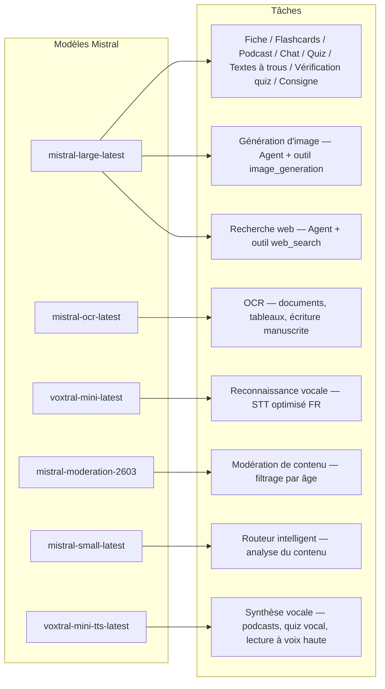
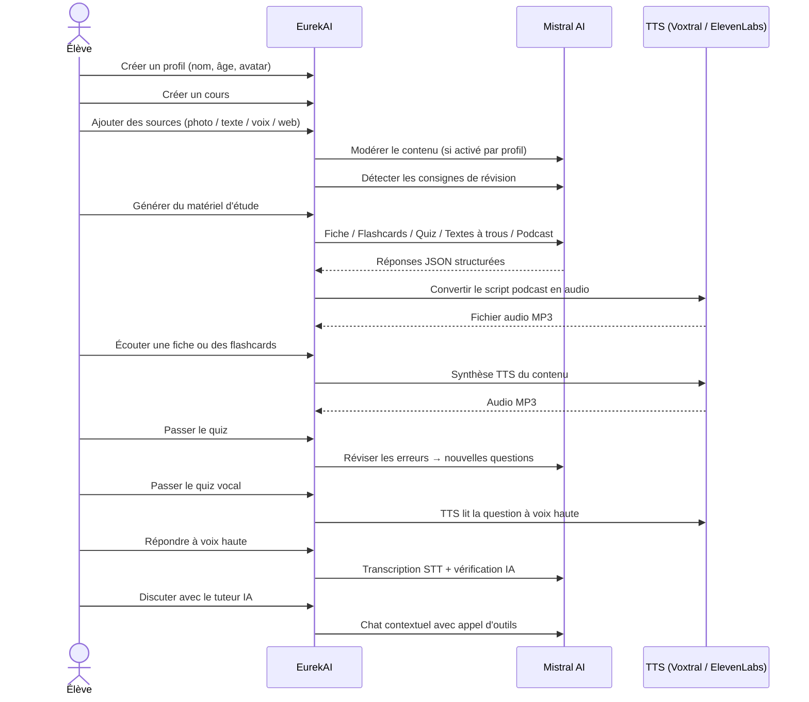

<p align="center">
  
</p>

<h1 align="center">EurekAI</h1>

<p align="center">
  <strong>حوّل أي محتوى إلى تجربة تعلم تفاعلية — مدعومة بالذكاء الاصطناعي.</strong>
</p>

<p align="center">
  <a href="https://mistral.ai"></a>
  <a href="https://www.typescriptlang.org"></a>
  <a href="https://mistral.ai"></a>
  <a href="https://elevenlabs.io"></a>
</p>

<p align="center">
  <a href="https://www.youtube.com/watch?v=_b1TQz2leoI">▶️ شاهد العرض التوضيحي على YouTube</a> · <a href="README-en.md">🇬🇧 اقرأ بالإنجليزية</a>
</p>

<p align="center">
  <a href="https://sonarcloud.io/summary/new_code?id=jls42_EurekAI"></a>
  <a href="https://sonarcloud.io/summary/new_code?id=jls42_EurekAI"></a>
  <a href="https://sonarcloud.io/summary/new_code?id=jls42_EurekAI"></a>
  <a href="https://sonarcloud.io/summary/new_code?id=jls42_EurekAI"></a>
</p>
<p align="center">
  <a href="https://sonarcloud.io/summary/new_code?id=jls42_EurekAI"></a>
  <a href="https://sonarcloud.io/summary/new_code?id=jls42_EurekAI"></a>
  <a href="https://sonarcloud.io/summary/new_code?id=jls42_EurekAI"></a>
  <a href="https://sonarcloud.io/summary/new_code?id=jls42_EurekAI"></a>
</p>

---

## القصة — لماذا EurekAI ؟

**EurekAI** وُلد أثناء [Mistral AI Worldwide Hackathon](https://worldwidehackathon.mistral.ai/) (مارس 2026). كنت بحاجة لموضوع — والفكرة جاءت من شيء عملي جدًا: أنا أُعدُّ الاختبارات بانتظام مع ابنتي، وفكرت أنه من الممكن جعل ذلك أكثر متعة وتفاعلية بفضل الذكاء الاصطناعي.

الهدف: أخذ **أي مدخل** — صورة من الكتاب المدرسي، نص منسوخ ولصق، تسجيل صوتي، بحث على الويب — وتحويله إلى **بطاقات مراجعة، فلاش كارد، اختبارات، بودكاست، نصوص لإكمال الفراغات، رسومات توضيحية، والمزيد**. كل ذلك مدعوم بنماذج Mistral AI الفرنسية، مما يجعل الحل مناسبًا بطبيعته للطلاب الناطقين بالفرنسية.

كل سطر كود كُتب أثناء الهاكاثون. جميع واجهات برمجة التطبيقات والمكتبات مفتوحة المصدر مستخدمة وفقًا لقواعد الهاكاثون.

---

## الميزات

| | الميزة | الوصف |
|---|---|---|
| 📷 | **رفع OCR** | التقط صورة لكتابك أو ملاحظاتك — يقوم Mistral OCR باستخراج المحتوى |
| 📝 | **إدخال نص** | اكتب أو الصق أي نص مباشرة |
| 🎤 | **إدخال صوتي** | سجّل صوتك — يقوم Voxtral STT بنسخ صوتك إلى نص |
| 🌐 | **بحث على الويب** | اطرح سؤالًا — يقوم وكيل Mistral بالبحث عن الإجابات على الويب |
| 📄 | **بطاقات مراجعة** | ملاحظات مُنظمة مع نقاط رئيسية، مفردات، اقتباسات، حكايات |
| 🃏 | **فلاش كارد** | 5-50 بطاقة سؤال/جواب مع مراجع للمصادر للتكرار النشط |
| ❓ | **اختبار اختيار متعدد** | 5-50 سؤالًا متعدد الاختيارات مع مراجعة تكيفية للأخطاء |
| ✏️ | **نصوص لإكمال الفراغات** | تمارين للإكمال مع تلميحات والتحقق بتسامح |
| 🎙️ | **بودكاست** | بودكاست صغير بصوتين يُحوّل إلى صوت عبر Mistral Voxtral TTS |
| 🖼️ | **رسوم توضيحية** | صور تعليمية يتم توليدها بواسطة وكيل Mistral |
| 🗣️ | **اختبار صوتي** | أسئلة تُقرأ بصوت عالٍ، إجابة شفوية، يتحقق الذكاء الاصطناعي من الإجابة |
| 💬 | **مدرّس ذكي (IA)** | دردشة سياقية مع مستنداتك الدراسية، مع استدعاء أدوات |
| 🧠 | **موجّه ذكي** | يقوم الذكاء الاصطناعي بتحليل المحتوى الخاص بك ويوصي بالمولدات الأكثر صلة من بين الـ7 المتاحة |
| 🔒 | **رقابة أبوية** | تصفية حسب العمر، رمز PIN للوالدين، قيود الدردشة |
| 🌍 | **متعدد اللغات** | واجهة ومحتوى الذكاء الاصطناعي متوفران بالكامل بالفرنسية والإنجليزية |
| 🔊 | **القراءة بصوت عالي** | استمع إلى البطاقات والفلاش كارد عبر Mistral Voxtral TTS أو ElevenLabs |

---

## نظرة عامة على البنية


---

## خريطة استخدام النماذج



---

## مسار المستخدم



---

## غوص عميق — الميزات

### الإدخال متعدد الوسائط

EurekAI تقبل أربعة أنواع من المصادر، تتم تصفيتها وفق الملف الشخصي (مفعّلة افتراضيًا للطفل والمراهق) :

- **رفع OCR** — ملفات JPG أو PNG أو PDF مُعالجة بواسطة `mistral-ocr-latest`. تتعامل مع النص المطبوع، الجداول والكتابة اليدوية.
- **نص حر** — اكتب أو الصق أي محتوى. يتم تصفيته قبل التخزين إذا كانت المراقبة مفعلة.
- **إدخال صوتي** — سجّل صوتًا في المتصفح. يتم نسخه بواسطة `voxtral-mini-latest`. يقوم الإعداد `language="fr"` بتحسين التعرف.
- **بحث على الويب** — أدخل استعلامًا. يقوم وكيل Mistral مؤقت باستخدام الأداة `web_search` بجلب وتلخيص النتائج.

### توليد محتوى الذكاء الاصطناعي

سبعة أنواع من مواد التعلم المُولّدة :

| المولّد | النموذج | المخرجات |
|---|---|---|
| **بطاقة مراجعة** | `mistral-large-latest` | عنوان، ملخص، 10-25 نقاط رئيسية، مفردات، اقتباسات، حكاية |
| **فلاش كارد** | `mistral-large-latest` | 5-50 بطاقة سؤال/جواب مع مراجع للمصادر للتكرار النشط |
| **اختبار اختيار متعدد** | `mistral-large-latest` | 5-50 سؤالًا، 4 خيارات لكلٍ، تفسيرات، مراجعة تكيفية |
| **نصوص لإكمال الفراغات** | `mistral-large-latest` | جمل لإكمال مع تلميحات، تحقق بتسامح (Levenshtein) |
| **بودكاست** | `mistral-large-latest` + Voxtral TTS | نص بصوتين → ملف صوتي MP3 |
| **رسوم توضيحية** | Agent `mistral-large-latest` | صورة تعليمية عبر الأداة `image_generation` |
| **اختبار صوتي** | `mistral-large-latest` + Voxtral TTS + STT | أسئلة TTS → إجابة STT → تحقق الذكاء الاصطناعي |

### مدرس ذكي عبر الدردشة

مدرّس محادثي مع وصول كامل إلى مستندات المقرر الدراسي :

- يستخدم `mistral-large-latest`
- **استدعاء الأدوات** : يمكنه توليد بطاقات مراجعة، فلاش كارد، اختبارات أو نصوص لإكمال الفراغات أثناء المحادثة
- سجل محادثة لغاية 50 رسالة لكل مقرر
- تصفية المحتوى إذا كانت مفعّلة للملف الشخصي

### الموجّه التلقائي الذكي

يستخدم الموجّه `mistral-small-latest` لتحليل محتوى المصادر والتوصية بالمولدات الأكثر ملاءمة من بين السبعة المتاحة — حتى لا يضطر الطلاب للاختيار يدويًا. تعرض الواجهة التقدّم في الوقت الحقيقي: أولاً مرحلة التحليل، ثم عمليات التوليد الفردية مع إمكانية الإلغاء.

### التعلم التكيفي

- **إحصائيات الاختبارات** : تتبع المحاولات والدقة لكل سؤال
- **مراجعة الاختبارات** : يولّد 5-10 أسئلة جديدة تستهدف المفاهيم الضعيفة
- **كشف التعليمات** : يكتشف إرشادات المراجعة ("أعرف درسي إذا عرفت...") ويعطيها أولوية في جميع المولدات

### الأمان والرقابة الأبوية

- **4 مجموعات عمرية** : طفل (≤10 سنوات), مراهق (11-15), طالب (16-25), بالغ (26+)
- **تصفية المحتوى** : `mistral-moderation-2603` مع 5 فئات محظورة للطفل/المراهق (sexual, hate, violence, selfharm, jailbreaking), aucune restriction pour étudiant/adulte
- **PIN للأهل** : تجزئة SHA-256، مطلوب للملفات الشخصية أقل من 15 عامًا
- **قيود الدردشة** : الدردشة مع الذكاء الاصطناعي معطلة افتراضيًا لمن هم دون 16 عامًا، يمكن تفعيلها من قبل الأهل

### نظام متعدد الملفات الشخصية

- ملفات شخصية متعددة مع اسم، عمر، صورة رمزية، تفضيلات اللغة
- مشاريع مرتبطة بالملفات الشخصية عبر `profileId`
- حذف متسلسل: حذف ملف شخصي يحذف جميع مشاريعه

### مزوّد TTS متعدد

- **Mistral Voxtral TTS** (الافتراضي) : `voxtral-mini-tts-latest`, لا حاجة لمفتاح إضافي
- **ElevenLabs** (بديل) : `eleven_v3`, أصوات طبيعية، يتطلب `ELEVENLABS_API_KEY`
- المزود قابل للتكوين في إعدادات التطبيق

### التدويل

- الواجهة كاملة متاحة بالفرنسية والإنجليزية
- مطالبات الذكاء الاصطناعي تدعم لغتين اليوم (FR, EN) مع بنية جاهزة لـ15 (es, de, it, pt, nl, ja, zh, ko, ar, hi, pl, ro, sv)
- يمكن تغيير اللغة لكل ملف شخصي

---

## البنية التقنية

| الطبقة | التكنولوجيا | الدور |
|---|---|---|
| **بيئة التشغيل** | Node.js + TypeScript 5.7 | الخادم وسلامة الأنواع |
| **الخلفية** | Express 4.21 | API REST |
| **خادم التطوير** | Vite 7.3 + tsx | HMR، partials Handlebars، بروكسي |
| **الواجهة الأمامية** | HTML + TailwindCSS 4.2 + Alpine.js 3.15 | واجهة تفاعلية، TypeScript مترجم بواسطة Vite |
| **قوالب** | vite-plugin-handlebars | تركيب HTML عبر partials |
| **الذكاء الاصطناعي** | Mistral AI SDK 2.1 | دردشة، OCR، STT، TTS، وكلاء، تصفية المحتوى |
| **TTS (افتراضي)** | Mistral Voxtral TTS | `voxtral-mini-tts-latest`, توليد صوت مدمج |
| **TTS (بديل)** | ElevenLabs SDK 2.36 | `eleven_v3`, أصوات طبيعية |
| **أيقونات** | Lucide 0.575 | مكتبة أيقونات SVG |
| **Markdown** | Marked 17 | عرض markdown في الدردشة |
| **رفع الملفات** | Multer 1.4 | معالجة نماذج multipart |
| **الصوت** | ffmpeg-static | دمج مقاطع صوتية |
| **اختبارات** | Vitest 4 | اختبارات وحدوية — التغطية مقاسة بواسطة SonarCloud |
| **الاستمرارية** | ملفات JSON | تخزين بدون تبعيات |

---

## مرجع النماذج

| النموذج | الاستخدام | لماذا |
|---|---|---|
| `mistral-large-latest` | بطاقة، فلاش كارد، بودكاست، اختبار، نصوص لإكمال الفراغات، دردشة، التحقق من الاختبار الصوتي، وكيل صور، وكيل بحث ويب | أفضل متعدد اللغات + تتبع التعليمات |
| `mistral-ocr-latest` | OCR للوثائق | نص مطبوع، جداول، كتابة يدوية |
| `voxtral-mini-latest` | التعرف على الصوت (STT) | STT متعدد اللغات، محسن مع `language="fr"` |
| `voxtral-mini-tts-latest` | توليد صوت (TTS) | بودكاست، اختبار صوتي، قراءة بصوت عالٍ |
| `mistral-moderation-2603` | تصفية المحتوى | 5 فئات محظورة للطفل/المراهق (+ jailbreaking) |
| `mistral-small-latest` | موجّه ذكي | تحليل سريع للمحتوى لاتخاذ قرارات التوجيه |
| `eleven_v3` (ElevenLabs) | توليد صوت (TTS بديل) | أصوات طبيعية، بديل قابل للتكوين |

---

## البدء السريع

```bash
# Cloner le dépôt
git clone https://github.com/jls42/EurekAI.git
cd EurekAI

# Installer les dépendances
npm install

# Configurer les clés API
cp .env.example .env
# Éditez .env avec vos clés :
#   MISTRAL_API_KEY=votre_clé_ici           (requis)
#   ELEVENLABS_API_KEY=votre_clé_ici        (optionnel, TTS alternatif)

# Lancer le développement
npm run dev
# → Backend :  http://localhost:3000 (API)
# → Frontend : http://localhost:5173 (serveur Vite avec HMR)
```

> **ملاحظة** : Mistral Voxtral TTS هو المزود الافتراضي — لا حاجة لمفتاح إضافي بخلاف `MISTRAL_API_KEY`. ElevenLabs هو مزود TTS بديل قابل للتكوين في الإعدادات.

---

## هيكل المشروع

```
server.ts                 — Point d'entrée Express, monte les routes + config
config.ts                 — Config runtime (modèles, voix, TTS provider), persistée dans output/config.json
store.ts                  — ProjectStore : CRUD projets/sources/générations, persistance JSON
profiles.ts               — ProfileStore : gestion des profils, hachage PIN
types.ts                  — Types TypeScript : Source, Generation (7 types), QuizStats, Profile
prompts.ts                — Tous les prompts IA centralisés (system + user templates, FR/EN)

generators/
  ocr.ts                  — Upload + OCR via Mistral (JPG, PNG, PDF)
  summary.ts              — Génération de fiche de révision (JSON structuré)
  flashcards.ts           — Flashcards Q/R (5-50, configurable)
  quiz.ts                 — Quiz QCM (5-50 questions, configurable) + révision adaptative
  fill-blank.ts           — Exercices à trous avec validation tolérante
  podcast.ts              — Script podcast 2 voix
  quiz-vocal.ts           — Quiz vocal : questions TTS + réponses STT + vérification IA
  image.ts                — Génération d'image via Agent Mistral (outil image_generation)
  chat.ts                 — Tuteur IA par chat avec appel d'outils
  router.ts               — Routeur automatique intelligent (contenu → générateurs recommandés)
  consigne.ts             — Détection de consignes de révision
  tts-provider.ts         — Dispatch TTS multi-provider (Mistral Voxtral / ElevenLabs)
  tts.ts                  — Génération audio podcast (concaténation de segments)
  stt.ts                  — Voxtral STT (audio → texte)
  websearch.ts            — Agent Mistral avec outil web_search
  moderation.ts           — Modération de contenu (filtrage par âge)

routes/
  projects.ts             — CRUD projets
  profiles.ts             — CRUD profils avec gestion du PIN
  sources.ts              — Upload OCR, texte libre, voix STT, recherche web, modération
  generate.ts             — Endpoints de génération (7 types + auto + route)
  generations.ts          — Tentatives de quiz/fill-blank, réponses vocales, lecture à voix haute
  chat.ts                 — Chat IA avec appel d'outils

helpers/
  index.ts                — safeParseJson, unwrapJsonArray, extractAllText, timer
  audio.ts                — collectStream (ReadableStream → Buffer)
  fill-blank-validate.ts  — Validation tolérante des réponses (normalisation, Levenshtein)

src/                      — Frontend (Vite + Handlebars)
  index.html              — Point d'entrée HTML principal
  main.ts                 — Entrée frontend (init Alpine.js + icônes Lucide)
  app/                    — Modules applicatifs Alpine.js
    state.ts              — Gestion d'état réactif
    navigation.ts         — Routage des vues + gardes par âge
    profiles.ts           — Logique du sélecteur de profils
    projects.ts           — CRUD des cours
    sources.ts            — Gestionnaires d'upload de sources
    generate.ts           — Déclencheurs de génération (individuel, tout, auto 2 phases)
    generations.ts        — Affichage + actions sur les générations
    chat.ts               — Interface de chat
    config.ts             — Interface de configuration (modèles, voix, TTS provider)
    render.ts             — Helpers de rendu HTML
    i18n.ts               — Changement de langue
    ...
  components/
    quiz.ts               — Composant quiz interactif
    quiz-vocal.ts         — Composant quiz vocal
    fill-blank.ts         — Composant textes à trous
    flashcards.ts         — Composant flashcards avec retournement
    step-by-step.ts       — Mixin navigation pas-à-pas (quiz, fill-blank, flashcards)
  i18n/
    fr.ts                 — Traductions françaises
    en.ts                 — Traductions anglaises
    index.ts              — Chargeur i18n
  partials/               — Partials HTML Handlebars (header, sidebar, dialogues, vues)
  styles/
    main.css              — Entrée TailwindCSS
    theme.css             — Variables de thème personnalisées

public/assets/            — Ressources statiques (logo, avatars)
output/                   — Données d'exécution (projets, config, fichiers audio)
```

---

## مرجع API

### الإعداد
| الطريقة | Endpoint | الوصف |
|---|---|---|
| `GET` | `/api/config` | التهيئة الحالية |
| `PUT` | `/api/config` | تعديل الإعداد (النماذج، الأصوات، مزود TTS) |
| `GET` | `/api/config/status` | حالة واجهات API (Mistral, ElevenLabs, TTS) |
| `POST` | `/api/config/reset` | إعادة التهيئة إلى الافتراضي |
| `GET` | `/api/config/voices` | إدراج أصوات Mistral TTS (اختياري `?lang=fr`) |

### الملفات الشخصية
| الطريقة | Endpoint | الوصف |
|---|---|---|
| `GET` | `/api/profiles` | سرد جميع الملفات الشخصية |
| `POST` | `/api/profiles` | إنشاء ملف شخصي |
| `PUT` | `/api/profiles/:id` | تعديل ملف شخصي (PIN مطلوب لأقل من 15 سنة) |
| `DELETE` | `/api/profiles/:id` | حذف ملف شخصي + حذف متسلسل للمشاريع |

### المشاريع
| الطريقة | Endpoint | الوصف |
|---|---|---|
| `GET` | `/api/projects` | سرد المشاريع |
| `POST` | `/api/projects` | إنشاء مشروع `{name, profileId}` |
| `GET` | `/api/projects/:pid` | تفاصيل المشروع |
| `PUT` | `/api/projects/:pid` | إعادة تسمية `{name}` |
| `DELETE` | `/api/projects/:pid` | حذف المشروع |

### المصادر
| الطريقة | Endpoint | الوصف |
|---|---|---|
| `POST` | `/api/projects/:pid/sources/upload` | رفع OCR (ملفات multipart) |
| `POST` | `/api/projects/:pid/sources/text` | نص حر `{text}` |
| `POST` | `/api/projects/:pid/sources/voice` | صوت STT (صوت multipart) |
| `POST` | `/api/projects/:pid/sources/websearch` | بحث ويب `{query}` |
| `DELETE` | `/api/projects/:pid/sources/:sid` | حذف مصدر |
| `POST` | `/api/projects/:pid/moderate` | تصفية `{text}` |
| `POST` | `/api/projects/:pid/detect-consigne` | اكتشاف تعليمات المراجعة |

### التوليد
| الطريقة | Endpoint | الوصف |
|---|---|---|
| `POST` | `/api/projects/:pid/generate/summary` | بطاقة مراجعة |
| `POST` | `/api/projects/:pid/generate/flashcards` | فلاش كارد |
| `POST` | `/api/projects/:pid/generate/quiz` | اختبار اختيار متعدد |
| `POST` | `/api/projects/:pid/generate/fill-blank` | نصوص لإكمال الفراغات |
| `POST` | `/api/projects/:pid/generate/podcast` | بودكاست |
| `POST` | `/api/projects/:pid/generate/image` | رسومات توضيحية |
| `POST` | `/api/projects/:pid/generate/quiz-vocal` | اختبار صوتي |
| `POST` | `/api/projects/:pid/generate/quiz-review` | مراجعة تكيفية `{generationId, weakQuestions}` |
| `POST` | `/api/projects/:pid/generate/route` | تحليل التوجيه (خطة المولدات المراد تشغيلها) |
| `POST` | `/api/projects/:pid/generate/auto` | توليد أوتوماتيكي على الواجهة الخلفية (توجيه + 5 أنواع : summary, flashcards, quiz, fill-blank, podcast) |

جميع مسارات التوليد تقبل `{sourceIds?, lang?, ageGroup?, count?, useConsigne?}`.

### CRUD التوليدات
| الطريقة | Endpoint | الوصف |
|---|---|---|
| `POST` | `/api/projects/:pid/generations/:gid/quiz-attempt` | إرسال إجابات الاختبار `{answers}` |
| `POST` | `/api/projects/:pid/generations/:gid/fill-blank-attempt` | إرسال إجابات نصوص الفراغ `{answers}` |
| `POST` | `/api/projects/:pid/generations/:gid/vocal-answer` | التحقق من إجابة صوتية (audio + questionIndex) |
| `POST` | `/api/projects/:pid/generations/:gid/read-aloud` | تشغيل TTS بصوت عالٍ (بطاقات/فلاش كارد) |
| `PUT` | `/api/projects/:pid/generations/:gid` | إعادة تسمية `{title}` |
| `DELETE` | `/api/projects/:pid/generations/:gid` | حذف التوليد |

### الدردشة
| الطريقة | Endpoint | الوصف |
|---|---|---|
| `GET` | `/api/projects/:pid/chat` | استرجاع سجل الدردشة |
| `POST` | `/api/projects/:pid/chat` | إرسال رسالة `{message, lang, ageGroup}` |
| `DELETE` | `/api/projects/:pid/chat` | مسح سجل الدردشة |

---

## قرارات معمارية

| القرار | المبرر |
|---|---|
| **استخدام Alpine.js بدلًا من React/Vue** | بصمة صغيرة، تفاعل خفيف مع TypeScript المترجم بواسطة Vite. مثالي لهاكاثون حيث السرعة مهمة. |
| **التخزين بملفات JSON** | صفر تبعيات، تشغيل فوري. لا حاجة لقاعدة بيانات — نبدأ مباشرة. |
| **Vite + Handlebars** | أفضل ما في العالمين: HMR سريع للتطوير، partials HTML لتنظيم الكود، Tailwind JIT. |
| **المطالبات المركزية** | جميع مطالبات الذكاء الاصطناعي في `prompts.ts` — سهل التكرار، الاختبار والتعديل حسب اللغة/المجموعة العمرية. |
| **نظام متعدد الأجيال** | كل جيل هو كائن مستقل بمعرّف خاص به — يتيح عدة بطاقات، اختبارات، إلخ لكل دورة. |
| **موجهات مناسبة حسب العمر** | 4 مجموعات عمرية مع مفردات وتعقيد ونبرة مختلفة — نفس المحتوى يعلّم بشكل مختلف حسب المتعلّم. |
| **ميزات تعتمد على الوكلاء** | توليد الصور والبحث على الويب يستخدمان وكلاء Mistral مؤقتين — دورة حياة منفصلة مع تنظيف تلقائي. |
| **TTS متعدد المزودين** | Mistral Voxtral TTS هو الافتراضي (لا حاجة لمفتاح إضافي)، ElevenLabs كبديل — قابل للتكوين دون إعادة تشغيل. |

---

## الشكر والتقدير

- **[Mistral AI](https://mistral.ai)** — نماذج الذكاء الاصطناعي (Large, OCR, Voxtral STT, Voxtral TTS, Moderation, Small) + Worldwide Hackathon
- **[ElevenLabs](https://elevenlabs.io)** — محرك تحويل النص إلى كلام بديل (`eleven_v3`)
- **[Alpine.js](https://alpinejs.dev)** — إطار عمل تفاعلي خفيف
- **[TailwindCSS](https://tailwindcss.com)** — إطار عمل CSS قائم على الأدوات
- **[Vite](https://vitejs.dev)** — أداة بناء الواجهة الأمامية
- **[Lucide](https://lucide.dev)** — مكتبة أيقونات
- **[Marked](https://marked.js.org)** — محلل Markdown

تم بناؤه بعناية أثناء هاكاثون Mistral AI العالمي، مارس 2026.

---

## المؤلف

**Julien LS** — [contact@jls42.org](mailto:contact@jls42.org)

## الترخيص

[AGPL-3.0](LICENSE) — حقوق الطبع والنشر (C) 2026 Julien LS

**تم ترجمة هذا المستند من النسخة fr إلى اللغة ar باستخدام النموذج gpt-5-mini. لمزيد من المعلومات حول عملية الترجمة، راجع https://gitlab.com/jls42/ai-powered-markdown-translator**

