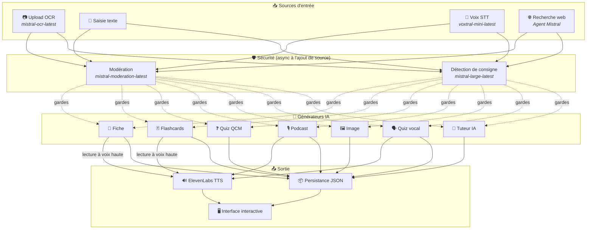
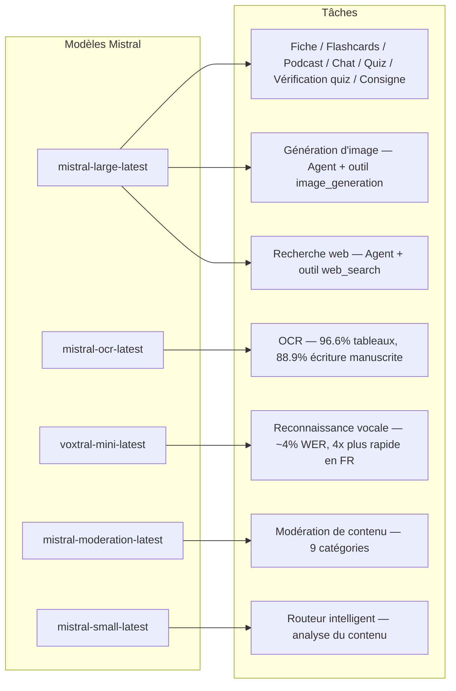
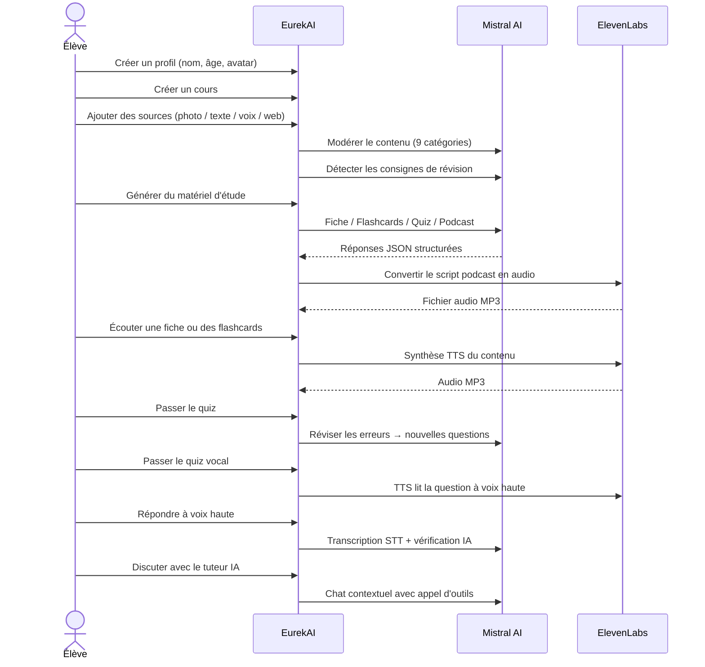

<p align="center">
  
</p>

<h1 align="center">EurekAI</h1>

<p align="center">
  <strong>حوّل أي محتوى إلى تجربة تعلّم تفاعلية — مدعومة بالذكاء الاصطناعي.</strong>
</p>

<p align="center">
  <a href="https://mistral.ai"></a>
  <a href="https://www.typescriptlang.org"></a>
  <a href="https://mistral.ai"></a>
  <a href="https://elevenlabs.io"></a>
</p>

<p align="center">
  <a href="https://www.youtube.com/watch?v=_b1TQz2leoI">▶️ شاهد العرض التوضيحي على YouTube</a> · <a href="README-en.md">🇬🇧 اقرأ بالإنجليزية</a>
</p>

---

## القصة — لماذا EurekAI؟

وُلد **EurekAI** خلال [Mistral AI Worldwide Hackathon](https://worldwidehackathon.mistral.ai/) (مارس 2026). كنت بحاجة إلى موضوع — وجاءت الفكرة من شيء عملي جدًا: أُحضّر الاختبارات بانتظام مع ابنتي، وفكرت أنه لا بد من إمكانية جعل ذلك أكثر متعة وتفاعلية بفضل الذكاء الاصطناعي.

الهدف: أخذ **أي مدخل** — صورة من الكتاب المدرسي، نص منسوخ ومُلصق، تسجيل صوتي، بحث على الويب — وتحويله إلى **مذكرات مراجعة، بطاقات تعليمية، اختبارات قصيرة، بودكاست، رسوم توضيحية، والمزيد**. وكل ذلك مدعوم بنماذج Mistral AI الفرنسية، ما يجعله حلًا مناسبًا طبيعيًا للطلاب الناطقين بالفرنسية.

تمت كتابة كل سطر من الشيفرة أثناء الهاكاثون. وتُستخدم جميع واجهات برمجة التطبيقات والمكتبات مفتوحة المصدر وفقًا لقواعد الهاكاثون.

---

## الميزات

| | الميزة | الوصف |
|---|---|---|
| 📷 | **رفع OCR** | التقط صورة لكتابك المدرسي أو ملاحظاتك — يستخرج Mistral OCR المحتوى منها |
| 📝 | **إدخال نصي** | اكتب أو الصق أي نص مباشرة |
| 🎤 | **إدخال صوتي** | سجّل صوتك — يقوم Voxtral STT بنسخ كلامك |
| 🌐 | **بحث ويب** | اطرح سؤالًا — يبحث وكيل Mistral عن الإجابات على الويب |
| 📄 | **مذكرات مراجعة** | ملاحظات منظمة مع النقاط الأساسية والمفردات والاقتباسات والحكايات |
| 🃏 | **بطاقات تعليمية** | 5 بطاقات سؤال/جواب مع مراجع إلى المصادر للتذكر النشط |
| ❓ | **اختبار QCM** | 10-20 سؤال اختيار من متعدد مع مراجعة تكيفية للأخطاء |
| 🎙️ | **بودكاست** | بودكاست مصغّر بصوتين (Alex & Zoé) يُحوَّل إلى صوت عبر ElevenLabs |
| 🖼️ | **رسوم توضيحية** | صور تعليمية مولّدة بواسطة وكيل Mistral |
| 🗣️ | **اختبار صوتي** | تُقرأ الأسئلة بصوت عالٍ، وتكون الإجابة شفوية، ثم يتحقق الذكاء الاصطناعي من الإجابة |
| 💬 | **مدرّس ذكي** | دردشة سياقية مع مستندات درسك، مع استدعاء الأدوات |
| 🧠 | **موجّه ذكي** | يحلل الذكاء الاصطناعي المحتوى الخاص بك ويوصي بأفضل المولدات |
| 🔒 | **الرقابة الأبوية** | ضبط بحسب العمر، رقم PIN للوالدين، قيود على الدردشة |
| 🌍 | **متعدد اللغات** | واجهة ومحتوى ذكاء اصطناعي كاملان بالفرنسية والإنجليزية |
| 🔊 | **القراءة بصوت عالٍ** | استمع إلى المذكرات والبطاقات التعليمية وهي تُقرأ بصوت عالٍ عبر ElevenLabs TTS |

---

## نظرة عامة على البنية المعمارية



---

## خريطة استخدام النماذج



---

## مسار المستخدم



---

## نظرة معمقة — الميزات

### إدخال متعدد الوسائط

يقبل EurekAI 4 أنواع من المصادر، وجميعها تخضع للرقابة قبل المعالجة:

- **رفع OCR** — ملفات JPG أو PNG أو PDF تُعالج بواسطة `mistral-ocr-latest`. يتعامل مع النص المطبوع والجداول (دقة 96.6%) والكتابة اليدوية (دقة 88.9%).
- **نص حر** — اكتب أو الصق أي محتوى. يمر عبر الرقابة قبل التخزين.
- **إدخال صوتي** — سجّل الصوت في المتصفح. يُنسخ بواسطة `voxtral-mini-latest` مع WER بنحو 4%. يجعل الإعداد `language="fr"` أسرع بمقدار 4 مرات.
- **بحث ويب** — أدخل استعلامًا. يقوم وكيل Mistral مؤقت مع الأداة `web_search` بجلب النتائج وتلخيصها.

### توليد المحتوى بالذكاء الاصطناعي

ستة أنواع من مواد التعلّم المولّدة:

| المولد | النموذج | الناتج |
|---|---|---|
| **مذكرة مراجعة** | `mistral-large-latest` | عنوان، ملخص، 10-25 نقطة أساسية، مفردات، اقتباسات، حكاية |
| **بطاقات تعليمية** | `mistral-large-latest` | 5 بطاقات سؤال/جواب مع مراجع إلى المصادر |
| **اختبار QCM** | `mistral-large-latest` | 10-20 سؤالًا، 4 خيارات لكل سؤال، شروحات، مراجعة تكيفية |
| **بودكاست** | `mistral-large-latest` + ElevenLabs | نص بصوتين (Alex & Zoé) → ملف صوتي MP3 |
| **رسم توضيحي** | وكيل `mistral-large-latest` | صورة تعليمية عبر الأداة `image_generation` |
| **اختبار صوتي** | `mistral-large-latest` + ElevenLabs + Voxtral | أسئلة TTS → إجابة STT → تحقق الذكاء الاصطناعي |

### مدرّس ذكي عبر الدردشة

مدرّس حواري مع وصول كامل إلى مستندات الدرس:

- يستخدم `mistral-large-latest` (نافذة سياق 128K رمز)
- **استدعاء الأدوات**: يمكنه توليد مذكرات أو بطاقات تعليمية أو اختبارات مباشرة أثناء المحادثة
- سجل من 50 رسالة لكل درس
- رقابة على المحتوى بحسب العمر

### موجّه تلقائي ذكي

يستخدم الموجّه `mistral-small-latest` لتحليل محتوى المصادر والتوصية بالمولدات الأكثر ملاءمة — حتى لا يضطر الطلاب إلى الاختيار يدويًا.

### التعلّم التكيفي

- **إحصاءات الاختبار**: تتبّع المحاولات والدقة لكل سؤال
- **مراجعة الاختبار**: توليد 5-10 أسئلة جديدة تستهدف المفاهيم الضعيفة
- **اكتشاف التعليمات**: يكتشف تعليمات المراجعة ("أعرف درسي إذا كنت أعرف...") ويمنحها الأولوية في جميع المولدات

### الأمان والرقابة الأبوية

- **4 فئات عمرية**: طفل (6-10)، مراهق (11-15)، طالب (16+)، بالغ
- **رقابة المحتوى**: 9 فئات عبر `mistral-moderation-latest`، مع عتبات مكيّفة حسب الفئة العمرية
- **PIN للوالدين**: تجزئة SHA-256، مطلوب للملفات الشخصية الأقل من 15 سنة
- **قيود الدردشة**: الدردشة الذكية متاحة فقط للملفات الشخصية بعمر 15 عامًا فأكثر

### نظام متعدد الملفات الشخصية

- ملفات شخصية متعددة مع الاسم والعمر والصورة الرمزية وتفضيلات اللغة
- المشاريع مرتبطة بالملفات الشخصية عبر `profileId`
- الحذف المتسلسل: حذف ملف شخصي يحذف جميع مشاريعه

### التدويل

- واجهة كاملة متاحة بالفرنسية والإنجليزية
- تدعم تعليمات الذكاء الاصطناعي لغتين اليوم (FR, EN) مع بنية جاهزة لـ 15 لغة (es, de, it, pt, nl, ja, zh, ko, ar, hi, pl, ro, sv)
- اللغة قابلة للضبط لكل ملف شخصي

---

## المكدس التقني

| الطبقة | التقنية | الدور |
|---|---|---|
| **Runtime** | Node.js + TypeScript 5.7 | الخادم وسلامة الأنواع |
| **Backend** | Express 4.21 | واجهة REST API |
| **خادم التطوير** | Vite 7.3 + tsx | HMR، أجزاء Handlebars، proxy |
| **Frontend** | HTML + TailwindCSS 4.2 + Alpine.js 3.15 | واجهة تفاعلية، TypeScript مُترجم بواسطة Vite |
| **Templating** | vite-plugin-handlebars | تركيب HTML عبر الأجزاء |
| **الذكاء الاصطناعي** | Mistral AI SDK 1.14 | الدردشة، OCR، STT، الوكلاء، الرقابة |
| **TTS** | ElevenLabs SDK 2.36 | توليد صوتي للبودكاست والاختبارات الصوتية |
| **الأيقونات** | Lucide 0.575 | مكتبة أيقونات SVG |
| **Markdown** | Marked 17 | عرض markdown في الدردشة |
| **رفع الملفات** | Multer 1.4 | إدارة النماذج متعددة الأجزاء |
| **الصوت** | ffmpeg-static | معالجة الصوت |
| **الاختبارات** | Vitest 4 | اختبارات وحدات |
| **الاستمرارية** | ملفات JSON | تخزين بلا اعتماديات |

---

## مرجع النماذج

| النموذج | الاستخدام | لماذا |
|---|---|---|
| `mistral-large-latest` | مذكرة، بطاقات تعليمية، بودكاست، اختبار QCM، دردشة، التحقق من الاختبار، وكيل الصور، وكيل البحث الويب، اكتشاف التعليمات | أفضل دعم متعدد اللغات + تتبع التعليمات |
| `mistral-ocr-latest` | OCR للمستندات | دقة 96.6% للجداول، 88.9% للكتابة اليدوية |
| `voxtral-mini-latest` | التعرّف على الصوت | ~4% WER، و`language="fr"` يوفّر سرعة أكبر 4x |
| `mistral-moderation-latest` | رقابة المحتوى | 9 فئات، أمان الأطفال |
| `mistral-small-latest` | موجّه ذكي | تحليل سريع للمحتوى لاتخاذ قرارات التوجيه |
| `eleven_v3` (ElevenLabs) | توليد صوتي | أصوات طبيعية بالفرنسية للبودكاست والاختبارات الصوتية |

---

## البدء السريع

```bash
# Cloner le dépôt
git clone https://github.com/your-username/eurekai.git
cd eurekai

# Installer les dépendances
npm install

# Configurer les clés API
cp .env.example .env
# Éditez .env avec vos clés :
#   MISTRAL_API_KEY=votre_clé_ici
#   ELEVENLABS_API_KEY=votre_clé_ici  (optionnel, pour les fonctions audio)

# Lancer le développement
npm run dev
# → Backend :  http://localhost:3000 (API)
# → Frontend : http://localhost:5173 (serveur Vite avec HMR)
```

> **ملاحظة**: ElevenLabs اختياري. من دون هذا المفتاح، ستقوم ميزتا البودكاست والاختبار الصوتي بتوليد النصوص فقط ولن تُولِّدا الصوت.

---

## بنية المشروع

```
server.ts                 — Point d'entrée Express, monte les routes + config
config.ts                 — Config runtime (modèles, voix, TTS), persistée dans output/config.json
store.ts                  — ProjectStore : CRUD projets/sources/générations, persistance JSON
profiles.ts               — ProfileStore : gestion des profils, hachage PIN
types.ts                  — Types TypeScript : Source, Generation (6 types), QuizStats, Profile
prompts.ts                — Tous les prompts IA centralisés (system + user templates, FR/EN)

generators/
  ocr.ts                  — Upload + OCR via Mistral (JPG, PNG, PDF)
  summary.ts              — Génération de fiche de révision (JSON structuré)
  flashcards.ts           — 5 flashcards Q/R
  quiz.ts                 — Quiz QCM (10-20 questions) + révision adaptative
  podcast.ts              — Script podcast 2 voix (Alex + Zoé)
  quiz-vocal.ts           — Quiz vocal : questions TTS + réponses STT + vérification IA
  image.ts                — Génération d'image via Agent Mistral (outil image_generation)
  chat.ts                 — Tuteur IA par chat avec appel d'outils
  router.ts               — Routeur automatique intelligent (contenu → générateurs recommandés)
  consigne.ts             — Détection de consignes de révision
  tts.ts                  — ElevenLabs TTS (eleven_v3, concaténation de segments)
  stt.ts                  — Voxtral STT (audio → texte)
  websearch.ts            — Agent Mistral avec outil web_search
  moderation.ts           — Modération de contenu (9 catégories)

routes/
  projects.ts             — CRUD projets
  sources.ts              — Upload OCR, texte libre, voix STT, recherche web, modération
  generate.ts             — Endpoints de génération (fiche/flashcards/quiz/podcast/image/vocal)
  generations.ts          — Tentatives de quiz, réponses vocales, lecture à voix haute, renommage, suppression
  chat.ts                 — Chat IA avec appel d'outils
  profiles.ts             — CRUD profils avec gestion du PIN

helpers/
  index.ts                — safeParseJson, unwrapJsonArray, extractAllText, timer
  audio.ts                — collectStream (ReadableStream → Buffer)

src/                      — Frontend (Vite + Handlebars)
  index.html              — Point d'entrée HTML principal
  main.ts                 — Entrée frontend (init Alpine.js + icônes Lucide)
  app/                    — Modules applicatifs Alpine.js
    state.ts              — Gestion d'état réactif
    navigation.ts         — Routage des vues + gardes par âge
    profiles.ts           — Logique du sélecteur de profils
    projects.ts           — CRUD des cours
    sources.ts            — Gestionnaires d'upload de sources
    generate.ts           — Déclencheurs de génération
    generations.ts        — Affichage + actions sur les générations
    chat.ts               — Interface de chat
    render.ts             — Helpers de rendu HTML
    i18n.ts               — Changement de langue
    ...
  components/
    quiz.ts               — Composant quiz interactif
    quiz-vocal.ts         — Composant quiz vocal
  i18n/
    fr.ts                 — Traductions françaises
    en.ts                 — Traductions anglaises
    index.ts              — Chargeur i18n
  partials/               — Partials HTML Handlebars (header, sidebar, dialogues, vues)
  styles/
    main.css              — Entrée TailwindCSS
    theme.css             — Variables de thème personnalisées

public/assets/            — Ressources statiques (logo, avatars)
output/                   — Données d'exécution (projets, config, fichiers audio)
```

---

## مرجع API

### الإعداد
| الطريقة | النقطة النهائية | الوصف |
|---|---|---|
| `GET` | `/api/config` | الإعداد الحالي |
| `PUT` | `/api/config` | تعديل الإعدادات (النماذج، الأصوات، TTS) |
| `GET` | `/api/config/status` | حالة واجهات API (Mistral، ElevenLabs) |

### الملفات الشخصية
| الطريقة | النقطة النهائية | الوصف |
|---|---|---|
| `GET` | `/api/profiles` | سرد جميع الملفات الشخصية |
| `POST` | `/api/profiles` | إنشاء ملف شخصي |
| `PUT` | `/api/profiles/:id` | تعديل ملف شخصي (مطلوب PIN لمن هم دون 15 سنة) |
| `DELETE` | `/api/profiles/:id` | حذف ملف شخصي + حذف المشاريع المتسلسل |

### المشاريع
| الطريقة | النقطة النهائية | الوصف |
|---|---|---|
| `GET` | `/api/projects` | سرد المشاريع |
| `POST` | `/api/projects` | إنشاء مشروع `{name, profileId}` |
| `GET` | `/api/projects/:pid` | تفاصيل المشروع |
| `PUT` | `/api/projects/:pid` | إعادة تسمية `{name}` |
| `DELETE` | `/api/projects/:pid` | حذف المشروع |

### المصادر
| الطريقة | النقطة النهائية | الوصف |
|---|---|---|
| `POST` | `/api/projects/:pid/sources/upload` | رفع OCR (ملفات متعددة الأجزاء) |
| `POST` | `/api/projects/:pid/sources/text` | نص حر `{text}` |
| `POST` | `/api/projects/:pid/sources/voice` | صوت STT (صوت متعدد الأجزاء) |
| `POST` | `/api/projects/:pid/sources/websearch` | بحث ويب `{query}` |
| `DELETE` | `/api/projects/:pid/sources/:sid` | حذف مصدر |
| `POST` | `/api/projects/:pid/moderate` | رقابة `{text}` |
| `POST` | `/api/projects/:pid/detect-consigne` | اكتشاف تعليمات المراجعة |

### التوليد
| الطريقة | النقطة النهائية | الوصف |
|---|---|---|
| `POST` | `/api/projects/:pid/generate/summary` | مذكرة مراجعة `{sourceIds?}` |
| `POST` | `/api/projects/:pid/generate/flashcards` | بطاقات تعليمية `{sourceIds?}` |
| `POST` | `/api/projects/:pid/generate/quiz` | اختبار QCM `{sourceIds?}` |
| `POST` | `/api/projects/:pid/generate/podcast` | بودكاست `{sourceIds?}` |
| `POST` | `/api/projects/:pid/generate/image` | رسم توضيحي `{sourceIds?}` |
| `POST` | `/api/projects/:pid/generate/quiz-vocal` | اختبار صوتي `{sourceIds?}` |
| `POST` | `/api/projects/:pid/generate/quiz-review` | مراجعة تكيفية `{generationId, weakQuestions}` |
| `POST` | `/api/projects/:pid/generate/auto` | توليد تلقائي بواسطة الموجّه |

### CRUD التوليدات
| الطريقة | النقطة النهائية | الوصف |
|---|---|---|
| `POST` | `/api/projects/:pid/generations/:gid/quiz-attempt` | إرسال الإجابات `{answers}` |
| `POST` | `/api/projects/:pid/generations/:gid/vocal-answer` | التحقق من إجابة شفوية (صوت متعدد الأجزاء + questionIndex) |
| `POST` | `/api/projects/:pid/generations/:gid/read-aloud` | قراءة TTS بصوت عالٍ (مذكرات/بطاقات تعليمية) |
| `PUT` | `/api/projects/:pid/generations/:gid` | إعادة تسمية `{title}` |
| `DELETE` | `/api/projects/:pid/generations/:gid` | حذف التوليد |

### الدردشة
| الطريقة | النقطة النهائية | الوصف |
|---|---|---|
| `GET` | `/api/projects/:pid/chat` | استرجاع سجل الدردشة |
| `POST` | `/api/projects/:pid/chat` | إرسال رسالة `{message}` |
| `DELETE` | `/api/projects/:pid/chat` | مسح سجل الدردشة |

---

## قرارات معمارية

| القرار | المبرر |
|---|---|
| **Alpine.js بدلًا من React/Vue** | بصمة صغيرة جدًا، وتفاعل خفيف مع TypeScript مُترجم بواسطة Vite. مثالي لهاكاثون حيث السرعة مهمة. |
| **الاستمرارية عبر ملفات JSON** | بلا اعتماديات، بدء فوري. لا توجد قاعدة بيانات لإعدادها — نبدأ وانطلق. |
| **Vite + Handlebars** | أفضل ما في العالمين: HMR سريع للتطوير، وأجزاء HTML لتنظيم الشيفرة، وTailwind JIT. |
| **تعليمات مركزية** | جميع تعليمات الذكاء الاصطناعي في `prompts.ts` — سهلة التكرار والاختبار والتكييف حسب اللغة/الفئة العمرية. |
| **نظام توليدات متعددة** | كل توليد كائن مستقل بمعرّفه الخاص — يتيح عدة مذكرات واختبارات وغيرها لكل درس. |
| **تعليمات مكيّفة حسب العمر** | 4 فئات عمرية بمفردات وتعقيد ونبرة مختلفة — المحتوى نفسه يدرّس بشكل مختلف حسب المتعلم. |
| **ميزات قائمة على الوكلاء** | توليد الصور والبحث الويب يستخدمان وكلاء Mistral مؤقتين — دورة حياة نظيفة مع تنظيف تلقائي. |

---

## الاعتمادات والشكر

- **[Mistral AI](https://mistral.ai)** — نماذج ذكاء اصطناعي (Large, OCR, Voxtral, Moderation, Small) + Worldwide Hackathon
- **[ElevenLabs](https://elevenlabs.io)** — محرك توليد صوتي (`eleven_v3`)
- **[Alpine.js](https://alpinejs.dev)** — إطار تفاعلي خفيف
- **[TailwindCSS](https://tailwindcss.com)** — إطار CSS وظيفي
- **[Vite](https://vitejs.dev)** — أداة بناء للواجهة الأمامية
- **[Lucide](https://lucide.dev)** — مكتبة أيقونات
- **[Marked](https://marked.js.org)** — محلّل Markdown

بُني بعناية خلال Mistral AI Worldwide Hackathon، مارس 2026.

---

## المؤلف

**Julien LS** — [contact@jls42.org](mailto:contact@jls42.org)

## الرخصة

[AGPL-3.0](LICENSE) — حقوق النشر (C) 2026 Julien LS

**تمت ترجمة هذا المستند من النسخة fr إلى اللغة ar باستخدام النموذج gpt-5.4-mini. لمزيد من المعلومات حول عملية الترجمة، راجع https://gitlab.com/jls42/ai-powered-markdown-translator**

