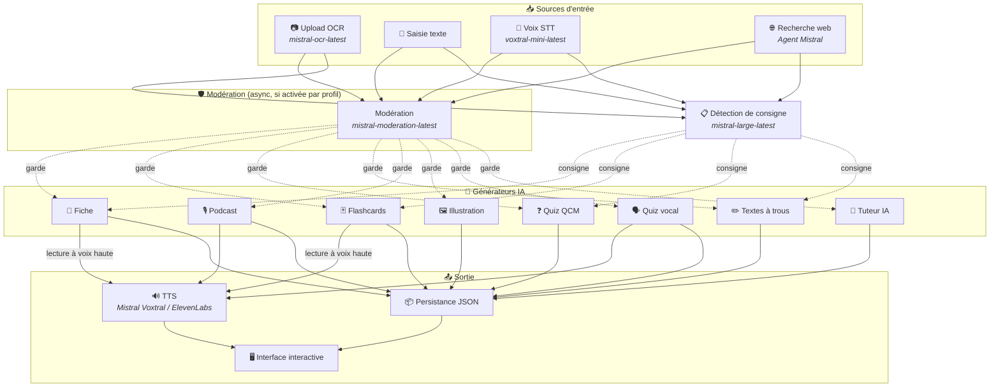
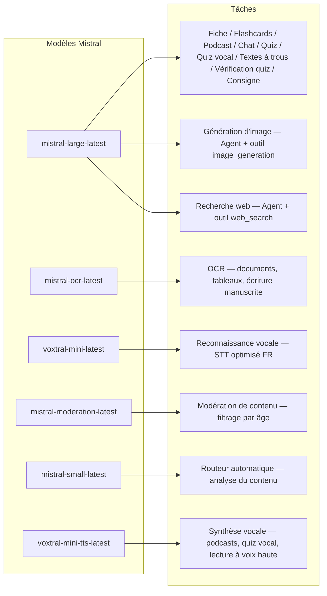
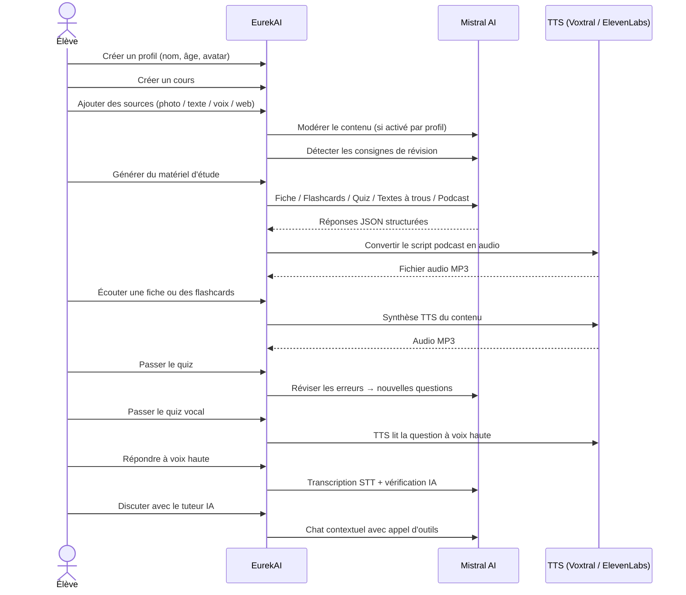

<p align="center">
  
</p>

<h1 align="center">EurekAI</h1>

<p align="center">
  <strong>حوّل أي محتوى إلى تجربة تعلم تفاعلية — مدعومة بواسطة <a href="https://mistral.ai">Mistral AI</a>.</strong>
</p>

<p align="center">
  <a href="README-en.md">🇬🇧 English</a> · <a href="README-es.md">🇪🇸 Español</a> · <a href="README-pt.md">🇧🇷 Português</a> · <a href="README-de.md">🇩🇪 Deutsch</a> · <a href="README-it.md">🇮🇹 Italiano</a> · <a href="README-nl.md">🇳🇱 Nederlands</a> · <a href="README-ar.md">🇸🇦 العربية</a><br>
  <a href="README-hi.md">🇮🇳 हिन्दी</a> · <a href="README-zh.md">🇨🇳 中文</a> · <a href="README-ja.md">🇯🇵 日本語</a> · <a href="README-ko.md">🇰🇷 한국어</a> · <a href="README-pl.md">🇵🇱 Polski</a> · <a href="README-ro.md">🇷🇴 Română</a> · <a href="README-sv.md">🇸🇪 Svenska</a>
</p>

<p align="center">
  <a href="https://www.youtube.com/watch?v=_b1TQz2leoI"></a>
</p>

<h4 align="center">📊 جودة الشيفرة</h4>

<p align="center">
  <a href="https://sonarcloud.io/summary/new_code?id=jls42_EurekAI"></a>
  <a href="https://sonarcloud.io/summary/new_code?id=jls42_EurekAI"></a>
  <a href="https://sonarcloud.io/summary/new_code?id=jls42_EurekAI"></a>
  <a href="https://sonarcloud.io/summary/new_code?id=jls42_EurekAI"></a>
</p>
<p align="center">
  <a href="https://sonarcloud.io/summary/new_code?id=jls42_EurekAI"></a>
  <a href="https://sonarcloud.io/summary/new_code?id=jls42_EurekAI"></a>
  <a href="https://sonarcloud.io/summary/new_code?id=jls42_EurekAI"></a>
  <a href="https://sonarcloud.io/summary/new_code?id=jls42_EurekAI"></a>
</p>

---

## القصة — لماذا EurekAI ؟

**EurekAI** وُلد خلال [هاكاثون Mistral AI العالمي](https://luma.com/mistralhack-online) ([الموقع الرسمي](https://worldwide-hackathon.mistral.ai/)) (مارس 2026). كنت أحتاج لموضوع — وفكرت في شيء ملموس جدًا: أنا أتحضر بانتظام للاختبارات مع ابنتي، وفكرت أنه من الممكن جعل ذلك أكثر متعة وتفاعلية بفضل الذكاء الاصطناعي.

الهدف: أخذ **أي مدخل** — صورة من الكتاب المدرسي، نص منسوخ ولصق، تسجيل صوتي، بحث على الويب — وتحويله إلى **ملاحظات مراجعة، بطاقات فلاش، اختبارات، بودكاست، نصوص بفراغات، رسوم توضيحية، والمزيد**. كل ذلك مدعوم بنماذج Mistral AI الفرنسية، مما يجعله حلًا مناسبًا بطبيعته للطلاب الناطقين بالفرنسية.

انطلق المشروع خلال الهاكاثون، ثم تم استكماله وتطويره لاحقًا. كامل الشيفرة مُولَّدة بواسطة IA — أساسًا عبر [Claude Code](https://docs.anthropic.com/en/docs/claude-code)، مع بعض الإسهامات عبر [Codex](https://openai.com/index/introducing-codex/).

---

## الميزات

| | الميزة | الوصف |
|---|---|---|
| 📷 | **Upload OCR** | التقط صورة لكتابك أو ملاحظاتك — Mistral OCR يستخرج المحتوى |
| 📝 | **Saisie texte** | اكتب أو الصق أي نص مباشرة |
| 🎤 | **Entrée vocale** | قم بتسجيل صوتك — Voxtral STT يحول كلامك إلى نص |
| 🌐 | **Recherche web** | اطرح سؤالًا — يقوم وكيل Mistral بالبحث عن الإجابات على الويب |
| 📄 | **Fiches de révision** | ملاحظات مُنظمة مع نقاط رئيسية، مفردات، اقتباسات، حِكايات |
| 🃏 | **Flashcards** | بطاقات سؤال/جواب مع مراجع للمصادر لتقنية الحفظ النشط (عدد قابل للتعديل) |
| ❓ | **Quiz QCM** | أسئلة متعددة الخيارات مع مراجعة تكيفية للأخطاء (عدد قابل للتعديل) |
| ✏️ | **Textes à trous** | تمارين تُكمل فيها الفراغات مع دلائل وتصحيح متسامح |
| 🎙️ | **Podcast** | بودكاست قصير بصوتين مُحوّل إلى صوت عبر Mistral Voxtral TTS |
| 🖼️ | **Illustrations** | صور تعليمية مُولَّدة بواسطة وكيل Mistral |
| 🗣️ | **Quiz vocal** | أسئلة تُقرأ بصوت عالٍ، إجابة شفهية، وتتحقق IA من الإجابة |
| 💬 | **Tuteur IA** | مدرس آلي سياقي مع وثائق دروسك، مع استدعاء أدوات |
| 🧠 | **Routeur automatique** | موجّه مبني على `mistral-small-latest` يحلل المحتوى ويقترح مجموعة من المولدات من بين 7 أنواع متاحة |
| 🔒 | **Contrôle parental** | رقابة حسب العمر، رمز PIN للوالدين، قيود الدردشة |
| 🌍 | **Multilingue** | واجهة متاحة بـ 9 لغات؛ التوليد عبر IA قابل للتوجيه في 15 لغة عبر الـ prompts |
| 🔊 | **Lecture à voix haute** | استمع للملاحظات وبطاقات الفلاش عبر Mistral Voxtral TTS أو ElevenLabs |

---

## نظرة عامة على البنية



---

## خريطة استخدام النماذج



---

## رحلة المستخدم



---

## غوص متعمق — الميزات

### إدخال متعدد الوسائط

EurekAI يقبل 4 أنواع من المصادر، مع تطبيق رقابة حسب الملف الشخصي (مفعّلة افتراضيًا للطفل والمراهق):

- **Upload OCR** — ملفات JPG، PNG أو PDF مُعالَجة بواسطة `mistral-ocr-latest`. يتعامل مع النص المطبوع، الجداول والكتابة اليدوية.
- **Texte libre** — اكتب أو الصق أي محتوى. يتم مراقبته قبل التخزين إذا كانت المراقبة مُفعّلة.
- **Entrée vocale** — سجّل صوتًا في المتصفح. يُنقَل إلى نص بواسطة `voxtral-mini-latest`. الإعداد `language="fr"` يحسّن التعرف.
- **Recherche web** — أدخل استعلامًا. وكيل Mistral مؤقت مع الأداة `web_search` يجلب ويلخّص النتائج.

### توليد محتوى بواسطة IA

سبعة أنواع من المواد التعليمية المولَّدة:

| المولد | النموذج | المخرجات |
|---|---|---|
| **Fiche de révision** | `mistral-large-latest` | عنوان، ملخص، نقاط رئيسية، مفردات، اقتباس، حكاية |
| **Flashcards** | `mistral-large-latest` | بطاقات سؤال/جواب مع مراجع للمصادر (عدد قابل للتعديل) |
| **Quiz QCM** | `mistral-large-latest` | أسئلة متعددة الخيارات، تفسيرات، مراجعة تكيفية (عدد قابل للتعديل) |
| **Textes à trous** | `mistral-large-latest` | جمل لملئ الفراغات مع دلائل، تصحيح متسامح (Levenshtein) |
| **Podcast** | `mistral-large-latest` + Voxtral TTS | نص بصوتين → ملف صوتي MP3 |
| **Illustration** | Agent `mistral-large-latest` | صورة تعليمية عبر الأداة `image_generation` |
| **Quiz vocal** | `mistral-large-latest` + Voxtral TTS + STT | أسئلة TTS → إجابة STT → تحقق IA |

### مدرس آلي عبر الدردشة

مدرس محادثة مع وصول كامل إلى وثائق الدروس:

- يستخدم `mistral-large-latest`
- **استدعاء أدوات** : يمكنه توليد ملاحظات، بطاقات فلاش، اختبارات أو نصوص بفراغات أثناء المحادثة
- سجل محادثة يصل إلى 50 رسالة لكل مادة
- مراقبة المحتوى إذا كانت مفعلة للملف الشخصي

### الموجّه التلقائي

يستخدم الموجّه `mistral-small-latest` لتحليل محتوى المصادر واقتراح المولدات الأنسب من بين 7 متاحة. الواجهة تعرض التقدّم في الوقت الحقيقي: أولًا مرحلة التحليل، ثم عمليات التوليد الفردية مع إمكانية الإلغاء.

### التعلم التكيُّفي

- **إحصائيات الاختبارات** : متابعة المحاولات ودقة الإجابات لكل سؤال
- **مراجعة الاختبارات** : يولّد 5-10 أسئلة جديدة تستهدف المفاهيم الضعيفة
- **كشف التوجيهات** : يكتشف تعليمات المراجعة ("أعرف درسي إذا أردت أن أعرف...") ويعطيها أولوية في المولدات النصية المتوافقة (مذكرة، بطاقات فلاش، اختبار، نصوص بفراغات)

### الأمان والرقابة الأبوية

- **4 مجموعات عمرية** : طفل (≤10 سنوات)، مراهق (11-15)، طالب (16-25)، بالغ (26+)
- **مراقبة المحتوى** : `mistral-moderation-latest` مع 5 فئات محجوبة للأطفال/المراهقين (`sexual`, `hate_and_discrimination`, `violence_and_threats`, `selfharm`, `jailbreaking`)، لا قيود للطالب/البالغ
- **PIN للوالدين** : هاش SHA-256، مطلوب للملفات الشخصية دون 15 سنة. لنشر في الإنتاج، يُنصح بهاش بطيء مع ملح (Argon2id، bcrypt).
- **قيود الدردشة** : الدردشة الآلية معطلة افتراضيًا لمن هم دون 16 سنة، ويمكن تفعيلها من قبل الوالدين

### نظام متعدد الملفات الشخصية

- ملفات شخصية متعددة مع اسم، عمر، صورة رمزية، تفضيلات اللغة
- مشاريع مرتبطة بالملفات عبر `profileId`
- حذف متسلسل: حذف ملف شخصي يحذف كل مشاريعه

### TTS متعدد المزودين

- **Mistral Voxtral TTS** (افتراضي) : `voxtral-mini-tts-latest`، لا حاجة لمفتاح إضافي
- **ElevenLabs** (بديل) : `eleven_v3`، أصوات طبيعية، يتطلب `ELEVENLABS_API_KEY`
- يمكن اختيار المزود في إعدادات التطبيق

### التدويل

- واجهة متاحة بـ 9 لغات: fr, en, es, pt, it, nl, de, hi, ar
- الـ prompts الخاصة بالذكاء الاصطناعي تدعم 15 لغة (fr, en, es, de, it, pt, nl, ja, zh, ko, ar, hi, pl, ro, sv)
- اللغة قابلة للتعيين لكل ملف شخصي

---

## التقنيات المستخدمة

| الطبقة | التقنية | الدور |
|---|---|---|
| **Runtime** | Node.js + TypeScript 6.x | الخادم وضمان أنواع البيانات |
| **Backend** | Express 5.x | واجهة برمجة تطبيقات REST |
| **Serveur de dev** | Vite 8.x (Rolldown) + tsx | HMR، partials Handlebars، proxy |
| **Frontend** | HTML + TailwindCSS 4.x + Alpine.js 3.x | واجهة تفاعلية، TypeScript مترجم عبر Vite |
| **Templating** | vite-plugin-handlebars | تركيب HTML عبر partials |
| **IA** | Mistral AI SDK 2.x | دردشة، OCR، STT، TTS، وكلاء، مراقبة |
| **TTS (défaut)** | Mistral Voxtral TTS | `voxtral-mini-tts-latest`، دمج تحويل النص إلى كلام |
| **TTS (alternatif)** | ElevenLabs SDK 2.x | `eleven_v3`، أصوات طبيعية |
| **Icônes** | Lucide 1.x | مكتبة أيقونات SVG |
| **Markdown** | Marked | عرض الماركداون داخل الدردشة |
| **Upload fichiers** | Multer 2.x | معالجة نماذج multipart |
| **Audio** | ffmpeg-static | دمج مقاطع الصوت |
| **Tests** | Vitest | اختبارات وحدوية — التغطية مقاسة عبر SonarCloud |
| **Persistance** | Fichiers JSON | تخزين بدون اعتماد خارجي |

---

## مرجع النماذج

| النموذج | الاستخدام | لماذا |
|---|---|---|
| `mistral-large-latest` | مذكرة، بطاقات فلاش، بودكاست، اختبار، نصوص بفراغات، دردشة، تحقق من الاختبار الصوتي، وكيل الصور، وكيل البحث على الويب، كشف التوجيهات | أفضل متعدد اللغات + اتّباع التعليمات |
| `mistral-ocr-latest` | OCR للوثائق | نص مطبوع، جداول، كتابة يدوية |
| `voxtral-mini-latest` | التعرف على الصوت (STT) | STT متعدد اللغات، محسّن مع `language="fr"` |
| `voxtral-mini-tts-latest` | توليد الصوت (TTS) | بودكاست، اختبار صوتي، قراءة نصوص بصوت عالٍ |
| `mistral-moderation-latest` | مراقبة المحتوى | 5 فئات محجوبة للأطفال/المراهقين (+ محاولات تجاوز القيود) |
| `mistral-small-latest` | الموجّه التلقائي | تحليل سريع للمحتوى لاتخاذ قرارات التوجيه |
| `eleven_v3` (ElevenLabs) | توليد الصوت (TTS بديل) | أصوات طبيعية، بديل قابل للتكوين |

---

## بدء سريع

```bash
# Cloner le dépôt
git clone https://github.com/jls42/EurekAI.git
cd EurekAI

# Installer les dépendances
npm install

# Configurer les clés API
cp .env.example .env
# Éditez .env avec vos clés :
#   MISTRAL_API_KEY=votre_clé_ici           (requis)
#   ELEVENLABS_API_KEY=votre_clé_ici        (optionnel, TTS alternatif)
#   SONAR_TOKEN=...                          (optionnel, CI SonarCloud uniquement)

# Lancer le développement
npm run dev
# → Backend :  http://localhost:3000 (API)
# → Frontend : http://localhost:5173 (serveur Vite avec HMR)
```

> **ملاحظة** : Mistral Voxtral TTS هو المزود الافتراضي — لا حاجة لمفتاح إضافي بخلاف `MISTRAL_API_KEY`. ElevenLabs هو مزود TTS بديل قابل للتكوين في الإعدادات.

---

## هيكل المشروع

```
server.ts                 — Point d'entrée Express, monte les routes + config
config.ts                 — Config runtime (modèles, voix, TTS provider), persistée dans output/config.json
store.ts                  — ProjectStore : CRUD projets/sources/générations, persistance JSON
profiles.ts               — ProfileStore : gestion des profils, hachage PIN
types.ts                  — Types TypeScript : Source, Generation (7 types), QuizStats, Profile
prompts.ts                — Tous les prompts IA centralisés (system + user templates, 15 langues)

generators/
  ocr.ts                  — Upload + OCR via Mistral (JPG, PNG, PDF)
  summary.ts              — Génération de fiche de révision (JSON structuré)
  flashcards.ts           — Flashcards Q/R (5-50, configurable)
  quiz.ts                 — Quiz QCM (5-50 questions, configurable) + révision adaptative
  fill-blank.ts           — Exercices à trous avec validation tolérante
  podcast.ts              — Script podcast 2 voix
  quiz-vocal.ts           — Quiz vocal : questions TTS + réponses STT + vérification IA
  image.ts                — Génération d'image via Agent Mistral (outil image_generation)
  chat.ts                 — Tuteur IA par chat avec appel d'outils
  router.ts               — Routeur automatique (contenu → générateurs recommandés)
  consigne.ts             — Détection de consignes de révision
  tts-provider.ts         — Dispatch TTS multi-provider (Mistral Voxtral / ElevenLabs)
  tts.ts                  — Génération audio podcast (concaténation de segments)
  stt.ts                  — Voxtral STT (audio → texte)
  websearch.ts            — Agent Mistral avec outil web_search
  moderation.ts           — Modération de contenu (filtrage par âge)

routes/
  projects.ts             — CRUD projets
  profiles.ts             — CRUD profils avec gestion du PIN
  sources.ts              — Upload OCR, texte libre, voix STT, recherche web, modération
  generate.ts             — Endpoints de génération (7 types + auto + route)
  generations.ts          — Tentatives de quiz/fill-blank, réponses vocales, lecture à voix haute
  chat.ts                 — Chat IA avec appel d'outils

helpers/
  index.ts                — getContent, stripJsonMarkdown, safeParseJson, unwrapJsonArray, extractAllText, timer
  audio.ts                — collectStream (ReadableStream → Buffer)
  fill-blank-validate.ts  — Validation tolérante des réponses (normalisation, Levenshtein)
  diversity.ts            — Diversité des générations (exclusion du contenu déjà produit, randomSeed)

src/                      — Frontend (Vite + Handlebars)
  index.html              — Point d'entrée HTML principal
  main.ts                 — Entrée frontend (init Alpine.js + icônes Lucide)
  app/                    — Modules applicatifs Alpine.js
    state.ts              — Gestion d'état réactif
    navigation.ts         — Routage des vues + gardes par âge
    profiles.ts           — Logique du sélecteur de profils
    projects.ts           — CRUD des cours
    sources.ts            — Gestionnaires d'upload de sources
    generate.ts           — Déclencheurs de génération (individuel, tout, auto 2 phases)
    generations.ts        — Affichage + actions sur les générations
    chat.ts               — Interface de chat
    config.ts             — Interface de configuration (modèles, voix, TTS provider)
    render.ts             — Helpers de rendu HTML
    i18n.ts               — Changement de langue
    ...
  components/
    quiz.ts               — Composant quiz interactif
    quiz-vocal.ts         — Composant quiz vocal
    fill-blank.ts         — Composant textes à trous
    flashcards.ts         — Composant flashcards avec retournement
    step-by-step.ts       — Mixin navigation pas-à-pas (quiz, fill-blank, flashcards)
  i18n/
    fr.ts, en.ts, es.ts, — Dictionnaires par langue (9 langues)
    pt.ts, it.ts, nl.ts,
    de.ts, hi.ts, ar.ts
    languages.ts          — Registre des langues UI disponibles
    index.ts              — Chargeur i18n
  partials/               — Partials HTML Handlebars (header, sidebar, dialogues, vues)
  styles/
    main.css              — Entrée TailwindCSS
    theme.css             — Variables de thème personnalisées

public/assets/            — Ressources statiques (logo, avatars)
output/                   — Données d'exécution (projets, config, fichiers audio)
```

---

## مرجع API

### الإعدادات
| الطريقة | نقطة النهاية | الوصف |
|---|---|---|
| `GET` | `/api/config` | الإعداد الحالي |
| `PUT` | `/api/config` | تعديل الإعداد (النماذج، الأصوات، مزود TTS) |
| `GET` | `/api/config/status` | حالة واجهات الـ APIs (Mistral, ElevenLabs, TTS) |
| `POST` | `/api/config/reset` | إعادة الإعداد إلى الافتراضي |
| `GET` | `/api/config/voices` | سرد أصوات Mistral TTS (اختياري `?lang=fr`) |

### الملفات الشخصية
| الطريقة | نقطة النهاية | الوصف |
|---|---|---|
| `GET` | `/api/profiles` | سرد جميع الملفات الشخصية |
| `POST` | `/api/profiles` | إنشاء ملف شخصي |
| `PUT` | `/api/profiles/:id` | تعديل ملف شخصي (يتطلب PIN لأقل من 15 سنة) |
| `DELETE` | `/api/profiles/:id` | حذف ملف شخصي + حذف متسلسل للمشاريع `{pin?}` → `{ok, deletedProjects}` |

### المشاريع
| الطريقة | نقطة النهاية | الوصف |
|---|---|---|
| `GET` | `/api/projects` | سرد المشاريع (`?profileId=` اختياري) |
| `POST` | `/api/projects` | إنشاء مشروع `{name, profileId}` |
| `GET` | `/api/projects/:pid` | تفاصيل المشروع |
| `PUT` | `/api/projects/:pid` | إعادة تسمية `{name}` |
| `DELETE` | `/api/projects/:pid` | حذف المشروع |

### المصادر
| الطريقة | نقطة النهاية | الوصف |
|---|---|---|
| `POST` | `/api/projects/:pid/sources/upload` | Upload OCR (ملفات multipart) |
| `POST` | `/api/projects/:pid/sources/text` | نص حر `{text}` |
| `POST` | `/api/projects/:pid/sources/voice` | صوت STT (ملفات صوتية multipart) |
| `POST` | `/api/projects/:pid/sources/websearch` | بحث ويب `{query}` |
| `DELETE` | `/api/projects/:pid/sources/:sid` | حذف مصدر |
| `POST` | `/api/projects/:pid/moderate` | مراقبة `{text}` |
| `POST` | `/api/projects/:pid/detect-consigne` | كشف توجيهات المراجعة |

### التوليد
| الطريقة | نقطة النهاية | الوصف |
|---|---|---|
| `POST` | `/api/projects/:pid/generate/summary` | مذكرة مراجعة |
| `POST` | `/api/projects/:pid/generate/flashcards` | بطاقات فلاش |
| `POST` | `/api/projects/:pid/generate/quiz` | اختبار متعدد الخيارات |
| `POST` | `/api/projects/:pid/generate/fill-blank` | نصوص بفراغات |
| `POST` | `/api/projects/:pid/generate/podcast` | بودكاست |
| `POST` | `/api/projects/:pid/generate/image` | رسم توضيحي |
| `POST` | `/api/projects/:pid/generate/quiz-vocal` | اختبار صوتي |
| `POST` | `/api/projects/:pid/generate/quiz-review` | مراجعة تكيفية `{generationId, weakQuestions}` |
| `POST` | `/api/projects/:pid/generate/route` | تحليل التوجيه (خطة المولدات التي ستُشغّل) |
| `POST` | `/api/projects/:pid/generate/auto` | توليد تلقائي على الواجهة الخلفية (توجيه + 5 أنواع : summary, flashcards, quiz, fill-blank, podcast) |

جميع مسارات التوليد تقبل `{sourceIds?, lang?, ageGroup?, count?, useConsigne?}`. `quiz-review` يتطلب بالإضافة `{generationId, weakQuestions}`.

### CRUD التوليدات
| الطريقة | نقطة النهاية | الوصف |
|---|---|---|
| `POST` | `/api/projects/:pid/generations/:gid/quiz-attempt` | إرسال إجابات الاختبار `{answers}` |
| `POST` | `/api/projects/:pid/generations/:gid/fill-blank-attempt` | إرسال إجابات نصوص الفراغات `{answers}` |
| `POST` | `/api/projects/:pid/generations/:gid/vocal-answer` | التحقق من إجابة شفهية (صوت + مؤشر السؤال) |
| `POST` | `/api/projects/:pid/generations/:gid/read-aloud` | تشغيل TTS بصوت عالٍ (مذكرات/بطاقات فلاش) |
| `PUT` | `/api/projects/:pid/generations/:gid` | إعادة تسمية `{title}` |
| `DELETE` | `/api/projects/:pid/generations/:gid` | حذف التوليد |

### الدردشة
| الطريقة | نقطة النهاية | الوصف |
|---|---|---|
| `GET` | `/api/projects/:pid/chat` | استرداد سجل الدردشة |
| `POST` | `/api/projects/:pid/chat` | إرسال رسالة `{message, lang, ageGroup}` |
| `DELETE` | `/api/projects/:pid/chat` | مسح سجل الدردشة |

---

## القرارات المعمارية

| القرار | المبرر |
|---|---|
| **Alpine.js plutôt que React/Vue** | بصمة خفيفة، تفاعلية بسيطة مع TypeScript مترجم عبر Vite. مثالي لهاكاثون حيث السرعة مهمة. |
| **Persistance en fichiers JSON** | صفر تبعيات، بدء فوري. لا حاجة لإعداد قاعدة بيانات — تبدأ العمل فورًا. |
| **Vite + Handlebars** | أفضل ما في العالمين: HMR سريع للتطوير، قوالب HTML جزئية لتنظيم الكود، Tailwind JIT. |
| **Prompts centralisés** | جميع موجهات الذكاء الاصطناعي في `prompts.ts` — سهل التكرار والاختبار والتكييف حسب اللغة/الفئة العمرية. |
| **Système multi-générations** | كل توليد هو كائن مستقل له معرّف خاص — يسمح بعدة بطاقات، اختبارات قصيرة، إلخ لكل درس. |
| **Prompts adaptés par âge** | 4 مجموعات عمرية مع مفردات وتعقيد ونبرة مختلفة — نفس المحتوى يعلّم بشكل مختلف حسب المتعلّم. |
| **Fonctionnalités basées sur les Agents** | توليد الصور والبحث على الويب يستخدمان وكلاء Mistral مؤقتين — دورة حياة منفصلة مع تنظيف تلقائي. |
| **TTS multi-provider** | TTS متعدد المزودين: Mistral Voxtral TTS افتراضيًا (بدون مفتاح إضافي)، ElevenLabs كبديل — قابل للتكوين دون إعادة تشغيل. |

---

## الاعتمادات والشكر

- **[Mistral AI](https://mistral.ai)** — نماذج ذكاء اصطناعي (Large, OCR, Voxtral STT, Voxtral TTS, Moderation, Small) + هاكاثون عالمي
- **[ElevenLabs](https://elevenlabs.io)** — محرك توليف صوت بديل (`eleven_v3`)
- **[Alpine.js](https://alpinejs.dev)** — إطار تفاعلي خفيف الوزن
- **[TailwindCSS](https://tailwindcss.com)** — إطار CSS قائم على الأدوات
- **[Vite](https://vitejs.dev)** — أداة بناء للواجهة الأمامية
- **[Lucide](https://lucide.dev)** — مكتبة أيقونات
- **[Marked](https://marked.js.org)** — محلل Markdown

انطلق خلال هاكاثون Mistral AI العالمي (مارس 2026)، وتم تطويره بالكامل بواسطة الذكاء الاصطناعي باستخدام Claude Code وCodex.

---

## المؤلف

**Julien LS** — [contact@jls42.org](mailto:contact@jls42.org)

## الترخيص

[AGPL-3.0](LICENSE) — حقوق النشر (C) 2026 Julien LS

**تمت ترجمة هذا المستند من النسخة الفرنسية إلى اللغة العربية باستخدام نموذج gpt-5-mini. لمزيد من المعلومات حول عملية الترجمة، راجع https://gitlab.com/jls42/ai-powered-markdown-translator**

