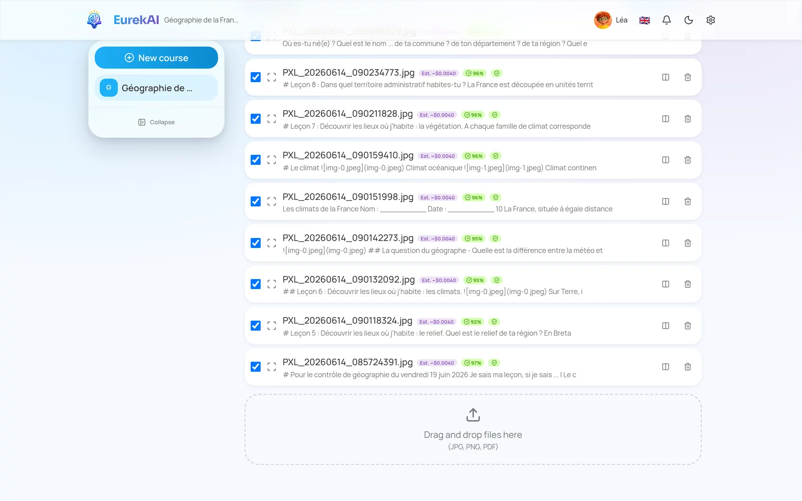

<p align="center">
  
</p>

<h1 align="center">EurekAI</h1>

<p align="center">
  <strong>حوِّل أي محتوى إلى تجربة تعلّم تفاعلية — مدعومة بـ <a href="https://mistral.ai">Mistral AI</a>.</strong>
</p>

<p align="center">
  <a href="README-en.md">🇬🇧 الإنجليزية</a> · <a href="README-es.md">🇪🇸 الإسبانية</a> · <a href="README-pt.md">🇧🇷 البرتغالية</a> · <a href="README-de.md">🇩🇪 الألمانية</a> · <a href="README-it.md">🇮🇹 الإيطالية</a> · <a href="README-nl.md">🇳🇱 الهولندية</a> · <a href="README-ar.md">🇸🇦 العربية</a><br>
  <a href="README-hi.md">🇮🇳 الهندية</a> · <a href="README-zh.md">🇨🇳 الصينية</a> · <a href="README-ja.md">🇯🇵 اليابانية</a> · <a href="README-ko.md">🇰🇷 الكورية</a> · <a href="README-pl.md">🇵🇱 البولندية</a> · <a href="README-ro.md">🇷🇴 الرومانية</a> · <a href="README-sv.md">🇸🇪 السويدية</a>
</p>

<p align="center">
  <a href="https://www.youtube.com/watch?v=_b1TQz2leoI"></a>
</p>

<h4 align="center">📊 جودة الكود</h4>

<p align="center">
  <a href="https://sonarcloud.io/summary/new_code?id=jls42_EurekAI"></a>
  <a href="https://sonarcloud.io/summary/new_code?id=jls42_EurekAI"></a>
  <a href="https://sonarcloud.io/summary/new_code?id=jls42_EurekAI"></a>
  <a href="https://sonarcloud.io/summary/new_code?id=jls42_EurekAI"></a>
</p>
<p align="center">
  <a href="https://sonarcloud.io/summary/new_code?id=jls42_EurekAI"></a>
  <a href="https://sonarcloud.io/summary/new_code?id=jls42_EurekAI"></a>
  <a href="https://sonarcloud.io/summary/new_code?id=jls42_EurekAI"></a>
  <a href="https://sonarcloud.io/summary/new_code?id=jls42_EurekAI"></a>
</p>
<p align="center">
  <a href="https://app.codacy.com/gh/jls42/EurekAI/dashboard?utm_source=gh&utm_medium=referral&utm_content=&utm_campaign=Badge_grade"></a>
  <a href="https://www.codefactor.io/repository/github/jls42/eurekai"></a>
</p>

---

## القصة — لماذا EurekAI؟

وُلد **EurekAI** خلال [Mistral AI Worldwide Hackathon](https://luma.com/mistralhack-online) ([الموقع الرسمي](https://worldwide-hackathon.mistral.ai/)) (مارس 2026). كنت بحاجة إلى فكرة — وجاءت الفكرة من شيء ملموس جدًا: أنا أراجع الدروس بانتظام مع ابنتي، وفكّرت أنه لا بد من إمكانية جعل ذلك أكثر متعة وتفاعلية بفضل الذكاء الاصطناعي.

الهدف: أخذ **أي مدخل** — صورة للدرس، نص منسوخ ولصق، تسجيل صوتي، بحث على الويب — وتحويله إلى **مذكرات مراجعة، بطاقات تعليمية، اختبارات قصيرة، بودكاست، نصوص ذات فراغات، رسومات توضيحية، وأكثر من ذلك**. وكل ذلك مدعوم بنماذج Mistral AI الفرنسية، مما يجعله حلًا مناسبًا طبيعيًا للطلاب الناطقين بالفرنسية.

تم تصميم [النموذج الأولي](https://github.com/jls42/worldwide-hackathon.mistral.ai) خلال 48 ساعة أثناء الهاكاثون كإثبات للفكرة حول خدمات Mistral — وكان يعمل بالفعل، لكنه محدود. ومنذ ذلك الحين، أصبح EurekAI مشروعًا حقيقيًا: نصوص ذات فراغات، والتنقّل داخل التمارين، وجلب المحتوى من الويب، وإشراف أبوي قابل للتخصيص، ومراجعة عميقة للكود، وأكثر من ذلك بكثير. يتم توليد كامل الكود بواسطة الذكاء الاصطناعي — بشكل أساسي [Claude Code](https://code.claude.com/)، مع بعض المساهمات عبر [Codex](https://openai.com/codex/) و[Gemini CLI](https://geminicli.com/).

---

## نظرة عامة

<p align="center">
  
</p>

| | |
|---|---|
| <br>**لوحة التحكم** — أحدث عمليات التوليد، التكلفة المقدّرة لكل بطاقة والإجمالي للمشروع، زر «Auto — Magie !» | <br>**المصادر** — استيراد صورة/PDF/نص/صوت/ويب، توليد بنقرة واحدة، اكتشاف التعليمات |
| <br>**جدول المصادر** — مقياس الثقة في OCR، والإشراف، والتكلفة المقدرة | |

### المكوّنات أثناء العمل

| | |
|---|---|
| <br>**مذكرة مراجعة** — النقاط الأساسية، المفردات، الاقتباسات الموثقة، قراءة صوتية حسب القسم | <br>**اختبار QCM** — تغذية راجعة فورية مع شرح، تنقّل خطوة بخطوة |
| <br>**بطاقات تعليمية** — بطاقة قابلة للقلب ثم تقييم ذاتي «كنت أعرف / لم أكن أعرف» | <br>**نصوص ذات فراغات** — تلميح عند الطلب، تحقق متسامح |
| <br>**إملاء** — كلمة مملاة صوتيًا، تصحيح صارم حرفًا بحرف | <br>**اختبار صوتي** — سؤال مقروء بصوت عالٍ، إجابة عبر الميكروفون |
| <br>**بودكاست** — بودكاست قصير بصوتين، نص حواري قابل للاطلاع | <br>**رسومات توضيحية** — صور تعليمية مُولَّدة بواسطة Agent |
| <br>**معلّم الذكاء الاصطناعي** — دردشة مرتبطة بوثائق الدرس، بإجابات مشروحة، ويمكنه توليد اختبارات وبطاقات تعليمية | |

### البدء السريع

| | |
|---|---|
| <br>**اختيار الملف الشخصي** — لكل طفل مساحته، وأفاتاره، ولغته | <br>**إنشاء ملف شخصي** — العمر، الأفاتار، ورمز PIN الأبوي لمن هم دون 15 عامًا |
| <br>**إنشاء مقرر** — مشروع لكل درس، جاهز لاستقبال المصادر | <br>**الإعدادات** — حالة API، اختيار نماذج الذكاء الاصطناعي مع عرض الأسعار |

---

## الميزات

| | الميزة | الوصف |
|---|---|---|
| 📷 | **استيراد الملفات** | استورد دروسك — صورة، PDF (عبر Mistral OCR مع متوسط درجة ثقة، مستويات `high`/`medium`/`low`) أو ملف نصي (TXT، MD). جلسات رفع مع إعادة المحاولة لكل ملف وتقدم فردي |
| 📝 | **إدخال نصي** | اكتب أو الصق أي نص مباشرة |
| 🎤 | **إدخال صوتي** | سجّل صوتك — Voxtral STT يفرّغ صوتك إلى نص |
| 🌐 | **الويب / URL** | الصق URL (استخراج مباشر عبر Readability + Lightpanda) أو اكتب بحثًا (Agent Mistral web_search) |
| 📄 | **مذكرات مراجعة** | ملاحظات منظمة تتضمن نقاطًا أساسية ومفردات واقتباسات وحكايات |
| 🃏 | **بطاقات تعليمية** | بطاقات سؤال/جواب تفاعلية، مع قراءة صوتية حوارية |
| ❓ | **اختبار QCM** | أسئلة متعددة الخيارات مع مراجعة تكيفية للأخطاء (عدد قابل للتخصيص) |
| ✏️ | **نصوص ذات فراغات** | تمارين للإكمال مع تلميحات وتحقق متسامح |
| 🔤 | **إملاء** | كلمات مملاة صوتيًا (Voxtral TTS) من قائمة مستوردة، إدخال عبر لوحة المفاتيح، تصحيح صارم حرفًا بحرف مع قاعدة إملائية مشروحة |
| 🎙️ | **بودكاست** | بودكاست قصير بصوتين — صوت Mistral افتراضي أو أصوات مخصصة (للآباء !) |
| 🖼️ | **رسومات توضيحية** | صور تعليمية مُولَّدة بواسطة Agent Mistral |
| 🗣️ | **اختبار صوتي** | أسئلة تُقرأ بصوت عالٍ (صوت مخصص ممكن)، إجابة شفوية، تحقق بالذكاء الاصطناعي |
| 💬 | **معلّم الذكاء الاصطناعي** | دردشة سياقية مع وثائق الدرس الخاصة بك، مع استدعاء الأدوات |
| 🧠 | **موجّه تلقائي** | موجّه يعتمد على `mistral-small-latest` يحلل المحتوى ويقترح مزيجًا من المولّدات من بين 8 أنواع متاحة |
| 🔒 | **رقابة أبوية** | إشراف قابل للتخصيص حسب الملف الشخصي (فئات قابلة للتخصيص)، رمز PIN أبوي، قيود على الدردشة |
| 🌍 | **متعدد اللغات** | الواجهة متاحة بـ 9 لغات؛ والتوليد بالذكاء الاصطناعي قابل للتوجيه بـ 15 لغة عبر المطالبات |
| 🔊 | **القراءة بصوت عالٍ** | استمع إلى المذكرات والبطاقات التعليمية (حوار سؤال/جواب) عبر Mistral Voxtral TTS |
| 💶 | **تتبّع تكاليف API** | تقدير شفاف لتكلفة € لكل عملية توليد ولكل مصدر (tokens / characters / pages / seconds audio). شارة لكل بطاقة + إجمالي للمشروع، ظاهر في لوحة التحكم |
| 🎨 | **سِمة لكل ملف شخصي** | يختار كل ملف شخصي السمة `dark` أو `light` — وتبقى محفوظة عند تغيير الملف الشخصي |

---

## نظرة عامة على البنية المعمارية

<p align="center">
  
</p>

---

## خريطة استخدام النماذج

<p align="center">
  
</p>

---

## رحلة المستخدم

<p align="center">
  
</p>

---

## التعمّق — الميزات

### إدخال متعدد الوسائط

يقبل EurekAI 4 أنواع من المصادر، مع إشراف بحسب الملف الشخصي (مفعّل افتراضيًا للطفل والمراهق) :

- **استيراد الملفات** — تُعالَج ملفات JPG وPNG وPDF عبر OCR Mistral — **OCR 4 (`mistral-ocr-4-0`) افتراضيًا** (أفضل جودة)، **OCR 3 (`mistral-ocr-2512`) اختياريًا** في الإعدادات (أرخص، بحوالي نصف التكلفة) — للنص المطبوع والجداول والكتابة اليدوية؛ أو ملفات نصية (TXT، MD) تُستورد مباشرة. تستخدم عمليات الرفع متعددة الملفات نظام **جلسات الرفع**: تقدم فردي لكل ملف، إعادة المحاولة للملف الفاشل دون إعادة إرسال البقية، وإغلاق الجلسة عند الانتهاء. يعرض OCR **درجة الثقة** المتوسطة (`average`، مقيدة داخل `[0,1]`، محسوبة من `averagePageConfidenceScore` التي تعيدها Mistral)، وتُعرض في الواجهة على شكل شارة من المستوى `high` / `medium` / `low` (عتبات ~0.9 / ~0.7) — تنبّه دون حظر إذا كانت جودة المسح سيئة.
- **نص حر** — اكتب أو الصق أي محتوى. تتم مراجعته قبل التخزين إذا كانت المراجعة مفعّلة.
- **إدخال صوتي** — سجّل صوتًا في المتصفح. يُفرَّغ بواسطة `voxtral-mini-latest`. يتيح الإعداد `language="fr"` تحسين التعرف.
- **الويب / URL** — الصق واحدًا أو أكثر من URLs لاستخراج المحتوى مباشرة (Readability + Lightpanda للصفحات التي تعتمد على JavaScript)، أو اكتب كلمات مفتاحية للبحث على الويب عبر Agent Mistral. الحقل الواحد يقبل كلا الأمرين — يتم فصل URLs والكلمات المفتاحية تلقائيًا، ويُنشئ كل نتيجة مصدرًا مستقلاً.

### توليد المحتوى بالذكاء الاصطناعي

ثمانية أنواع من مواد التعلّم المُولَّدة:

| المولّد | النموذج | المخرجات |
|---|---|---|
| **مذكرة مراجعة** | `mistral-large-latest` | عنوان، ملخص، نقاط أساسية، مفردات، اقتباسات، حكاية |
| **بطاقات تعليمية** | `mistral-large-latest` | بطاقات سؤال/جواب مع مراجع إلى المصادر (عدد قابل للتخصيص) |
| **اختبار QCM** | `mistral-large-latest` | أسئلة متعددة الخيارات، شروحات، مراجعة تكيفية (عدد قابل للتخصيص) |
| **نصوص ذات فراغات** | `mistral-large-latest` | جمل للإكمال مع تلميحات، تحقق متسامح (Levenshtein) |
| **إملاء** | `mistral-large-latest` + Voxtral TTS | كلمات رئيسية مملاة صوتيًا (1 MP3/كلمة) → إدخال عبر لوحة المفاتيح → تصحيح صارم (العلامات) مع قاعدة مشروحة |
| **بودكاست** | `mistral-large-latest` + Voxtral TTS | نص بصوتين → صوت MP3 |
| **رسمة توضيحية** | Agent `mistral-large-latest` | صورة تعليمية عبر الأداة `image_generation` |
| **اختبار صوتي** | `mistral-large-latest` + Voxtral TTS + STT | أسئلة TTS → إجابة STT → تحقق بالذكاء الاصطناعي |

### معلّم الذكاء الاصطناعي عبر الدردشة

معلّم حواري مع وصول كامل إلى وثائق الدرس:

- يستخدم `mistral-large-latest`
- **استدعاء الأدوات**: يمكنه توليد مذكرات، بطاقات تعليمية، اختبارات أو نصوص ذات فراغات أثناء المحادثة
- سجل تاريخي من 50 رسالة لكل مقرر
- مراجعة المحتوى إذا كانت مفعلة للملف الشخصي

### الموجّه التلقائي

يستخدم الموجّه `mistral-small-latest` لتحليل محتوى المصادر واقتراح أكثر المولّدات ملاءمة من بين 8 متاحة. تعرض الواجهة التقدم في الوقت الحقيقي: أولًا مرحلة تحليل، ثم عمليات التوليد الفردية مع إمكانية الإلغاء.

### التعلّم التكيفي

- **إحصاءات الاختبار**: تتبّع المحاولات والدقة لكل سؤال
- **مراجعة الاختبار**: تولّد 5-10 أسئلة جديدة تستهدف المفاهيم الضعيفة
- **اكتشاف التعليمات**: يكتشف تعليمات المراجعة ("Je sais ma leçon si je sais...") ويمنحها الأولوية في المولّدات النصية المتوافقة (مذكرة، بطاقات تعليمية، اختبار، نصوص ذات فراغات)

### الأمن والرقابة الأبوية

- **4 فئات عمرية**: طفل (≤10 سنوات)، مراهق (11-15)، طالب (16-25)، بالغ (26+)
- **مراجعة المحتوى**: `mistral-moderation-2603` (Mistral Moderation 2) مع 10 فئات متاحة، 5 منها محجوبة افتراضيًا للطفل/المراهق (`sexual`، `hate_and_discrimination`، `violence_and_threats`، `selfharm`، `jailbreaking`). الفئات قابلة للتخصيص لكل ملف شخصي في الإعدادات. يُتجنّب alias `-latest` عمدًا (لأنه لا يزال يشير إلى نسخة مهجورة).
- **رمز PIN الأبوي**: تجزئة SHA-256، مطلوبة للملفات الشخصية دون 15 عامًا. في النشر الإنتاجي، يُنصح باستخدام تجزئة بطيئة مع ملح (Argon2id، bcrypt).
- **قيود الدردشة**: دردشة الذكاء الاصطناعي معطّلة افتراضيًا لمن هم دون 16 عامًا، ويمكن للوالدين تفعيلها

### نظام متعدد الملفات الشخصية

- ملفات شخصية متعددة مع الاسم، العمر، الأفاتار، وتفضيلات اللغة
- **صوت لكل ملف شخصي** (`Profile.mistralVoices?: { host?, guest? }` — كل دور اختياري) — يمكن لكل طفل أن يمتلك زوج أصوات خاص به للبودكاست/الاختبار الصوتي
- **سِمة لكل ملف شخصي** (`Profile.theme: 'dark' | 'light'`) — تبديل تلقائي عند تغيير الملف الشخصي، ومحفوظة في جهة الخلفية
- المشاريع مرتبطة بالملفات الشخصية عبر `profileId`
- الحذف المتسلسل: حذف ملف شخصي يحذف جميع مشاريعه

### تتبّع تكاليف API

كل استدعاء لـ Mistral (الدردشة، OCR، STT، TTS، المراجعة، الوكلاء) مُراقَب لتقديم تقدير € **شفاف** للمستخدم — دون مفاجآت في الفوترة.

- **مصدر الحقيقة**: `helpers/pricing.ts` — `MODEL_PRICING` حسب prefix النموذج (مثال: `mistral-large` → input 0.5 €/M tokens، output 1.5 €/M tokens)، `PRICING_SOURCES` مع URLs الخاصة بوثائق Mistral لإعادة الاستخراج الدوري
- **الوحدات المدعومة**: `tokens`، `characters` (TTS)، `pages` (OCR)، `audio-seconds` (STT) — تحويل مُدار بواسطة `helpers/cost-calc.ts`
- **سلسلة القياس**: `helpers/tracked-client.ts` (wrap client Mistral) → `helpers/usage-context.ts` (AsyncLocalStorage) → `helpers/cost-calc.ts` → `helpers/cost-persist.ts` → `helpers/cost-middleware.ts` (إدراج في استجابة HTTP)
- **الواجهة**: شارة تكلفة لكل عملية توليد (`src/partials/cost-badge-gen.html`)، ولكل مصدر (`cost-badge-src.html`)، وإجمالي متراكم في لوحة التحكم (`Project.totalCost`)
- **نقاط النهاية**: الاستجابات `/generate/*` و`/sources/*` تزيّن الكائن المُعاد (Generation / Source) بـ `estimatedCost` و`usage` و`costBreakdown`. يضيف `POST /generate/route` حقلًا `costDelta: number` لتكلفة التوجيه فقط. يعيد `GET /projects/:pid` المشروع مُثريًا بـ `totalCost` (المجموع المحسوب من `costLog[]`) + السجل الكامل

### TTS (Mistral Voxtral) والأصوات المخصصة

- **Mistral Voxtral TTS**: `voxtral-mini-tts-latest`، توليد صوتي 100% من Mistral، دون الحاجة إلى مفتاح إضافي
- **أصوات مخصصة**: يمكن للوالدين إنشاء أصواتهم الخاصة عبر API Mistral Voices (انطلاقًا من عينة صوتية) وإسنادها إلى أدوار المضيف/الضيف — عندها تُقرأ البودكاستات والاختبارات الصوتية بصوت أحد الوالدين، مما يجعل التجربة أكثر انغماسًا للطفل
- دوران صوتيان قابلان للتخصيص: **المضيف** (الراوي الرئيسي) و**الضيف** (الصوت الثاني في البودكاست)
- الكتالوج الكامل لأصوات Mistral متاح في الإعدادات، مع فلترة بحسب اللغة

### التدويل

- الواجهة متاحة بـ 9 لغات: fr, en, es, pt, it, nl, de, hi, ar
- المطالبات الذكية تدعم 15 لغة (fr, en, es, de, it, pt, nl, ja, zh, ko, ar, hi, pl, ro, sv)
- اللغة قابلة للتخصيص لكل ملف شخصي

---
## المكدس التقني

| الطبقة | التكنولوجيا | الدور |
|---|---|---|
| **Runtime** | Node.js + TypeScript 6.x | الخادم وسلامة الأنواع |
| **Backend** | Express 5.x | API REST |
| **خادم التطوير** | Vite 8.x (Rolldown) + tsx | HMR، partials Handlebars، proxy |
| **الواجهة الأمامية** | HTML + TailwindCSS 4.x + Alpine.js 3.x | واجهة تفاعلية، وTypeScript مُترجم بواسطة Vite |
| **القوالب** | vite-plugin-handlebars | تركيب HTML عبر partials |
| **الذكاء الاصطناعي** | Mistral AI SDK 2.x | Chat، OCR، STT، TTS، Agents، Moderation |
| **TTS** | Mistral Voxtral TTS | `voxtral-mini-tts-latest`، توليد صوتي مدمج |
| **الأيقونات** | Lucide 1.x | مكتبة أيقونات SVG |
| **استخلاص الويب** | Readability + linkedom | استخراج المحتوى الرئيسي من صفحات الويب (تقنية Firefox Reader View) |
| **متصفح headless** | Lightpanda | متصفح headless فائق الخفة (Zig + V8) لصفحات JS/SPA — fallback scraping |
| **Markdown** | Marked | عرض markdown داخل الدردشة |
| **رفع الملفات** | Multer 2.x | إدارة النماذج متعددة الأجزاء |
| **الصوت** | ffmpeg-static | دمج المقاطع الصوتية |
| **الاختبارات** | Vitest | اختبارات وحدات — التغطية تُقاس بواسطة SonarCloud |
| **الاستمرارية** | ملفات JSON | تخزين بلا تبعية |

---

## مرجع النماذج

| النموذج | الاستخدام | لماذا |
|---|---|---|
| `mistral-large-latest` | بطاقة مراجعة، Flashcards، Podcast، Quiz، نصوص ذات فراغات، Chat، التحقق الصوتي من الاختبار، Agent Image، Agent Web Search، كشف التعليمات | أفضل دعم متعدد اللغات + تتبّع التعليمات |
| `mistral-ocr-4-0` (OCR 4، افتراضي) | OCR للمستندات — جودة أعلى | نص مطبوع، جداول، كتابة يدوية ($4 / 1000 pages) |
| `mistral-ocr-2512` (OCR 3، اختياري) | OCR للمستندات | قابل للاختيار في الإعدادات، أرخص ($2 / 1000 pages) |
| `voxtral-mini-latest` | التعرّف على الكلام (STT) | STT متعدد اللغات، مُحسّن مع `language="fr"` |
| `voxtral-mini-tts-latest` | توليد الصوت (TTS) | Podcasts، quiz صوتي، القراءة بصوت عالٍ |
| `mistral-moderation-2603` | Moderation للمحتوى | 5 فئات محجوبة للأطفال/المراهقين (بما فيها `jailbreaking`) |
| `mistral-small-latest` | موجه تلقائي | تحليل سريع للمحتوى لاتخاذ قرارات التوجيه |

---

## بدء سريع

```bash
# Cloner le dépôt
git clone https://github.com/jls42/EurekAI.git
cd EurekAI

# Installer les dépendances
npm install

# Configurer les clés API
cp .env.example .env
# Éditez .env (toutes optionnelles) :
#   MISTRAL_API_KEY=<your_api_key>           (optionnel — sinon chaque utilisateur saisit sa clé dans l'app)
#   SONAR_TOKEN=...                          (optionnel, CI SonarCloud uniquement)

# Lancer le développement
npm run dev
# → Backend :  http://localhost:3000 (API)
# → Frontend : http://localhost:5173 (serveur Vite avec HMR)
```

> **ملاحظة**: Mistral Voxtral TTS هو مزوّد TTS الوحيد — لا حاجة إلى مفتاح إضافي بعد `MISTRAL_API_KEY`.

> **مفتاح API المُدخل من المستخدم**: أصبح `MISTRAL_API_KEY` الآن **اختياريًا**. إذا كان غير موجود، فسيبدأ التطبيق على أي حال ويطلب من كل مستخدم إدخال **مفتاح Mistral الخاص به** داخل الواجهة. يتم **تخزين المفتاح في المتصفح** (مشفرًا عبر Web Crypto + IndexedDB في سياق آمن) ويُرسل مع الطلب — **ولا يُحفَظ أبدًا على الخادم**. الأولوية: مفتاح الملف الشخصي > المفتاح العام للمتصفح > `MISTRAL_API_KEY` (env). تعيين `EUREKAI_REQUIRE_USER_KEY=true` يُجبر كل مستخدم على تقديم مفتاحه (ويصبح مفتاح env مفيدًا فقط للتحميلات المسبقة).

> **HTTPS المحلي (جهاز لوحي/LAN)**: يُعد `localhost` سياقًا آمنًا بالفعل. للوصول عبر LAN (جهاز لوحي)، أنشئ شهادة محلية وفعّل HTTPS لتمكين تشفير المتصفح + تشفير المفتاح أثناء النقل:
> ```bash
> ./scripts/gen-cert.sh 192.168.1.42   # mkcert إذا كان متوفرًا، وإلا self-signed عبر openssl
> export HTTPS_KEY=certs/key.pem HTTPS_CERT=certs/cert.pem
> npm run dev                          # Express + Vite عبر HTTPS
> ```

### متغيرات البيئة

| المتغير | مطلوب | الافتراضي | الدور |
|---|---|---|---|
| `MISTRAL_API_KEY` | اختياري | — | مفتاح Mistral API (chat، OCR، STT، TTS Voxtral، agents، moderation). إذا كان مفقودًا، يُدخل المستخدم مفتاحه داخل التطبيق (مخزن في المتصفح، وليس على الخادم أبدًا) |
| `EUREKAI_REQUIRE_USER_KEY` | اختياري | `false` | `true` → يعطّل fallback على `MISTRAL_API_KEY` لطلبات الذكاء الاصطناعي (يجب على كل مستخدم تقديم مفتاحه). مفيد على نسخة مكشوفة للعامة |
| `HTTPS_KEY` / `HTTPS_CERT` | اختياري | — | مسارات مفتاح/شهادة TLS (راجع `scripts/gen-cert.sh`) → يقدم Express وVite عبر HTTPS (secure context LAN/جهاز لوحي) |
| `PORT` | اختياري | `3000` | منفذ HTTP للواجهة الخلفية Express |
| `NODE_ENV` | اختياري | `development` | إذا كان `production` → يقدّم Express الواجهة الأمامية من `dist/` (وإلا `public/`) |
| `SONAR_TOKEN` | اختياري CI | — | يُستخدم فقط من قبل workflow الخاص بـ GitHub Actions SonarCloud |

### الاختبارات، جودة الشيفرة والمساهمة

```bash
npm test                # vitest (déclenche pretest : typecheck + lint:complexity + lint:ci + lint:deadcode)
npm run test:coverage   # couverture vitest
npm run lint            # ESLint + typescript-eslint + sonarjs
npm run lint:fix        # auto-fix
npm run format          # prettier
npm run security        # Opengrep (SAST local) — bloque sur finding ERROR
```

**خطافات Git (Husky)**: يُشغّل `pre-commit` بالتتابع `scripts/pre-commit-fast.sh` (التعارضات، الملفات الكبيرة، shellcheck)، ثم `lint-staged` ثم `npm test`؛ ويُشغّل `pre-push` أولًا بوابة `npm audit` (تحظر عند وجود ثغرة حرجة متعدية، راجع `scripts/audit-verdict.mjs`) ثم `npm run security`. جميعها تمنع commit/push عند الفشل.

**الأدوات الخارجية المطلوبة (اختيارية لكنها مستخدمة من قبل `pretest` / `npm run security`)**:

```bash
# Lizard (Python) pour lint:complexity (CCN > 8 sur l'allowlist)
pipx install lizard          # ou : pipx run lizard

# Opengrep (binaire standalone ~40 Mo) pour npm run security
./scripts/install-opengrep.sh   # installe dans ~/.local/bin/
```

بدون هذه الأدوات، يفشل `npm test` عند `pretest` (لأن lizard غير موجود) ويفشل `npm run security` (لأن opengrep غير موجود). عندها تحظر خطافات husky عملية commit/push.

---

## النشر باستخدام الحاوية

تُنشر الصورة على **GitHub Container Registry**:

```bash
# Télécharger l'image
podman pull ghcr.io/jls42/eurekai:latest

# Lancer EurekAI
mkdir -p ./data
podman run -d --name eurekai \
  -e MISTRAL_API_KEY=<your_api_key> \
  -v ./data:/app/output:U \
  -p 3000:3000 \
  ghcr.io/jls42/eurekai:latest
# → http://localhost:3000
```

> **`:U`** هو flag في Podman rootless يضبط أذونات الحجم تلقائيًا.

```bash
# Build local
podman build -t eurekai -f Containerfile .

# Publier sur ghcr.io (mainteneurs)
./scripts/publish-ghcr.sh
```

---

## بنية المشروع

```
server.ts                 — Point d'entrée Express, monte les routes + config
config.ts                 — Config runtime (modèles, voix, modèle TTS), persistée dans output/config.json
store.ts                  — ProjectStore : CRUD projets/sources/générations, persistance JSON
profiles.ts               — ProfileStore : gestion des profils, hachage PIN
types.ts                  — Types TypeScript : Source, Generation (8 types), QuizStats, Profile
prompts.ts                — Tous les prompts IA centralisés (system + user templates, 15 langues)

generators/
  auto-agents.ts          — Source unique de vérité : AUTO_AGENTS_SET (8 agents) + MAX_AUTO_PLAN_LENGTH
  generation-types.ts     — Types générables individuellement (SINGLE_GENERATE_TYPES, coïncide avec les 8 agents auto)
  ocr.ts                  — OCR via Mistral (JPG, PNG, PDF) avec extraction interne des scores de confiance moyens par page
  summary.ts              — Génération de fiche de révision (JSON structuré)
  flashcards.ts           — Flashcards Q/R (nombre configurable)
  quiz.ts                 — Quiz QCM (nombre configurable) + révision adaptative
  fill-blank.ts           — Exercices à trous avec validation tolérante
  dictation.ts            — Dictée : mots + phrases-exemples + règles, 1 audio TTS par mot (8e agent auto)
  podcast.ts              — Script podcast 2 voix
  quiz-vocal.ts           — Quiz vocal : questions TTS + réponses STT + vérification IA
  image.ts                — Génération d'image via Agent Mistral (outil image_generation)
  chat.ts                 — Tuteur IA par chat avec appel d'outils
  router.ts               — Routeur automatique (contenu → générateurs recommandés)
  consigne.ts             — Détection de consignes de révision
  tts-provider.ts         — TTS Mistral Voxtral (synthèse vocale + listing des voix)
  tts.ts                  — Génération audio multi-voix (podcast + flashcards, concaténation de segments)
  stt.ts                  — Voxtral STT (audio → texte)
  websearch.ts            — Agent Mistral avec outil web_search (fallback)
  moderation.ts           — Modération de contenu (filtrage par âge)

routes/
  projects.ts             — CRUD projets
  profiles.ts             — CRUD profils avec gestion du PIN
  sources.ts              — Import fichiers (OCR + texte brut), texte libre, voix STT, scraping URL + recherche web, modération
  generate.ts             — Endpoints de génération (8 types + auto + route)
  generations.ts          — Tentatives de quiz/fill-blank, réponses vocales, lecture à voix haute
  chat.ts                 — Chat IA avec appel d'outils

helpers/
  # IO & parsing
  index.ts                — getContent, stripJsonMarkdown, safeParseJson, unwrapJsonArray, extractAllText, timer
  audio.ts                — collectStream (ReadableStream → Buffer)
  audio-files.ts          — Persistance et lecture des fichiers audio générés (podcast, flashcards)
  logger.ts               — Logger structuré (niveaux, contexte JSON)

  # Génération & UX
  auto-title.ts           — autoTitle(type, data, lang) : préfixe auto pour carte liste (Fiche, Note, Quiz, etc.)
  choice-labels.ts        — Labels localisés des choix (quiz, quiz-vocal) — 9 langues
  diversity.ts            — Diversité des générations (exclusion du contenu déjà produit, `diversityParams` : temperature/presencePenalty/randomSeed)
  fill-blank-validate.ts  — Validation tolérante des réponses (normalisation, Levenshtein)
  dictation-diff.ts       — Comparaison stricte lettre à lettre pour la correction de dictée (local, zéro coût IA)
  reading-comfort.ts      — Option « Confort de lecture » par profil (police Luciole, espacements) — partagé serveur/client
  ocr-models.ts           — Source de vérité sélection OCR (OCR 4 défaut / OCR 3 option) + normalizeOcrModel

  # Codes d'erreur stables
  error-codes.ts              — Re-export mince de l'API publique
  error-code-resolution.ts    — Orchestration extractErrorCode(e, agent) → FailedStepCode
  error-code-rules.ts         — Règles de mapping par agent/step
  error-matchers.ts           — Matchers par pattern d'erreur HTTP/LLM (délimités pour Lizard)

  # Cost tracking API (suivi coûts €)
  pricing.ts              — MODEL_PRICING + PRICING_SOURCES (tarifs Mistral par prefix de modèle)
  cost-calc.ts            — Conversion ApiUsage → coût € (tokens / characters / pages / audio-seconds)
  cost-persist.ts         — Écriture dans Project.costLog + totalCost
  cost-middleware.ts      — Injection de costDelta dans la réponse HTTP
  tracked-client.ts       — Wrap du client Mistral (capture ApiUsage automatiquement)
  usage-context.ts        — AsyncLocalStorage pour propager l'usage dans les pipelines async

  # Clé API Mistral & sécurité
  mistral-client-factory.ts — Source UNIQUE de construction du client Mistral (buildTrackedClient, resolveClient, requireKeyMiddleware)
  rate-limit.ts           — Rate-limiters Express (authLimiter, aiLimiter, generalLimiter)
  security-headers.ts     — Options Helmet / CSP (createHelmetOptions)
  redact.ts               — Redaction des secrets dans les logs (clé API, headers sensibles)
  mistral-retry.ts        — Retry avec backoff sur erreurs transitoires Mistral (3 tentatives)

  # Événements & notifications (SSE)
  event-bus.ts            — Bus d'événements de génération en mémoire (dispatch SSE, filet anti-uncaughtException)
  event-key.ts            — Clé d'événement typée partagée client/serveur (idempotence notifications)

  # Voix & profils
  voice-selection.ts      — selectVoices : rotation déterministe par profil + langue (host/guest)
  voice-types.ts          — Type MistralVoice (importable côté frontend sans embarquer le SDK Mistral)

src/                      — Frontend (Vite + Handlebars)
  index.html              — Point d'entrée HTML principal
  main.ts                 — Entrée frontend (init Alpine.js + icônes Lucide)
  app/                    — Modules applicatifs Alpine.js
    state.ts              — Gestion d'état réactif
    navigation.ts         — Routage des vues + gardes par âge
    profiles.ts           — Logique du sélecteur de profils
    projects.ts           — CRUD des cours
    sources.ts            — Gestionnaires d'upload de sources
    generate.ts           — Déclencheurs de génération (individuel, tout, auto 2 phases)
    generations.ts        — Affichage + actions sur les générations
    chat.ts               — Interface de chat
    config.ts             — Interface de configuration (modèles, voix, modèle TTS)
    render.ts             — Helpers de rendu HTML
    i18n.ts               — Changement de langue
    ...
  components/
    quiz.ts               — Composant quiz interactif
    quiz-vocal.ts         — Composant quiz vocal
    fill-blank.ts         — Composant textes à trous
    fill-blank-validate.ts — Ré-export client de la validation textes à trous (validateAnswer)
    flashcards.ts         — Composant flashcards avec retournement
    dictation.ts          — Composant dictée interactif
    step-by-step.ts       — Mixin navigation pas-à-pas (quiz, fill-blank, flashcards)
  i18n/
    fr.ts, en.ts, es.ts, — Dictionnaires par langue (9 langues)
    pt.ts, it.ts, nl.ts,
    de.ts, hi.ts, ar.ts
    languages.ts          — Registre des langues UI disponibles
    index.ts              — Chargeur i18n
  partials/               — Partials HTML Handlebars (header, sidebar, dialogues, vues)
  styles/
    main.css              — Entrée TailwindCSS
    theme.css             — Variables de thème personnalisées

public/assets/            — Ressources statiques (logo, avatars, schémas architecture)
docs/                     — Notes internes (inventaire prompts, audits, prompts des diagrammes) + screenshots du README
scripts/                  — Tooling : check-deps, check-models, check-security, check-complexity, gen-cert, install-opengrep, translate-readme, publish-ghcr, update-pricing
output/                   — Données d'exécution (projets, config, fichiers audio) ; en mode prod (`NODE_ENV=production`), Express sert le frontend depuis `dist/` au lieu de `public/`
```

> **للمساهمين من الذكاء الاصطناعي**: راجع [`CLAUDE.md`](CLAUDE.md) للحصول على سياق معماري مفصّل، والقواعد الإلزامية (anti-leak prompts، أكواد الأخطاء، cost tracking) والمصائد المعروفة (Lizard CCN، Opengrep، ترحيل Codacy/Semgrep).

---

## مرجع API

### الإعدادات
| الطريقة | Endpoint | الوصف |
|---|---|---|
| `GET` | `/api/config` | الإعدادات الحالية |
| `PUT` | `/api/config` | تعديل الإعدادات (النماذج، الصوت، نموذج TTS) |
| `GET` | `/api/config/status` | حالة APIs: `mistral` (مفتاح Mistral مُعرّف)، `ttsAvailable` (اسم بديل لـ `mistral`، وMistral Voxtral هو مزوّد TTS الوحيد) |
| `POST` | `/api/config/reset` | إعادة الإعدادات إلى الافتراضي |
| `GET` | `/api/config/voices` | سرد أصوات Mistral TTS (اختياري `?lang=fr`) |
| `GET` | `/api/moderation-categories` | فئات المراقبة المتاحة + الافتراضيات حسب العمر |
| `POST` | `/api/providers/mistral/validate` | التحقق من مفتاح Mistral الذي أدخله المستخدم — دائمًا 200 `{status}` (`ok`/`invalid`/`quota`/`network`/`missing`)، بلا fallback من env |

### الملفات الشخصية
| الطريقة | Endpoint | الوصف |
|---|---|---|
| `GET` | `/api/profiles` | سرد جميع الملفات الشخصية |
| `POST` | `/api/profiles` | إنشاء ملف شخصي |
| `PUT` | `/api/profiles/:id` | تعديل ملف شخصي (مطلوب PIN لمن هم < 15 سنة) |
| `DELETE` | `/api/profiles/:id` | حذف ملف شخصي + cascade المشاريع `{pin?}` → `{ok, deletedProjects}` |

### المشاريع
| الطريقة | Endpoint | الوصف |
|---|---|---|
| `GET` | `/api/projects` | سرد المشاريع (`?profileId=` اختياري) |
| `POST` | `/api/projects` | إنشاء مشروع `{name, profileId}` |
| `GET` | `/api/projects/:pid` | تفاصيل المشروع |
| `PUT` | `/api/projects/:pid` | إعادة التسمية `{name}` |
| `DELETE` | `/api/projects/:pid` | حذف المشروع |
| `GET` | `/api/projects/:pid/events` | تيار SSE في الوقت الحقيقي (`event: generation`) لانتقالات التوليد (`completed`/`failed`/`cancelled`) + heartbeat keep-alive |

### المصادر
| الطريقة | Endpoint | الوصف |
|---|---|---|
| `POST` | `/api/projects/:pid/sources/upload` | استيراد ملفات multipart (OCR لـ JPG/PNG/PDF، وقراءة مباشرة لـ TXT/MD) |
| `POST` | `/api/projects/:pid/sources/text` | نص حر `{text}` |
| `POST` | `/api/projects/:pid/sources/voice` | صوت STT (audio multipart) |
| `POST` | `/api/projects/:pid/sources/websearch` | URL scraping أو البحث الويب `{query}` — يُرجع مصفوفة من المصادر |
| `DELETE` | `/api/projects/:pid/sources/:sid` | حذف مصدر |
| `POST` | `/api/projects/:pid/moderate` | Moderation `{text}` |
| `POST` | `/api/projects/:pid/detect-consigne` | اكتشاف تعليمات المراجعة |

### التوليد
| الطريقة | Endpoint | الوصف |
|---|---|---|
| `POST` | `/api/projects/:pid/generate/summary` | بطاقة مراجعة |
| `POST` | `/api/projects/:pid/generate/flashcards` | Flashcards |
| `POST` | `/api/projects/:pid/generate/quiz` | Quiz QCM |
| `POST` | `/api/projects/:pid/generate/fill-blank` | نصوص ذات فراغات |
| `POST` | `/api/projects/:pid/generate/dictation` | Dictée (كلمات + جمل أمثلة + قواعد، ملف صوتي TTS واحد لكل كلمة؛ وتُقترح أيضًا بواسطة auto-router) |
| `POST` | `/api/projects/:pid/generate/podcast` | Podcast |
| `POST` | `/api/projects/:pid/generate/image` | Illustration |
| `POST` | `/api/projects/:pid/generate/quiz-vocal` | Quiz صوتي |
| `POST` | `/api/projects/:pid/generate/quiz-review` | مراجعة تكيفية `{generationId, weakQuestions}` |
| `POST` | `/api/projects/:pid/generate/remediation-summary` | بطاقة تذكير موجهة إلى الأسئلة الخاطئة في quiz `{generationId, weakQuestions}` — تُستدعى بالتوازي مع `quiz-review` بواسطة زر «التدرب على أخطائي» |
| `POST` | `/api/projects/:pid/generate/route` | تحليل التوجيه (خطة المولدات التي يجب تشغيلها) — يُرجع `{plan, costDelta}` (كلفة التوجيه وحده) |
| `POST` | `/api/projects/:pid/generate/auto` | توليد تلقائي من الواجهة الخلفية (routing + 8 أنواع: summary, flashcards, quiz, fill-blank, podcast, quiz-vocal, image, dictation). التنفيذ متوازٍ — يفترض tier من Mistral بحدّ rate-limit ≥ 8 طلبات متزامنة؛ وإلا فقد تظهر عدة 429 داخل `failedSteps`. |

جميع مسارات التوليد تقبل `{sourceIds?, lang?, ageGroup?, count?, useConsigne?}`. كما أن `quiz-review` و`remediation-summary` يتطلبان أيضًا `{generationId, weakQuestions}`.

### CRUD للتوليدات
| الطريقة | Endpoint | الوصف |
|---|---|---|
| `POST` | `/api/projects/:pid/generations/:gid/quiz-attempt` | إرسال إجابات quiz `{answers}` |
| `POST` | `/api/projects/:pid/generations/:gid/fill-blank-attempt` | إرسال إجابات النصوص ذات الفراغات `{answers}` |
| `POST` | `/api/projects/:pid/generations/:gid/dictation-attempt` | إرسال إجابات dictée `{answers}` (تقييم صارم على الخادم) |
| `POST` | `/api/projects/:pid/generations/:gid/vocal-answer` | التحقق من إجابة شفهية (audio + questionIndex) |
| `POST` | `/api/projects/:pid/generations/:gid/read-aloud` | قراءة TTS بصوت عالٍ (البطاقات/flashcards) |
| `POST` | `/api/projects/:pid/generations/:gid/cancel` | إلغاء توليد جارٍ (المسار الوحيد لإلغاء pending) |
| `PUT` | `/api/projects/:pid/generations/:gid` | إعادة التسمية `{title}` |
| `DELETE` | `/api/projects/:pid/generations/:gid` | حذف التوليد |

### الدردشة
| الطريقة | Endpoint | الوصف |
|---|---|---|
| `GET` | `/api/projects/:pid/chat` | جلب سجل الدردشة |
| `POST` | `/api/projects/:pid/chat` | إرسال رسالة `{message, lang, ageGroup}` |
| `DELETE` | `/api/projects/:pid/chat` | مسح سجل الدردشة |

---

## القرارات المعمارية

| القرار | المبرر |
|---|---|
| **Alpine.js بدل React/Vue** | بصمة صغيرة جدًا، وتفاعلية خفيفة مع TypeScript مُترجم بواسطة Vite. مثالي لـ hackathon حيث السرعة مهمة. |
| **الاستمرارية عبر ملفات JSON** | بلا تبعيات، وبدء فوري. لا توجد قاعدة بيانات يجب إعدادها — نبدأ وننطلق. |
| **Vite + Handlebars** | أفضل ما في العالمين: HMR سريع للتطوير، وpartials HTML لتنظيم الشيفرة، وTailwind JIT. |
| **Prompts مركزية** | جميع prompts الخاصة بالذكاء الاصطناعي موجودة في `prompts.ts` — يسهل تكرارها واختبارها وتكييفها حسب اللغة/الفئة العمرية. |
| **نظام متعدد التوليدات** | كل توليد كائن مستقل له ID خاص به — يتيح عدة بطاقات مراجعة، وquiz، إلخ، لكل درس. |
| **Prompts مكيّفة حسب العمر** | 4 مجموعات عمرية بمفردات وتعقيد ونبرة مختلفة — المحتوى نفسه يعلّم بشكل مختلف حسب المتعلم. |
| **ميزات مبنية على Agents** | توليد الصور والبحث الويب يستخدمان Agents Mistral مؤقتة — دورة حياة نظيفة مع تنظيف تلقائي. |
| **استخلاص ذكي لـ URL** | حقل واحد يقبل URLs وكلمات مفتاحية مختلطة — تُستخلص URLs عبر Readability (الصفحات الثابتة) مع fallback Lightpanda (صفحات JS/SPA)، أما الكلمات المفتاحية فتفعّل Agent Mistral web_search. كل نتيجة تنشئ مصدرًا مستقلاً. |
| **TTS 100% Mistral** | Mistral Voxtral TTS (لا حاجة إلى مفتاح إضافي بعد `MISTRAL_API_KEY`) — توليد صوت مدمج في سلسلة الكلفة وفي حلّ الصوت حسب اللغة. |

---

## الشكر والتقدير

- **[Mistral AI](https://mistral.ai)** — نماذج الذكاء الاصطناعي (Large، OCR، Voxtral STT، Voxtral TTS، Moderation، Small) + Worldwide Hackathon
- **[Alpine.js](https://alpinejs.dev)** — إطار تفاعلي خفيف
- **[TailwindCSS](https://tailwindcss.com)** — إطار CSS أدواتي
- **[Vite](https://vitejs.dev)** — أداة بناء للواجهة الأمامية
- **[Lucide](https://lucide.dev)** — مكتبة أيقونات
- **[Marked](https://marked.js.org)** — محلل Markdown
- **[Readability](https://github.com/mozilla/readability)** — استخراج محتوى الويب (تقنية Firefox Reader View)
- **[Lightpanda](https://lightpanda.io)** — متصفح headless فائق الخفة لاستخلاص صفحات JS/SPA
- **[Luciole](https://luciole-vision.com)** — خطّ صُمّم للقرّاء ضعاف البصر، © Laurent Bourcellier & Jonathan Perez، [CC BY 4.0](https://creativecommons.org/licenses/by/4.0/) (خيار «راحة القراءة» في الملفات الشخصية)

بدأ خلال Mistral AI Worldwide Hackathon (مارس 2026)، وطُوِّر بالكامل بواسطة الذكاء الاصطناعي مع [Claude Code](https://code.claude.com/)، [Codex](https://openai.com/codex/) و[Gemini CLI](https://geminicli.com/).

---

## المؤلف

**Julien LS** — [contact@jls42.org](mailto:contact@jls42.org)

## الترخيص

[AGPL-3.0](LICENSE) — Copyright (C) 2026 Julien LS

**مقال مترجم من الفرنسية إلى العربية باستخدام gpt-5.4-mini.**
