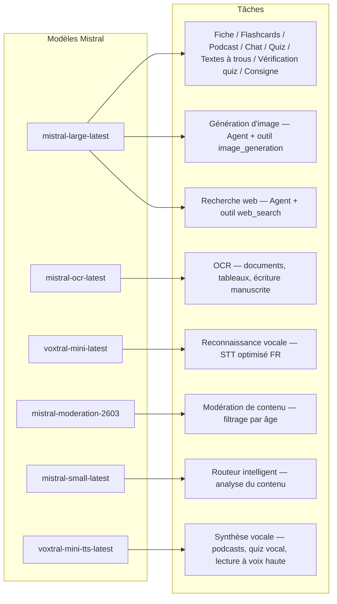
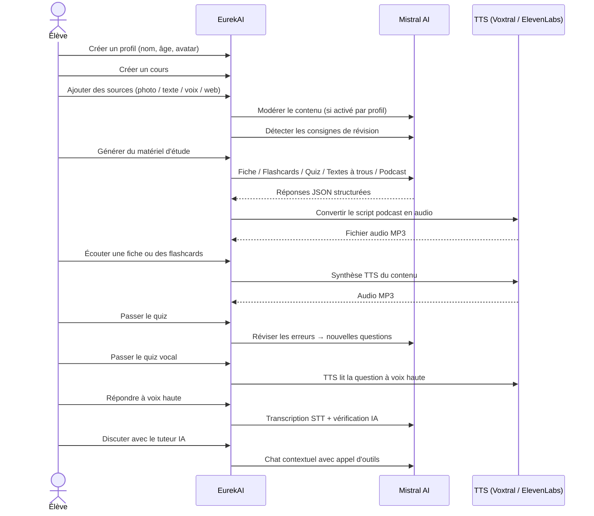

<p align="center">
  
</p>

<h1 align="center">EurekAI</h1>

<p align="center">
  <strong>Verwandle beliebige Inhalte in interaktive Lernerfahrungen — angetrieben von KI.</strong>
</p>

<p align="center">
  <a href="https://mistral.ai"></a>
  <a href="https://www.typescriptlang.org"></a>
  <a href="https://mistral.ai"></a>
  <a href="https://elevenlabs.io"></a>
</p>

<p align="center">
  <a href="https://www.youtube.com/watch?v=_b1TQz2leoI">▶️ Demo auf YouTube ansehen</a> · <a href="README-en.md">🇬🇧 Auf Englisch lesen</a>
</p>

<p align="center">
  <a href="https://sonarcloud.io/summary/new_code?id=jls42_EurekAI"></a>
  <a href="https://sonarcloud.io/summary/new_code?id=jls42_EurekAI"></a>
  <a href="https://sonarcloud.io/summary/new_code?id=jls42_EurekAI"></a>
  <a href="https://sonarcloud.io/summary/new_code?id=jls42_EurekAI"></a>
</p>
<p align="center">
  <a href="https://sonarcloud.io/summary/new_code?id=jls42_EurekAI"></a>
  <a href="https://sonarcloud.io/summary/new_code?id=jls42_EurekAI"></a>
  <a href="https://sonarcloud.io/summary/new_code?id=jls42_EurekAI"></a>
  <a href="https://sonarcloud.io/summary/new_code?id=jls42_EurekAI"></a>
</p>

---

## Die Geschichte — Warum EurekAI ?

**EurekAI** entstand während des [Mistral AI Worldwide Hackathon](https://luma.com/mistralhack-online) ([offizielle Seite](https://worldwide-hackathon.mistral.ai/)) (März 2026). Ich brauchte ein Thema — und die Idee kam von etwas ganz Konkretem: Ich bereite regelmäßig Tests mit meiner Tochter vor und dachte, es müsste möglich sein, das mit KI spielerischer und interaktiver zu gestalten.

Ziel: Beliebige Eingaben — ein Foto aus dem Lehrbuch, ein kopierter Text, eine Sprachaufnahme, eine Websuche — in **Lernzettel, Flashcards, Quiz, Podcasts, Lückentexte, Illustrationen und mehr** zu verwandeln. Angetrieben von den französischen Modellen von Mistral AI, ist die Lösung von Natur aus gut für frankophone Lernende geeignet.

Jede Codezeile wurde während des Hackathons geschrieben. Alle APIs und Open-Source-Bibliotheken werden gemäß den Regeln des Hackathons verwendet.

---

## Funktionen

| | Funktion | Beschreibung |
|---|---|---|
| 📷 | **OCR-Upload** | Fotografieren Sie Ihr Lehrbuch oder Ihre Notizen — Mistral OCR extrahiert den Inhalt |
| 📝 | **Texteingabe** | Tippen oder fügen Sie beliebigen Text direkt ein |
| 🎤 | **Sprachaufnahme** | Nehmen Sie sich auf — Voxtral STT transkribiert Ihre Stimme |
| 🌐 | **Websuche** | Stellen Sie eine Frage — ein Mistral-Agent sucht Antworten im Web |
| 📄 | **Lernzettel** | Strukturierte Notizen mit Stichpunkten, Vokabular, Zitaten, Anekdoten |
| 🃏 | **Flashcards** | 5–50 Q/A-Karten mit Quellenangaben für aktives Memorieren |
| ❓ | **Multiple-Choice-Quiz** | 5–50 Multiple-Choice-Fragen mit adaptiver Fehlerüberarbeitung |
| ✏️ | **Lückentexte** | Ausfüllübungen mit Hinweisen und toleranter Validierung |
| 🎙️ | **Podcast** | Mini-Podcast mit 2 Stimmen, in Audio über Mistral Voxtral TTS konvertiert |
| 🖼️ | **Illustrationen** | Lehrreiche Bilder generiert von einem Mistral-Agenten |
| 🗣️ | **Sprachquiz** | Fragen werden vorgelesen, mündliche Antwort, die KI überprüft die Antwort |
| 💬 | **KI-Tutor** | Kontextueller Chat mit Ihren Kursdokumenten, mit Tool-Aufrufen |
| 🧠 | **Intelligenter Router** | Die KI analysiert Ihren Inhalt und empfiehlt die passendsten Generatoren unter den 7 verfügbaren |
| 🔒 | **Kindersicherung** | Altersgerechte Moderation, Eltern-PIN, Chat-Einschränkungen |
| 🌍 | **Mehrsprachig** | Oberfläche und KI-Inhalte vollständig auf Französisch und Englisch |
| 🔊 | **Vorlesen** | Hören Sie Lernzettel und Flashcards via Mistral Voxtral TTS oder ElevenLabs |

---

## Architekturübersicht


---

## Modell-Nutzungsübersicht



---

## Benutzerablauf



---

## Detaillierte Einblicke — Funktionen

### Multimodale Eingabe

EurekAI akzeptiert 4 Quellentypen, die je nach Profil moderiert werden (standardmäßig für Kind und Jugendlicher aktiviert):

- **OCR-Upload** — JPG-, PNG- oder PDF-Dateien, verarbeitet von `mistral-ocr-latest`. Verarbeitet gedruckten Text, Tabellen und Handschrift.
- **Freier Text** — Tippen oder fügen Sie beliebigen Inhalt ein. Wird vor der Speicherung moderiert, wenn die Moderation aktiviert ist.
- **Sprachaufnahme** — Nehmen Sie Audio im Browser auf. Wird von `voxtral-mini-latest` transkribiert. Der Parameter `language="fr"` optimiert die Erkennung.
- **Websuche** — Geben Sie eine Anfrage ein. Ein temporärer Mistral-Agent mit dem Tool `web_search` ruft Ergebnisse ab und fasst sie zusammen.

### KI-Inhaltserzeugung

Sieben Typen von Lernmaterialien werden erzeugt:

| Generator | Modell | Ausgabe |
|---|---|---|
| **Lernzettel** | `mistral-large-latest` | Titel, Zusammenfassung, 10–25 Kernpunkte, Vokabular, Zitate, Anekdote |
| **Flashcards** | `mistral-large-latest` | 5–50 Q/A-Karten mit Quellenangaben für aktives Memorieren |
| **Multiple-Choice-Quiz** | `mistral-large-latest` | 5–50 Fragen, je 4 Auswahlmöglichkeiten, Erklärungen, adaptive Wiederholung |
| **Lückentexte** | `mistral-large-latest` | Sätze zum Ausfüllen mit Hinweisen, tolerante Validierung (Levenshtein) |
| **Podcast** | `mistral-large-latest` + Voxtral TTS | Skript für 2 Stimmen → MP3-Audio |
| **Illustration** | Agent `mistral-large-latest` | Lehrbild via Tool `image_generation` |
| **Sprachquiz** | `mistral-large-latest` + Voxtral TTS + STT | Fragen TTS → Antwort STT → KI-Überprüfung |

### KI-Tutor per Chat

Ein konversationeller Tutor mit vollständigem Zugriff auf Kursdokumente:

- Verwendet `mistral-large-latest`
- Tool-Aufrufe: kann während des Gesprächs Lernzettel, Flashcards, Quiz oder Lückentexte erzeugen
- Verlauf von 50 Nachrichten pro Kurs
- Inhaltsmoderation, wenn für das Profil aktiviert

### Intelligenter Router

Der Router verwendet `mistral-small-latest` zur Analyse der Inhalte der Quellen und empfiehlt die am besten geeigneten Generatoren unter den 7 verfügbaren — so müssen Lernende nicht manuell wählen. Die Oberfläche zeigt den Fortschritt in Echtzeit: zuerst eine Analysephase, dann die einzelnen Generierungen mit möglicher Abbruchoption.

### Adaptives Lernen

- **Quiz-Statistiken**: Verfolgung der Versuche und der Genauigkeit pro Frage
- **Quiz-Revision**: Generiert 5–10 neue Fragen, die gezielt auf schwache Konzepte abzielen
- **Erkennung von Anweisungen**: Erkennt Lernanweisungen ("Ich kenne meine Lektion, wenn ich...") und priorisiert sie in allen Generatoren

### Sicherheit & Kindersicherung

- **4 Altersgruppen**: Kind (≤10 Jahre), Jugendlicher (11–15), Student (16–25), Erwachsener (26+)
- **Inhaltsmoderation**: `mistral-moderation-2603` mit 5 gesperrten Kategorien für Kind/Jugendliche (sexual, hate, violence, selfharm, jailbreaking), keine Einschränkungen für Student/Erwachsener
- **Eltern-PIN**: SHA-256-Hash, erforderlich für Profile unter 15 Jahren
- **Chat-Einschränkungen**: KI-Chat standardmäßig deaktiviert für unter 16-Jährige, durch Eltern aktivierbar

### Multi-Profil-System

- Mehrere Profile mit Name, Alter, Avatar, Spracheinstellungen
- Projekte mit Profilen verknüpft via `profileId`
- Kaskadierende Löschung: Ein Profil löschen entfernt alle seine Projekte

### Mehrere TTS-Provider

- **Mistral Voxtral TTS** (Standard): `voxtral-mini-tts-latest`, kein zusätzlicher Schlüssel erforderlich
- **ElevenLabs** (alternativ): `eleven_v3`, natürliche Stimmen, erfordert `ELEVENLABS_API_KEY`
- Provider in den App-Einstellungen konfigurierbar

### Internationalisierung

- Benutzeroberfläche vollständig auf Französisch und Englisch verfügbar
- KI-Prompts unterstützen heute 2 Sprachen (FR, EN) mit Architektur, die für 15 Sprachen vorbereitet ist (es, de, it, pt, nl, ja, zh, ko, ar, hi, pl, ro, sv)
- Sprache pro Profil einstellbar

---

## Technischer Stack

| Schicht | Technologie | Rolle |
|---|---|---|
| **Runtime** | Node.js + TypeScript 5.7 | Server und Typsicherheit |
| **Backend** | Express 4.21 | REST-API |
| **Dev-Server** | Vite 7.3 + tsx | HMR, Handlebars- Partials, Proxy |
| **Frontend** | HTML + TailwindCSS 4.2 + Alpine.js 3.15 | Reaktive Oberfläche, TypeScript kompiliert von Vite |
| **Templating** | vite-plugin-handlebars | HTML-Zusammenstellung mit Partials |
| **KI** | Mistral AI SDK 2.1 | Chat, OCR, STT, TTS, Agents, Moderation |
| **TTS (Standard)** | Mistral Voxtral TTS | `voxtral-mini-tts-latest`, integrierte Sprachsynthese |
| **TTS (alternativ)** | ElevenLabs SDK 2.36 | `eleven_v3`, natürliche Stimmen |
| **Icons** | Lucide 0.575 | SVG-Icon-Bibliothek |
| **Markdown** | Marked 17 | Markdown-Rendering im Chat |
| **Datei-Upload** | Multer 1.4 | Handhabung von multipart-Formularen |
| **Audio** | ffmpeg-static | Zusammenfügung von Audio-Segmenten |
| **Tests** | Vitest 4 | Unittests — Abdeckung gemessen mit SonarCloud |
| **Persistenz** | JSON-Dateien | Speicherung ohne Abhängigkeiten |

---

## Modellreferenz

| Modell | Verwendung | Warum |
|---|---|---|
| `mistral-large-latest` | Lernzettel, Flashcards, Podcast, Quiz, Lückentexte, Chat, Überprüfung Sprachquiz-Antworten, Bild-Agent, Web-Search-Agent, Erkennung von Anweisungen | Bestes Multilingual + Befolgung von Instruktionen |
| `mistral-ocr-latest` | Dokumenten-OCR | Gedruckter Text, Tabellen, Handschrift |
| `voxtral-mini-latest` | Spracherkennung (STT) | Multilinguales STT, optimiert mit `language="fr"` |
| `voxtral-mini-tts-latest` | Sprachsynthese (TTS) | Podcasts, Sprachquiz, Vorlesen |
| `mistral-moderation-2603` | Inhaltsmoderation | 5 Kategorien für Kind/Jugendliche gesperrt (+ jailbreaking) |
| `mistral-small-latest` | Intelligenter Router | Schnelle Inhaltsanalyse zur Routing-Entscheidung |
| `eleven_v3` (ElevenLabs) | Sprachsynthese (alternativer TTS) | Natürliche Stimmen, konfigurierbare Alternative |

---

## Schnellstart

```bash
# Cloner le dépôt
git clone https://github.com/jls42/EurekAI.git
cd EurekAI

# Installer les dépendances
npm install

# Configurer les clés API
cp .env.example .env
# Éditez .env avec vos clés :
#   MISTRAL_API_KEY=votre_clé_ici           (requis)
#   ELEVENLABS_API_KEY=votre_clé_ici        (optionnel, TTS alternatif)

# Lancer le développement
npm run dev
# → Backend :  http://localhost:3000 (API)
# → Frontend : http://localhost:5173 (serveur Vite avec HMR)
```

> **Hinweis** : Mistral Voxtral TTS ist der Standard-Provider — kein zusätzlicher Schlüssel erforderlich über `MISTRAL_API_KEY` hinaus. ElevenLabs ist ein alternativer TTS-Provider, der in den Einstellungen konfiguriert werden kann.

---

## Projektstruktur

```
server.ts                 — Point d'entrée Express, monte les routes + config
config.ts                 — Config runtime (modèles, voix, TTS provider), persistée dans output/config.json
store.ts                  — ProjectStore : CRUD projets/sources/générations, persistance JSON
profiles.ts               — ProfileStore : gestion des profils, hachage PIN
types.ts                  — Types TypeScript : Source, Generation (7 types), QuizStats, Profile
prompts.ts                — Tous les prompts IA centralisés (system + user templates, FR/EN)

generators/
  ocr.ts                  — Upload + OCR via Mistral (JPG, PNG, PDF)
  summary.ts              — Génération de fiche de révision (JSON structuré)
  flashcards.ts           — Flashcards Q/R (5-50, configurable)
  quiz.ts                 — Quiz QCM (5-50 questions, configurable) + révision adaptative
  fill-blank.ts           — Exercices à trous avec validation tolérante
  podcast.ts              — Script podcast 2 voix
  quiz-vocal.ts           — Quiz vocal : questions TTS + réponses STT + vérification IA
  image.ts                — Génération d'image via Agent Mistral (outil image_generation)
  chat.ts                 — Tuteur IA par chat avec appel d'outils
  router.ts               — Routeur automatique intelligent (contenu → générateurs recommandés)
  consigne.ts             — Détection de consignes de révision
  tts-provider.ts         — Dispatch TTS multi-provider (Mistral Voxtral / ElevenLabs)
  tts.ts                  — Génération audio podcast (concaténation de segments)
  stt.ts                  — Voxtral STT (audio → texte)
  websearch.ts            — Agent Mistral avec outil web_search
  moderation.ts           — Modération de contenu (filtrage par âge)

routes/
  projects.ts             — CRUD projets
  profiles.ts             — CRUD profils avec gestion du PIN
  sources.ts              — Upload OCR, texte libre, voix STT, recherche web, modération
  generate.ts             — Endpoints de génération (7 types + auto + route)
  generations.ts          — Tentatives de quiz/fill-blank, réponses vocales, lecture à voix haute
  chat.ts                 — Chat IA avec appel d'outils

helpers/
  index.ts                — safeParseJson, unwrapJsonArray, extractAllText, timer
  audio.ts                — collectStream (ReadableStream → Buffer)
  fill-blank-validate.ts  — Validation tolérante des réponses (normalisation, Levenshtein)

src/                      — Frontend (Vite + Handlebars)
  index.html              — Point d'entrée HTML principal
  main.ts                 — Entrée frontend (init Alpine.js + icônes Lucide)
  app/                    — Modules applicatifs Alpine.js
    state.ts              — Gestion d'état réactif
    navigation.ts         — Routage des vues + gardes par âge
    profiles.ts           — Logique du sélecteur de profils
    projects.ts           — CRUD des cours
    sources.ts            — Gestionnaires d'upload de sources
    generate.ts           — Déclencheurs de génération (individuel, tout, auto 2 phases)
    generations.ts        — Affichage + actions sur les générations
    chat.ts               — Interface de chat
    config.ts             — Interface de configuration (modèles, voix, TTS provider)
    render.ts             — Helpers de rendu HTML
    i18n.ts               — Changement de langue
    ...
  components/
    quiz.ts               — Composant quiz interactif
    quiz-vocal.ts         — Composant quiz vocal
    fill-blank.ts         — Composant textes à trous
    flashcards.ts         — Composant flashcards avec retournement
    step-by-step.ts       — Mixin navigation pas-à-pas (quiz, fill-blank, flashcards)
  i18n/
    fr.ts                 — Traductions françaises
    en.ts                 — Traductions anglaises
    index.ts              — Chargeur i18n
  partials/               — Partials HTML Handlebars (header, sidebar, dialogues, vues)
  styles/
    main.css              — Entrée TailwindCSS
    theme.css             — Variables de thème personnalisées

public/assets/            — Ressources statiques (logo, avatars)
output/                   — Données d'exécution (projets, config, fichiers audio)
```

---

## API-Referenz

### Konfiguration
| Methode | Endpoint | Beschreibung |
|---|---|---|
| `GET` | `/api/config` | Aktuelle Konfiguration |
| `PUT` | `/api/config` | Konfiguration ändern (Modelle, Stimmen, TTS-Provider) |
| `GET` | `/api/config/status` | API-Status (Mistral, ElevenLabs, TTS) |
| `POST` | `/api/config/reset` | Standardkonfiguration zurücksetzen |
| `GET` | `/api/config/voices` | Auflisten der Mistral TTS-Stimmen (optional `?lang=fr`) |

### Profile
| Methode | Endpoint | Beschreibung |
|---|---|---|
| `GET` | `/api/profiles` | Alle Profile auflisten |
| `POST` | `/api/profiles` | Profil erstellen |
| `PUT` | `/api/profiles/:id` | Profil bearbeiten (PIN erforderlich für < 15 Jahre) |
| `DELETE` | `/api/profiles/:id` | Profil löschen + kaskadierende Projektlöschung |

### Projekte
| Méthode | Endpoint | Beschreibung |
|---|---|---|
| `GET` | `/api/projects` | Projekte auflisten |
| `POST` | `/api/projects` | Projekt erstellen `{name, profileId}` |
| `GET` | `/api/projects/:pid` | Projektdetails |
| `PUT` | `/api/projects/:pid` | Umbenennen `{name}` |
| `DELETE` | `/api/projects/:pid` | Projekt löschen |

### Quellen
| Méthode | Endpoint | Beschreibung |
|---|---|---|
| `POST` | `/api/projects/:pid/sources/upload` | OCR-Upload (multipart-Dateien) |
| `POST` | `/api/projects/:pid/sources/text` | Freier Text `{text}` |
| `POST` | `/api/projects/:pid/sources/voice` | Stimme STT (Audio multipart) |
| `POST` | `/api/projects/:pid/sources/websearch` | Websuche `{query}` |
| `DELETE` | `/api/projects/:pid/sources/:sid` | Quelle löschen |
| `POST` | `/api/projects/:pid/moderate` | Moderieren `{text}` |
| `POST` | `/api/projects/:pid/detect-consigne` | Erkennen von Lernanweisungen |

### Generierung
| Méthode | Endpoint | Beschreibung |
|---|---|---|
| `POST` | `/api/projects/:pid/generate/summary` | Lernzettel |
| `POST` | `/api/projects/:pid/generate/flashcards` | Flashcards |
| `POST` | `/api/projects/:pid/generate/quiz` | Multiple-Choice-Quiz |
| `POST` | `/api/projects/:pid/generate/fill-blank` | Lückentexte |
| `POST` | `/api/projects/:pid/generate/podcast` | Podcast |
| `POST` | `/api/projects/:pid/generate/image` | Illustration |
| `POST` | `/api/projects/:pid/generate/quiz-vocal` | Sprachquiz |
| `POST` | `/api/projects/:pid/generate/quiz-review` | Adaptive Revision `{generationId, weakQuestions}` |
| `POST` | `/api/projects/:pid/generate/route` | Routing-Analyse (Plan der zu startenden Generatoren) |
| `POST` | `/api/projects/:pid/generate/auto` | Automatische Backend-Generierung (Routing + 5 Typen: summary, flashcards, quiz, fill-blank, podcast) |

Alle Generierungsrouten akzeptieren `{sourceIds?, lang?, ageGroup?, count?, useConsigne?}`.

### CRUD für Generierungen
| Méthode | Endpoint | Beschreibung |
|---|---|---|
| `POST` | `/api/projects/:pid/generations/:gid/quiz-attempt` | Quiz-Antworten einreichen `{answers}` |
| `POST` | `/api/projects/:pid/generations/:gid/fill-blank-attempt` | Lückentext-Antworten einreichen `{answers}` |
| `POST` | `/api/projects/:pid/generations/:gid/vocal-answer` | Mündliche Antwort prüfen (Audio + questionIndex) |
| `POST` | `/api/projects/:pid/generations/:gid/read-aloud` | TTS-Vorlesen (Lernzettel/Flashcards) |
| `PUT` | `/api/projects/:pid/generations/:gid` | Umbenennen `{title}` |
| `DELETE` | `/api/projects/:pid/generations/:gid` | Generierung löschen |

### Chat
| Méthode | Endpoint | Beschreibung |
|---|---|---|
| `GET` | `/api/projects/:pid/chat` | Chatverlauf abrufen |
| `POST` | `/api/projects/:pid/chat` | Nachricht senden `{message, lang, ageGroup}` |
| `DELETE` | `/api/projects/:pid/chat` | Chatverlauf löschen |

---

## Architekturentscheidungen

| Entscheidung | Begründung |
|---|---|
| **Alpine.js statt React/Vue** | Minimale Größe, leichte Reaktivität mit TypeScript, kompiliert von Vite. Perfekt für einen Hackathon, bei dem Geschwindigkeit zählt. |
| **Persistenz in JSON-Dateien** | Keine Abhängigkeiten, sofortiger Start. Keine Datenbankkonfiguration erforderlich — man kann sofort loslegen. |
| **Vite + Handlebars** | Das Beste aus beiden Welten: schnelles HMR für die Entwicklung, HTML-Partials zur Strukturierung des Codes, Tailwind JIT. |
| **Zentralisierte Prompts** | Alle KI-Prompts in `prompts.ts` — einfach zu iterieren, zu testen und nach Sprache/Altersgruppe anzupassen. |
| **Mehrgenerationen-System** | Jede Generation ist ein eigenständiges Objekt mit einer eigenen ID — ermöglicht mehrere Arbeitsblätter, Quiz usw. pro Kurs. |
| **Altersgerechte Prompts** | 4 Altersgruppen mit unterschiedlichem Wortschatz, verschiedener Komplexität und Tonalität — derselbe Inhalt wird je nach Lernendem unterschiedlich vermittelt. |
| **Agentenbasierte Funktionen** | Bildgenerierung und Webrecherche verwenden temporäre Mistral-Agenten — eigener Lebenszyklus mit automatischer Bereinigung. |
| **Mehrere TTS-Anbieter** | Mistral Voxtral TTS standardmäßig (kein zusätzlicher Schlüssel), ElevenLabs als Alternative — konfigurierbar ohne Neustart. |

---

## Credits & Danksagungen

- **[Mistral AI](https://mistral.ai)** — KI-Modelle (Large, OCR, Voxtral STT, Voxtral TTS, Moderation, Small) + Worldwide Hackathon
- **[ElevenLabs](https://elevenlabs.io)** — Alternative Sprachsynthese-Engine (`eleven_v3`)
- **[Alpine.js](https://alpinejs.dev)** — leichtgewichtiges reaktives Framework
- **[TailwindCSS](https://tailwindcss.com)** — Utility-orientiertes CSS-Framework
- **[Vite](https://vitejs.dev)** — Frontend-Build-Tool
- **[Lucide](https://lucide.dev)** — Icon-Bibliothek
- **[Marked](https://marked.js.org)** — Markdown-Parser

Sorgfältig während des Mistral AI Worldwide Hackathon im März 2026 erstellt.

---

## Autor

**Julien LS** — [contact@jls42.org](mailto:contact@jls42.org)

## Lizenz

[AGPL-3.0](LICENSE) — Copyright (C) 2026 Julien LS

**Dieses Dokument wurde von der fr-Version in die Sprache de unter Verwendung des Modells gpt-5-mini übersetzt. Für weitere Informationen zum Übersetzungsprozess konsultieren Sie https://gitlab.com/jls42/ai-powered-markdown-translator**

