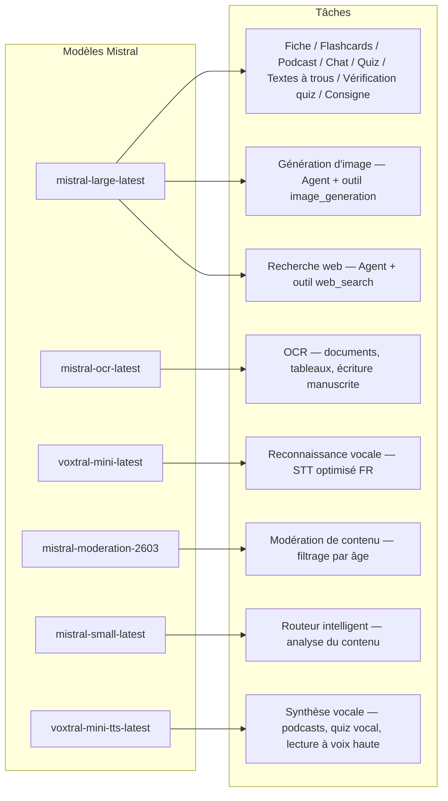
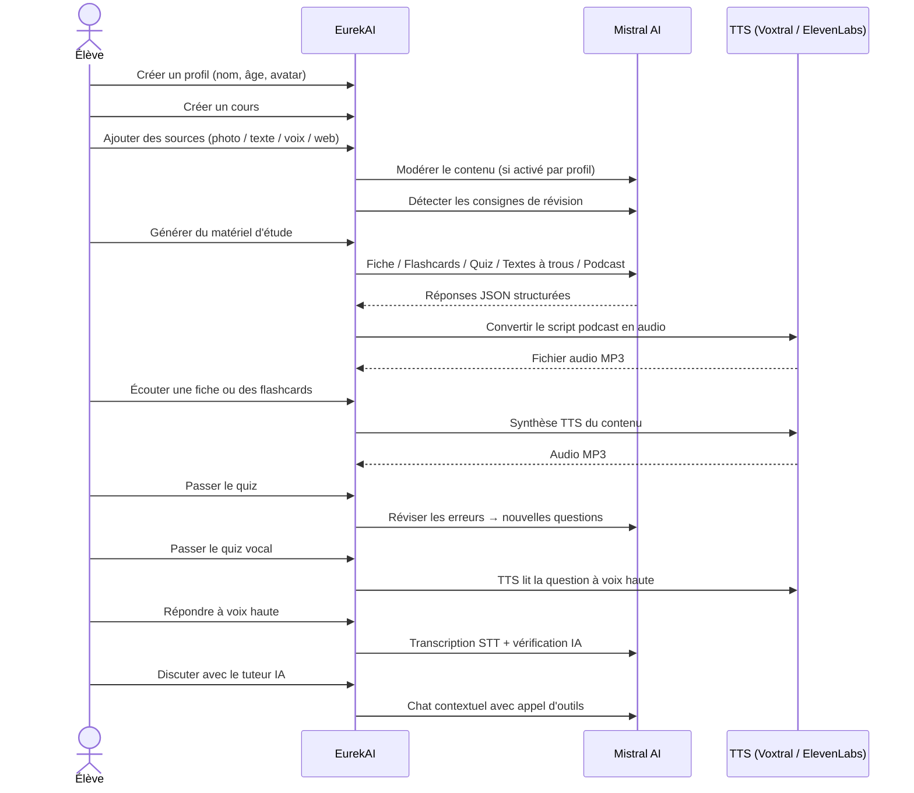

<p align="center">
  
</p>

<h1 align="center">EurekAI</h1>

<p align="center">
  <strong>Verwandle beliebige Inhalte in interaktive Lernerlebnisse — angetrieben von <a href="https://mistral.ai">Mistral AI</a>.</strong>
</p>

<p align="center">
  <a href="README-en.md">🇬🇧 Englisch</a> · <a href="README-es.md">🇪🇸 Spanisch</a> · <a href="README-pt.md">🇧🇷 Portugiesisch</a> · <a href="README-de.md">🇩🇪 Deutsch</a> · <a href="README-it.md">🇮🇹 Italienisch</a> · <a href="README-nl.md">🇳🇱 Niederländisch</a> · <a href="README-ar.md">🇸🇦 Arabisch</a><br>
  <a href="README-hi.md">🇮🇳 Hindi</a> · <a href="README-zh.md">🇨🇳 Chinesisch</a> · <a href="README-ja.md">🇯🇵 Japanisch</a> · <a href="README-ko.md">🇰🇷 Koreanisch</a> · <a href="README-pl.md">🇵🇱 Polnisch</a> · <a href="README-ro.md">🇷🇴 Rumänisch</a> · <a href="README-sv.md">🇸🇪 Schwedisch</a>
</p>

<p align="center">
  <a href="https://www.youtube.com/watch?v=_b1TQz2leoI"></a>
</p>

<h4 align="center">📊 Codequalität</h4>

<p align="center">
  <a href="https://sonarcloud.io/summary/new_code?id=jls42_EurekAI"></a>
  <a href="https://sonarcloud.io/summary/new_code?id=jls42_EurekAI"></a>
  <a href="https://sonarcloud.io/summary/new_code?id=jls42_EurekAI"></a>
  <a href="https://sonarcloud.io/summary/new_code?id=jls42_EurekAI"></a>
</p>
<p align="center">
  <a href="https://sonarcloud.io/summary/new_code?id=jls42_EurekAI"></a>
  <a href="https://sonarcloud.io/summary/new_code?id=jls42_EurekAI"></a>
  <a href="https://sonarcloud.io/summary/new_code?id=jls42_EurekAI"></a>
  <a href="https://sonarcloud.io/summary/new_code?id=jls42_EurekAI"></a>
</p>

---

## Die Geschichte — Warum EurekAI?

**EurekAI** entstand während des [Mistral AI Worldwide Hackathon](https://luma.com/mistralhack-online) ([offizielle Website](https://worldwide-hackathon.mistral.ai/)) (März 2026). Ich brauchte ein Thema — und die Idee kam aus etwas sehr Konkretem: Ich bereite regelmäßig mit meiner Tochter Übungsklausuren vor und dachte, man könnte das mit Hilfe von KI spielerischer und interaktiver gestalten.

Ziel: Beliebige Eingaben — ein Foto des Lehrbuchs, ein kopierter Text, eine Sprachaufnahme, eine Websuche — in **Lernzusammenfassungen, Karteikarten, Quizze, Podcasts, Lückentexte, Illustrationen und mehr** zu verwandeln. Alles angetrieben von den französischen Modellen von Mistral AI, wodurch die Lösung von Natur aus gut für frankophone Lernende geeignet ist.

Jede Codezeile wurde während des Hackathons geschrieben. Alle verwendeten APIs und Open-Source-Bibliotheken entsprechen den Regeln des Hackathons.

---

## Funktionen

| | Funktion | Beschreibung |
|---|---|---|
| 📷 | **OCR-Upload** | Fotografieren Sie Ihr Lehrbuch oder Ihre Notizen — Mistral OCR extrahiert den Inhalt |
| 📝 | **Texteingabe** | Tippen oder fügen Sie beliebigen Text direkt ein |
| 🎤 | **Sprachaufnahme** | Nehmen Sie sich auf — Voxtral STT transkribiert Ihre Stimme |
| 🌐 | **Websuche** | Stellen Sie eine Frage — ein Mistral-Agent sucht die Antworten im Web |
| 📄 | **Lernzusammenfassungen** | Strukturierte Notizen mit Kernpunkten, Vokabular, Zitaten, Anekdoten |
| 🃏 | **Karteikarten** | 5–50 Q/A-Karten mit Quellenangaben zur aktiven Wiederholung |
| ❓ | **Multiple-Choice-Quiz** | 5–50 Multiple-Choice-Fragen mit adaptiver Fehlerüberarbeitung |
| ✏️ | **Lückentexte** | Ausfüllübungen mit Hinweisen und tolerantem Matching |
| 🎙️ | **Podcast** | Mini-Podcast mit 2 Stimmen, erzeugt als Audio via Mistral Voxtral TTS |
| 🖼️ | **Illustrationen** | Pädagogische Bilder, generiert durch einen Mistral-Agent |
| 🗣️ | **Sprach-Quiz** | Fragen werden laut vorgelesen, Antwort mündlich, die KI überprüft die Antwort |
| 💬 | **KI-Tutor** | Kontexthafter Chat mit Ihren Kursdokumenten, mit Werkzeugaufrufen |
| 🧠 | **Intelligenter Router** | Die KI analysiert Ihre Inhalte und empfiehlt die relevantesten Generatoren unter den 7 verfügbaren |
| 🔒 | **Elternkontrolle** | Altersgerechte Moderation, Eltern-PIN, Chat-Einschränkungen |
| 🌍 | **Mehrsprachig** | Oberfläche und KI-Inhalte vollständig auf Französisch und Englisch |
| 🔊 | **Vorlesefunktion** | Hören Sie Zusammenfassungen und Karteikarten via Mistral Voxtral TTS oder ElevenLabs |

---

## Architekturüberblick


---

## Übersicht der Modellverwendung



---

## Benutzerablauf



---

## Tieferer Einblick — Funktionen

### Multimodale Eingabe

EurekAI akzeptiert 4 Quelltypen, moderiert je nach Profil (standardmäßig für Kinder und Jugendliche aktiviert):

- **OCR-Upload** — JPG-, PNG- oder PDF-Dateien, verarbeitet von `mistral-ocr-latest`. Verarbeitet gedruckten Text, Tabellen und Handschrift.
- **Freitext** — Tippen oder Einfügen beliebiger Inhalte. Wird vor dem Speichern moderiert, falls Moderation aktiviert ist.
- **Sprachaufnahme** — Nehmen Sie Audio im Browser auf. Transkribiert von `voxtral-mini-latest`. Der Parameter `language="fr"` optimiert die Erkennung.
- **Websuche** — Geben Sie eine Anfrage ein. Ein temporärer Mistral-Agent mit dem Tool `web_search` holt und fasst die Ergebnisse zusammen.

### KI-Inhaltserzeugung

Sieben Typen von Lernmaterialien werden generiert:

| Generator | Modell | Ausgabe |
|---|---|---|
| **Lernzusammenfassung** | `mistral-large-latest` | Titel, Zusammenfassung, 10–25 Kernpunkte, Vokabular, Zitate, Anekdote |
| **Karteikarten** | `mistral-large-latest` | 5–50 Q/A-Karten mit Quellenangaben zur aktiven Wiederholung |
| **Multiple-Choice-Quiz** | `mistral-large-latest` | 5–50 Fragen, je 4 Antwortmöglichkeiten, Erklärungen, adaptive Fehlerüberarbeitung |
| **Lückentexte** | `mistral-large-latest` | Auszufüllende Sätze mit Hinweisen, tolerant bei der Validierung (Levenshtein) |
| **Podcast** | `mistral-large-latest` + Voxtral TTS | Script für 2 Stimmen → MP3-Audio |
| **Illustration** | Agent `mistral-large-latest` | Pädagogisches Bild via Tool `image_generation` |
| **Sprach-Quiz** | `mistral-large-latest` + Voxtral TTS + STT | Fragen per TTS → Antwort per STT → KI-Überprüfung |

### KI-Tutor per Chat

Ein konversationeller Tutor mit vollem Zugriff auf Kursdokumente:

- Nutzt `mistral-large-latest`
- **Werkzeugaufrufe**: kann während des Gesprächs Zusammenfassungen, Karteikarten, Quiz oder Lückentexte generieren
- Verlauf von 50 Nachrichten pro Kurs
- Inhaltsmoderation, falls für das Profil aktiviert

### Intelligenter automatischer Router

Der Router verwendet `mistral-small-latest` zur Analyse des Inhalts und empfiehlt, welche Generatoren unter den 7 verfügbaren am relevantesten sind — so müssen die Lernenden nicht manuell auswählen. Die Oberfläche zeigt den Fortschritt in Echtzeit: zuerst eine Analysephase, dann individuelle Generierungen mit möglicher Abbruchfunktion.

### Adaptives Lernen

- **Quiz-Statistiken**: Verfolgung von Versuchen und Genauigkeit pro Frage
- **Quiz-Revision**: Generiert 5–10 neue Fragen, die auf schwache Konzepte abzielen
- **Erkennung von Anweisungen**: Erkennt Lernanweisungen ("Ich weiß meine Lektion, wenn ich...") und priorisiert diese in allen Generatoren

### Sicherheit & Elternkontrolle

- **4 Altersgruppen**: Kind (≤10), Jugendlicher (11–15), Student (16–25), Erwachsener (26+)
- **Inhaltsmoderation**: `mistral-moderation-2603` mit 5 für Kind/Jugend blockierten Kategorien (sexual, hate, violence, selfharm, jailbreaking), keine Einschränkungen für Student/Erwachsener
- **Eltern-PIN**: SHA-256-Hash, erforderlich für Profile unter 15 Jahren
- **Chat-Einschränkungen**: KI-Chat standardmäßig für unter 16-Jährige deaktiviert, durch Eltern aktivierbar

### Multi-Profil-System

- Mehrere Profile mit Name, Alter, Avatar, Spracheinstellungen
- Projekte sind Profilen zugeordnet via `profileId`
- Kaskadierende Löschung: Löschen eines Profils entfernt alle zugehörigen Projekte

### TTS Multi-Provider

- **Mistral Voxtral TTS** (Standard): `voxtral-mini-tts-latest`, kein zusätzlicher Schlüssel erforderlich
- **ElevenLabs** (Alternativ): `eleven_v3`, natürliche Stimmen, benötigt `ELEVENLABS_API_KEY`
- Provider in den App-Einstellungen konfigurierbar

### Internationalisierung

- Benutzeroberfläche vollständig auf Französisch und Englisch verfügbar
- KI-Prompts unterstützen heute 2 Sprachen (FR, EN) mit einer Architektur, die für 15 Sprachen vorbereitet ist (es, de, it, pt, nl, ja, zh, ko, ar, hi, pl, ro, sv)
- Sprache pro Profil einstellbar

---

## Technologie-Stack

| Ebene | Technologie | Rolle |
|---|---|---|
| **Runtime** | Node.js + TypeScript 5.7 | Server und Typensicherheit |
| **Backend** | Express 4.21 | REST-API |
| **Dev-Server** | Vite 7.3 + tsx | HMR, Handlebars-Partials, Proxy |
| **Frontend** | HTML + TailwindCSS 4.2 + Alpine.js 3.15 | Reaktive Oberfläche, TypeScript kompiliert durch Vite |
| **Templating** | vite-plugin-handlebars | HTML-Komposition via Partials |
| **KI** | Mistral AI SDK 2.1 | Chat, OCR, STT, TTS, Agents, Moderation |
| **TTS (Standard)** | Mistral Voxtral TTS | `voxtral-mini-tts-latest`, integrierte Sprachsynthese |
| **TTS (Alternativ)** | ElevenLabs SDK 2.36 | `eleven_v3`, natürliche Stimmen |
| **Icons** | Lucide 0.575 | SVG-Icon-Bibliothek |
| **Markdown** | Marked 17 | Markdown-Rendering im Chat |
| **File Upload** | Multer 1.4 | Multipart-Formularverarbeitung |
| **Audio** | ffmpeg-static | Zusammenfügen von Audiosegmenten |
| **Tests** | Vitest 4 | Unit-Tests — Abdeckung gemessen via SonarCloud |
| **Persistenz** | JSON-Dateien | Speichern ohne Abhängigkeiten |

---

## Modellreferenz

| Modell | Verwendung | Warum |
|---|---|---|
| `mistral-large-latest` | Zusammenfassung, Karteikarten, Podcast, Quiz, Lückentexte, Chat, Überprüfung Sprach-Quiz, Image-Agent, Web-Search-Agent, Erkennung von Anweisungen | Bestes Multilingual-Handling + Befehlsfolgen |
| `mistral-ocr-latest` | Dokumenten-OCR | Gedruckter Text, Tabellen, Handschrift |
| `voxtral-mini-latest` | Spracherkennung (STT) | Multilinguales STT, optimiert mit `language="fr"` |
| `voxtral-mini-tts-latest` | Sprachsynthese (TTS) | Podcasts, Sprach-Quiz, Vorlesefunktion |
| `mistral-moderation-2603` | Inhaltsmoderation | 5 für Kind/Jugend blockierte Kategorien (+ jailbreaking) |
| `mistral-small-latest` | Intelligenter Router | Schnelle Inhaltsanalyse zur Routing-Entscheidung |
| `eleven_v3` (ElevenLabs) | Sprachsynthese (alternativ) | Natürliche Stimmen, konfigurierbare Alternative |

---

## Schnellstart

```bash
# Cloner le dépôt
git clone https://github.com/jls42/EurekAI.git
cd EurekAI

# Installer les dépendances
npm install

# Configurer les clés API
cp .env.example .env
# Éditez .env avec vos clés :
#   MISTRAL_API_KEY=votre_clé_ici           (requis)
#   ELEVENLABS_API_KEY=votre_clé_ici        (optionnel, TTS alternatif)

# Lancer le développement
npm run dev
# → Backend :  http://localhost:3000 (API)
# → Frontend : http://localhost:5173 (serveur Vite avec HMR)
```

> **Hinweis** : Mistral Voxtral TTS ist der Standard-Provider — kein zusätzlicher Schlüssel erforderlich über `MISTRAL_API_KEY` hinaus. ElevenLabs ist ein alternativer TTS-Provider, konfigurierbar in den Einstellungen.

---

## Projektstruktur

```
server.ts                 — Point d'entrée Express, monte les routes + config
config.ts                 — Config runtime (modèles, voix, TTS provider), persistée dans output/config.json
store.ts                  — ProjectStore : CRUD projets/sources/générations, persistance JSON
profiles.ts               — ProfileStore : gestion des profils, hachage PIN
types.ts                  — Types TypeScript : Source, Generation (7 types), QuizStats, Profile
prompts.ts                — Tous les prompts IA centralisés (system + user templates, FR/EN)

generators/
  ocr.ts                  — Upload + OCR via Mistral (JPG, PNG, PDF)
  summary.ts              — Génération de fiche de révision (JSON structuré)
  flashcards.ts           — Flashcards Q/R (5-50, configurable)
  quiz.ts                 — Quiz QCM (5-50 questions, configurable) + révision adaptative
  fill-blank.ts           — Exercices à trous avec validation tolérante
  podcast.ts              — Script podcast 2 voix
  quiz-vocal.ts           — Quiz vocal : questions TTS + réponses STT + vérification IA
  image.ts                — Génération d'image via Agent Mistral (outil image_generation)
  chat.ts                 — Tuteur IA par chat avec appel d'outils
  router.ts               — Routeur automatique intelligent (contenu → générateurs recommandés)
  consigne.ts             — Détection de consignes de révision
  tts-provider.ts         — Dispatch TTS multi-provider (Mistral Voxtral / ElevenLabs)
  tts.ts                  — Génération audio podcast (concaténation de segments)
  stt.ts                  — Voxtral STT (audio → texte)
  websearch.ts            — Agent Mistral avec outil web_search
  moderation.ts           — Modération de contenu (filtrage par âge)

routes/
  projects.ts             — CRUD projets
  profiles.ts             — CRUD profils avec gestion du PIN
  sources.ts              — Upload OCR, texte libre, voix STT, recherche web, modération
  generate.ts             — Endpoints de génération (7 types + auto + route)
  generations.ts          — Tentatives de quiz/fill-blank, réponses vocales, lecture à voix haute
  chat.ts                 — Chat IA avec appel d'outils

helpers/
  index.ts                — safeParseJson, unwrapJsonArray, extractAllText, timer
  audio.ts                — collectStream (ReadableStream → Buffer)
  fill-blank-validate.ts  — Validation tolérante des réponses (normalisation, Levenshtein)

src/                      — Frontend (Vite + Handlebars)
  index.html              — Point d'entrée HTML principal
  main.ts                 — Entrée frontend (init Alpine.js + icônes Lucide)
  app/                    — Modules applicatifs Alpine.js
    state.ts              — Gestion d'état réactif
    navigation.ts         — Routage des vues + gardes par âge
    profiles.ts           — Logique du sélecteur de profils
    projects.ts           — CRUD des cours
    sources.ts            — Gestionnaires d'upload de sources
    generate.ts           — Déclencheurs de génération (individuel, tout, auto 2 phases)
    generations.ts        — Affichage + actions sur les générations
    chat.ts               — Interface de chat
    config.ts             — Interface de configuration (modèles, voix, TTS provider)
    render.ts             — Helpers de rendu HTML
    i18n.ts               — Changement de langue
    ...
  components/
    quiz.ts               — Composant quiz interactif
    quiz-vocal.ts         — Composant quiz vocal
    fill-blank.ts         — Composant textes à trous
    flashcards.ts         — Composant flashcards avec retournement
    step-by-step.ts       — Mixin navigation pas-à-pas (quiz, fill-blank, flashcards)
  i18n/
    fr.ts                 — Traductions françaises
    en.ts                 — Traductions anglaises
    index.ts              — Chargeur i18n
  partials/               — Partials HTML Handlebars (header, sidebar, dialogues, vues)
  styles/
    main.css              — Entrée TailwindCSS
    theme.css             — Variables de thème personnalisées

public/assets/            — Ressources statiques (logo, avatars)
output/                   — Données d'exécution (projets, config, fichiers audio)
```

---

## API-Referenz

### Konfiguration
| Methode | Endpoint | Beschreibung |
|---|---|---|
| `GET` | `/api/config` | Aktuelle Konfiguration |
| `PUT` | `/api/config` | Konfiguration ändern (Modelle, Stimmen, TTS-Provider) |
| `GET` | `/api/config/status` | API-Status (Mistral, ElevenLabs, TTS) |
| `POST` | `/api/config/reset` | Konfiguration auf Standard zurücksetzen |
| `GET` | `/api/config/voices` | Mistral-TTS-Stimmen auflisten (optional `?lang=fr`) |

### Profile
| Methode | Endpoint | Beschreibung |
|---|---|---|
| `GET` | `/api/profiles` | Alle Profile auflisten |
| `POST` | `/api/profiles` | Profil erstellen |
| `PUT` | `/api/profiles/:id` | Profil bearbeiten (PIN erforderlich bei < 15 Jahren) |
| `DELETE` | `/api/profiles/:id` | Profil löschen + Projekte kaskadieren |

### Projekte
| Méthode | Endpoint | Description |
|---|---|---|
| `GET` | `/api/projects` | Projekte auflisten |
| `POST` | `/api/projects` | Projekt erstellen `{name, profileId}` |
| `GET` | `/api/projects/:pid` | Projektdetails |
| `PUT` | `/api/projects/:pid` | Umbenennen `{name}` |
| `DELETE` | `/api/projects/:pid` | Projekt löschen |

### Quellen
| Méthode | Endpoint | Beschreibung |
|---|---|---|
| `POST` | `/api/projects/:pid/sources/upload` | OCR-Upload (multipart-Dateien) |
| `POST` | `/api/projects/:pid/sources/text` | Freitext `{text}` |
| `POST` | `/api/projects/:pid/sources/voice` | Sprach-STT (Audio multipart) |
| `POST` | `/api/projects/:pid/sources/websearch` | Websuche `{query}` |
| `DELETE` | `/api/projects/:pid/sources/:sid` | Quelle löschen |
| `POST` | `/api/projects/:pid/moderate` | Moderieren `{text}` |
| `POST` | `/api/projects/:pid/detect-consigne` | Anweisungen zur Wiederholung erkennen |

### Generierung
| Méthode | Endpoint | Beschreibung |
|---|---|---|
| `POST` | `/api/projects/:pid/generate/summary` | Lernzusammenfassung |
| `POST` | `/api/projects/:pid/generate/flashcards` | Karteikarten |
| `POST` | `/api/projects/:pid/generate/quiz` | Multiple-Choice-Quiz |
| `POST` | `/api/projects/:pid/generate/fill-blank` | Lückentexte |
| `POST` | `/api/projects/:pid/generate/podcast` | Podcast |
| `POST` | `/api/projects/:pid/generate/image` | Illustration |
| `POST` | `/api/projects/:pid/generate/quiz-vocal` | Sprach-Quiz |
| `POST` | `/api/projects/:pid/generate/quiz-review` | Adaptive Revision `{generationId, weakQuestions}` |
| `POST` | `/api/projects/:pid/generate/route` | Routing-Analyse (Plan der zu startenden Generatoren) |
| `POST` | `/api/projects/:pid/generate/auto` | Automatische Backend-Generierung (Routing + 5 Typen: summary, flashcards, quiz, fill-blank, podcast) |

Alle Generierungsrouten akzeptieren `{sourceIds?, lang?, ageGroup?, count?, useConsigne?}`.

### CRUD Generierungen
| Méthode | Endpoint | Beschreibung |
|---|---|---|
| `POST` | `/api/projects/:pid/generations/:gid/quiz-attempt` | Quiz-Antworten einreichen `{answers}` |
| `POST` | `/api/projects/:pid/generations/:gid/fill-blank-attempt` | Lückentext-Antworten einreichen `{answers}` |
| `POST` | `/api/projects/:pid/generations/:gid/vocal-answer` | Mündliche Antwort prüfen (Audio + questionIndex) |
| `POST` | `/api/projects/:pid/generations/:gid/read-aloud` | TTS-Vorlesen (Zusammenfassungen/Karteikarten) |
| `PUT` | `/api/projects/:pid/generations/:gid` | Umbenennen `{title}` |
| `DELETE` | `/api/projects/:pid/generations/:gid` | Generierung löschen |

### Chat
| Méthode | Endpoint | Beschreibung |
|---|---|---|
| `GET` | `/api/projects/:pid/chat` | Chat-Verlauf abrufen |
| `POST` | `/api/projects/:pid/chat` | Nachricht senden `{message, lang, ageGroup}` |
| `DELETE` | `/api/projects/:pid/chat` | Chat-Verlauf löschen |

---

## Architekturentscheidungen

| Entscheidung | Begründung |
|---|---|
| **Alpine.js statt React/Vue** | Minimale Größe, leichte Reaktivität mit TypeScript, kompiliert durch Vite. Ideal für einen Hackathon, bei dem Geschwindigkeit zählt. |
| **Persistenz in JSON-Dateien** | Keine Abhängigkeiten, sofortiger Start. Keine Datenbank-Konfiguration nötig — einfach starten und loslegen. |
| **Vite + Handlebars** | Das Beste aus beiden Welten: schnelles HMR für die Entwicklung, HTML-Partials für saubere Code-Organisation, Tailwind JIT. |
| **Zentralisierte Prompts** | Alle KI-Prompts in `prompts.ts` — einfach iterierbar, testbar und anpassbar nach Sprache/Altersgruppe. |
| **Multi-Generations-System** | Jede Generierung ist ein eigenständiges Objekt mit eigener ID — erlaubt mehrere Zusammenfassungen, Quiz etc. pro Kurs. |
| **Altersgerechte Prompts** | 4 Altersgruppen mit unterschiedlichem Vokabular, Komplexität und Ton — derselbe Inhalt wird je nach Lernendem unterschiedlich vermittelt. |
| **Agentenbasierte Funktionen** | Die Bilderzeugung und Websuche verwenden temporäre Mistral-Agenten — eigener Lebenszyklus mit automatischer Bereinigung. |
| **TTS mit mehreren Anbietern** | Mistral Voxtral TTS standardmäßig (kein zusätzlicher Schlüssel), ElevenLabs als Alternative — konfigurierbar ohne Neustart. |

---

## Credits & Danksagungen

- **[Mistral AI](https://mistral.ai)** — KI-Modelle (Large, OCR, Voxtral STT, Voxtral TTS, Moderation, Small) + Worldwide Hackathon
- **[ElevenLabs](https://elevenlabs.io)** — alternative Sprachsynthese-Engine (`eleven_v3`)
- **[Alpine.js](https://alpinejs.dev)** — leichtgewichtiges reaktives Framework
- **[TailwindCSS](https://tailwindcss.com)** — Utility-CSS-Framework
- **[Vite](https://vitejs.dev)** — Frontend-Build-Tool
- **[Lucide](https://lucide.dev)** — Icon-Bibliothek
- **[Marked](https://marked.js.org)** — Markdown-Parser

Sorgfältig erstellt während des Mistral AI Worldwide Hackathon, März 2026.

---

## Autor

**Julien LS** — [contact@jls42.org](mailto:contact@jls42.org)

## Lizenz

[AGPL-3.0](LICENSE) — Copyright (C) 2026 Julien LS

**Dieses Dokument wurde aus der fr-Version in die Sprache en mithilfe des Modells gpt-5-mini übersetzt. Für weitere Informationen zum Übersetzungsprozess siehe https://gitlab.com/jls42/ai-powered-markdown-translator**

