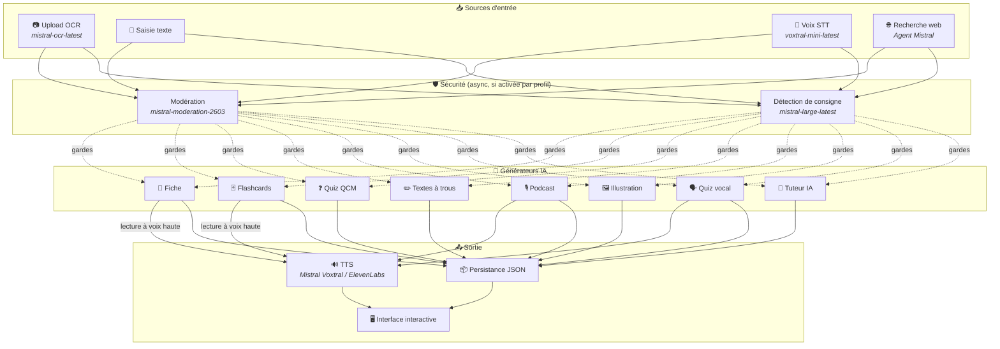
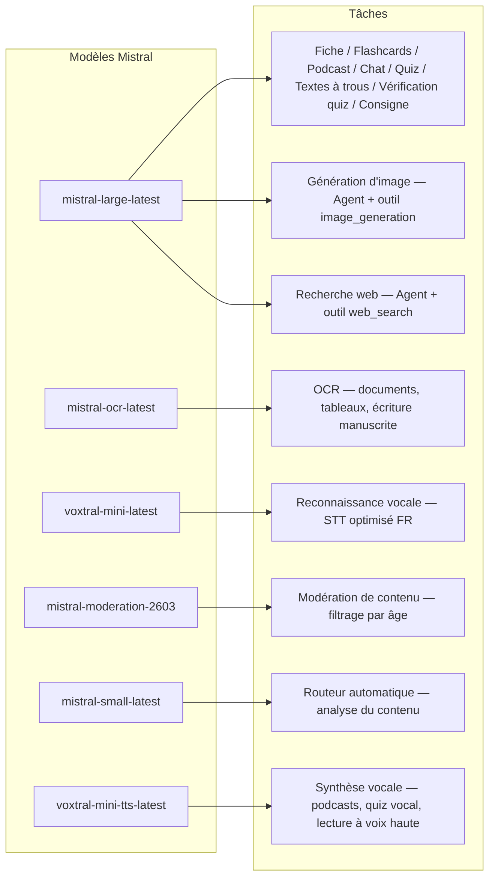
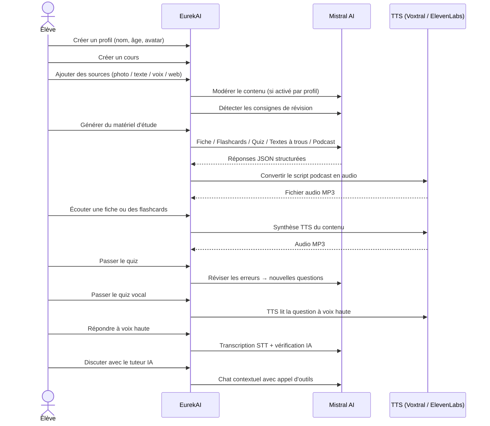

<p align="center">
  
</p>

<h1 align="center">EurekAI</h1>

<p align="center">
  <strong>Verwandelt beliebige Inhalte in interaktive Lernerlebnisse — angetrieben von <a href="https://mistral.ai">Mistral AI</a>.</strong>
</p>

<p align="center">
  <a href="README-en.md">🇬🇧 Englisch</a> · <a href="README-es.md">🇪🇸 Spanisch</a> · <a href="README-pt.md">🇧🇷 Portugiesisch</a> · <a href="README-de.md">🇩🇪 Deutsch</a> · <a href="README-it.md">🇮🇹 Italienisch</a> · <a href="README-nl.md">🇳🇱 Niederländisch</a> · <a href="README-ar.md">🇸🇦 Arabisch</a><br>
  <a href="README-hi.md">🇮🇳 Hindi</a> · <a href="README-zh.md">🇨🇳 Chinesisch</a> · <a href="README-ja.md">🇯🇵 Japanisch</a> · <a href="README-ko.md">🇰🇷 Koreanisch</a> · <a href="README-pl.md">🇵🇱 Polnisch</a> · <a href="README-ro.md">🇷🇴 Rumänisch</a> · <a href="README-sv.md">🇸🇪 Schwedisch</a>
</p>

<p align="center">
  <a href="https://www.youtube.com/watch?v=_b1TQz2leoI"></a>
</p>

<h4 align="center">📊 Codequalität</h4>

<p align="center">
  <a href="https://sonarcloud.io/summary/new_code?id=jls42_EurekAI"></a>
  <a href="https://sonarcloud.io/summary/new_code?id=jls42_EurekAI"></a>
  <a href="https://sonarcloud.io/summary/new_code?id=jls42_EurekAI"></a>
  <a href="https://sonarcloud.io/summary/new_code?id=jls42_EurekAI"></a>
</p>
<p align="center">
  <a href="https://sonarcloud.io/summary/new_code?id=jls42_EurekAI"></a>
  <a href="https://sonarcloud.io/summary/new_code?id=jls42_EurekAI"></a>
  <a href="https://sonarcloud.io/summary/new_code?id=jls42_EurekAI"></a>
  <a href="https://sonarcloud.io/summary/new_code?id=jls42_EurekAI"></a>
</p>

---

## Die Geschichte — Warum EurekAI?

**EurekAI** entstand während des [Mistral AI Worldwide Hackathon](https://luma.com/mistralhack-online) ([offizielle Website](https://worldwide-hackathon.mistral.ai/)) (März 2026). Ich brauchte ein Thema — und die Idee kam aus etwas ganz Konkretem: Ich bereite regelmäßig Klassenarbeiten mit meiner Tochter vor und dachte, es müsste möglich sein, das mithilfe von KI spielerischer und interaktiver zu gestalten.

Das Ziel: jede beliebige Eingabe — ein Foto aus dem Lehrbuch, ein kopierter Text, eine Sprachaufnahme, eine Websuche — zu nehmen und in **Lernzusammenfassungen, Karteikarten, Quiz, Podcasts, Lückentexte, Illustrationen und mehr** zu verwandeln. All das angetrieben von den französischen Modellen von Mistral AI, wodurch es eine natürlich für französischsprachige Schüler geeignete Lösung ist.

Das Projekt wurde während des Hackathons initiiert und anschließend weiterentwickelt. Der gesamte Code wurde von KI erzeugt — hauptsächlich mit [Claude Code](https://docs.anthropic.com/en/docs/claude-code), mit einigen Beiträgen über [Codex](https://openai.com/index/introducing-codex/).

---

## Funktionen

| | Funktion | Beschreibung |
|---|---|---|
| 📷 | **Upload OCR** | Fotografieren Sie Ihr Lehrbuch oder Ihre Notizen — Mistral OCR extrahiert den Inhalt |
| 📝 | **Texteingabe** | Geben Sie beliebigen Text ein oder fügen Sie ihn direkt ein |
| 🎤 | **Sprachinput** | Nehmen Sie sich auf — Voxtral STT transkribiert Ihre Stimme |
| 🌐 | **Websuche** | Stellen Sie eine Frage — ein Mistral-Agent sucht Antworten im Web |
| 📄 | **Lernzusammenfassungen** | Strukturierte Notizen mit Schlüsselpunkten, Vokabular, Zitaten, Anekdoten |
| 🃏 | **Karteikarten** | 5–50 Frage/Antwort-Karten mit Quellenverweisen für aktives Erinnern |
| ❓ | **Multiple-Choice-Quiz** | 5–50 Multiple-Choice-Fragen mit adaptiver Fehlerüberarbeitung |
| ✏️ | **Lückentexte** | Ausfüllübungen mit Hinweisen und toleranter Validierung |
| 🎙️ | **Podcast** | Mini-Podcast mit 2 Stimmen, in Audio via Mistral Voxtral TTS konvertiert |
| 🖼️ | **Illustrationen** | Lehrreiche Bilder, generiert von einem Mistral-Agenten |
| 🗣️ | **Sprachquiz** | Fragen werden laut vorgelesen, mündliche Antwort, die KI überprüft die Antwort |
| 💬 | **KI-Tutor** | Kontextbasierter Chat mit Ihren Kursdokumenten, mit Tool-Aufrufen |
| 🧠 | **Automatischer Router** | Ein Router basierend auf `mistral-small-latest` analysiert den Inhalt und schlägt eine Kombination von Generatoren aus den 7 verfügbaren Typen vor |
| 🔒 | **Kindersicherung** | Altersgerechte Moderation, Eltern-PIN, Chat-Einschränkungen |
| 🌍 | **Mehrsprachig** | Benutzeroberfläche in 9 Sprachen; KI-Generierung in 15 Sprachen per Prompts steuerbar |
| 🔊 | **Vorlesefunktion** | Hören Sie Zusammenfassungen und Karteikarten via Mistral Voxtral TTS oder ElevenLabs |

---

## Architekturüberblick



---

## Übersicht der Modellnutzung



---

## Benutzerablauf



---

## Tiefere Einblicke — Funktionen

### Multimodale Eingabe

EurekAI akzeptiert 4 Quelltypen, die je nach Profil moderiert werden (standardmäßig für Kind und Jugendlicher aktiviert):

- **Upload OCR** — JPG-, PNG- oder PDF-Dateien, verarbeitet von `mistral-ocr-latest`. Verarbeitet gedruckten Text, Tabellen und Handschrift.
- **Freitext** — Geben Sie beliebigen Inhalt ein oder fügen Sie ihn ein. Moderiert vor der Speicherung, wenn die Moderation aktiviert ist.
- **Sprachinput** — Nehmen Sie Audio im Browser auf. Transkribiert von `voxtral-mini-latest`. Der Parameter `language="fr"` optimiert die Erkennung.
- **Websuche** — Geben Sie eine Anfrage ein. Ein temporärer Mistral-Agent mit dem Tool `web_search` ruft die Ergebnisse ab und fasst sie zusammen.

### KI-Inhaltsgenerierung

Sieben Arten von Lernmaterial werden generiert:

| Generator | Modell | Ausgabe |
|---|---|---|
| **Lernzusammenfassung** | `mistral-large-latest` | Titel, Zusammenfassung, 10–25 Schlüsselpunkte, Vokabular, Zitate, Anekdote |
| **Karteikarten** | `mistral-large-latest` | 5–50 Frage/Antwort-Karten mit Quellenverweisen für aktives Erinnern |
| **Multiple-Choice-Quiz** | `mistral-large-latest` | 5–50 Fragen, je 4 Antwortmöglichkeiten, Erklärungen, adaptive Wiederholung |
| **Lückentexte** | `mistral-large-latest` | Sätze zum Ausfüllen mit Hinweisen, tolerante Validierung (Levenshtein) |
| **Podcast** | `mistral-large-latest` + Voxtral TTS | Skript für 2 Stimmen → MP3-Audio |
| **Illustration** | Agent `mistral-large-latest` | Lehrbild via Tool `image_generation` |
| **Sprachquiz** | `mistral-large-latest` + Voxtral TTS + STT | Fragen per TTS → Antwort per STT → KI-Überprüfung |

### KI-Tutor per Chat

Ein konversationeller Tutor mit Vollzugriff auf die Kursdokumente:

- Verwendet `mistral-large-latest`
- Tool-Aufrufe: kann während des Gesprächs Lernzusammenfassungen, Karteikarten, Quiz oder Lückentexte generieren
- Verlauf von 50 Nachrichten pro Kurs
- Inhaltsmoderation, falls für das Profil aktiviert

### Automatischer Router

Der Router nutzt `mistral-small-latest` zur Analyse des Inhalts der Quellen und schlägt die relevantesten Generatoren aus den 7 verfügbaren Typen vor. Die Oberfläche zeigt den Fortschritt in Echtzeit: zuerst eine Analysephase, dann die einzelnen Generierungen mit möglicher Abbruchoption.

### Adaptives Lernen

- **Quiz-Statistiken**: Verfolgung der Versuche und der Genauigkeit pro Frage
- **Quiz-Wiederholung**: Generiert 5–10 neue Fragen, die auf schwache Konzepte abzielen
- **Erkennung von Anweisungen**: Erkennt Wiederholungsanweisungen ("Ich lerne meine Lektion, wenn ich ...") und priorisiert sie in kompatiblen textbasierten Generatoren (Zusammenfassung, Karteikarten, Quiz, Lückentexte)

### Sicherheit & Kindersicherung

- **4 Altersgruppen**: Kind (≤10 Jahre), Jugendlicher (11–15), Studierender (16–25), Erwachsener (26+)
- **Inhaltsmoderation**: `mistral-moderation-2603` mit 5 für Kind/Jugendlichen blockierten Kategorien (sexual, hate, violence, selfharm, jailbreaking), keine Beschränkung für Studierende/Erwachsene
- **Eltern-PIN**: SHA-256-Hash, erforderlich für Profile unter 15 Jahren. Für Produktions-Deployments einen langsamen Hash mit Salt vorsehen (Argon2id, bcrypt).
- **Chat-Einschränkungen**: KI-Chat standardmäßig für unter 16-Jährige deaktiviert, durch Eltern aktivierbar

### Multi-Profil-System

- Mehrere Profile mit Name, Alter, Avatar, Spracheinstellungen
- Projekte an Profile gebunden via `profileId`
- Kaskadierende Löschung: das Löschen eines Profils entfernt alle zugehörigen Projekte

### TTS – mehrere Anbieter

- **Mistral Voxtral TTS** (Standard): `voxtral-mini-tts-latest`, kein zusätzlicher Schlüssel erforderlich
- **ElevenLabs** (alternativ): `eleven_v3`, natürliche Stimmen, benötigt `ELEVENLABS_API_KEY`
- Anbieter in den Anwendungseinstellungen konfigurierbar

### Internationalisierung

- Benutzeroberfläche in 9 Sprachen: fr, en, es, pt, it, nl, de, hi, ar
- KI-Prompts unterstützen 15 Sprachen (fr, en, es, de, it, pt, nl, ja, zh, ko, ar, hi, pl, ro, sv)
- Sprache pro Profil konfigurierbar

---

## Technologie-Stack

| Ebene | Technologie | Rolle |
|---|---|---|
| **Runtime** | Node.js + TypeScript 5.x | Server und Typensicherheit |
| **Backend** | Express 4.x | REST-API |
| **Entwicklungsserver** | Vite 7.x + tsx | HMR, Handlebars-Partial-Rendering, Proxy |
| **Frontend** | HTML + TailwindCSS 4.x + Alpine.js 3.x | Reaktive Oberfläche, TypeScript kompiliert von Vite |
| **Templating** | vite-plugin-handlebars | HTML-Zusammenstellung via Partials |
| **KI** | Mistral AI SDK 2.x | Chat, OCR, STT, TTS, Agents, Moderation |
| **TTS (Standard)** | Mistral Voxtral TTS | `voxtral-mini-tts-latest`, integrierte Sprachsynthese |
| **TTS (alternativ)** | ElevenLabs SDK 2.x | `eleven_v3`, natürliche Stimmen |
| **Icons** | Lucide | SVG-Icon-Bibliothek |
| **Markdown** | Marked | Markdown-Rendering im Chat |
| **Dateiupload** | Multer 1.4 LTS | Verarbeitung multipart/form-data |
| **Audio** | ffmpeg-static | Zusammenfügen von Audiosegmenten |
| **Tests** | Vitest | Unit-Tests — Coverage gemessen via SonarCloud |
| **Persistenz** | JSON-Dateien | Speicherung ohne zusätzliche Abhängigkeit |

---

## Modellreferenz

| Modell | Verwendung | Warum |
|---|---|---|
| `mistral-large-latest` | Zusammenfassung, Karteikarten, Podcast, Quiz, Lückentexte, Chat, Überprüfung Sprachquiz, Image Agent, Web Search Agent, Erkennung von Anweisungen | Beste Multilingualität + Instruktionsbefolgung |
| `mistral-ocr-latest` | Dokumenten-OCR | Gedruckter Text, Tabellen, Handschrift |
| `voxtral-mini-latest` | Spracherkennung (STT) | Multilinguales STT, optimiert mit `language="fr"` |
| `voxtral-mini-tts-latest` | Sprachsynthese (TTS) | Podcasts, Sprachquiz, Vorlesefunktion |
| `mistral-moderation-2603` | Inhaltsmoderation | 5 für Kind/Jugendliche blockierte Kategorien (+ jailbreaking) |
| `mistral-small-latest` | Automatischer Router | Schnelle Inhaltsanalyse zur Routing-Entscheidung |
| `eleven_v3` (ElevenLabs) | Sprachsynthese (alternatives TTS) | Natürliche Stimmen, konfigurierbare Alternative |

---

## Schnellstart

```bash
# Cloner le dépôt
git clone https://github.com/jls42/EurekAI.git
cd EurekAI

# Installer les dépendances
npm install

# Configurer les clés API
cp .env.example .env
# Éditez .env avec vos clés :
#   MISTRAL_API_KEY=votre_clé_ici           (requis)
#   ELEVENLABS_API_KEY=votre_clé_ici        (optionnel, TTS alternatif)
#   SONAR_TOKEN=...                          (optionnel, CI SonarCloud uniquement)

# Lancer le développement
npm run dev
# → Backend :  http://localhost:3000 (API)
# → Frontend : http://localhost:5173 (serveur Vite avec HMR)
```

> **Hinweis** : Mistral Voxtral TTS ist der Standard-Provider — kein zusätzlicher Schlüssel erforderlich über `MISTRAL_API_KEY` hinaus. ElevenLabs ist ein alternativer TTS-Provider, konfigurierbar in den Einstellungen.

---

## Projektstruktur

```
server.ts                 — Point d'entrée Express, monte les routes + config
config.ts                 — Config runtime (modèles, voix, TTS provider), persistée dans output/config.json
store.ts                  — ProjectStore : CRUD projets/sources/générations, persistance JSON
profiles.ts               — ProfileStore : gestion des profils, hachage PIN
types.ts                  — Types TypeScript : Source, Generation (7 types), QuizStats, Profile
prompts.ts                — Tous les prompts IA centralisés (system + user templates, 15 langues)

generators/
  ocr.ts                  — Upload + OCR via Mistral (JPG, PNG, PDF)
  summary.ts              — Génération de fiche de révision (JSON structuré)
  flashcards.ts           — Flashcards Q/R (5-50, configurable)
  quiz.ts                 — Quiz QCM (5-50 questions, configurable) + révision adaptative
  fill-blank.ts           — Exercices à trous avec validation tolérante
  podcast.ts              — Script podcast 2 voix
  quiz-vocal.ts           — Quiz vocal : questions TTS + réponses STT + vérification IA
  image.ts                — Génération d'image via Agent Mistral (outil image_generation)
  chat.ts                 — Tuteur IA par chat avec appel d'outils
  router.ts               — Routeur automatique (contenu → générateurs recommandés)
  consigne.ts             — Détection de consignes de révision
  tts-provider.ts         — Dispatch TTS multi-provider (Mistral Voxtral / ElevenLabs)
  tts.ts                  — Génération audio podcast (concaténation de segments)
  stt.ts                  — Voxtral STT (audio → texte)
  websearch.ts            — Agent Mistral avec outil web_search
  moderation.ts           — Modération de contenu (filtrage par âge)

routes/
  projects.ts             — CRUD projets
  profiles.ts             — CRUD profils avec gestion du PIN
  sources.ts              — Upload OCR, texte libre, voix STT, recherche web, modération
  generate.ts             — Endpoints de génération (7 types + auto + route)
  generations.ts          — Tentatives de quiz/fill-blank, réponses vocales, lecture à voix haute
  chat.ts                 — Chat IA avec appel d'outils

helpers/
  index.ts                — safeParseJson, unwrapJsonArray, extractAllText, timer
  audio.ts                — collectStream (ReadableStream → Buffer)
  fill-blank-validate.ts  — Validation tolérante des réponses (normalisation, Levenshtein)

src/                      — Frontend (Vite + Handlebars)
  index.html              — Point d'entrée HTML principal
  main.ts                 — Entrée frontend (init Alpine.js + icônes Lucide)
  app/                    — Modules applicatifs Alpine.js
    state.ts              — Gestion d'état réactif
    navigation.ts         — Routage des vues + gardes par âge
    profiles.ts           — Logique du sélecteur de profils
    projects.ts           — CRUD des cours
    sources.ts            — Gestionnaires d'upload de sources
    generate.ts           — Déclencheurs de génération (individuel, tout, auto 2 phases)
    generations.ts        — Affichage + actions sur les générations
    chat.ts               — Interface de chat
    config.ts             — Interface de configuration (modèles, voix, TTS provider)
    render.ts             — Helpers de rendu HTML
    i18n.ts               — Changement de langue
    ...
  components/
    quiz.ts               — Composant quiz interactif
    quiz-vocal.ts         — Composant quiz vocal
    fill-blank.ts         — Composant textes à trous
    flashcards.ts         — Composant flashcards avec retournement
    step-by-step.ts       — Mixin navigation pas-à-pas (quiz, fill-blank, flashcards)
  i18n/
    fr.ts, en.ts, es.ts, — Dictionnaires par langue (9 langues)
    pt.ts, it.ts, nl.ts,
    de.ts, hi.ts, ar.ts
    languages.ts          — Registre des langues UI disponibles
    index.ts              — Chargeur i18n
  partials/               — Partials HTML Handlebars (header, sidebar, dialogues, vues)
  styles/
    main.css              — Entrée TailwindCSS
    theme.css             — Variables de thème personnalisées

public/assets/            — Ressources statiques (logo, avatars)
output/                   — Données d'exécution (projets, config, fichiers audio)
```

---

## API-Referenz

### Konfiguration
| Methode | Endpoint | Beschreibung |
|---|---|---|
| `GET` | `/api/config` | Aktuelle Konfiguration |
| `PUT` | `/api/config` | Konfiguration ändern (Modelle, Stimmen, TTS-Provider) |
| `GET` | `/api/config/status` | API-Status (Mistral, ElevenLabs, TTS) |
| `POST` | `/api/config/reset` | Standardkonfiguration zurücksetzen |
| `GET` | `/api/config/voices` | Mistral TTS-Stimmen auflisten (optional `?lang=fr`) |

### Profile
| Methode | Endpoint | Beschreibung |
|---|---|---|
| `GET` | `/api/profiles` | Alle Profile auflisten |
| `POST` | `/api/profiles` | Ein Profil erstellen |
| `PUT` | `/api/profiles/:id` | Profil bearbeiten (PIN erforderlich für < 15 Jahre) |
| `DELETE` | `/api/profiles/:id` | Profil + kaskadierende Projekte löschen `{pin?}` → `{ok, deletedProjects}` |

### Projekte
| Méthode | Endpoint | Beschreibung |
|---|---|---|
| `GET` | `/api/projects` | Projekte auflisten (`?profileId=` optional) |
| `POST` | `/api/projects` | Projekt erstellen `{name, profileId}` |
| `GET` | `/api/projects/:pid` | Projektdetails |
| `PUT` | `/api/projects/:pid` | Umbenennen `{name}` |
| `DELETE` | `/api/projects/:pid` | Projekt löschen |

### Quellen
| Méthode | Endpoint | Beschreibung |
|---|---|---|
| `POST` | `/api/projects/:pid/sources/upload` | Upload OCR (multipart-Dateien) |
| `POST` | `/api/projects/:pid/sources/text` | Freitext `{text}` |
| `POST` | `/api/projects/:pid/sources/voice` | STT-Audio (multipart) |
| `POST` | `/api/projects/:pid/sources/websearch` | Websuche `{query}` |
| `DELETE` | `/api/projects/:pid/sources/:sid` | Quelle löschen |
| `POST` | `/api/projects/:pid/moderate` | Moderieren `{text}` |
| `POST` | `/api/projects/:pid/detect-consigne` | Erkennung von Wiederholungsanweisungen |

### Generierung
| Méthode | Endpoint | Beschreibung |
|---|---|---|
| `POST` | `/api/projects/:pid/generate/summary` | Lernzusammenfassung |
| `POST` | `/api/projects/:pid/generate/flashcards` | Karteikarten |
| `POST` | `/api/projects/:pid/generate/quiz` | Multiple-Choice-Quiz |
| `POST` | `/api/projects/:pid/generate/fill-blank` | Lückentexte |
| `POST` | `/api/projects/:pid/generate/podcast` | Podcast |
| `POST` | `/api/projects/:pid/generate/image` | Illustration |
| `POST` | `/api/projects/:pid/generate/quiz-vocal` | Sprachquiz |
| `POST` | `/api/projects/:pid/generate/quiz-review` | Adaptive Wiederholung `{generationId, weakQuestions}` |
| `POST` | `/api/projects/:pid/generate/route` | Routing-Analyse (Plan der zu startenden Generatoren) |
| `POST` | `/api/projects/:pid/generate/auto` | Automatische Backend-Generierung (Routing + 5 Typen: summary, flashcards, quiz, fill-blank, podcast) |

Alle Generierungsrouten akzeptieren `{sourceIds?, lang?, ageGroup?, count?, useConsigne?}`. `quiz-review` erfordert zusätzlich `{generationId, weakQuestions}`.

### CRUD Generierungen
| Méthode | Endpoint | Beschreibung |
|---|---|---|
| `POST` | `/api/projects/:pid/generations/:gid/quiz-attempt` | Quiz-Antworten einreichen `{answers}` |
| `POST` | `/api/projects/:pid/generations/:gid/fill-blank-attempt` | Lückentext-Antworten einreichen `{answers}` |
| `POST` | `/api/projects/:pid/generations/:gid/vocal-answer` | Mündliche Antwort überprüfen (Audio + questionIndex) |
| `POST` | `/api/projects/:pid/generations/:gid/read-aloud` | TTS-Vorlese-Funktion (Zusammenfassungen/Karteikarten) |
| `PUT` | `/api/projects/:pid/generations/:gid` | Umbenennen `{title}` |
| `DELETE` | `/api/projects/:pid/generations/:gid` | Generierung löschen |

### Chat
| Méthode | Endpoint | Beschreibung |
|---|---|---|
| `GET` | `/api/projects/:pid/chat` | Chat-Verlauf abrufen |
| `POST` | `/api/projects/:pid/chat` | Nachricht senden `{message, lang, ageGroup}` |
| `DELETE` | `/api/projects/:pid/chat` | Chat-Verlauf löschen |

---

## Architekturentscheidungen

| Entscheidung | Begründung |
|---|---|
| **Alpine.js statt React/Vue** | Minimale Größe, leichte Reaktivität mit TypeScript kompiliert von Vite. Perfekt für einen Hackathon, bei dem Geschwindigkeit zählt. |
| **Persistenz in JSON-Dateien** | Keine Abhängigkeiten, sofortiger Start. Keine Datenbank einzurichten — man startet direkt. |
| **Vite + Handlebars** | Das Beste aus beiden Welten: schnelles HMR für die Entwicklung, HTML-Partials zur Code-Organisation, Tailwind JIT. |
| **Prompts centralisés** | Alle KI-Prompts in `prompts.ts` — einfach zu iterieren, zu testen und nach Sprache/Altersgruppe anzupassen. |
| **Système multi-générations** | Jede Generierung ist ein eigenständiges Objekt mit eigener ID — ermöglicht mehrere Lernblätter, Quiz usw. pro Kurs. |
| **Prompts adaptés par âge** | 4 Altersgruppen mit unterschiedlichem Wortschatz, Komplexität und Ton — derselbe Inhalt vermittelt je nach Lernendem unterschiedlich. |
| **Fonctionnalités basées sur les Agents** | Bildgenerierung und Websuche verwenden temporäre Mistral-Agenten — sauberer Lebenszyklus mit automatischer Bereinigung. |
| **TTS multi-provider** | Multi-Provider-TTS: Mistral Voxtral TTS standardmäßig (kein zusätzlicher Schlüssel), ElevenLabs als Alternative — konfigurierbar ohne Neustart. |

---

## Credits & Danksagungen

- **[Mistral AI](https://mistral.ai)** — KI-Modelle (Large, OCR, Voxtral STT, Voxtral TTS, Moderation, Small) + Worldwide Hackathon
- **[ElevenLabs](https://elevenlabs.io)** — Alternative Sprachsynthese-Engine (`eleven_v3`)
- **[Alpine.js](https://alpinejs.dev)** — Leichtgewichtiges reaktives Framework
- **[TailwindCSS](https://tailwindcss.com)** — Utility-CSS-Framework
- **[Vite](https://vitejs.dev)** — Frontend-Build-Tool
- **[Lucide](https://lucide.dev)** — Icon-Bibliothek
- **[Marked](https://marked.js.org)** — Markdown-Parser

Initiiert während des Mistral AI Worldwide Hackathon (März 2026), vollständig von KI mit Claude Code und Codex entwickelt.

---

## Autor

**Julien LS** — [contact@jls42.org](mailto:contact@jls42.org)

## Lizenz

[AGPL-3.0](LICENSE) — Urheberrecht (C) 2026 Julien LS

**Dieses Dokument wurde aus der französischen Version (fr) in die englische Sprache (en) mit dem Modell gpt-5-mini übersetzt. Für weitere Informationen zum Übersetzungsprozess siehe https://gitlab.com/jls42/ai-powered-markdown-translator**

