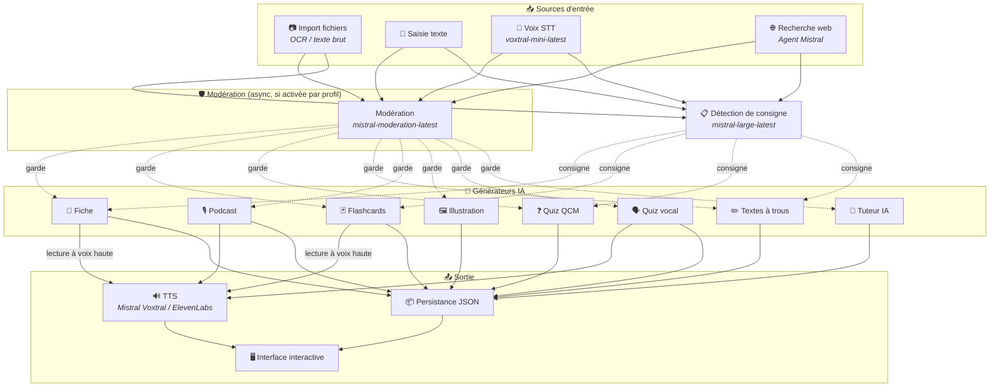
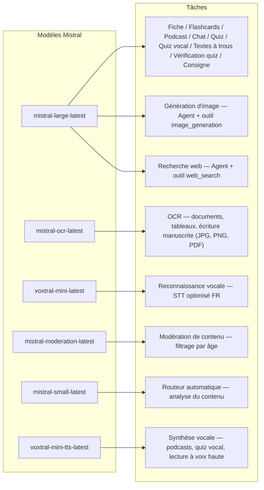
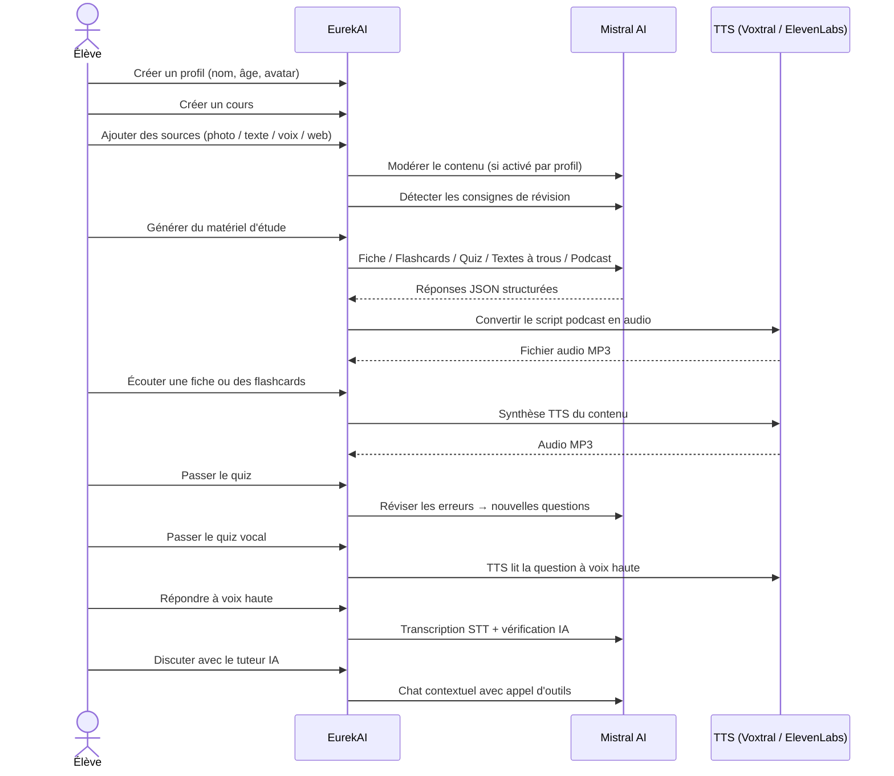

<p align="center">
  
</p>

<h1 align="center">EurekAI</h1>

<p align="center">
  <strong>Verwandelt beliebige Inhalte in interaktive Lernerlebnisse — angetrieben von <a href="https://mistral.ai">Mistral AI</a>.</strong>
</p>

<p align="center">
  <a href="README-en.md">🇬🇧 Englisch</a> · <a href="README-es.md">🇪🇸 Spanisch</a> · <a href="README-pt.md">🇧🇷 Portugiesisch</a> · <a href="README-de.md">🇩🇪 Deutsch</a> · <a href="README-it.md">🇮🇹 Italienisch</a> · <a href="README-nl.md">🇳🇱 Niederländisch</a> · <a href="README-ar.md">🇸🇦 Arabisch</a><br>
  <a href="README-hi.md">🇮🇳 Hindi</a> · <a href="README-zh.md">🇨🇳 Chinesisch</a> · <a href="README-ja.md">🇯🇵 Japanisch</a> · <a href="README-ko.md">🇰🇷 Koreanisch</a> · <a href="README-pl.md">🇵🇱 Polnisch</a> · <a href="README-ro.md">🇷🇴 Rumänisch</a> · <a href="README-sv.md">🇸🇪 Schwedisch</a>
</p>

<p align="center">
  <a href="https://www.youtube.com/watch?v=_b1TQz2leoI"></a>
</p>

<h4 align="center">📊 Codequalität</h4>

<p align="center">
  <a href="https://sonarcloud.io/summary/new_code?id=jls42_EurekAI"></a>
  <a href="https://sonarcloud.io/summary/new_code?id=jls42_EurekAI"></a>
  <a href="https://sonarcloud.io/summary/new_code?id=jls42_EurekAI"></a>
  <a href="https://sonarcloud.io/summary/new_code?id=jls42_EurekAI"></a>
</p>
<p align="center">
  <a href="https://sonarcloud.io/summary/new_code?id=jls42_EurekAI"></a>
  <a href="https://sonarcloud.io/summary/new_code?id=jls42_EurekAI"></a>
  <a href="https://sonarcloud.io/summary/new_code?id=jls42_EurekAI"></a>
  <a href="https://sonarcloud.io/summary/new_code?id=jls42_EurekAI"></a>
</p>

---

## Die Geschichte — Warum EurekAI?

**EurekAI** entstand während des [Mistral AI Worldwide Hackathon](https://luma.com/mistralhack-online) ([offizielle Seite](https://worldwide-hackathon.mistral.ai/)) (März 2026). Ich brauchte ein Thema — und die Idee kam aus etwas sehr Konkretem: Ich bereite regelmäßig Tests mit meiner Tochter vor und dachte, dass man das mit Hilfe von KI spielerischer und interaktiver gestalten könnte.

Das Ziel: beliebige Eingaben — ein Foto der Lektion, ein kopierter Text, eine Sprachaufnahme, eine Websuche — in **Lernzettel, Karteikarten, Quiz, Podcasts, Lückentexte, Illustrationen und mehr** zu verwandeln. Alles angetrieben von den französischen Modellen von Mistral AI, was es zu einer naturgemäß für frankophone Lernende geeigneten Lösung macht.

Das Projekt wurde während des Hackathons im [ursprünglichen Repo](https://github.com/jls42/worldwide-hackathon.mistral.ai) entwickelt und hier weitergeführt und erweitert. Der gesamte Code wird von KI generiert — hauptsächlich durch [Claude Code](https://code.claude.com/), mit einigen Beiträgen über [Codex](https://openai.com/codex/) und [Gemini CLI](https://geminicli.com/).

---

## Funktionen

| | Funktion | Beschreibung |
|---|---|---|
| 📷 | **Dateien importieren** | Importieren Sie Ihre Lektionen — Foto, PDF (via Mistral OCR) oder Textdatei (TXT, MD) |
| 📝 | **Texteingabe** | Tippen oder fügen Sie beliebigen Text direkt ein |
| 🎤 | **Sprachinput** | Nehmen Sie sich auf — Voxtral STT transkribiert Ihre Stimme |
| 🌐 | **Websuche** | Stellen Sie eine Frage — ein Mistral-Agent sucht Antworten im Web |
| 📄 | **Lernzettel** | Strukturierte Notizen mit Schlüsselpunkten, Vokabular, Zitaten, Anekdoten |
| 🃏 | **Karteikarten** | Frage-/Antwort-Karten mit Quellenangaben für aktives Lernen (Anzahl konfigurierbar) |
| ❓ | **Multiple-Choice-Quiz** | Multiple-Choice-Fragen mit adaptiver Fehlerwiederholung (Anzahl konfigurierbar) |
| ✏️ | **Lückentexte** | Ausfüllübungen mit Hinweisen und toleranter Validierung |
| 🎙️ | **Podcast** | Minipodcast mit 2 Stimmen, in Audio konvertiert via Mistral Voxtral TTS |
| 🖼️ | **Illustrationen** | Pädagogische Bilder generiert von einem Mistral-Agent |
| 🗣️ | **Sprachquiz** | Fragen werden vorgelesen, mündliche Antwort, KI überprüft die Antwort |
| 💬 | **KI-Tutor** | Kontextbasierter Chat mit Ihren Kursdokumenten, mit Tool-Aufrufen |
| 🧠 | **Automatischer Router** | Ein Router basierend auf `mistral-small-latest` analysiert den Inhalt und schlägt eine Kombination von Generatoren aus den 7 verfügbaren Typen vor |
| 🔒 | **Elterliche Kontrolle** | Konfigurierbare Moderation pro Profil (anpassbare Kategorien), Eltern-PIN, Chat-Einschränkungen |
| 🌍 | **Mehrsprachig** | Oberfläche in 9 Sprachen verfügbar; KI-Generierung in 15 Sprachen via Prompts steuerbar |
| 🔊 | **Vorlesen** | Hören Sie Lernzettel und Karteikarten via Mistral Voxtral TTS oder ElevenLabs |

---

## Überblick über die Architektur



---

## Übersicht der Modellverwendung



---

## Benutzerablauf



---

## Detaillierter Einblick — Funktionen

### Multimodale Eingabe

EurekAI akzeptiert 4 Quelltypen, moderiert je nach Profil (standardmäßig für Kind und Teenager aktiviert):

- **Dateien importieren** — JPG-, PNG- oder PDF-Dateien werden von `mistral-ocr-latest` verarbeitet (gedruckter Text, Tabellen, Handschrift), oder Textdateien (TXT, MD) werden direkt importiert.
- **Freitext** — Tippen oder Einfügen beliebiger Inhalte. Wird vor der Speicherung moderiert, wenn Moderation aktiv ist.
- **Sprachaufnahme** — Nehmen Sie Audio im Browser auf. Transkribiert von `voxtral-mini-latest`. Die Einstellung `language="fr"` verbessert die Erkennung.
- **Websuche** — Geben Sie eine Anfrage ein. Ein temporärer Mistral-Agent mit dem Tool `web_search` holt und fasst die Ergebnisse zusammen.

### KI-gestützte Inhaltserzeugung

Sieben Typen von Lernmaterialien:

| Generator | Modell | Ausgabe |
|---|---|---|
| **Lernzettel** | `mistral-large-latest` | Titel, Zusammenfassung, Schlüsselpunkte, Vokabular, Zitate, Anekdote |
| **Karteikarten** | `mistral-large-latest` | Frage-/Antwort-Karten mit Quellenangaben (Anzahl konfigurierbar) |
| **Multiple-Choice-Quiz** | `mistral-large-latest` | Multiple-Choice-Fragen, Erklärungen, adaptive Fehlerwiederholung (Anzahl konfigurierbar) |
| **Lückentexte** | `mistral-large-latest` | Lückensätze mit Hinweisen, tolerante Validierung (Levenshtein) |
| **Podcast** | `mistral-large-latest` + Voxtral TTS | Skript 2 Stimmen → MP3-Audio |
| **Illustration** | Agent `mistral-large-latest` | Pädagogisches Bild via Tool `image_generation` |
| **Sprachquiz** | `mistral-large-latest` + Voxtral TTS + STT | Fragen TTS → STT-Antwort → KI-Überprüfung |

### KI-Tutor per Chat

Ein konversationeller Tutor mit vollem Zugriff auf Kursdokumente:

- Nutzt `mistral-large-latest`
- **Tool-Aufrufe**: kann während des Gesprächs Lernzettel, Karteikarten, Quiz oder Lückentexte generieren
- Verlauf: 50 Nachrichten pro Kurs
- Inhalt wird moderiert, falls für das Profil aktiviert

### Automatischer Router

Der Router verwendet `mistral-small-latest` zur Analyse des Inhalts der Quellen und schlägt die am besten geeigneten Generatoren aus den 7 verfügbaren vor. Die Oberfläche zeigt den Fortschritt in Echtzeit: zuerst eine Analysephase, dann die einzelnen Generierungen mit möglicher Abbruchoption.

### Adaptives Lernen

- **Quiz-Statistiken**: Verfolgung von Versuchen und Genauigkeit pro Frage
- **Quiz-Revision**: erzeugt 5–10 neue Fragen, die auf schwache Konzepte abzielen
- **Erkennung von Lernanweisungen**: erkennt Anweisungen zur Wiederholung ("Ich kenne meine Lektion, wenn ich ... kann") und priorisiert diese in kompatiblen Textgeneratoren (Lernzettel, Karteikarten, Quiz, Lückentexte)

### Sicherheit & Kindersicherung

- **4 Altersgruppen**: Kind (≤10 Jahre), Teenager (11–15), Student (16–25), Erwachsener (26+)
- **Inhaltsmoderation**: `mistral-moderation-latest` mit 10 verfügbaren Kategorien, 5 davon sind standardmäßig für Kind/Teenager blockiert (`sexual`, `hate_and_discrimination`, `violence_and_threats`, `selfharm`, `jailbreaking`). Kategorien sind pro Profil anpassbar.
- **Eltern-PIN**: SHA-256-Hash, erforderlich für Profile unter 15 Jahren. Für Produktion ein langsames gehashteres Verfahren mit Salt vorsehen (Argon2id, bcrypt).
- **Chat-Einschränkungen**: KI-Chat ist standardmäßig für unter 16-Jährige deaktiviert, kann von Eltern aktiviert werden

### Multi-Profil-System

- Mehrere Profile mit Name, Alter, Avatar, Spracheinstellungen
- Projekte sind über `profileId` an Profile gebunden
- Kaskadierende Löschung: Löscht man ein Profil, werden alle zugehörigen Projekte gelöscht

### TTS Multi-Provider

- **Mistral Voxtral TTS** (Standard): `voxtral-mini-tts-latest`, kein zusätzlicher Key erforderlich
- **ElevenLabs** (Alternativ): `eleven_v3`, natürliche Stimmen, benötigt `ELEVENLABS_API_KEY`
- Provider in den App-Einstellungen konfigurierbar

### Internationalisierung

- Oberfläche in 9 Sprachen verfügbar: fr, en, es, pt, it, nl, de, hi, ar
- KI-Prompts unterstützen 15 Sprachen (fr, en, es, de, it, pt, nl, ja, zh, ko, ar, hi, pl, ro, sv)
- Sprache pro Profil konfigurierbar

---

## Technologie-Stack

| Schicht | Technologie | Rolle |
|---|---|---|
| **Runtime** | Node.js + TypeScript 6.x | Server und Typensicherheit |
| **Backend** | Express 5.x | REST-API |
| **Dev-Server** | Vite 8.x (Rolldown) + tsx | HMR, Handlebars-Teile, Proxy |
| **Frontend** | HTML + TailwindCSS 4.x + Alpine.js 3.x | Reaktive Oberfläche, TypeScript kompiliert durch Vite |
| **Templating** | vite-plugin-handlebars | HTML-Zusammenstellung durch Partials |
| **KI** | Mistral AI SDK 2.x | Chat, OCR, STT, TTS, Agents, Moderation |
| **TTS (Standard)** | Mistral Voxtral TTS | `voxtral-mini-tts-latest`, integrierte Sprachsynthese |
| **TTS (Alternativ)** | ElevenLabs SDK 2.x | `eleven_v3`, natürliche Stimmen |
| **Icons** | Lucide 1.x | SVG-Icon-Bibliothek |
| **Markdown** | Marked | Markdown-Rendering im Chat |
| **Dateiupload** | Multer 2.x | Multipart-Formular-Verarbeitung |
| **Audio** | ffmpeg-static | Zusammenfügen von Audiosegmenten |
| **Tests** | Vitest | Unit-Tests — Coverage wird von SonarCloud gemessen |
| **Persistenz** | JSON-Dateien | Speicher ohne Abhängigkeit |

---

## Modellreferenz

| Modell | Verwendung | Warum |
|---|---|---|
| `mistral-large-latest` | Lernzettel, Karteikarten, Podcast, Quiz, Lückentexte, Chat, Überprüfung Sprachquiz, Image-Agent, Web-Search-Agent, Erkennung von Anweisungen | Bestes Multilingual- + Instruction-Following-Verhalten |
| `mistral-ocr-latest` | OCR von Dokumenten | Gedruckter Text, Tabellen, Handschrift |
| `voxtral-mini-latest` | Spracherkennung (STT) | Multilinguales STT, optimiert mit `language="fr"` |
| `voxtral-mini-tts-latest` | Sprachsynthese (TTS) | Podcasts, Sprachquiz, Vorlesen |
| `mistral-moderation-latest` | Inhaltsmoderation | 5 Kategorien standardmäßig blockiert für Kind/Teen (+ Jailbreaking) |
| `mistral-small-latest` | Automatischer Router | Schnelle Analyse des Inhalts für Routing-Entscheidungen |
| `eleven_v3` (ElevenLabs) | Sprachsynthese (alternativ) | Natürliche Stimmen, konfigurierbare Alternative |

---

## Schnellstart

```bash
# Cloner le dépôt
git clone https://github.com/jls42/EurekAI.git
cd EurekAI

# Installer les dépendances
npm install

# Configurer les clés API
cp .env.example .env
# Éditez .env avec vos clés :
#   MISTRAL_API_KEY=votre_clé_ici           (requis)
#   ELEVENLABS_API_KEY=votre_clé_ici        (optionnel, TTS alternatif)
#   SONAR_TOKEN=...                          (optionnel, CI SonarCloud uniquement)

# Lancer le développement
npm run dev
# → Backend :  http://localhost:3000 (API)
# → Frontend : http://localhost:5173 (serveur Vite avec HMR)
```

> **Hinweis**: Mistral Voxtral TTS ist der Standard-Provider — kein zusätzlicher Schlüssel erforderlich außer `MISTRAL_API_KEY`. ElevenLabs ist ein alternativer TTS-Provider und in den Einstellungen konfigurierbar.

---

## Projektstruktur

```
server.ts                 — Point d'entrée Express, monte les routes + config
config.ts                 — Config runtime (modèles, voix, TTS provider), persistée dans output/config.json
store.ts                  — ProjectStore : CRUD projets/sources/générations, persistance JSON
profiles.ts               — ProfileStore : gestion des profils, hachage PIN
types.ts                  — Types TypeScript : Source, Generation (7 types), QuizStats, Profile
prompts.ts                — Tous les prompts IA centralisés (system + user templates, 15 langues)

generators/
  ocr.ts                  — OCR via Mistral (JPG, PNG, PDF)
  summary.ts              — Génération de fiche de révision (JSON structuré)
  flashcards.ts           — Flashcards Q/R (5-50, configurable)
  quiz.ts                 — Quiz QCM (5-50 questions, configurable) + révision adaptative
  fill-blank.ts           — Exercices à trous avec validation tolérante
  podcast.ts              — Script podcast 2 voix
  quiz-vocal.ts           — Quiz vocal : questions TTS + réponses STT + vérification IA
  image.ts                — Génération d'image via Agent Mistral (outil image_generation)
  chat.ts                 — Tuteur IA par chat avec appel d'outils
  router.ts               — Routeur automatique (contenu → générateurs recommandés)
  consigne.ts             — Détection de consignes de révision
  tts-provider.ts         — Dispatch TTS multi-provider (Mistral Voxtral / ElevenLabs)
  tts.ts                  — Génération audio podcast (concaténation de segments)
  stt.ts                  — Voxtral STT (audio → texte)
  websearch.ts            — Agent Mistral avec outil web_search
  moderation.ts           — Modération de contenu (filtrage par âge)

routes/
  projects.ts             — CRUD projets
  profiles.ts             — CRUD profils avec gestion du PIN
  sources.ts              — Import fichiers (OCR + texte brut), texte libre, voix STT, recherche web, modération
  generate.ts             — Endpoints de génération (7 types + auto + route)
  generations.ts          — Tentatives de quiz/fill-blank, réponses vocales, lecture à voix haute
  chat.ts                 — Chat IA avec appel d'outils

helpers/
  index.ts                — getContent, stripJsonMarkdown, safeParseJson, unwrapJsonArray, extractAllText, timer
  audio.ts                — collectStream (ReadableStream → Buffer)
  fill-blank-validate.ts  — Validation tolérante des réponses (normalisation, Levenshtein)
  diversity.ts            — Diversité des générations (exclusion du contenu déjà produit, randomSeed)

src/                      — Frontend (Vite + Handlebars)
  index.html              — Point d'entrée HTML principal
  main.ts                 — Entrée frontend (init Alpine.js + icônes Lucide)
  app/                    — Modules applicatifs Alpine.js
    state.ts              — Gestion d'état réactif
    navigation.ts         — Routage des vues + gardes par âge
    profiles.ts           — Logique du sélecteur de profils
    projects.ts           — CRUD des cours
    sources.ts            — Gestionnaires d'upload de sources
    generate.ts           — Déclencheurs de génération (individuel, tout, auto 2 phases)
    generations.ts        — Affichage + actions sur les générations
    chat.ts               — Interface de chat
    config.ts             — Interface de configuration (modèles, voix, TTS provider)
    render.ts             — Helpers de rendu HTML
    i18n.ts               — Changement de langue
    ...
  components/
    quiz.ts               — Composant quiz interactif
    quiz-vocal.ts         — Composant quiz vocal
    fill-blank.ts         — Composant textes à trous
    flashcards.ts         — Composant flashcards avec retournement
    step-by-step.ts       — Mixin navigation pas-à-pas (quiz, fill-blank, flashcards)
  i18n/
    fr.ts, en.ts, es.ts, — Dictionnaires par langue (9 langues)
    pt.ts, it.ts, nl.ts,
    de.ts, hi.ts, ar.ts
    languages.ts          — Registre des langues UI disponibles
    index.ts              — Chargeur i18n
  partials/               — Partials HTML Handlebars (header, sidebar, dialogues, vues)
  styles/
    main.css              — Entrée TailwindCSS
    theme.css             — Variables de thème personnalisées

public/assets/            — Ressources statiques (logo, avatars)
output/                   — Données d'exécution (projets, config, fichiers audio)
```

---

## API-Referenz

### Konfiguration
| Methode | Endpoint | Beschreibung |
|---|---|---|
| `GET` | `/api/config` | Aktuelle Konfiguration |
| `PUT` | `/api/config` | Konfiguration ändern (Modelle, Stimmen, TTS-Provider) |
| `GET` | `/api/config/status` | API-Status (Mistral, ElevenLabs, TTS) |
| `POST` | `/api/config/reset` | Konfiguration auf Standard zurücksetzen |
| `GET` | `/api/config/voices` | Auflisten der Mistral TTS-Stimmen (optional `?lang=fr`) |
| `GET` | `/api/moderation-categories` | Verfügbare Moderationskategorien + Alters-Defaults |

### Profile
| Methode | Endpoint | Beschreibung |
|---|---|---|
| `GET` | `/api/profiles` | Alle Profile auflisten |
| `POST` | `/api/profiles` | Profil erstellen |
| `PUT` | `/api/profiles/:id` | Profil bearbeiten (PIN erforderlich für < 15 Jahre) |
| `DELETE` | `/api/profiles/:id` | Profil löschen + kaskadierende Projektlöschung `{pin?}` → `{ok, deletedProjects}` |

### Projekte
| Methode | Endpoint | Beschreibung |
|---|---|---|
| `GET` | `/api/projects` | Projekte auflisten (`?profileId=` optional) |
| `POST` | `/api/projects` | Projekt erstellen `{name, profileId}` |
| `GET` | `/api/projects/:pid` | Projektdetails |
| `PUT` | `/api/projects/:pid` | Umbenennen `{name}` |
| `DELETE` | `/api/projects/:pid` | Projekt löschen |

### Quellen
| Méthode | Endpoint | Description |
|---|---|---|
| `POST` | `/api/projects/:pid/sources/upload` | Dateien per Multipart importieren (OCR für JPG/PNG/PDF, direkte Lesung für TXT/MD) |
| `POST` | `/api/projects/:pid/sources/text` | Freitext `{text}` |
| `POST` | `/api/projects/:pid/sources/voice` | STT für Sprache (Audio Multipart) |
| `POST` | `/api/projects/:pid/sources/websearch` | Websuche `{query}` |
| `DELETE` | `/api/projects/:pid/sources/:sid` | Quelle löschen |
| `POST` | `/api/projects/:pid/moderate` | Moderieren `{text}` |
| `POST` | `/api/projects/:pid/detect-consigne` | Erkennen von Lernanweisungen |

### Generierung
| Méthode | Endpoint | Description |
|---|---|---|
| `POST` | `/api/projects/:pid/generate/summary` | Lernzettel |
| `POST` | `/api/projects/:pid/generate/flashcards` | Karteikarten |
| `POST` | `/api/projects/:pid/generate/quiz` | Multiple-Choice-Quiz |
| `POST` | `/api/projects/:pid/generate/fill-blank` | Lückentexte |
| `POST` | `/api/projects/:pid/generate/podcast` | Podcast |
| `POST` | `/api/projects/:pid/generate/image` | Illustration |
| `POST` | `/api/projects/:pid/generate/quiz-vocal` | Sprachquiz |
| `POST` | `/api/projects/:pid/generate/quiz-review` | Adaptive Revision `{generationId, weakQuestions}` |
| `POST` | `/api/projects/:pid/generate/route` | Routing-Analyse (Plan der Generatoren, die gestartet werden sollen) |
| `POST` | `/api/projects/:pid/generate/auto` | Automatische Backend-Generierung (Routing + 5 Typen: summary, flashcards, quiz, fill-blank, podcast) |

Alle Generierungsrouten akzeptieren `{sourceIds?, lang?, ageGroup?, count?, useConsigne?}`. `quiz-review` erfordert zusätzlich `{generationId, weakQuestions}`.

### CRUD Generierungen
| Méthode | Endpoint | Beschreibung |
|---|---|---|
| `POST` | `/api/projects/:pid/generations/:gid/quiz-attempt` | Quiz-Antworten einreichen `{answers}` |
| `POST` | `/api/projects/:pid/generations/:gid/fill-blank-attempt` | Lückentext-Antworten einreichen `{answers}` |
| `POST` | `/api/projects/:pid/generations/:gid/vocal-answer` | Mündliche Antwort prüfen (Audio + questionIndex) |
| `POST` | `/api/projects/:pid/generations/:gid/read-aloud` | TTS-Vorlesen (Lernzettel/Karteikarten) |
| `PUT` | `/api/projects/:pid/generations/:gid` | Umbenennen `{title}` |
| `DELETE` | `/api/projects/:pid/generations/:gid` | Generierung löschen |

### Chat
| Méthode | Endpoint | Beschreibung |
|---|---|---|
| `GET` | `/api/projects/:pid/chat` | Chat-Verlauf abrufen |
| `POST` | `/api/projects/:pid/chat` | Nachricht senden `{message, lang, ageGroup}` |
| `DELETE` | `/api/projects/:pid/chat` | Chat-Verlauf löschen |

---

## Architekturentscheidungen | Entscheidung | Begründung |
|---|---|
| **Alpine.js statt React/Vue** | Geringer Ressourcenverbrauch, leichte Reaktivität mit TypeScript, von Vite kompiliert. Perfekt für einen Hackathon, bei dem Geschwindigkeit zählt. |
| **Persistenz in JSON-Dateien** | Keine Abhängigkeiten, sofortiger Start. Keine Datenbank zu konfigurieren — einfach starten und los geht's. |
| **Vite + Handlebars** | Das Beste aus beiden Welten: schnelles HMR für die Entwicklung, HTML-Partials zur Organisation des Codes, Tailwind JIT. |
| **Zentralisierte Prompts** | Alle KI-Prompts in `prompts.ts` — einfach zu iterieren, testen und pro Sprache/Altersgruppe anzupassen. |
| **System mit mehreren Generationen** | Jede Generation ist ein eigenständiges Objekt mit eigener ID — ermöglicht mehrere Lernblätter, Quiz usw. pro Kurs. |
| **Altersgerechte Prompts** | 4 Altersgruppen mit unterschiedlichem Vokabular, Komplexität und Ton — derselbe Inhalt wird je nach Lernendem unterschiedlich vermittelt. |
| **Agentenbasierte Funktionen** | Bildgenerierung und Websuche verwenden temporäre Mistral-Agenten — eigenständiger Lebenszyklus mit automatischer Bereinigung. |
| **Mehrere TTS-Anbieter** | Mistral Voxtral TTS standardmäßig (kein zusätzlicher Schlüssel), ElevenLabs als Alternative — konfigurierbar ohne Neustart. |

---

## Credits & Danksagungen

- **[Mistral AI](https://mistral.ai)** — KI-Modelle (Large, OCR, Voxtral STT, Voxtral TTS, Moderation, Small) + Worldwide Hackathon
- **[ElevenLabs](https://elevenlabs.io)** — alternatives Sprachsynthese-Engine (`eleven_v3`)
- **[Alpine.js](https://alpinejs.dev)** — leichtes reaktives Framework
- **[TailwindCSS](https://tailwindcss.com)** — Utility-orientiertes CSS-Framework
- **[Vite](https://vitejs.dev)** — Frontend-Build-Tool
- **[Lucide](https://lucide.dev)** — Icon-Bibliothek
- **[Marked](https://marked.js.org)** — Markdown-Parser

Initiiert während des Mistral AI Worldwide Hackathon (März 2026), vollständig von KI entwickelt mit [Claude Code](https://code.claude.com/), [Codex](https://openai.com/codex/) und [Gemini CLI](https://geminicli.com/).

---

## Autor

**Julien LS** — [contact@jls42.org](mailto:contact@jls42.org)

## Lizenz

[AGPL-3.0](LICENSE) — Copyright (C) 2026 Julien LS

**Dieses Dokument wurde aus der fr-Version in die Sprache en unter Verwendung des Modells gpt-5-mini übersetzt. Für weitere Informationen zum Übersetzungsprozess konsultieren Sie https://gitlab.com/jls42/ai-powered-markdown-translator**

