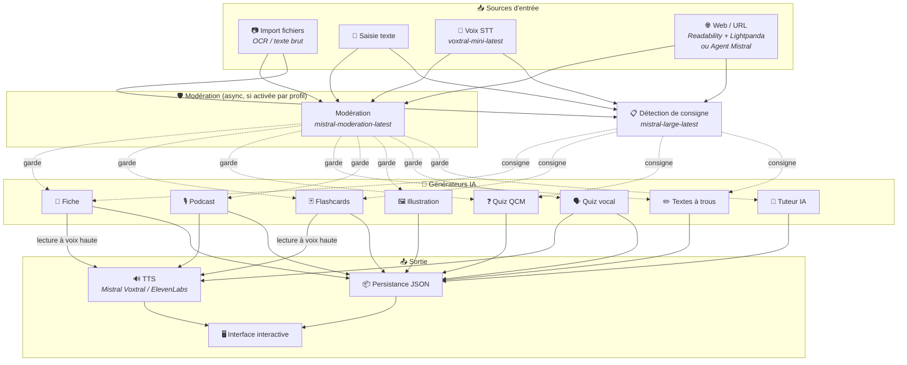
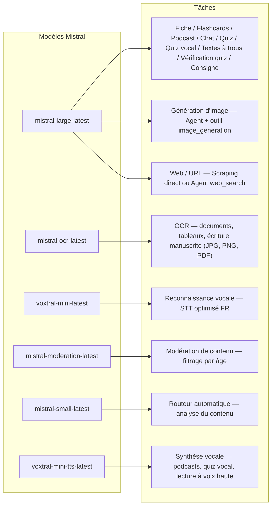
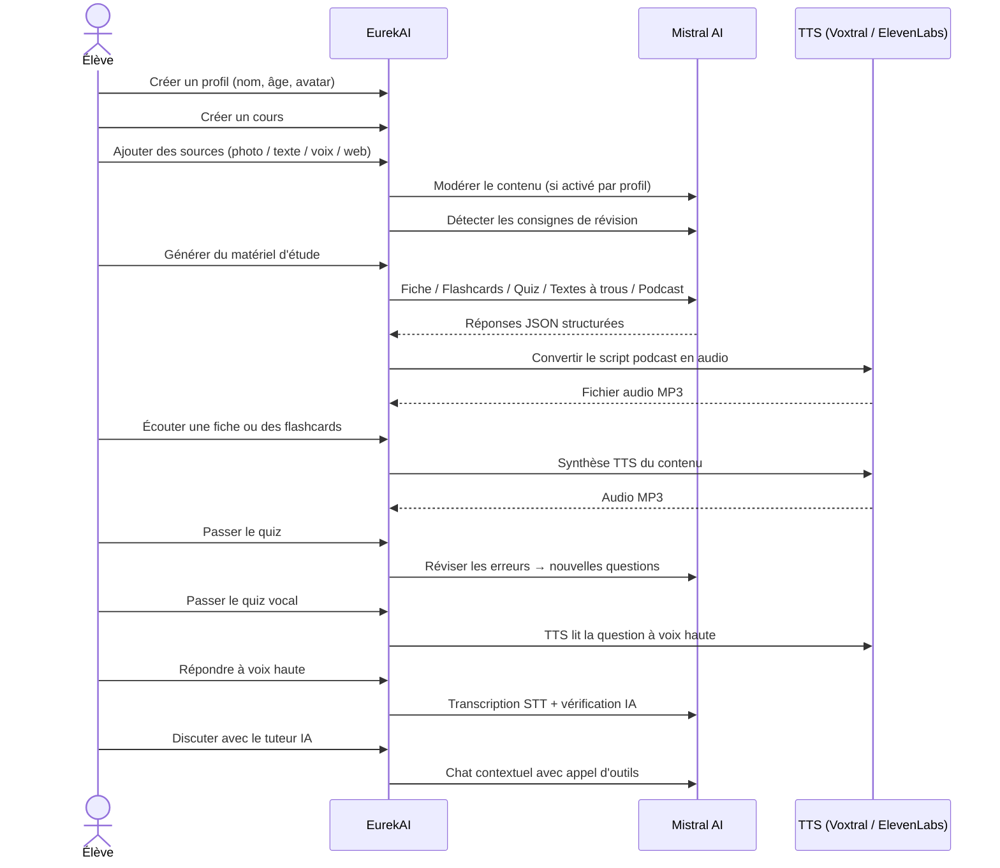

<p align="center">
  
</p>

<h1 align="center">EurekAI</h1>

<p align="center">
  <strong>Verwandeln Sie beliebige Inhalte in interaktive Lernerfahrungen — angetrieben von <a href="https://mistral.ai">Mistral AI</a>.</strong>
</p>

<p align="center">
  <a href="README-en.md">🇬🇧 Englisch</a> · <a href="README-es.md">🇪🇸 Spanisch</a> · <a href="README-pt.md">🇧🇷 Portugiesisch</a> · <a href="README-de.md">🇩🇪 Deutsch</a> · <a href="README-it.md">🇮🇹 Italienisch</a> · <a href="README-nl.md">🇳🇱 Niederländisch</a> · <a href="README-ar.md">🇸🇦 Arabisch</a><br>
  <a href="README-hi.md">🇮🇳 Hindi</a> · <a href="README-zh.md">🇨🇳 Chinesisch</a> · <a href="README-ja.md">🇯🇵 Japanisch</a> · <a href="README-ko.md">🇰🇷 Koreanisch</a> · <a href="README-pl.md">🇵🇱 Polnisch</a> · <a href="README-ro.md">🇷🇴 Rumänisch</a> · <a href="README-sv.md">🇸🇪 Schwedisch</a>
</p>

<p align="center">
  <a href="https://www.youtube.com/watch?v=_b1TQz2leoI"></a>
</p>

<h4 align="center">📊 Codequalität</h4>

<p align="center">
  <a href="https://sonarcloud.io/summary/new_code?id=jls42_EurekAI"></a>
  <a href="https://sonarcloud.io/summary/new_code?id=jls42_EurekAI"></a>
  <a href="https://sonarcloud.io/summary/new_code?id=jls42_EurekAI"></a>
  <a href="https://sonarcloud.io/summary/new_code?id=jls42_EurekAI"></a>
</p>
<p align="center">
  <a href="https://sonarcloud.io/summary/new_code?id=jls42_EurekAI"></a>
  <a href="https://sonarcloud.io/summary/new_code?id=jls42_EurekAI"></a>
  <a href="https://sonarcloud.io/summary/new_code?id=jls42_EurekAI"></a>
  <a href="https://sonarcloud.io/summary/new_code?id=jls42_EurekAI"></a>
</p>

---

## Die Geschichte — Warum EurekAI?

**EurekAI** entstand während des [Mistral AI Worldwide Hackathon](https://luma.com/mistralhack-online) ([offizielle Seite](https://worldwide-hackathon.mistral.ai/)) (März 2026). Ich brauchte ein Thema — und die Idee kam aus etwas sehr Konkretem: Ich bereite regelmäßig Tests mit meiner Tochter vor und dachte, man könnte das mittels KI spielerischer und interaktiver gestalten.

Das Ziel: Beliebige Eingaben — ein Foto der Lektion, ein kopierter Text, eine Sprachaufnahme, eine Websuche — in **Lernkarten, Lernzettel, Flashcards, Quizze, Podcasts, Lückentexte, Illustrationen und mehr** zu verwandeln. Alles angetrieben von den französischen Modellen von Mistral AI, wodurch die Lösung natürlich gut für französischsprachige Schüler geeignet ist.

Der [erste Prototyp](https://github.com/jls42/worldwide-hackathon.mistral.ai) wurde innerhalb von 48 Stunden während des Hackathons als Proof-of-Concept rund um die Mistral-Services entwickelt — bereits funktionsfähig, aber begrenzt. Seitdem ist EurekAI zu einem echten Projekt geworden: Lückentexte, Navigation in Übungen, Web-Scraping, konfigurierbare elterliche Moderation, ausführliche Code-Reviews und vieles mehr. Der gesamte Code wird von KI generiert — hauptsächlich [Claude Code](https://code.claude.com/), mit einigen Beiträgen über [Codex](https://openai.com/codex/) und [Gemini CLI](https://geminicli.com/).

---

## Funktionen

| | Funktion | Beschreibung |
|---|---|---|
| 📷 | **Dateiimport** | Importieren Sie Ihre Lektionen — Foto, PDF (via Mistral OCR) oder Textdatei (TXT, MD) |
| 📝 | **Texteingabe** | Tippen oder fügen Sie beliebigen Text direkt ein |
| 🎤 | **Sprachaufnahme** | Nehmen Sie sich auf — Voxtral STT transkribiert Ihre Stimme |
| 🌐 | **Web / URL** | Fügen Sie eine URL ein (direktes Scraping via Readability + Lightpanda) oder geben Sie eine Suche ein (Agent Mistral web_search) |
| 📄 | **Lernzettel** | Strukturierte Notizen mit Schlüsselpunkten, Vokabular, Zitaten, Anekdoten |
| 🃏 | **Flashcards** | Q/A-Karten mit Quellenangaben für aktives Wiederholen (Anzahl konfigurierbar) |
| ❓ | **Multiple-Choice-Quiz** | Auswahlfragen mit adaptiver Fehlerüberprüfung (Anzahl konfigurierbar) |
| ✏️ | **Lückentexte** | Ausfüllübungen mit Hinweisen und toleranter Validierung |
| 🎙️ | **Podcast** | Mini-Podcast mit 2 Stimmen als Audio — standardmäßig Mistral-Stimme oder personalisierte Stimmen (Eltern!) |
| 🖼️ | **Illustrationen** | Pädagogische Bilder, generiert von einem Mistral-Agent |
| 🗣️ | **Vocal-Quiz** | Fragen werden vorgelesen (anpassbare Stimme), mündliche Antwort, KI-Verifikation |
| 💬 | **KI-Tutor** | Kontextbasierter Chat mit Ihren Kursdokumenten, mit Tool-Aufrufen |
| 🧠 | **Automatischer Router** | Ein Router basierend auf `mistral-small-latest` analysiert den Inhalt und schlägt eine Kombination von Generatoren aus den 7 verfügbaren Typen vor |
| 🔒 | **Elterliche Kontrolle** | Konfigurierbare Moderation pro Profil (anpassbare Kategorien), Eltern-PIN, Chat-Einschränkungen |
| 🌍 | **Mehrsprachig** | Oberfläche in 9 Sprachen verfügbar; KI-Generierung in 15 Sprachen via Prompts steuerbar |
| 🔊 | **Vorlesefunktion** | Hören Sie Lernzettel und Flashcards via Mistral Voxtral TTS oder ElevenLabs |

---

## Übersicht der Architektur



---

## Übersicht der Modellnutzung



---

## Benutzerfluss



---

## Vertiefung — Funktionen

### Multimodale Eingabe

EurekAI akzeptiert 4 Quelltypen, moderiert je nach Profil (standardmäßig für Kind und Teen aktiviert):

- **Dateiimport** — JPG-, PNG- oder PDF-Dateien werden von `mistral-ocr-latest` verarbeitet (gedruckter Text, Tabellen, Handschrift), oder Textdateien (TXT, MD) werden direkt importiert.
- **Freier Text** — Tippen oder Einfügen beliebiger Inhalte. Bei aktivierter Moderation wird vor dem Speichern moderiert.
- **Sprachaufnahme** — Nehmen Sie Audio im Browser auf. Transkribiert von `voxtral-mini-latest`. Der Parameter `language="fr"` optimiert die Erkennung.
- **Web / URL** — Fügen Sie eine oder mehrere URLs ein, um Inhalte direkt zu scrapen (Readability + Lightpanda für JS-Seiten), oder geben Sie Suchbegriffe ein für eine Websuche via Agent Mistral. Das Eingabefeld akzeptiert beides — URLs und Schlüsselwörter werden automatisch getrennt, jedes Ergebnis erzeugt eine eigene Quelle.

### KI-Generierung von Inhalten

Sieben Typen von Lernmaterialien:

| Generator | Modell | Ausgabe |
|---|---|---|
| **Lernzettel** | `mistral-large-latest` | Titel, Zusammenfassung, Schlüsselpunkte, Vokabular, Zitate, Anekdote |
| **Flashcards** | `mistral-large-latest` | Q/A-Karten mit Quellenverweisen (Anzahl konfigurierbar) |
| **Multiple-Choice-Quiz** | `mistral-large-latest` | Auswahlfragen, Erklärungen, adaptive Wiederholung (Anzahl konfigurierbar) |
| **Lückentexte** | `mistral-large-latest` | Auszufüllende Sätze mit Hinweisen, tolerante Validierung (Levenshtein) |
| **Podcast** | `mistral-large-latest` + Voxtral TTS | Skript für 2 Stimmen → MP3-Audio |
| **Illustration** | Agent `mistral-large-latest` | Pädagogisches Bild via Tool `image_generation` |
| **Vocal-Quiz** | `mistral-large-latest` + Voxtral TTS + STT | Fragen TTS → Antwort STT → KI-Verifikation |

### KI-Tutor per Chat

Ein konversationeller Tutor mit vollem Zugriff auf Kursdokumente:

- Verwendet `mistral-large-latest`
- **Tool-Aufrufe**: kann während der Unterhaltung Lernzettel, Flashcards, Quizze oder Lückentexte generieren
- Verlauf von 50 Nachrichten pro Kurs
- Inhalt wird moderiert, wenn für das Profil aktiviert

### Automatischer Router

Der Router verwendet `mistral-small-latest` zur Analyse des Inhalts der Quellen und schlägt die relevantesten Generatoren aus den 7 verfügbaren vor. Die Oberfläche zeigt den Fortschritt in Echtzeit: zuerst eine Analysephase, dann die einzelnen Generierungen mit Möglichkeit zum Abbrechen.

### Adaptives Lernen

- **Quiz-Statistiken**: Verfolgung von Versuchen und Genauigkeit pro Frage
- **Quiz-Wiederholung**: generiert 5–10 neue Fragen, die auf schwache Konzepte abzielen
- **Erkennungslogik für Anweisungen**: erkennt Lernanweisungen ("Ich weiß meinen Stoff, wenn ich...") und priorisiert diese in kompatiblen textuellen Generatoren (Lernzettel, Flashcards, Quiz, Lückentexte)

### Sicherheit & elterliche Kontrolle

- **4 Altersgruppen**: Kind (≤10 Jahre), Teen (11–15), Student (16–25), Erwachsener (26+)
- **Inhaltsmoderation**: `mistral-moderation-latest` mit 10 verfügbaren Kategorien, 5 standardmäßig für Kind/Teen geblockt (`sexual`, `hate_and_discrimination`, `violence_and_threats`, `selfharm`, `jailbreaking`). Kategorien sind pro Profil in den Einstellungen anpassbar.
- **Eltern-PIN**: SHA-256-Hash, erforderlich für Profile unter 15 Jahren. Für eine Produktivbereitstellung sollte ein langsamer Hash mit Salt verwendet werden (Argon2id, bcrypt).
- **Chat-Einschränkungen**: KI-Chat ist standardmäßig für unter 16-Jährige deaktiviert, kann von Eltern aktiviert werden

### Multi-Profil-System

- Mehrere Profile mit Name, Alter, Avatar, Spracheinstellungen
- Projekte sind mit Profilen via `profileId` verknüpft
- Kaskadierende Löschung: Löschen eines Profils entfernt alle zugehörigen Projekte

### TTS Multi-Provider & personalisierte Stimmen

- **Mistral Voxtral TTS** (Standard): `voxtral-mini-tts-latest`, keine zusätzliche Schlüssel erforderlich
- **ElevenLabs** (Alternative): `eleven_v3`, natürliche Stimmen, erfordert `ELEVENLABS_API_KEY`
- Anbieter im App-Setting konfigurierbar
- **Personalisierte Stimmen**: Eltern können eigene Stimmen über die Mistral Voices API aus einer Audioprobe erstellen und sie den Rollen Gastgeber/Gast zuweisen — Podcasts und Vocal-Quizzes werden dann mit der Stimme eines Elternteils abgespielt, was die Erfahrung für das Kind noch immersiver macht
- Zwei konfigurierbare Stimmrollen: **Gastgeber** (Hauptsprecher) und **Gast** (zweite Podcast-Stimme)
- Vollständiger Katalog der Mistral-Stimmen in den Einstellungen verfügbar, nach Sprache filterbar

### Internationalisierung

- Oberfläche in 9 Sprachen verfügbar: fr, en, es, pt, it, nl, de, hi, ar
- KI-Prompts unterstützen 15 Sprachen (fr, en, es, de, it, pt, nl, ja, zh, ko, ar, hi, pl, ro, sv)
- Sprache pro Profil konfigurierbar

---

## Technologie-Stack

| Schicht | Technologie | Rolle |
|---|---|---|
| **Runtime** | Node.js + TypeScript 6.x | Server und Typsicherheit |
| **Backend** | Express 5.x | REST-API |
| **Dev-Server** | Vite 8.x (Rolldown) + tsx | HMR, Handlebars-Partials, Proxy |
| **Frontend** | HTML + TailwindCSS 4.x + Alpine.js 3.x | Reaktive Oberfläche, TypeScript kompiliert durch Vite |
| **Templating** | vite-plugin-handlebars | HTML-Zusammenstellung via Partials |
| **KI** | Mistral AI SDK 2.x | Chat, OCR, STT, TTS, Agents, Moderation |
| **TTS (Standard)** | Mistral Voxtral TTS | `voxtral-mini-tts-latest`, integrierte Sprachsynthese |
| **TTS (Alternative)** | ElevenLabs SDK 2.x | `eleven_v3`, natürliche Stimmen |
| **Icons** | Lucide 1.x | SVG-Icon-Bibliothek |
| **Web-Scraping** | Readability + linkedom | Extraktion des Hauptinhalts von Webseiten (Firefox Reader View Technologie) |
| **Headless-Browser** | Lightpanda | Ultraleichter Headless-Browser (Zig + V8) für JS/SPA-Seiten — Fallback-Scraping |
| **Markdown** | Marked | Markdown-Rendering im Chat |
| **Datei-Upload** | Multer 2.x | Multipart-Formular-Verarbeitung |
| **Audio** | ffmpeg-static | Zusammenfügen von Audio-Segmenten |
| **Tests** | Vitest | Unit-Tests — Coverage gemessen mit SonarCloud |
| **Persistenz** | JSON-Dateien | Abhängigkeitsfreie Speicherung |

---

## Modellreferenz

| Modell | Verwendung | Warum |
|---|---|---|
| `mistral-large-latest` | Lernzettel, Flashcards, Podcast, Quiz, Lückentexte, Chat, Verifikation Vocal-Quiz, Image-Agent, Web-Search-Agent, Erkennung von Anweisungen | Beste Mehrsprachigkeit + Befolgung von Anweisungen |
| `mistral-ocr-latest` | OCR von Dokumenten | Gedruckter Text, Tabellen, Handschrift |
| `voxtral-mini-latest` | Spracherkennung (STT) | Mehrsprachiges STT, optimiert mit `language="fr"` |
| `voxtral-mini-tts-latest` | Sprachsynthese (TTS) | Podcasts, Vocal-Quiz, Vorlesefunktion |
| `mistral-moderation-latest` | Inhaltsmoderation | 5 Kategorien für Kind/Teen geblockt (+ Jailbreaking) |
| `mistral-small-latest` | Automatischer Router | Schnelle Inhaltsanalyse für Routing-Entscheidungen |
| `eleven_v3` (ElevenLabs) | Sprachsynthese (alternatives TTS) | Natürliche Stimmen, konfigurierbare Alternative |

---

## Schnellstart

```bash
# Cloner le dépôt
git clone https://github.com/jls42/EurekAI.git
cd EurekAI

# Installer les dépendances
npm install

# Configurer les clés API
cp .env.example .env
# Éditez .env avec vos clés :
#   MISTRAL_API_KEY=votre_clé_ici           (requis)
#   ELEVENLABS_API_KEY=votre_clé_ici        (optionnel, TTS alternatif)
#   SONAR_TOKEN=...                          (optionnel, CI SonarCloud uniquement)

# Lancer le développement
npm run dev
# → Backend :  http://localhost:3000 (API)
# → Frontend : http://localhost:5173 (serveur Vite avec HMR)
```

> **Hinweis** : Mistral Voxtral TTS ist der Standard-Provider — kein zusätzlicher Schlüssel erforderlich über `MISTRAL_API_KEY` hinaus. ElevenLabs ist ein alternativer TTS-Provider, konfigurierbar in den Einstellungen.

---

## Projektstruktur

```
server.ts                 — Point d'entrée Express, monte les routes + config
config.ts                 — Config runtime (modèles, voix, TTS provider), persistée dans output/config.json
store.ts                  — ProjectStore : CRUD projets/sources/générations, persistance JSON
profiles.ts               — ProfileStore : gestion des profils, hachage PIN
types.ts                  — Types TypeScript : Source, Generation (7 types), QuizStats, Profile
prompts.ts                — Tous les prompts IA centralisés (system + user templates, 15 langues)

generators/
  ocr.ts                  — OCR via Mistral (JPG, PNG, PDF)
  summary.ts              — Génération de fiche de révision (JSON structuré)
  flashcards.ts           — Flashcards Q/R (5-50, configurable)
  quiz.ts                 — Quiz QCM (5-50 questions, configurable) + révision adaptative
  fill-blank.ts           — Exercices à trous avec validation tolérante
  podcast.ts              — Script podcast 2 voix
  quiz-vocal.ts           — Quiz vocal : questions TTS + réponses STT + vérification IA
  image.ts                — Génération d'image via Agent Mistral (outil image_generation)
  chat.ts                 — Tuteur IA par chat avec appel d'outils
  router.ts               — Routeur automatique (contenu → générateurs recommandés)
  consigne.ts             — Détection de consignes de révision
  tts-provider.ts         — Dispatch TTS multi-provider (Mistral Voxtral / ElevenLabs)
  tts.ts                  — Génération audio podcast (concaténation de segments)
  stt.ts                  — Voxtral STT (audio → texte)
  websearch.ts            — Agent Mistral avec outil web_search (fallback)
  moderation.ts           — Modération de contenu (filtrage par âge)

routes/
  projects.ts             — CRUD projets
  profiles.ts             — CRUD profils avec gestion du PIN
  sources.ts              — Import fichiers (OCR + texte brut), texte libre, voix STT, scraping URL + recherche web, modération
  generate.ts             — Endpoints de génération (7 types + auto + route)
  generations.ts          — Tentatives de quiz/fill-blank, réponses vocales, lecture à voix haute
  chat.ts                 — Chat IA avec appel d'outils

helpers/
  index.ts                — getContent, stripJsonMarkdown, safeParseJson, unwrapJsonArray, extractAllText, timer
  audio.ts                — collectStream (ReadableStream → Buffer)
  fill-blank-validate.ts  — Validation tolérante des réponses (normalisation, Levenshtein)
  diversity.ts            — Diversité des générations (exclusion du contenu déjà produit, randomSeed)

src/                      — Frontend (Vite + Handlebars)
  index.html              — Point d'entrée HTML principal
  main.ts                 — Entrée frontend (init Alpine.js + icônes Lucide)
  app/                    — Modules applicatifs Alpine.js
    state.ts              — Gestion d'état réactif
    navigation.ts         — Routage des vues + gardes par âge
    profiles.ts           — Logique du sélecteur de profils
    projects.ts           — CRUD des cours
    sources.ts            — Gestionnaires d'upload de sources
    generate.ts           — Déclencheurs de génération (individuel, tout, auto 2 phases)
    generations.ts        — Affichage + actions sur les générations
    chat.ts               — Interface de chat
    config.ts             — Interface de configuration (modèles, voix, TTS provider)
    render.ts             — Helpers de rendu HTML
    i18n.ts               — Changement de langue
    ...
  components/
    quiz.ts               — Composant quiz interactif
    quiz-vocal.ts         — Composant quiz vocal
    fill-blank.ts         — Composant textes à trous
    flashcards.ts         — Composant flashcards avec retournement
    step-by-step.ts       — Mixin navigation pas-à-pas (quiz, fill-blank, flashcards)
  i18n/
    fr.ts, en.ts, es.ts, — Dictionnaires par langue (9 langues)
    pt.ts, it.ts, nl.ts,
    de.ts, hi.ts, ar.ts
    languages.ts          — Registre des langues UI disponibles
    index.ts              — Chargeur i18n
  partials/               — Partials HTML Handlebars (header, sidebar, dialogues, vues)
  styles/
    main.css              — Entrée TailwindCSS
    theme.css             — Variables de thème personnalisées

public/assets/            — Ressources statiques (logo, avatars)
output/                   — Données d'exécution (projets, config, fichiers audio)
```

---

## API-Referenz

### Konfiguration
| Methode | Endpoint | Beschreibung |
|---|---|---|
| `GET` | `/api/config` | Aktuelle Konfiguration |
| `PUT` | `/api/config` | Konfiguration ändern (Modelle, Stimmen, TTS-Provider) |
| `GET` | `/api/config/status` | API-Status (Mistral, ElevenLabs, TTS) |
| `POST` | `/api/config/reset` | Standardkonfiguration zurücksetzen |
| `GET` | `/api/config/voices` | Mistral TTS-Stimmen auflisten (optional `?lang=fr`) |
| `GET` | `/api/moderation-categories` | Verfügbare Moderationskategorien + Altersstandards |

### Profile
| Methode | Endpoint | Beschreibung |
|---|---|---|
| `GET` | `/api/profiles` | Alle Profile auflisten |
| `POST` | `/api/profiles` | Ein Profil erstellen |
| `PUT` | `/api/profiles/:id` | Profil bearbeiten (PIN erforderlich für < 15 Jahre) |
| `DELETE` | `/api/profiles/:id` | Profil löschen + kaskadierende Projektlöschung `{pin?}` → `{ok, deletedProjects}` |

### Projekte
| Methode | Endpoint | Beschreibung |
|---|---|---|
| `GET` | `/api/projects` | Projekte auflisten (`?profileId=` optional) |
| `POST` | `/api/projects` | Projekt erstellen `{name, profileId}` |
| `GET` | `/api/projects/:pid` | Projektdetails |
| `PUT` | `/api/projects/:pid` | Umbenennen `{name}` |
| `DELETE` | `/api/projects/:pid` | Projekt löschen |

### Quellen
| Methode | Endpoint | Beschreibung |
|---|---|---|
| `POST` | `/api/projects/:pid/sources/upload` | Multipart-Datei-Import (OCR für JPG/PNG/PDF, direkte Lesung für TXT/MD) |
| `POST` | `/api/projects/:pid/sources/text` | Freier Text `{text}` |
| `POST` | `/api/projects/:pid/sources/voice` | STT (Audio multipart) |
| `POST` | `/api/projects/:pid/sources/websearch` | URL-Scraping oder Websuche `{query}` — gibt ein Array von Quellen zurück |
| `DELETE` | `/api/projects/:pid/sources/:sid` | Quelle löschen |
| `POST` | `/api/projects/:pid/moderate` | Moderieren `{text}` |
| `POST` | `/api/projects/:pid/detect-consigne` | Erkennen von Lernanweisungen | ### Generierung
| Methode | Endpoint | Beschreibung |
|---|---|---|
| `POST` | `/api/projects/:pid/generate/summary` | Lernblatt |
| `POST` | `/api/projects/:pid/generate/flashcards` | Karteikarten |
| `POST` | `/api/projects/:pid/generate/quiz` | Multiple-Choice-Quiz |
| `POST` | `/api/projects/:pid/generate/fill-blank` | Lückentexte |
| `POST` | `/api/projects/:pid/generate/podcast` | Podcast |
| `POST` | `/api/projects/:pid/generate/image` | Illustration |
| `POST` | `/api/projects/:pid/generate/quiz-vocal` | Sprachquiz |
| `POST` | `/api/projects/:pid/generate/quiz-review` | Adaptive Wiederholung `{generationId, weakQuestions}` |
| `POST` | `/api/projects/:pid/generate/route` | Routing-Analyse (Plan der zu startenden Generatoren) |
| `POST` | `/api/projects/:pid/generate/auto` | Automatische Backend-Generierung (Routing + 5 Typen: Zusammenfassung, Karteikarten, Quiz, Lückentext, Podcast) |

Alle Generierungsrouten akzeptieren `{sourceIds?, lang?, ageGroup?, count?, useConsigne?}`. `quiz-review` erfordert zusätzlich `{generationId, weakQuestions}`.

### CRUD-Generierungen
| Methode | Endpoint | Beschreibung |
|---|---|---|
| `POST` | `/api/projects/:pid/generations/:gid/quiz-attempt` | Quiz-Antworten einreichen `{answers}` |
| `POST` | `/api/projects/:pid/generations/:gid/fill-blank-attempt` | Lückentext-Antworten einreichen `{answers}` |
| `POST` | `/api/projects/:pid/generations/:gid/vocal-answer` | Mündliche Antwort prüfen (Audio + questionIndex) |
| `POST` | `/api/projects/:pid/generations/:gid/read-aloud` | TTS-Vorlese-Funktion (Lernblätter/Karteikarten) |
| `PUT` | `/api/projects/:pid/generations/:gid` | Umbenennen `{title}` |
| `DELETE` | `/api/projects/:pid/generations/:gid` | Generierung löschen |

### Chat
| Methode | Endpoint | Beschreibung |
|---|---|---|
| `GET` | `/api/projects/:pid/chat` | Chatverlauf abrufen |
| `POST` | `/api/projects/:pid/chat` | Nachricht senden `{message, lang, ageGroup}` |
| `DELETE` | `/api/projects/:pid/chat` | Chatverlauf löschen |

---

## Architektonische Entscheidungen

| Entscheidung | Begründung |
|---|---|
| **Alpine.js statt React/Vue** | geringer Footprint, leichte Reaktivität mit TypeScript, kompiliert durch Vite. Perfekt für einen Hackathon, bei dem Geschwindigkeit zählt. |
| **Persistenz in JSON-Dateien** | Keine Abhängigkeiten, sofortiger Start. Keine Datenbankkonfiguration — einfach starten und los geht's. |
| **Vite + Handlebars** | Das Beste aus beiden Welten: schnelles HMR für die Entwicklung, HTML-Partials zur Codeorganisation, Tailwind JIT. |
| **Zentralisierte Prompts** | Alle KI-Prompts in `prompts.ts` — einfach zu iterieren, zu testen und nach Sprache/Altersgruppe anzupassen. |
| **Multi-Generierungs-System** | Jede Generierung ist ein unabhängiges Objekt mit eigener ID — ermöglicht mehrere Lernblätter, Quiz usw. pro Kurs. |
| **Altersgerechte Prompts** | 4 Altersgruppen mit unterschiedlichem Wortschatz, Komplexität und Ton — derselbe Inhalt lehrt je nach Lernendem unterschiedlich. |
| **Agentenbasierte Funktionen** | Bildgenerierung und Web-Suche verwenden temporäre Mistral-Agenten — sauberes Lifecycle-Management mit automatischer Bereinigung. |
| **Intelligentes URL-Scraping** | Ein einziges Feld akzeptiert URLs und Stichwörter gemischt — URLs werden via Readability (statische Seiten) gescraped mit Fallback auf Lightpanda (JS/SPA-Seiten), Stichwörter lösen einen Mistral-Agenten web_search aus. Jedes Ergebnis erstellt eine eigene Quelle. |
| **TTS Multi-Provider** | Standardmäßig Mistral Voxtral TTS (kein zusätzlicher Schlüssel), ElevenLabs als Alternative — konfigurierbar ohne Neustart. |

---

## Credits & Danksagungen

- **[Mistral AI](https://mistral.ai)** — KI-Modelle (Large, OCR, Voxtral STT, Voxtral TTS, Moderation, Small) + Worldwide Hackathon
- **[ElevenLabs](https://elevenlabs.io)** — alternatives Sprachsynthese-Engine (`eleven_v3`)
- **[Alpine.js](https://alpinejs.dev)** — leichtes reaktives Framework
- **[TailwindCSS](https://tailwindcss.com)** — Utility-CSS-Framework
- **[Vite](https://vitejs.dev)** — Frontend-Build-Tool
- **[Lucide](https://lucide.dev)** — Icon-Bibliothek
- **[Marked](https://marked.js.org)** — Markdown-Parser
- **[Readability](https://github.com/mozilla/readability)** — Web-Content-Extraktion (Firefox Reader View Technologie)
- **[Lightpanda](https://lightpanda.io)** — ultraleichter Headless-Browser für das Scraping von JS/SPA-Seiten

Initiiert während des Mistral AI Worldwide Hackathon (März 2026), vollständig von KI entwickelt mit [Claude Code](https://code.claude.com/), [Codex](https://openai.com/codex/) und [Gemini CLI](https://geminicli.com/).

---

## Autor

**Julien LS** — [contact@jls42.org](mailto:contact@jls42.org)

## Lizenz

[AGPL-3.0](LICENSE) — Copyright (C) 2026 Julien LS

**Dieses Dokument wurde aus der fr-Version in die Sprache en mithilfe des Modells gpt-5-mini übersetzt. Für weitere Informationen zum Übersetzungsprozess konsultieren Sie https://gitlab.com/jls42/ai-powered-markdown-translator**

