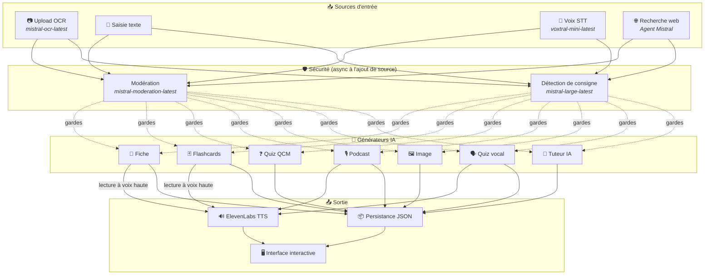
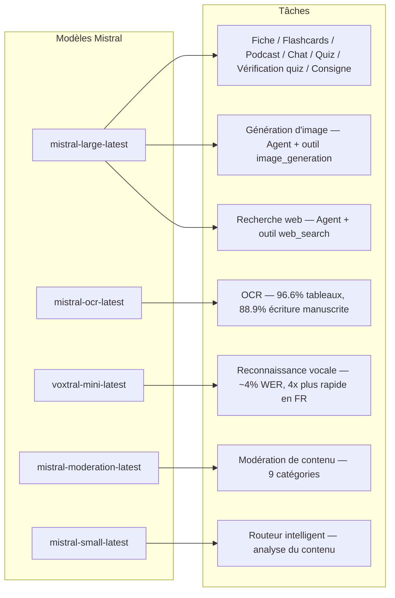
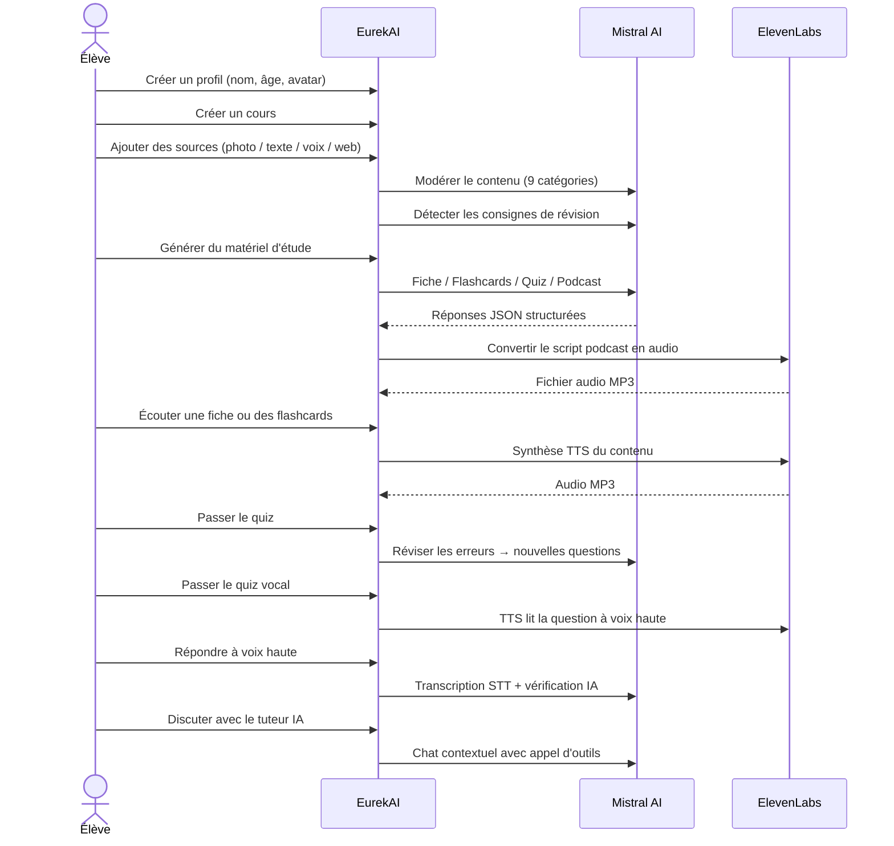

<p align="center">
  
</p>

<h1 align="center">EurekAI</h1>

<p align="center">
  <strong>Verwandle beliebige Inhalte in ein interaktives Lernerlebnis — angetrieben von KI.</strong>
</p>

<p align="center">
  <a href="https://mistral.ai"></a>
  <a href="https://www.typescriptlang.org"></a>
  <a href="https://mistral.ai"></a>
  <a href="https://elevenlabs.io"></a>
</p>

<p align="center">
  <a href="https://www.youtube.com/watch?v=_b1TQz2leoI">▶️ Sieh dir die Demo auf YouTube an</a> · <a href="README-en.md">🇬🇧 Auf Englisch lesen</a>
</p>

---

## Die Geschichte — Warum EurekAI?

**EurekAI** entstand während des [Mistral AI Worldwide Hackathon](https://worldwidehackathon.mistral.ai/) (März 2026). Ich brauchte ein Thema — und die Idee kam aus etwas sehr Konkretem: Ich bereite mich regelmäßig mit meiner Tochter auf Klassenarbeiten vor, und ich dachte, dass es möglich sein müsste, das mit KI spielerischer und interaktiver zu gestalten.

Das Ziel: **beliebige Eingaben** — ein Foto aus dem Lehrbuch, ein kopierter Text, eine Sprachaufnahme, eine Websuche — in **Lernzettel, Flashcards, Quizze, Podcasts, Illustrationen und mehr** verwandeln. Alles angetrieben von den französischen Modellen von Mistral AI, wodurch sich die Lösung natürlich für frankophone Lernende eignet.

Jede einzelne Codezeile wurde während des Hackathons geschrieben. Alle APIs und Open-Source-Bibliotheken werden gemäß den Regeln des Hackathons verwendet.

---

## Funktionen

| | Funktion | Beschreibung |
|---|---|---|
| 📷 | **OCR-Upload** | Fotografieren Sie Ihr Lehrbuch oder Ihre Notizen — Mistral OCR extrahiert den Inhalt |
| 📝 | **Texteingabe** | Tippen oder fügen Sie beliebigen Text direkt ein |
| 🎤 | **Spracheingabe** | Nehmen Sie sich auf — Voxtral STT transkribiert Ihre Stimme |
| 🌐 | **Websuche** | Stellen Sie eine Frage — ein Mistral-Agent sucht die Antworten im Web |
| 📄 | **Lernzettel** | Strukturierte Notizen mit Kernpunkten, Vokabular, Zitaten, Anekdoten |
| 🃏 | **Flashcards** | 5 Q/A-Karten mit Quellenangaben zur aktiven Wiederholung |
| ❓ | **MCQ-Quiz** | 10-20 Multiple-Choice-Fragen mit adaptiver Fehlerwiederholung |
| 🎙️ | **Podcast** | Mini-Podcast mit 2 Stimmen (Alex & Zoé), per ElevenLabs in Audio umgewandelt |
| 🖼️ | **Illustrationen** | Bildungsgrafiken, erzeugt durch einen Mistral-Agenten |
| 🗣️ | **Mündliches Quiz** | Fragen werden laut vorgelesen, Antwort per Sprache, die KI prüft die Antwort |
| 💬 | **KI-Tutor** | Kontextbezogener Chat mit Ihren Kursdokumenten, mit Tool-Aufrufen |
| 🧠 | **Intelligenter Router** | Die KI analysiert Ihre Inhalte und empfiehlt die besten Generatoren |
| 🔒 | **Elterliche Kontrolle** | Altersgerechte Moderation, Eltern-PIN, Chat-Einschränkungen |
| 🌍 | **Mehrsprachig** | Vollständige Oberfläche und KI-Inhalte auf Deutsch und Englisch |
| 🔊 | **Vorlesen** | Hören Sie sich Lernzettel und Flashcards per ElevenLabs TTS vorlesen an |

---

## Architekturübersicht



---

## Modell-Nutzungskarte



---

## Nutzerfluss



---

## Tiefere Einblicke — Funktionen

### Multimodale Eingabe

EurekAI akzeptiert 4 Quellentypen, die alle vor der Verarbeitung moderiert werden:

- **OCR-Upload** — JPG-, PNG- oder PDF-Dateien, verarbeitet von `mistral-ocr-latest`. Unterstützt gedruckten Text, Tabellen (96.6% Genauigkeit) und Handschrift (88.9% Genauigkeit).
- **Freitext** — Beliebigen Inhalt tippen oder einfügen. Wird vor dem Speichern moderiert.
- **Spracheingabe** — Nehmen Sie Audio im Browser auf. Transkribiert von `voxtral-mini-latest` mit ~4% WER. Der Parameter `language="fr"` macht es 4x schneller.
- **Websuche** — Geben Sie eine Suchanfrage ein. Ein temporärer Mistral-Agent mit dem Tool `web_search` ruft die Ergebnisse ab und fasst sie zusammen.

### KI-Inhaltserzeugung

Sechs Arten von generierten Lernmaterialien:

| Generator | Modell | Ausgabe |
|---|---|---|
| **Lernzettel** | `mistral-large-latest` | Titel, Zusammenfassung, 10-25 Kernpunkte, Vokabular, Zitate, Anekdote |
| **Flashcards** | `mistral-large-latest` | 5 Q/A-Karten mit Quellenangaben |
| **MCQ-Quiz** | `mistral-large-latest` | 10-20 Fragen, je 4 Antwortmöglichkeiten, Erklärungen, adaptive Wiederholung |
| **Podcast** | `mistral-large-latest` + ElevenLabs | Skript mit 2 Stimmen (Alex & Zoé) → MP3-Audio |
| **Illustration** | Agent `mistral-large-latest` | Bildungsbild per Tool `image_generation` |
| **Mündliches Quiz** | `mistral-large-latest` + ElevenLabs + Voxtral | TTS-Fragen → STT-Antwort → KI-Prüfung |

### KI-Tutor per Chat

Ein dialogorientierter Tutor mit vollem Zugriff auf Kursdokumente:

- Verwendet `mistral-large-latest` (128K-Token-Kontextfenster)
- **Tool-Aufrufe**: kann während des Gesprächs online Lernzettel, Flashcards oder Quizze erzeugen
- Verlauf von 50 Nachrichten pro Kurs
- Inhaltsmoderation für altersabhängige Profile

### Intelligenter Auto-Router

Der Router verwendet `mistral-small-latest`, um den Inhalt der Quellen zu analysieren und zu empfehlen, welche Generatoren am relevantesten sind — damit Lernende nicht manuell auswählen müssen.

### Adaptives Lernen

- **Quiz-Statistiken**: Verfolgung von Versuchen und Genauigkeit pro Frage
- **Quiz-Wiederholung**: erzeugt 5-10 neue Fragen zu schwachen Konzepten
- **Anweisungs-Erkennung**: erkennt Wiederholungsanweisungen ("Ich kenne meine Lektion, wenn ich ...") und priorisiert sie in allen Generatoren

### Sicherheit & Kindersicherung

- **4 Altersgruppen**: Kind (6-10), Teenager (11-15), Schüler (16+), Erwachsener
- **Inhaltsmoderation**: 9 Kategorien über `mistral-moderation-latest`, altersangepasste Schwellenwerte
- **Eltern-PIN**: SHA-256-Hash, erforderlich für Profile unter 15 Jahren
- **Chat-Einschränkungen**: KI-Chat nur für Profile ab 15 Jahren verfügbar

### Multi-Profil-System

- Mehrere Profile mit Name, Alter, Avatar, Spracheinstellungen
- Projekte an Profile gebunden via `profileId`
- Kaskadenlöschung: Das Löschen eines Profils entfernt alle zugehörigen Projekte

### Internationalisierung

- Vollständige Oberfläche auf Deutsch und Englisch verfügbar
- KI-Prompts unterstützen heute 2 Sprachen (FR, EN) mit Architektur für 15 (es, de, it, pt, nl, ja, zh, ko, ar, hi, pl, ro, sv)
- Sprache pro Profil konfigurierbar

---

## Technischer Stack

| Schicht | Technologie | Rolle |
|---|---|---|
| **Runtime** | Node.js + TypeScript 5.7 | Server und Typsicherheit |
| **Backend** | Express 4.21 | REST-API |
| **Dev-Server** | Vite 7.3 + tsx | HMR, Handlebars-Teilstücke, Proxy |
| **Frontend** | HTML + TailwindCSS 4.2 + Alpine.js 3.15 | Reaktive Oberfläche, von Vite kompiliertes TypeScript |
| **Templating** | vite-plugin-handlebars | HTML-Komposition über Partials |
| **KI** | Mistral AI SDK 1.14 | Chat, OCR, STT, Agents, Moderation |
| **TTS** | ElevenLabs SDK 2.36 | Sprachsynthese für Podcasts und mündliche Quizze |
| **Icons** | Lucide 0.575 | SVG-Icon-Bibliothek |
| **Markdown** | Marked 17 | Markdown-Rendering im Chat |
| **Dateiupload** | Multer 1.4 | Verwaltung multipart-Formulare |
| **Audio** | ffmpeg-static | Audioverarbeitung |
| **Tests** | Vitest 4 | Unit-Tests |
| **Persistenz** | JSON-Dateien | Speicher ohne Abhängigkeiten |

---

## Modellreferenz

| Modell | Verwendung | Warum |
|---|---|---|
| `mistral-large-latest` | Lernzettel, Flashcards, Podcast, MCQ-Quiz, Chat, Quiz-Prüfung, Bild-Agent, Websuche-Agent, Erkennung von Anweisungen | Beste Mehrsprachigkeit + Befolgung von Anweisungen |
| `mistral-ocr-latest` | Dokumenten-OCR | 96.6% Genauigkeit bei Tabellen, 88.9% Handschrift |
| `voxtral-mini-latest` | Spracherkennung | ~4% WER, `language="fr"` liefert 4x+ Geschwindigkeit |
| `mistral-moderation-latest` | Inhaltsmoderation | 9 Kategorien, Kindersicherheit |
| `mistral-small-latest` | Intelligenter Router | Schnelle Inhaltsanalyse für Routing-Entscheidungen |
| `eleven_v3` (ElevenLabs) | Sprachsynthese | Natürliche französische Stimmen für Podcasts und mündliche Quizze |

---

## Schnellstart

```bash
# Cloner le dépôt
git clone https://github.com/your-username/eurekai.git
cd eurekai

# Installer les dépendances
npm install

# Configurer les clés API
cp .env.example .env
# Éditez .env avec vos clés :
#   MISTRAL_API_KEY=votre_clé_ici
#   ELEVENLABS_API_KEY=votre_clé_ici  (optionnel, pour les fonctions audio)

# Lancer le développement
npm run dev
# → Backend :  http://localhost:3000 (API)
# → Frontend : http://localhost:5173 (serveur Vite avec HMR)
```

> **Hinweis**: ElevenLabs ist optional. Ohne diesen Schlüssel generieren die Podcast- und mündlichen Quizfunktionen die Skripte, synthetisieren aber kein Audio.

---

## Projektstruktur

```
server.ts                 — Point d'entrée Express, monte les routes + config
config.ts                 — Config runtime (modèles, voix, TTS), persistée dans output/config.json
store.ts                  — ProjectStore : CRUD projets/sources/générations, persistance JSON
profiles.ts               — ProfileStore : gestion des profils, hachage PIN
types.ts                  — Types TypeScript : Source, Generation (6 types), QuizStats, Profile
prompts.ts                — Tous les prompts IA centralisés (system + user templates, FR/EN)

generators/
  ocr.ts                  — Upload + OCR via Mistral (JPG, PNG, PDF)
  summary.ts              — Génération de fiche de révision (JSON structuré)
  flashcards.ts           — 5 flashcards Q/R
  quiz.ts                 — Quiz QCM (10-20 questions) + révision adaptative
  podcast.ts              — Script podcast 2 voix (Alex + Zoé)
  quiz-vocal.ts           — Quiz vocal : questions TTS + réponses STT + vérification IA
  image.ts                — Génération d'image via Agent Mistral (outil image_generation)
  chat.ts                 — Tuteur IA par chat avec appel d'outils
  router.ts               — Routeur automatique intelligent (contenu → générateurs recommandés)
  consigne.ts             — Détection de consignes de révision
  tts.ts                  — ElevenLabs TTS (eleven_v3, concaténation de segments)
  stt.ts                  — Voxtral STT (audio → texte)
  websearch.ts            — Agent Mistral avec outil web_search
  moderation.ts           — Modération de contenu (9 catégories)

routes/
  projects.ts             — CRUD projets
  sources.ts              — Upload OCR, texte libre, voix STT, recherche web, modération
  generate.ts             — Endpoints de génération (fiche/flashcards/quiz/podcast/image/vocal)
  generations.ts          — Tentatives de quiz, réponses vocales, lecture à voix haute, renommage, suppression
  chat.ts                 — Chat IA avec appel d'outils
  profiles.ts             — CRUD profils avec gestion du PIN

helpers/
  index.ts                — safeParseJson, unwrapJsonArray, extractAllText, timer
  audio.ts                — collectStream (ReadableStream → Buffer)

src/                      — Frontend (Vite + Handlebars)
  index.html              — Point d'entrée HTML principal
  main.ts                 — Entrée frontend (init Alpine.js + icônes Lucide)
  app/                    — Modules applicatifs Alpine.js
    state.ts              — Gestion d'état réactif
    navigation.ts         — Routage des vues + gardes par âge
    profiles.ts           — Logique du sélecteur de profils
    projects.ts           — CRUD des cours
    sources.ts            — Gestionnaires d'upload de sources
    generate.ts           — Déclencheurs de génération
    generations.ts        — Affichage + actions sur les générations
    chat.ts               — Interface de chat
    render.ts             — Helpers de rendu HTML
    i18n.ts               — Changement de langue
    ...
  components/
    quiz.ts               — Composant quiz interactif
    quiz-vocal.ts         — Composant quiz vocal
  i18n/
    fr.ts                 — Traductions françaises
    en.ts                 — Traductions anglaises
    index.ts              — Chargeur i18n
  partials/               — Partials HTML Handlebars (header, sidebar, dialogues, vues)
  styles/
    main.css              — Entrée TailwindCSS
    theme.css             — Variables de thème personnalisées

public/assets/            — Ressources statiques (logo, avatars)
output/                   — Données d'exécution (projets, config, fichiers audio)
```

---

## API-Referenz

### Konfiguration
| Methode | Endpunkt | Beschreibung |
|---|---|---|
| `GET` | `/api/config` | Aktuelle Konfiguration |
| `PUT` | `/api/config` | Konfiguration ändern (Modelle, Stimmen, TTS) |
| `GET` | `/api/config/status` | API-Status (Mistral, ElevenLabs) |

### Profile
| Methode | Endpunkt | Beschreibung |
|---|---|---|
| `GET` | `/api/profiles` | Alle Profile auflisten |
| `POST` | `/api/profiles` | Profil erstellen |
| `PUT` | `/api/profiles/:id` | Profil ändern (PIN erforderlich für < 15 Jahre) |
| `DELETE` | `/api/profiles/:id` | Profil löschen + Projekt-Kaskade |

### Projekte
| Methode | Endpunkt | Beschreibung |
|---|---|---|
| `GET` | `/api/projects` | Projekte auflisten |
| `POST` | `/api/projects` | Projekt `{name, profileId}` erstellen |
| `GET` | `/api/projects/:pid` | Projektdetails |
| `PUT` | `/api/projects/:pid` | `{name}` umbenennen |
| `DELETE` | `/api/projects/:pid` | Projekt löschen |

### Quellen
| Methode | Endpunkt | Beschreibung |
|---|---|---|
| `POST` | `/api/projects/:pid/sources/upload` | OCR-Upload (multipart-Dateien) |
| `POST` | `/api/projects/:pid/sources/text` | Freitext `{text}` |
| `POST` | `/api/projects/:pid/sources/voice` | STT-Stimme (multipart-Audio) |
| `POST` | `/api/projects/:pid/sources/websearch` | Websuche `{query}` |
| `DELETE` | `/api/projects/:pid/sources/:sid` | Eine Quelle löschen |
| `POST` | `/api/projects/:pid/moderate` | `{text}` moderieren |
| `POST` | `/api/projects/:pid/detect-consigne` | Wiederholungsanweisungen erkennen |

### Generierung
| Methode | Endpunkt | Beschreibung |
|---|---|---|
| `POST` | `/api/projects/:pid/generate/summary` | Lernzettel `{sourceIds?}` |
| `POST` | `/api/projects/:pid/generate/flashcards` | Flashcards `{sourceIds?}` |
| `POST` | `/api/projects/:pid/generate/quiz` | MCQ-Quiz `{sourceIds?}` |
| `POST` | `/api/projects/:pid/generate/podcast` | Podcast `{sourceIds?}` |
| `POST` | `/api/projects/:pid/generate/image` | Illustration `{sourceIds?}` |
| `POST` | `/api/projects/:pid/generate/quiz-vocal` | Mündliches Quiz `{sourceIds?}` |
| `POST` | `/api/projects/:pid/generate/quiz-review` | Adaptive Wiederholung `{generationId, weakQuestions}` |
| `POST` | `/api/projects/:pid/generate/auto` | Auto-Generierung durch den Router |

### CRUD für Generierungen
| Methode | Endpunkt | Beschreibung |
|---|---|---|
| `POST` | `/api/projects/:pid/generations/:gid/quiz-attempt` | Antworten einreichen `{answers}` |
| `POST` | `/api/projects/:pid/generations/:gid/vocal-answer` | Eine mündliche Antwort prüfen (multipart-Audio + questionIndex) |
| `POST` | `/api/projects/:pid/generations/:gid/read-aloud` | TTS-Lesevorgang laut vorlesen (Lernzettel/Flashcards) |
| `PUT` | `/api/projects/:pid/generations/:gid` | `{title}` umbenennen |
| `DELETE` | `/api/projects/:pid/generations/:gid` | Generierung löschen |

### Chat
| Methode | Endpunkt | Beschreibung |
|---|---|---|
| `GET` | `/api/projects/:pid/chat` | Chat-Verlauf abrufen |
| `POST` | `/api/projects/:pid/chat` | Eine Nachricht senden `{message}` |
| `DELETE` | `/api/projects/:pid/chat` | Chat-Verlauf löschen |

---

## Architekturelle Entscheidungen

| Entscheidung | Begründung |
|---|---|
| **Alpine.js statt React/Vue** | Minimale Größe, leichte Reaktivität mit von Vite kompiliertem TypeScript. Perfekt für einen Hackathon, bei dem Geschwindigkeit zählt. |
| **Persistenz in JSON-Dateien** | Null Abhängigkeiten, sofortiger Start. Keine Datenbank zu konfigurieren — einfach starten und loslegen. |
| **Vite + Handlebars** | Das Beste aus beiden Welten: schnelles HMR für die Entwicklung, HTML-Partials für die Codeorganisation, Tailwind JIT. |
| **Zentralisierte Prompts** | Alle KI-Prompts in `prompts.ts` — leicht iterierbar, testbar und nach Sprache/Altersgruppe anpassbar. |
| **Multi-Generations-System** | Jede Generierung ist ein eigenständiges Objekt mit eigener ID — ermöglicht mehrere Lernzettel, Quizze usw. pro Kurs. |
| **Altersangepasste Prompts** | 4 Altersgruppen mit unterschiedlichem Wortschatz, Komplexität und Ton — derselbe Inhalt wird je nach Lernendem unterschiedlich vermittelt. |
| **Agentenbasierte Funktionen** | Bilderzeugung und Websuche nutzen temporäre Mistral-Agents — sauberer Lebenszyklus mit automatischer Bereinigung. |

---

## Danksagungen & Credits

- **[Mistral AI](https://mistral.ai)** — KI-Modelle (Large, OCR, Voxtral, Moderation, Small) + Worldwide Hackathon
- **[ElevenLabs](https://elevenlabs.io)** — Engine für Sprachsynthese (`eleven_v3`)
- **[Alpine.js](https://alpinejs.dev)** — Leichtgewichtiges reaktives Framework
- **[TailwindCSS](https://tailwindcss.com)** — Utility-CSS-Framework
- **[Vite](https://vitejs.dev)** — Frontend-Build-Tool
- **[Lucide](https://lucide.dev)** — Icon-Bibliothek
- **[Marked](https://marked.js.org)** — Markdown-Parser

Mit Sorgfalt gebaut während des Mistral AI Worldwide Hackathon, März 2026.

---

## Autor

**Julien LS** — [contact@jls42.org](mailto:contact@jls42.org)

## Lizenz

[AGPL-3.0](LICENSE) — Copyright (C) 2026 Julien LS

**Dieses Dokument wurde von der fr-Version in die Sprache de unter Verwendung des Modells gpt-5.4-mini übersetzt. Weitere Informationen zum Übersetzungsprozess finden Sie unter https://gitlab.com/jls42/ai-powered-markdown-translator**

