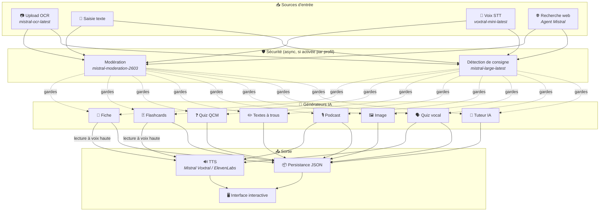
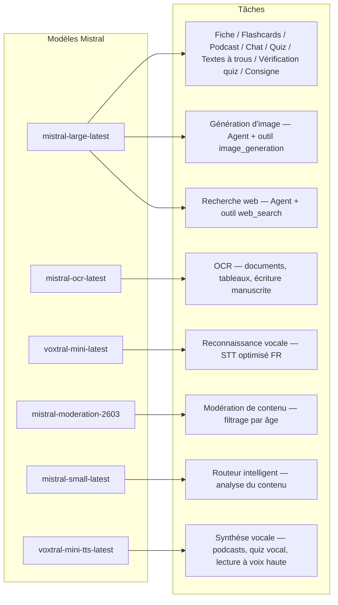
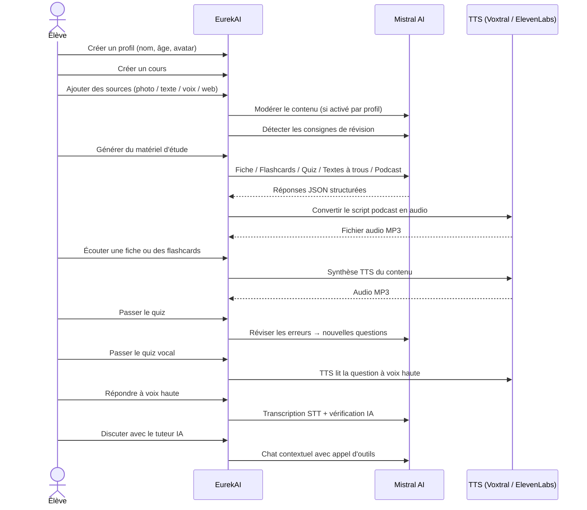

<p align="center">
  
</p>

<h1 align="center">EurekAI</h1>

<p align="center">
  <strong>Transform any content into an interactive learning experience — powered by AI.</strong>
</p>

<p align="center">
  <a href="https://mistral.ai"></a>
  <a href="https://www.typescriptlang.org"></a>
  <a href="https://mistral.ai"></a>
  <a href="https://elevenlabs.io"></a>
</p>

<p align="center">
  <a href="https://www.youtube.com/watch?v=_b1TQz2leoI">▶️ Watch the demo on YouTube</a> · <a href="README-en.md">🇬🇧 Read in English</a>
</p>

<p align="center">
  <a href="https://sonarcloud.io/summary/new_code?id=jls42_EurekAI"></a>
  <a href="https://sonarcloud.io/summary/new_code?id=jls42_EurekAI"></a>
  <a href="https://sonarcloud.io/summary/new_code?id=jls42_EurekAI"></a>
  <a href="https://sonarcloud.io/summary/new_code?id=jls42_EurekAI"></a>
</p>
<p align="center">
  <a href="https://sonarcloud.io/summary/new_code?id=jls42_EurekAI"></a>
  <a href="https://sonarcloud.io/summary/new_code?id=jls42_EurekAI"></a>
  <a href="https://sonarcloud.io/summary/new_code?id=jls42_EurekAI"></a>
  <a href="https://sonarcloud.io/summary/new_code?id=jls42_EurekAI"></a>
</p>

---

## The story — Why EurekAI?

**EurekAI** was born during the [Mistral AI Worldwide Hackathon](https://worldwidehackathon.mistral.ai/) (March 2026). I needed a project — and the idea came from something very concrete: I regularly prepare tests with my daughter, and I thought it should be possible to make that more fun and interactive with AI.

The goal: take **any input** — a photo of a textbook, copied-and-pasted text, a voice recording, a web search — and transform it into **revision notes, flashcards, quizzes, podcasts, fill-in-the-blank texts, illustrations, and more**. All powered by Mistral AI's French models, making it a solution naturally suited to French-speaking students.

Every line of code was written during the hackathon. All APIs and open-source libraries are used in accordance with the hackathon rules.

---

## Features

| | Feature | Description |
|---|---|---|
| 📷 | **Upload OCR** | Take a photo of your textbook or notes — Mistral OCR extracts the content |
| 📝 | **Text input** | Type or paste any text directly |
| 🎤 | **Voice input** | Record yourself — Voxtral STT transcribes your voice |
| 🌐 | **Web search** | Ask a question — a Mistral Agent searches the web for answers |
| 📄 | **Revision notes** | Structured notes with key points, vocabulary, quotes, anecdotes |
| 🃏 | **Flashcards** | 5-50 Q/A cards with source references for active recall |
| ❓ | **Multiple-choice quiz** | 5-50 multiple-choice questions with adaptive review of mistakes |
| ✏️ | **Fill-in-the-blank texts** | Exercises to complete with hints and tolerant validation |
| 🎙️ | **Podcast** | 2-voice mini-podcast converted to audio via Mistral Voxtral TTS |
| 🖼️ | **Illustrations** | Educational images generated by a Mistral Agent |
| 🗣️ | **Spoken quiz** | Questions read aloud, spoken answer, AI verifies the response |
| 💬 | **AI tutor** | Contextual chat with your course documents, with tool calls |
| 🧠 | **Smart router** | AI analyzes your content and recommends the most relevant generators among the 7 available |
| 🔒 | **Parental controls** | Age-based moderation, parental PIN, chat restrictions |
| 🌍 | **Multilingual** | Full interface and AI content in French and English |
| 🔊 | **Read aloud** | Listen to notes and flashcards via Mistral Voxtral TTS or ElevenLabs |

---

## Architecture overview



---

## Model usage map



---

## User flow



---

## Deep dive — Features

### Multi-modal input

EurekAI accepts 4 types of sources, moderated according to the profile (enabled by default for child and teen):

- **Upload OCR** — JPG, PNG or PDF files processed by `mistral-ocr-latest`. Handles printed text, tables and handwriting.
- **Free text** — Type or paste any content. Moderated before storage if moderation is enabled.
- **Voice input** — Record audio in the browser. Transcribed by `voxtral-mini-latest`. The parameter `language="fr"` optimizes recognition.
- **Web search** — Enter a query. A temporary Mistral Agent with the tool `web_search` retrieves and summarizes results.

### AI content generation

Seven types of generated learning material:

| Generator | Model | Output |
|---|---|---|
| **Revision notes** | `mistral-large-latest` | Title, summary, 10-25 key points, vocabulary, quotes, anecdote |
| **Flashcards** | `mistral-large-latest` | 5-50 Q/A cards with source references for active recall |
| **Multiple-choice quiz** | `mistral-large-latest` | 5-50 questions, 4 choices each, explanations, adaptive review |
| **Fill-in-the-blank texts** | `mistral-large-latest` | Sentences to complete with hints, tolerant validation (Levenshtein) |
| **Podcast** | `mistral-large-latest` + Voxtral TTS | 2-voice script → MP3 audio |
| **Illustration** | Agent `mistral-large-latest` | Educational image via the tool `image_generation` |
| **Spoken quiz** | `mistral-large-latest` + Voxtral TTS + STT | TTS questions → STT answer → AI verification |

### AI tutor via chat

A conversational tutor with full access to course documents:

- Uses `mistral-large-latest`
- **Tool calls**: can generate notes, flashcards, quizzes or fill-in-the-blank texts during the conversation
- 50-message history per course
- Content moderation if enabled for the profile

### Automatic smart router

The router uses `mistral-small-latest` to analyze the content of sources and recommend which generators are most relevant among the 7 available — so students don't have to choose manually. The interface shows real-time progress: first an analysis phase, then the individual generations with possible cancellation.

### Adaptive learning

- **Quiz statistics**: tracks attempts and accuracy per question
- **Quiz review**: generates 5-10 new questions targeting weak concepts
- **Instruction detection**: detects revision instructions ("I know my lesson if I know...") and prioritizes them in all generators

### Security & parental controls

- **4 age groups**: child (≤10 years), teen (11-15), student (16-25), adult (26+)
- **Content moderation**: `mistral-moderation-2603` with 5 categories blocked for child/teen (sexual, hate, violence, selfharm, jailbreaking), no restriction for student/adult
- **Parental PIN**: SHA-256 hash, required for profiles under 15
- **Chat restrictions**: AI chat disabled by default for under 16, activatable by parents

### Multi-profile system

- Multiple profiles with name, age, avatar, language preferences
- Projects linked to profiles via `profileId`
- Cascading deletion: deleting a profile removes all its projects

### Multi-provider TTS

- **Mistral Voxtral TTS** (default): `voxtral-mini-tts-latest`, no extra key required
- **ElevenLabs** (alternative): `eleven_v3`, natural voices, requires `ELEVENLABS_API_KEY`
- Provider configurable in the application settings

### Internationalization

- Full interface available in French and English
- AI prompts support 2 languages today (FR, EN) with architecture ready for 15 (es, de, it, pt, nl, ja, zh, ko, ar, hi, pl, ro, sv)
- Language configurable per profile

---

## Tech stack

| Layer | Technology | Role |
|---|---|---|
| **Runtime** | Node.js + TypeScript 5.7 | Server and type safety |
| **Backend** | Express 4.21 | REST API |
| **Dev server** | Vite 7.3 + tsx | HMR, Handlebars partials, proxy |
| **Frontend** | HTML + TailwindCSS 4.2 + Alpine.js 3.15 | Reactive interface, TypeScript compiled by Vite |
| **Templating** | vite-plugin-handlebars | HTML composition with partials |
| **AI** | Mistral AI SDK 2.1 | Chat, OCR, STT, TTS, Agents, Moderation |
| **TTS (default)** | Mistral Voxtral TTS | `voxtral-mini-tts-latest`, built-in speech synthesis |
| **TTS (alternative)** | ElevenLabs SDK 2.36 | `eleven_v3`, natural voices |
| **Icons** | Lucide 0.575 | SVG icon library |
| **Markdown** | Marked 17 | Markdown rendering in chat |
| **File uploads** | Multer 1.4 | Multipart form handling |
| **Audio** | ffmpeg-static | Concatenation of audio segments |
| **Tests** | Vitest 4 | Unit tests — coverage measured by SonarCloud |
| **Persistence** | JSON files | Storage without external dependency |

---

## Model reference

| Model | Usage | Why |
|---|---|---|
| `mistral-large-latest` | Notes, Flashcards, Podcast, Quiz, Fill-in-the-blank, Chat, Spoken quiz verification, Image Agent, Web Search Agent, Instruction detection | Best multilingual + instruction following |
| `mistral-ocr-latest` | Document OCR | Printed text, tables, handwriting |
| `voxtral-mini-latest` | Speech recognition (STT) | Multilingual STT, optimized with `language="fr"` |
| `voxtral-mini-tts-latest` | Speech synthesis (TTS) | Podcasts, spoken quiz, read aloud |
| `mistral-moderation-2603` | Content moderation | 5 categories blocked for child/teen (+ jailbreaking) |
| `mistral-small-latest` | Smart router | Fast content analysis for routing decisions |
| `eleven_v3` (ElevenLabs) | Speech synthesis (alternative TTS) | Natural voices, configurable alternative |

---

## Quick start

```bash
# Cloner le dépôt
git clone https://github.com/jls42/EurekAI.git
cd EurekAI

# Installer les dépendances
npm install

# Configurer les clés API
cp .env.example .env
# Éditez .env avec vos clés :
#   MISTRAL_API_KEY=votre_clé_ici           (requis)
#   ELEVENLABS_API_KEY=votre_clé_ici        (optionnel, TTS alternatif)

# Lancer le développement
npm run dev
# → Backend :  http://localhost:3000 (API)
# → Frontend : http://localhost:5173 (serveur Vite avec HMR)
```

> **Note**: Mistral Voxtral TTS is the default provider — no additional key required beyond `MISTRAL_API_KEY`. ElevenLabs is an alternative TTS provider configurable in settings.

---

## Project structure

```
server.ts                 — Point d'entrée Express, monte les routes + config
config.ts                 — Config runtime (modèles, voix, TTS provider), persistée dans output/config.json
store.ts                  — ProjectStore : CRUD projets/sources/générations, persistance JSON
profiles.ts               — ProfileStore : gestion des profils, hachage PIN
types.ts                  — Types TypeScript : Source, Generation (7 types), QuizStats, Profile
prompts.ts                — Tous les prompts IA centralisés (system + user templates, FR/EN)

generators/
  ocr.ts                  — Upload + OCR via Mistral (JPG, PNG, PDF)
  summary.ts              — Génération de fiche de révision (JSON structuré)
  flashcards.ts           — Flashcards Q/R (5-50, configurable)
  quiz.ts                 — Quiz QCM (5-50 questions, configurable) + révision adaptative
  fill-blank.ts           — Exercices à trous avec validation tolérante
  podcast.ts              — Script podcast 2 voix
  quiz-vocal.ts           — Quiz vocal : questions TTS + réponses STT + vérification IA
  image.ts                — Génération d'image via Agent Mistral (outil image_generation)
  chat.ts                 — Tuteur IA par chat avec appel d'outils
  router.ts               — Routeur automatique intelligent (contenu → générateurs recommandés)
  consigne.ts             — Détection de consignes de révision
  tts-provider.ts         — Dispatch TTS multi-provider (Mistral Voxtral / ElevenLabs)
  tts.ts                  — Génération audio podcast (concaténation de segments)
  stt.ts                  — Voxtral STT (audio → texte)
  websearch.ts            — Agent Mistral avec outil web_search
  moderation.ts           — Modération de contenu (filtrage par âge)

routes/
  projects.ts             — CRUD projets
  profiles.ts             — CRUD profils avec gestion du PIN
  sources.ts              — Upload OCR, texte libre, voix STT, recherche web, modération
  generate.ts             — Endpoints de génération (7 types + auto + route)
  generations.ts          — Tentatives de quiz/fill-blank, réponses vocales, lecture à voix haute
  chat.ts                 — Chat IA avec appel d'outils

helpers/
  index.ts                — safeParseJson, unwrapJsonArray, extractAllText, timer
  audio.ts                — collectStream (ReadableStream → Buffer)
  fill-blank-validate.ts  — Validation tolérante des réponses (normalisation, Levenshtein)

src/                      — Frontend (Vite + Handlebars)
  index.html              — Point d'entrée HTML principal
  main.ts                 — Entrée frontend (init Alpine.js + icônes Lucide)
  app/                    — Modules applicatifs Alpine.js
    state.ts              — Gestion d'état réactif
    navigation.ts         — Routage des vues + gardes par âge
    profiles.ts           — Logique du sélecteur de profils
    projects.ts           — CRUD des cours
    sources.ts            — Gestionnaires d'upload de sources
    generate.ts           — Déclencheurs de génération (individuel, tout, auto 2 phases)
    generations.ts        — Affichage + actions sur les générations
    chat.ts               — Interface de chat
    config.ts             — Interface de configuration (modèles, voix, TTS provider)
    render.ts             — Helpers de rendu HTML
    i18n.ts               — Changement de langue
    ...
  components/
    quiz.ts               — Composant quiz interactif
    quiz-vocal.ts         — Composant quiz vocal
    fill-blank.ts         — Composant textes à trous
    flashcards.ts         — Composant flashcards avec retournement
    step-by-step.ts       — Mixin navigation pas-à-pas (quiz, fill-blank, flashcards)
  i18n/
    fr.ts                 — Traductions françaises
    en.ts                 — Traductions anglaises
    index.ts              — Chargeur i18n
  partials/               — Partials HTML Handlebars (header, sidebar, dialogues, vues)
  styles/
    main.css              — Entrée TailwindCSS
    theme.css             — Variables de thème personnalisées

public/assets/            — Ressources statiques (logo, avatars)
output/                   — Données d'exécution (projets, config, fichiers audio)
```

---

## API reference

### Config
| Method | Endpoint | Description |
|---|---|---|
| `GET` | `/api/config` | Current configuration |
| `PUT` | `/api/config` | Modify the config (models, voices, TTS provider) |
| `GET` | `/api/config/status` | Status of APIs (Mistral, ElevenLabs, TTS) |
| `POST` | `/api/config/reset` | Reset config to defaults |
| `GET` | `/api/config/voices` | List Mistral TTS voices (optional `?lang=fr`) |

### Profiles
| Method | Endpoint | Description |
|---|---|---|
| `GET` | `/api/profiles` | List all profiles |
| `POST` | `/api/profiles` | Create a profile |
| `PUT` | `/api/profiles/:id` | Modify a profile (PIN required for < 15 years) |
| `DELETE` | `/api/profiles/:id` | Delete a profile + cascade projects |

### Projects
| Method | Endpoint | Description |
|---|---|---|
| `GET` | `/api/projects` | List projects |
| `POST` | `/api/projects` | Create a project `{name, profileId}` |
| `GET` | `/api/projects/:pid` | Project details |
| `PUT` | `/api/projects/:pid` | Rename `{name}` |
| `DELETE` | `/api/projects/:pid` | Delete the project |

### Sources
| Method | Endpoint | Description |
|---|---|---|
| `POST` | `/api/projects/:pid/sources/upload` | Upload OCR (multipart files) |
| `POST` | `/api/projects/:pid/sources/text` | Free text `{text}` |
| `POST` | `/api/projects/:pid/sources/voice` | Voice STT (multipart audio) |
| `POST` | `/api/projects/:pid/sources/websearch` | Web search `{query}` |
| `DELETE` | `/api/projects/:pid/sources/:sid` | Delete a source |
| `POST` | `/api/projects/:pid/moderate` | Moderate `{text}` |
| `POST` | `/api/projects/:pid/detect-consigne` | Detect revision instructions |

### Generation
| Method | Endpoint | Description |
|---|---|---|
| `POST` | `/api/projects/:pid/generate/summary` | Revision notes |
| `POST` | `/api/projects/:pid/generate/flashcards` | Flashcards |
| `POST` | `/api/projects/:pid/generate/quiz` | Multiple-choice quiz |
| `POST` | `/api/projects/:pid/generate/fill-blank` | Fill-in-the-blank texts |
| `POST` | `/api/projects/:pid/generate/podcast` | Podcast |
| `POST` | `/api/projects/:pid/generate/image` | Illustration |
| `POST` | `/api/projects/:pid/generate/quiz-vocal` | Spoken quiz |
| `POST` | `/api/projects/:pid/generate/quiz-review` | Adaptive review `{generationId, weakQuestions}` |
| `POST` | `/api/projects/:pid/generate/route` | Routing analysis (plan of generators to run) |
| `POST` | `/api/projects/:pid/generate/auto` | Auto backend generation (routing + 5 types: summary, flashcards, quiz, fill-blank, podcast) |

All generation routes accept `{sourceIds?, lang?, ageGroup?, count?, useConsigne?}`.

### Generation CRUD
| Method | Endpoint | Description |
|---|---|---|
| `POST` | `/api/projects/:pid/generations/:gid/quiz-attempt` | Submit quiz answers `{answers}` |
| `POST` | `/api/projects/:pid/generations/:gid/fill-blank-attempt` | Submit fill-in-the-blank answers `{answers}` |
| `POST` | `/api/projects/:pid/generations/:gid/vocal-answer` | Verify a spoken answer (audio + questionIndex) |
| `POST` | `/api/projects/:pid/generations/:gid/read-aloud` | TTS read aloud (notes/flashcards) |
| `PUT` | `/api/projects/:pid/generations/:gid` | Rename `{title}` |
| `DELETE` | `/api/projects/:pid/generations/:gid` | Delete the generation |

### Chat
| Method | Endpoint | Description |
|---|---|---|
| `GET` | `/api/projects/:pid/chat` | Retrieve chat history |
| `POST` | `/api/projects/:pid/chat` | Send a message `{message, lang, ageGroup}` |
| `DELETE` | `/api/projects/:pid/chat` | Clear chat history |

---

## Architectural decisions

| Decision | Rationale |
|---|---|
| **Alpine.js rather than React/Vue** | Minimal footprint, lightweight reactivity with TypeScript compiled by Vite. Perfect for a hackathon where speed matters. |
| **Persistence in JSON files** | Zero dependencies, instant startup. No database to configure — you start immediately. |
| **Vite + Handlebars** | Best of both worlds: fast HMR for development, HTML partials for code organization, Tailwind JIT. |
| **Centralized prompts** | All AI prompts in `prompts.ts` — easy to iterate, test and adapt by language/age group. |
| **Multi-generation system** | Each generation is an independent object with its own ID — allows multiple worksheets, quizzes, etc. per course. |
| **Age-adapted prompts** | 4 age groups with different vocabulary, complexity and tone — the same content teaches differently depending on the learner. |
| **Agent-based features** | Image generation and web search use temporary Mistral Agents — their own lifecycle with automatic cleanup. |
| **Multi-provider TTS** | Mistral Voxtral TTS by default (no additional key required), ElevenLabs as an alternative — configurable without restarting. |

---

## Credits & acknowledgements

- **[Mistral AI](https://mistral.ai)** — AI models (Large, OCR, Voxtral STT, Voxtral TTS, Moderation, Small) + Worldwide Hackathon
- **[ElevenLabs](https://elevenlabs.io)** — Alternative speech synthesis engine (`eleven_v3`)
- **[Alpine.js](https://alpinejs.dev)** — Lightweight reactive framework
- **[TailwindCSS](https://tailwindcss.com)** — Utility-first CSS framework
- **[Vite](https://vitejs.dev)** — Frontend build tool
- **[Lucide](https://lucide.dev)** — Icon library
- **[Marked](https://marked.js.org)** — Markdown parser

Built with care during the Mistral AI Worldwide Hackathon, March 2026.

---

## Author

**Julien LS** — [contact@jls42.org](mailto:contact@jls42.org)

## License

[AGPL-3.0](LICENSE) — Copyright (C) 2026 Julien LS

**This document was translated from the French version into English using the gpt-5-mini model. For more information on the translation process, see https://gitlab.com/jls42/ai-powered-markdown-translator**

