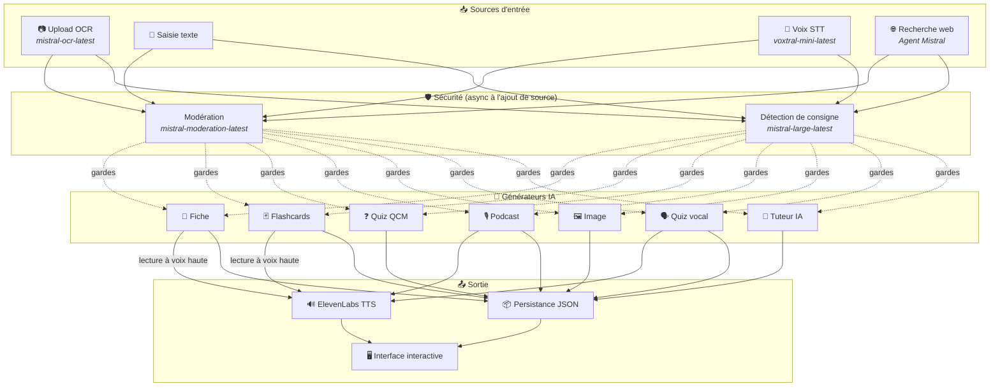
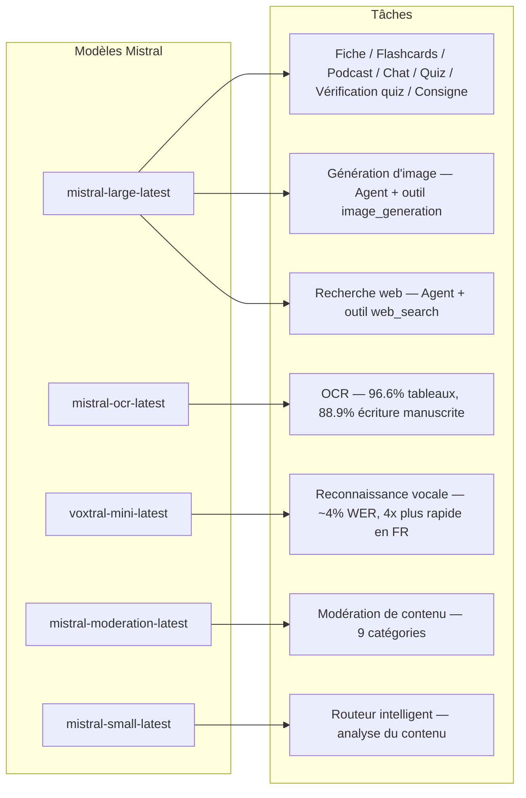
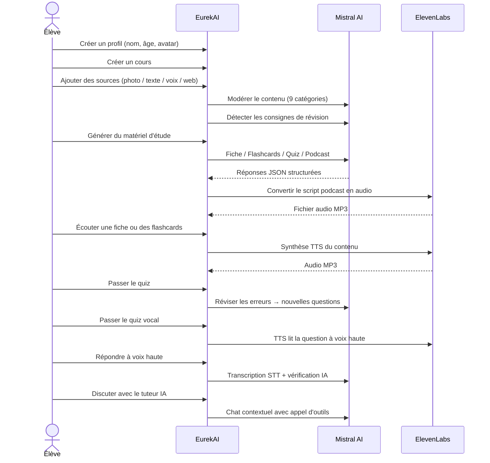

<p align="center">
  
</p>

<h1 align="center">EurekAI</h1>

<p align="center">
  <strong>Convierte cualquier contenido en una experiencia de aprendizaje interactiva — impulsada por IA.</strong>
</p>

<p align="center">
  <a href="https://mistral.ai"></a>
  <a href="https://www.typescriptlang.org"></a>
  <a href="https://mistral.ai"></a>
  <a href="https://elevenlabs.io"></a>
</p>

<p align="center">
  <a href="https://www.youtube.com/watch?v=_b1TQz2leoI">▶️ Ver la demo en YouTube</a> · <a href="README-en.md">🇬🇧 Leer en inglés</a>
</p>

---

## La historia — ¿Por qué EurekAI?

**EurekAI** nació durante el [Mistral AI Worldwide Hackathon](https://worldwidehackathon.mistral.ai/) (marzo de 2026). Necesitaba un tema — y la idea surgió de algo muy concreto: preparo regularmente los exámenes con mi hija, y pensé que debía ser posible hacerlo más lúdico e interactivo gracias a la IA.

El objetivo: tomar **cualquier entrada** — una foto del manual, un texto copiado y pegado, una grabación de voz, una búsqueda web — y transformarla en **fichas de repaso, flashcards, cuestionarios, podcasts, ilustraciones y mucho más**. Todo ello impulsado por los modelos franceses de Mistral AI, lo que lo convierte en una solución naturalmente adaptada a los estudiantes francófonos.

Cada línea de código fue escrita durante el hackathon. Todas las APIs y bibliotecas de código abierto se utilizan de conformidad con las reglas del hackathon.

---

## Funcionalidades

| | Funcionalidad | Descripción |
|---|---|---|
| 📷 | **Carga OCR** | Toma una foto de tu manual o tus apuntes — Mistral OCR extrae el contenido |
| 📝 | **Entrada de texto** | Escribe o pega cualquier texto directamente |
| 🎤 | **Entrada de voz** | Grábate — Voxtral STT transcribe tu voz |
| 🌐 | **Búsqueda web** | Haz una pregunta — un Agente Mistral busca las respuestas en la web |
| 📄 | **Fichas de repaso** | Notas estructuradas con puntos clave, vocabulario, citas, anécdotas |
| 🃏 | **Flashcards** | 5 tarjetas Q/R con referencias a las fuentes para la memorización activa |
| ❓ | **Cuestionario tipo test** | 10-20 preguntas de opción múltiple con repaso adaptativo de los errores |
| 🎙️ | **Podcast** | Mini-podcast de 2 voces (Alex y Zoé) convertido a audio mediante ElevenLabs |
| 🖼️ | **Ilustraciones** | Imágenes educativas generadas por un Agente Mistral |
| 🗣️ | **Cuestionario vocal** | Preguntas leídas en voz alta, respuesta oral, la IA verifica la respuesta |
| 💬 | **Tutor IA** | Chat contextual con tus documentos de clase, con llamada a herramientas |
| 🧠 | **Enrutador inteligente** | La IA analiza tu contenido y recomienda los mejores generadores |
| 🔒 | **Control parental** | Moderación por edad, PIN parental, restricciones del chat |
| 🌍 | **Multilingüe** | Interfaz y contenido IA completos en francés e inglés |
| 🔊 | **Lectura en voz alta** | Escucha las fichas y flashcards leídas en voz alta mediante ElevenLabs TTS |

---

## Vista general de la arquitectura



---

## Mapa de uso de los modelos



---

## Recorrido del usuario



---

## Profundización — Funcionalidades

### Entrada multimodal

EurekAI acepta 4 tipos de fuentes, todas moderadas antes del tratamiento:

- **Carga OCR** — Archivos JPG, PNG o PDF tratados por `mistral-ocr-latest`. Gestiona el texto impreso, las tablas (96.6% de precisión) y la escritura manuscrita (88.9% de precisión).
- **Texto libre** — Escribe o pega cualquier contenido. Pasa por la moderación antes del almacenamiento.
- **Entrada de voz** — Graba audio en el navegador. Transcrito por `voxtral-mini-latest` con ~4% WER. El parámetro `language="fr"` lo hace 4x más rápido.
- **Búsqueda web** — Introduce una consulta. Un Agente Mistral temporal con la herramienta `web_search` recupera y resume los resultados.

### Generación de contenido IA

Seis tipos de material de aprendizaje generado:

| Generador | Modelo | Salida |
|---|---|---|
| **Ficha de repaso** | `mistral-large-latest` | Título, resumen, 10-25 puntos clave, vocabulario, citas, anécdota |
| **Flashcards** | `mistral-large-latest` | 5 tarjetas Q/R con referencias a las fuentes |
| **Cuestionario tipo test** | `mistral-large-latest` | 10-20 preguntas, 4 opciones cada una, explicaciones, repaso adaptativo |
| **Podcast** | `mistral-large-latest` + ElevenLabs | Guion de 2 voces (Alex y Zoé) → audio MP3 |
| **Ilustración** | Agente `mistral-large-latest` | Imagen educativa mediante la herramienta `image_generation` |
| **Cuestionario vocal** | `mistral-large-latest` + ElevenLabs + Voxtral | Preguntas TTS → respuesta STT → verificación IA |

### Tutor IA por chat

Un tutor conversacional con acceso completo a los documentos de clase:

- Utiliza `mistral-large-latest` (ventana de contexto de 128K tokens)
- **Llamada a herramientas**: puede generar fichas, flashcards o cuestionarios en línea durante la conversación
- Historial de 50 mensajes por curso
- Moderación del contenido para los perfiles según la edad

### Enrutador automático inteligente

El enrutador utiliza `mistral-small-latest` para analizar el contenido de las fuentes y recomendar qué generadores son los más pertinentes, para que los estudiantes no tengan que elegir manualmente.

### Aprendizaje adaptativo

- **Estadísticas del cuestionario**: seguimiento de los intentos y de la precisión por pregunta
- **Repaso del cuestionario**: genera 5-10 nuevas preguntas dirigidas a los conceptos débiles
- **Detección de consigna**: detecta las instrucciones de repaso ("Sé mi lección si sé...") y las prioriza en todos los generadores

### Seguridad y control parental

- **4 grupos de edad**: niño (6-10), adolescente (11-15), estudiante (16+), adulto
- **Moderación del contenido**: 9 categorías mediante `mistral-moderation-latest`, umbrales adaptados por grupo de edad
- **PIN parental**: hash SHA-256, requerido para los perfiles de menos de 15 años
- **Restricciones del chat**: el chat IA está disponible solo para los perfiles de 15 años o más

### Sistema de múltiples perfiles

- Múltiples perfiles con nombre, edad, avatar, preferencias de idioma
- Proyectos vinculados a los perfiles mediante `profileId`
- Eliminación en cascada: eliminar un perfil borra todos sus proyectos

### Internacionalización

- Interfaz completa disponible en francés e inglés
- Los prompts IA admiten 2 idiomas hoy (FR, EN) con arquitectura preparada para 15 (es, de, it, pt, nl, ja, zh, ko, ar, hi, pl, ro, sv)
- Idioma configurable por perfil

---

## Stack técnico

| Capa | Tecnología | Rol |
|---|---|---|
| **Runtime** | Node.js + TypeScript 5.7 | Servidor y seguridad de tipos |
| **Backend** | Express 4.21 | API REST |
| **Servidor de desarrollo** | Vite 7.3 + tsx | HMR, parciales de Handlebars, proxy |
| **Frontend** | HTML + TailwindCSS 4.2 + Alpine.js 3.15 | Interfaz reactiva, TypeScript compilado por Vite |
| **Plantillas** | vite-plugin-handlebars | Composición HTML por parciales |
| **IA** | Mistral AI SDK 1.14 | Chat, OCR, STT, Agentes, Moderación |
| **TTS** | ElevenLabs SDK 2.36 | Síntesis de voz para podcasts y cuestionarios vocales |
| **Iconos** | Lucide 0.575 | Biblioteca de iconos SVG |
| **Markdown** | Marked 17 | Renderizado markdown en el chat |
| **Carga de archivos** | Multer 1.4 | Gestión de formularios multipartes |
| **Audio** | ffmpeg-static | Procesamiento de audio |
| **Pruebas** | Vitest 4 | Pruebas unitarias |
| **Persistencia** | Archivos JSON | Almacenamiento sin dependencia |

---

## Referencia de modelos

| Modelo | Uso | Por qué |
|---|---|---|
| `mistral-large-latest` | Ficha, Flashcards, Podcast, Cuestionario tipo test, Chat, Verificación de cuestionario, Agente de imagen, Agente de búsqueda web, Detección de consigna | Mejor multilingüe + seguimiento de instrucciones |
| `mistral-ocr-latest` | OCR de documentos | 96.6% precisión en tablas, 88.9% escritura manuscrita |
| `voxtral-mini-latest` | Reconocimiento de voz | ~4% WER, `language="fr"` proporciona 4x+ de velocidad |
| `mistral-moderation-latest` | Moderación de contenido | 9 categorías, seguridad infantil |
| `mistral-small-latest` | Enrutador inteligente | Análisis rápido del contenido para decisiones de enrutamiento |
| `eleven_v3` (ElevenLabs) | Síntesis de voz | Voces naturales en francés para podcasts y cuestionarios vocales |

---

## Inicio rápido

```bash
# Cloner le dépôt
git clone https://github.com/your-username/eurekai.git
cd eurekai

# Installer les dépendances
npm install

# Configurer les clés API
cp .env.example .env
# Éditez .env avec vos clés :
#   MISTRAL_API_KEY=votre_clé_ici
#   ELEVENLABS_API_KEY=votre_clé_ici  (optionnel, pour les fonctions audio)

# Lancer le développement
npm run dev
# → Backend :  http://localhost:3000 (API)
# → Frontend : http://localhost:5173 (serveur Vite avec HMR)
```

> **Nota**: ElevenLabs es opcional. Sin esta clave, las funciones de podcast y cuestionario vocal generarán los guiones pero no sintetizarán el audio.

---

## Estructura del proyecto

```
server.ts                 — Point d'entrée Express, monte les routes + config
config.ts                 — Config runtime (modèles, voix, TTS), persistée dans output/config.json
store.ts                  — ProjectStore : CRUD projets/sources/générations, persistance JSON
profiles.ts               — ProfileStore : gestion des profils, hachage PIN
types.ts                  — Types TypeScript : Source, Generation (6 types), QuizStats, Profile
prompts.ts                — Tous les prompts IA centralisés (system + user templates, FR/EN)

generators/
  ocr.ts                  — Upload + OCR via Mistral (JPG, PNG, PDF)
  summary.ts              — Génération de fiche de révision (JSON structuré)
  flashcards.ts           — 5 flashcards Q/R
  quiz.ts                 — Quiz QCM (10-20 questions) + révision adaptative
  podcast.ts              — Script podcast 2 voix (Alex + Zoé)
  quiz-vocal.ts           — Quiz vocal : questions TTS + réponses STT + vérification IA
  image.ts                — Génération d'image via Agent Mistral (outil image_generation)
  chat.ts                 — Tuteur IA par chat avec appel d'outils
  router.ts               — Routeur automatique intelligent (contenu → générateurs recommandés)
  consigne.ts             — Détection de consignes de révision
  tts.ts                  — ElevenLabs TTS (eleven_v3, concaténation de segments)
  stt.ts                  — Voxtral STT (audio → texte)
  websearch.ts            — Agent Mistral avec outil web_search
  moderation.ts           — Modération de contenu (9 catégories)

routes/
  projects.ts             — CRUD projets
  sources.ts              — Upload OCR, texte libre, voix STT, recherche web, modération
  generate.ts             — Endpoints de génération (fiche/flashcards/quiz/podcast/image/vocal)
  generations.ts          — Tentatives de quiz, réponses vocales, lecture à voix haute, renommage, suppression
  chat.ts                 — Chat IA avec appel d'outils
  profiles.ts             — CRUD profils avec gestion du PIN

helpers/
  index.ts                — safeParseJson, unwrapJsonArray, extractAllText, timer
  audio.ts                — collectStream (ReadableStream → Buffer)

src/                      — Frontend (Vite + Handlebars)
  index.html              — Point d'entrée HTML principal
  main.ts                 — Entrée frontend (init Alpine.js + icônes Lucide)
  app/                    — Modules applicatifs Alpine.js
    state.ts              — Gestion d'état réactif
    navigation.ts         — Routage des vues + gardes par âge
    profiles.ts           — Logique du sélecteur de profils
    projects.ts           — CRUD des cours
    sources.ts            — Gestionnaires d'upload de sources
    generate.ts           — Déclencheurs de génération
    generations.ts        — Affichage + actions sur les générations
    chat.ts               — Interface de chat
    render.ts             — Helpers de rendu HTML
    i18n.ts               — Changement de langue
    ...
  components/
    quiz.ts               — Composant quiz interactif
    quiz-vocal.ts         — Composant quiz vocal
  i18n/
    fr.ts                 — Traductions françaises
    en.ts                 — Traductions anglaises
    index.ts              — Chargeur i18n
  partials/               — Partials HTML Handlebars (header, sidebar, dialogues, vues)
  styles/
    main.css              — Entrée TailwindCSS
    theme.css             — Variables de thème personnalisées

public/assets/            — Ressources statiques (logo, avatars)
output/                   — Données d'exécution (projets, config, fichiers audio)
```

---

## Referencia API

### Config
| Método | Endpoint | Descripción |
|---|---|---|
| `GET` | `/api/config` | Configuración actual |
| `PUT` | `/api/config` | Modificar la configuración (modelos, voces, TTS) |
| `GET` | `/api/config/status` | Estado de las APIs (Mistral, ElevenLabs) |

### Perfiles
| Método | Endpoint | Descripción |
|---|---|---|
| `GET` | `/api/profiles` | Listar todos los perfiles |
| `POST` | `/api/profiles` | Crear un perfil |
| `PUT` | `/api/profiles/:id` | Modificar un perfil (PIN requerido para < 15 años) |
| `DELETE` | `/api/profiles/:id` | Eliminar un perfil + cascada de proyectos |

### Proyectos
| Método | Endpoint | Descripción |
|---|---|---|
| `GET` | `/api/projects` | Listar los proyectos |
| `POST` | `/api/projects` | Crear un proyecto `{name, profileId}` |
| `GET` | `/api/projects/:pid` | Detalles del proyecto |
| `PUT` | `/api/projects/:pid` | Renombrar `{name}` |
| `DELETE` | `/api/projects/:pid` | Eliminar el proyecto |

### Fuentes
| Método | Endpoint | Descripción |
|---|---|---|
| `POST` | `/api/projects/:pid/sources/upload` | Carga OCR (archivos multipartes) |
| `POST` | `/api/projects/:pid/sources/text` | Texto libre `{text}` |
| `POST` | `/api/projects/:pid/sources/voice` | Voz STT (audio multipart) |
| `POST` | `/api/projects/:pid/sources/websearch` | Búsqueda web `{query}` |
| `DELETE` | `/api/projects/:pid/sources/:sid` | Eliminar una fuente |
| `POST` | `/api/projects/:pid/moderate` | Moderar `{text}` |
| `POST` | `/api/projects/:pid/detect-consigne` | Detectar las consignas de repaso |

### Generación
| Método | Endpoint | Descripción |
|---|---|---|
| `POST` | `/api/projects/:pid/generate/summary` | Ficha de repaso `{sourceIds?}` |
| `POST` | `/api/projects/:pid/generate/flashcards` | Flashcards `{sourceIds?}` |
| `POST` | `/api/projects/:pid/generate/quiz` | Cuestionario tipo test `{sourceIds?}` |
| `POST` | `/api/projects/:pid/generate/podcast` | Podcast `{sourceIds?}` |
| `POST` | `/api/projects/:pid/generate/image` | Ilustración `{sourceIds?}` |
| `POST` | `/api/projects/:pid/generate/quiz-vocal` | Cuestionario vocal `{sourceIds?}` |
| `POST` | `/api/projects/:pid/generate/quiz-review` | Repaso adaptativo `{generationId, weakQuestions}` |
| `POST` | `/api/projects/:pid/generate/auto` | Generación automática por el enrutador |

### CRUD de generaciones
| Método | Endpoint | Descripción |
|---|---|---|
| `POST` | `/api/projects/:pid/generations/:gid/quiz-attempt` | Enviar las respuestas `{answers}` |
| `POST` | `/api/projects/:pid/generations/:gid/vocal-answer` | Verificar una respuesta oral (audio multipart + questionIndex) |
| `POST` | `/api/projects/:pid/generations/:gid/read-aloud` | Lectura TTS en voz alta (fichas/flashcards) |
| `PUT` | `/api/projects/:pid/generations/:gid` | Renombrar `{title}` |
| `DELETE` | `/api/projects/:pid/generations/:gid` | Eliminar la generación |

### Chat
| Método | Endpoint | Descripción |
|---|---|---|
| `GET` | `/api/projects/:pid/chat` | Recuperar el historial del chat |
| `POST` | `/api/projects/:pid/chat` | Enviar un mensaje `{message}` |
| `DELETE` | `/api/projects/:pid/chat` | Borrar el historial del chat |

---

## Decisiones arquitectónicas

| Decisión | Justificación |
|---|---|
| **Alpine.js en lugar de React/Vue** | Huella mínima, reactividad ligera con TypeScript compilado por Vite. Perfecto para un hackathon donde la velocidad cuenta. |
| **Persistencia en archivos JSON** | Cero dependencias, arranque instantáneo. No hace falta configurar ninguna base de datos: se inicia y listo. |
| **Vite + Handlebars** | Lo mejor de ambos mundos: HMR rápido para el desarrollo, parciales HTML para la organización del código, Tailwind JIT. |
| **Prompts centralizados** | Todos los prompts IA en `prompts.ts` — fácil iterar, probar y adaptar por idioma/grupo de edad. |
| **Sistema multi-generaciones** | Cada generación es un objeto independiente con su propio ID — permite varias fichas, cuestionarios, etc. por curso. |
| **Prompts adaptados por edad** | 4 grupos de edad con vocabulario, complejidad y tono distintos — el mismo contenido enseña de forma diferente según el aprendiz. |
| **Funcionalidades basadas en agentes** | La generación de imágenes y la búsqueda web usan Agentes Mistral temporales — ciclo de vida limpio con limpieza automática. |

---

## Créditos y agradecimientos

- **[Mistral AI](https://mistral.ai)** — Modelos IA (Large, OCR, Voxtral, Moderation, Small) + Worldwide Hackathon
- **[ElevenLabs](https://elevenlabs.io)** — Motor de síntesis de voz (`eleven_v3`)
- **[Alpine.js](https://alpinejs.dev)** — Framework reactivo ligero
- **[TailwindCSS](https://tailwindcss.com)** — Framework CSS utilitario
- **[Vite](https://vitejs.dev)** — Herramienta de build frontend
- **[Lucide](https://lucide.dev)** — Biblioteca de iconos
- **[Marked](https://marked.js.org)** — Analizador Markdown

Construido con cuidado durante el Mistral AI Worldwide Hackathon, marzo de 2026.

---

## Autor

**Julien LS** — [contact@jls42.org](mailto:contact@jls42.org)

## Licencia

[AGPL-3.0](LICENSE) — Copyright (C) 2026 Julien LS

**Este documento ha sido traducido de la versión fr al idioma es utilizando el modelo gpt-5.4-mini. Para más información sobre el proceso de traducción, consulte https://gitlab.com/jls42/ai-powered-markdown-translator**

