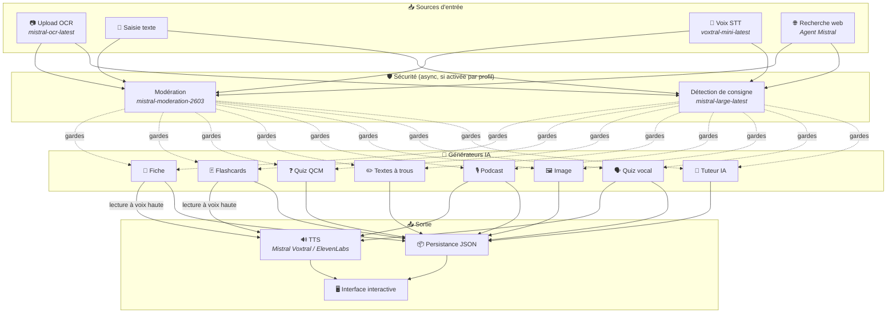
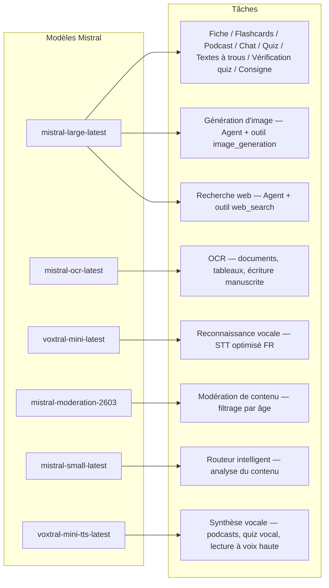
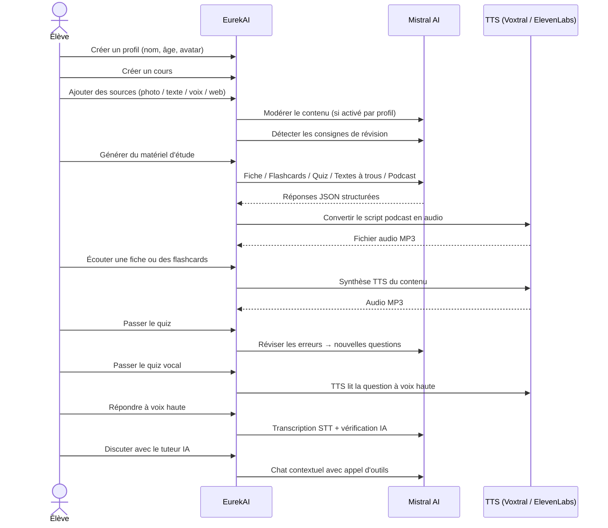

<p align="center">
  
</p>

<h1 align="center">EurekAI</h1>

<p align="center">
  <strong>Transforma cualquier contenido en una experiencia de aprendizaje interactiva — impulsada por la IA.</strong>
</p>

<p align="center">
  <a href="https://mistral.ai"></a>
  <a href="https://www.typescriptlang.org"></a>
  <a href="https://mistral.ai"></a>
  <a href="https://elevenlabs.io"></a>
</p>

<p align="center">
  <a href="https://www.youtube.com/watch?v=_b1TQz2leoI">▶️ Ver la demo en YouTube</a> · <a href="README-en.md">🇬🇧 Leer en inglés</a>
</p>

<p align="center">
  <a href="https://sonarcloud.io/summary/new_code?id=jls42_EurekAI"></a>
  <a href="https://sonarcloud.io/summary/new_code?id=jls42_EurekAI"></a>
  <a href="https://sonarcloud.io/summary/new_code?id=jls42_EurekAI"></a>
  <a href="https://sonarcloud.io/summary/new_code?id=jls42_EurekAI"></a>
</p>
<p align="center">
  <a href="https://sonarcloud.io/summary/new_code?id=jls42_EurekAI"></a>
  <a href="https://sonarcloud.io/summary/new_code?id=jls42_EurekAI"></a>
  <a href="https://sonarcloud.io/summary/new_code?id=jls42_EurekAI"></a>
  <a href="https://sonarcloud.io/summary/new_code?id=jls42_EurekAI"></a>
</p>

---

## La historia — ¿Por qué EurekAI?

**EurekAI** nació durante el [Mistral AI Worldwide Hackathon](https://luma.com/mistralhack-online) ([sitio oficial](https://worldwide-hackathon.mistral.ai/)) (marzo de 2026). Necesitaba un tema — y la idea vino de algo muy concreto: preparo regularmente los controles con mi hija, y pensé que debía ser posible hacer eso más lúdico e interactivo gracias a la IA.

El objetivo: tomar **cualquier entrada** — una foto del manual, un texto copiado, una grabación de voz, una búsqueda web — y transformarla en **fichas de repaso, flashcards, cuestionarios, podcasts, textos con huecos, ilustraciones y mucho más**. Todo ello impulsado por los modelos franceses de Mistral AI, lo que lo convierte en una solución naturalmente adaptada a estudiantes francófonos.

Cada línea de código fue escrita durante el hackathon. Todas las APIs y bibliotecas de código abierto se usan conforme a las reglas del hackathon.

---

## Características

| | Funcionalidad | Descripción |
|---|---|---|
| 📷 | **Subida OCR** | Toma una foto de tu manual o tus apuntes — Mistral OCR extrae el contenido |
| 📝 | **Entrada de texto** | Escribe o pega cualquier texto directamente |
| 🎤 | **Entrada de voz** | Grábate — Voxtral STT transcribe tu voz |
| 🌐 | **Búsqueda web** | Haz una pregunta — un Agente Mistral busca las respuestas en la web |
| 📄 | **Fichas de repaso** | Notas estructuradas con puntos clave, vocabulario, citas, anécdotas |
| 🃏 | **Flashcards** | 5-50 tarjetas P/R con referencias a las fuentes para la memorización activa |
| ❓ | **Quiz QCM** | 5-50 preguntas de opción múltiple con revisión adaptativa de errores |
| ✏️ | **Textos con huecos** | Ejercicios para completar con pistas y validación tolerante |
| 🎙️ | **Podcast** | Mini-podcast de 2 voces convertido a audio vía Mistral Voxtral TTS |
| 🖼️ | **Ilustraciones** | Imágenes educativas generadas por un Agente Mistral |
| 🗣️ | **Quiz vocal** | Preguntas leídas en voz alta, respuesta oral, la IA verifica la respuesta |
| 💬 | **Tutor IA** | Chat contextual con tus documentos de clase, con llamadas a herramientas |
| 🧠 | **Enrutador inteligente** | La IA analiza tu contenido y recomienda los generadores más pertinentes entre los 7 disponibles |
| 🔒 | **Control parental** | Moderación por edad, PIN parental, restricciones del chat |
| 🌍 | **Multilingüe** | Interfaz y contenido IA completos en francés e inglés |
| 🔊 | **Lectura en voz alta** | Escucha las fichas y flashcards vía Mistral Voxtral TTS o ElevenLabs |

---

## Visión general de la arquitectura



---

## Mapa de uso de los modelos



---

## Recorrido del usuario



---

## Análisis detallado — Funcionalidades

### Entrada multimodal

EurekAI acepta 4 tipos de fuentes, moderadas según el perfil (activado por defecto para niño y adolescente):

- **Subida OCR** — Archivos JPG, PNG o PDF procesados por `mistral-ocr-latest`. Maneja texto impreso, tablas y escritura a mano.
- **Texto libre** — Escribe o pega cualquier contenido. Moderado antes de almacenarse si la moderación está activa.
- **Entrada de voz** — Graba audio en el navegador. Transcrito por `voxtral-mini-latest`. El parámetro `language="fr"` optimiza el reconocimiento.
- **Búsqueda web** — Introduce una consulta. Un Agente Mistral temporal con la herramienta `web_search` recupera y resume los resultados.

### Generación de contenido IA

Siete tipos de material de aprendizaje generado:

| Generador | Modelo | Salida |
|---|---|---|
| **Ficha de repaso** | `mistral-large-latest` | Título, resumen, 10-25 puntos clave, vocabulario, citas, anécdota |
| **Flashcards** | `mistral-large-latest` | 5-50 tarjetas P/R con referencias a las fuentes para la memorización activa |
| **Quiz QCM** | `mistral-large-latest` | 5-50 preguntas, 4 opciones cada una, explicaciones, revisión adaptativa |
| **Textos con huecos** | `mistral-large-latest` | Frases para completar con pistas, validación tolerante (Levenshtein) |
| **Podcast** | `mistral-large-latest` + Voxtral TTS | Guion 2 voces → audio MP3 |
| **Ilustración** | Agente `mistral-large-latest` | Imagen educativa vía la herramienta `image_generation` |
| **Quiz vocal** | `mistral-large-latest` + Voxtral TTS + STT | Preguntas TTS → respuesta STT → verificación IA |

### Tutor IA por chat

Un tutor conversacional con acceso completo a los documentos de clase:

- Utiliza `mistral-large-latest`
- **Llamada a herramientas**: puede generar fichas, flashcards, quizzes o textos con huecos durante la conversación
- Historial de 50 mensajes por curso
- Moderación del contenido si está activada para el perfil

### Enrutador automático inteligente

El enrutador usa `mistral-small-latest` para analizar el contenido de las fuentes y recomendar qué generadores son los más pertinentes entre los 7 disponibles — para que los alumnos no tengan que elegir manualmente. La interfaz muestra el progreso en tiempo real: primero una fase de análisis, luego las generaciones individuales con posibilidad de cancelar.

### Aprendizaje adaptativo

- **Estadísticas de quiz**: seguimiento de los intentos y de la precisión por pregunta
- **Revisión de quiz**: genera 5-10 nuevas preguntas dirigidas a los conceptos débiles
- **Detección de instrucciones**: detecta las indicaciones de repaso ("Sé mi lección si sé...") y las prioriza en todos los generadores

### Seguridad y control parental

- **4 grupos de edad**: niño (≤10 años), adolescente (11-15), estudiante (16-25), adulto (26+)
- **Moderación del contenido**: `mistral-moderation-2603` con 5 categorías bloqueadas para niño/ado (sexual, hate, violence, selfharm, jailbreaking), sin restricciones para estudiante/adulto
- **PIN parental**: hash SHA-256, requerido para los perfiles menores de 15 años
- **Restricciones del chat**: chat IA desactivado por defecto para menores de 16 años, activable por los padres

### Sistema multi-perfiles

- Perfiles múltiples con nombre, edad, avatar, preferencias de idioma
- Proyectos vinculados a los perfiles vía `profileId`
- Eliminación en cascada: eliminar un perfil borra todos sus proyectos

### TTS multi-proveedor

- **Mistral Voxtral TTS** (predeterminado): `voxtral-mini-tts-latest`, no requiere clave adicional
- **ElevenLabs** (alternativo): `eleven_v3`, voces naturales, requiere `ELEVENLABS_API_KEY`
- Proveedor configurable en los ajustes de la aplicación

### Internacionalización

- Interfaz completa disponible en francés e inglés
- Los prompts de IA soportan hoy 2 idiomas (FR, EN) con arquitectura lista para 15 (es, de, it, pt, nl, ja, zh, ko, ar, hi, pl, ro, sv)
- Idioma configurable por perfil

---

## Stack técnico

| Capa | Tecnología | Rol |
|---|---|---|
| **Tiempo de ejecución** | Node.js + TypeScript 5.7 | Servidor y seguridad de tipos |
| **Backend** | Express 4.21 | API REST |
| **Servidor de dev** | Vite 7.3 + tsx | HMR, partials Handlebars, proxy |
| **Frontend** | HTML + TailwindCSS 4.2 + Alpine.js 3.15 | Interfaz reactiva, TypeScript compilado por Vite |
| **Templating** | vite-plugin-handlebars | Composición HTML por partials |
| **IA** | Mistral AI SDK 2.1 | Chat, OCR, STT, TTS, Agentes, Moderación |
| **TTS (predeterminado)** | Mistral Voxtral TTS | `voxtral-mini-tts-latest`, síntesis vocal integrada |
| **TTS (alternativo)** | ElevenLabs SDK 2.36 | `eleven_v3`, voces naturales |
| **Iconos** | Lucide 0.575 | Biblioteca de íconos SVG |
| **Markdown** | Marked 17 | Renderizado markdown en el chat |
| **Subida de archivos** | Multer 1.4 | Gestión de formularios multipart |
| **Audio** | ffmpeg-static | Concatenación de segmentos de audio |
| **Tests** | Vitest 4 | Tests unitarios — cobertura medida por SonarCloud |
| **Persistencia** | Archivos JSON | Almacenamiento sin dependencias |

---

## Referencia de modelos

| Modelo | Uso | Por qué |
|---|---|---|
| `mistral-large-latest` | Ficha, Flashcards, Podcast, Quiz, Textos con huecos, Chat, Verificación quiz vocal, Agente Imagen, Agente Búsqueda Web, Detección de instrucciones | Mejor multilingüe + seguimiento de instrucciones |
| `mistral-ocr-latest` | OCR de documentos | Texto impreso, tablas, escritura a mano |
| `voxtral-mini-latest` | Reconocimiento de voz (STT) | STT multilingüe, optimizado con `language="fr"` |
| `voxtral-mini-tts-latest` | Síntesis vocal (TTS) | Podcasts, quiz vocal, lectura en voz alta |
| `mistral-moderation-2603` | Moderación de contenido | 5 categorías bloqueadas para niño/ado (+ jailbreaking) |
| `mistral-small-latest` | Enrutador inteligente | Análisis rápido del contenido para decisiones de enrutamiento |
| `eleven_v3` (ElevenLabs) | Síntesis vocal (TTS alternativo) | Voces naturales, alternativa configurable |

---

## Inicio rápido

```bash
# Cloner le dépôt
git clone https://github.com/jls42/EurekAI.git
cd EurekAI

# Installer les dépendances
npm install

# Configurer les clés API
cp .env.example .env
# Éditez .env avec vos clés :
#   MISTRAL_API_KEY=votre_clé_ici           (requis)
#   ELEVENLABS_API_KEY=votre_clé_ici        (optionnel, TTS alternatif)

# Lancer le développement
npm run dev
# → Backend :  http://localhost:3000 (API)
# → Frontend : http://localhost:5173 (serveur Vite avec HMR)
```

> **Nota** : Mistral Voxtral TTS es el proveedor predeterminado — no se necesita clave adicional más allá de `MISTRAL_API_KEY`. ElevenLabs es un proveedor TTS alternativo configurable en los ajustes.

---

## Estructura del proyecto

```
server.ts                 — Point d'entrée Express, monte les routes + config
config.ts                 — Config runtime (modèles, voix, TTS provider), persistée dans output/config.json
store.ts                  — ProjectStore : CRUD projets/sources/générations, persistance JSON
profiles.ts               — ProfileStore : gestion des profils, hachage PIN
types.ts                  — Types TypeScript : Source, Generation (7 types), QuizStats, Profile
prompts.ts                — Tous les prompts IA centralisés (system + user templates, FR/EN)

generators/
  ocr.ts                  — Upload + OCR via Mistral (JPG, PNG, PDF)
  summary.ts              — Génération de fiche de révision (JSON structuré)
  flashcards.ts           — Flashcards Q/R (5-50, configurable)
  quiz.ts                 — Quiz QCM (5-50 questions, configurable) + révision adaptative
  fill-blank.ts           — Exercices à trous avec validation tolérante
  podcast.ts              — Script podcast 2 voix
  quiz-vocal.ts           — Quiz vocal : questions TTS + réponses STT + vérification IA
  image.ts                — Génération d'image via Agent Mistral (outil image_generation)
  chat.ts                 — Tuteur IA par chat avec appel d'outils
  router.ts               — Routeur automatique intelligent (contenu → générateurs recommandés)
  consigne.ts             — Détection de consignes de révision
  tts-provider.ts         — Dispatch TTS multi-provider (Mistral Voxtral / ElevenLabs)
  tts.ts                  — Génération audio podcast (concaténation de segments)
  stt.ts                  — Voxtral STT (audio → texte)
  websearch.ts            — Agent Mistral avec outil web_search
  moderation.ts           — Modération de contenu (filtrage par âge)

routes/
  projects.ts             — CRUD projets
  profiles.ts             — CRUD profils avec gestion du PIN
  sources.ts              — Upload OCR, texte libre, voix STT, recherche web, modération
  generate.ts             — Endpoints de génération (7 types + auto + route)
  generations.ts          — Tentatives de quiz/fill-blank, réponses vocales, lecture à voix haute
  chat.ts                 — Chat IA avec appel d'outils

helpers/
  index.ts                — safeParseJson, unwrapJsonArray, extractAllText, timer
  audio.ts                — collectStream (ReadableStream → Buffer)
  fill-blank-validate.ts  — Validation tolérante des réponses (normalisation, Levenshtein)

src/                      — Frontend (Vite + Handlebars)
  index.html              — Point d'entrée HTML principal
  main.ts                 — Entrée frontend (init Alpine.js + icônes Lucide)
  app/                    — Modules applicatifs Alpine.js
    state.ts              — Gestion d'état réactif
    navigation.ts         — Routage des vues + gardes par âge
    profiles.ts           — Logique du sélecteur de profils
    projects.ts           — CRUD des cours
    sources.ts            — Gestionnaires d'upload de sources
    generate.ts           — Déclencheurs de génération (individuel, tout, auto 2 phases)
    generations.ts        — Affichage + actions sur les générations
    chat.ts               — Interface de chat
    config.ts             — Interface de configuration (modèles, voix, TTS provider)
    render.ts             — Helpers de rendu HTML
    i18n.ts               — Changement de langue
    ...
  components/
    quiz.ts               — Composant quiz interactif
    quiz-vocal.ts         — Composant quiz vocal
    fill-blank.ts         — Composant textes à trous
    flashcards.ts         — Composant flashcards avec retournement
    step-by-step.ts       — Mixin navigation pas-à-pas (quiz, fill-blank, flashcards)
  i18n/
    fr.ts                 — Traductions françaises
    en.ts                 — Traductions anglaises
    index.ts              — Chargeur i18n
  partials/               — Partials HTML Handlebars (header, sidebar, dialogues, vues)
  styles/
    main.css              — Entrée TailwindCSS
    theme.css             — Variables de thème personnalisées

public/assets/            — Ressources statiques (logo, avatars)
output/                   — Données d'exécution (projets, config, fichiers audio)
```

---

## Referencia de la API

### Config
| Método | Endpoint | Descripción |
|---|---|---|
| `GET` | `/api/config` | Configuración actual |
| `PUT` | `/api/config` | Modificar la config (modelos, voces, proveedor TTS) |
| `GET` | `/api/config/status` | Estado de las APIs (Mistral, ElevenLabs, TTS) |
| `POST` | `/api/config/reset` | Restablecer la configuración por defecto |
| `GET` | `/api/config/voices` | Listar las voces Mistral TTS (opcional `?lang=fr`) |

### Perfiles
| Método | Endpoint | Descripción |
|---|---|---|
| `GET` | `/api/profiles` | Listar todos los perfiles |
| `POST` | `/api/profiles` | Crear un perfil |
| `PUT` | `/api/profiles/:id` | Modificar un perfil (PIN requerido para < 15 años) |
| `DELETE` | `/api/profiles/:id` | Eliminar un perfil + cascada de proyectos |

### Proyectos
| Método | Endpoint | Descripción |
|---|---|---|
| `GET` | `/api/projects` | Listar los proyectos |
| `POST` | `/api/projects` | Crear un proyecto `{name, profileId}` |
| `GET` | `/api/projects/:pid` | Detalles del proyecto |
| `PUT` | `/api/projects/:pid` | Renombrar `{name}` |
| `DELETE` | `/api/projects/:pid` | Eliminar el proyecto |

### Fuentes
| Método | Endpoint | Descripción |
|---|---|---|
| `POST` | `/api/projects/:pid/sources/upload` | Subida OCR (archivos multipart) |
| `POST` | `/api/projects/:pid/sources/text` | Texto libre `{text}` |
| `POST` | `/api/projects/:pid/sources/voice` | Voz STT (audio multipart) |
| `POST` | `/api/projects/:pid/sources/websearch` | Búsqueda web `{query}` |
| `DELETE` | `/api/projects/:pid/sources/:sid` | Eliminar una fuente |
| `POST` | `/api/projects/:pid/moderate` | Moderar `{text}` |
| `POST` | `/api/projects/:pid/detect-consigne` | Detectar las instrucciones de repaso |

### Generación
| Método | Endpoint | Descripción |
|---|---|---|
| `POST` | `/api/projects/:pid/generate/summary` | Ficha de repaso |
| `POST` | `/api/projects/:pid/generate/flashcards` | Flashcards |
| `POST` | `/api/projects/:pid/generate/quiz` | Quiz QCM |
| `POST` | `/api/projects/:pid/generate/fill-blank` | Textos con huecos |
| `POST` | `/api/projects/:pid/generate/podcast` | Podcast |
| `POST` | `/api/projects/:pid/generate/image` | Ilustración |
| `POST` | `/api/projects/:pid/generate/quiz-vocal` | Quiz vocal |
| `POST` | `/api/projects/:pid/generate/quiz-review` | Revisión adaptativa `{generationId, weakQuestions}` |
| `POST` | `/api/projects/:pid/generate/route` | Análisis de enrutamiento (plan de generadores a lanzar) |
| `POST` | `/api/projects/:pid/generate/auto` | Generación automática backend (enrutamiento + 5 tipos: resumen, flashcards, quiz, fill-blank, podcast) |

Todas las rutas de generación aceptan `{sourceIds?, lang?, ageGroup?, count?, useConsigne?}`.

### CRUD Generaciones
| Método | Endpoint | Descripción |
|---|---|---|
| `POST` | `/api/projects/:pid/generations/:gid/quiz-attempt` | Enviar las respuestas del quiz `{answers}` |
| `POST` | `/api/projects/:pid/generations/:gid/fill-blank-attempt` | Enviar las respuestas de textos con huecos `{answers}` |
| `POST` | `/api/projects/:pid/generations/:gid/vocal-answer` | Verificar una respuesta oral (audio + questionIndex) |
| `POST` | `/api/projects/:pid/generations/:gid/read-aloud` | Reproducción TTS en voz alta (fichas/flashcards) |
| `PUT` | `/api/projects/:pid/generations/:gid` | Renombrar `{title}` |
| `DELETE` | `/api/projects/:pid/generations/:gid` | Eliminar la generación |

### Chat
| Método | Endpoint | Descripción |
|---|---|---|
| `GET` | `/api/projects/:pid/chat` | Recuperar el historial del chat |
| `POST` | `/api/projects/:pid/chat` | Enviar un mensaje `{message, lang, ageGroup}` |
| `DELETE` | `/api/projects/:pid/chat` | Borrar el historial del chat |

---

## Decisiones arquitectónicas

| Decisión | Justificación |
|---|---|
| **Alpine.js en lugar de React/Vue** | Huella mínima, reactividad ligera con TypeScript compilado por Vite. Perfecto para un hackathon donde la velocidad cuenta. |
| **Persistencia en archivos JSON** | Cero dependencias, inicio instantáneo. Ninguna base de datos que configurar — arrancas y listo. |
| **Vite + Handlebars** | Lo mejor de ambos mundos: HMR rápido para el desarrollo, partials HTML para la organización del código, Tailwind JIT. |
| **Prompts centralizados** | Todos los prompts de IA en `prompts.ts` — fácil de iterar, probar y adaptar por idioma/grupo de edad. |
| **Sistema de múltiples generaciones** | Cada generación es un objeto independiente con su propio ID — permite varias fichas, cuestionarios, etc. por curso. |
| **Prompts adaptados por edad** | 4 grupos de edad con vocabulario, complejidad y tono distintos — el mismo contenido enseña de forma diferente según el aprendiz. |
| **Funcionalidades basadas en Agentes** | La generación de imágenes y la búsqueda web utilizan Agentes Mistral temporales — ciclo de vida propio con limpieza automática. |
| **TTS multiproveedor** | Mistral Voxtral TTS por defecto (sin clave adicional), ElevenLabs como alternativa — configurable sin reinicio. |

---

## Créditos y agradecimientos

- **[Mistral AI](https://mistral.ai)** — Modelos de IA (Large, OCR, Voxtral STT, Voxtral TTS, Moderation, Small) + Hackathon mundial
- **[ElevenLabs](https://elevenlabs.io)** — Motor de síntesis de voz alternativo (`eleven_v3`)
- **[Alpine.js](https://alpinejs.dev)** — Framework reactivo ligero
- **[TailwindCSS](https://tailwindcss.com)** — Framework CSS utilitario
- **[Vite](https://vitejs.dev)** — Herramienta de build frontend
- **[Lucide](https://lucide.dev)** — Biblioteca de iconos
- **[Marked](https://marked.js.org)** — Parseador Markdown

Construido con cuidado durante el Mistral AI Worldwide Hackathon, marzo de 2026.

---

## Autor

**Julien LS** — [contact@jls42.org](mailto:contact@jls42.org)

## Licencia

[AGPL-3.0](LICENSE) — Copyright (C) 2026 Julien LS

**Este documento ha sido traducido de la versión fr al idioma es utilizando el modelo gpt-5-mini. Para más información sobre el proceso de traducción, consulte https://gitlab.com/jls42/ai-powered-markdown-translator**

