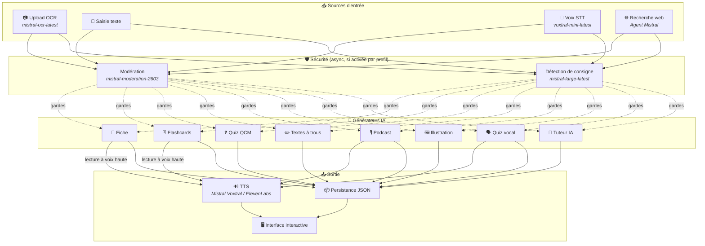
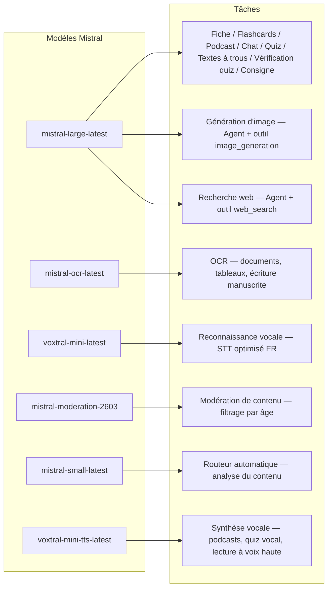
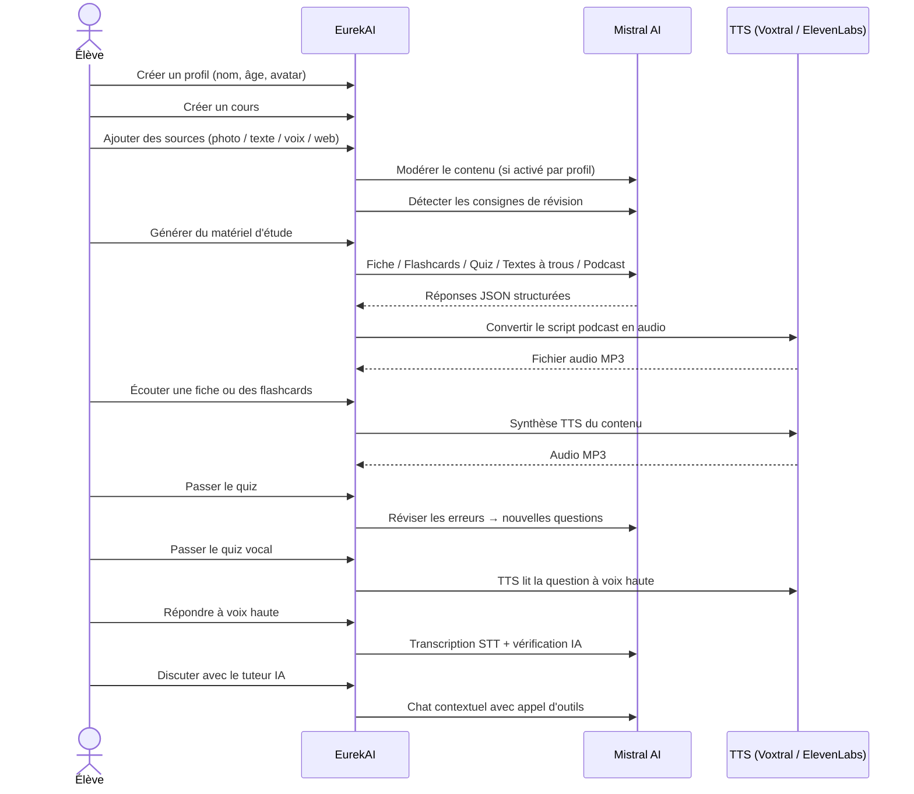

<p align="center">
  
</p>

<h1 align="center">EurekAI</h1>

<p align="center">
  <strong>किसी भी सामग्री को इंटरैक्टिव सीखने के अनुभव में बदलें — Mistral AI द्वारा संचालित।</strong>
</p>

<p align="center">
  <a href="README-en.md">🇬🇧 English</a> · <a href="README-es.md">🇪🇸 Español</a> · <a href="README-pt.md">🇧🇷 Português</a> · <a href="README-de.md">🇩🇪 Deutsch</a> · <a href="README-it.md">🇮🇹 Italiano</a> · <a href="README-nl.md">🇳🇱 Nederlands</a> · <a href="README-ar.md">🇸🇦 العربية</a><br>
  <a href="README-hi.md">🇮🇳 हिन्दी</a> · <a href="README-zh.md">🇨🇳 中文</a> · <a href="README-ja.md">🇯🇵 日本語</a> · <a href="README-ko.md">🇰🇷 한국어</a> · <a href="README-pl.md">🇵🇱 Polski</a> · <a href="README-ro.md">🇷🇴 Română</a> · <a href="README-sv.md">🇸🇪 Svenska</a>
</p>

<p align="center">
  <a href="https://www.youtube.com/watch?v=_b1TQz2leoI"></a>
</p>

<h4 align="center">📊 कोड गुणवत्ता</h4>

<p align="center">
  <a href="https://sonarcloud.io/summary/new_code?id=jls42_EurekAI"></a>
  <a href="https://sonarcloud.io/summary/new_code?id=jls42_EurekAI"></a>
  <a href="https://sonarcloud.io/summary/new_code?id=jls42_EurekAI"></a>
  <a href="https://sonarcloud.io/summary/new_code?id=jls42_EurekAI"></a>
</p>
<p align="center">
  <a href="https://sonarcloud.io/summary/new_code?id=jls42_EurekAI"></a>
  <a href="https://sonarcloud.io/summary/new_code?id=jls42_EurekAI"></a>
  <a href="https://sonarcloud.io/summary/new_code?id=jls42_EurekAI"></a>
  <a href="https://sonarcloud.io/summary/new_code?id=jls42_EurekAI"></a>
</p>

---

## कहानी — क्यों EurekAI ?

**EurekAI** का जन्म [Mistral AI Worldwide Hackathon](https://luma.com/mistralhack-online) ([आधिकारिक साइट](https://worldwide-hackathon.mistral.ai/)) (मार्च 2026) के दौरान हुआ। मुझे एक विषय चाहिए था — और विचार एक बहुत ही ठोस ज़रूरत से आया: मैं नियमित रूप से अपनी बेटी के साथ टेस्ट की तैयारी करता/करती हूँ, और मैंने सोचा कि इसे AI की मदद से और अधिक मजेदार व इंटरैक्टिव बनाया जा सकता है।

उद्देश्य: किसी भी इनपुट को लेना — पाठ्यपुस्तक की तस्वीर, कॉपी-पेस्ट किया गया टेक्स्ट, आवाज़ रिकॉर्डिंग, वेब सर्च — और उसे **रिवीजन नोट्स, फ्लैशकार्ड्स, क्विज़, पॉडकास्ट, रिक्त स्थान वाले टेक्स्ट, चित्रण, और भी बहुत कुछ** में बदलना। यह सब Mistral AI के फ्रेंच मॉडल्स द्वारा संचालित है, जिससे यह स्वाभाविक रूप से फ्रेंच भाषी छात्रों के लिए अनुकूल समाधान बनता है।

प्रोजेक्ट हैकाथॉन के दौरान शुरू हुआ, और बाहर भी इसे आगे बढ़ाकर समृद्ध किया गया। पूरी कोड बेस AI द्वारा जनरेट की गई है — मुख्यतः [Claude Code](https://docs.anthropic.com/en/docs/claude-code) से, कुछ सहयोग [Codex](https://openai.com/index/introducing-codex/) के ज़रिए है।

---

## फीचर्स

| | फीचर | विवरण |
|---|---|---|
| 📷 | **Upload OCR** | अपनी किताब या नोट्स की फोटो लें — Mistral OCR से कंटेंट निकाला जाता है |
| 📝 | **टेक्स्ट इनपुट** | किसी भी टेक्स्ट को टाइप या कॉपी-पेस्ट करें |
| 🎤 | **वॉयस इनपुट** | रिकॉर्ड करें — Voxtral STT आपकी आवाज़ को ट्रांसक्राइब करता है |
| 🌐 | **वेब सर्च** | प्रश्न पूछें — एक Mistral एजेंट वेब पर उत्तर ढूंढता है |
| 📄 | **रिवीजन नोट्स** | संरचित नोट्स: मुख्य बिंदु, शब्दावली, उद्धरण, किस्से |
| 🃏 | **फ्लैशकार्ड्स** | 5-50 Q/A कार्ड्स स्रोत संदर्भों के साथ सक्रिय याददाश्त के लिए |
| ❓ | **बहुविकल्पी क्विज़** | 5-50 मल्टीपल चॉइस प्रश्न, गलतियों की अनुकूल समीक्षा के साथ |
| ✏️ | **रिक्त स्थान वाले टेक्स्ट** | संकेतों और सहनशील जाँच के साथ भरने वाले अभ्यास |
| 🎙️ | **पॉडकास्ट** | 2-आवाज़ वाला मिनी-पॉडकास्ट, Mistral Voxtral TTS से ऑडियो |
| 🖼️ | **चित्रण** | Mistral एजेंट द्वारा जनरेट की गई शैक्षिक छवियाँ |
| 🗣️ | **वॉयस क्विज़** | प्रश्न को ज़ोर से पढ़ा जाता है, मौखिक उत्तर दिया जाता है, AI उत्तर सत्यापित करती है |
| 💬 | **AI ट्यूटर** | आपके कोर्स दस्तावेज़ों के साथ संदर्भित चैट, टूल कॉलिंग सक्षम |
| 🧠 | **ऑटो राउटर** | `mistral-small-latest` पर आधारित राउटर सामग्री का विश्लेषण कर उपलब्ध 7 जनरेटर्स का संयोजन प्रस्तावित करता है |
| 🔒 | **पेरेंटल कंट्रोल** | आयु अनुसार मॉडरेशन, पेरेंटल PIN, चैट प्रतिबंध |
| 🌍 | **मल्टीभाषी** | इंटरफ़ेस 9 भाषाओं में उपलब्ध; AI जेनरेशन 15 भाषाओं में प्रॉम्प्ट द्वारा नियंत्रित |
| 🔊 | **वॉइस रीडिंग** | Mistral Voxtral TTS या ElevenLabs के माध्यम से नोट्स और फ्लैशकार्ड्स सुनें |

---

## आर्किटेक्चर का अवलोकन



---

## मॉडल उपयोग मानचित्र



---

## उपयोगकर्ता पथ



---

## गहराई में — फीचर्स

### मल्टी-मॉडल इनपुट

EurekAI 4 प्रकार के स्रोत स्वीकार करता है, प्रोफ़ाइल के अनुसार मॉडरेट किए जाते हैं (डिफ़ॉल्ट रूप से बच्चा और किशोर के लिए सक्षम):

- **Upload OCR** — JPG, PNG या PDF फाइलें `mistral-ocr-latest` द्वारा प्रोसेस होती हैं। मुद्रित टेक्स्ट, तालिकाएँ और हस्तलिखित लेखन संभालता है।
- **फ्री टेक्स्ट** — किसी भी कंटेंट को टाइप या पेस्ट करें। यदि मॉडरेशन सक्रिय है तो स्टोरेज से पहले मॉडरेट किया जाएगा।
- **वॉयस इनपुट** — ब्राउज़र में ऑडियो रिकॉर्ड करें। `voxtral-mini-latest` द्वारा ट्रांसक्राइब होता है। `language="fr"` सेटिंग मान्यता को ऑप्टिमाइज़ करती है।
- **वेब सर्च** — एक क्वेरी दर्ज करें। एक अस्थायी Mistral एजेंट `web_search` टूल के साथ परिणाम प्राप्त कर सारांश करता है।

### AI सामग्री जनरेशन

सात प्रकार की शिक्षण सामग्री जेनरेट होती है:

| जेनरेटर | मॉडल | आउटपुट |
|---|---|---|
| **रिवीजन नोट्स** | `mistral-large-latest` | शीर्षक, सार, 10-25 मुख्य बिंदु, शब्दावली, उद्धरण, किस्सा |
| **फ्लैशकार्ड्स** | `mistral-large-latest` | 5-50 Q/A कार्ड्स स्रोत संदर्भों के साथ सक्रिय याददाश्त के लिए |
| **बहुविकल्पी क्विज़** | `mistral-large-latest` | 5-50 प्रश्न, प्रत्येक के 4 विकल्प, स्पष्टीकरण, अनुकूल समीक्षा |
| **रिक्त स्थान वाले टेक्स्ट** | `mistral-large-latest` | संकेतों के साथ भरने वाले वाक्य, सहनशील सत्यापन (Levenshtein) |
| **पॉडकास्ट** | `mistral-large-latest` + Voxtral TTS | 2-आवाज़ स्क्रिप्ट → MP3 ऑडियो |
| **चित्रण** | एजेंट `mistral-large-latest` | टूल `image_generation` के माध्यम से शैक्षिक छवि |
| **वॉयस क्विज़** | `mistral-large-latest` + Voxtral TTS + STT | TTS प्रश्न → STT उत्तर → AI सत्यापन |

### चैट द्वारा AI ट्यूटर

एक संवादात्मक ट्यूटर जिसके पास पूरे कोर्स दस्तावेजों तक पहुँच है:

- उपयोग करता है `mistral-large-latest`
- **टूल कॉल** : बातचीत के दौरान नोट्स, फ्लैशकार्ड्स, क्विज़ या रिक्त स्थान वाले टेक्स्ट जेनरेट कर सकता है
- प्रत्येक कोर्स के लिए 50 संदेशों का इतिहास
- यदि प्रोफ़ाइल के लिए सक्षम है तो कंटेंट मॉडरेशन लागू

### ऑटो राउटर

राउटर सामग्री के विश्लेषण के लिए `mistral-small-latest` का उपयोग करता है और उपलब्ध 7 जनरेटर्स में सबसे उपयुक्त सुझाव देता है। इंटरफ़ेस वास्तविक समय में प्रगति दिखाता है: पहले विश्लेषण चरण, फिर व्यक्तिगत जेनरेशन्स जिनको कैंसल किया जा सकता है।

### अनुकूलन सीखना

- **क्विज़ आँकड़े** : प्रश्नों के प्रयास और सटीकता का ट्रैक
- **क्विज़ पुनरावलोकन** : कमजोर अवधारणाओं को लक्षित करते हुए 5-10 नए प्रश्न जेनरेट करता है
- **निर्देश पहचान** : पुनरावृत्ति निर्देशों का पता लगाता है ("Je sais ma leçon si je sais...") और उन्हें टेक्स्ट जनरेटर (नोट्स, फ्लैशकार्ड्स, क्विज़, रिक्त टेक्स्ट) में प्राथमिकता देता है

### सुरक्षा और पेरेंटल कंट्रोल

- **4 आयु समूह** : बच्चा (≤10 वर्ष), किशोर (11-15), छात्र (16-25), युवा/वयस्क (26+)
- **कंटेंट मॉडरेशन** : `mistral-moderation-2603` जिसमें बच्चा/किशोर के लिए 5 ब्लॉक कीटेगरी (sexual, hate, violence, selfharm, jailbreaking), छात्र/वयस्क के लिए कोई प्रतिबंध नहीं
- **पेरेंटल PIN** : SHA-256 हैश, 15 साल से कम प्रोफाइल के लिए आवश्यक। प्रोडक्शन डिप्लॉयमेंट के लिए स्लो हैश + सॉल्ट (Argon2id, bcrypt) की सिफारिश।
- **चैट प्रतिबंध** : 16 साल से कम के लिए AI चैट डिफ़ॉल्ट रूप से डिसेबल, माता-पिता द्वारा सक्षम किया जा सकता है

### मल्टी-प्रोफाइल सिस्टम

- कई प्रोफाइल जिनमें नाम, आयु, अवतार, भाषा प्राथमिकताएँ
- प्रोफाइल से जुड़े प्रोजेक्ट `profileId`
- कैस्केड डिलीट: एक प्रोफाइल हटाने पर उसके सभी प्रोजेक्ट हट जाते हैं

### मल्टी-प्रोविडर TTS

- **Mistral Voxtral TTS** (डिफ़ॉल्ट) : `voxtral-mini-tts-latest`, अतिरिक्त कुंजी की आवश्यकता नहीं
- **ElevenLabs** (वैकल्पिक) : `eleven_v3`, प्राकृतिक आवाज़ें, आवश्यक `ELEVENLABS_API_KEY`
- प्रोवाइडर एप सेटिंग्स में कॉन्फ़िगर करने योग्य

### इंटरनेशनलाइज़ेशन

- इंटरफ़ेस 9 भाषाओं में उपलब्ध: fr, en, es, pt, it, nl, de, hi, ar
- AI प्रॉम्प्ट 15 भाषाओं का समर्थन करते हैं (fr, en, es, de, it, pt, nl, ja, zh, ko, ar, hi, pl, ro, sv)
- भाषा प्रोफ़ाइल द्वारा कॉन्फ़िगर की जा सकती है

---

## टेक्निकल स्टैक

| परत | प्रौद्योगिकी | भूमिका |
|---|---|---|
| **Runtime** | Node.js + TypeScript 5.x | सर्वर और टाइप सुरक्षा |
| **Backend** | Express 4.x | REST API |
| **डेव सर्वर** | Vite 7.x + tsx | HMR, हैंडलबार्स पार्टियल्स, प्रॉक्सी |
| **Frontend** | HTML + TailwindCSS 4.x + Alpine.js 3.x | प्रतिक्रियाशील UI, Vite द्वारा TypeScript कम्पाइल |
| **Templating** | vite-plugin-handlebars | पार्टियल्स द्वारा HTML कंपोज़िशन |
| **AI** | Mistral AI SDK 2.x | चैट, OCR, STT, TTS, एजेंट्स, मॉडरेशन |
| **TTS (डिफ़ॉल्ट)** | Mistral Voxtral TTS | `voxtral-mini-tts-latest`, इन-बिल्ट स्पीच सिंथेसिस |
| **TTS (वैकल्पिक)** | ElevenLabs SDK 2.x | `eleven_v3`, प्राकृतिक आवाज़ें |
| **आइकॉन** | Lucide | SVG आइकॉन लाइब्रेरी |
| **Markdown** | Marked | चैट में Markdown रेंडरिंग |
| **फाइल अपलोड** | Multer 1.4 LTS | मल्टीपार्ट फ़ॉर्म हैंडलिंग |
| **ऑडियो** | ffmpeg-static | ऑडियो सेगमेंट्स का संयोजन |
| **टेस्टिंग** | Vitest | यूनिट टेस्ट — कवरेज SonarCloud से नापा जाता है |
| **पर्सिस्टेंस** | JSON फ़ाइलें | निर्भरता-रहित स्टोरेज |

---

## मॉडल संदर्भ

| मॉडल | उपयोग | क्यों |
|---|---|---|
| `mistral-large-latest` | नोट्स, फ्लैशकार्ड्स, पॉडकास्ट, क्विज़, रिक्त टेक्स्ट, चैट, वॉयस क्विज़ सत्यापन, इमेज एजेंट, वेब सर्च एजेंट, निर्देश डिटेक्शन | बहुभाषी और निर्देश पालन में श्रेष्ठ |
| `mistral-ocr-latest` | दस्तावेज़ OCR | मुद्रित टेक्स्ट, तालिकाएँ, हस्तलिखित |
| `voxtral-mini-latest` | स्पीच-टू-टेक्स्ट (STT) | बहुभाषी STT, `language="fr"` से ऑप्टिमाइज़ |
| `voxtral-mini-tts-latest` | टेक्स्ट-टू-स्पीच (TTS) | पॉडकास्ट, वॉयस क्विज़, रीड-अलाउड |
| `mistral-moderation-2603` | कंटेंट मॉडरेशन | बच्चा/किशोर के लिए 5 ब्लॉक कीटेगरी (+ jailbreaking) |
| `mistral-small-latest` | ऑटो राउटर | राउटिंग निर्णय के लिए त्वरित कंटेंट विश्लेषण |
| `eleven_v3` (ElevenLabs) | स्पीच सिंथेसिस (वैकल्पिक TTS) | प्राकृतिक आवाज़ें, कॉन्फ़िगर करने योग्य विकल्प |

---

## तेज़ शुरुआत

```bash
# Cloner le dépôt
git clone https://github.com/jls42/EurekAI.git
cd EurekAI

# Installer les dépendances
npm install

# Configurer les clés API
cp .env.example .env
# Éditez .env avec vos clés :
#   MISTRAL_API_KEY=votre_clé_ici           (requis)
#   ELEVENLABS_API_KEY=votre_clé_ici        (optionnel, TTS alternatif)
#   SONAR_TOKEN=...                          (optionnel, CI SonarCloud uniquement)

# Lancer le développement
npm run dev
# → Backend :  http://localhost:3000 (API)
# → Frontend : http://localhost:5173 (serveur Vite avec HMR)
```

> **नोट** : Mistral Voxtral TTS डिफ़ॉल्ट प्रोवाइडर है — `MISTRAL_API_KEY` के अलावा कोई अतिरिक्त कुंजी आवश्यक नहीं। ElevenLabs वैकल्पिक TTS प्रोवाइडर है जिसे ऐप सेटिंग्स में कॉन्फ़िगर किया जा सकता है।

---

## प्रोजेक्ट संरचना

```
server.ts                 — Point d'entrée Express, monte les routes + config
config.ts                 — Config runtime (modèles, voix, TTS provider), persistée dans output/config.json
store.ts                  — ProjectStore : CRUD projets/sources/générations, persistance JSON
profiles.ts               — ProfileStore : gestion des profils, hachage PIN
types.ts                  — Types TypeScript : Source, Generation (7 types), QuizStats, Profile
prompts.ts                — Tous les prompts IA centralisés (system + user templates, 15 langues)

generators/
  ocr.ts                  — Upload + OCR via Mistral (JPG, PNG, PDF)
  summary.ts              — Génération de fiche de révision (JSON structuré)
  flashcards.ts           — Flashcards Q/R (5-50, configurable)
  quiz.ts                 — Quiz QCM (5-50 questions, configurable) + révision adaptative
  fill-blank.ts           — Exercices à trous avec validation tolérante
  podcast.ts              — Script podcast 2 voix
  quiz-vocal.ts           — Quiz vocal : questions TTS + réponses STT + vérification IA
  image.ts                — Génération d'image via Agent Mistral (outil image_generation)
  chat.ts                 — Tuteur IA par chat avec appel d'outils
  router.ts               — Routeur automatique (contenu → générateurs recommandés)
  consigne.ts             — Détection de consignes de révision
  tts-provider.ts         — Dispatch TTS multi-provider (Mistral Voxtral / ElevenLabs)
  tts.ts                  — Génération audio podcast (concaténation de segments)
  stt.ts                  — Voxtral STT (audio → texte)
  websearch.ts            — Agent Mistral avec outil web_search
  moderation.ts           — Modération de contenu (filtrage par âge)

routes/
  projects.ts             — CRUD projets
  profiles.ts             — CRUD profils avec gestion du PIN
  sources.ts              — Upload OCR, texte libre, voix STT, recherche web, modération
  generate.ts             — Endpoints de génération (7 types + auto + route)
  generations.ts          — Tentatives de quiz/fill-blank, réponses vocales, lecture à voix haute
  chat.ts                 — Chat IA avec appel d'outils

helpers/
  index.ts                — safeParseJson, unwrapJsonArray, extractAllText, timer
  audio.ts                — collectStream (ReadableStream → Buffer)
  fill-blank-validate.ts  — Validation tolérante des réponses (normalisation, Levenshtein)

src/                      — Frontend (Vite + Handlebars)
  index.html              — Point d'entrée HTML principal
  main.ts                 — Entrée frontend (init Alpine.js + icônes Lucide)
  app/                    — Modules applicatifs Alpine.js
    state.ts              — Gestion d'état réactif
    navigation.ts         — Routage des vues + gardes par âge
    profiles.ts           — Logique du sélecteur de profils
    projects.ts           — CRUD des cours
    sources.ts            — Gestionnaires d'upload de sources
    generate.ts           — Déclencheurs de génération (individuel, tout, auto 2 phases)
    generations.ts        — Affichage + actions sur les générations
    chat.ts               — Interface de chat
    config.ts             — Interface de configuration (modèles, voix, TTS provider)
    render.ts             — Helpers de rendu HTML
    i18n.ts               — Changement de langue
    ...
  components/
    quiz.ts               — Composant quiz interactif
    quiz-vocal.ts         — Composant quiz vocal
    fill-blank.ts         — Composant textes à trous
    flashcards.ts         — Composant flashcards avec retournement
    step-by-step.ts       — Mixin navigation pas-à-pas (quiz, fill-blank, flashcards)
  i18n/
    fr.ts, en.ts, es.ts, — Dictionnaires par langue (9 langues)
    pt.ts, it.ts, nl.ts,
    de.ts, hi.ts, ar.ts
    languages.ts          — Registre des langues UI disponibles
    index.ts              — Chargeur i18n
  partials/               — Partials HTML Handlebars (header, sidebar, dialogues, vues)
  styles/
    main.css              — Entrée TailwindCSS
    theme.css             — Variables de thème personnalisées

public/assets/            — Ressources statiques (logo, avatars)
output/                   — Données d'exécution (projets, config, fichiers audio)
```

---

## API संदर्भ

### कॉन्फ़िग
| मेथड | एन्डपॉइंट | विवरण |
|---|---|---|
| `GET` | `/api/config` | वर्तमान कॉन्फ़िगरेशन |
| `PUT` | `/api/config` | कॉन्फ़िग बदलें (मॉडलों, वॉइस, TTS प्रोवाइडर) |
| `GET` | `/api/config/status` | APIs की स्थिति (Mistral, ElevenLabs, TTS) |
| `POST` | `/api/config/reset` | डिफ़ॉल्ट कॉन्फ़िग रीसेट करें |
| `GET` | `/api/config/voices` | Mistral TTS वॉइस लिस्ट करें (विकल्पी `?lang=fr`) |

### प्रोफाइल्स
| मेथड | एन्डपॉइंट | विवरण |
|---|---|---|
| `GET` | `/api/profiles` | सभी प्रोफाइल सूचीबद्ध करें |
| `POST` | `/api/profiles` | प्रोफाइल बनाएं |
| `PUT` | `/api/profiles/:id` | प्रोफाइल संशोधित करें (15 वर्ष से कम के लिए PIN आवश्यक) |
| `DELETE` | `/api/profiles/:id` | प्रोफाइल और संबंधित प्रोजेक्ट्स हटाएं `{pin?}` → `{ok, deletedProjects}` |

### प्रोजेक्ट्स
| मेथड | एन्डपॉइंट | विवरण |
|---|---|---|
| `GET` | `/api/projects` | प्रोजेक्ट्स सूचीबद्ध करें (`?profileId=` विकल्प) |
| `POST` | `/api/projects` | प्रोजेक्ट बनाएं `{name, profileId}` |
| `GET` | `/api/projects/:pid` | प्रोजेक्ट विवरण |
| `PUT` | `/api/projects/:pid` | नाम बदलें `{name}` |
| `DELETE` | `/api/projects/:pid` | प्रोजेक्ट हटाएँ |

### स्रोत
| मेथड | एन्डपॉइंट | विवरण |
|---|---|---|
| `POST` | `/api/projects/:pid/sources/upload` | Upload OCR (मल्टीपार्ट फाइल्स) |
| `POST` | `/api/projects/:pid/sources/text` | फ्री टेक्स्ट `{text}` |
| `POST` | `/api/projects/:pid/sources/voice` | वॉयस STT (मल्टीपार्ट ऑडियो) |
| `POST` | `/api/projects/:pid/sources/websearch` | वेब सर्च `{query}` |
| `DELETE` | `/api/projects/:pid/sources/:sid` | स्रोत हटाएँ |
| `POST` | `/api/projects/:pid/moderate` | मॉडरेट करें `{text}` |
| `POST` | `/api/projects/:pid/detect-consigne` | रिवीजन निर्देशों का पता लगाएँ |

### जेनरेशन
| मेथड | एन्डपॉइंट | विवरण |
|---|---|---|
| `POST` | `/api/projects/:pid/generate/summary` | रिवीजन नोट्स |
| `POST` | `/api/projects/:pid/generate/flashcards` | फ्लैशकार्ड्स |
| `POST` | `/api/projects/:pid/generate/quiz` | बहुविकल्पी क्विज़ |
| `POST` | `/api/projects/:pid/generate/fill-blank` | रिक्त स्थान वाले टेक्स्ट |
| `POST` | `/api/projects/:pid/generate/podcast` | पॉडकास्ट |
| `POST` | `/api/projects/:pid/generate/image` | चित्रण |
| `POST` | `/api/projects/:pid/generate/quiz-vocal` | वॉयस क्विज़ |
| `POST` | `/api/projects/:pid/generate/quiz-review` | अनुकूलन समीक्षा `{generationId, weakQuestions}` |
| `POST` | `/api/projects/:pid/generate/route` | राउटिंग विश्लेषण (कौन से जनरेटर्स चलाने हैं का प्लान) |
| `POST` | `/api/projects/:pid/generate/auto` | ऑटो बैकएंड जेनरेशन (राउटिंग + 5 प्रकार : summary, flashcards, quiz, fill-blank, podcast) |

सभी जेनरेशन रूट्स `{sourceIds?, lang?, ageGroup?, count?, useConsigne?}` स्वीकार करते हैं। `quiz-review` के लिए अतिरिक्त `{generationId, weakQuestions}` आवश्यक है।

### CRUD जेनरेशन्स
| मेथड | एन्डपॉइंट | विवरण |
|---|---|---|
| `POST` | `/api/projects/:pid/generations/:gid/quiz-attempt` | क्विज़ उत्तर जमा करें `{answers}` |
| `POST` | `/api/projects/:pid/generations/:gid/fill-blank-attempt` | रिक्त टेक्स्ट उत्तर जमा करें `{answers}` |
| `POST` | `/api/projects/:pid/generations/:gid/vocal-answer` | मौखिक उत्तर सत्यापित करें (ऑडियो + questionIndex) |
| `POST` | `/api/projects/:pid/generations/:gid/read-aloud` | TTS रीड-अलाउड (नोट्स/फ्लैशकार्ड्स) |
| `PUT` | `/api/projects/:pid/generations/:gid` | नाम बदलें `{title}` |
| `DELETE` | `/api/projects/:pid/generations/:gid` | जेनरेशन हटाएँ |

### चैट
| मेथड | एन्डपॉइंट | विवरण |
|---|---|---|
| `GET` | `/api/projects/:pid/chat` | चैट इतिहास प्राप्त करें |
| `POST` | `/api/projects/:pid/chat` | संदेश भेजें `{message, lang, ageGroup}` |
| `DELETE` | `/api/projects/:pid/chat` | चैट इतिहास साफ़ करें |

---

## आर्किटेक्चरल निर्णय

| निर्णय | औचित्य |
|---|---|
| **Alpine.js React/Vue की जगह** | न्यूनतम फुटप्रिंट, हल्की प्रतिक्रियाशीलता, Vite द्वारा TypeScript कम्पाइल। हैकाथॉन के लिए तेज़ी से काम करने के लिए उपयुक्त। |
| **JSON फाइलों में पर्सिस्टेंस** | शून्य निर्भरता, तुरंत स्टार्ट। कोई DB सेटअप नहीं — बस स्टार्ट करें और काम शुरू। |
| **Vite + Handlebars** | दोनों दुनियाओं की सबसे अच्छी बातें: विकास के लिए तेज HMR, कोड की व्यवस्था के लिए HTML partials, Tailwind JIT. |
| **केंद्रित प्रॉम्प्ट्स** | सभी एआई प्रॉम्प्ट्स `prompts.ts` में — भाषाओं/आयु-समूह के अनुसार दोहराने, परीक्षण और अनुकूलित करने में आसान। |
| **मल्टी-जनरेशन सिस्टम** | प्रत्येक जनरेशन अपना स्वतंत्र ऑब्जेक्ट है अपने स्वयं के ID के साथ — हर पाठ के लिए कई फ्लैशकार्ड, क्विज़ आदि की अनुमति देता है। |
| **आयु के अनुसार अनुकूलित प्रॉम्प्ट्स** | 4 आयु-समूह जिनकी शब्दावली, जटिलता और लहजा अलग है — वही सामग्री अलग- अलग शिक्षार्थियों को अलग तरीके से सीखाती है। |
| **एजेंट-आधारित सुविधाएँ** | इमेज जनरेशन और वेब खोज अस्थायी Mistral एजेंट्स का उपयोग करते हैं — स्वच्छ जीवन-चक्र के साथ स्वचालित क्लीनअप। |
| **मल्टी-प्रोवाइडर TTS** | डिफ़ॉल्ट रूप से Mistral Voxtral TTS (अतिरिक्त कुंजी की आवश्यकता नहीं), विकल्प के रूप में ElevenLabs — बिना पुनरारंभ के कॉन्फ़िगर करने योग्य। |

---

## क्रेडिट्स और आभार

- **[मिस्ट्रल AI](https://mistral.ai)** — AI मॉडल (Large, OCR, Voxtral STT, Voxtral TTS, Moderation, Small) + Worldwide Hackathon
- **[इलेवनलैब्स](https://elevenlabs.io)** — वैकल्पिक वॉइस सिंथेसिस इंजन (`eleven_v3`)
- **[अल्पाइन.js](https://alpinejs.dev)** — हल्का रिएक्टिव फ्रेमवर्क
- **[टेलवाइंडCSS](https://tailwindcss.com)** — यूटिलिटी-आधारित CSS फ्रेमवर्क
- **[वाइट](https://vitejs.dev)** — फ्रंटएंड बिल्ड टूल
- **[लूसिड](https://lucide.dev)** — आइकॉन लाइब्रेरी
- **[मार्क्ड](https://marked.js.org)** — Markdown पार्सर

Mistral AI Worldwide Hackathon (मार्च 2026) के दौरान आरंभ, Claude Code और Codex के साथ पूरी तरह एआई द्वारा विकसित।

---

## लेखक

**Julien LS** — [contact@jls42.org](mailto:contact@jls42.org)

## लाइसेंस

[AGPL-3.0](LICENSE) — कॉपीराइट (C) 2026 Julien LS

**यह दस्तावेज़ fr संस्करण से hi भाषा में gpt-5-mini मॉडल का उपयोग करके अनुवादित किया गया है। अनुवाद प्रक्रिया के बारे में अधिक जानकारी के लिए देखें https://gitlab.com/jls42/ai-powered-markdown-translator**

