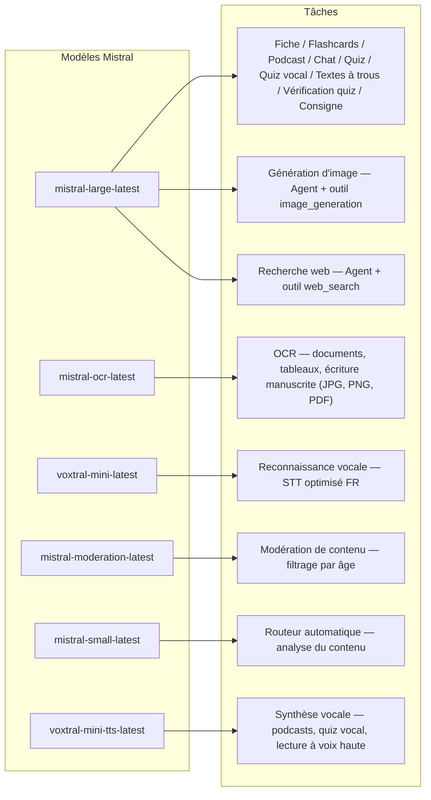
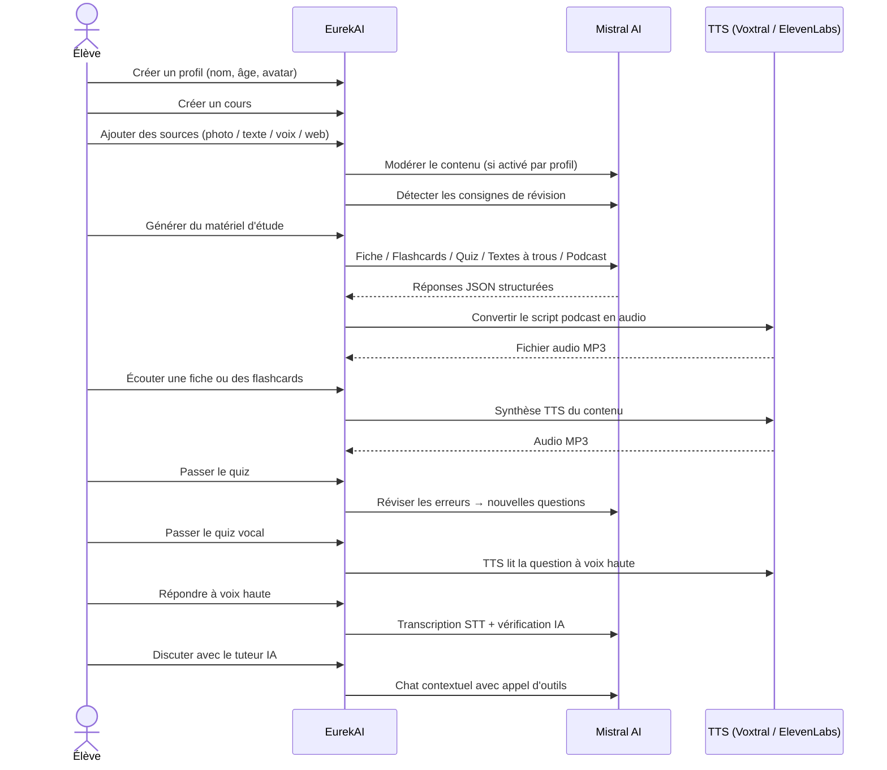

<p align="center">
  
</p>

<h1 align="center">EurekAI</h1>

<p align="center">
  <strong>किसी भी सामग्री को इंटरैक्टिव सीखने के अनुभव में बदलें — Mistral AI द्वारा संचालित।</strong>
</p>

<p align="center">
  <a href="README-en.md">🇬🇧 अंग्रेज़ी</a> · <a href="README-es.md">🇪🇸 Español</a> · <a href="README-pt.md">🇧🇷 Português</a> · <a href="README-de.md">🇩🇪 Deutsch</a> · <a href="README-it.md">🇮🇹 Italiano</a> · <a href="README-nl.md">🇳🇱 Nederlands</a> · <a href="README-ar.md">🇸🇦 العربية</a><br>
  <a href="README-hi.md">🇮🇳 हिन्दी</a> · <a href="README-zh.md">🇨🇳 中文</a> · <a href="README-ja.md">🇯🇵 日本語</a> · <a href="README-ko.md">🇰🇷 한국어</a> · <a href="README-pl.md">🇵🇱 Polski</a> · <a href="README-ro.md">🇷🇴 Română</a> · <a href="README-sv.md">🇸🇪 Svenska</a>
</p>

<p align="center">
  <a href="https://www.youtube.com/watch?v=_b1TQz2leoI"></a>
</p>

<h4 align="center">📊 कोड गुणवत्ता</h4>

<p align="center">
  <a href="https://sonarcloud.io/summary/new_code?id=jls42_EurekAI"></a>
  <a href="https://sonarcloud.io/summary/new_code?id=jls42_EurekAI"></a>
  <a href="https://sonarcloud.io/summary/new_code?id=jls42_EurekAI"></a>
  <a href="https://sonarcloud.io/summary/new_code?id=jls42_EurekAI"></a>
</p>
<p align="center">
  <a href="https://sonarcloud.io/summary/new_code?id=jls42_EurekAI"></a>
  <a href="https://sonarcloud.io/summary/new_code?id=jls42_EurekAI"></a>
  <a href="https://sonarcloud.io/summary/new_code?id=jls42_EurekAI"></a>
  <a href="https://sonarcloud.io/summary/new_code?id=jls42_EurekAI"></a>
</p>

---

## कहानी — EurekAI क्यों?

**EurekAI** का जन्म [Mistral AI Worldwide Hackathon](https://luma.com/mistralhack-online) ([आधिकारिक साइट](https://worldwide-hackathon.mistral.ai/)) (मार्च 2026) के दौरान हुआ। मुझे एक विषय चाहिए था — और विचार कुछ बहुत ही व्यावहारिक से आया: मैं नियमित रूप से अपनी बेटी के साथ टेस्ट की तैयारी करता हूँ, और मैंने सोचा कि IA (AI) की मदद से इसे और अधिक मजेदार और इंटरैक्टिव बनाया जा सकता है।

लक्ष्य: किसी भी इनपुट को लें — किसी पाठ का फोटो, कॉपी-पेस्ट किया गया टेक्स्ट, आवाज रिकॉर्डिंग, वेब खोज — और उसे **रिवीजन नोट्स, फ्लैशकार्ड्स, क्विज़, पॉडकास्ट, रिक्त स्थान वाले टेक्स्ट (fill-in-the-blanks), चित्र, और बहुत कुछ** में बदल दें। यह सब Mistral AI के फ्रेंच मॉडल द्वारा संचालित है, जिससे यह फ्रेंचभाषी छात्रों के लिए स्वाभाविक रूप से उपयुक्त समाधान बनता है।

प्रोजेक्ट हैकाथॉन के दौरान [मूल रिपो](https://github.com/jls42/worldwide-hackathon.mistral.ai) पर विकसित किया गया था, और फिर यहां जारी रखा और समृद्ध किया गया। पूरा कोड AI द्वारा जनरेट किया गया है — मुख्यतः [Claude Code](https://code.claude.com/), साथ ही कुछ योगदान [Codex](https://openai.com/codex/) और [Gemini CLI](https://geminicli.com/) के जरिये।

---

## सुविधाएँ

| | सुविधा | विवरण |
|---|---|---|
| 📷 | **फाइल आयात** | अपनी पाठ सामग्री आयात करें — फोटो, PDF (Mistral OCR के माध्यम से) या टेक्स्ट फ़ाइल (TXT, MD) |
| 📝 | **टेक्स्ट इनपुट** | किसी भी टेक्स्ट को सीधे टाइप या पेस्ट करें |
| 🎤 | **वॉइस इनपुट** | अपनी आवाज रिकॉर्ड करें — Voxtral STT आपकी आवाज़ ट्रांसक्राइब करता है |
| 🌐 | **वेब खोज** | एक प्रश्न पूछें — एक Mistral एजेंट वेब पर उत्तर खोजता है |
| 📄 | **रिवीजन नोट्स** | संरचित नोट्स जिनमें मुख्य बिंदु, शब्दावली, उद्धरण, रोचक तथ्य शामिल हैं |
| 🃏 | **फ्लैशकार्ड्स** | प्रश्न/उत्तर कार्ड स्रोतों के संदर्भ के साथ सक्रिय पुनरावृत्ति के लिए (संख्या समायोज्य) |
| ❓ | **मल्टिपल चॉइस क्विज़ (QCM)** | बहुविकल्पीय प्रश्न और त्रुटि-आधारित अनुकूलन पुनरावृत्ति (संख्या समायोज्य) |
| ✏️ | **रिक्त स्थान वाले टेक्स्ट** | संकेतों और सहनशील सत्यापन के साथ पूरक अभ्यास |
| 🎙️ | **पॉडकास्ट** | दो आवाज़ों वाला मिनी-पॉडकास्ट जो Mistral Voxtral TTS के माध्यम से ऑडियो में बदला जाता है |
| 🖼️ | **चित्रण** | शैक्षिक चित्र Mistral एजेंट द्वारा उत्पन्न |
| 🗣️ | **वॉइस क्विज़** | प्रश्नों को ज़ोर से पढ़ा जाता है, मौखिक उत्तर लिया जाता है, AI उत्तर की जाँच करता है |
| 💬 | **AI ट्यूटर** | आपके पाठ्य दस्तावेज़ों के साथ संदर्भित चैट, टूल कॉल के साथ |
| 🧠 | **स्वचालित राउटर** | `mistral-small-latest` आधारित एक राउटर सामग्री का विश्लेषण करता है और उपलब्ध 7 जनरेटर में से संयोजन सुझाता है |
| 🔒 | **पैरेंटल नियंत्रण** | प्रोफ़ाइल के अनुसार विनियमित मॉडरेशन (कस्टम श्रेणियाँ), पेरेंटल PIN, चैट प्रतिबंध |
| 🌍 | **मल्टीलिंगुअल** | इंटरफ़ेस 9 भाषाओं में उपलब्ध; AI जनरेशन प्रॉम्प्ट के जरिये 15 भाषाओं तक नियंत्रित |
| 🔊 | **वॉइस रीडआउट** | Mistral Voxtral TTS या ElevenLabs के माध्यम से नॉट्स और फ्लैशकार्ड्स सुनें |

---

## आर्किटेक्चर का अवलोकन


---

## मॉडल उपयोग मानचित्र



---

## उपयोगकर्ता प्रवाह



---

## गहराई से अवलोकन — विशेषताएँ

### बहु-मॉडल इनपुट

EurekAI 4 प्रकार के स्रोत स्वीकार करता है, जो प्रोफ़ाइल के अनुसार मॉडरेट किए जाते हैं (बच्चा और किशोर के लिए डिफ़ॉल्ट रूप से सक्रिय):

- **फाइल आयात** — JPG, PNG या PDF फ़ाइलें `mistral-ocr-latest` द्वारा संसाधित (छपा हुआ पाठ, टेबल, हस्तलिखित लेखन), या टेक्स्ट फ़ाइलें (TXT, MD) सीधे आयात की जाती हैं।
- **मुक्त टेक्स्ट** — किसी भी सामग्री को टाइप या पेस्ट करें। यदि मॉडरेशन सक्रिय है तो संग्रह से पहले मॉडरेट किया जाएगा।
- **वॉइस इनपुट** — ब्राउज़र में ऑडियो रिकॉर्ड करें। `voxtral-mini-latest` द्वारा ट्रांसक्राइब किया जाता है। पैरामीटर `language="fr"` पहचानों को अनुकूलित करता है।
- **वेब खोज** — एक क्वेरी डालें। एक अस्थायी Mistral एजेंट उपकरण `web_search` के साथ परिणामों को पुनः प्राप्त और संक्षेप करता है।

### AI द्वारा सामग्री बनाना

जनरेट किए गए सात प्रकार के शिक्षण सामग्री:

| जनरेटर | मॉडल | आउटपुट |
|---|---|---|
| **रिवीजन नोट** | `mistral-large-latest` | शीर्षक, सारांश, प्रमुख बिंदु, शब्दावली, उद्धरण, रोचक तथ्य |
| **फ्लैशकार्ड्स** | `mistral-large-latest` | स्रोत संदर्भों के साथ प्रश्न/उत्तर कार्ड (संख्या समायोज्य) |
| **मल्टिपल चॉइस क्विज़** | `mistral-large-latest` | बहुविकल्पीय प्रश्न, स्पष्टीकरण, अनुकूलन योग्य समीक्षा (संख्या समायोज्य) |
| **रिक्त स्थान वाले टेक्स्ट** | `mistral-large-latest` | संकेतों के साथ पूरक वाक्यांश, सहनशील सत्यापन (Levenshtein) |
| **पॉडकास्ट** | `mistral-large-latest` + Voxtral TTS | 2-वॉइस स्क्रिप्ट → MP3 ऑडियो |
| **चित्रण** | एजेंट `mistral-large-latest` | टूल `image_generation` के माध्यम से शैक्षिक छवि |
| **वॉइस क्विज़** | `mistral-large-latest` + Voxtral TTS + STT | TTS द्वारा प्रश्न → STT से उत्तर → AI द्वारा सत्यापन |

### चैट के माध्यम से AI ट्यूटर

एक वार्तालापात्मक ट्यूटर जो पूर्ण पाठ्य दस्तावेज़ों तक पहुँच रखता है:

- उपयोग करता है `mistral-large-latest`
- **टूल कॉल**: बातचीत के दौरान फ़्लैशकार्ड्स, रिवीजन नोट, क्विज़ या रिक्त स्थान वाले टेक्स्ट उत्पन्न कर सकता है
- प्रति पाठ्यक्रम 50 संदेशों का इतिहास
- यदि प्रोफ़ाइल के लिए सक्रिय हो तो कंटेंट मॉडरेशन लागू

### स्वचालित राउटर

राउटर सामग्री का विश्लेषण करने के लिए `mistral-small-latest` का उपयोग करता है और उपलब्ध 7 जनरेटर में से सबसे प्रासंगिक जनरेटर सुझाता। इंटरफ़ेस रीयल-टाइम प्रोग्रेस दिखाता है: पहले विश्लेषण चरण, फिर व्यक्तिगत जेनरेशन (रद्द करने की संभावना के साथ)।

### अनुकूलनशील सीखना

- **क्विज़ आँकड़े**: कोशिशों और प्रत्येक प्रश्न पर सटीकता का ट्रैक
- **क्विज़ समीक्षा**: कमजोर अवधारणाओं को लक्षित करते हुए 5-10 नए प्रश्न बनाता है
- **निर्देश पहचान**: रिवीजन निर्देशों का पता लगाता है ("मैं अपनी पाठ याद कर लेता/लेती हूँ अगर मैं...") और उन्हें टेक्स्ट जनरेटरों (नोट, फ्लैशकार्ड्स, क्विज़, रिक्त स्थान वाले टेक्स्ट) में प्राथमिकता देता है

### सुरक्षा और अभिभावकीय नियंत्रण

- **4 आयु समूह**: बच्चा (≤10 वर्ष), किशोर (11-15), छात्र (16-25), वयस्क (26+)
- **कंटेंट मॉडरेशन**: `mistral-moderation-latest` 10 उपलब्ध श्रेणियों के साथ, बच्चों/किशोरों के लिए डिफ़ॉल्ट रूप से 5 ब्लॉक की गईं (`sexual`, `hate_and_discrimination`, `violence_and_threats`, `selfharm`, `jailbreaking`). प्रोफ़ाइल सेटिंग्स में श्रेणियाँ कस्टमाइज़ की जा सकती हैं।
- **पैरेंटल PIN**: SHA-256 हैश, 15 वर्ष से कम प्रोफाइल के लिए आवश्यक। प्रोडक्शन डिप्लॉयमेंट के लिए स्लो हैशिंग और सॉल्ट (Argon2id, bcrypt) का उपयोग करें।
- **चैट प्रतिबंध**: 16 वर्ष से कम के लिए डिफ़ॉल्ट रूप से AI चैट अक्षम; माता-पिता द्वारा सक्षम किया जा सकता है

### मल्टि-प्रोफ़ाइल सिस्टम

- नाम, आयु, अवतार, भाषा पसंद के साथ कई प्रोफ़ाइल
- प्रोफाइल से जुड़े प्रोजेक्ट्स `profileId` के माध्यम से
- कास्केड हटाना: एक प्रोफ़ाइल हटाने पर उसके सभी प्रोजेक्ट्स हटते हैं

### बहु-प्रदाता TTS

- **Mistral Voxtral TTS** (डिफ़ॉल्ट): `voxtral-mini-tts-latest`, अतिरिक्त कुंजी की आवश्यकता नहीं
- **ElevenLabs** (विकल्प): `eleven_v3`, प्राकृतिक आवाज़ें, `ELEVENLABS_API_KEY` आवश्यक
- प्रदाता एप्लिकेशन सेटिंग्स में कॉन्फ़िगर करने योग्य

### अंतरराष्ट्रीयकरण

- इंटरफ़ेस 9 भाषाओं में उपलब्ध: fr, en, es, pt, it, nl, de, hi, ar
- AI प्रॉम्प्ट 15 भाषाओं का समर्थन करते हैं (fr, en, es, de, it, pt, nl, ja, zh, ko, ar, hi, pl, ro, sv)
- भाषा प्रोफ़ाइल द्वारा कॉन्फ़िगर की जा सकती है

---

## टेक स्टैक

| परत | टेक्नोलॉजी | भूमिका |
|---|---|---|
| **Runtime** | Node.js + TypeScript 6.x | सर्वर और टाइप सुरक्षा |
| **Backend** | Express 5.x | REST API |
| **डेव सर्वर** | Vite 8.x (Rolldown) + tsx | HMR, Handlebars partials, proxy |
| **Frontend** | HTML + TailwindCSS 4.x + Alpine.js 3.x | रिएक्टिव इंटरफ़ेस, TypeScript Vite द्वारा कंपाइल |
| **Templating** | vite-plugin-handlebars | partials द्वारा HTML कंपोजिशन |
| **AI** | Mistral AI SDK 2.x | चैट, OCR, STT, TTS, एजेंट्स, मॉडरेशन |
| **TTS (डिफ़ॉल्ट)** | Mistral Voxtral TTS | `voxtral-mini-tts-latest`, इन-बिल्ट स्पीच सिंथेसिस |
| **TTS (विकल्प)** | ElevenLabs SDK 2.x | `eleven_v3`, प्राकृतिक आवाज़ें |
| **आइकन** | Lucide 1.x | SVG आइकन लाइब्रेरी |
| **Markdown** | Marked | चैट में Markdown रेंडरिंग |
| **फाइल अपलोड** | Multer 2.x | multipart फॉर्म हैंडलिंग |
| **ऑडियो** | ffmpeg-static | ऑडियो सेगमेंट्स का कन्कैटनेशन |
| **टेस्ट** | Vitest | यूनिट टेस्ट — कवरेज SonarCloud द्वारा नापा गया |
| **पर्सिस्टेंस** | JSON फ़ाइलें | डिपेंडेंसी-रहित स्टोरेज |

---

## मॉडल संदर्भ

| मॉडल | उपयोग | क्यों |
|---|---|---|
| `mistral-large-latest` | नोट, फ्लैशकार्ड्स, पॉडकास्ट, क्विज़, रिक्त स्थान वाले टेक्स्ट, चैट, वॉइस-क्विज़ वेरिफिकेशन, इमेज एजेंट, वेब सर्च एजेंट, निर्देश पहचान | बहुभाषी और इंस्ट्रक्शन-फॉलो में श्रेष्ठ |
| `mistral-ocr-latest` | दस्तावेज़ OCR | छपा हुआ पाठ, तालिकाएँ, हस्तलिखित लेखन |
| `voxtral-mini-latest` | वॉइस मान्यता (STT) | बहुभाषी STT, `language="fr"` के साथ ऑप्टिमाइज़्ड |
| `voxtral-mini-tts-latest` | वॉइस सिंथेसिस (TTS) | पॉडकास्ट, वॉइस क्विज़, टेक्स्ट रीडआउट |
| `mistral-moderation-latest` | कंटेंट मॉडरेशन | बच्चों/किशोरों के लिए 5 श्रेणियाँ ब्लॉक (साथ ही jailbreaking) |
| `mistral-small-latest` | स्वचालित राउटर | राउटिंग के निर्णयों के लिए तेज़ कंटेंट विश्लेषण |
| `eleven_v3` (ElevenLabs) | वॉइस सिंथेसिस (वैकल्पिक TTS) | प्राकृतिक आवाज़ें, वैकल्पिक कॉन्फ़िगरेशन |

---

## त्वरित आरंभ

```bash
# Cloner le dépôt
git clone https://github.com/jls42/EurekAI.git
cd EurekAI

# Installer les dépendances
npm install

# Configurer les clés API
cp .env.example .env
# Éditez .env avec vos clés :
#   MISTRAL_API_KEY=votre_clé_ici           (requis)
#   ELEVENLABS_API_KEY=votre_clé_ici        (optionnel, TTS alternatif)
#   SONAR_TOKEN=...                          (optionnel, CI SonarCloud uniquement)

# Lancer le développement
npm run dev
# → Backend :  http://localhost:3000 (API)
# → Frontend : http://localhost:5173 (serveur Vite avec HMR)
```

> **नोट** : Mistral Voxtral TTS डिफ़ॉल्ट प्रदाता है — `MISTRAL_API_KEY` के अलावा कोई अतिरिक्त कुंजी आवश्यक नहीं। ElevenLabs एक वैकल्पिक TTS प्रदाता है जिसे सेटिंग्स में कॉन्फ़िगर किया जा सकता है।

---

## प्रोजेक्ट संरचना

```
server.ts                 — Point d'entrée Express, monte les routes + config
config.ts                 — Config runtime (modèles, voix, TTS provider), persistée dans output/config.json
store.ts                  — ProjectStore : CRUD projets/sources/générations, persistance JSON
profiles.ts               — ProfileStore : gestion des profils, hachage PIN
types.ts                  — Types TypeScript : Source, Generation (7 types), QuizStats, Profile
prompts.ts                — Tous les prompts IA centralisés (system + user templates, 15 langues)

generators/
  ocr.ts                  — OCR via Mistral (JPG, PNG, PDF)
  summary.ts              — Génération de fiche de révision (JSON structuré)
  flashcards.ts           — Flashcards Q/R (5-50, configurable)
  quiz.ts                 — Quiz QCM (5-50 questions, configurable) + révision adaptative
  fill-blank.ts           — Exercices à trous avec validation tolérante
  podcast.ts              — Script podcast 2 voix
  quiz-vocal.ts           — Quiz vocal : questions TTS + réponses STT + vérification IA
  image.ts                — Génération d'image via Agent Mistral (outil image_generation)
  chat.ts                 — Tuteur IA par chat avec appel d'outils
  router.ts               — Routeur automatique (contenu → générateurs recommandés)
  consigne.ts             — Détection de consignes de révision
  tts-provider.ts         — Dispatch TTS multi-provider (Mistral Voxtral / ElevenLabs)
  tts.ts                  — Génération audio podcast (concaténation de segments)
  stt.ts                  — Voxtral STT (audio → texte)
  websearch.ts            — Agent Mistral avec outil web_search
  moderation.ts           — Modération de contenu (filtrage par âge)

routes/
  projects.ts             — CRUD projets
  profiles.ts             — CRUD profils avec gestion du PIN
  sources.ts              — Import fichiers (OCR + texte brut), texte libre, voix STT, recherche web, modération
  generate.ts             — Endpoints de génération (7 types + auto + route)
  generations.ts          — Tentatives de quiz/fill-blank, réponses vocales, lecture à voix haute
  chat.ts                 — Chat IA avec appel d'outils

helpers/
  index.ts                — getContent, stripJsonMarkdown, safeParseJson, unwrapJsonArray, extractAllText, timer
  audio.ts                — collectStream (ReadableStream → Buffer)
  fill-blank-validate.ts  — Validation tolérante des réponses (normalisation, Levenshtein)
  diversity.ts            — Diversité des générations (exclusion du contenu déjà produit, randomSeed)

src/                      — Frontend (Vite + Handlebars)
  index.html              — Point d'entrée HTML principal
  main.ts                 — Entrée frontend (init Alpine.js + icônes Lucide)
  app/                    — Modules applicatifs Alpine.js
    state.ts              — Gestion d'état réactif
    navigation.ts         — Routage des vues + gardes par âge
    profiles.ts           — Logique du sélecteur de profils
    projects.ts           — CRUD des cours
    sources.ts            — Gestionnaires d'upload de sources
    generate.ts           — Déclencheurs de génération (individuel, tout, auto 2 phases)
    generations.ts        — Affichage + actions sur les générations
    chat.ts               — Interface de chat
    config.ts             — Interface de configuration (modèles, voix, TTS provider)
    render.ts             — Helpers de rendu HTML
    i18n.ts               — Changement de langue
    ...
  components/
    quiz.ts               — Composant quiz interactif
    quiz-vocal.ts         — Composant quiz vocal
    fill-blank.ts         — Composant textes à trous
    flashcards.ts         — Composant flashcards avec retournement
    step-by-step.ts       — Mixin navigation pas-à-pas (quiz, fill-blank, flashcards)
  i18n/
    fr.ts, en.ts, es.ts, — Dictionnaires par langue (9 langues)
    pt.ts, it.ts, nl.ts,
    de.ts, hi.ts, ar.ts
    languages.ts          — Registre des langues UI disponibles
    index.ts              — Chargeur i18n
  partials/               — Partials HTML Handlebars (header, sidebar, dialogues, vues)
  styles/
    main.css              — Entrée TailwindCSS
    theme.css             — Variables de thème personnalisées

public/assets/            — Ressources statiques (logo, avatars)
output/                   — Données d'exécution (projets, config, fichiers audio)
```

---

## API संदर्भ

### कॉन्फ़िग
| मेथड | Endpoint | विवरण |
|---|---|---|
| `GET` | `/api/config` | वर्तमान कॉन्फ़िग |
| `PUT` | `/api/config` | कॉन्फ़िग बदलें (मॉडल, वॉइस, TTS प्रदाता) |
| `GET` | `/api/config/status` | APIs की स्थिति (Mistral, ElevenLabs, TTS) |
| `POST` | `/api/config/reset` | डिफ़ॉल्ट कॉन्फ़िग रीसेट करें |
| `GET` | `/api/config/voices` | Mistral TTS वॉइसेज़ की सूची (वैकल्पिक `?lang=fr`) |
| `GET` | `/api/moderation-categories` | उपलब्ध मॉडरेशन श्रेणियाँ + आयु अनुसार डिफ़ॉल्ट्स |

### प्रोफ़ाइल्स
| मेथड | Endpoint | विवरण |
|---|---|---|
| `GET` | `/api/profiles` | सभी प्रोफ़ाइल्स सूचीबद्ध करें |
| `POST` | `/api/profiles` | एक प्रोफ़ाइल बनाएँ |
| `PUT` | `/api/profiles/:id` | प्रोफ़ाइल संपादित करें (≤ 15 वर्ष के लिए PIN आवश्यक) |
| `DELETE` | `/api/profiles/:id` | प्रोफ़ाइल हटाएँ + प्रोजेक्ट्स कास्केड `{pin?}` → `{ok, deletedProjects}` |

### प्रोजेक्ट्स
| मेथड | Endpoint | विवरण |
|---|---|---|
| `GET` | `/api/projects` | प्रोजेक्ट्स सूचीबद्ध करें (`?profileId=` वैकल्पिक) |
| `POST` | `/api/projects` | एक प्रोजेक्ट बनाएँ `{name, profileId}` |
| `GET` | `/api/projects/:pid` | प्रोजेक्ट विवरण |
| `PUT` | `/api/projects/:pid` | नाम बदलें `{name}` |
| `DELETE` | `/api/projects/:pid` | प्रोजेक्ट हटाएँ |

### स्रोत
| मेथड | Endpoint | विवरण |
|---|---|---|
| `POST` | `/api/projects/:pid/sources/upload` | multipart फाइल इम्पोर्ट (JPG/PNG/PDF के लिए OCR, TXT/MD के लिए डायरेक्ट रीड) |
| `POST` | `/api/projects/:pid/sources/text` | मुक्त टेक्स्ट `{text}` |
| `POST` | `/api/projects/:pid/sources/voice` | वॉइस STT (ऑडियो multipart) |
| `POST` | `/api/projects/:pid/sources/websearch` | वेब खोज `{query}` |
| `DELETE` | `/api/projects/:pid/sources/:sid` | एक स्रोत हटाएँ |
| `POST` | `/api/projects/:pid/moderate` | मॉडरेट करें `{text}` |
| `POST` | `/api/projects/:pid/detect-consigne` | रिवीजन निर्देशों का पता लगाएँ |

### जेनरेशन
| मेथड | Endpoint | विवरण |
|---|---|---|
| `POST` | `/api/projects/:pid/generate/summary` | रिवीजन नोट |
| `POST` | `/api/projects/:pid/generate/flashcards` | फ्लैशकार्ड्स |
| `POST` | `/api/projects/:pid/generate/quiz` | मल्टिपल चॉइस क्विज़ |
| `POST` | `/api/projects/:pid/generate/fill-blank` | रिक्त स्थान वाले टेक्स्ट |
| `POST` | `/api/projects/:pid/generate/podcast` | पॉडकास्ट |
| `POST` | `/api/projects/:pid/generate/image` | चित्रण |
| `POST` | `/api/projects/:pid/generate/quiz-vocal` | वॉइस क्विज़ |
| `POST` | `/api/projects/:pid/generate/quiz-review` | अनुकूलन समीक्षा `{generationId, weakQuestions}` |
| `POST` | `/api/projects/:pid/generate/route` | राउटिंग विश्लेषण (कौन से जनरेटर चलाने हैं इसका प्लान) |
| `POST` | `/api/projects/:pid/generate/auto` | ऑटो बैकएंड जेनरेशन (राउटिंग + 5 प्रकार : summary, flashcards, quiz, fill-blank, podcast) |

सभी जेनरेशन रूट्स `{sourceIds?, lang?, ageGroup?, count?, useConsigne?}` को स्वीकार करते हैं। `quiz-review` के लिए अतिरिक्त रूप से `{generationId, weakQuestions}` ज़रूरी है।

### CRUD जेनरेशन्स
| मेथड | Endpoint | विवरण |
|---|---|---|
| `POST` | `/api/projects/:pid/generations/:gid/quiz-attempt` | क्विज़ उत्तर सबमिट करें `{answers}` |
| `POST` | `/api/projects/:pid/generations/:gid/fill-blank-attempt` | रिक्त स्थान वाले टेक्स्ट उत्तर सबमिट करें `{answers}` |
| `POST` | `/api/projects/:pid/generations/:gid/vocal-answer` | मौखिक उत्तर जाँचें (ऑडियो + questionIndex) |
| `POST` | `/api/projects/:pid/generations/:gid/read-aloud` | TTS द्वारा पढ़ाई (नोट/फ्लैशकार्ड्स) |
| `PUT` | `/api/projects/:pid/generations/:gid` | नाम बदलें `{title}` |
| `DELETE` | `/api/projects/:pid/generations/:gid` | जेनरेशन हटाएँ |

### चैट
| मेथड | Endpoint | विवरण |
|---|---|---|
| `GET` | `/api/projects/:pid/chat` | चैट इतिहास प्राप्त करें |
| `POST` | `/api/projects/:pid/chat` | एक संदेश भेजें `{message, lang, ageGroup}` |
| `DELETE` | `/api/projects/:pid/chat` | चैट इतिहास साफ़ करें |

---

## आर्किटेक्चरल निर्णय | निर्णय | तर्क |
|---|---|
| **React/Vue की बजाय Alpine.js** | न्यूनतम फ़ुटप्रिंट, Vite द्वारा संकलित TypeScript के साथ हल्की प्रतिक्रियाशीलता। ऐसी हैकेथॉन के लिए परिपूर्ण जहाँ गति मायने रखती है। |
| **JSON फ़ाइलों में स्थायी भंडारण** | शून्य निर्भरता, त्वरित स्टार्ट। किसी डेटाबेस को कॉन्फ़िगर करने की ज़रूरत नहीं — बस शुरू करें और बस। |
| **Vite + Handlebars** | दोनों का सर्वश्रेष्ठ: विकास के लिए तेज HMR, कोड के संगठन के लिए HTML partials, Tailwind JIT। |
| **केंद्रीकृत प्रॉम्प्ट्स** | सभी AI प्रॉम्प्ट्स `prompts.ts` में — भाषा/आयु समूह के अनुसार दोहराने, परीक्षण और अनुकूलित करने में आसान। |
| **मल्टी-जनरेशन सिस्टम** | प्रत्येक जेनरेशन एक स्वतंत्र ऑब्जेक्ट है जिसका अपना ID होता है — प्रति पाठ कई नोट्स, क्विज़ आदि संभव। |
| **आयु के अनुसार अनुकूलित प्रॉम्प्ट्स** | 4 आयु समूह जिनमें शब्दावली, जटिलता और स्वर भिन्न होते हैं — वही सामग्री अलग तरह से प्रत्येक शिक्षार्थी को पढ़ाती है। |
| **Agents पर आधारित सुविधाएँ** | छवि निर्माण और वेब खोज अस्थायी Mistral Agents का उपयोग करती हैं — स्वच्छ लाइफसाइकल के साथ स्वचालित क्लीनअप। |
| **बहु-प्रदाता TTS** | डिफ़ॉल्ट रूप से Mistral Voxtral TTS (अतिरिक्त कुंजी की आवश्यकता नहीं), विकल्प के रूप में ElevenLabs — बिना पुनःप्रारंभ के कॉन्फ़िगर करने योग्य। |

---

## क्रेडिट्स और धन्यवाद

- **[Mistral AI](https://mistral.ai)** — AI मॉडल (Large, OCR, Voxtral STT, Voxtral TTS, Moderation, Small) + विश्वव्यापी हैकेथॉन
- **[ElevenLabs](https://elevenlabs.io)** — वैकल्पिक वॉइस सिंथेसिस इंजन (`eleven_v3`)
- **[Alpine.js](https://alpinejs.dev)** — हल्का रिएक्टिव फ्रेमवर्क
- **[TailwindCSS](https://tailwindcss.com)** — यूटिलिटी-आधारित CSS फ्रेमवर्क
- **[Vite](https://vitejs.dev)** — फ्रंटएंड बिल्ड टूल
- **[Lucide](https://lucide.dev)** — आइकॉन लाइब्रेरी
- **[Marked](https://marked.js.org)** — Markdown पार्सर

प्रोजेक्ट की शुरुआत Mistral AI विश्वव्यापी हैकेथॉन (मार्च 2026) के दौरान हुई, और इसे पूरी तरह AI द्वारा विकसित किया गया है साथ में [Claude Code](https://code.claude.com/), [Codex](https://openai.com/codex/) और [Gemini CLI](https://geminicli.com/)।

---

## लेखक

**Julien LS** — [contact@jls42.org](mailto:contact@jls42.org)

## लाइसेंस

[AGPL-3.0](LICENSE) — Copyright (C) 2026 Julien LS

**यह दस्तावेज़ fr संस्करण से hi भाषा में gpt-5-mini मॉडल का उपयोग करके अनुवादित किया गया है। अनुवाद प्रक्रिया के बारे में अधिक जानकारी के लिए, https://gitlab.com/jls42/ai-powered-markdown-translator देखें।**

