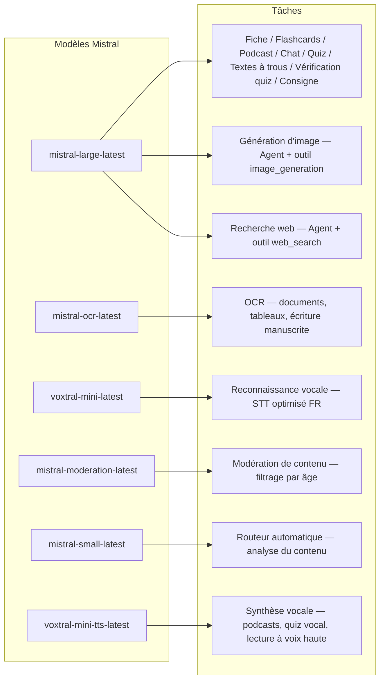
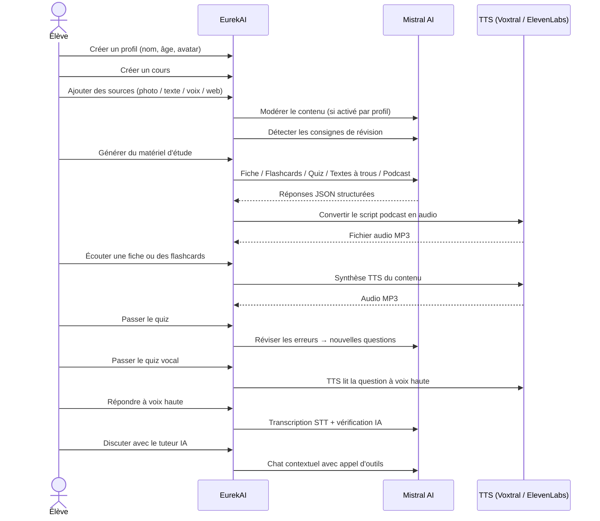

<p align="center">
  
</p>

<h1 align="center">EurekAI</h1>

<p align="center">
  <strong>किसी भी सामग्री को इंटरैक्टिव सीखने के अनुभव में बदलें — <a href="https://mistral.ai">Mistral AI</a> द्वारा संचालित।</strong>
</p>

<p align="center">
  <a href="README-en.md">🇬🇧 अंग्रेज़ी</a> · <a href="README-es.md">🇪🇸 स्पेनिश</a> · <a href="README-pt.md">🇧🇷 पुर्तगाली</a> · <a href="README-de.md">🇩🇪 जर्मन</a> · <a href="README-it.md">🇮🇹 इतालवी</a> · <a href="README-nl.md">🇳🇱 डच</a> · <a href="README-ar.md">🇸🇦 अरबी</a><br>
  <a href="README-hi.md">🇮🇳 हिन्दी</a> · <a href="README-zh.md">🇨🇳 中文</a> · <a href="README-ja.md">🇯🇵 日本語</a> · <a href="README-ko.md">🇰🇷 한국어</a> · <a href="README-pl.md">🇵🇱 पोलिश</a> · <a href="README-ro.md">🇷🇴 रोमानियाई</a> · <a href="README-sv.md">🇸🇪 स्वीडिश</a>
</p>

<p align="center">
  <a href="https://www.youtube.com/watch?v=_b1TQz2leoI"></a>
</p>

<h4 align="center">📊 कोड की गुणवत्ता</h4>

<p align="center">
  <a href="https://sonarcloud.io/summary/new_code?id=jls42_EurekAI"></a>
  <a href="https://sonarcloud.io/summary/new_code?id=jls42_EurekAI"></a>
  <a href="https://sonarcloud.io/summary/new_code?id=jls42_EurekAI"></a>
  <a href="https://sonarcloud.io/summary/new_code?id=jls42_EurekAI"></a>
</p>
<p align="center">
  <a href="https://sonarcloud.io/summary/new_code?id=jls42_EurekAI"></a>
  <a href="https://sonarcloud.io/summary/new_code?id=jls42_EurekAI"></a>
  <a href="https://sonarcloud.io/summary/new_code?id=jls42_EurekAI"></a>
  <a href="https://sonarcloud.io/summary/new_code?id=jls42_EurekAI"></a>
</p>

---

## कहानी — EurekAI क्यों?

**EurekAI** का जन्म [Mistral AI Worldwide Hackathon](https://luma.com/mistralhack-online) ([site officiel](https://worldwide-hackathon.mistral.ai/)) के दौरान हुआ (मार्च 2026)। मुझे एक विषय चाहिए था — और विचार कुछ बहुत ही व्यावहारिक से आया: मैं नियमित रूप से अपनी बेटी के साथ टेस्ट तैयार करता हूँ, और मैंने सोचा कि AI की मदद से इसे और अधिक खेलपूर्ण और इंटरैक्टिव बनाया जा सकता है।

लक्ष्य: किसी भी तरह की इनपुट लें — एक मैन्युअल की फोटो, कॉपी-पेस्ट किया हुआ टेक्स्ट, एक वॉयस रिकॉर्डिंग, वेब सर्च — और उसे बदल दें **रिवीजन नोट्स, फ्लैशकार्ड्स, क्विज़, पॉडकास्ट, रिक्त स्थान वाले टेक्स्ट, चित्र, और भी बहुत कुछ** में। यह सब Mistral AI के फ्रेंच मॉडल से संचालित है, जो इसे फ्रैंकोफोन छात्रों के लिए स्वाभाविक रूप से अनुकूल बनाता है।

प्रोजेक्ट हैकाथॉन के दौरान शुरू हुआ और बाद में बाहरी रूप से विकसित किया गया। पूरा कोड AI द्वारा जनरेट किया गया है — मुख्य रूप से [Claude Code](https://docs.anthropic.com/en/docs/claude-code) द्वारा, कुछ योगदान [Codex](https://openai.com/index/introducing-codex/) के जरिए।

---

## विशेषताएँ

| | फ़ीचर | विवरण |
|---|---|---|
| 📷 | **OCR अपलोड** | अपने मैन्युअल या नोट्स की फोटो लें — Mistral OCR से कंटेंट निकाला जाता है |
| 📝 | **टेक्स्ट इनपुट** | किसी भी टेक्स्ट को सीधे टाइप या पेस्ट करें |
| 🎤 | **वॉइस इनपुट** | रिकॉर्ड करें — Voxtral STT आपकी आवाज़ को ट्रांसक्राइब करता है |
| 🌐 | **वेब खोज** | एक प्रश्न पूछें — एक Mistral Agent वेब पर उत्तर खोजता है |
| 📄 | **रिवीजन नोट्स** | संरचित नोट्स: मुख्य बिंदु, शब्दावली, उद्धरण, किस्से |
| 🃏 | **फ्लैशकार्ड्स** | 5-50 Q/A कार्ड स्रोत संदर्भों के साथ सक्रिय रिटेंशन के लिए |
| ❓ | **बहुविकल्पी क्विज़ (QCM)** | 5-50 मल्टीपल चॉइस प्रश्न, त्रुटियों की अनुकूल पुनरावृत्ति |
| ✏️ | **रिक्त स्थान वाले टेक्स्ट** | संकेतों के साथ भरने वाले व्यायाम और सहिष्णु सत्यापन |
| 🎙️ | **पॉडकास्ट** | 2-वॉयस मिनी-पॉडकास्ट, Mistral Voxtral TTS से ऑडियो में बदला गया |
| 🖼️ | **चित्र** | शैक्षिक इमेजेज़ एक Mistral Agent द्वारा जनरेट |
| 🗣️ | **वॉइस क्विज़** | प्रश्न उच्च आवाज़ में पढ़े जाते हैं, मौखिक उत्तर — AI सत्यापित करता है |
| 💬 | **AI ट्यूटर** | आपके कोर्स डॉक्यूमेंट्स के साथ संदर्भयुक्त चैट, टूल कॉल के साथ |
| 🧠 | **स्वचालित राउटर** | `mistral-small-latest` पर आधारित राउटर कंटेंट का विश्लेषण कर 7 उपलब्ध जनरेटरों में से संयोजन सुझाता है |
| 🔒 | **पेरेंटल कंट्रोल** | आयु-आधारित मॉडरेशन, पेरेंटल PIN, चैट प्रतिबंध |
| 🌍 | **बहुभाषी** | इंटरफ़ेस 9 भाषाओं में उपलब्ध; AI जनरेशन 15 भाषाओं में प्रॉम्प्ट द्वारा नियंत्रित |
| 🔊 | **वॉइस रीडिंग** | रिवीजन नोट्स और फ्लैशकार्ड्स को Mistral Voxtral TTS या ElevenLabs से सुनें |

---

## आर्किटेक्चर का अवलोकन


---

## मॉडल उपयोग नक्शा



---

## उपयोगकर्ता यात्रा



---

## गहन विवरण — फ़ीचर

### मल्टी-मोडल इनपुट

EurekAI 4 प्रकार के स्रोत स्वीकार करता है, जो प्रोफ़ाइल के अनुसार मॉडरेट होते हैं (डिफ़ॉल्ट रूप से बच्चा और किशोर के लिए सक्रिय):

- **OCR अपलोड** — JPG, PNG या PDF फाइलें `mistral-ocr-latest` द्वारा प्रोसेस की जाती हैं। प्रिंटेड टेक्स्ट, तालिकाएँ और हस्तलिखित लेखन संभाला जाता है।
- **मुक्त टेक्स्ट** — किसी भी कंटेंट को टाइप या पेस्ट करें। यदि मॉडरेशन सक्रिय है तो संग्रह से पहले मॉडरेट किया जाता है।
- **वॉइस इनपुट** — ब्राउज़र में ऑडियो रिकॉर्ड करें। `voxtral-mini-latest` द्वारा ट्रांसक्राइब किया जाता है। पहचान को अनुकूलित करने के लिए `language="fr"` पैरामीटर है।
- **वेब खोज** — एक क्वेरी दर्ज करें। एक अस्थायी Mistral Agent `web_search` टूल के साथ परिणाम प्राप्त कर सारांश बनाता है।

### AI कंटेंट जनरेशन

सात प्रकार के लर्निंग मटेरियल जेनरेट किए जाते हैं:

| जनरेटर | मॉडल | आउटपुट |
|---|---|---|
| **रिवीजन नोट** | `mistral-large-latest` | शीर्षक, सारांश, 10-25 मुख्य बिंदु, शब्दावली, उद्धरण, किस्सा |
| **फ्लैशकार्ड्स** | `mistral-large-latest` | 5-50 Q/A कार्ड स्रोत संदर्भों के साथ |
| **बहुविकल्पी क्विज़** | `mistral-large-latest` | 5-50 प्रश्न, प्रत्येक के 4 विकल्प, स्पष्टीकरण, अनुकूल पुनरावृत्ति |
| **रिक्त स्थान वाले टेक्स्ट** | `mistral-large-latest` | भरने के वाक्य, संकेत, सहिष्णु सत्यापन (Levenshtein) |
| **पॉडकास्ट** | `mistral-large-latest` + Voxtral TTS | 2-वॉयस स्क्रिप्ट → MP3 ऑडियो |
| **चित्र** | Agent `mistral-large-latest` | टूल `image_generation` के जरिए शैक्षिक इमेज |
| **वॉइस क्विज़** | `mistral-large-latest` + Voxtral TTS + STT | TTS में प्रश्न → STT में उत्तर → AI सत्यापन |

### चैट के जरिए AI ट्यूटर

एक वार्तालापात्मक ट्यूटर जिसमें कोर्स डॉक्यूमेंट्स तक पूर्ण पहुँच है:

- उपयोग करता है `mistral-large-latest`
- **टूल कॉल** : बातचीत के दौरान फिचर्स जैसे रिवीजन नोट, फ्लैशकार्ड्स, क्विज़ या रिक्त स्थान वाले टेक्स्ट जनरेट कर सकता है
- प्रत्येक कोर्स के लिए 50 संदेशों का इतिहास
- यदि प्रोफ़ाइल के लिए सक्षम हो तो कंटेंट मॉडरेशन लागू

### स्वचालित राउटर

राउटर कंटेंट का विश्लेषण करने के लिए `mistral-small-latest` का उपयोग करता है और 7 उपलब्ध जनरेटरों में से सबसे प्रासंगिक सुझाता है। UI वास्तविक समय में प्रगति दिखाती है: पहले विश्लेषण चरण, फिर व्यक्तिगत जनरेशन (रद्द करने का विकल्प)।

### अनुकूलन शिक्षण

- **क्विज़ आँकड़े** : प्रश्न के अनुसार प्रयास और सटीकता ट्रैकिंग
- **क्विज़ पुनरावृत्ति** : कमजोर अवधारणाओं पर लक्षित 5-10 नए प्रश्न जनरेट करता है
- **निर्देश का पता लगाना** : रिवीजन निर्देश (जैसे "मैं अपनी पाठ याद कर लूंगा अगर मैं...") का पता लगाता है और उन्हें उपयुक्त जनरेटरों में वरीयता देता है (रिवीजन नोट, फ्लैशकार्ड्स, क्विज़, रिक्त स्थान वाले टेक्स्ट)

### सुरक्षा और पेरेंटल कंट्रोल

- **4 आयु समूह** : बच्चा (≤10 वर्ष), किशोर (11-15 वर्ष), छात्र (16-25 वर्ष), वयस्क (26+ वर्ष)
- **कंटेंट मॉडरेशन** : `mistral-moderation-latest` — बच्चा/किशोर के लिए 5 अवरुद्ध श्रेणियाँ (यौन, घृणा, हिंसा, आत्म-हानि, jailbreaking), छात्र/वयस्क के लिए कोई प्रतिबंध नहीं
- **पेरेंटल PIN** : SHA-256 हैश, 15 वर्ष से कम प्रोफ़ाइल के लिए आवश्यक। प्रोडक्शन में धीमा हैश और सॉल्ट (Argon2id, bcrypt) उपयोग करें।
- **चैट प्रतिबंध** : 16 वर्ष से कम के लिए डिफ़ॉल्ट रूप से AI चैट अक्षम, माता-पिता द्वारा सक्षम किया जा सकता है

### बहु-प्रोफ़ाइल सिस्टम

- नाम, आयु, अवतार, भाषा प्राथमिकताएँ के साथ कई प्रोफ़ाइल
- प्रोफ़ाइल से जुड़े प्रोजेक्ट्स `profileId` के माध्यम से
- कास्केड हटाना: प्रोफ़ाइल हटाने से उसके सभी प्रोजेक्ट्स हट जाते हैं

### TTS मल्टी-प्रोवाइडर

- **Mistral Voxtral TTS** (डिफ़ॉल्ट) : `voxtral-mini-tts-latest`, अतिरिक्त कुंजी की आवश्यकता नहीं
- **ElevenLabs** (वैकल्पिक) : `eleven_v3`, प्राकृतिक आवाज़ें, आवश्यकता `ELEVENLABS_API_KEY`
- एप सेटिंग्स में प्रोवाइडर कॉन्फ़िगर करने योग्य

### अंतरराष्ट्रीयकरण

- इंटरफ़ेस 9 भाषाओं में उपलब्ध: fr, en, es, pt, it, nl, de, hi, ar
- AI प्रॉम्प्ट 15 भाषाओं का समर्थन करते हैं (fr, en, es, de, it, pt, nl, ja, zh, ko, ar, hi, pl, ro, sv)
- भाषा प्रत्येक प्रोफ़ाइल के द्वारा कॉन्फ़िगर की जा सकती है

---

## टेक्निकल स्टैक

| लेयर | प्रौद्योगिकी | भूमिका |
|---|---|---|
| **Runtime** | Node.js + TypeScript 5.x | सर्वर और टाइप सुरक्षा |
| **Backend** | Express 4.x | REST API |
| **डेव सर्वर** | Vite 7.x + tsx | HMR, handlebars partials, proxy |
| **Frontend** | HTML + TailwindCSS 4.x + Alpine.js 3.x | रिएक्टिव इंटरफ़ेस, TypeScript Vite द्वारा कंपाइल |
| **Templating** | vite-plugin-handlebars | partials के जरिए HTML कम्पोज़िशन |
| **AI** | Mistral AI SDK 2.x | चैट, OCR, STT, TTS, Agents, मॉडरेशन |
| **TTS (डिफ़ॉल्ट)** | Mistral Voxtral TTS | `voxtral-mini-tts-latest`, एकीकृत वॉयस सिंथेसिस |
| **TTS (वैकल्पिक)** | ElevenLabs SDK 2.x | `eleven_v3`, प्राकृतिक आवाज़ें |
| **आइकॉन्स** | Lucide | SVG आइकन लाइब्रेरी |
| **Markdown** | Marked | चैट में Markdown रेंडरिंग |
| **फाइल अपलोड** | Multer 1.4 LTS | multipart फॉर्म हैंडलिंग |
| **ऑडियो** | ffmpeg-static | ऑडियो सेगमेंट्स का कंकैटनेशन |
| **टेस्ट्स** | Vitest | यूनिट टेस्ट — कवरेज SonarCloud से नापा जाता है |
| **पर्सिस्टेंस** | JSON फाइलें | निर्भरता-रहित स्टोरेज |

---

## मॉडल संदर्भ

| मॉडल | उपयोग | क्यों |
|---|---|---|
| `mistral-large-latest` | रिवीजन नोट, फ्लैशकार्ड्स, पॉडकास्ट, क्विज़, रिक्त स्थान वाले टेक्स्ट, चैट, वॉइस क्विज़ सत्यापन, इमेज एजेंट, वेब सर्च एजेंट, निर्देश पहचान | बहुभाषी बेहतर पालन और निर्देशों का अनुसरण |
| `mistral-ocr-latest` | दस्तावेज़ OCR | प्रिंटेड टेक्स्ट, तालिकाएँ, हस्तलिखित लेखन |
| `voxtral-mini-latest` | वॉइस मान्यता (STT) | बहुभाषी STT, `language="fr"` के साथ अनुकूलित |
| `voxtral-mini-tts-latest` | वॉयस सिंथेसिस (TTS) | पॉडकास्ट, वॉइस क्विज़, रीड अलाउड |
| `mistral-moderation-latest` | कंटेंट मॉडरेशन | बच्चा/किशोर के लिए 5 अवरुद्ध श्रेणियाँ (+ jailbreaking) |
| `mistral-small-latest` | स्वचालित राउटर | राउटिंग निर्णयों के लिए तेज़ कंटेंट विश्लेषण |
| `eleven_v3` (ElevenLabs) | वॉयस सिंथेसिस (वैकल्पिक TTS) | प्राकृतिक आवाज़ें, वैकल्पिक कॉन्फ़िगरेशन |

---

## त्वरित आरम्भ

```bash
# Cloner le dépôt
git clone https://github.com/jls42/EurekAI.git
cd EurekAI

# Installer les dépendances
npm install

# Configurer les clés API
cp .env.example .env
# Éditez .env avec vos clés :
#   MISTRAL_API_KEY=votre_clé_ici           (requis)
#   ELEVENLABS_API_KEY=votre_clé_ici        (optionnel, TTS alternatif)
#   SONAR_TOKEN=...                          (optionnel, CI SonarCloud uniquement)

# Lancer le développement
npm run dev
# → Backend :  http://localhost:3000 (API)
# → Frontend : http://localhost:5173 (serveur Vite avec HMR)
```

> **नोट** : Mistral Voxtral TTS डिफ़ॉल्ट प्रोवाइडर है — `MISTRAL_API_KEY` के अलावा कोई अतिरिक्त कुंजी आवश्यक नहीं। ElevenLabs एक वैकल्पिक TTS प्रोवाइडर है जिसे एप की सेटिंग्स में कॉन्फ़िगर किया जा सकता है।

---

## प्रोजेक्ट संरचना

```
server.ts                 — Point d'entrée Express, monte les routes + config
config.ts                 — Config runtime (modèles, voix, TTS provider), persistée dans output/config.json
store.ts                  — ProjectStore : CRUD projets/sources/générations, persistance JSON
profiles.ts               — ProfileStore : gestion des profils, hachage PIN
types.ts                  — Types TypeScript : Source, Generation (7 types), QuizStats, Profile
prompts.ts                — Tous les prompts IA centralisés (system + user templates, 15 langues)

generators/
  ocr.ts                  — Upload + OCR via Mistral (JPG, PNG, PDF)
  summary.ts              — Génération de fiche de révision (JSON structuré)
  flashcards.ts           — Flashcards Q/R (5-50, configurable)
  quiz.ts                 — Quiz QCM (5-50 questions, configurable) + révision adaptative
  fill-blank.ts           — Exercices à trous avec validation tolérante
  podcast.ts              — Script podcast 2 voix
  quiz-vocal.ts           — Quiz vocal : questions TTS + réponses STT + vérification IA
  image.ts                — Génération d'image via Agent Mistral (outil image_generation)
  chat.ts                 — Tuteur IA par chat avec appel d'outils
  router.ts               — Routeur automatique (contenu → générateurs recommandés)
  consigne.ts             — Détection de consignes de révision
  tts-provider.ts         — Dispatch TTS multi-provider (Mistral Voxtral / ElevenLabs)
  tts.ts                  — Génération audio podcast (concaténation de segments)
  stt.ts                  — Voxtral STT (audio → texte)
  websearch.ts            — Agent Mistral avec outil web_search
  moderation.ts           — Modération de contenu (filtrage par âge)

routes/
  projects.ts             — CRUD projets
  profiles.ts             — CRUD profils avec gestion du PIN
  sources.ts              — Upload OCR, texte libre, voix STT, recherche web, modération
  generate.ts             — Endpoints de génération (7 types + auto + route)
  generations.ts          — Tentatives de quiz/fill-blank, réponses vocales, lecture à voix haute
  chat.ts                 — Chat IA avec appel d'outils

helpers/
  index.ts                — safeParseJson, unwrapJsonArray, extractAllText, timer
  audio.ts                — collectStream (ReadableStream → Buffer)
  fill-blank-validate.ts  — Validation tolérante des réponses (normalisation, Levenshtein)

src/                      — Frontend (Vite + Handlebars)
  index.html              — Point d'entrée HTML principal
  main.ts                 — Entrée frontend (init Alpine.js + icônes Lucide)
  app/                    — Modules applicatifs Alpine.js
    state.ts              — Gestion d'état réactif
    navigation.ts         — Routage des vues + gardes par âge
    profiles.ts           — Logique du sélecteur de profils
    projects.ts           — CRUD des cours
    sources.ts            — Gestionnaires d'upload de sources
    generate.ts           — Déclencheurs de génération (individuel, tout, auto 2 phases)
    generations.ts        — Affichage + actions sur les générations
    chat.ts               — Interface de chat
    config.ts             — Interface de configuration (modèles, voix, TTS provider)
    render.ts             — Helpers de rendu HTML
    i18n.ts               — Changement de langue
    ...
  components/
    quiz.ts               — Composant quiz interactif
    quiz-vocal.ts         — Composant quiz vocal
    fill-blank.ts         — Composant textes à trous
    flashcards.ts         — Composant flashcards avec retournement
    step-by-step.ts       — Mixin navigation pas-à-pas (quiz, fill-blank, flashcards)
  i18n/
    fr.ts, en.ts, es.ts, — Dictionnaires par langue (9 langues)
    pt.ts, it.ts, nl.ts,
    de.ts, hi.ts, ar.ts
    languages.ts          — Registre des langues UI disponibles
    index.ts              — Chargeur i18n
  partials/               — Partials HTML Handlebars (header, sidebar, dialogues, vues)
  styles/
    main.css              — Entrée TailwindCSS
    theme.css             — Variables de thème personnalisées

public/assets/            — Ressources statiques (logo, avatars)
output/                   — Données d'exécution (projets, config, fichiers audio)
```

---

## API संदर्भ

### कॉन्फ़िग
| मेथड | Endpoint | विवरण |
|---|---|---|
| `GET` | `/api/config` | वर्तमान कॉन्फ़िग |
| `PUT` | `/api/config` | कॉन्फ़िग बदलें (मॉडल, वॉयस, TTS प्रोवाइडर) |
| `GET` | `/api/config/status` | APIs की स्थिति (Mistral, ElevenLabs, TTS) |
| `POST` | `/api/config/reset` | डिफ़ॉल्ट कॉन्फ़िग रीसेट करें |
| `GET` | `/api/config/voices` | Mistral TTS वॉयसेज़ सूचीबद्ध करें (वैकल्पिक `?lang=fr`) |

### प्रोफ़ाइल
| मेथड | Endpoint | विवरण |
|---|---|---|
| `GET` | `/api/profiles` | सभी प्रोफ़ाइल सूचीबद्ध करें |
| `POST` | `/api/profiles` | प्रोफ़ाइल बनाएं |
| `PUT` | `/api/profiles/:id` | प्रोफ़ाइल संपादित करें (PIN आवश्यक < 15 वर्ष) |
| `DELETE` | `/api/profiles/:id` | प्रोफ़ाइल + कास्केड प्रोजेक्ट्स हटाएं `{pin?}` → `{ok, deletedProjects}` |

### प्रोजेक्ट्स
| मेथड | Endpoint | विवरण |
|---|---|---|
| `GET` | `/api/projects` | प्रोजेक्ट्स सूचीबद्ध करें (`?profileId=` वैकल्पिक) |
| `POST` | `/api/projects` | प्रोजेक्ट बनाएं `{name, profileId}` |
| `GET` | `/api/projects/:pid` | प्रोजेक्ट विवरण |
| `PUT` | `/api/projects/:pid` | नाम बदलें `{name}` |
| `DELETE` | `/api/projects/:pid` | प्रोजेक्ट हटाएं |

### स्रोत
| मेथड | Endpoint | विवरण |
|---|---|---|
| `POST` | `/api/projects/:pid/sources/upload` | OCR अपलोड (multipart फाइलें) |
| `POST` | `/api/projects/:pid/sources/text` | मुक्त टेक्स्ट `{text}` |
| `POST` | `/api/projects/:pid/sources/voice` | वॉइस STT (multipart ऑडियो) |
| `POST` | `/api/projects/:pid/sources/websearch` | वेब सर्च `{query}` |
| `DELETE` | `/api/projects/:pid/sources/:sid` | स्रोत हटाएँ |
| `POST` | `/api/projects/:pid/moderate` | मॉडरेट करें `{text}` |
| `POST` | `/api/projects/:pid/detect-consigne` | रिवीजन निर्देशों का पता लगाएँ |

### जनरेशन
| मेथड | Endpoint | विवरण |
|---|---|---|
| `POST` | `/api/projects/:pid/generate/summary` | रिवीजन नोट |
| `POST` | `/api/projects/:pid/generate/flashcards` | फ्लैशकार्ड्स |
| `POST` | `/api/projects/:pid/generate/quiz` | बहुविकल्पी क्विज़ |
| `POST` | `/api/projects/:pid/generate/fill-blank` | रिक्त स्थान वाले टेक्स्ट |
| `POST` | `/api/projects/:pid/generate/podcast` | पॉडकास्ट |
| `POST` | `/api/projects/:pid/generate/image` | चित्र |
| `POST` | `/api/projects/:pid/generate/quiz-vocal` | वॉइस क्विज़ |
| `POST` | `/api/projects/:pid/generate/quiz-review` | अनुकूलन पुनरावृत्ति `{generationId, weakQuestions}` |
| `POST` | `/api/projects/:pid/generate/route` | राउटिंग विश्लेषण (किस जनरेटर को चलाना है) |
| `POST` | `/api/projects/:pid/generate/auto` | ऑटो बैकएंड जनरेशन (राउटिंग + 5 प्रकार: summary, flashcards, quiz, fill-blank, podcast) |

सभी जनरेशन रूट्स `{sourceIds?, lang?, ageGroup?, count?, useConsigne?}` स्वीकार करते हैं। `quiz-review` के लिए अतिरिक्त `{generationId, weakQuestions}` आवश्यक है।

### CRUD जनरेशन
| मेथड | Endpoint | विवरण |
|---|---|---|
| `POST` | `/api/projects/:pid/generations/:gid/quiz-attempt` | क्विज़ उत्तर जमा करें `{answers}` |
| `POST` | `/api/projects/:pid/generations/:gid/fill-blank-attempt` | रिक्त स्थान उत्तर जमा करें `{answers}` |
| `POST` | `/api/projects/:pid/generations/:gid/vocal-answer` | मौखिक उत्तर सत्यापित करें (ऑडियो + questionIndex) |
| `POST` | `/api/projects/:pid/generations/:gid/read-aloud` | TTS रीड अलाउड (नोट्स/फ्लैशकार्ड्स) |
| `PUT` | `/api/projects/:pid/generations/:gid` | नाम बदलें `{title}` |
| `DELETE` | `/api/projects/:pid/generations/:gid` | जनरेशन हटाएँ |

### चैट
| मेथड | Endpoint | विवरण |
|---|---|---|
| `GET` | `/api/projects/:pid/chat` | चैट इतिहास प्राप्त करें |
| `POST` | `/api/projects/:pid/chat` | संदेश भेजें `{message, lang, ageGroup}` |
| `DELETE` | `/api/projects/:pid/chat` | चैट इतिहास मिटाएँ |

---

## आर्किटेक्चरल निर्णय

| निर्णय | औचित्य |
|---|---|
| **React/Vue की बजाय Alpine.js** | हल्का फुटप्रिंट, TypeScript के साथ हल्की प्रतिक्रियाशीलता। हैकाथॉन के लिए तेज़ विकास के लिये उपयुक्त। |
| **JSON फाइलों में पर्सिस्टेंस** | शून्य निर्भरता, त्वरित स्टार्ट। कोई DB कॉन्फ़िग नहीं — बस स्टार्ट करें और चलाएँ। |
| **Vite + Handlebars** | दोनों दुनिया का सर्वश्रेष्ठ: विकास के लिए तेज HMR, कोड के संगठन के लिए HTML पार्टियल्स, Tailwind JIT. |
| **Prompts centralisés** | सभी AI प्रॉम्प्ट `prompts.ts` में — भाषा/आयु समूह के अनुसार दोहराने, परीक्षण और अनुकूलित करने में आसान. |
| **Système multi-générations** | प्रत्येक जनरेशन एक स्वतंत्र ऑब्जेक्ट है अपने स्वयं के ID के साथ — एक पाठ्यक्रम के लिए कई फ्लैशकार्ड, क्विज़ आदि की अनुमति देता है. |
| **Prompts adaptés par âge** | शब्दावली, जटिलता और लहजे में भिन्नता के साथ 4 आयु समूह — वही सामग्री अलग-अलग सीखने वालों को अलग तरह से सिखाती है. |
| **Fonctionnalités basées sur les Agents** | इमेज जनरेशन और वेब सर्च अस्थायी Mistral एजेंट्स का उपयोग करते हैं — स्वच्छ लाइफ़साइकिल और स्वचालित क्लीनअप. |
| **TTS multi-provider** | डिफ़ॉल्ट रूप से Mistral Voxtral TTS (अतिरिक्त कुंजी की आवश्यकता नहीं), ElevenLabs वैकल्पिक — बिना रीस्टार्ट के कॉन्फ़िगर करने योग्य. |

---

## श्रेय एवं धन्यवाद

- **[Mistral AI](https://mistral.ai)** — AI मॉडल (Large, OCR, Voxtral STT, Voxtral TTS, Moderation, Small) + Worldwide Hackathon
- **[ElevenLabs](https://elevenlabs.io)** — वैकल्पिक वॉइस सिंथेसिस इंजन (`eleven_v3`)
- **[Alpine.js](https://alpinejs.dev)** — हल्का रिएक्टिव फ्रेमवर्क
- **[TailwindCSS](https://tailwindcss.com)** — यूटिलिटी-आधारित CSS फ्रेमवर्क
- **[Vite](https://vitejs.dev)** — फ्रंटएंड बिल्ड टूल
- **[Lucide](https://lucide.dev)** — आइकन लाइब्रेरी
- **[Marked](https://marked.js.org)** — Markdown पार्सर

Mistral AI Worldwide Hackathon (मार्च 2026) के दौरान आरंभ, पूरी तरह से AI द्वारा विकसित — Claude Code और Codex के साथ.

---

## लेखक

**Julien LS** — [contact@jls42.org](mailto:contact@jls42.org)

## लाइसेंस

[AGPL-3.0](LICENSE) — Copyright (C) 2026 Julien LS

**यह दस्तावेज़ gpt-5-mini मॉडल का उपयोग करके fr संस्करण से hi भाषा में अनुवादित किया गया है। अनुवाद प्रक्रिया के बारे में अधिक जानकारी के लिए, देखें https://gitlab.com/jls42/ai-powered-markdown-translator**

