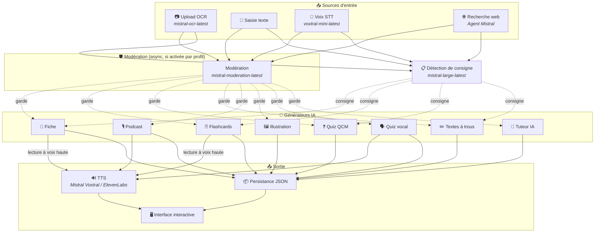
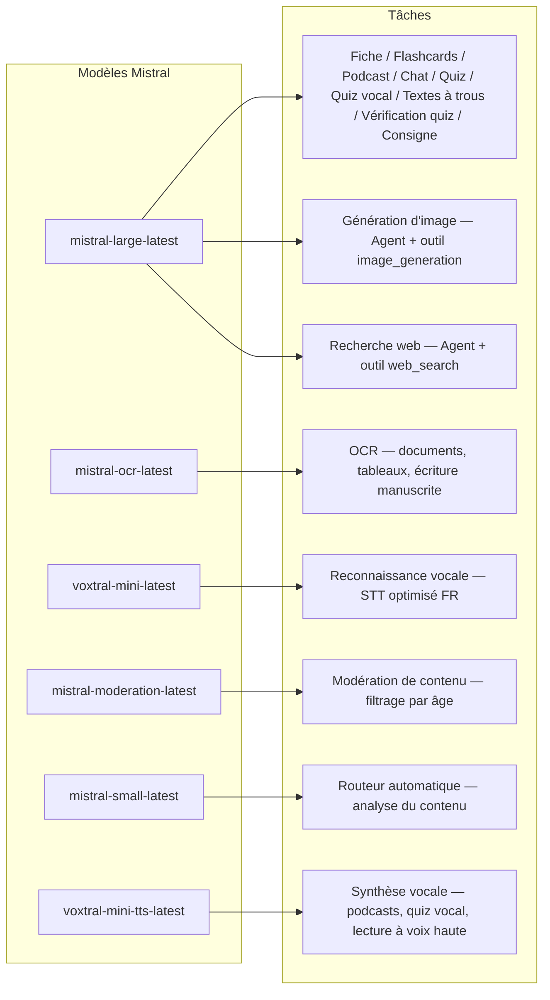
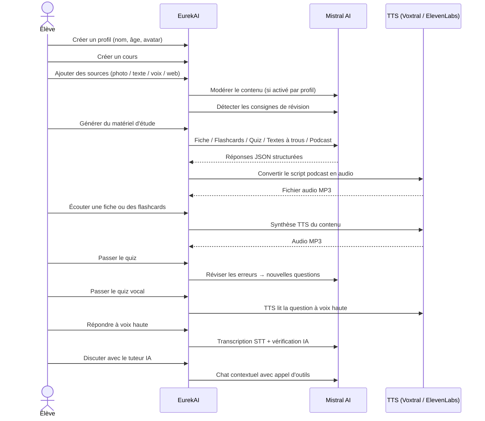

<p align="center">
  
</p>

<h1 align="center">EurekAI</h1>

<p align="center">
  <strong>किसी भी सामग्री को इंटरैक्टिव सीखने के अनुभव में बदलें — संचालित द्वारा <a href="https://mistral.ai">Mistral AI</a>.</strong>
</p>

<p align="center">
  <a href="README-en.md">🇬🇧 अंग्रेज़ी</a> · <a href="README-es.md">🇪🇸 स्पैनिश</a> · <a href="README-pt.md">🇧🇷 पुर्तगाली</a> · <a href="README-de.md">🇩🇪 जर्मन</a> · <a href="README-it.md">🇮🇹 इटालियन</a> · <a href="README-nl.md">🇳🇱 डच</a> · <a href="README-ar.md">🇸🇦 अरबी</a><br>
  <a href="README-hi.md">🇮🇳 हिन्दी</a> · <a href="README-zh.md">🇨🇳 चीनी</a> · <a href="README-ja.md">🇯🇵 जापानी</a> · <a href="README-ko.md">🇰🇷 कोरियाई</a> · <a href="README-pl.md">🇵🇱 पोलिश</a> · <a href="README-ro.md">🇷🇴 रोमानियाई</a> · <a href="README-sv.md">🇸🇪 स्वीडिश</a>
</p>

<p align="center">
  <a href="https://www.youtube.com/watch?v=_b1TQz2leoI"></a>
</p>

<h4 align="center">📊 कोड गुणवत्ता</h4>

<p align="center">
  <a href="https://sonarcloud.io/summary/new_code?id=jls42_EurekAI"></a>
  <a href="https://sonarcloud.io/summary/new_code?id=jls42_EurekAI"></a>
  <a href="https://sonarcloud.io/summary/new_code?id=jls42_EurekAI"></a>
  <a href="https://sonarcloud.io/summary/new_code?id=jls42_EurekAI"></a>
</p>
<p align="center">
  <a href="https://sonarcloud.io/summary/new_code?id=jls42_EurekAI"></a>
  <a href="https://sonarcloud.io/summary/new_code?id=jls42_EurekAI"></a>
  <a href="https://sonarcloud.io/summary/new_code?id=jls42_EurekAI"></a>
  <a href="https://sonarcloud.io/summary/new_code?id=jls42_EurekAI"></a>
</p>

---

## कहानी — क्यों EurekAI ?

**EurekAI** का जन्म [Mistral AI Worldwide Hackathon](https://luma.com/mistralhack-online) ([आधिकारिक साइट](https://worldwide-hackathon.mistral.ai/)) (मार्च 2026) के दौरान हुआ था। मुझे एक विषय चाहिए था — और विचार कुछ बहुत ठोस से आया: मैं नियमित रूप से अपनी बेटी के साथ टेस्ट की तैयारी करता/करती हूं, और मैंने सोचा कि IA की मदद से इसे और अधिक खेल-आधारित और इंटरैक्टिव बनाया जा सकता है।

लक्ष्य: किसी भी इनपुट को लें — एक मैन्युअल की फ़ोटो, कॉपी-पेस्ट किया गया टेक्स्ट, एक वॉइस रिकॉर्डिंग, एक वेब खोज — और उसे बदल दें **रिवीजन नोट्स, फ्लैशकार्ड, क्विज़, पॉडकास्ट, रिक्त स्थान भरने वाले टेक्स्ट, चित्रण, और अधिक** में। सभी फ्रेंच मॉडल Mistral AI द्वारा संचालित हैं, जो इसे फ्रेंच-भाषी छात्रों के लिए नेचुरली उपयुक्त बनाता है।

प्रोजेक्ट हैकाथॉन के दौरान शुरू हुआ, फिर बाहर जाकर विकसित और समृद्ध किया गया। संपूर्ण कोड IA द्वारा उत्पन्न है — मुख्यतः [Claude Code](https://docs.anthropic.com/en/docs/claude-code), कुछ योगदान [Codex](https://openai.com/index/introducing-codex/) के माध्यम से।

---

## सुविधाएँ

| | फ़ीचर | विवरण |
|---|---|---|
| 📷 | **OCR अपलोड** | अपने मैनुअल या नोट्स की फ़ोटो लें — Mistral OCR उससे सामग्री निकालेगा |
| 📝 | **टेक्स्ट प्रविष्टि** | कोई भी टेक्स्ट सीधे टाइप या पेस्ट करें |
| 🎤 | **वॉइस इनपुट** | खुद को रिकॉर्ड करें — Voxtral STT आपकी आवाज़ को ट्रांसक्राइब करता है |
| 🌐 | **वेब खोज** | एक प्रश्न पूछें — एक Mistral एजेंट वेब पर उत्तर ढूंढता है |
| 📄 | **रिवीजन नोट्स** | संरचित नोट्स: मुख्य बिंदु, शब्दावली, उद्धरण, उपाख्यान |
| 🃏 | **फ़्लैशकार्ड** | Q/A कार्ड स्रोत संदर्भ के साथ सक्रिय रिविज़न के लिए (संख्या कॉन्फ़िगर करने योग्य) |
| ❓ | **बहुविकल्पी क्विज़** | विकल्पों के साथ प्रश्न, त्रुटियों की अनुकूलन समीक्षा (संख्या कॉन्फ़िगर करने योग्य) |
| ✏️ | **रिक्त स्थान भरने वाले टेक्स्ट** | संकेतों और सहनशील सत्यापन के साथ अभ्यास |
| 🎙️ | **पॉडकास्ट** | 2-आवाज़ वाला मिनी-पॉडकास्ट, Mistral Voxtral TTS से ऑडियो |
| 🖼️ | **चित्रण** | एक Mistral एजेंट द्वारा उत्पन्न शैक्षिक छवियाँ |
| 🗣️ | **वॉइस क्विज़** | प्रश्न उच्चारित, मौखिक उत्तर, IA उत्तर की जाँच करता है |
| 💬 | **एआई ट्यूटर** | आपके कोर्स डॉक्युमेंट्स के साथ संदर्भ-समझने वाला चैट, टूल कॉल के साथ |
| 🧠 | **स्वचालित राउटर** | `mistral-small-latest` आधारित राउटर सामग्री का विश्लेषण करता है और उपलब्ध 7 प्रकार के जनरेटरों का संयोजन सुझाता है |
| 🔒 | **अभिभावकीय नियंत्रण** | आयु-आधारित मॉडरेशन, अभिभावकीय PIN, चैट प्रतिबंध |
| 🌍 | **बहुभाषी** | इंटरफ़ेस 9 भाषाओं में उपलब्ध; IA जनरेशन 15 भाषाओं में प्रॉम्प्ट द्वारा संचालित |
| 🔊 | **पढ़कर सुनें** | रिवीजन नोट्स और फ्लैशकार्ड Mistral Voxtral TTS या ElevenLabs के माध्यम से सुनें |

---

## आर्किटेक्चर का अवलोकन



---

## मॉडल उपयोग मानचित्र



---

## उपयोगकर्ता यात्रा



---

## गहराई में — सुविधाएँ

### मल्टी-मॉडल इनपुट

EurekAI 4 प्रकार के स्रोत स्वीकार करता है, प्रोफ़ाइल के अनुसार मॉडरेट किए जाते हैं (बच्चा और किशोर के लिए डिफ़ॉल्ट रूप से सक्षम):

- **OCR अपलोड** — JPG, PNG या PDF फाइलें `mistral-ocr-latest` द्वारा प्रोसेस की जाती हैं। प्रिंटेड टेक्स्ट, टेबल और हैंडराइटिंग को संभालता है।
- **खुला टेक्स्ट** — कोई भी कंटेंट टाइप या पेस्ट करें। अगर मॉडरेशन सक्रिय है तो स्टोरेज से पहले मॉडरेट किया जाता है।
- **वॉइस इनपुट** — ब्राउज़र में ऑडियो रिकॉर्ड करें। `voxtral-mini-latest` द्वारा ट्रांसक्राइब किया जाता है। पैरामीटर `language="fr"` पहचान को ऑप्टिमाइज़ करता है।
- **वेब खोज** — एक क्वेरी दर्ज करें। अस्थायी Mistral एजेंट टूल `web_search` के साथ परिणाम लाता और सारांश बनाता है।

### IA कंटेंट जनरेशन

सात प्रकार के शिक्षण सामग्री जनरेटर:

| जनरेटर | मॉडल | आउटपुट |
|---|---|---|
| **रिवीजन नोट** | `mistral-large-latest` | शीर्षक, सारांश, मुख्य बिंदु, शब्दावली, उद्धरण, उपाख्यान |
| **फ़्लैशकार्ड** | `mistral-large-latest` | स्रोत संदर्भ के साथ Q/A कार्ड (संख्या कॉन्फ़िगर करने योग्य) |
| **बहुविकल्पी क्विज़** | `mistral-large-latest` | MCQ, स्पष्टीकरण, अनुकूलन समीक्षा (संख्या कॉन्फ़िगर करने योग्य) |
| **रिक्त स्थान भरने वाले टेक्स्ट** | `mistral-large-latest` | संकेतों के साथ भरने के लिए वाक्य, सहनशील सत्यापन (Levenshtein) |
| **पॉडकास्ट** | `mistral-large-latest` + Voxtral TTS | 2-आवाज़ स्क्रिप्ट → MP3 ऑडियो |
| **चित्रण** | एजेंट `mistral-large-latest` | टूल `image_generation` के माध्यम से शैक्षिक छवि |
| **वॉइस क्विज़** | `mistral-large-latest` + Voxtral TTS + STT | TTS प्रश्न → STT उत्तर → IA सत्यापन |

### चैट द्वारा एआई ट्यूटर

एक वार्तालापात्मक ट्यूटर जिसे कोर्स दस्तावेज़ों तक पूर्ण पहुँच है:

- उपयोग करता है `mistral-large-latest`
- **टूल कॉल** : बातचीत के दौरान नोट्स, फ़्लैशकार्ड, क्विज़ या रिक्त स्थान भरने वाले टेक्स्ट जेनरेट कर सकता है
- प्रति कोर्स 50 संदेशों का इतिहास
- अगर सक्रिय हो तो कंटेंट मॉडरेशन लागू

### स्वचालित राउटर

राउटर स्रोत सामग्री का विश्लेषण करने के लिए `mistral-small-latest` का उपयोग करता है और उपलब्ध 7 जनरेटरों में से सबसे उपयुक्त सुझाता है। UI वास्तविक समय में प्रगति दिखाती है: पहले विश्लेषण चरण, फिर व्यक्तिगत जेनरेशन्स जिनमें रद्द करने का विकल्प होता है।

### अनुकूलनशील अधिगम

- **क्विज़ आँकड़े** : प्रश्नों के प्रयासों और सटीकता का ट्रैक
- **क्विज़ रिवीजन** : कमजोर अवधारणाओं पर लक्षित 5-10 नए प्रश्न उत्पन्न करता है
- **निर्देश पहचान** : रिविजन निर्देशों का पता लगाता है ("मैं अपना पाठ जानता हूँ अगर मैं जानता हूँ...") और उन्हें टेक्स्ट जनरेटरों में प्राथमिकता देता है (नोट्स, फ़्लैशकार्ड, क्विज़, रिक्त स्थान भरने वाले टेक्स्ट)

### सुरक्षा एवं अभिभावकीय नियंत्रण

- **4 आयु समूह** : बच्चा (≤10 वर्ष), किशोर (11-15), छात्र (16-25), वयस्क (26+)
- **कंटेंट मॉडरेशन** : `mistral-moderation-latest` जिसमें बच्चे/किशोर के लिए 5 श्रेणियाँ ब्लॉक हैं (`sexual`, `hate_and_discrimination`, `violence_and_threats`, `selfharm`, `jailbreaking`), छात्र/वयस्क के लिए कोई प्रतिबंध नहीं
- **अभिभावकीय PIN** : SHA-256 हैश, 15 साल से कम प्रोफाइल के लिए आवश्यक। प्रोडक्शन डिप्लॉयमेंट के लिए स्लो हैश और सॉल्ट (Argon2id, bcrypt) का उपयोग करें।
- **चैट प्रतिबंध** : 16 वर्ष से कम के लिए डिफ़ॉल्ट रूप से एआई चैट अक्षम, माता-पिता द्वारा सक्रिय किया जा सकता है

### मल्टी-प्रोफ़ाइल प्रणाली

- कई प्रोफ़ाइल नाम, आयु, अवतार, भाषा प्राथमिकताओं के साथ
- प्रोफ़ाइल से जुड़े प्रोजेक्ट्स `profileId` के माध्यम से
- कैस्केड निष्कासन: किसी प्रोफ़ाइल को हटाने पर उसके सभी प्रोजेक्ट्स हट जाते हैं

### मल्टी-प्रोवाईडर TTS

- **Mistral Voxtral TTS** (डिफ़ॉल्ट) : `voxtral-mini-tts-latest`, अतिरिक्त कुंजी की आवश्यकता नहीं
- **ElevenLabs** (वैकल्पिक) : `eleven_v3`, प्राकृतिक वॉइस, आवश्यकता `ELEVENLABS_API_KEY`
- प्रोवाइडर ऐप सेटिंग्स में कॉन्फ़िगर करने योग्य

### अंतर्राष्ट्रीयकरण

- इंटरफ़ेस 9 भाषाओं में उपलब्ध: fr, en, es, pt, it, nl, de, hi, ar
- IA प्रॉम्प्ट 15 भाषाओं का समर्थन करते हैं (fr, en, es, de, it, pt, nl, ja, zh, ko, ar, hi, pl, ro, sv)
- भाषा प्रोफ़ाइल द्वारा कॉन्फ़िगर की जा सकती है

---

## टेक स्टैक

| परत | प्रौद्योगिकी | भूमिका |
|---|---|---|
| **Runtime** | Node.js + TypeScript 6.x | सर्वर और प्रकार-सुरक्षा |
| **Backend** | Express 5.x | REST API |
| **डेव सर्वर** | Vite 8.x (Rolldown) + tsx | HMR, handlebars partials, proxy |
| **Frontend** | HTML + TailwindCSS 4.x + Alpine.js 3.x | प्रतिक्रियाशील इंटरफ़ेस, Vite द्वारा TypeScript संकलित |
| **टेम्पलेटिंग** | vite-plugin-handlebars | partials के जरिए HTML संयोजन |
| **IA** | Mistral AI SDK 2.x | चैट, OCR, STT, TTS, एजेंट्स, मॉडरेशन |
| **TTS (डिफ़ॉल्ट)** | Mistral Voxtral TTS | `voxtral-mini-tts-latest`, इनबिल्ट वॉइस सिंथेसिस |
| **TTS (वैकल्पिक)** | ElevenLabs SDK 2.x | `eleven_v3`, प्राकृतिक वॉइस |
| **आइकन** | Lucide 1.x | SVG आइकन लाइब्रेरी |
| **Markdown** | Marked | चैट में Markdown रेंडरिंग |
| **फाइल अपलोड** | Multer 2.x | multipart फॉर्म हैंडलिंग |
| **ऑडियो** | ffmpeg-static | ऑडियो सेगमेंट्स का संयोजन |
| **टेस्ट्स** | Vitest | यूनिट टेस्ट — कवरेज SonarCloud से मापा गया |
| **पर्सिस्टेंस** | JSON फाइलें | निर्भरता-रहित स्टोरेज |

---

## मॉडल संदर्भ

| मॉडल | उपयोग | क्यों |
|---|---|---|
| `mistral-large-latest` | नोट्स, फ़्लैशकार्ड, पॉडकास्ट, क्विज़, रिक्त स्थान भरना, चैट, वॉइस क्विज़ सत्यापन, इमेज एजेंट, वेब सर्च एजेंट, निर्देश पहचान | बहुभाषी + निर्देश पालन में सर्वश्रेष्ठ |
| `mistral-ocr-latest` | दस्तावेज़ OCR | प्रिंटेड टेक्स्ट, तालिकाएँ, हैंडराइटिंग |
| `voxtral-mini-latest` | वॉइस रिकग्निशन (STT) | मल्टीलिंगुअल STT, `language="fr"` के साथ ऑप्टिमाइज़्ड |
| `voxtral-mini-tts-latest` | वॉइस सिंथेसिस (TTS) | पॉडकास्ट, वॉइस क्विज़, पढ़कर सुनाना |
| `mistral-moderation-latest` | कंटेंट मॉडरेशन | बच्चे/किशोर के लिए 5 ब्लॉक श्रेणियाँ (+ jailbreaking) |
| `mistral-small-latest` | स्वचालित राउटर | रूटिंग निर्णयों के लिए तेज़ सामग्री विश्लेषण |
| `eleven_v3` (ElevenLabs) | वॉइस सिंथेसिस (वैकल्पिक TTS) | प्राकृतिक वॉइसेज़, वैकल्पिक कॉन्फ़िगर योग्य |

---

## त्वरित शुरुआत

```bash
# Cloner le dépôt
git clone https://github.com/jls42/EurekAI.git
cd EurekAI

# Installer les dépendances
npm install

# Configurer les clés API
cp .env.example .env
# Éditez .env avec vos clés :
#   MISTRAL_API_KEY=votre_clé_ici           (requis)
#   ELEVENLABS_API_KEY=votre_clé_ici        (optionnel, TTS alternatif)
#   SONAR_TOKEN=...                          (optionnel, CI SonarCloud uniquement)

# Lancer le développement
npm run dev
# → Backend :  http://localhost:3000 (API)
# → Frontend : http://localhost:5173 (serveur Vite avec HMR)
```

> **नोट** : Mistral Voxtral TTS डिफ़ॉल्ट प्रोवाइडर है — `MISTRAL_API_KEY` के अलावा कोई अतिरिक्त कुंजी आवश्यक नहीं। ElevenLabs वैकल्पिक TTS प्रोवाइडर है जिसे सेटिंग्स में कॉन्फ़िगर किया जा सकता है।

---

## परियोजना संरचना

```
server.ts                 — Point d'entrée Express, monte les routes + config
config.ts                 — Config runtime (modèles, voix, TTS provider), persistée dans output/config.json
store.ts                  — ProjectStore : CRUD projets/sources/générations, persistance JSON
profiles.ts               — ProfileStore : gestion des profils, hachage PIN
types.ts                  — Types TypeScript : Source, Generation (7 types), QuizStats, Profile
prompts.ts                — Tous les prompts IA centralisés (system + user templates, 15 langues)

generators/
  ocr.ts                  — Upload + OCR via Mistral (JPG, PNG, PDF)
  summary.ts              — Génération de fiche de révision (JSON structuré)
  flashcards.ts           — Flashcards Q/R (5-50, configurable)
  quiz.ts                 — Quiz QCM (5-50 questions, configurable) + révision adaptative
  fill-blank.ts           — Exercices à trous avec validation tolérante
  podcast.ts              — Script podcast 2 voix
  quiz-vocal.ts           — Quiz vocal : questions TTS + réponses STT + vérification IA
  image.ts                — Génération d'image via Agent Mistral (outil image_generation)
  chat.ts                 — Tuteur IA par chat avec appel d'outils
  router.ts               — Routeur automatique (contenu → générateurs recommandés)
  consigne.ts             — Détection de consignes de révision
  tts-provider.ts         — Dispatch TTS multi-provider (Mistral Voxtral / ElevenLabs)
  tts.ts                  — Génération audio podcast (concaténation de segments)
  stt.ts                  — Voxtral STT (audio → texte)
  websearch.ts            — Agent Mistral avec outil web_search
  moderation.ts           — Modération de contenu (filtrage par âge)

routes/
  projects.ts             — CRUD projets
  profiles.ts             — CRUD profils avec gestion du PIN
  sources.ts              — Upload OCR, texte libre, voix STT, recherche web, modération
  generate.ts             — Endpoints de génération (7 types + auto + route)
  generations.ts          — Tentatives de quiz/fill-blank, réponses vocales, lecture à voix haute
  chat.ts                 — Chat IA avec appel d'outils

helpers/
  index.ts                — getContent, stripJsonMarkdown, safeParseJson, unwrapJsonArray, extractAllText, timer
  audio.ts                — collectStream (ReadableStream → Buffer)
  fill-blank-validate.ts  — Validation tolérante des réponses (normalisation, Levenshtein)
  diversity.ts            — Diversité des générations (exclusion du contenu déjà produit, randomSeed)

src/                      — Frontend (Vite + Handlebars)
  index.html              — Point d'entrée HTML principal
  main.ts                 — Entrée frontend (init Alpine.js + icônes Lucide)
  app/                    — Modules applicatifs Alpine.js
    state.ts              — Gestion d'état réactif
    navigation.ts         — Routage des vues + gardes par âge
    profiles.ts           — Logique du sélecteur de profils
    projects.ts           — CRUD des cours
    sources.ts            — Gestionnaires d'upload de sources
    generate.ts           — Déclencheurs de génération (individuel, tout, auto 2 phases)
    generations.ts        — Affichage + actions sur les générations
    chat.ts               — Interface de chat
    config.ts             — Interface de configuration (modèles, voix, TTS provider)
    render.ts             — Helpers de rendu HTML
    i18n.ts               — Changement de langue
    ...
  components/
    quiz.ts               — Composant quiz interactif
    quiz-vocal.ts         — Composant quiz vocal
    fill-blank.ts         — Composant textes à trous
    flashcards.ts         — Composant flashcards avec retournement
    step-by-step.ts       — Mixin navigation pas-à-pas (quiz, fill-blank, flashcards)
  i18n/
    fr.ts, en.ts, es.ts, — Dictionnaires par langue (9 langues)
    pt.ts, it.ts, nl.ts,
    de.ts, hi.ts, ar.ts
    languages.ts          — Registre des langues UI disponibles
    index.ts              — Chargeur i18n
  partials/               — Partials HTML Handlebars (header, sidebar, dialogues, vues)
  styles/
    main.css              — Entrée TailwindCSS
    theme.css             — Variables de thème personnalisées

public/assets/            — Ressources statiques (logo, avatars)
output/                   — Données d'exécution (projets, config, fichiers audio)
```

---

## एपीआई संदर्भ

### कॉन्फ़िग
| मेथड | एंडपॉइंट | विवरण |
|---|---|---|
| `GET` | `/api/config` | वर्तमान कॉन्फ़िग |
| `PUT` | `/api/config` | कॉन्फ़िग बदलें (मॉडल, वॉइस, TTS प्रोवाइडर) |
| `GET` | `/api/config/status` | API स्टेटस (Mistral, ElevenLabs, TTS) |
| `POST` | `/api/config/reset` | डिफ़ॉल्ट कॉन्फ़िग रीसेट करें |
| `GET` | `/api/config/voices` | Mistral TTS वॉइसेज़ सूचीबद्ध करें (वैकल्पिक `?lang=fr`) |

### प्रोफ़ाइल
| मेथड | एंडपॉइंट | विवरण |
|---|---|---|
| `GET` | `/api/profiles` | सभी प्रोफ़ाइल सूचीबद्ध करें |
| `POST` | `/api/profiles` | एक प्रोफ़ाइल बनाएं |
| `PUT` | `/api/profiles/:id` | प्रोफ़ाइल संपादित करें (PIN < 15 वर्ष के लिए आवश्यक) |
| `DELETE` | `/api/profiles/:id` | प्रोफ़ाइल + प्रोजेक्ट्स कैस्केड हटाएं `{pin?}` → `{ok, deletedProjects}` |

### प्रोजेक्ट्स
| मेथड | एंडपॉइंट | विवरण |
|---|---|---|
| `GET` | `/api/projects` | प्रोजेक्ट्स सूचीबद्ध करें (`?profileId=` वैकल्पिक) |
| `POST` | `/api/projects` | एक प्रोजेक्ट बनाएं `{name, profileId}` |
| `GET` | `/api/projects/:pid` | प्रोजेक्ट विवरण |
| `PUT` | `/api/projects/:pid` | नाम बदलें `{name}` |
| `DELETE` | `/api/projects/:pid` | प्रोजेक्ट हटाएं |

### स्रोत
| मेथड | एंडपॉइंट | विवरण |
|---|---|---|
| `POST` | `/api/projects/:pid/sources/upload` | OCR अपलोड (multipart फाइलें) |
| `POST` | `/api/projects/:pid/sources/text` | खुला टेक्स्ट `{text}` |
| `POST` | `/api/projects/:pid/sources/voice` | वॉइस STT (ऑडियो multipart) |
| `POST` | `/api/projects/:pid/sources/websearch` | वेब खोज `{query}` |
| `DELETE` | `/api/projects/:pid/sources/:sid` | एक स्रोत हटाएं |
| `POST` | `/api/projects/:pid/moderate` | मॉडरेट करें `{text}` |
| `POST` | `/api/projects/:pid/detect-consigne` | रिविजन निर्देश का पता लगाएँ |

### जनरेशन
| मेथड | एंडपॉइंट | विवरण |
|---|---|---|
| `POST` | `/api/projects/:pid/generate/summary` | रिवीजन नोट्स |
| `POST` | `/api/projects/:pid/generate/flashcards` | फ़्लैशकार्ड |
| `POST` | `/api/projects/:pid/generate/quiz` | बहुविकल्पी क्विज़ |
| `POST` | `/api/projects/:pid/generate/fill-blank` | रिक्त स्थान भरने वाले टेक्स्ट |
| `POST` | `/api/projects/:pid/generate/podcast` | पॉडकास्ट |
| `POST` | `/api/projects/:pid/generate/image` | चित्रण |
| `POST` | `/api/projects/:pid/generate/quiz-vocal` | वॉइस क्विज़ |
| `POST` | `/api/projects/:pid/generate/quiz-review` | अनुकूलनशील रिवीजन `{generationId, weakQuestions}` |
| `POST` | `/api/projects/:pid/generate/route` | रूटिंग विश्लेषण (कौन से जनरेटर चलाने हैं) |
| `POST` | `/api/projects/:pid/generate/auto` | ऑटो बैकएंड जनरेशन (राउटिंग + 5 प्रकार: सारांश, फ्लैशकार्ड, क्विज़, रिक्त स्थान, पॉडकास्ट) |

सभी जनरेशन रूट्स `{sourceIds?, lang?, ageGroup?, count?, useConsigne?}` स्वीकार करते हैं। `quiz-review` के लिए अतिरिक्त `{generationId, weakQuestions}` आवश्यक है।

### CRUD जनरेशन्स
| मेथड | एंडपॉइंट | विवरण |
|---|---|---|
| `POST` | `/api/projects/:pid/generations/:gid/quiz-attempt` | क्विज़ उत्तर सबमिट करें `{answers}` |
| `POST` | `/api/projects/:pid/generations/:gid/fill-blank-attempt` | रिक्त स्थान उत्तर सबमिट करें `{answers}` |
| `POST` | `/api/projects/:pid/generations/:gid/vocal-answer` | मौखिक उत्तर सत्यापित करें (ऑडियो + questionIndex) |
| `POST` | `/api/projects/:pid/generations/:gid/read-aloud` | TTS पढ़कर सुनाना (नोट्स/फ़्लैशकार्ड) |
| `PUT` | `/api/projects/:pid/generations/:gid` | नाम बदलें `{title}` |
| `DELETE` | `/api/projects/:pid/generations/:gid` | जनरेशन हटाएँ |

### चैट
| मेथड | एंडपॉइंट | विवरण |
|---|---|---|
| `GET` | `/api/projects/:pid/chat` | चैट इतिहास प्राप्त करें |
| `POST` | `/api/projects/:pid/chat` | एक संदेश भेजें `{message, lang, ageGroup}` |
| `DELETE` | `/api/projects/:pid/chat` | चैट इतिहास मिटाएँ |

---

## आर्किटेक्चरल निर्णय

| निर्णय | औचित्य |
|---|---|
| **React/Vue के बजाय Alpine.js** | न्यूनतम फ़ुटप्रिंट, Vite द्वारा संकलित TypeScript के साथ हल्की प्रतिक्रियाशीलता। हैकाथॉन के लिए तेज़ विकास के लिए उपयुक्त। |
| **JSON फाइलों में पर्सिस्टेंस** | ज़ीरो डिपेंडेंसी, त्वरित स्टार्ट। कोई डेटाबेस कॉन्फ़िगरेशन आवश्यक नहीं — तुरंत चालू हो जाएँ। |
| **Vite + Handlebars** | दोनों दुनियाओं का सर्वश्रेष्ठ: विकास के लिए तेज़ HMR, कोड के आयोजन के लिए HTML partials, Tailwind JIT। |
| **Prompts centralisés** | सभी AI प्रॉम्प्ट `prompts.ts` में — भाषा/आयु समूह के अनुसार दोहराना, परीक्षण और अनुकूलित करना आसान। |
| **Système multi-générations** | प्रत्येक जनरेशन एक स्वतंत्र ऑब्जेक्ट है जिसका अपना ID होता है — कोर्स के लिए कई वर्कशीट, क्विज़ आदि संभव। |
| **Prompts adaptés par âge** | 4 आयु समूह जिनमें शब्दावली, जटिलता और लहजा भिन्न होते हैं — समान सामग्री सीखने वाले के अनुसार अलग तरीके से पढ़ाती है। |
| **Fonctionnalités basées sur les Agents** | इमेज जनरेशन और वेब खोज अस्थायी Mistral एजेंट्स का उपयोग करती हैं — स्वच्छ जीवनचक्र और स्वचालित क्लीनअप। |
| **TTS multi-provider** | डिफ़ॉल्ट रूप से Mistral Voxtral TTS (कोई अतिरिक्त कुंजी नहीं), वैकल्पिक के रूप में ElevenLabs — बिना पुनरारंभ के कॉन्फ़िगर करने योग्य। |

---

## श्रेय और धन्यवाद

- **[Mistral AI](https://mistral.ai)** — AI मॉडल (Large, OCR, Voxtral STT, Voxtral TTS, Moderation, Small) + Worldwide Hackathon
- **[ElevenLabs](https://elevenlabs.io)** — वैकल्पिक वॉइस सिंथेसिस इंजन (`eleven_v3`)
- **[Alpine.js](https://alpinejs.dev)** — हल्का रिएक्टिव फ़्रेमवर्क
- **[TailwindCSS](https://tailwindcss.com)** — यूटिलिटी-आधारित CSS फ्रेमवर्क
- **[Vite](https://vitejs.dev)** — फ्रंटएंड बिल्ड टूल
- **[Lucide](https://lucide.dev)** — आइकन लाइब्रेरी
- **[Marked](https://marked.js.org)** — Markdown पार्सर

Mistral AI Worldwide Hackathon (मार्च 2026) के दौरान शुरू किया गया, पूरी तरह से AI द्वारा Claude Code और Codex के साथ विकसित।

---

## लेखक

**Julien LS** — [contact@jls42.org](mailto:contact@jls42.org)

## लाइसेंस

[AGPL-3.0](LICENSE) — कॉपीराइट (C) 2026 Julien LS

**यह दस्तावेज़ फ्रांसीसी संस्करण से हिंदी भाषा में gpt-5-mini मॉडल का उपयोग करके अनुवादित किया गया है। अधिक जानकारी के लिए अनुवाद प्रक्रिया देखें https://gitlab.com/jls42/ai-powered-markdown-translator**

