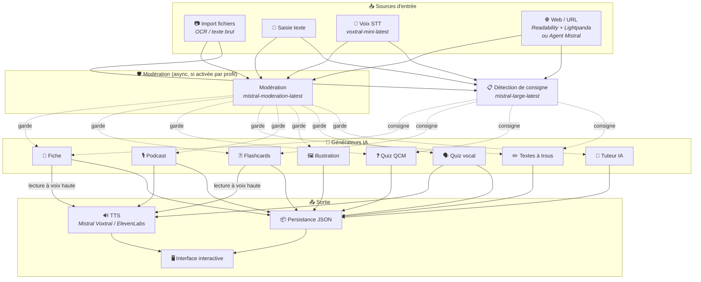
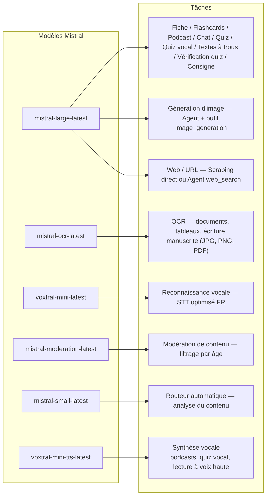
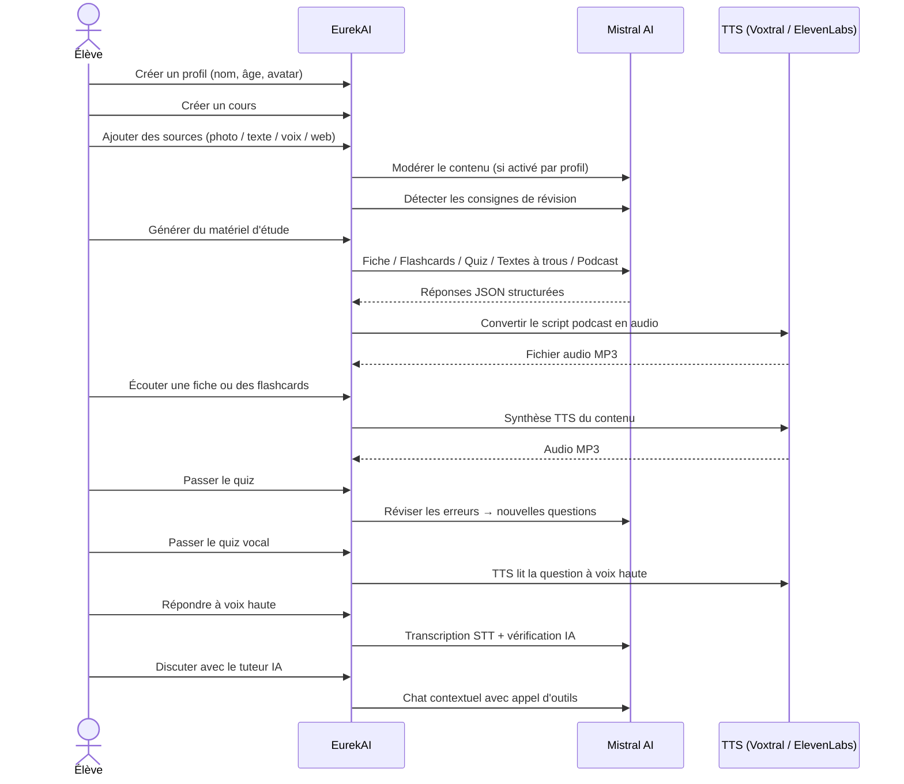

<p align="center">
  
</p>

<h1 align="center">EurekAI</h1>

<p align="center">
  <strong>किसी भी सामग्री को इंटरैक्टिव सीखने के अनुभव में बदलें — Mistral AI द्वारा संचालित।</strong>
</p>

<p align="center">
  <a href="README-en.md">🇬🇧 अंग्रेज़ी</a> · <a href="README-es.md">🇪🇸 स्पैनिश</a> · <a href="README-pt.md">🇧🇷 पुर्तगाली</a> · <a href="README-de.md">🇩🇪 जर्मन</a> · <a href="README-it.md">🇮🇹 इतालवी</a> · <a href="README-nl.md">🇳🇱 डच</a> · <a href="README-ar.md">🇸🇦 अरबी</a><br>
  <a href="README-hi.md">🇮🇳 हिन्दी</a> · <a href="README-zh.md">🇨🇳 चीनी</a> · <a href="README-ja.md">🇯🇵 जापानी</a> · <a href="README-ko.md">🇰🇷 कोरियाई</a> · <a href="README-pl.md">🇵🇱 पोलिश</a> · <a href="README-ro.md">🇷🇴 रोमानियाई</a> · <a href="README-sv.md">🇸🇪 स्वीडिश</a>
</p>

<p align="center">
  <a href="https://www.youtube.com/watch?v=_b1TQz2leoI"></a>
</p>

<h4 align="center">📊 कोड गुणवत्ता</h4>

<p align="center">
  <a href="https://sonarcloud.io/summary/new_code?id=jls42_EurekAI"></a>
  <a href="https://sonarcloud.io/summary/new_code?id=jls42_EurekAI"></a>
  <a href="https://sonarcloud.io/summary/new_code?id=jls42_EurekAI"></a>
  <a href="https://sonarcloud.io/summary/new_code?id=jls42_EurekAI"></a>
</p>
<p align="center">
  <a href="https://sonarcloud.io/summary/new_code?id=jls42_EurekAI"></a>
  <a href="https://sonarcloud.io/summary/new_code?id=jls42_EurekAI"></a>
  <a href="https://sonarcloud.io/summary/new_code?id=jls42_EurekAI"></a>
  <a href="https://sonarcloud.io/summary/new_code?id=jls42_EurekAI"></a>
</p>

---

## कहानी — क्यों EurekAI ?

**EurekAI** का जन्म [Mistral AI Worldwide Hackathon](https://luma.com/mistralhack-online) ([आधिकारिक साइट](https://worldwide-hackathon.mistral.ai/)) के दौरान हुआ (मार्च 2026)। मुझे एक विषय की ज़रूरत थी — और विचार कुछ बहुत ठोस से आया: मैं नियमित रूप से अपनी बेटी के साथ टेस्ट की तैयारी करता/करती हूँ, और मैंने सोचा कि IA की मदद से इसे और अधिक मज़ेदार व इंटरैक्टिव बनाया जा सकता है।

लक्ष्य: किसी भी इनपुट को लेना — पाठ का फोटो, कॉपी-पेस्ट किया हुआ टेक्स्ट, वॉइस रिकॉर्डिंग, वेब खोज — और उसे बदलना: **रिवीजन नोट्स, फ्लैशकार्ड, क्विज़, पॉडकास्ट, रिक्त-स्थान वाले पाठ, चित्र, और भी बहुत कुछ**। सब कुछ Mistral AI के फ्रेंच मॉडल्स द्वारा संचालित, जो इसे फ्रेंच भाषी छात्रों के लिए स्वाभाविक रूप से उपयुक्त बनाता है।

[प्रारंभिक प्रोटोटाइप](https://github.com/jls42/worldwide-hackathon.mistral.ai) हैकाथॉन के दौरान 48 घंटे में Mistral सेवाओं के चारों ओर प्रमाण-कल्पना के रूप में बनाया गया था — पहले से कार्यशील पर सीमित। तब से, EurekAI एक पूर्ण परियोजना बन गया है: रिक्त-स्थान पाठ, अभ्यासों में नेविगेशन, वेब स्क्रैपिंग, कॉन्फ़िग करने योग्य पेरेंटल मॉडरेशन, गहरे कोड रिव्यू, और बहुत कुछ। पूरे कोड को AI द्वारा जनरेट किया गया है — मुख्य रूप से [Claude Code](https://code.claude.com/), साथ में कुछ योगदान [Codex](https://openai.com/codex/) और [Gemini CLI](https://geminicli.com/) के माध्यम से।

---

## विशेषताएँ

| | विशिष्टता | विवरण |
|---|---|---|
| 📷 | **फ़ाइल इम्पोर्ट** | अपनी कक्षाएँ इम्पोर्ट करें — फोटो, PDF (Mistral OCR के माध्यम से) या टेक्स्ट फ़ाइल (TXT, MD) |
| 📝 | **टेक्स्ट इनपुट** | किसी भी टेक्स्ट को सीधे टाइप या पेस्ट करें |
| 🎤 | **वॉइस इनपुट** | अपनी आवाज़ रिकॉर्ड करें — Voxtral STT आपकी आवाज़ को ट्रांसक्राइब करता है |
| 🌐 | **वेब / URL** | एक URL पेस्ट करें (Readability + Lightpanda द्वारा डायरेक्ट स्क्रैपिंग) या एक खोज टाइप करें (Agent Mistral web_search) |
| 📄 | **रिवीजन नोट्स** | संरचित नोट्स: प्रमुख बिंदु, शब्दावली, उद्धरण, अनोदाएँ |
| 🃏 | **फ्लैशकार्ड** | स्रोत संदर्भों के साथ Q/A कार्ड्स (सक्रिय स्मृति के लिए, संख्या कॉन्फ़िगर करने योग्य) |
| ❓ | **बहुविकल्पी क्विज़ (QCM)** | मल्टीचॉइस प्रश्न, त्रुटियों की अनुकूलनशील समीक्षा (संख्या कॉन्फ़िगर करने योग्य) |
| ✏️ | **रिक्त स्थान भरने वाले पाठ** | संकेतों और सहनशील सत्यापन के साथ पूरा करने के अभ्यास |
| 🎙️ | **पॉडकास्ट** | 2-वॉइस मिनी-पॉडकास्ट — डिफ़ॉल्ट Mistral वॉइस या कस्टम वॉइस (माता-पिता!) |
| 🖼️ | **चित्र** | एजेंट Mistral द्वारा जनरेट किए गए शैक्षिक चित्र |
| 🗣️ | **वॉइस क्विज़** | प्रश्न उच्चारण (कस्टम वॉइस संभव), मौखिक उत्तर, IA सत्यापन |
| 💬 | **एआई ट्यूटर** | अपने पाठ्य दस्तावेज़ों के साथ संदर्भ-आधारित चैट, टूल कॉल्स के साथ |
| 🧠 | **ऑटोमैटिक राउटर** | `mistral-small-latest` पर आधारित एक राउटर जो सामग्री का विश्लेषण कर उपलब्ध 7 जनरेशन प्रकारों में संयोजन का प्रस्ताव देता है |
| 🔒 | **पेरेंटल कंट्रोल** | प्रोफ़ाइल द्वारा कॉन्फ़िग करने योग्य मॉडरेशन (कस्टम श्रेणियाँ), पेरेंटल PIN, चैट प्रतिबंध |
| 🌍 | **बहुभाषी** | इंटरफ़ेस 9 भाषाओं में उपलब्ध; IA जनरेशन 15 भाषाओं में प्रॉम्प्ट के माध्यम से नियंत्रित |
| 🔊 | **वॉइस रीडिंग** | Mistral Voxtral TTS या ElevenLabs के माध्यम से नोट्स और फ्लैशकार्ड सुनें |

---

## आर्किटेक्चर का अवलोकन



---

## मॉडल उपयोग मानचित्र



---

## उपयोगकर्ता प्रवाह



---

## गहराई से — विशेषताएँ

### मल्टी-मोडल इनपुट

EurekAI चार प्रकार के स्रोत स्वीकार करता है, प्रोफ़ाइल के अनुसार मॉडरेट किए जाते हैं (डिफ़ॉल्ट रूप से बच्चा और किशोर के लिए सक्रिय):

- **फ़ाइल इम्पोर्ट** — JPG, PNG या PDF फ़ाइलें `mistral-ocr-latest` द्वारा संसाधित (प्रिंटेड टेक्स्ट, टेबल्स, हस्तलिखित लेखन), या टेक्स्ट फाइलें (TXT, MD) सीधे इम्पोर्ट की जाती हैं।
- **मुक्त पाठ** — किसी भी सामग्री को टाइप या पेस्ट करें। यदि मॉडरेशन सक्रिय है तो स्टोरेज से पहले मॉडरेट किया जाता है।
- **वॉइस इनपुट** — ब्राउज़र में ऑडियो रिकॉर्ड करें। `voxtral-mini-latest` द्वारा ट्रांसक्राइब किया जाता है। `language="fr"` पैरामीटर मान्यता को अनुकूलित करता है।
- **वेब / URL** — एक या अधिक URLs पेस्ट करें ताकि सामग्री सीधे स्क्रैप की जा सके (Readability + Lightpanda जावास्क्रिप्ट पृष्ठों के लिए), या Agent Mistral द्वारा वेब खोज के लिए कीवर्ड टाइप करें। एकल फ़ील्ड दोनों को स्वीकार करता है — URLs और कीवर्ड स्वतः अलग किए जाते हैं, और हर परिणाम एक स्वतंत्र स्रोत बनाता है।

### IA द्वारा सामग्री जनरेशन

सात प्रकार के लर्निंग सामग्री जनरेटर:

| जेनरेटर | मॉडल | आउटपुट |
|---|---|---|
| **रिवीजन नोट** | `mistral-large-latest` | टाइटल, सार, मुख्य बिंदु, शब्दावली, उद्धरण, अनोदया |
| **फ्लैशकार्ड** | `mistral-large-latest` | स्रोत संदर्भों के साथ Q/A कार्ड्स (संख्या कॉन्फ़िगर करने योग्य) |
| **बहुविकल्पी क्विज़ (QCM)** | `mistral-large-latest` | मल्टीचॉइस प्रश्न, स्पष्टीकरण, अनुकूलनशील समीक्षा (संख्या कॉन्फ़िगर करने योग्य) |
| **रिक्त स्थान भरने वाले पाठ** | `mistral-large-latest` | संकेतों के साथ वाक्य, सहनशील सत्यापन (Levenshtein) |
| **पॉडकास्ट** | `mistral-large-latest` + Voxtral TTS | 2-वॉइस स्क्रिप्ट → MP3 ऑडियो |
| **चित्र** | एजेंट `mistral-large-latest` | टूल `image_generation` के माध्यम से शैक्षिक इमेज |
| **वॉइस क्विज़** | `mistral-large-latest` + Voxtral TTS + STT | प्रश्न TTS → उत्तर STT → IA द्वारा सत्यापन |

### चैट के माध्यम से एआई ट्यूटर

दस्तावेज़ों तक पूर्ण पहुँच वाला एक संवादात्मक ट्यूटर:

- उपयोग करता है `mistral-large-latest`
- **टूल कॉल्स**: बातचीत के दौरान यह रिवीजन नोट्स, फ्लैशकार्ड, क्विज़ या रिक्त-स्थान वाले पाठ जनरेट कर सकता है
- प्रति कोर्स 50 संदेशों का इतिहास
- प्रोफ़ाइल में सक्रिय होने पर कंटेंट मॉडरेशन

### ऑटोमैटिक राउटर

राउटर स्रोतों की सामग्री का विश्लेषण करने के लिए `mistral-small-latest` का उपयोग करता है और उपलब्ध 7 जनरेटर में सबसे उपयुक्त सुझाता है। इंटरफ़ेस रीयल-टाइम प्रगति दिखाता है: पहले विश्लेषण चरण, फिर व्यक्तिगत जनरेशन जिनमें रद्द करना संभव है।

### अनुकूलित अधिगम

- **क्विज़ आँकड़े**: प्रश्नों द्वारा प्रयासों और सटीकता का ट्रैक
- **क्विज़ रिव्यू**: कमजोर अवधारणाओं को लक्षित करते हुए 5-10 नए प्रश्न जेनरेट करता है
- **निर्देश पहचान**: रिवीजन निर्देशों का पता लगाता है ("मैं अपनी पढ़ाई तब जानता/जानती हूँ जब...") और उन्हें उपयुक्त टेक्स्ट जनरेटर (नोट, फ्लैशकार्ड, क्विज़, रिक्त-स्थान पाठ) में प्राथमिकता देता है

### सुरक्षा और पेरेंटल कंट्रोल

- **4 आयु समूह**: बच्चा (≤10 साल), किशोर (11-15), विद्यार्थी (16-25), वयस्क (26+)
- **कंटेंट मॉडरेशन**: `mistral-moderation-latest` 10 श्रेणियाँ उपलब्ध, डिफ़ॉल्ट रूप से बच्चा/किशोर के लिए 5 ब्लॉक्ड (`sexual`, `hate_and_discrimination`, `violence_and_threats`, `selfharm`, `jailbreaking`)। प्रोफ़ाइल सेटिंग्स में श्रेणियाँ कस्टमाइज़ेबल।
- **पेरेंटल PIN**: SHA-256 हैश, 15 साल से कम प्रोफ़ाइल के लिए आवश्यक। प्रोडक्शन डिप्लॉयमेंट के लिए सल्टेड स्लो-हैश (Argon2id, bcrypt) का उपयोग करें।
- **चैट प्रतिबंध**: 16 साल未満 के लिए डिफ़ॉल्ट रूप से AI चैट निष्क्रिय, माता-पिता द्वारा सक्षम किया जा सकता है

### मल्टी-प्रोफ़ाइल सिस्टम

- नाम, उम्र, अवतार, भाषा प्राथमिकताएँ के साथ कई प्रोफ़ाइल
- प्रोफ़ाइल से जुड़े प्रोजेक्ट्स `profileId`
- कैंडिडेलेशन: किसी प्रोफ़ाइल को हटाने पर उसके सभी प्रोजेक्ट्स भी हट जाते हैं

### TTS मल्टी-प्रोवाइडर और कस्टम आवाज़ें

- **Mistral Voxtral TTS** (डिफ़ॉल्ट): `voxtral-mini-tts-latest`, अतिरिक्त कुंजी की आवश्यकता नहीं
- **ElevenLabs** (वैकल्पिक): `eleven_v3`, नेचुरल वॉइस, आवश्यक: `ELEVENLABS_API_KEY`
- एप में प्रोवाइडर को सेटिंग्स में बदलने योग्‍य
- **कस्टम वॉइस**: माता-पिता Mistral Voices API के माध्यम से अपने नमूना ऑडियो से कस्टम वॉइस बना सकते हैं और उन्हें होस्ट/गेस्ट रोल में असाइन कर सकते हैं — पॉडकास्ट और वॉइस क्विज़ तब माता-पिता की आवाज़ में पढ़े जा सकते हैं, जिससे बच्चे के लिए अनुभव और अधिक इमर्सिव बनता है
- दो वॉइस रोल कन्फ़िगर किए जा सकते हैं: **होस्ट** (मुख्य कथावाचक) और **गेस्ट** (पॉडकास्ट की दूसरी वॉइस)
- सेटिंग्स में Mistral वॉइस का पूरा कैटलॉग उपलब्ध, भाषा अनुसार फ़िल्टर करने योग्य

### अंतर्राष्ट्रीयकरण

- इंटरफ़ेस 9 भाषाओं में उपलब्ध: fr, en, es, pt, it, nl, de, hi, ar
- IA प्रॉम्प्ट 15 भाषाओं का समर्थन करते हैं (fr, en, es, de, it, pt, nl, ja, zh, ko, ar, hi, pl, ro, sv)
- भाषा प्रोफ़ाइल द्वारा कॉन्फ़िगर करने योग्य

---

## टेक स्टैक

| लेयर | टेक्नोलॉजी | भूमिका |
|---|---|---|
| **Runtime** | Node.js + TypeScript 6.x | सर्वर और टाइप सुरक्षा |
| **Backend** | Express 5.x | REST API |
| **डेव सर्वर** | Vite 8.x (Rolldown) + tsx | HMR, Handlebars partials, प्रॉक्सी |
| **Frontend** | HTML + TailwindCSS 4.x + Alpine.js 3.x | रिएक्टिव इंटरफ़ेस, TypeScript को Vite द्वारा कंपाइल |
| **Templating** | vite-plugin-handlebars | partials के जरिए HTML कंपोज़िशन |
| **IA** | Mistral AI SDK 2.x | चैट, OCR, STT, TTS, Agents, मॉडरेशन |
| **TTS (डिफ़ॉल्ट)** | Mistral Voxtral TTS | `voxtral-mini-tts-latest`, इन-बिल्ट स्पीच सिंथेसिस |
| **TTS (वैकल्पिक)** | ElevenLabs SDK 2.x | `eleven_v3`, नेचुरल वॉइसेज़ |
| **आइकॉन** | Lucide 1.x | SVG आइकॉन लाइब्रेरी |
| **वेब स्क्रैपिंग** | Readability + linkedom | वेब पेज के मुख्य कंटेंट का एक्सट्रैक्शन (Firefox Reader View तकनीक) |
| **Headless browser** | Lightpanda | JS/SPA पृष्ठों के लिए हल्का headless ब्राउज़र (Zig + V8) — fallback scraping |
| **Markdown** | Marked | चैट में Markdown रेंडरिंग |
| **फ़ाइल अपलोड** | Multer 2.x | multipart फॉर्म हैंडलिंग |
| **ऑडियो** | ffmpeg-static | ऑडियो सेगमेंट्स का कंकैटनेशन |
| **टेस्ट्स** | Vitest | यूनिट टेस्ट्स — कवरेज SonarCloud द्वारा मापा गया |
| **परसिस्टेंस** | JSON फ़ाइलें | निर्भरता-रहित स्टोरेज |

---

## मॉडल संदर्भ

| मॉडल | उपयोग | क्यों |
|---|---|---|
| `mistral-large-latest` | नोट, फ्लैशकार्ड, पॉडकास्ट, क्विज़, रिक्त-स्थान पाठ, चैट, वॉइस क्विज़ सत्यापन, इमेज एजेंट, वेब सर्च एजेंट, निर्देश पहचान | बेहतर बहुभाषी प्रदर्शन + निर्देशों का पालन |
| `mistral-ocr-latest` | डॉक्यूमेंट OCR | प्रिंटेड टेक्स्ट, तालिकाएँ, हस्तलिखित लेखन |
| `voxtral-mini-latest` | वॉइस मान्यता (STT) | बहुभाषी STT, `language="fr"` के साथ ऑप्टिमाइज़्ड |
| `voxtral-mini-tts-latest` | स्पीच सिंथेसिस (TTS) | पॉडकास्ट, वॉइस क्विज़, वॉइस रीडिंग |
| `mistral-moderation-latest` | कंटेंट मॉडरेशन | बच्चे/किशोर के लिए 5 श्रेणियाँ ब्लॉक्ड (+ jailbreaking) |
| `mistral-small-latest` | ऑटोमैटिक राउटर | राउटिंग निर्णयों के लिए सामग्री का त्वरित विश्लेषण |
| `eleven_v3` (ElevenLabs) | स्पीच सिंथेसिस (वैकल्पिक TTS) | नेचुरल वॉइस, वैकल्पिक प्रोवाइडर |

---

## त्वरित प्रारंभ

```bash
# Cloner le dépôt
git clone https://github.com/jls42/EurekAI.git
cd EurekAI

# Installer les dépendances
npm install

# Configurer les clés API
cp .env.example .env
# Éditez .env avec vos clés :
#   MISTRAL_API_KEY=votre_clé_ici           (requis)
#   ELEVENLABS_API_KEY=votre_clé_ici        (optionnel, TTS alternatif)
#   SONAR_TOKEN=...                          (optionnel, CI SonarCloud uniquement)

# Lancer le développement
npm run dev
# → Backend :  http://localhost:3000 (API)
# → Frontend : http://localhost:5173 (serveur Vite avec HMR)
```

> नोट: Mistral Voxtral TTS डिफ़ॉल्ट प्रोवाइडर है — `MISTRAL_API_KEY` से आगे कोई अतिरिक्त कुंजी आवश्यक नहीं। ElevenLabs वैकल्पिक TTS प्रोवाइडर है जिसे एप सेटिंग्स में कॉन्फ़िग किया जा सकता है।

---

## प्रोजेक्ट संरचना

```
server.ts                 — Point d'entrée Express, monte les routes + config
config.ts                 — Config runtime (modèles, voix, TTS provider), persistée dans output/config.json
store.ts                  — ProjectStore : CRUD projets/sources/générations, persistance JSON
profiles.ts               — ProfileStore : gestion des profils, hachage PIN
types.ts                  — Types TypeScript : Source, Generation (7 types), QuizStats, Profile
prompts.ts                — Tous les prompts IA centralisés (system + user templates, 15 langues)

generators/
  ocr.ts                  — OCR via Mistral (JPG, PNG, PDF)
  summary.ts              — Génération de fiche de révision (JSON structuré)
  flashcards.ts           — Flashcards Q/R (5-50, configurable)
  quiz.ts                 — Quiz QCM (5-50 questions, configurable) + révision adaptative
  fill-blank.ts           — Exercices à trous avec validation tolérante
  podcast.ts              — Script podcast 2 voix
  quiz-vocal.ts           — Quiz vocal : questions TTS + réponses STT + vérification IA
  image.ts                — Génération d'image via Agent Mistral (outil image_generation)
  chat.ts                 — Tuteur IA par chat avec appel d'outils
  router.ts               — Routeur automatique (contenu → générateurs recommandés)
  consigne.ts             — Détection de consignes de révision
  tts-provider.ts         — Dispatch TTS multi-provider (Mistral Voxtral / ElevenLabs)
  tts.ts                  — Génération audio podcast (concaténation de segments)
  stt.ts                  — Voxtral STT (audio → texte)
  websearch.ts            — Agent Mistral avec outil web_search (fallback)
  moderation.ts           — Modération de contenu (filtrage par âge)

routes/
  projects.ts             — CRUD projets
  profiles.ts             — CRUD profils avec gestion du PIN
  sources.ts              — Import fichiers (OCR + texte brut), texte libre, voix STT, scraping URL + recherche web, modération
  generate.ts             — Endpoints de génération (7 types + auto + route)
  generations.ts          — Tentatives de quiz/fill-blank, réponses vocales, lecture à voix haute
  chat.ts                 — Chat IA avec appel d'outils

helpers/
  index.ts                — getContent, stripJsonMarkdown, safeParseJson, unwrapJsonArray, extractAllText, timer
  audio.ts                — collectStream (ReadableStream → Buffer)
  fill-blank-validate.ts  — Validation tolérante des réponses (normalisation, Levenshtein)
  diversity.ts            — Diversité des générations (exclusion du contenu déjà produit, randomSeed)

src/                      — Frontend (Vite + Handlebars)
  index.html              — Point d'entrée HTML principal
  main.ts                 — Entrée frontend (init Alpine.js + icônes Lucide)
  app/                    — Modules applicatifs Alpine.js
    state.ts              — Gestion d'état réactif
    navigation.ts         — Routage des vues + gardes par âge
    profiles.ts           — Logique du sélecteur de profils
    projects.ts           — CRUD des cours
    sources.ts            — Gestionnaires d'upload de sources
    generate.ts           — Déclencheurs de génération (individuel, tout, auto 2 phases)
    generations.ts        — Affichage + actions sur les générations
    chat.ts               — Interface de chat
    config.ts             — Interface de configuration (modèles, voix, TTS provider)
    render.ts             — Helpers de rendu HTML
    i18n.ts               — Changement de langue
    ...
  components/
    quiz.ts               — Composant quiz interactif
    quiz-vocal.ts         — Composant quiz vocal
    fill-blank.ts         — Composant textes à trous
    flashcards.ts         — Composant flashcards avec retournement
    step-by-step.ts       — Mixin navigation pas-à-pas (quiz, fill-blank, flashcards)
  i18n/
    fr.ts, en.ts, es.ts, — Dictionnaires par langue (9 langues)
    pt.ts, it.ts, nl.ts,
    de.ts, hi.ts, ar.ts
    languages.ts          — Registre des langues UI disponibles
    index.ts              — Chargeur i18n
  partials/               — Partials HTML Handlebars (header, sidebar, dialogues, vues)
  styles/
    main.css              — Entrée TailwindCSS
    theme.css             — Variables de thème personnalisées

public/assets/            — Ressources statiques (logo, avatars)
output/                   — Données d'exécution (projets, config, fichiers audio)
```

---

## API संदर्भ

### कॉन्फ़िग
| मेथड | एंडपॉइंट | विवरण |
|---|---|---|
| `GET` | `/api/config` | मौजूदा कॉन्फ़िगरेशन |
| `PUT` | `/api/config` | कॉन्फ़िग बदलें (मॉडल, वॉयस, TTS प्रोवाइडर) |
| `GET` | `/api/config/status` | APIs की स्थिति (Mistral, ElevenLabs, TTS) |
| `POST` | `/api/config/reset` | डिफ़ॉल्ट कॉन्फ़िग रिसेट करें |
| `GET` | `/api/config/voices` | Mistral TTS वॉइस लिस्ट करें (वैकल्पिक `?lang=fr`) |
| `GET` | `/api/moderation-categories` | उपलब्ध मॉडरेशन कैटेगरी + उम्र के अनुसार डिफ़ॉल्ट्स |

### प्रोफ़ाइल
| मेथड | एंडपॉइंट | विवरण |
|---|---|---|
| `GET` | `/api/profiles` | सभी प्रोफ़ाइल सूचीबद्ध करें |
| `POST` | `/api/profiles` | एक प्रोफ़ाइल बनाएं |
| `PUT` | `/api/profiles/:id` | प्रोफ़ाइल संपादित करें (15 साल未満 के लिए PIN आवश्यक) |
| `DELETE` | `/api/profiles/:id` | प्रोफ़ाइल हटाएँ + प्रोजेक्ट्स cascade हटाएँ `{pin?}` → `{ok, deletedProjects}` |

### प्रोजेक्ट्स
| मेथड | एंडपॉइंट | विवरण |
|---|---|---|
| `GET` | `/api/projects` | प्रोजेक्ट्स सूचीबद्ध करें (`?profileId=` वैकल्पिक) |
| `POST` | `/api/projects` | प्रोजेक्ट बनाएं `{name, profileId}` |
| `GET` | `/api/projects/:pid` | प्रोजेक्ट विवरण |
| `PUT` | `/api/projects/:pid` | नाम बदलें `{name}` |
| `DELETE` | `/api/projects/:pid` | प्रोजेक्ट हटाएँ |

### स्रोत
| मेथड | एंडपॉइंट | विवरण |
|---|---|---|
| `POST` | `/api/projects/:pid/sources/upload` | फ़ाइल multipart इम्पोर्ट (JPG/PNG/PDF के लिए OCR, TXT/MD के लिए डायरेक्ट रीड) |
| `POST` | `/api/projects/:pid/sources/text` | मुक्त पाठ `{text}` |
| `POST` | `/api/projects/:pid/sources/voice` | वॉइस STT (ऑडियो multipart) |
| `POST` | `/api/projects/:pid/sources/websearch` | URL स्क्रैपिंग या वेब खोज `{query}` — स्रोतों की एक सूची वापस करता है |
| `DELETE` | `/api/projects/:pid/sources/:sid` | एक स्रोत हटाएँ |
| `POST` | `/api/projects/:pid/moderate` | मॉडरेट करें `{text}` |
| `POST` | `/api/projects/:pid/detect-consigne` | रिवीजन निर्देशों का पता लगाएँ | ### जनरेशन
| विधि | Endpoint | विवरण |
|---|---|---|
| `POST` | `/api/projects/:pid/generate/summary` | रिवीजन फ़ाइल |
| `POST` | `/api/projects/:pid/generate/flashcards` | फ़्लैशकार्ड |
| `POST` | `/api/projects/:pid/generate/quiz` | बहुविकल्पीय क्विज़ |
| `POST` | `/api/projects/:pid/generate/fill-blank` | रिक्त स्थान वाले पाठ |
| `POST` | `/api/projects/:pid/generate/podcast` | पॉडकास्ट |
| `POST` | `/api/projects/:pid/generate/image` | चित्र |
| `POST` | `/api/projects/:pid/generate/quiz-vocal` | वॉइस क्विज़ |
| `POST` | `/api/projects/:pid/generate/quiz-review` | अनुकूली रिवीजन `{generationId, weakQuestions}` |
| `POST` | `/api/projects/:pid/generate/route` | रूटिंग विश्लेषण (चलाने के लिए जनरेटर की योजना) |
| `POST` | `/api/projects/:pid/generate/auto` | ऑटो बैकएंड जेनरेशन (रूटिंग + 5 प्रकार : summary, flashcards, quiz, fill-blank, podcast) |

सभी जेनरेशन रूट `{sourceIds?, lang?, ageGroup?, count?, useConsigne?}` स्वीकार करते हैं। `quiz-review` को इसके अलावा `{generationId, weakQuestions}` की आवश्यकता है।

### CRUD जेनरेशन
| विधि | Endpoint | विवरण |
|---|---|---|
| `POST` | `/api/projects/:pid/generations/:gid/quiz-attempt` | क्विज़ उत्तर सबमिट करना `{answers}` |
| `POST` | `/api/projects/:pid/generations/:gid/fill-blank-attempt` | रिक्त स्थान वाले पाठ के उत्तर सबमिट करना `{answers}` |
| `POST` | `/api/projects/:pid/generations/:gid/vocal-answer` | एक मौखिक उत्तर जाँचें (audio + questionIndex) |
| `POST` | `/api/projects/:pid/generations/:gid/read-aloud` | TTS को ज़ोर से पढ़ना (रिवीजन फाइल/फ़्लैशकार्ड) |
| `PUT` | `/api/projects/:pid/generations/:gid` | नाम बदलना `{title}` |
| `DELETE` | `/api/projects/:pid/generations/:gid` | जेनरेशन हटाएं |

### चैट
| विधि | Endpoint | विवरण |
|---|---|---|
| `GET` | `/api/projects/:pid/chat` | चैट इतिहास प्राप्त करें |
| `POST` | `/api/projects/:pid/chat` | एक संदेश भेजें `{message, lang, ageGroup}` |
| `DELETE` | `/api/projects/:pid/chat` | चैट इतिहास साफ़ करें |

---

## आर्किटेक्चरल निर्णय

| निर्णय | तर्क |
|---|---|
| **React/Vue के बजाय Alpine.js** | न्यूनतम फुटप्रिंट, Vite द्वारा कंपाइल किए गए TypeScript के साथ हल्की प्रतिक्रियाशीलता। हैकाथॉन के लिए जहाँ गति महत्वपूर्ण है, परफेक्ट। |
| **JSON फ़ाइलों में स्थायित्व** | शून्य निर्भरता, तत्क्षण स्टार्टअप। कोई डेटाबेस कॉन्फ़िगर करने की ज़रूरत नहीं — बस शुरू करें और चलें। |
| **Vite + Handlebars** | दोनों दुनिया का सबसे अच्छा: विकास के लिए तेज़ HMR, HTML partials कोड के संगठन के लिए, Tailwind JIT। |
| **केंद्रित प्रॉम्प्ट्स** | सभी AI प्रॉम्प्ट्स `prompts.ts` में — भाषा/आयु समूह के अनुसार आसान इटेरेशन, टेस्ट और अनुकूलन। |
| **मल्टी-जनरेशन सिस्टम** | प्रत्येक जेनरेशन एक स्वतंत्र ऑब्जेक्ट है जिसके अपने ID हैं — पाठ्यक्रम प्रति कई रिवीजन फ़ाइलें, क्विज़ आदि की अनुमति देता है। |
| **आयु अनुसार अनुकूल प्रॉम्प्ट्स** | शब्दावली, जटिलता और टोन में 4 आयु समूह — वही सामग्री अलग-अलग सीखने वालों के लिए अलग तरीके से सिखाती है। |
| **एजेंट-आधारित फ़ीचर** | इमेज जेनरेशन और वेब सर्च अस्थायी Mistral एजेंट्स का उपयोग करते हैं — स्वच्छ लाइफसाइकल और ऑटोमैटिक क्लीनअप। |
| **स्मार्ट URL स्क्रैपिंग** | एक ही फ़ील्ड URLs और कीवर्ड्स दोनों स्वीकार करता है — URLs को Readability (स्टैटिक पेज) से स्क्रैप किया जाता है और fallback के लिए Lightpanda (JS/SPA पेज), कीवर्ड्स एक Mistral web_search एजेंट को ट्रिगर करते हैं। हर परिणाम एक स्वतंत्र स्रोत बनाता है। |
| **बहु-प्रदाता TTS** | डिफ़ॉल्ट Mistral Voxtral TTS (कोई अतिरिक्त कुंजी नहीं), वैकल्पिक ElevenLabs — बिना रीस्टार्ट के कॉन्फ़िगर करने योग्य। |

---

## श्रेय और धन्यवाद

- **[मिस्ट्राल AI](https://mistral.ai)** — IA मॉडल (Large, OCR, Voxtral STT, Voxtral TTS, Moderation, Small) + Worldwide Hackathon
- **[एलेवनलैब्स](https://elevenlabs.io)** — वैकल्पिक वॉइस सिंथेसिस इंजन (`eleven_v3`)
- **[Alpine.js](https://alpinejs.dev)** — हल्का प्रतिक्रियाशील फ्रेमवर्क
- **[TailwindCSS](https://tailwindcss.com)** — उपयोगितावादी CSS फ्रेमवर्क
- **[Vite](https://vitejs.dev)** — फ़्रंटएंड बिल्ड टूल
- **[लुसिडे](https://lucide.dev)** — आइकन लाइब्रेरी
- **[Marked](https://marked.js.org)** — Markdown पार्सर
- **[रीडेबिलिटी](https://github.com/mozilla/readability)** — वेब सामग्री निकासी (Firefox Reader View टेक्नो)
- **[लाइटपांडा](https://lightpanda.io)** — JS/SPA पृष्ठों के स्क्रैपिंग के लिए अल्ट्रा-लाइट हेडलेस ब्राउज़र

Mistral AI Worldwide Hackathon (मार्च 2026) के दौरान आरम्भ, पूरी तरह से IA द्वारा विकसित के साथ [Claude Code](https://code.claude.com/), [Codex](https://openai.com/codex/) और [Gemini CLI](https://geminicli.com/)।

---

## लेखक

**Julien LS** — [contact@jls42.org](mailto:contact@jls42.org)

## लाइसेंस

[AGPL-3.0](LICENSE) — Copyright (C) 2026 Julien LS

**यह दस्तावेज़ gpt-5-mini मॉडल का उपयोग कर fr संस्करण से hi भाषा में अनुवादित किया गया है। अनुवाद प्रक्रिया के बारे में अधिक जानकारी के लिए https://gitlab.com/jls42/ai-powered-markdown-translator देखें।**

