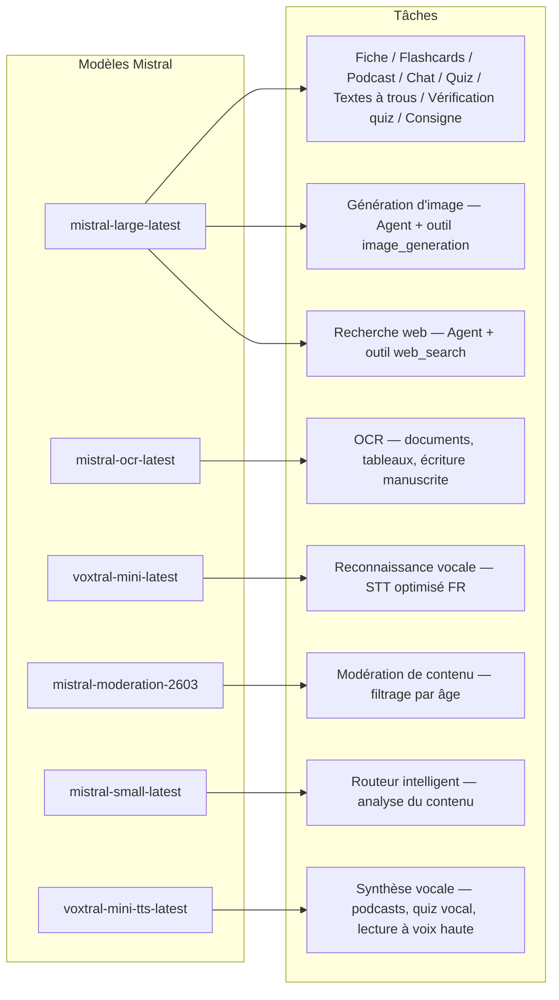
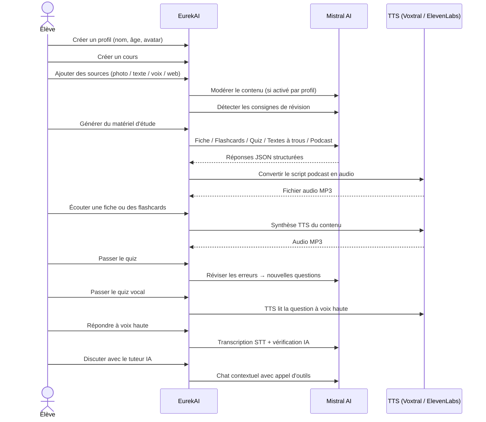

<p align="center">
  
</p>

<h1 align="center">EurekAI</h1>

<p align="center">
  <strong>किसी भी सामग्री को इंटरैक्टिव सीखने के अनुभव में बदलें — एआई द्वारा संचालित।</strong>
</p>

<p align="center">
  <a href="https://mistral.ai"></a>
  <a href="https://www.typescriptlang.org"></a>
  <a href="https://mistral.ai"></a>
  <a href="https://elevenlabs.io"></a>
</p>

<p align="center">
  <a href="https://www.youtube.com/watch?v=_b1TQz2leoI">▶️ YouTube पर डेमो देखें</a> · <a href="README-en.md">🇬🇧 अंग्रेज़ी में पढ़ें</a>
</p>

<p align="center">
  <a href="https://sonarcloud.io/summary/new_code?id=jls42_EurekAI"></a>
  <a href="https://sonarcloud.io/summary/new_code?id=jls42_EurekAI"></a>
  <a href="https://sonarcloud.io/summary/new_code?id=jls42_EurekAI"></a>
  <a href="https://sonarcloud.io/summary/new_code?id=jls42_EurekAI"></a>
</p>
<p align="center">
  <a href="https://sonarcloud.io/summary/new_code?id=jls42_EurekAI"></a>
  <a href="https://sonarcloud.io/summary/new_code?id=jls42_EurekAI"></a>
  <a href="https://sonarcloud.io/summary/new_code?id=jls42_EurekAI"></a>
  <a href="https://sonarcloud.io/summary/new_code?id=jls42_EurekAI"></a>
</p>

---

## कहानी — EurekAI क्यों?

**EurekAI** का जन्म [Mistral AI Worldwide Hackathon](https://luma.com/mistralhack-online) ([site officiel](https://worldwide-hackathon.mistral.ai/)) (मार्च 2026) के दौरान हुआ। मुझे एक विषय चाहिए था — और विचार कुछ बहुत ही ठोस से आया: मैं अपनी बेटी के साथ नियमित रूप से परीक्षाओं की तैयारी करता हूँ, और मैंने सोचा कि इसे एआई की मदद से और भी मज़ेदार और इंटरैक्टिव बनाया जा सकता है।

उद्देश्य: किसी भी इनपुट — मैन्युअल की एक फोटो, कॉपी-पेस्ट किया गया टेक्स्ट, एक वॉइस रिकॉर्डिंग, एक वेब खोज — को लेकर उसे **रिवीजन नोट्स, फ्लैशकार्ड, क्विज़, पॉडकास्ट, रिक्त स्थान भरने वाले टेक्स्ट, चित्र, और भी बहुत कुछ** में बदलना। यह सब Mistral AI के फ्रांसीसी मॉडल्स द्वारा संचालित है, जो इसे फ्रेंच भाषी छात्रों के लिए स्वाभाविक रूप से उपयुक्त बनाता है।

कोड की हर पंक्ति हैकाथॉन के दौरान लिखी गई थी। सभी APIs और ओपन-सोर्स लाइब्रेरीज़ हैकाथॉन के नियमों के अनुरूप उपयोग की गई हैं।

---

## सुविधाएँ

| | विशेषता | विवरण |
|---|---|---|
| 📷 | **Upload OCR** | अपने मैन्युअल या नोट्स की फोटो लें — Mistral OCR उस सामग्री को निकाल लेता है |
| 📝 | **Saisie texte** | किसी भी टेक्स्ट को सीधे टाइप या पेस्ट करें |
| 🎤 | **Entrée vocale** | रिकॉर्ड करें — Voxtral STT आपकी आवाज़ को ट्रांसक्राइब करता है |
| 🌐 | **Recherche web** | एक प्रश्न पूछें — एक Mistral एजेंट वेब पर उत्तर खोजता है |
| 📄 | **Fiches de révision** | संरचित नोट्स जिनमें मुख्य बिंदु, शब्दावली, उद्धरण, रोचक तथ्य |
| 🃏 | **Flashcards** | 5-50 प्रश्न/उत्तर कार्ड स्रोतों के संदर्भ के साथ सक्रिय स्मरण के लिए |
| ❓ | **Quiz QCM** | 5-50 बहुविकल्पीय प्रश्न, गलतियों की अनुकूल समीक्षा के साथ |
| ✏️ | **Textes à trous** | भरने के लिए अभ्यास, संकेत और सहनशील सत्यापन |
| 🎙️ | **Podcast** | दो आवाज़ों वाला मिनी-पॉडकास्ट, Mistral Voxtral TTS से ऑडियो में रूपांतरित |
| 🖼️ | **Illustrations** | एक Mistral एजेंट द्वारा जनरेट की गई शैक्षिक छवियाँ |
| 🗣️ | **Quiz vocal** | प्रश्नों को ऊँची आवाज़ में पढ़ा जाता है, मौखिक उत्तर दें, एआई उत्तर की जाँच करता है |
| 💬 | **Tuteur IA** | आपके पाठ्य दस्तावेजों के साथ संदर्भ-आधारित चैट, टूल कॉल के साथ |
| 🧠 | **Routeur intelligent** | एआई आपकी सामग्री का विश्लेषण करता है और 7 उपलब्ध जनरेटर में से सबसे उपयुक्त सुझाता है |
| 🔒 | **Contrôle parental** | आयु के अनुसार मॉडरेशन, पेरेंटल PIN, चैट प्रतिबंध |
| 🌍 | **Multilingue** | इंटरफ़ेस और एआई सामग्री फ्रेंच और अंग्रेज़ी में पूरी तरह उपलब्ध |
| 🔊 | **Lecture à voix haute** | Fiches और फ्लैशकार्ड को Mistral Voxtral TTS या ElevenLabs के माध्यम से सुनें |

---

## आर्किटेक्चर का अवलोकन


---

## मॉडल उपयोग मानचित्र



---

## उपयोगकर्ता प्रवाह



---

## गहराई में — सुविधाएँ

### मल्टी-मॉडल इनपुट

EurekAI 4 प्रकार के स्रोत स्वीकार करता है, प्रोफ़ाइल के अनुसार मॉडरेट किए जाते हैं (बच्चे और किशोर के लिए डिफ़ॉल्ट रूप से सक्रिय):

- **Upload OCR** — JPG, PNG या PDF फ़ाइलें `mistral-ocr-latest` द्वारा प्रोसेस की जाती हैं। मुद्रित टेक्स्ट, तालिकाएँ और हस्तलिखित लेखन संभालता है।
- **Texte libre** — किसी भी सामग्री को टाइप या पेस्ट करें। यदि मॉडरेशन सक्रिय है तो संग्रह से पहले मॉडरेट किया जाता है।
- **Entrée vocale** — ब्राउज़र में ऑडियो रिकॉर्ड करें। `voxtral-mini-latest` द्वारा ट्रांसक्राइब किया जाता है। `language="fr"` सेटिंग मान्यता को ऑप्टिमाइज़ करती है।
- **Recherche web** — एक क्वेरी दर्ज करें। `web_search` टूल वाले एक अस्थायी Mistral एजेंट परिणामों को खींचकर सारांशित करता है।

### एआई सामग्री जनरेशन

जनरेट किए गए सात प्रकार के शिक्षण सामग्री:

| Générateur | Modèle | Sortie |
|---|---|---|
| **Fiche de révision** | `mistral-large-latest` | शीर्षक, सारांश, 10-25 प्रमुख बिंदु, शब्दावली, उद्धरण, रोचक तथ्य |
| **Flashcards** | `mistral-large-latest` | 5-50 प्रश्न/उत्तर कार्ड स्रोतों के संदर्भ के साथ सक्रिय स्मरण के लिए |
| **Quiz QCM** | `mistral-large-latest` | 5-50 प्रश्न, प्रत्येक में 4 विकल्प, स्पष्टीकरण, अनुकूलन योग्य समीक्षा |
| **Textes à trous** | `mistral-large-latest` | भरने के लिए वाक्य, संकेत, लचीला सत्यापन (Levenshtein) |
| **Podcast** | `mistral-large-latest` + Voxtral TTS | 2-आवाज़ स्क्रिप्ट → MP3 ऑडियो |
| **Illustration** | Agent `mistral-large-latest` | शैक्षिक छवि उपकरण `image_generation` के माध्यम से |
| **Quiz vocal** | `mistral-large-latest` + Voxtral TTS + STT | प्रश्न TTS → उत्तर STT → एआई द्वारा सत्यापन |

### चैट द्वारा एआई ट्यूटर

पाठ्य दस्तावेजों तक पूर्ण पहुँच वाला संवादात्मक ट्यूटर:

- `mistral-large-latest` का उपयोग करता है
- **टूल कॉल** : बातचीत के दौरान फिचे, फ्लैशकार्ड, क्विज़ या रिक्त-भरण पाठ उत्पन्न कर सकता है
- प्रति कोर्स 50 संदेशों का इतिहास
- यदि प्रोफ़ाइल के लिए सक्रिय हो तो सामग्री का मॉडरेशन

### स्वचालित स्मार्ट राउटर

राउटर `mistral-small-latest` का उपयोग करके स्रोतों की सामग्री का विश्लेषण करता है और 7 उपलब्ध जनरेटर्स में से सबसे प्रासंगिक सुझाता है — ताकि छात्र मैन्युअल रूप से चुनने की जरूरत न पड़े। इंटरफ़ेस वास्तविक समय में प्रगति दिखाता है: पहले एक विश्लेषण चरण, फिर व्यक्तिगत जनरेशन जिनको रद्द किया जा सकता है।

### अनुकूलन-आधारित सीखना

- **क्विज़ आँकड़े** : प्रयासों और प्रत्येक प्रश्न की सटीकता का ट्रैक
- **क्विज़ रीव्यू** : कमजोर अवधारणाओं को लक्षित करते हुए 5-10 नए प्रश्न जेनरेट करता है
- **निर्देश डिटेक्शन** : पुनरावृति निर्देशों का पता लगाता है ("Je sais ma leçon si je sais...") और सभी जनरेटर्स में उन्हें प्राथमिकता देता है

### सुरक्षा और अभिभावकीय नियंत्रण

- **4 आयु समूह** : बच्चा (≤10 वर्ष), किशोर (11-15), विद्यार्थी (16-25), वयस्क (26+)
- **सामग्री मॉडरेशन** : `mistral-moderation-2603` के साथ, बच्चे/किशोर के लिए 5 श्रेणियाँ ब्लॉक (sexual, hate, violence, selfharm, jailbreaking), विद्यार्थी/वयस्क के लिए कोई प्रतिबंध नहीं
- **पेरेंटल PIN** : SHA-256 हेश, 15 साल से कम आयु वाले प्रोफाइल के लिए आवश्यक
- **चैट प्रतिबंध** : 16 से कम उम्र वाले प्रोफाइल के लिए डिफ़ॉल्ट रूप से AI चैट अक्षम, माता-पिता द्वारा सक्षम किया जा सकता है

### मल्टी-प्रोफ़ाइल सिस्टम

- नाम, आयु, अवतार, भाषा पसंद के साथ कई प्रोफाइल
- प्रोफाइल से जुड़े प्रोजेक्ट्स `profileId` के माध्यम से
- कास्केड डिलीट: एक प्रोफ़ाइल हटाने से उसके सभी प्रोजेक्ट हट जाते हैं

### बहु-प्रोवाइडर TTS

- **Mistral Voxtral TTS** (डिफ़ॉल्ट) : `voxtral-mini-tts-latest`, अतिरिक्त कुंजी की आवश्यकता नहीं
- **ElevenLabs** (वैकल्पिक) : `eleven_v3`, प्राकृतिक आवाज़ें, इसके लिए `ELEVENLABS_API_KEY` आवश्यक
- एप्लिकेशन सेटिंग्स में प्रोवाइडर कॉन्फ़िगर करने योग्य

### अंतरराष्ट्रीयकरण

- इंटरफ़ेस पूरी तरह फ्रेंच और अंग्रेज़ी में उपलब्ध
- एआई प्रॉम्प्ट आज 2 भाषाएँ समर्थन करते हैं (FR, EN) और आर्किटेक्चर 15 भाषाओं के लिए तैयार है (es, de, it, pt, nl, ja, zh, ko, ar, hi, pl, ro, sv)
- भाषा प्रोफ़ाइल द्वारा कॉन्फ़िगर की जा सकती है

---

## तकनीकी स्टैक

| परत | टेक्नोलॉजी | भूमिका |
|---|---|---|
| **Runtime** | Node.js + TypeScript 5.7 | सर्वर और टाइप सुरक्षा |
| **Backend** | Express 4.21 | REST API |
| **Serveur de dev** | Vite 7.3 + tsx | HMR, Handlebars partials, proxy |
| **Frontend** | HTML + TailwindCSS 4.2 + Alpine.js 3.15 | प्रतिक्रियाशील इंटरफ़ेस, TypeScript Vite द्वारा कंपाइल |
| **Templating** | vite-plugin-handlebars | partials के माध्यम से HTML कम्पोजिशन |
| **IA** | Mistral AI SDK 2.1 | चैट, OCR, STT, TTS, एजेंट्स, मॉडरेशन |
| **TTS (défaut)** | Mistral Voxtral TTS | `voxtral-mini-tts-latest`, इम्बेडेड स्पीच सिंथेसिस |
| **TTS (alternatif)** | ElevenLabs SDK 2.36 | `eleven_v3`, प्राकृतिक आवाज़ें |
| **Icônes** | Lucide 0.575 | SVG आइकन लाइब्रेरी |
| **Markdown** | Marked 17 | चैट में मार्कडाउन रेंडरिंग |
| **Upload fichiers** | Multer 1.4 | multipart फॉर्म हैंडलिंग |
| **Audio** | ffmpeg-static | ऑडियो सेगमेंट्स की कन्सैटेनेशन |
| **Tests** | Vitest 4 | यूनिट टेस्ट — कवरेज SonarCloud से मापा गया |
| **Persistance** | Fichiers JSON | निर्भरता-रहित स्टोरेज |

---

## मॉडल संदर्भ

| Modèle | Utilisation | Pourquoi |
|---|---|---|
| `mistral-large-latest` | Fiche, Flashcards, Podcast, Quiz, Textes à trous, Chat, Vérification quiz vocal, Agent Image, Agent Web Search, Détection consigne | बहुभाषी में श्रेष्ठ + निर्देशों का पालन |
| `mistral-ocr-latest` | OCR de documents | मुद्रित टेक्स्ट, तालिकाएँ, हस्तलिखित लेखन |
| `voxtral-mini-latest` | Reconnaissance vocale (STT) | बहुभाषी STT, `language="fr"` के साथ ऑप्टिमाइज़ किया गया |
| `voxtral-mini-tts-latest` | Synthèse vocale (TTS) | पॉडकास्ट, क्विज़ वोकल, पढ़कर सुनाना |
| `mistral-moderation-2603` | Modération de contenu | बच्चों/किशोरों के लिए 5 श्रेणियाँ ब्लॉक (+ jailbreaking) |
| `mistral-small-latest` | Routeur intelligent | रूटिंग निर्णयों के लिए तेज़ कंटेंट एनालिसिस |
| `eleven_v3` (ElevenLabs) | Synthèse vocale (TTS alternatif) | प्राकृतिक आवाज़ें, वैकल्पिक कॉन्फ़िगर करने योग्य |

---

## त्वरित शुरुआत

```bash
# Cloner le dépôt
git clone https://github.com/jls42/EurekAI.git
cd EurekAI

# Installer les dépendances
npm install

# Configurer les clés API
cp .env.example .env
# Éditez .env avec vos clés :
#   MISTRAL_API_KEY=votre_clé_ici           (requis)
#   ELEVENLABS_API_KEY=votre_clé_ici        (optionnel, TTS alternatif)

# Lancer le développement
npm run dev
# → Backend :  http://localhost:3000 (API)
# → Frontend : http://localhost:5173 (serveur Vite avec HMR)
```

> **नोट** : Mistral Voxtral TTS डिफ़ॉल्ट प्रोवाइडर है — `MISTRAL_API_KEY` के अलावा कोई अतिरिक्त कुंजी आवश्यक नहीं। ElevenLabs एक वैकल्पिक TTS प्रोवाइडर है जिसे सेटिंग्स में कॉन्फ़िगर किया जा सकता है।

---

## प्रोजेक्ट संरचना

```
server.ts                 — Point d'entrée Express, monte les routes + config
config.ts                 — Config runtime (modèles, voix, TTS provider), persistée dans output/config.json
store.ts                  — ProjectStore : CRUD projets/sources/générations, persistance JSON
profiles.ts               — ProfileStore : gestion des profils, hachage PIN
types.ts                  — Types TypeScript : Source, Generation (7 types), QuizStats, Profile
prompts.ts                — Tous les prompts IA centralisés (system + user templates, FR/EN)

generators/
  ocr.ts                  — Upload + OCR via Mistral (JPG, PNG, PDF)
  summary.ts              — Génération de fiche de révision (JSON structuré)
  flashcards.ts           — Flashcards Q/R (5-50, configurable)
  quiz.ts                 — Quiz QCM (5-50 questions, configurable) + révision adaptative
  fill-blank.ts           — Exercices à trous avec validation tolérante
  podcast.ts              — Script podcast 2 voix
  quiz-vocal.ts           — Quiz vocal : questions TTS + réponses STT + vérification IA
  image.ts                — Génération d'image via Agent Mistral (outil image_generation)
  chat.ts                 — Tuteur IA par chat avec appel d'outils
  router.ts               — Routeur automatique intelligent (contenu → générateurs recommandés)
  consigne.ts             — Détection de consignes de révision
  tts-provider.ts         — Dispatch TTS multi-provider (Mistral Voxtral / ElevenLabs)
  tts.ts                  — Génération audio podcast (concaténation de segments)
  stt.ts                  — Voxtral STT (audio → texte)
  websearch.ts            — Agent Mistral avec outil web_search
  moderation.ts           — Modération de contenu (filtrage par âge)

routes/
  projects.ts             — CRUD projets
  profiles.ts             — CRUD profils avec gestion du PIN
  sources.ts              — Upload OCR, texte libre, voix STT, recherche web, modération
  generate.ts             — Endpoints de génération (7 types + auto + route)
  generations.ts          — Tentatives de quiz/fill-blank, réponses vocales, lecture à voix haute
  chat.ts                 — Chat IA avec appel d'outils

helpers/
  index.ts                — safeParseJson, unwrapJsonArray, extractAllText, timer
  audio.ts                — collectStream (ReadableStream → Buffer)
  fill-blank-validate.ts  — Validation tolérante des réponses (normalisation, Levenshtein)

src/                      — Frontend (Vite + Handlebars)
  index.html              — Point d'entrée HTML principal
  main.ts                 — Entrée frontend (init Alpine.js + icônes Lucide)
  app/                    — Modules applicatifs Alpine.js
    state.ts              — Gestion d'état réactif
    navigation.ts         — Routage des vues + gardes par âge
    profiles.ts           — Logique du sélecteur de profils
    projects.ts           — CRUD des cours
    sources.ts            — Gestionnaires d'upload de sources
    generate.ts           — Déclencheurs de génération (individuel, tout, auto 2 phases)
    generations.ts        — Affichage + actions sur les générations
    chat.ts               — Interface de chat
    config.ts             — Interface de configuration (modèles, voix, TTS provider)
    render.ts             — Helpers de rendu HTML
    i18n.ts               — Changement de langue
    ...
  components/
    quiz.ts               — Composant quiz interactif
    quiz-vocal.ts         — Composant quiz vocal
    fill-blank.ts         — Composant textes à trous
    flashcards.ts         — Composant flashcards avec retournement
    step-by-step.ts       — Mixin navigation pas-à-pas (quiz, fill-blank, flashcards)
  i18n/
    fr.ts                 — Traductions françaises
    en.ts                 — Traductions anglaises
    index.ts              — Chargeur i18n
  partials/               — Partials HTML Handlebars (header, sidebar, dialogues, vues)
  styles/
    main.css              — Entrée TailwindCSS
    theme.css             — Variables de thème personnalisées

public/assets/            — Ressources statiques (logo, avatars)
output/                   — Données d'exécution (projets, config, fichiers audio)
```

---

## API संदर्भ

### Config
| मेथड | एंडपॉइंट | विवरण |
|---|---|---|
| `GET` | `/api/config` | वर्तमान कॉन्फ़िगरेशन |
| `PUT` | `/api/config` | कॉन्फ़िग संशोधित करें (मॉडल, आवाज़ें, TTS प्रोवाइडर) |
| `GET` | `/api/config/status` | APIs की स्थिति (Mistral, ElevenLabs, TTS) |
| `POST` | `/api/config/reset` | डिफ़ॉल्ट कॉन्फ़िग रिसेट करें |
| `GET` | `/api/config/voices` | Mistral TTS की वॉइसेस सूची करें (वैकल्पिक `?lang=fr`) |

### Profils
| मेथड | एंडपॉइंट | विवरण |
|---|---|---|
| `GET` | `/api/profiles` | सभी प्रोफाइल सूचीबद्ध करें |
| `POST` | `/api/profiles` | एक प्रोफ़ाइल बनाएँ |
| `PUT` | `/api/profiles/:id` | प्रोफ़ाइल संशोधित करें (PIN < 15 साल के लिए आवश्यक) |
| `DELETE` | `/api/profiles/:id` | प्रोफ़ाइल हटाएँ + प्रोजेक्ट्स कास्केड करें |

### Projets
| मेथड | एंडपॉइंट | विवरण |
|---|---|---|
| `GET` | `/api/projects` | प्रोजेक्ट्स सूचीबद्ध करें |
| `POST` | `/api/projects` | एक प्रोजेक्ट बनाएँ `{name, profileId}` |
| `GET` | `/api/projects/:pid` | प्रोजेक्ट विवरण |
| `PUT` | `/api/projects/:pid` | नाम बदलें `{name}` |
| `DELETE` | `/api/projects/:pid` | प्रोजेक्ट हटाएँ |

### Sources
| मेथड | एंडपॉइंट | विवरण |
|---|---|---|
| `POST` | `/api/projects/:pid/sources/upload` | Upload OCR (multipart फ़ाइलें) |
| `POST` | `/api/projects/:pid/sources/text` | टेक्स्ट इनपुट `{text}` |
| `POST` | `/api/projects/:pid/sources/voice` | वॉइस STT (multipart ऑडियो) |
| `POST` | `/api/projects/:pid/sources/websearch` | वेब सर्च `{query}` |
| `DELETE` | `/api/projects/:pid/sources/:sid` | एक स्रोत हटाएँ |
| `POST` | `/api/projects/:pid/moderate` | मॉडरेट करें `{text}` |
| `POST` | `/api/projects/:pid/detect-consigne` | रीविजन निर्देश डिटेक्ट करें |

### Génération
| मेथड | एंडपॉइंट | विवरण |
|---|---|---|
| `POST` | `/api/projects/:pid/generate/summary` | रिवीजन फिचे |
| `POST` | `/api/projects/:pid/generate/flashcards` | फ्लैशकार्ड |
| `POST` | `/api/projects/:pid/generate/quiz` | क्विज़ QCM |
| `POST` | `/api/projects/:pid/generate/fill-blank` | रिक्त स्थान भरने वाले टेक्स्ट |
| `POST` | `/api/projects/:pid/generate/podcast` | पॉडकास्ट |
| `POST` | `/api/projects/:pid/generate/image` | इल्यूस्ट्रेशन |
| `POST` | `/api/projects/:pid/generate/quiz-vocal` | वोकल क्विज़ |
| `POST` | `/api/projects/:pid/generate/quiz-review` | अनुकूलन रीव्यू `{generationId, weakQuestions}` |
| `POST` | `/api/projects/:pid/generate/route` | राउटिंग एनालिसिस (कौन से जनरेटर्स चलाने हैं) |
| `POST` | `/api/projects/:pid/generate/auto` | बैकएंड ऑटो जेनरेशन (राउटिंग + 5 प्रकार : summary, flashcards, quiz, fill-blank, podcast) |

सभी जेनरेशन रूट्स `{sourceIds?, lang?, ageGroup?, count?, useConsigne?}` स्वीकार करते हैं।

### CRUD Générations
| मेथड | एंडपॉइंट | विवरण |
|---|---|---|
| `POST` | `/api/projects/:pid/generations/:gid/quiz-attempt` | क्विज़ उत्तर सबमिट करें `{answers}` |
| `POST` | `/api/projects/:pid/generations/:gid/fill-blank-attempt` | रिक्त-स्थान उत्तर सबमिट करें `{answers}` |
| `POST` | `/api/projects/:pid/generations/:gid/vocal-answer` | मौखिक उत्तर सत्यापित करें (ऑडियो + questionIndex) |
| `POST` | `/api/projects/:pid/generations/:gid/read-aloud` | TTS के जरिए पढ़कर सुनना (fiches/flashcards) |
| `PUT` | `/api/projects/:pid/generations/:gid` | नाम बदलें `{title}` |
| `DELETE` | `/api/projects/:pid/generations/:gid` | जेनरेशन हटाएँ |

### Chat
| मेथड | एंडपॉइंट | विवरण |
|---|---|---|
| `GET` | `/api/projects/:pid/chat` | चैट इतिहास प्राप्त करें |
| `POST` | `/api/projects/:pid/chat` | एक संदेश भेजें `{message, lang, ageGroup}` |
| `DELETE` | `/api/projects/:pid/chat` | चैट इतिहास मिटाएँ |

---

## आर्किटेक्चरल निर्णय

| निर्णय | औचित्य |
|---|---|
| **Alpine.js plutôt que React/Vue** | न्यूनतम पैमाना, TypeScript के साथ हल्की रिएक्टिविटी जो Vite द्वारा कंपाइल होती है। हैकाथॉन के लिए जहाँ गति मायने रखती है, यह परफेक्ट है। |
| **Persistance en fichiers JSON** | ज़ीरो निर्भरता, त्वरित स्टार्ट। किसी डेटाबेस को कॉन्फ़िगर करने की ज़रूरत नहीं — सीधे शुरू हो जाइए। |
| **Vite + Handlebars** | दोनों का अच्छा मेल: विकास के लिए तेज HMR, कोड के संगठन के लिए HTML partials, Tailwind JIT। | **केंद्रित प्रॉम्प्ट** | सभी AI प्रॉम्प्ट `prompts.ts` में — भाषा/आयु-समूह के अनुसार दोहराने, टेस्ट करने और अनुकूलित करने में आसान। |
| **मल्टी-जनरेशन सिस्टम** | प्रत्येक जेनरेशन एक स्वतंत्र ऑब्जेक्ट है अपने स्वयं के ID के साथ — प्रति कोर्स कई नोट्स, क्विज़ इत्यादि की अनुमति देता है। |
| **आयु के अनुसार अनुकूलित प्रॉम्प्ट** | 4 आयु समूह अलग शब्दावली, जटिलता और टोन के साथ — समान सामग्री अलग तरह से सिखाती है। |
| **एजेंट-आधारित सुविधाएँ** | इमेज जेनरेशन और वेब खोज अस्थायी Mistral एजेंट्स का उपयोग करती हैं — स्वायत/स्वतंत्र लाइफसाइकल के साथ स्वचालित क्लीनअप। |
| **बहु-प्रदाता TTS** | डिफ़ॉल्ट रूप से Mistral Voxtral TTS (कोई अतिरिक्त कुंजी नहीं), ElevenLabs वैकल्पिक के रूप में — बिना पुनरारंभ के कॉन्फ़िगर करने योग्य। |

---

## श्रेय और धन्यवाद

- **[Mistral AI](https://mistral.ai)** — AI मॉडल (Large, OCR, Voxtral STT, Voxtral TTS, Moderation, Small) + Worldwide Hackathon
- **[ElevenLabs](https://elevenlabs.io)** — वैकल्पिक वॉइस सिंथेसिस इंजन (`eleven_v3`)
- **[Alpine.js](https://alpinejs.dev)** — हल्का रिएक्टिव फ्रेमवर्क
- **[TailwindCSS](https://tailwindcss.com)** — यूटिलिटी-आधारित CSS फ्रेमवर्क
- **[Vite](https://vitejs.dev)** — फ्रंटएंड बिल्ड टूल
- **[Lucide](https://lucide.dev)** — आइकन लाइब्रेरी
- **[Marked](https://marked.js.org)** — Markdown पार्सर

Mistral AI Worldwide Hackathon, मार्च 2026 के दौरान सावधानीपूर्वक निर्मित।

---

## लेखक

**Julien LS** — [contact@jls42.org](mailto:contact@jls42.org)

## लाइसेंस

[AGPL-3.0](LICENSE) — कॉपीराइट (C) 2026 Julien LS

**यह दस्तावेज़ gpt-5-mini मॉडल का उपयोग करके fr संस्करण से hi भाषा में अनुवादित किया गया है। अनुवाद प्रक्रिया के बारे में अधिक जानकारी के लिए, देखें https://gitlab.com/jls42/ai-powered-markdown-translator**

