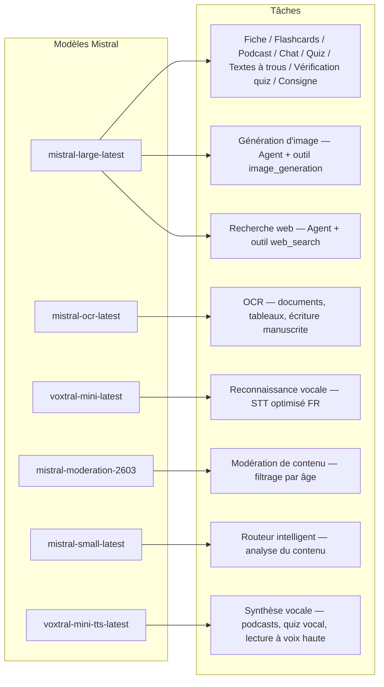
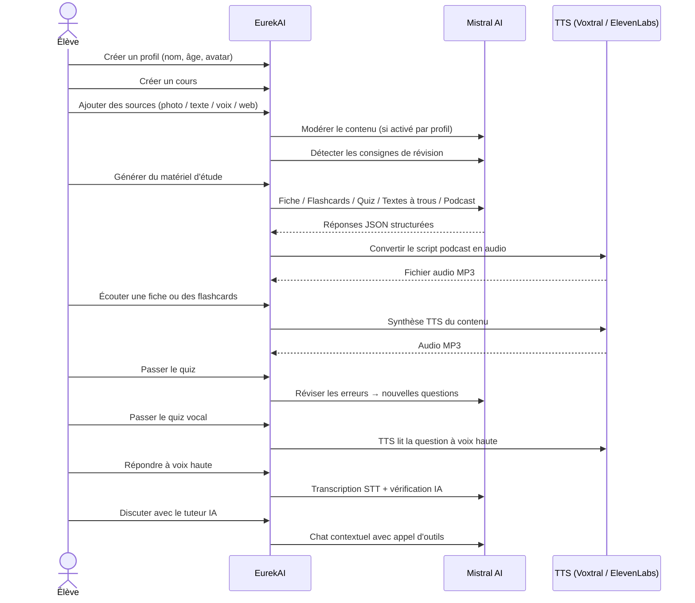

<p align="center">
  
</p>

<h1 align="center">EurekAI</h1>

<p align="center">
  <strong>किसी भी सामग्री को इंटरएक्टिव लर्निंग अनुभव में बदलें — एआई द्वारा संचालित।</strong>
</p>

<p align="center">
  <a href="https://mistral.ai"></a>
  <a href="https://www.typescriptlang.org"></a>
  <a href="https://mistral.ai"></a>
  <a href="https://elevenlabs.io"></a>
</p>

<p align="center">
  <a href="https://www.youtube.com/watch?v=_b1TQz2leoI">▶️ YouTube पर डेमो देखें</a> · <a href="README-en.md">🇬🇧 अंग्रेज़ी में पढ़ें</a>
</p>

<p align="center">
  <a href="https://sonarcloud.io/summary/new_code?id=jls42_EurekAI"></a>
  <a href="https://sonarcloud.io/summary/new_code?id=jls42_EurekAI"></a>
  <a href="https://sonarcloud.io/summary/new_code?id=jls42_EurekAI"></a>
  <a href="https://sonarcloud.io/summary/new_code?id=jls42_EurekAI"></a>
</p>
<p align="center">
  <a href="https://sonarcloud.io/summary/new_code?id=jls42_EurekAI"></a>
  <a href="https://sonarcloud.io/summary/new_code?id=jls42_EurekAI"></a>
  <a href="https://sonarcloud.io/summary/new_code?id=jls42_EurekAI"></a>
  <a href="https://sonarcloud.io/summary/new_code?id=jls42_EurekAI"></a>
</p>

---

## कहानी — क्यों EurekAI ?

**EurekAI** का जन्म [Mistral AI Worldwide Hackathon](https://worldwide-hackathon.mistral.ai/) (मार्च 2026) के दौरान हुआ। मुझे एक विषय चाहिए था — और विचार एक बहुत ही व्यावहारिक चीज़ से आया: मैं अपनी बेटी के साथ नियमित रूप से टेस्ट की तैयारी करता हूँ, और मैंने सोचा कि इसे एआई की मदद से और अधिक मज़ेदार और इंटरएक्टिव बनाया जा सकता है।

लक्ष्य: किसी भी इनपुट — मैनुअल की एक तस्वीर, कॉपी-पेस्ट किया हुआ टेक्स्ट, वॉइस रिकॉर्डिंग, वेब सर्च — को लेकर उसे **रिविज़न शीट्स, फ्लैशकार्ड, क्विज़, पॉडकास्ट, रिक्त स्थान भरने वाले पाठ, चित्रण, और अधिक** में बदलना। सब कुछ Mistral AI के फ्रेंच मॉडल्स द्वारा संचालित, जिससे यह फ़्रेंच-स्पीकिंग छात्रों के लिए स्वाभाविक रूप से अनुकूल समाधान बनता है।

हैकाथॉन के दौरान ही हर एक कोड की लाइन लिखी गई। सभी ओपन-सोर्स APIs और लाइब्रेरीज़ हैकाथॉन के नियमों के अनुसार उपयोग की गई हैं।

---

## सुविधाएँ

| | फीचर | विवरण |
|---|---|---|
| 📷 | **Upload OCR** | अपने मैनुअल या नोट्स की फोटो लें — Mistral OCR इसमें से सामग्री निकालता है |
| 📝 | **टेक्स्ट प्रविष्टि** | किसी भी टेक्स्ट को टाइप या पेस्ट करें |
| 🎤 | **वॉइस इनपुट** | रिकॉर्ड करें — Voxtral STT आपकी आवाज़ का ट्रांसक्रिप्शन करता है |
| 🌐 | **वेब खोज** | एक प्रश्न पूछें — एक Mistral एजेंट वेब पर उत्तर खोजता है |
| 📄 | **रिविज़न शीट्स** | संरचित नोट्स: प्रमुख बिंदु, शब्दावली, उद्धरण, एनेकडोट्स |
| 🃏 | **फ्लैशकार्ड** | 5-50 Q/A कार्ड स्रोत संदर्भों के साथ सक्रिय स्मृति के लिए |
| ❓ | **बहुविकल्पीय क्विज़ (QCM)** | 5-50 बहुविकल्पीय प्रश्न, त्रुटियों की अनुकूल पुनरावृति के साथ |
| ✏️ | **रिक्त स्थान वाले पाठ** | संकेतों और सहनशील सत्यापन के साथ भरने के अभ्यास |
| 🎙️ | **पॉडकास्ट** | 2-आवाज़ वाला मिनी-पॉडकास्ट, Mistral Voxtral TTS के माध्यम से ऑडियो |
| 🖼️ | **चित्रण** | शैक्षिक चित्र Mistral एजेंट द्वारा जनरेट |
| 🗣️ | **वॉइस क्विज़** | प्रश्न उच्च-स्वर में पढ़े जाते हैं, मौखिक उत्तर, एआई द्वारा सत्यापन |
| 💬 | **एआई ट्यूटर** | आपके पाठ्य दस्तावेज़ों के साथ संदर्भ-आधारित चैट, टूल कॉल करने की क्षमता के साथ |
| 🧠 | **इंटेलिजेंट राउटर** | एआई आपकी सामग्री का विश्लेषण करता है और उपलब्ध 7 जेनरेटरों में सबसे उपयुक्त सुझाव देता है |
| 🔒 | **पैरेंटल कंट्रोल** | आयु-आधारित मॉडरेशन, पैरेंटल PIN, चैट पर प्रतिबन्ध |
| 🌍 | **बहुभाषी** | इंटरफ़ेस और एआई सामग्री फ़्रेंच और अंग्रेज़ी में पूरी तरह उपलब्ध |
| 🔊 | **आवाज़ में पढ़ना** | रिविज़न शीट्स और फ्लैशकार्ड को Mistral Voxtral TTS या ElevenLabs से सुनें |

---

## आर्किटेक्चर का अवलोकन


---

## मॉडल उपयोग मानचित्र



---

## उपयोगकर्ता यात्रा



---

## गहराई में — सुविधाएँ

### मल्टीमॉडल इनपुट

EurekAI 4 प्रकार के स्रोत स्वीकार करता है, प्रोफ़ाइल के अनुसार मॉडरेट किए जाते हैं (बच्चा और किशोर के लिए डिफ़ॉल्ट सक्रिय):

- **Upload OCR** — JPG, PNG या PDF फ़ाइलें `mistral-ocr-latest` द्वारा प्रोसेस की जाती हैं। मुद्रित टेक्स्ट, तालिकाएँ और हस्तलिखित लेखन संभालता है।
- **खुला टेक्स्ट** — किसी भी सामग्री को टाइप या पेस्ट करें। संग्रह से पहले मॉडरेशन सक्रिय होने पर मॉडरेट किया जाता है।
- **वॉइस इनपुट** — ब्राउज़र में ऑडियो रिकॉर्ड करें। `voxtral-mini-latest` द्वारा ट्रांसक्राइब किया जाता है। `language="fr"` सेटिंग रिकॉग्निशन को ऑप्टिमाइज़ करती है।
- **वेब खोज** — एक क्वेरी दर्ज करें। एक अस्थायी Mistral एजेंट टूल `web_search` का उपयोग करके परिणाम प्राप्त और सारांशित करता है।

### एआई सामग्री जनरेशन

जनरेट किये गए सीखने के सामग्री के सात प्रकार:

| जेनरेटर | मॉडल | आउटपुट |
|---|---|---|
| **रिविज़न शीट** | `mistral-large-latest` | शीर्षक, सारांश, 10-25 प्रमुख बिंदु, शब्दावली, उद्धरण, एनेकडोट |
| **फ्लैशकार्ड** | `mistral-large-latest` | 5-50 Q/A कार्ड स्रोत संदर्भों के साथ सक्रिय स्मृति हेतु |
| **बहुविकल्पीय क्विज़** | `mistral-large-latest` | 5-50 प्रश्न, प्रत्येक में 4 विकल्प, व्याख्याएँ, अनुकूल पुनरावृति |
| **रिक्त स्थान वाले पाठ** | `mistral-large-latest` | संकेतों के साथ पूरा करने के लिए वाक्य, सहनशील सत्यापन (Levenshtein) |
| **पॉडकास्ट** | `mistral-large-latest` + Voxtral TTS | 2-आवाज़ स्क्रिप्ट → MP3 ऑडियो |
| **चित्रण** | एजेंट `mistral-large-latest` | टूल `image_generation` के माध्यम से शैक्षिक छवि |
| **वॉइस क्विज़** | `mistral-large-latest` + Voxtral TTS + STT | प्रश्न TTS → उत्तर STT → एआई सत्यापन |

### चैट द्वारा एआई ट्यूटर

दस्तावेज़ों तक पूर्ण पहुँच वाले एक संवादात्मक ट्यूटर:

- `mistral-large-latest` का उपयोग करता है
- **टूल कॉल्स**: बातचीत के दौरान फ़िश, फ्लैशकार्ड, क्विज़ या रिक्त-स्थान पाठ जनरेट कर सकता है
- प्रति कोर्स 50 संदेशों का इतिहास
- यदि प्रोफ़ाइल के लिए सक्रिय है तो सामग्री मॉडरेशन लागू

### स्वचालित इंटेलिजेंट राउटर

राउटर `mistral-small-latest` का उपयोग करके स्रोत सामग्री का विश्लेषण करता है और उपलब्ध 7 जेनरेटरों में सबसे उपयुक्त सिफारिशें देता है — ताकि विद्यार्थियों को मैन्युअल रूप से चुनना न पड़े। इंटरफ़ेस रीयल-टाइम प्रगति दिखाता है: पहले विश्लेषण, फिर व्यक्तिगत जेनरेशन्स के साथ तत्काल रद्दीकरण संभव।

### अनुकूलनशील अधिगम

- **क्विज़ आँकड़े**: प्रश्नों के प्रयासों और सटीकता का ट्रैक
- **क्विज़ रिव्यू**: कमजोर अवधारणाओं को लक्षित करते हुए 5-10 नए प्रश्न जनरेट करता है
- **निर्देश पहचान**: ("मैं अपनी पाठ याद हूँ अगर मैं ... जानता हूँ") जैसी पुनरावृति निर्देशों का पता लगाकर सभी जेनरेटरों में प्राथमिकता देता है

### सुरक्षा और पैरेंटल कंट्रोल

- **4 आयु समूह**: बच्चा (≤10 साल), किशोर (11-15), छात्र (16-25), वयस्क (26+)
- **सामग्री मॉडरेशन**: `mistral-moderation-2603` — बच्चे/किशोर के लिए 5 श्रेणियाँ ब्लॉक की जाती हैं (यौन, घृणा, हिंसा, आत्महानि, jailbreaking), छात्र/वयस्क के लिए कोई प्रतिबंध नहीं
- **पैरेंटल PIN**: SHA-256 हैश, 15 साल से कम प्रोफाइल के लिए आवश्यक
- **चैट प्रतिबंध**: 16 से कम आयु वालों के लिए डिफ़ॉल्ट रूप से एआई चैट अक्षम, माता-पिता द्वारा सक्रिय किया जा सकता है

### मल्टी-प्रोफ़ाइल सिस्टम

- कई प्रोफ़ाइल्स नाम, आयु, अवतार, भाषा प्राथमिकताएँ के साथ
- प्रोफाइल से जुड़े प्रोजेक्ट्स `profileId` के माध्यम से
- कैस्केड डिलीट: एक प्रोफ़ाइल हटाने पर उसके सभी प्रोजेक्ट्स हटते हैं

### TTS मल्टी-प्रोवाइडर

- **Mistral Voxtral TTS** (डिफ़ॉल्ट): `voxtral-mini-tts-latest`, अतिरिक्त कुंजी की आवश्यकता नहीं
- **ElevenLabs** (वैकल्पिक): `eleven_v3`, नेचुरल वॉइसेज़, आवश्यकता: `ELEVENLABS_API_KEY`
- प्रोवाइडर एप्लिकेशन सेटिंग्स में कॉन्फ़िगर करने योग्य

### अंतरराष्ट्रीयकरण

- इंटरफ़ेस पूरी तरह फ़्रेंच और अंग्रेज़ी में उपलब्ध
- एआई प्रॉम्प्ट आज 2 भाषाएँ सपोर्ट करते हैं (FR, EN) और आर्किटेक्चर 15 भाषाओं के लिए तैयार है (es, de, it, pt, nl, ja, zh, ko, ar, hi, pl, ro, sv)
- भाषा प्रोफ़ाइल द्वारा कॉन्फ़िगर की जा सकती है

---

## टेक स्टैक

| परत | टेक्नोलॉजी | भूमिका |
|---|---|---|
| **रनटाइम** | Node.js + TypeScript 5.7 | सर्वर और टाइप सुरक्षा |
| **बैकएंड** | Express 4.21 | REST API |
| **डेव सर्वर** | Vite 7.3 + tsx | HMR, हैंडलबार्स partials, प्रॉक्सी |
| **फ्रंटएंड** | HTML + TailwindCSS 4.2 + Alpine.js 3.15 | प्रतिक्रियाशील UI, Vite द्वारा TypeScript संकलन |
| **टेम्पलेटिंग** | vite-plugin-handlebars | partials द्वारा HTML कंपोजिशन |
| **एआई** | Mistral AI SDK 2.1 | चैट, OCR, STT, TTS, एजेंट्स, मॉडरेशन |
| **TTS (डिफ़ॉल्ट)** | Mistral Voxtral TTS | `voxtral-mini-tts-latest`, अंतर्निहित स्पीच सिन्थेसिस |
| **TTS (वैकल्पिक)** | ElevenLabs SDK 2.36 | `eleven_v3`, प्राकृतिक आवाज़ें |
| **आइकॉन्स** | Lucide 0.575 | SVG आइकन लाइब्रेरी |
| **Markdown** | Marked 17 | चैट में Markdown रेंडरिंग |
| **फाइल अपलोड** | Multer 1.4 | मल्टीपार्ट फॉर्म हैंडलिंग |
| **ऑडियो** | ffmpeg-static | ऑडियो सेगमेंट्स का संयोजन |
| **टेस्टिंग** | Vitest 4 | यूनिट टेस्ट — कवरेज SonarCloud द्वारा मापा गया |
| **पर्सिस्टेंस** | JSON फाइलें | कोई बाहरी निर्भरता नहीं, फाइल-आधारित स्टोरेज |

---

## मॉडल संदर्भ

| मॉडल | उपयोग | क्यों |
|---|---|---|
| `mistral-large-latest` | रिविज़न शीट, फ्लैशकार्ड, पॉडकास्ट, क्विज़, रिक्त स्थान पाठ, चैट, वॉइस क्विज़ सत्यापन, इमेज एजेंट, वेब सर्च एजेंट, निर्देश पहचान | बहु-भाषी में श्रेष्ठ + इंस्ट्रक्शन फ़ॉलो में अच्छा |
| `mistral-ocr-latest` | दस्तावेज़ OCR | मुद्रित टेक्स्ट, तालिकाएँ, हस्तलिखित लेखन |
| `voxtral-mini-latest` | वॉइस रिकॉग्निशन (STT) | बहुभाषी STT, `language="fr"` के साथ ऑप्टिमाइज़्ड |
| `voxtral-mini-tts-latest` | स्पीच सिन्थेसिस (TTS) | पॉडकास्ट, वॉइस क्विज़, वॉइस रीडिंग |
| `mistral-moderation-2603` | कंटेंट मॉडरेशन | बच्चा/किशोर के लिए 5 श्रेणियाँ ब्लॉक करना (+ jailbreaking) |
| `mistral-small-latest` | इंटेलिजेंट राउटर | रूटिंग निर्णयों के लिए तेजी से कंटेंट विश्लेषण |
| `eleven_v3` (ElevenLabs) | स्पीच सिन्थेसिस (वैकल्पिक TTS) | प्राकृतिक आवाज़ें, वैकल्पिक कॉन्फ़िगर करने योग्य |

---

## त्वरित आरंभ

```bash
# Cloner le dépôt
git clone https://github.com/jls42/EurekAI.git
cd EurekAI

# Installer les dépendances
npm install

# Configurer les clés API
cp .env.example .env
# Éditez .env avec vos clés :
#   MISTRAL_API_KEY=votre_clé_ici           (requis)
#   ELEVENLABS_API_KEY=votre_clé_ici        (optionnel, TTS alternatif)

# Lancer le développement
npm run dev
# → Backend :  http://localhost:3000 (API)
# → Frontend : http://localhost:5173 (serveur Vite avec HMR)
```

> **नोट** : Mistral Voxtral TTS डिफ़ॉल्ट प्रोवाइडर है — `MISTRAL_API_KEY` के अलावा कोई अतिरिक्त कुंजी आवश्यक नहीं। ElevenLabs वैकल्पिक TTS प्रोवाइडर है जिसे सेटिंग्स में कॉन्फ़िगर किया जा सकता है।

---

## प्रोजेक्ट संरचना

```
server.ts                 — Point d'entrée Express, monte les routes + config
config.ts                 — Config runtime (modèles, voix, TTS provider), persistée dans output/config.json
store.ts                  — ProjectStore : CRUD projets/sources/générations, persistance JSON
profiles.ts               — ProfileStore : gestion des profils, hachage PIN
types.ts                  — Types TypeScript : Source, Generation (7 types), QuizStats, Profile
prompts.ts                — Tous les prompts IA centralisés (system + user templates, FR/EN)

generators/
  ocr.ts                  — Upload + OCR via Mistral (JPG, PNG, PDF)
  summary.ts              — Génération de fiche de révision (JSON structuré)
  flashcards.ts           — Flashcards Q/R (5-50, configurable)
  quiz.ts                 — Quiz QCM (5-50 questions, configurable) + révision adaptative
  fill-blank.ts           — Exercices à trous avec validation tolérante
  podcast.ts              — Script podcast 2 voix
  quiz-vocal.ts           — Quiz vocal : questions TTS + réponses STT + vérification IA
  image.ts                — Génération d'image via Agent Mistral (outil image_generation)
  chat.ts                 — Tuteur IA par chat avec appel d'outils
  router.ts               — Routeur automatique intelligent (contenu → générateurs recommandés)
  consigne.ts             — Détection de consignes de révision
  tts-provider.ts         — Dispatch TTS multi-provider (Mistral Voxtral / ElevenLabs)
  tts.ts                  — Génération audio podcast (concaténation de segments)
  stt.ts                  — Voxtral STT (audio → texte)
  websearch.ts            — Agent Mistral avec outil web_search
  moderation.ts           — Modération de contenu (filtrage par âge)

routes/
  projects.ts             — CRUD projets
  profiles.ts             — CRUD profils avec gestion du PIN
  sources.ts              — Upload OCR, texte libre, voix STT, recherche web, modération
  generate.ts             — Endpoints de génération (7 types + auto + route)
  generations.ts          — Tentatives de quiz/fill-blank, réponses vocales, lecture à voix haute
  chat.ts                 — Chat IA avec appel d'outils

helpers/
  index.ts                — safeParseJson, unwrapJsonArray, extractAllText, timer
  audio.ts                — collectStream (ReadableStream → Buffer)
  fill-blank-validate.ts  — Validation tolérante des réponses (normalisation, Levenshtein)

src/                      — Frontend (Vite + Handlebars)
  index.html              — Point d'entrée HTML principal
  main.ts                 — Entrée frontend (init Alpine.js + icônes Lucide)
  app/                    — Modules applicatifs Alpine.js
    state.ts              — Gestion d'état réactif
    navigation.ts         — Routage des vues + gardes par âge
    profiles.ts           — Logique du sélecteur de profils
    projects.ts           — CRUD des cours
    sources.ts            — Gestionnaires d'upload de sources
    generate.ts           — Déclencheurs de génération (individuel, tout, auto 2 phases)
    generations.ts        — Affichage + actions sur les générations
    chat.ts               — Interface de chat
    config.ts             — Interface de configuration (modèles, voix, TTS provider)
    render.ts             — Helpers de rendu HTML
    i18n.ts               — Changement de langue
    ...
  components/
    quiz.ts               — Composant quiz interactif
    quiz-vocal.ts         — Composant quiz vocal
    fill-blank.ts         — Composant textes à trous
    flashcards.ts         — Composant flashcards avec retournement
    step-by-step.ts       — Mixin navigation pas-à-pas (quiz, fill-blank, flashcards)
  i18n/
    fr.ts                 — Traductions françaises
    en.ts                 — Traductions anglaises
    index.ts              — Chargeur i18n
  partials/               — Partials HTML Handlebars (header, sidebar, dialogues, vues)
  styles/
    main.css              — Entrée TailwindCSS
    theme.css             — Variables de thème personnalisées

public/assets/            — Ressources statiques (logo, avatars)
output/                   — Données d'exécution (projets, config, fichiers audio)
```

---

## API संदर्भ

### कॉन्फ़िग
| मेथड | Endpoint | विवरण |
|---|---|---|
| `GET` | `/api/config` | वर्तमान कॉन्फ़िग |
| `PUT` | `/api/config` | कॉन्फ़िग बदलें (मॉडल्स, वॉइसेज़, TTS प्रोवाइडर) |
| `GET` | `/api/config/status` | APIs का स्टेटस (Mistral, ElevenLabs, TTS) |
| `POST` | `/api/config/reset` | डिफ़ॉल्ट कॉन्फ़िग रीसेट करें |
| `GET` | `/api/config/voices` | Mistral TTS वॉइसेज़ की सूची (वैकल्पिक `?lang=fr`) |

### प्रोफाइल्स
| मेथड | Endpoint | विवरण |
|---|---|---|
| `GET` | `/api/profiles` | सभी प्रोफाइल सूचीबद्ध करें |
| `POST` | `/api/profiles` | एक प्रोफाइल बनाएं |
| `PUT` | `/api/profiles/:id` | प्रोफाइल संशोधित करें (15 साल से कम के लिए PIN आवश्यक) |
| `DELETE` | `/api/profiles/:id` | प्रोफाइल हटाएँ + प्रोजेक्ट्स कैस्केड हटाएँ |

### प्रोजेक्ट्स
| मेथड | Endpoint | विवरण |
|---|---|---|
| `GET` | `/api/projects` | प्रोजेक्ट्स सूचीबद्ध करें |
| `POST` | `/api/projects` | एक प्रोजेक्ट बनाएं `{name, profileId}` |
| `GET` | `/api/projects/:pid` | प्रोजेक्ट विवरण |
| `PUT` | `/api/projects/:pid` | नाम बदलें `{name}` |
| `DELETE` | `/api/projects/:pid` | प्रोजेक्ट हटाएँ |

### स्रोत
| मेथड | Endpoint | विवरण |
|---|---|---|
| `POST` | `/api/projects/:pid/sources/upload` | Upload OCR (मल्टीपार्ट फ़ाइलें) |
| `POST` | `/api/projects/:pid/sources/text` | खुला टेक्स्ट `{text}` |
| `POST` | `/api/projects/:pid/sources/voice` | वॉइस STT (मल्टीपार्ट ऑडियो) |
| `POST` | `/api/projects/:pid/sources/websearch` | वेब सर्च `{query}` |
| `DELETE` | `/api/projects/:pid/sources/:sid` | एक स्रोत हटाएँ |
| `POST` | `/api/projects/:pid/moderate` | मॉडरेट करें `{text}` |
| `POST` | `/api/projects/:pid/detect-consigne` | रिविजन निर्देशों का पता लगाएँ |

### जेनरेशन
| मेथड | Endpoint | विवरण |
|---|---|---|
| `POST` | `/api/projects/:pid/generate/summary` | रिविज़न शीट |
| `POST` | `/api/projects/:pid/generate/flashcards` | फ्लैशकार्ड |
| `POST` | `/api/projects/:pid/generate/quiz` | बहुविकल्पीय क्विज़ |
| `POST` | `/api/projects/:pid/generate/fill-blank` | रिक्त स्थान वाले पाठ |
| `POST` | `/api/projects/:pid/generate/podcast` | पॉडकास्ट |
| `POST` | `/api/projects/:pid/generate/image` | चित्रण |
| `POST` | `/api/projects/:pid/generate/quiz-vocal` | वॉइस क्विज़ |
| `POST` | `/api/projects/:pid/generate/quiz-review` | अनुकूलनशील रिविजन `{generationId, weakQuestions}` |
| `POST` | `/api/projects/:pid/generate/route` | रूटिंग विश्लेषण (किस जेनरेटर को चलाना है) |
| `POST` | `/api/projects/:pid/generate/auto` | ऑटो बैकएंड जेनरेशन (रूटिंग + 5 प्रकार : summary, flashcards, quiz, fill-blank, podcast) |

सभी जेनरेशन रूट्स `{sourceIds?, lang?, ageGroup?, count?, useConsigne?}` स्वीकार करते हैं।

### CRUD जेनरेशन्स
| मेथड | Endpoint | विवरण |
|---|---|---|
| `POST` | `/api/projects/:pid/generations/:gid/quiz-attempt` | क्विज़ उत्तर सबमिट करें `{answers}` |
| `POST` | `/api/projects/:pid/generations/:gid/fill-blank-attempt` | रिक्त-स्थान उत्तर सबमिट करें `{answers}` |
| `POST` | `/api/projects/:pid/generations/:gid/vocal-answer` | मौखिक उत्तर जाँचें (ऑडियो + questionIndex) |
| `POST` | `/api/projects/:pid/generations/:gid/read-aloud` | TTS द्वारा उच्च-स्वर पर पढ़ना (रिविज़न शीट/फ्लैशकार्ड) |
| `PUT` | `/api/projects/:pid/generations/:gid` | नाम बदलें `{title}` |
| `DELETE` | `/api/projects/:pid/generations/:gid` | जेनरेशन हटाएँ |

### चैट
| मेथड | Endpoint | विवरण |
|---|---|---|
| `GET` | `/api/projects/:pid/chat` | चैट इतिहास प्राप्त करें |
| `POST` | `/api/projects/:pid/chat` | एक संदेश भेजें `{message, lang, ageGroup}` |
| `DELETE` | `/api/projects/:pid/chat` | चैट इतिहास मिटाएँ |

---

## आर्किटेक्चरल निर्णय

| निर्णय | औचित्य |
|---|---|
| **Alpine.js React/Vue के बजाय** | कम प्रचलन, Vite द्वारा संकलित TypeScript के साथ हल्की प्रतिक्रियाशीलता। हैकाथॉन में गति मायने रखती है इसलिए उपयुक्त। |
| **JSON फाइल पर्सिस्टेंस** | ज़ीरो डिपेंडेंसी, त्वरित स्टार्टअप। किसी DB को कॉन्फ़िगर करने की ज़रूरत नहीं — तुरंत चालू हो जाए। |
| **Vite + Handlebars** | दोनों का सर्वश्रेष्ठ: तेज HMR विकास के लिए, HTML partials कोड के संगठन के लिए, Tailwind JIT के साथ। |
| **केंद्रीकृत प्रॉम्प्ट्स** | सभी एआई प्रॉम्प्ट्स `prompts.ts` में — भाषा/आयु समूह के अनुसार आसानी से परिवर्तनीय और परीक्षण योग्य। |
| **मल्टी-जनरेशन सिस्टम** | प्रत्येक जनरेशन एक स्वतंत्र ऑब्जेक्ट है जिसका अपना ID होता है — यह प्रति कोर्स कई फ्लैशकार्ड, क्विज़ आदि की अनुमति देता है। |
| **आयु-विशिष्ट प्रॉम्प्ट** | 4 आयु समूह अलग शब्दावली, जटिलता और लहजे के साथ — वही सामग्री सीखने वाले के अनुसार अलग तरीके से पढ़ाती है। |
| **एजेंट-आधारित सुविधाएँ** | इमेज जेनरेशन और वेब खोज अस्थायी Mistral एजेंट्स का उपयोग करती हैं — स्वयं का लाइफसाइकल और स्वचालित क्लीनअप। |
| **कई-प्रदाता TTS** | डिफ़ॉल्ट रूप से Mistral Voxtral TTS (कोई अतिरिक्त कुंजी आवश्यक नहीं), वैकल्पिक रूप में ElevenLabs — बिना पुनरारंभ के कॉन्फ़िगर करने योग्य। |

---

## श्रेय और आभार

- **[Mistral AI](https://mistral.ai)** — एआई मॉडल (Large, OCR, Voxtral STT, Voxtral TTS, Moderation, Small) + Worldwide Hackathon
- **[ElevenLabs](https://elevenlabs.io)** — वैकल्पिक वॉयस सिंथेसिस इंजन (`eleven_v3`)
- **[Alpine.js](https://alpinejs.dev)** — हल्का रिएक्टिव फ्रेमवर्क
- **[TailwindCSS](https://tailwindcss.com)** — यूटिलिटी-आधारित CSS फ्रेमवर्क
- **[Vite](https://vitejs.dev)** — फ्रंटएंड बिल्ड टूल
- **[Lucide](https://lucide.dev)** — आइकन लाइब्रेरी
- **[Marked](https://marked.js.org)** — Markdown पार्सर

Mistral AI Worldwide Hackathon, मार्च 2026 में सावधानीपूर्वक बनाया गया।

---

## लेखक

**Julien LS** — [contact@jls42.org](mailto:contact@jls42.org)

## लाइसेंस

[AGPL-3.0](LICENSE) — कॉपीराइट (C) 2026 Julien LS

**यह दस्तावेज़ fr संस्करण से hi भाषा में gpt-5-mini मॉडल का उपयोग करके अनुवादित किया गया है। अनुवाद प्रक्रिया के बारे में अधिक जानकारी के लिए, देखें https://gitlab.com/jls42/ai-powered-markdown-translator**

