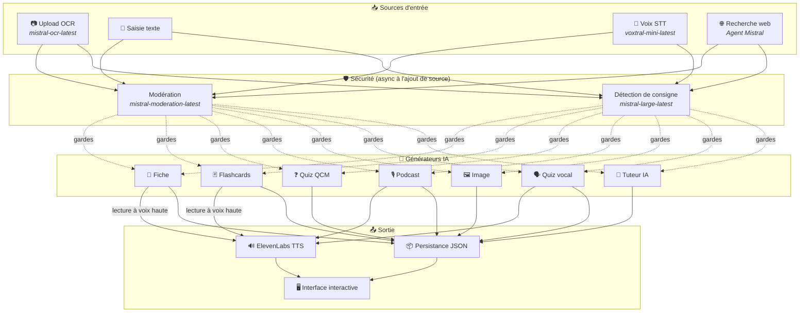
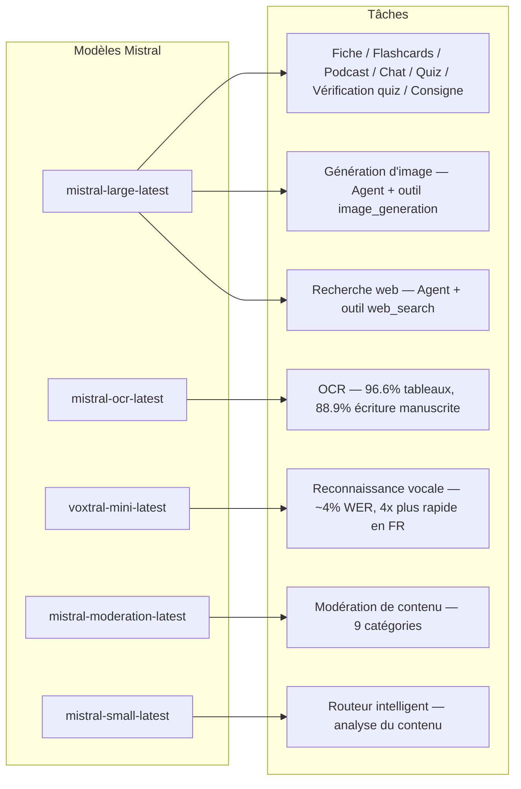
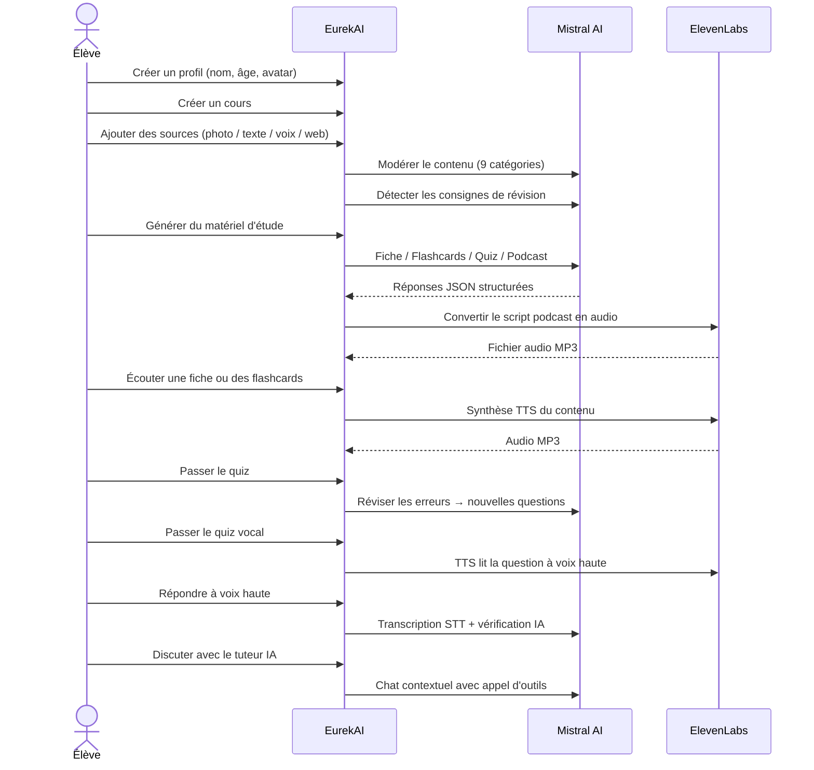

<p align="center">
  
</p>

<h1 align="center">EurekAI</h1>

<p align="center">
  <strong>किसी भी सामग्री को एक इंटरैक्टिव सीखने के अनुभव में बदलें — एआई द्वारा संचालित।</strong>
</p>

<p align="center">
  <a href="https://mistral.ai"></a>
  <a href="https://www.typescriptlang.org"></a>
  <a href="https://mistral.ai"></a>
  <a href="https://elevenlabs.io"></a>
</p>

<p align="center">
  <a href="https://www.youtube.com/watch?v=_b1TQz2leoI">▶️ YouTube पर डेमो देखें</a> · <a href="README-en.md">🇬🇧 अंग्रेज़ी में पढ़ें</a>
</p>

---

## कहानी — EurekAI क्यों?

**EurekAI** का जन्म [Mistral AI Worldwide Hackathon](https://worldwidehackathon.mistral.ai/) (मार्च 2026) के दौरान हुआ। मुझे एक विषय की ज़रूरत थी — और विचार बहुत व्यावहारिक चीज़ से आया: मैं नियमित रूप से अपनी बेटी के साथ परीक्षाओं की तैयारी करता हूँ, और मुझे लगा कि AI की मदद से इसे और अधिक मज़ेदार और इंटरैक्टिव बनाया जा सकता है।

लक्ष्य: **किसी भी इनपुट** — किताब की फोटो, कॉपी-पेस्ट किया गया टेक्स्ट, वॉयस रिकॉर्डिंग, वेब खोज — को लेकर उसे **रिविज़न शीट्स, फ्लैशकार्ड्स, क्विज़, पॉडकास्ट, चित्रण, और बहुत कुछ** में बदलना। यह सब Mistral AI के फ्रांसीसी मॉडलों द्वारा संचालित है, जिससे यह स्वाभाविक रूप से फ्रेंच-भाषी छात्रों के लिए उपयुक्त समाधान बनता है।

कोड की हर पंक्ति हैकाथॉन के दौरान लिखी गई थी। सभी ओपन-सोर्स APIs और लाइब्रेरीज़ का उपयोग हैकाथॉन के नियमों के अनुसार किया गया है।

---

## विशेषताएँ

| | विशेषता | विवरण |
|---|---|---|
| 📷 | **OCR अपलोड** | अपने नोट्स या किताब की फोटो लें — Mistral OCR उससे सामग्री निकालता है |
| 📝 | **पाठ इनपुट** | कोई भी टेक्स्ट सीधे टाइप या पेस्ट करें |
| 🎤 | **वॉयस इनपुट** | अपनी आवाज़ रिकॉर्ड करें — Voxtral STT आपकी आवाज़ को ट्रांसक्राइब करता है |
| 🌐 | **वेब खोज** | एक सवाल पूछें — एक Mistral Agent वेब पर जवाब खोजता है |
| 📄 | **रिविज़न शीट्स** | मुख्य बिंदुओं, शब्दावली, उद्धरणों, और किस्सों सहित संरचित नोट्स |
| 🃏 | **फ्लैशकार्ड्स** | सक्रिय याद करने के लिए स्रोत संदर्भों के साथ 5 प्रश्न/उत्तर कार्ड |
| ❓ | **MCQ क्विज़** | अनुकूली त्रुटि-समीक्षा के साथ 10-20 बहुविकल्पीय प्रश्न |
| 🎙️ | **पॉडकास्ट** | ElevenLabs के माध्यम से ऑडियो में बदला गया 2-आवाज़ों वाला छोटा पॉडकास्ट (Alex & Zoé) |
| 🖼️ | **चित्रण** | Mistral Agent द्वारा उत्पन्न शैक्षिक चित्र |
| 🗣️ | **वॉयस क्विज़** | प्रश्न ज़ोर से पढ़े जाते हैं, मौखिक उत्तर, AI उत्तर की जाँच करता है |
| 💬 | **AI ट्यूटर** | आपके पाठ दस्तावेज़ों के साथ टूल कॉलिंग सहित संदर्भगत चैट |
| 🧠 | **स्मार्ट राउटर** | AI आपकी सामग्री का विश्लेषण करता है और सर्वोत्तम जनरेटर सुझाता है |
| 🔒 | **अभिभावकीय नियंत्रण** | आयु-आधारित मॉडरेशन, अभिभावकीय PIN, चैट प्रतिबंध |
| 🌍 | **बहुभाषी** | फ़्रेंच और अंग्रेज़ी में पूर्ण इंटरफ़ेस और AI सामग्री |
| 🔊 | **ज़ोर से पढ़ना** | ElevenLabs TTS के माध्यम से शीट्स और फ्लैशकार्ड्स को ज़ोर से सुनें |

---

## आर्किटेक्चर का अवलोकन



---

## मॉडल उपयोग मानचित्र



---

## उपयोगकर्ता प्रवाह



---

## गहराई में — विशेषताएँ

### बहु-मोडल इनपुट

EurekAI उपचार से पहले मॉडरेट की गई 4 प्रकार की स्रोतों को स्वीकार करता है:

- **OCR अपलोड** — JPG, PNG या PDF फ़ाइलें `mistral-ocr-latest` द्वारा संसाधित। मुद्रित पाठ, तालिकाएँ (96.6% सटीकता), और हस्तलेखन (88.9% सटीकता) को संभालता है।
- **मुक्त टेक्स्ट** — कोई भी सामग्री टाइप या पेस्ट करें। संग्रहण से पहले मॉडरेशन से गुजरता है।
- **वॉयस इनपुट** — ब्राउज़र में ऑडियो रिकॉर्ड करें। `voxtral-mini-latest` द्वारा ~4% WER के साथ ट्रांसक्राइब। `language="fr"` पैरामीटर इसे 4x तेज़ बनाता है।
- **वेब खोज** — एक क्वेरी दर्ज करें। `web_search` टूल वाला एक अस्थायी Mistral Agent परिणामों को प्राप्त और सारांशित करता है।

### AI सामग्री जनरेशन

उत्पन्न सीखने की सामग्री के छह प्रकार:

| जनरेटर | मॉडल | आउटपुट |
|---|---|---|
| **रिविज़न शीट** | `mistral-large-latest` | शीर्षक, सारांश, 10-25 मुख्य बिंदु, शब्दावली, उद्धरण, किस्सा |
| **फ्लैशकार्ड्स** | `mistral-large-latest` | स्रोत संदर्भों के साथ 5 प्रश्न/उत्तर कार्ड |
| **MCQ क्विज़** | `mistral-large-latest` | 10-20 प्रश्न, प्रत्येक के 4 विकल्प, व्याख्याएँ, अनुकूली समीक्षा |
| **पॉडकास्ट** | `mistral-large-latest` + ElevenLabs | 2-आवाज़ों वाली स्क्रिप्ट (Alex & Zoé) → MP3 ऑडियो |
| **चित्रण** | Agent `mistral-large-latest` | `image_generation` टूल के माध्यम से शैक्षिक चित्र |
| **वॉयस क्विज़** | `mistral-large-latest` + ElevenLabs + Voxtral | TTS प्रश्न → STT उत्तर → AI सत्यापन |

### चैट-आधारित AI ट्यूटर

पाठ दस्तावेज़ों तक पूर्ण पहुँच वाला एक संवादात्मक ट्यूटर:

- `mistral-large-latest` का उपयोग करता है (128K टोकन संदर्भ विंडो)
- **टूल कॉलिंग**: बातचीत के दौरान तुरंत शीट्स, फ्लैशकार्ड्स, या क्विज़ बना सकता है
- प्रति पाठ 50 संदेशों का इतिहास
- आयु के अनुसार प्रोफाइल के लिए सामग्री मॉडरेशन

### बुद्धिमान स्वचालित राउटर

राउटर स्रोत सामग्री का विश्लेषण करने और यह सिफारिश करने के लिए `mistral-small-latest` का उपयोग करता है कि कौन से जनरेटर सबसे प्रासंगिक हैं — ताकि छात्रों को मैन्युअल रूप से चुनना न पड़े।

### अनुकूली सीखना

- **क्विज़ आँकड़े**: प्रत्येक प्रश्न के लिए प्रयासों और सटीकता का ट्रैक
- **क्विज़ समीक्षा**: कमजोर अवधारणाओं को लक्षित करने वाले 5-10 नए प्रश्न उत्पन्न करता है
- **निर्देश पहचान**: रिविज़न निर्देशों ("मैं अपना पाठ तब जानता हूँ जब मैं...") को पहचानता है और सभी जनरेटरों में प्राथमिकता देता है

### सुरक्षा और अभिभावकीय नियंत्रण

- **4 आयु समूह**: बच्चा (6-10), किशोर (11-15), छात्र (16+), वयस्क
- **सामग्री मॉडरेशन**: `mistral-moderation-latest` के माध्यम से 9 श्रेणियाँ, आयु समूह के अनुसार समायोजित सीमाएँ
- **अभिभावकीय PIN**: SHA-256 हैश, 15 वर्ष से कम आयु के प्रोफाइल के लिए आवश्यक
- **चैट प्रतिबंध**: AI चैट केवल 15 वर्ष और उससे अधिक आयु के प्रोफाइल के लिए उपलब्ध

### बहु-प्रोफ़ाइल सिस्टम

- नाम, आयु, अवतार, भाषा प्राथमिकताओं के साथ कई प्रोफाइल
- `profileId` के माध्यम से प्रोफाइल से जुड़े प्रोजेक्ट
- कैस्केड डिलीशन: एक प्रोफ़ाइल हटाने पर उसके सभी प्रोजेक्ट्स हट जाते हैं

### अंतर्राष्ट्रीयकरण

- पूर्ण इंटरफ़ेस फ़्रेंच और अंग्रेज़ी में उपलब्ध
- AI प्रॉम्प्ट आज 2 भाषाओं (FR, EN) का समर्थन करते हैं, और 15 (es, de, it, pt, nl, ja, zh, ko, ar, hi, pl, ro, sv) के लिए तैयार आर्किटेक्चर है
- प्रोफ़ाइल के अनुसार भाषा कॉन्फ़िगर की जा सकती है

---

## तकनीकी स्टैक

| परत | तकनीक | भूमिका |
|---|---|---|
| **रनटाइम** | Node.js + TypeScript 5.7 | सर्वर और टाइप सुरक्षा |
| **बैकएंड** | Express 4.21 | REST API |
| **डेव सर्वर** | Vite 7.3 + tsx | HMR, Handlebars partials, proxy |
| **फ्रंटएंड** | HTML + TailwindCSS 4.2 + Alpine.js 3.15 | प्रतिक्रियाशील इंटरफ़ेस, Vite द्वारा संकलित TypeScript |
| **टेम्पलेटिंग** | vite-plugin-handlebars | partials द्वारा HTML संयोजन |
| **AI** | Mistral AI SDK 1.14 | चैट, OCR, STT, Agents, मॉडरेशन |
| **TTS** | ElevenLabs SDK 2.36 | पॉडकास्ट और वॉयस क्विज़ के लिए वॉयस सिंथेसिस |
| **आइकन** | Lucide 0.575 | SVG आइकन लाइब्रेरी |
| **Markdown** | Marked 17 | चैट में markdown रेंडरिंग |
| **फ़ाइल अपलोड** | Multer 1.4 | multipart फ़ॉर्म हैंडलिंग |
| **ऑडियो** | ffmpeg-static | ऑडियो प्रोसेसिंग |
| **परीक्षण** | Vitest 4 | यूनिट परीक्षण |
| **स्थायित्व** | JSON फ़ाइलें | निर्भरता-रहित संग्रहण |

---

## मॉडलों का संदर्भ

| मॉडल | उपयोग | क्यों |
|---|---|---|
| `mistral-large-latest` | शीट, फ्लैशकार्ड्स, पॉडकास्ट, MCQ क्विज़, चैट, क्विज़ सत्यापन, इमेज एजेंट, वेब सर्च एजेंट, निर्देश पहचान | सर्वोत्तम multilingual + निर्देश पालन |
| `mistral-ocr-latest` | दस्तावेज़ OCR | तालिकाएँ 96.6% सटीक, हस्तलेखन 88.9% सटीक |
| `voxtral-mini-latest` | वॉयस पहचान | ~4% WER, `language="fr"` 4x+ गति देता है |
| `mistral-moderation-latest` | सामग्री मॉडरेशन | 9 श्रेणियाँ, बच्चों की सुरक्षा |
| `mistral-small-latest` | स्मार्ट राउटर | रूटिंग निर्णयों के लिए सामग्री का तेज़ विश्लेषण |
| `eleven_v3` (ElevenLabs) | वॉयस सिंथेसिस | पॉडकास्ट और वॉयस क्विज़ के लिए प्राकृतिक फ्रेंच आवाज़ें |

---

## त्वरित शुरुआत

```bash
# Cloner le dépôt
git clone https://github.com/your-username/eurekai.git
cd eurekai

# Installer les dépendances
npm install

# Configurer les clés API
cp .env.example .env
# Éditez .env avec vos clés :
#   MISTRAL_API_KEY=votre_clé_ici
#   ELEVENLABS_API_KEY=votre_clé_ici  (optionnel, pour les fonctions audio)

# Lancer le développement
npm run dev
# → Backend :  http://localhost:3000 (API)
# → Frontend : http://localhost:5173 (serveur Vite avec HMR)
```

> **नोट** : ElevenLabs वैकल्पिक है। इस कुंजी के बिना, पॉडकास्ट और वॉयस क्विज़ सुविधाएँ स्क्रिप्ट बनाएँगी लेकिन ऑडियो सिंथेसाइज़ नहीं करेंगी।

---

## परियोजना संरचना

```
server.ts                 — Point d'entrée Express, monte les routes + config
config.ts                 — Config runtime (modèles, voix, TTS), persistée dans output/config.json
store.ts                  — ProjectStore : CRUD projets/sources/générations, persistance JSON
profiles.ts               — ProfileStore : gestion des profils, hachage PIN
types.ts                  — Types TypeScript : Source, Generation (6 types), QuizStats, Profile
prompts.ts                — Tous les prompts IA centralisés (system + user templates, FR/EN)

generators/
  ocr.ts                  — Upload + OCR via Mistral (JPG, PNG, PDF)
  summary.ts              — Génération de fiche de révision (JSON structuré)
  flashcards.ts           — 5 flashcards Q/R
  quiz.ts                 — Quiz QCM (10-20 questions) + révision adaptative
  podcast.ts              — Script podcast 2 voix (Alex + Zoé)
  quiz-vocal.ts           — Quiz vocal : questions TTS + réponses STT + vérification IA
  image.ts                — Génération d'image via Agent Mistral (outil image_generation)
  chat.ts                 — Tuteur IA par chat avec appel d'outils
  router.ts               — Routeur automatique intelligent (contenu → générateurs recommandés)
  consigne.ts             — Détection de consignes de révision
  tts.ts                  — ElevenLabs TTS (eleven_v3, concaténation de segments)
  stt.ts                  — Voxtral STT (audio → texte)
  websearch.ts            — Agent Mistral avec outil web_search
  moderation.ts           — Modération de contenu (9 catégories)

routes/
  projects.ts             — CRUD projets
  sources.ts              — Upload OCR, texte libre, voix STT, recherche web, modération
  generate.ts             — Endpoints de génération (fiche/flashcards/quiz/podcast/image/vocal)
  generations.ts          — Tentatives de quiz, réponses vocales, lecture à voix haute, renommage, suppression
  chat.ts                 — Chat IA avec appel d'outils
  profiles.ts             — CRUD profils avec gestion du PIN

helpers/
  index.ts                — safeParseJson, unwrapJsonArray, extractAllText, timer
  audio.ts                — collectStream (ReadableStream → Buffer)

src/                      — Frontend (Vite + Handlebars)
  index.html              — Point d'entrée HTML principal
  main.ts                 — Entrée frontend (init Alpine.js + icônes Lucide)
  app/                    — Modules applicatifs Alpine.js
    state.ts              — Gestion d'état réactif
    navigation.ts         — Routage des vues + gardes par âge
    profiles.ts           — Logique du sélecteur de profils
    projects.ts           — CRUD des cours
    sources.ts            — Gestionnaires d'upload de sources
    generate.ts           — Déclencheurs de génération
    generations.ts        — Affichage + actions sur les générations
    chat.ts               — Interface de chat
    render.ts             — Helpers de rendu HTML
    i18n.ts               — Changement de langue
    ...
  components/
    quiz.ts               — Composant quiz interactif
    quiz-vocal.ts         — Composant quiz vocal
  i18n/
    fr.ts                 — Traductions françaises
    en.ts                 — Traductions anglaises
    index.ts              — Chargeur i18n
  partials/               — Partials HTML Handlebars (header, sidebar, dialogues, vues)
  styles/
    main.css              — Entrée TailwindCSS
    theme.css             — Variables de thème personnalisées

public/assets/            — Ressources statiques (logo, avatars)
output/                   — Données d'exécution (projets, config, fichiers audio)
```

---

## API संदर्भ

### कॉन्फ़िग
| विधि | एंडपॉइंट | विवरण |
|---|---|---|
| `GET` | `/api/config` | वर्तमान कॉन्फ़िगरेशन |
| `PUT` | `/api/config` | कॉन्फ़िग बदलें (मॉडल, आवाज़ें, TTS) |
| `GET` | `/api/config/status` | APIs की स्थिति (Mistral, ElevenLabs) |

### प्रोफ़ाइल
| विधि | एंडपॉइंट | विवरण |
|---|---|---|
| `GET` | `/api/profiles` | सभी प्रोफ़ाइल सूचीबद्ध करें |
| `POST` | `/api/profiles` | प्रोफ़ाइल बनाएँ |
| `PUT` | `/api/profiles/:id` | प्रोफ़ाइल संशोधित करें (15 वर्ष से कम के लिए PIN आवश्यक) |
| `DELETE` | `/api/profiles/:id` | प्रोफ़ाइल + कैस्केड प्रोजेक्ट्स हटाएँ |

### प्रोजेक्ट्स
| विधि | एंडपॉइंट | विवरण |
|---|---|---|
| `GET` | `/api/projects` | प्रोजेक्ट्स सूचीबद्ध करें |
| `POST` | `/api/projects` | `{name, profileId}` प्रोजेक्ट बनाएँ |
| `GET` | `/api/projects/:pid` | प्रोजेक्ट विवरण |
| `PUT` | `/api/projects/:pid` | `{name}` का नाम बदलें |
| `DELETE` | `/api/projects/:pid` | प्रोजेक्ट हटाएँ |

### स्रोत
| विधि | एंडपॉइंट | विवरण |
|---|---|---|
| `POST` | `/api/projects/:pid/sources/upload` | OCR अपलोड (multipart फ़ाइलें) |
| `POST` | `/api/projects/:pid/sources/text` | मुक्त टेक्स्ट `{text}` |
| `POST` | `/api/projects/:pid/sources/voice` | STT आवाज़ (multipart ऑडियो) |
| `POST` | `/api/projects/:pid/sources/websearch` | वेब खोज `{query}` |
| `DELETE` | `/api/projects/:pid/sources/:sid` | एक स्रोत हटाएँ |
| `POST` | `/api/projects/:pid/moderate` | `{text}` को मॉडरेट करें |
| `POST` | `/api/projects/:pid/detect-consigne` | रिविज़न निर्देशों का पता लगाएँ |

### जनरेशन
| विधि | एंडपॉइंट | विवरण |
|---|---|---|
| `POST` | `/api/projects/:pid/generate/summary` | रिविज़न शीट `{sourceIds?}` |
| `POST` | `/api/projects/:pid/generate/flashcards` | फ्लैशकार्ड्स `{sourceIds?}` |
| `POST` | `/api/projects/:pid/generate/quiz` | MCQ क्विज़ `{sourceIds?}` |
| `POST` | `/api/projects/:pid/generate/podcast` | पॉडकास्ट `{sourceIds?}` |
| `POST` | `/api/projects/:pid/generate/image` | चित्रण `{sourceIds?}` |
| `POST` | `/api/projects/:pid/generate/quiz-vocal` | वॉयस क्विज़ `{sourceIds?}` |
| `POST` | `/api/projects/:pid/generate/quiz-review` | अनुकूली समीक्षा `{generationId, weakQuestions}` |
| `POST` | `/api/projects/:pid/generate/auto` | राउटर द्वारा स्वचालित जनरेशन |

### CRUD जनरेशन
| विधि | एंडपॉइंट | विवरण |
|---|---|---|
| `POST` | `/api/projects/:pid/generations/:gid/quiz-attempt` | उत्तर सबमिट करें `{answers}` |
| `POST` | `/api/projects/:pid/generations/:gid/vocal-answer` | मौखिक उत्तर सत्यापित करें (multipart ऑडियो + questionIndex) |
| `POST` | `/api/projects/:pid/generations/:gid/read-aloud` | TTS को ज़ोर से पढ़ें (शीट्स/फ्लैशकार्ड्स) |
| `PUT` | `/api/projects/:pid/generations/:gid` | `{title}` का नाम बदलें |
| `DELETE` | `/api/projects/:pid/generations/:gid` | जनरेशन हटाएँ |

### चैट
| विधि | एंडपॉइंट | विवरण |
|---|---|---|
| `GET` | `/api/projects/:pid/chat` | चैट इतिहास प्राप्त करें |
| `POST` | `/api/projects/:pid/chat` | एक संदेश भेजें `{message}` |
| `DELETE` | `/api/projects/:pid/chat` | चैट इतिहास साफ़ करें |

---

## वास्तु संबंधी निर्णय

| निर्णय | औचित्य |
|---|---|
| **React/Vue के बजाय Alpine.js** | न्यूनतम फ़ुटप्रिंट, Vite द्वारा संकलित TypeScript के साथ हल्की प्रतिक्रियाशीलता। हैकाथॉन के लिए उपयुक्त जहाँ गति मायने रखती है। |
| **JSON फ़ाइलों में स्थायित्व** | शून्य निर्भरता, तुरंत शुरूआत। कॉन्फ़िगर करने के लिए कोई डेटाबेस नहीं — बस शुरू करें और चल पड़ें। |
| **Vite + Handlebars** | दोनों दुनियाओं का सर्वोत्तम: विकास के लिए तेज़ HMR, संगठन के लिए HTML partials, Tailwind JIT। |
| **केंद्रीकृत प्रॉम्प्ट्स** | सभी AI प्रॉम्प्ट `prompts.ts` में — भाषा/आयु समूह के अनुसार दोहराने, परीक्षण करने और अनुकूलित करने में आसान। |
| **बहु-जनरेशन प्रणाली** | प्रत्येक जनरेशन अपना अलग ID वाला स्वतंत्र ऑब्जेक्ट है — प्रति पाठ कई शीट्स, क्विज़ आदि की अनुमति देता है। |
| **आयु-अनुकूलित प्रॉम्प्ट्स** | 4 आयु समूह, अलग शब्दावली, जटिलता और टोन के साथ — वही सामग्री सीखने वाले के अनुसार अलग तरह से सिखाती है। |
| **एजेंट-आधारित सुविधाएँ** | इमेज जनरेशन और वेब खोज अस्थायी Mistral Agents का उपयोग करते हैं — स्वचालित सफ़ाई के साथ साफ़ जीवनचक्र। |

---

## श्रेय और आभार

- **[Mistral AI](https://mistral.ai)** — AI मॉडल (Large, OCR, Voxtral, Moderation, Small) + Worldwide Hackathon
- **[ElevenLabs](https://elevenlabs.io)** — वॉयस सिंथेसिस इंजन (`eleven_v3`)
- **[Alpine.js](https://alpinejs.dev)** — हल्का प्रतिक्रियाशील फ्रेमवर्क
- **[TailwindCSS](https://tailwindcss.com)** — यूटिलिटी CSS फ्रेमवर्क
- **[Vite](https://vitejs.dev)** — फ्रंटएंड बिल्ड टूल
- **[Lucide](https://lucide.dev)** — आइकन लाइब्रेरी
- **[Marked](https://marked.js.org)** — Markdown पार्सर

मार्च 2026 में Mistral AI Worldwide Hackathon के दौरान सावधानी से बनाया गया।

---

## लेखक

**Julien LS** — [contact@jls42.org](mailto:contact@jls42.org)

## लाइसेंस

[AGPL-3.0](LICENSE) — Copyright (C) 2026 Julien LS

**इस दस्तावेज़ का अनुवाद fr संस्करण से hi भाषा में gpt-5.4-mini मॉडल का उपयोग करके किया गया है। अनुवाद प्रक्रिया के बारे में अधिक जानकारी के लिए, https://gitlab.com/jls42/ai-powered-markdown-translator देखें**

