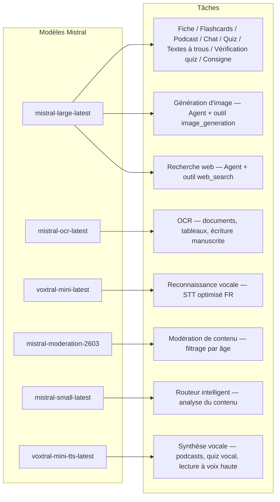
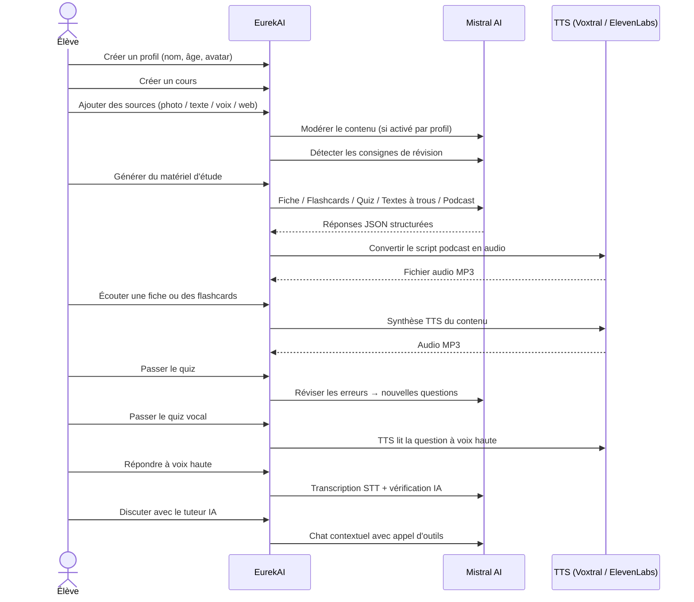

<p align="center">
  
</p>

<h1 align="center">EurekAI</h1>

<p align="center">
  <strong>किसी भी सामग्री को इंटरैक्टिव शिक्षण अनुभव में बदलें — <a href="https://mistral.ai">Mistral AI</a> द्वारा संचालित।</strong>
</p>

<p align="center">
  <a href="README-en.md">🇬🇧 English</a> · <a href="README-es.md">🇪🇸 Español</a> · <a href="README-pt.md">🇧🇷 Português</a> · <a href="README-de.md">🇩🇪 Deutsch</a> · <a href="README-it.md">🇮🇹 Italiano</a> · <a href="README-nl.md">🇳🇱 Nederlands</a> · <a href="README-ar.md">🇸🇦 العربية</a><br>
  <a href="README-hi.md">🇮🇳 हिन्दी</a> · <a href="README-zh.md">🇨🇳 中文</a> · <a href="README-ja.md">🇯🇵 日本語</a> · <a href="README-ko.md">🇰🇷 한국어</a> · <a href="README-pl.md">🇵🇱 Polski</a> · <a href="README-ro.md">🇷🇴 Română</a> · <a href="README-sv.md">🇸🇪 Svenska</a>
</p>

<p align="center">
  <a href="https://www.youtube.com/watch?v=_b1TQz2leoI"></a>
</p>

<h4 align="center">📊 कोड गुणवत्ता</h4>

<p align="center">
  <a href="https://sonarcloud.io/summary/new_code?id=jls42_EurekAI"></a>
  <a href="https://sonarcloud.io/summary/new_code?id=jls42_EurekAI"></a>
  <a href="https://sonarcloud.io/summary/new_code?id=jls42_EurekAI"></a>
  <a href="https://sonarcloud.io/summary/new_code?id=jls42_EurekAI"></a>
</p>
<p align="center">
  <a href="https://sonarcloud.io/summary/new_code?id=jls42_EurekAI"></a>
  <a href="https://sonarcloud.io/summary/new_code?id=jls42_EurekAI"></a>
  <a href="https://sonarcloud.io/summary/new_code?id=jls42_EurekAI"></a>
  <a href="https://sonarcloud.io/summary/new_code?id=jls42_EurekAI"></a>
</p>

---

## कहानी — क्यों EurekAI?

**EurekAI** का जन्म [Mistral AI Worldwide Hackathon](https://luma.com/mistralhack-online) ([आधिकारिक साइट](https://worldwide-hackathon.mistral.ai/)) के दौरान हुआ (मार्च 2026)। मुझे एक विषय चाहिए था — और विचार एक बहुत ही व्यावहारिक ज़रूरत से आया: मैं अपनी बेटी के साथ नियमित रूप से टेस्ट की तैयारी करता/करती हूँ, और मैंने सोचा कि इसे AI की मदद से और अधिक खेलपूर्ण और इंटरैक्टिव बनाया जा सकता है।

लक्ष्य: किसी भी इनपुट को लेना — किताब की तस्वीर, कॉपी-पेस्ट किया गया लेख, वॉइस रिकॉर्डिंग, वेब खोज — और उसे बदलकर **रिवीजन नोट्स, फ्लैशकार्ड्स, क्विज़, पॉडकास्ट, भरने के लिए खाली स्थान वाले टेक्स्ट, चित्र, और भी बहुत कुछ** बनाना। ये सब Mistral AI के फ़्रेंच मॉडल्स द्वारा संचालित है, जो फ्रेंच भाषी छात्रों के लिए इसे स्वाभाविक रूप से अनुकूल बनाता है।

हैकथॉन के दौरान हर एक लाइन कोड लिखी गई। सभी APIs और ओपन-सोर्स लाइब्रेरीज़ हैकथॉन के नियमों के अनुसार उपयोग की गई हैं।

---

## खूबियाँ

| | विशेषता | विवरण |
|---|---|---|
| 📷 | **Upload OCR** | अपनी किताब या नोट्स की फोटो लें — Mistral OCR उससे सामग्री निकालता है |
| 📝 | **टेक्स्ट एंट्री** | किसी भी टेक्स्ट को टाइप या पेस्ट करें सीधे |
| 🎤 | **वॉइस एंट्री** | रिकॉर्ड करें — Voxtral STT आपकी आवाज़ को ट्रांसक्राइब करता है |
| 🌐 | **वेब सर्च** | एक सवाल पूछें — एक Mistral एजेंट वेब से जवाब खोजता है |
| 📄 | **रिवीजन नोट्स** | संरचित नोट्स: मुख्य बिंदु, शब्दावली, उद्धरण, घटनाएँ |
| 🃏 | **फ्लैशकार्ड्स** | 5-50 Q/A कार्ड्स स्रोतों के रेफरेंसेस के साथ एक्टिव मेमरी के लिए |
| ❓ | **मल्टिपल चॉइस क्विज़** | 5-50 बहुविकल्पीय प्रश्न, गलतियों की अनुकूलित दोहराई के साथ |
| ✏️ | **भरने वाले टेक्स्ट** | संकेतों और सहिष्णु मान्यकरण के साथ पूर्ण करने के अभ्यास |
| 🎙️ | **पॉडकास्ट** | 2-आवाज़ वाला मिनी-पॉडकास्ट, Mistral Voxtral TTS के जरिए ऑडियो में बदला गया |
| 🖼️ | **चित्रण** | शैक्षिक छवियाँ जो एक Mistral एजेंट द्वारा जेनरेट होती हैं |
| 🗣️ | **वॉइस क्विज़** | प्रश्नों को ज़ोर से पढ़ा जाता है, उत्तर मौखिक दिया जाता है, AI उत्तर की जाँच करता है |
| 💬 | **AI ट्यूटर** | आपके कोर्स दस्तावेज़ों के सन्दर्भ के साथ कंटेक्स्ट-आधारित चैट, टूल कॉलिंग के साथ |
| 🧠 | **स्मार्ट राउटर** | AI आपकी सामग्री का विश्लेषण करता है और उपलब्ध 7 जनरेटर में से सबसे उपयुक्त सुझाता है |
| 🔒 | **पेरेंटल कंट्रोल** | आयु-आधारित मॉडरेशन, पेरेंटल PIN, चैट पर प्रतिबंध |
| 🌍 | **बहुभाषी** | इंटरफ़ेस और AI सामग्री फ्रेंच और अंग्रेज़ी में पूरी तरह उपलब्ध |
| 🔊 | **पाठ पढ़कर सुनाना** | Fiches और फ्लैशकार्ड्स को Mistral Voxtral TTS या ElevenLabs के जरिए सुनें |

---

## आर्किटेक्चर का अवलोकन


---

## मॉडल उपयोग मानचित्र



---

## उपयोगकर्ता यात्रा



---

## गहराई में — खूबियाँ

### मल्टी-मोडल इनपुट

EurekAI चार प्रकार के स्रोत स्वीकार करता है, जो प्रोफ़ाइल के अनुसार मॉडरेट होते हैं (बच्चे और टीन के लिए डिफ़ॉल्ट रूप से सक्रिय):

- **Upload OCR** — JPG, PNG या PDF फाइलें `mistral-ocr-latest` द्वारा प्रोसेस की जाती हैं। प्रिंटेड टेक्स्ट, टेबल्स और हैंडराइटिंग संभालता है।
- **सादा टेक्स्ट** — किसी भी सामग्री को टाइप या पेस्ट करें। यदि मॉडरेशन सक्रिय है तो संग्रह से पहले मॉडरेट की जाती है।
- **वॉइस एंट्री** — ब्राउज़र में ऑडियो रिकॉर्ड करें। `voxtral-mini-latest` द्वारा ट्रांसक्राइब किया जाता है। `language="fr"` पैरामीटर रिकॉग्निशन को अनुकूलित करता है।
- **वेब सर्च** — एक क्वेरी दर्ज करें। अस्थायी Mistral एजेंट `web_search` टूल के साथ परिणाम प्राप्त कर के संक्षेप करता है।

### AI कंटेंट जेनरेशन

सात प्रकार के शिक्षण सामग्री जेनरेट होते हैं:

| जेनरेटर | मॉडल | आउटपुट |
|---|---|---|
| **रिवीजन नोट्स** | `mistral-large-latest` | शीर्षक, सारांश, 10-25 मुख्य बिंदु, शब्दावली, उद्धरण, घटना |
| **फ्लैशकार्ड्स** | `mistral-large-latest` | 5-50 Q/A कार्ड्स स्रोत संदर्भों के साथ सक्रिय स्मरण के लिये |
| **मल्टिपल चॉइस क्विज़** | `mistral-large-latest` | 5-50 प्रश्न, हर एक के 4 विकल्प, स्पष्टीकरण, अनुकूलित पुनरावृति |
| **भरने वाले टेक्स्ट** | `mistral-large-latest` | संकेतों के साथ पूरा करने योग्य वाक्य, सहिष्णु मान्यकरण (Levenshtein) |
| **पॉडकास्ट** | `mistral-large-latest` + Voxtral TTS | 2-आवाज़ स्क्रिप्ट → MP3 ऑडियो |
| **चित्रण** | एजेंट `mistral-large-latest` | टूल `image_generation` के माध्यम से शैक्षिक छवि |
| **वॉइस क्विज़** | `mistral-large-latest` + Voxtral TTS + STT | प्रश्न TTS → उत्तर STT → AI वेरिफिकेशन |

### चैट द्वारा AI ट्यूटर

एक संवादात्मक ट्यूटर जिसे कोर्स दस्तावेज़ों तक पूर्ण पहुंच है:

- उपयोग करता है `mistral-large-latest`
- **टूल कॉलिंग**: बातचीत के दौरान फिचर, फ्लैशकार्ड, क्विज़ या भरने वाले टेक्स्ट जेनरेट कर सकता है
- हर कोर्स के लिए 50 संदेशों का इतिहास
- यदि प्रोफ़ाइल के लिए एक्टिव हो तो कंटेंट मॉडरेशन लागू

### ऑटोमैटिक स्मार्ट राउटर

राउटर `mistral-small-latest` का उपयोग करके स्रोतों की सामग्री का विश्लेषण करता है और उपलब्ध 7 जनरेटर में सबसे उपयुक्त कौन से हैं यह सुझाता — ताकि छात्रों को मैन्युअली चुनने की आवश्यकता न पड़े। UI रीयल-टाइम प्रोग्रेस दिखाता है: पहले एक विश्लेषण चरण, फिर व्यक्तिगत जेनरेशन्स जिनको रद्द किया जा सकता है।

### अनुकूलनशील अधिगम

- **क्विज़ आँकड़े**: प्रश्न अनुसार प्रयासों और सटीकता का ट्रैक
- **क्विज़ रिवीजन**: कमजोर अवधारणाओं को लक्षित करते हुए 5-10 नए प्रश्न जेनरेट करता है
- **निर्देश पहचान**: रिवीजन निर्देशों का पता लगाता है ("मैं अपना पाठ जानता हूँ अगर मैं ... जानता हूँ") और उन निर्देशों को सभी जेनरेटर में प्राथमिकता देता है

### सुरक्षा और पेरेंटल कंट्रोल

- **4 आयु समूह**: बच्चा (≤10), टीन (11-15), विद्यार्थी (16-25), वयस्क (26+)
- **कंटेंट मॉडरेशन**: `mistral-moderation-2603` जिनमें 5 श्रेणियाँ ब्लॉक हैं बच्चे/टीन के लिए (sexual, hate, violence, selfharm, jailbreaking), विद्यार्थी/वयस्क के लिए कोई प्रतिबंध नहीं
- **पेरेंटल PIN**: SHA-256 हैश, 15 साल से कम प्रोफाइल के लिए आवश्यक
- **चैट प्रतिबंध**: 16 साल से कम के लिए डिफ़ॉल्ट रूप से AI चैट बंद, माता-पिता द्वारा सक्रिय किया जा सकता है

### मल्टी-प्रोफ़ाइल सिस्टम

- कई प्रोफाइल्स जिनमें नाम, आयु, अवतार, भाषा प्राथमिकताएँ
- प्रोफाइल से जुड़े प्रोजेक्ट्स `profileId` के माध्यम से
- कैस्केड डिलीट: एक प्रोफाइल हटाने पर उसके सभी प्रोजेक्ट्स हट जाते हैं

### TTS मल्टी-प्रोवाइडर

- **Mistral Voxtral TTS** (डिफ़ॉल्ट): `voxtral-mini-tts-latest`, किसी अतिरिक्त कुंजी की आवश्यकता नहीं
- **ElevenLabs** (वैकल्पिक): `eleven_v3`, नेचुरल वॉइस, आवश्यक है `ELEVENLABS_API_KEY`
- प्रोवाइडर ऐप सेटिंग्स में कॉन्फ़िगर किया जा सकता है

### इंटरनेशनलाइज़ेशन

- इंटरफ़ेस पूरी तरह फ्रेंच और अंग्रेज़ी में उपलब्ध
- AI प्रॉम्प्ट आज 2 भाषाएँ (FR, EN) सपोर्ट करते हैं और आर्किटेक्चर 15 भाषाओं के लिए तैयार है (es, de, it, pt, nl, ja, zh, ko, ar, hi, pl, ro, sv)
- भाषा प्रोफ़ाइल द्वारा कॉन्फ़िगर की जा सकती है

---

## टेक्निकल स्टैक

| परत | टेक्नोलॉजी | भूमिका |
|---|---|---|
| **Runtime** | Node.js + TypeScript 5.7 | सर्वर और टाइप सुरक्षा |
| **Backend** | Express 4.21 | REST API |
| **डेव सर्वर** | Vite 7.3 + tsx | HMR, Handlebars partials, proxy |
| **Frontend** | HTML + TailwindCSS 4.2 + Alpine.js 3.15 | रिएक्टिव इंटरफ़ेस, TypeScript Vite द्वारा कंपाइल |
| **Templating** | vite-plugin-handlebars | partials के जरिए HTML कंपोज़िशन |
| **AI** | Mistral AI SDK 2.1 | Chat, OCR, STT, TTS, Agents, मॉडरेशन |
| **TTS (डिफ़ॉल्ट)** | Mistral Voxtral TTS | `voxtral-mini-tts-latest`, इनबिल्ट स्पीच सिंथेसिस |
| **TTS (वैकल्पिक)** | ElevenLabs SDK 2.36 | `eleven_v3`, नेचुरल वॉइस |
| **आइकन** | Lucide 0.575 | SVG आइकन लाइब्रेरी |
| **Markdown** | Marked 17 | चैट में Markdown रेंडरिंग |
| **फाइल अपलोड** | Multer 1.4 | multipart फॉर्म हैंडलिंग |
| **ऑडियो** | ffmpeg-static | ऑडियो सेगमेंट्स का जोड़ |
| **टेस्ट्स** | Vitest 4 | यूनिट टेस्ट — कवरेज SonarCloud से मापी जाती है |
| **परसिस्टेंस** | JSON फ़ाइलें | निर्भरता-रहित स्टोरेज |

---

## मॉडल संदर्भ

| मॉडल | उपयोग | क्यों |
|---|---|---|
| `mistral-large-latest` | नोट्स, फ्लैशकार्ड्स, पॉडकास्ट, क्विज़, भरने वाले टेक्स्ट, चैट, वॉइस क्विज़ वेरिफिकेशन, इमेज एजेंट, वेब सर्च एजेंट, निर्देश पहचान | बेस्ट मल्टीलिंगुअल + निर्देशों का फॉलो-अप |
| `mistral-ocr-latest` | दस्तावेज़ों का OCR | प्रिंटेड टेक्स्ट, टेबल्स, हैंडराइटिंग |
| `voxtral-mini-latest` | वॉइस रिकॉग्निशन (STT) | मल्टीलिंगुअल STT, `language="fr"` के साथ ऑप्टिमाइज़्ड |
| `voxtral-mini-tts-latest` | स्पीच सिंथेसिस (TTS) | पॉडकास्ट, वॉइस क्विज़, रीड-अलाउड |
| `mistral-moderation-2603` | कंटेंट मॉडरेशन | बच्चे/टीन के लिए 5 ब्लॉक कीटेगरी (+ jailbreaking) |
| `mistral-small-latest` | स्मार्ट राउटर | राउटिंग निर्णयों के लिए तेज़ कंटेंट एनालिसिस |
| `eleven_v3` (ElevenLabs) | स्पीच सिंथेसिस (वैकल्पिक TTS) | नेचुरल वॉइस, कॉन्फ़िगर करने योग्य वैकल्पिक |

---

## त्वरित शुरुआत

```bash
# Cloner le dépôt
git clone https://github.com/jls42/EurekAI.git
cd EurekAI

# Installer les dépendances
npm install

# Configurer les clés API
cp .env.example .env
# Éditez .env avec vos clés :
#   MISTRAL_API_KEY=votre_clé_ici           (requis)
#   ELEVENLABS_API_KEY=votre_clé_ici        (optionnel, TTS alternatif)

# Lancer le développement
npm run dev
# → Backend :  http://localhost:3000 (API)
# → Frontend : http://localhost:5173 (serveur Vite avec HMR)
```

> **नोट** : Mistral Voxtral TTS डिफ़ॉल्ट प्रोवाइडर है — `MISTRAL_API_KEY` के अलावा कोई अतिरिक्त कुंजी आवश्यक नहीं। ElevenLabs एक वैकल्पिक TTS प्रोवाइडर है जिसे ऐप सेटिंग्स में कॉन्फ़िगर किया जा सकता है।

---

## प्रोजेक्ट संरचना

```
server.ts                 — Point d'entrée Express, monte les routes + config
config.ts                 — Config runtime (modèles, voix, TTS provider), persistée dans output/config.json
store.ts                  — ProjectStore : CRUD projets/sources/générations, persistance JSON
profiles.ts               — ProfileStore : gestion des profils, hachage PIN
types.ts                  — Types TypeScript : Source, Generation (7 types), QuizStats, Profile
prompts.ts                — Tous les prompts IA centralisés (system + user templates, FR/EN)

generators/
  ocr.ts                  — Upload + OCR via Mistral (JPG, PNG, PDF)
  summary.ts              — Génération de fiche de révision (JSON structuré)
  flashcards.ts           — Flashcards Q/R (5-50, configurable)
  quiz.ts                 — Quiz QCM (5-50 questions, configurable) + révision adaptative
  fill-blank.ts           — Exercices à trous avec validation tolérante
  podcast.ts              — Script podcast 2 voix
  quiz-vocal.ts           — Quiz vocal : questions TTS + réponses STT + vérification IA
  image.ts                — Génération d'image via Agent Mistral (outil image_generation)
  chat.ts                 — Tuteur IA par chat avec appel d'outils
  router.ts               — Routeur automatique intelligent (contenu → générateurs recommandés)
  consigne.ts             — Détection de consignes de révision
  tts-provider.ts         — Dispatch TTS multi-provider (Mistral Voxtral / ElevenLabs)
  tts.ts                  — Génération audio podcast (concaténation de segments)
  stt.ts                  — Voxtral STT (audio → texte)
  websearch.ts            — Agent Mistral avec outil web_search
  moderation.ts           — Modération de contenu (filtrage par âge)

routes/
  projects.ts             — CRUD projets
  profiles.ts             — CRUD profils avec gestion du PIN
  sources.ts              — Upload OCR, texte libre, voix STT, recherche web, modération
  generate.ts             — Endpoints de génération (7 types + auto + route)
  generations.ts          — Tentatives de quiz/fill-blank, réponses vocales, lecture à voix haute
  chat.ts                 — Chat IA avec appel d'outils

helpers/
  index.ts                — safeParseJson, unwrapJsonArray, extractAllText, timer
  audio.ts                — collectStream (ReadableStream → Buffer)
  fill-blank-validate.ts  — Validation tolérante des réponses (normalisation, Levenshtein)

src/                      — Frontend (Vite + Handlebars)
  index.html              — Point d'entrée HTML principal
  main.ts                 — Entrée frontend (init Alpine.js + icônes Lucide)
  app/                    — Modules applicatifs Alpine.js
    state.ts              — Gestion d'état réactif
    navigation.ts         — Routage des vues + gardes par âge
    profiles.ts           — Logique du sélecteur de profils
    projects.ts           — CRUD des cours
    sources.ts            — Gestionnaires d'upload de sources
    generate.ts           — Déclencheurs de génération (individuel, tout, auto 2 phases)
    generations.ts        — Affichage + actions sur les générations
    chat.ts               — Interface de chat
    config.ts             — Interface de configuration (modèles, voix, TTS provider)
    render.ts             — Helpers de rendu HTML
    i18n.ts               — Changement de langue
    ...
  components/
    quiz.ts               — Composant quiz interactif
    quiz-vocal.ts         — Composant quiz vocal
    fill-blank.ts         — Composant textes à trous
    flashcards.ts         — Composant flashcards avec retournement
    step-by-step.ts       — Mixin navigation pas-à-pas (quiz, fill-blank, flashcards)
  i18n/
    fr.ts                 — Traductions françaises
    en.ts                 — Traductions anglaises
    index.ts              — Chargeur i18n
  partials/               — Partials HTML Handlebars (header, sidebar, dialogues, vues)
  styles/
    main.css              — Entrée TailwindCSS
    theme.css             — Variables de thème personnalisées

public/assets/            — Ressources statiques (logo, avatars)
output/                   — Données d'exécution (projets, config, fichiers audio)
```

---

## API संदर्भ

### कॉन्फ़िग
| मेथड | एंडपॉइंट | विवरण |
|---|---|---|
| `GET` | `/api/config` | वर्तमान कॉन्फ़िग |
| `PUT` | `/api/config` | कॉन्फ़िग बदलें (मॉडल्स, वॉइस, TTS प्रोवाइडर) |
| `GET` | `/api/config/status` | APIs का स्टेटस (Mistral, ElevenLabs, TTS) |
| `POST` | `/api/config/reset` | डिफ़ॉल्ट कॉन्फ़िग रीसेट करें |
| `GET` | `/api/config/voices` | Mistral TTS वॉइसेस की लिस्ट (विकल्प `?lang=fr`) |

### प्रोफाइल्स
| मेथड | एंडपॉइंट | विवरण |
|---|---|---|
| `GET` | `/api/profiles` | सभी प्रोफाइल लिस्ट करें |
| `POST` | `/api/profiles` | प्रोफाइल बनाएं |
| `PUT` | `/api/profiles/:id` | प्रोफाइल एडिट करें (PIN आवश्यक अगर < 15 साल) |
| `DELETE` | `/api/profiles/:id` | प्रोफाइल + उसके प्रोजेक्ट्स को डिलीट करें |

### प्रोजेक्ट्स
| मेथड | एंडपॉइंट | विवरण |
|---|---|---|
| `GET` | `/api/projects` | प्रोजेक्ट्स लिस्ट करें |
| `POST` | `/api/projects` | प्रोजेक्ट बनाएं `{name, profileId}` |
| `GET` | `/api/projects/:pid` | प्रोजेक्ट विवरण |
| `PUT` | `/api/projects/:pid` | नाम बदलें `{name}` |
| `DELETE` | `/api/projects/:pid` | प्रोजेक्ट डिलीट करें |

### स्रोत
| मेथड | एंडपॉइंट | विवरण |
|---|---|---|
| `POST` | `/api/projects/:pid/sources/upload` | Upload OCR (multipart फाइलें) |
| `POST` | `/api/projects/:pid/sources/text` | सादा टेक्स्ट `{text}` |
| `POST` | `/api/projects/:pid/sources/voice` | वॉइस STT (multipart ऑडियो) |
| `POST` | `/api/projects/:pid/sources/websearch` | वेब सर्च `{query}` |
| `DELETE` | `/api/projects/:pid/sources/:sid` | स्रोत हटाएं |
| `POST` | `/api/projects/:pid/moderate` | मॉडरेट करें `{text}` |
| `POST` | `/api/projects/:pid/detect-consigne` | रिवीजन निर्देशों का पता लगाएं |

### जेनरेशन
| मेथड | एंडपॉइंट | विवरण |
|---|---|---|
| `POST` | `/api/projects/:pid/generate/summary` | रिवीजन नोट्स |
| `POST` | `/api/projects/:pid/generate/flashcards` | फ्लैशकार्ड्स |
| `POST` | `/api/projects/:pid/generate/quiz` | मल्टिपल चॉइस क्विज़ |
| `POST` | `/api/projects/:pid/generate/fill-blank` | भरने वाले टेक्स्ट |
| `POST` | `/api/projects/:pid/generate/podcast` | पॉडकास्ट |
| `POST` | `/api/projects/:pid/generate/image` | चित्रण |
| `POST` | `/api/projects/:pid/generate/quiz-vocal` | वॉइस क्विज़ |
| `POST` | `/api/projects/:pid/generate/quiz-review` | अनुकूली रिवीजन `{generationId, weakQuestions}` |
| `POST` | `/api/projects/:pid/generate/route` | राउटिंग एनालिसिस (कौन से जनरेटर चलाने हैं का प्लान) |
| `POST` | `/api/projects/:pid/generate/auto` | ऑटो बैकएंड जेनरेशन (राउटिंग + 5 प्रकार: summary, flashcards, quiz, fill-blank, podcast) |

सभी जेनरेशन रूट्स `{sourceIds?, lang?, ageGroup?, count?, useConsigne?}` स्वीकार करते हैं।

### CRUD जेनरेशन्स
| मेथड | एंडपॉइंट | विवरण |
|---|---|---|
| `POST` | `/api/projects/:pid/generations/:gid/quiz-attempt` | क्विज़ के उत्तर सबमिट करें `{answers}` |
| `POST` | `/api/projects/:pid/generations/:gid/fill-blank-attempt` | भरने वाले टेक्स्ट के उत्तर सबमिट करें `{answers}` |
| `POST` | `/api/projects/:pid/generations/:gid/vocal-answer` | मौखिक उत्तर की जाँच करें (ऑडियो + questionIndex) |
| `POST` | `/api/projects/:pid/generations/:gid/read-aloud` | TTS द्वारा पढ़ना (नोट्स/फ्लैशकार्ड्स) |
| `PUT` | `/api/projects/:pid/generations/:gid` | नाम बदलें `{title}` |
| `DELETE` | `/api/projects/:pid/generations/:gid` | जेनरेशन डिलीट करें |

### चैट
| मेथड | एंडपॉइंट | विवरण |
|---|---|---|
| `GET` | `/api/projects/:pid/chat` | चैट इतिहास प्राप्त करें |
| `POST` | `/api/projects/:pid/chat` | संदेश भेजें `{message, lang, ageGroup}` |
| `DELETE` | `/api/projects/:pid/chat` | चैट इतिहास मिटाएँ |

---

## आर्किटेक्चरल निर्णय

| निर्णय | औचित्य |
|---|---|
| **Alpine.js बनाम React/Vue** | हल्का फुटप्रिंट, TypeScript के साथ हल्की रिएक्टिविटी। हैकथॉन में गति मायने रखती है तो यह उत्तम। |
| **JSON फाइलों में परसिस्टेंस** | शून्य निर्भरता, त्वरित स्टार्ट। कोई DB कॉन्फ़िगरेशन नहीं — बस शुरू करें। |
| **Vite + Handlebars** | दोनों का बेहतरीन मेल: डेव के लिए तेज HMR, कोड ऑर्गनाइज़ेशन के लिए HTML partials, Tailwind JIT। |
| **केंद्रीकृत प्रॉम्प्ट्स** | सभी AI प्रॉम्प्ट्स `prompts.ts` में — भाषा/आयु समूह के अनुसार आसान परीक्षण और अनुकूलन। |
| **मल्टी-जेनरेशन सिस्टम** | हर जेनरेशन एक स्वतंत्र ऑब्जेक्ट है अपनी ID के साथ — प्रति कोर्स कई नोट्स, क्विज़ आदि की अनुमति देता है। | **आयु-अनुकूल प्रॉम्प्ट** | 4 आयु-समूह जिनकी शब्दावली, जटिलता और लहजा अलग-अलग हैं — वही सामग्री अलग-अलग शिक्षार्थियों के अनुसार अलग ढंग से पढ़ाती है। |
| **एजेंट-आधारित सुविधाएँ** | इमेज जनरेशन और वेब खोज अस्थायी Mistral एजेंट्स का उपयोग करती हैं — स्वच्छ लाइफसाइकिल और स्वचालित क्लीनअप के साथ। |
| **मल्टी-प्रोवाइडर TTS** | डिफ़ॉल्ट रूप से Mistral Voxtral TTS (कोई अतिरिक्त कुंजी नहीं), वैकल्पिक रूप से ElevenLabs — बिना पुनःप्रारम्भ के कॉन्फ़िगर करने योग्य। |

---

## क्रेडिट और धन्यवाद

- **[Mistral AI](https://mistral.ai)** — AI मॉडल (Large, OCR, Voxtral STT, Voxtral TTS, Moderation, Small) + विश्वव्यापी हैकाथॉन
- **[ElevenLabs](https://elevenlabs.io)** — वैकल्पिक आवाज़ संश्लेषण इंजन (`eleven_v3`)
- **[Alpine.js](https://alpinejs.dev)** — हल्का प्रतिक्रियाशील फ्रेमवर्क
- **[TailwindCSS](https://tailwindcss.com)** — उपयोगी CSS फ्रेमवर्क
- **[Vite](https://vitejs.dev)** — फ्रंटएंड बिल्ड टूल
- **[Lucide](https://lucide.dev)** — आइकन लाइब्रेरी
- **[Marked](https://marked.js.org)** — Markdown पार्सर

Mistral AI विश्वव्यापी हैकाथॉन के दौरान, मार्च 2026 में सावधानीपूर्वक निर्मित।

---

## लेखक

**Julien LS** — [contact@jls42.org](mailto:contact@jls42.org)

## लाइसेंस

[AGPL-3.0](LICENSE) — कॉपीराइट (C) 2026 Julien LS

**यह दस्तावेज़ fr संस्करण से hi भाषा में gpt-5-mini मॉडल का उपयोग करके अनुवादित किया गया है। अधिक जानकारी के लिए अनुवाद प्रक्रिया के बारे में देखें https://gitlab.com/jls42/ai-powered-markdown-translator**

