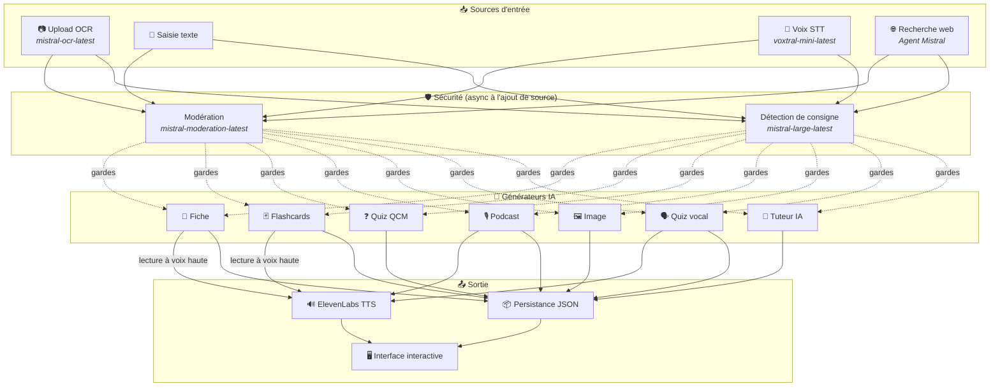
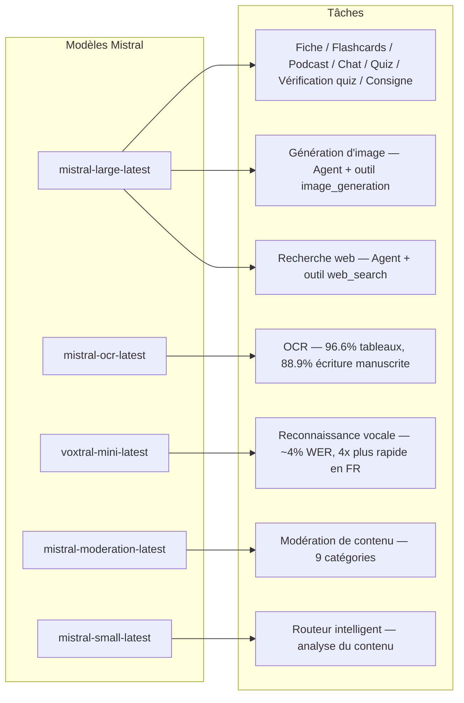
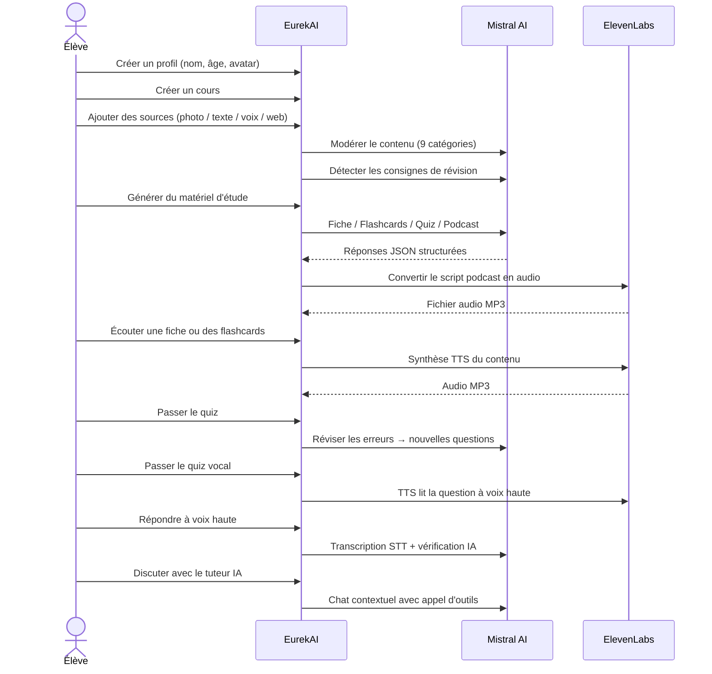

<p align="center">
  
</p>

<h1 align="center">EurekAI</h1>

<p align="center">
  <strong>Trasforma qualsiasi contenuto in un'esperienza di apprendimento interattiva — potenziata dall'IA.</strong>
</p>

<p align="center">
  <a href="https://mistral.ai"></a>
  <a href="https://www.typescriptlang.org"></a>
  <a href="https://mistral.ai"></a>
  <a href="https://elevenlabs.io"></a>
</p>

<p align="center">
  <a href="https://www.youtube.com/watch?v=_b1TQz2leoI">▶️ Guarda la demo su YouTube</a> · <a href="README-en.md">🇬🇧 Leggi in inglese</a>
</p>

---

## La storia — Perché EurekAI?

**EurekAI** è nato durante il [Mistral AI Worldwide Hackathon](https://worldwidehackathon.mistral.ai/) (marzo 2026). Mi serviva un tema — e l'idea è arrivata da qualcosa di molto concreto: preparo regolarmente le verifiche con mia figlia, e mi sono detto che doveva essere possibile rendere tutto più ludico e interattivo grazie all'IA.

L'obiettivo: prendere **qualsiasi input** — una foto del manuale, un testo copiato e incollato, una registrazione vocale, una ricerca web — e trasformarlo in **schede di ripasso, flashcard, quiz, podcast, illustrazioni e molto altro**. Il tutto potenziato dai modelli francesi di Mistral AI, il che lo rende una soluzione naturalmente adatta agli studenti francofoni.

Ogni riga di codice è stata scritta durante l'hackathon. Tutte le API e le librerie open source sono utilizzate in conformità con le regole dell'hackathon.

---

## Funzionalità

| | Funzionalità | Descrizione |
|---|---|---|
| 📷 | **Upload OCR** | Scatta una foto del tuo manuale o dei tuoi appunti — Mistral OCR ne estrae il contenuto |
| 📝 | **Inserimento testo** | Digita o incolla qualsiasi testo direttamente |
| 🎤 | **Input vocale** | Registrati — Voxtral STT trascrive la tua voce |
| 🌐 | **Ricerca web** | Fai una domanda — un Agente Mistral cerca le risposte sul web |
| 📄 | **Schede di ripasso** | Appunti strutturati con punti chiave, vocabolario, citazioni, aneddoti |
| 🃏 | **Flashcard** | 5 carte Q/R con riferimenti alle fonti per la memorizzazione attiva |
| ❓ | **Quiz a scelta multipla** | 10-20 domande a scelta multipla con ripasso adattivo degli errori |
| 🎙️ | **Podcast** | Mini-podcast a 2 voci (Alex & Zoé) convertito in audio tramite ElevenLabs |
| 🖼️ | **Illustrazioni** | Immagini educative generate da un Agente Mistral |
| 🗣️ | **Quiz vocale** | Domande lette ad alta voce, risposta orale, l'IA verifica la risposta |
| 💬 | **Tutor IA** | Chat contestuale con i tuoi documenti di corso, con chiamata di strumenti |
| 🧠 | **Router intelligente** | L'IA analizza il tuo contenuto e raccomanda i generatori migliori |
| 🔒 | **Controllo parentale** | Moderazione per età, PIN parentale, restrizioni della chat |
| 🌍 | **Multilingue** | Interfaccia e contenuti IA completi in francese e inglese |
| 🔊 | **Lettura ad alta voce** | Ascolta schede e flashcard lette ad alta voce tramite ElevenLabs TTS |

---

## Panoramica dell'architettura



---

## Mappa di utilizzo dei modelli



---

## Percorso utente



---

## Approfondimento — Funzionalità

### Input multimodale

EurekAI accetta 4 tipi di sorgenti, tutte moderate prima dell'elaborazione:

- **Upload OCR** — File JPG, PNG o PDF elaborati da `mistral-ocr-latest`. Gestisce testo stampato, tabelle (precisione 96.6%) e scrittura a mano (precisione 88.9%).
- **Testo libero** — Digita o incolla qualsiasi contenuto. Passa attraverso la moderazione prima della memorizzazione.
- **Input vocale** — Registra audio nel browser. Trascritto da `voxtral-mini-latest` con ~4% WER. Il parametro `language="fr"` lo rende 4x più veloce.
- **Ricerca web** — Inserisci una query. Un Agente Mistral temporaneo con lo strumento `web_search` recupera e riassume i risultati.

### Generazione di contenuti IA

Sei tipi di materiale didattico generato:

| Generatore | Modello | Output |
|---|---|---|
| **Scheda di ripasso** | `mistral-large-latest` | Titolo, riepilogo, 10-25 punti chiave, vocabolario, citazioni, aneddoto |
| **Flashcard** | `mistral-large-latest` | 5 carte Q/R con riferimenti alle fonti |
| **Quiz a scelta multipla** | `mistral-large-latest` | 10-20 domande, 4 opzioni ciascuna, spiegazioni, ripasso adattivo |
| **Podcast** | `mistral-large-latest` + ElevenLabs | Script a 2 voci (Alex & Zoé) → audio MP3 |
| **Illustrazione** | Agente `mistral-large-latest` | Immagine educativa tramite lo strumento `image_generation` |
| **Quiz vocale** | `mistral-large-latest` + ElevenLabs + Voxtral | Domande TTS → risposta STT → verifica IA |

### Tutor IA via chat

Un tutor conversazionale con accesso completo ai documenti di corso:

- Usa `mistral-large-latest` (finestra di contesto da 128K token)
- **Chiamata di strumenti**: può generare schede, flashcard o quiz in linea durante la conversazione
- Cronologia di 50 messaggi per corso
- Moderazione dei contenuti per i profili in base all'età

### Router automatico intelligente

Il router usa `mistral-small-latest` per analizzare il contenuto delle sorgenti e raccomandare quali generatori sono i più pertinenti — così gli studenti non devono scegliere manualmente.

### Apprendimento adattivo

- **Statistiche dei quiz**: tracciamento dei tentativi e della precisione per domanda
- **Ripasso dei quiz**: genera 5-10 nuove domande mirate ai concetti più deboli
- **Rilevamento delle consegne**: rileva le istruzioni di ripasso ("So la mia lezione se so...") e le priorizza in tutti i generatori

### Sicurezza e controllo parentale

- **4 gruppi di età**: bambino (6-10), adolescente (11-15), studente (16+), adulto
- **Moderazione dei contenuti**: 9 categorie tramite `mistral-moderation-latest`, soglie adattate per gruppo di età
- **PIN parentale**: hash SHA-256, richiesto per i profili sotto i 15 anni
- **Restrizioni della chat**: chat IA disponibile solo per i profili dai 15 anni in su

### Sistema multi-profilo

- Profili multipli con nome, età, avatar, preferenze linguistiche
- Progetti collegati ai profili tramite `profileId`
- Eliminazione a cascata: eliminare un profilo elimina tutti i suoi progetti

### Internazionalizzazione

- Interfaccia completa disponibile in francese e inglese
- I prompt IA supportano 2 lingue oggi (FR, EN) con architettura pronta per 15 (es, de, it, pt, nl, ja, zh, ko, ar, hi, pl, ro, sv)
- Lingua configurabile per profilo

---

## Stack tecnico

| Livello | Tecnologia | Ruolo |
|---|---|---|
| **Runtime** | Node.js + TypeScript 5.7 | Server e sicurezza dei tipi |
| **Backend** | Express 4.21 | API REST |
| **Server di sviluppo** | Vite 7.3 + tsx | HMR, partials Handlebars, proxy |
| **Frontend** | HTML + TailwindCSS 4.2 + Alpine.js 3.15 | Interfaccia reattiva, TypeScript compilato da Vite |
| **Templating** | vite-plugin-handlebars | Composizione HTML tramite partials |
| **IA** | Mistral AI SDK 1.14 | Chat, OCR, STT, Agenti, Moderazione |
| **TTS** | ElevenLabs SDK 2.36 | Sintesi vocale per podcast e quiz vocali |
| **Icone** | Lucide 0.575 | Libreria di icone SVG |
| **Markdown** | Marked 17 | Rendering markdown nella chat |
| **Upload file** | Multer 1.4 | Gestione dei form multipart |
| **Audio** | ffmpeg-static | Elaborazione audio |
| **Test** | Vitest 4 | Test unitari |
| **Persistenza** | File JSON | Archiviazione senza dipendenze |

---

## Riferimento dei modelli

| Modello | Utilizzo | Perché |
|---|---|---|
| `mistral-large-latest` | Scheda, Flashcard, Podcast, Quiz a scelta multipla, Chat, Verifica quiz, Agente Immagine, Agente Web Search, Rilevamento consegna | Miglior multilingue + rispetto delle istruzioni |
| `mistral-ocr-latest` | OCR dei documenti | 96.6% precisione tabelle, 88.9% scrittura a mano |
| `voxtral-mini-latest` | Riconoscimento vocale | ~4% WER, `language="fr"` dà 4x+ di velocità |
| `mistral-moderation-latest` | Moderazione dei contenuti | 9 categorie, sicurezza bambini |
| `mistral-small-latest` | Router intelligente | Analisi rapida del contenuto per decisioni di routing |
| `eleven_v3` (ElevenLabs) | Sintesi vocale | Voci naturali in francese per podcast e quiz vocali |

---

## Avvio rapido

```bash
# Cloner le dépôt
git clone https://github.com/your-username/eurekai.git
cd eurekai

# Installer les dépendances
npm install

# Configurer les clés API
cp .env.example .env
# Éditez .env avec vos clés :
#   MISTRAL_API_KEY=votre_clé_ici
#   ELEVENLABS_API_KEY=votre_clé_ici  (optionnel, pour les fonctions audio)

# Lancer le développement
npm run dev
# → Backend :  http://localhost:3000 (API)
# → Frontend : http://localhost:5173 (serveur Vite avec HMR)
```

> **Nota**: ElevenLabs è opzionale. Senza questa chiave, le funzioni podcast e quiz vocale genereranno gli script ma non sintetizzeranno l'audio.

---

## Struttura del progetto

```
server.ts                 — Point d'entrée Express, monte les routes + config
config.ts                 — Config runtime (modèles, voix, TTS), persistée dans output/config.json
store.ts                  — ProjectStore : CRUD projets/sources/générations, persistance JSON
profiles.ts               — ProfileStore : gestion des profils, hachage PIN
types.ts                  — Types TypeScript : Source, Generation (6 types), QuizStats, Profile
prompts.ts                — Tous les prompts IA centralisés (system + user templates, FR/EN)

generators/
  ocr.ts                  — Upload + OCR via Mistral (JPG, PNG, PDF)
  summary.ts              — Génération de fiche de révision (JSON structuré)
  flashcards.ts           — 5 flashcards Q/R
  quiz.ts                 — Quiz QCM (10-20 questions) + révision adaptative
  podcast.ts              — Script podcast 2 voix (Alex + Zoé)
  quiz-vocal.ts           — Quiz vocal : questions TTS + réponses STT + vérification IA
  image.ts                — Génération d'image via Agent Mistral (outil image_generation)
  chat.ts                 — Tuteur IA par chat avec appel d'outils
  router.ts               — Routeur automatique intelligent (contenu → générateurs recommandés)
  consigne.ts             — Détection de consignes de révision
  tts.ts                  — ElevenLabs TTS (eleven_v3, concaténation de segments)
  stt.ts                  — Voxtral STT (audio → texte)
  websearch.ts            — Agent Mistral avec outil web_search
  moderation.ts           — Modération de contenu (9 catégories)

routes/
  projects.ts             — CRUD projets
  sources.ts              — Upload OCR, texte libre, voix STT, recherche web, modération
  generate.ts             — Endpoints de génération (fiche/flashcards/quiz/podcast/image/vocal)
  generations.ts          — Tentatives de quiz, réponses vocales, lecture à voix haute, renommage, suppression
  chat.ts                 — Chat IA avec appel d'outils
  profiles.ts             — CRUD profils avec gestion du PIN

helpers/
  index.ts                — safeParseJson, unwrapJsonArray, extractAllText, timer
  audio.ts                — collectStream (ReadableStream → Buffer)

src/                      — Frontend (Vite + Handlebars)
  index.html              — Point d'entrée HTML principal
  main.ts                 — Entrée frontend (init Alpine.js + icônes Lucide)
  app/                    — Modules applicatifs Alpine.js
    state.ts              — Gestion d'état réactif
    navigation.ts         — Routage des vues + gardes par âge
    profiles.ts           — Logique du sélecteur de profils
    projects.ts           — CRUD des cours
    sources.ts            — Gestionnaires d'upload de sources
    generate.ts           — Déclencheurs de génération
    generations.ts        — Affichage + actions sur les générations
    chat.ts               — Interface de chat
    render.ts             — Helpers de rendu HTML
    i18n.ts               — Changement de langue
    ...
  components/
    quiz.ts               — Composant quiz interactif
    quiz-vocal.ts         — Composant quiz vocal
  i18n/
    fr.ts                 — Traductions françaises
    en.ts                 — Traductions anglaises
    index.ts              — Chargeur i18n
  partials/               — Partials HTML Handlebars (header, sidebar, dialogues, vues)
  styles/
    main.css              — Entrée TailwindCSS
    theme.css             — Variables de thème personnalisées

public/assets/            — Ressources statiques (logo, avatars)
output/                   — Données d'exécution (projets, config, fichiers audio)
```

---

## Riferimento API

### Config
| Metodo | Endpoint | Descrizione |
|---|---|---|
| `GET` | `/api/config` | Configurazione corrente |
| `PUT` | `/api/config` | Modifica la configurazione (modelli, voci, TTS) |
| `GET` | `/api/config/status` | Stato delle API (Mistral, ElevenLabs) |

### Profili
| Metodo | Endpoint | Descrizione |
|---|---|---|
| `GET` | `/api/profiles` | Elenca tutti i profili |
| `POST` | `/api/profiles` | Crea un profilo |
| `PUT` | `/api/profiles/:id` | Modifica un profilo (PIN richiesto per < 15 anni) |
| `DELETE` | `/api/profiles/:id` | Elimina un profilo + cascata progetti |

### Progetti
| Metodo | Endpoint | Descrizione |
|---|---|---|
| `GET` | `/api/projects` | Elenca i progetti |
| `POST` | `/api/projects` | Crea un progetto `{name, profileId}` |
| `GET` | `/api/projects/:pid` | Dettagli del progetto |
| `PUT` | `/api/projects/:pid` | Rinomina `{name}` |
| `DELETE` | `/api/projects/:pid` | Elimina il progetto |

### Sorgenti
| Metodo | Endpoint | Descrizione |
|---|---|---|
| `POST` | `/api/projects/:pid/sources/upload` | Upload OCR (file multipart) |
| `POST` | `/api/projects/:pid/sources/text` | Testo libero `{text}` |
| `POST` | `/api/projects/:pid/sources/voice` | Voce STT (audio multipart) |
| `POST` | `/api/projects/:pid/sources/websearch` | Ricerca web `{query}` |
| `DELETE` | `/api/projects/:pid/sources/:sid` | Elimina una sorgente |
| `POST` | `/api/projects/:pid/moderate` | Modera `{text}` |
| `POST` | `/api/projects/:pid/detect-consigne` | Rileva le istruzioni di ripasso |

### Generazione
| Metodo | Endpoint | Descrizione |
|---|---|---|
| `POST` | `/api/projects/:pid/generate/summary` | Scheda di ripasso `{sourceIds?}` |
| `POST` | `/api/projects/:pid/generate/flashcards` | Flashcard `{sourceIds?}` |
| `POST` | `/api/projects/:pid/generate/quiz` | Quiz a scelta multipla `{sourceIds?}` |
| `POST` | `/api/projects/:pid/generate/podcast` | Podcast `{sourceIds?}` |
| `POST` | `/api/projects/:pid/generate/image` | Illustrazione `{sourceIds?}` |
| `POST` | `/api/projects/:pid/generate/quiz-vocal` | Quiz vocale `{sourceIds?}` |
| `POST` | `/api/projects/:pid/generate/quiz-review` | Ripasso adattivo `{generationId, weakQuestions}` |
| `POST` | `/api/projects/:pid/generate/auto` | Generazione automatica tramite il router |

### CRUD Generazioni
| Metodo | Endpoint | Descrizione |
|---|---|---|
| `POST` | `/api/projects/:pid/generations/:gid/quiz-attempt` | Invia le risposte `{answers}` |
| `POST` | `/api/projects/:pid/generations/:gid/vocal-answer` | Verifica una risposta orale (audio multipart + questionIndex) |
| `POST` | `/api/projects/:pid/generations/:gid/read-aloud` | Lettura TTS ad alta voce (schede/flashcard) |
| `PUT` | `/api/projects/:pid/generations/:gid` | Rinomina `{title}` |
| `DELETE` | `/api/projects/:pid/generations/:gid` | Elimina la generazione |

### Chat
| Metodo | Endpoint | Descrizione |
|---|---|---|
| `GET` | `/api/projects/:pid/chat` | Recupera la cronologia della chat |
| `POST` | `/api/projects/:pid/chat` | Invia un messaggio `{message}` |
| `DELETE` | `/api/projects/:pid/chat` | Cancella la cronologia della chat |

---

## Decisioni architetturali

| Decisione | Motivazione |
|---|---|
| **Alpine.js invece di React/Vue** | Ingombro minimo, reattività leggera con TypeScript compilato da Vite. Perfetto per un hackathon in cui la velocità conta. |
| **Persistenza in file JSON** | Zero dipendenze, avvio immediato. Nessun database da configurare — si avvia e via. |
| **Vite + Handlebars** | Il meglio di entrambi i mondi: HMR veloce per lo sviluppo, partial HTML per l'organizzazione del codice, Tailwind JIT. |
| **Prompt centralizzati** | Tutti i prompt IA in `prompts.ts` — facile da iterare, testare e adattare per lingua/gruppo di età. |
| **Sistema multi-generazione** | Ogni generazione è un oggetto indipendente con il proprio ID — consente più schede, quiz, ecc. per corso. |
| **Prompt adattati all'età** | 4 gruppi di età con vocabolario, complessità e tono diversi — lo stesso contenuto insegna in modo diverso a seconda dell'apprendente. |
| **Funzionalità basate sugli Agenti** | La generazione di immagini e la ricerca web utilizzano Agenti Mistral temporanei — ciclo di vita pulito con pulizia automatica. |

---

## Crediti e ringraziamenti

- **[Mistral AI](https://mistral.ai)** — Modelli IA (Large, OCR, Voxtral, Moderation, Small) + Worldwide Hackathon
- **[ElevenLabs](https://elevenlabs.io)** — Motore di sintesi vocale (`eleven_v3`)
- **[Alpine.js](https://alpinejs.dev)** — Framework reattivo leggero
- **[TailwindCSS](https://tailwindcss.com)** — Framework CSS utility-first
- **[Vite](https://vitejs.dev)** — Strumento di build frontend
- **[Lucide](https://lucide.dev)** — Libreria di icone
- **[Marked](https://marked.js.org)** — Parser Markdown

Realizzato con cura durante il Mistral AI Worldwide Hackathon, marzo 2026.

---

## Autore

**Julien LS** — [contact@jls42.org](mailto:contact@jls42.org)

## Licenza

[AGPL-3.0](LICENSE) — Copyright (C) 2026 Julien LS

**Questo documento è stato tradotto dalla versione fr alla lingua it utilizzando il modello gpt-5.4-mini. Per ulteriori informazioni sul processo di traduzione, consulta https://gitlab.com/jls42/ai-powered-markdown-translator**

