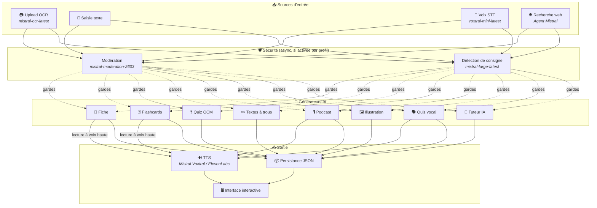
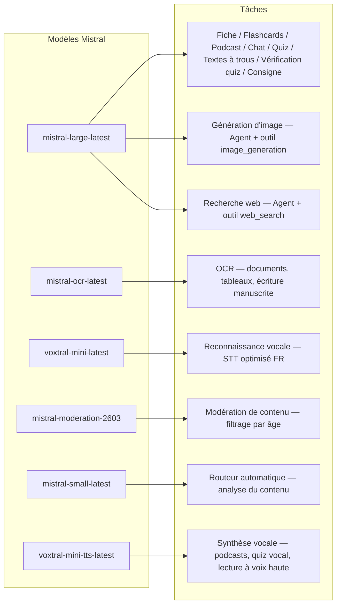
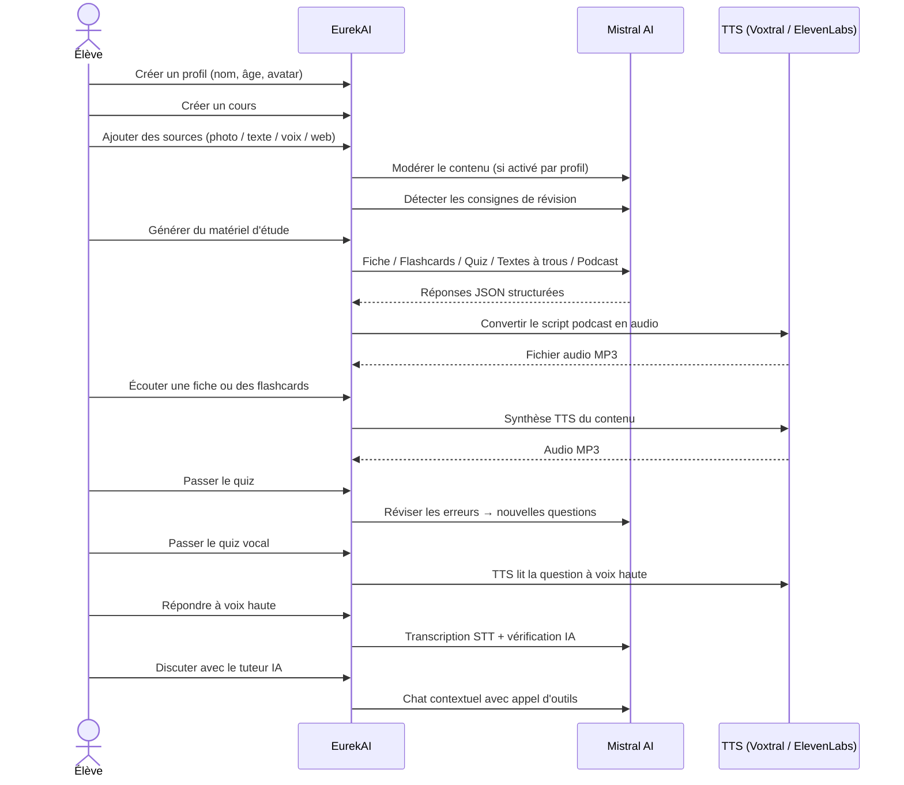

<p align="center">
  
</p>

<h1 align="center">EurekAI</h1>

<p align="center">
  <strong>Trasforma qualsiasi contenuto in un'esperienza di apprendimento interattiva — alimentata da <a href="https://mistral.ai">Mistral AI</a>.</strong>
</p>

<p align="center">
  <a href="README-en.md">🇬🇧 Inglese</a> · <a href="README-es.md">🇪🇸 Spagnolo</a> · <a href="README-pt.md">🇧🇷 Portoghese</a> · <a href="README-de.md">🇩🇪 Tedesco</a> · <a href="README-it.md">🇮🇹 Italiano</a> · <a href="README-nl.md">🇳🇱 Olandese</a> · <a href="README-ar.md">🇸🇦 Arabo</a><br>
  <a href="README-hi.md">🇮🇳 Hindi</a> · <a href="README-zh.md">🇨🇳 Cinese</a> · <a href="README-ja.md">🇯🇵 Giapponese</a> · <a href="README-ko.md">🇰🇷 Coreano</a> · <a href="README-pl.md">🇵🇱 Polacco</a> · <a href="README-ro.md">🇷🇴 Romeno</a> · <a href="README-sv.md">🇸🇪 Svedese</a>
</p>

<p align="center">
  <a href="https://www.youtube.com/watch?v=_b1TQz2leoI"></a>
</p>

<h4 align="center">📊 Qualità del codice</h4>

<p align="center">
  <a href="https://sonarcloud.io/summary/new_code?id=jls42_EurekAI"></a>
  <a href="https://sonarcloud.io/summary/new_code?id=jls42_EurekAI"></a>
  <a href="https://sonarcloud.io/summary/new_code?id=jls42_EurekAI"></a>
  <a href="https://sonarcloud.io/summary/new_code?id=jls42_EurekAI"></a>
</p>
<p align="center">
  <a href="https://sonarcloud.io/summary/new_code?id=jls42_EurekAI"></a>
  <a href="https://sonarcloud.io/summary/new_code?id=jls42_EurekAI"></a>
  <a href="https://sonarcloud.io/summary/new_code?id=jls42_EurekAI"></a>
  <a href="https://sonarcloud.io/summary/new_code?id=jls42_EurekAI"></a>
</p>

---

## La storia — Perché EurekAI?

**EurekAI** è nato durante il [Mistral AI Worldwide Hackathon](https://luma.com/mistralhack-online) ([sito ufficiale](https://worldwide-hackathon.mistral.ai/)) (marzo 2026). Avevo bisogno di un tema — e l'idea è venuta da qualcosa di molto concreto: preparo regolarmente le verifiche con mia figlia, e ho pensato che fosse possibile rendere tutto più giocoso e interattivo grazie all'IA.

L'obiettivo: prendere **qualsiasi input** — una foto del manuale, un testo copiato e incollato, una registrazione vocale, una ricerca web — e trasformarlo in **schede di revisione, flashcard, quiz, podcast, testi da completare, illustrazioni e altro ancora**. Il tutto alimentato dai modelli francesi di Mistral AI, il che rende la soluzione naturalmente adatta agli studenti francofoni.

Il progetto è stato iniziato durante l'hackathon, poi ripreso e arricchito successivamente. L'intero codice è generato dall'IA — principalmente tramite [Claude Code](https://docs.anthropic.com/en/docs/claude-code), con alcuni contributi tramite [Codex](https://openai.com/index/introducing-codex/).

---

## Funzionalità

| | Funzionalità | Descrizione |
|---|---|---|
| 📷 | **Upload OCR** | Scatta una foto del tuo manuale o dei tuoi appunti — Mistral OCR ne estrae il contenuto |
| 📝 | **Inserimento testo** | Digita o incolla qualsiasi testo direttamente |
| 🎤 | **Input vocale** | Registrati — Voxtral STT trascrive la tua voce |
| 🌐 | **Ricerca web** | Poni una domanda — un Agent Mistral cerca le risposte sul web |
| 📄 | **Schede di revisione** | Note strutturate con punti chiave, vocabolario, citazioni, aneddoti |
| 🃏 | **Flashcard** | 5-50 carte Q/R con riferimenti alle fonti per la memorizzazione attiva |
| ❓ | **Quiz a scelta multipla** | 5-50 domande a scelta multipla con revisione adattiva degli errori |
| ✏️ | **Testi da completare** | Esercizi da completare con indizi e validazione tollerante |
| 🎙️ | **Podcast** | Mini-podcast a 2 voci convertito in audio tramite Mistral Voxtral TTS |
| 🖼️ | **Illustrazioni** | Immagini educative generate da un Agent Mistral |
| 🗣️ | **Quiz vocale** | Domande lette ad alta voce, risposta orale, l'IA verifica la risposta |
| 💬 | **Tutor IA** | Chat contestuale con i tuoi documenti di corso, con chiamata agli strumenti |
| 🧠 | **Router automatico** | Un router basato su `mistral-small-latest` analizza il contenuto e propone una combinazione di generatori tra i 7 tipi disponibili |
| 🔒 | **Controllo parentale** | Moderazione per età, PIN parentale, restrizioni della chat |
| 🌍 | **Multilingue** | Interfaccia disponibile in 9 lingue; generazione IA controllabile in 15 lingue tramite i prompt |
| 🔊 | **Lettura ad alta voce** | Ascolta le schede e le flashcard tramite Mistral Voxtral TTS o ElevenLabs |

---

## Panoramica dell'architettura



---

## Mappa di utilizzo dei modelli



---

## Percorso utente



---

## Approfondimento — Funzionalità

### Input multimodale

EurekAI accetta 4 tipi di sorgenti, moderate in base al profilo (attivato di default per bambino e adolescente):

- **Upload OCR** — File JPG, PNG o PDF elaborati da `mistral-ocr-latest`. Gestisce testo stampato, tabelle e scrittura a mano.
- **Testo libero** — Digita o incolla qualsiasi contenuto. Moderato prima della memorizzazione se la moderazione è attiva.
- **Input vocale** — Registra audio nel browser. Trascritto da `voxtral-mini-latest`. Il parametro `language="fr"` ottimizza il riconoscimento.
- **Ricerca web** — Inserisci una query. Un Agent Mistral temporaneo con lo strumento `web_search` recupera e riassume i risultati.

### Generazione di contenuto IA

Sette tipi di materiale didattico generato:

| Generatore | Modello | Risultato |
|---|---|---|
| **Scheda di revisione** | `mistral-large-latest` | Titolo, riassunto, 10-25 punti chiave, vocabolario, citazioni, aneddoto |
| **Flashcards** | `mistral-large-latest` | 5-50 carte Q/R con riferimenti alle fonti per la memorizzazione attiva |
| **Quiz a scelta multipla** | `mistral-large-latest` | 5-50 domande, 4 opzioni ciascuna, spiegazioni, revisione adattiva |
| **Testi da completare** | `mistral-large-latest` | Frasi da completare con indizi, validazione tollerante (Levenshtein) |
| **Podcast** | `mistral-large-latest` + Voxtral TTS | Script a 2 voci → audio MP3 |
| **Illustrazione** | Agent `mistral-large-latest` | Immagine educativa tramite lo strumento `image_generation` |
| **Quiz vocale** | `mistral-large-latest` + Voxtral TTS + STT | Domande TTS → risposta STT → verifica IA |

### Tutor IA tramite chat

Un tutor conversazionale con accesso completo ai documenti di corso:

- Utilizza `mistral-large-latest`
- **Chiamata agli strumenti**: può generare schede, flashcard, quiz o testi da completare durante la conversazione
- Cronologia di 50 messaggi per corso
- Moderazione dei contenuti se attivata per il profilo

### Router automatico

Il router utilizza `mistral-small-latest` per analizzare il contenuto delle sorgenti e proporre i generatori più pertinenti tra i 7 disponibili. L'interfaccia mostra il progresso in tempo reale: prima una fase di analisi, poi le generazioni individuali con annullamento possibile.

### Apprendimento adattativo

- **Statistiche del quiz**: monitoraggio dei tentativi e della precisione per domanda
- **Revisione del quiz**: genera 5-10 nuove domande mirate ai concetti deboli
- **Rilevamento delle istruzioni**: individua le istruzioni di revisione ("So la mia lezione se so...") e le prioritizza nei generatori testuali compatibili (scheda, flashcard, quiz, testi da completare)

### Sicurezza e controllo parentale

- **4 fasce d'età**: bambino (≤10 anni), adolescente (11-15), studente (16-25), adulto (26+)
- **Moderazione dei contenuti**: `mistral-moderation-2603` con 5 categorie bloccate per bambino/adolescente (sexual, hate, violence, selfharm, jailbreaking), nessuna restrizione per studente/adulto
- **PIN parentale**: hash SHA-256, richiesto per i profili sotto i 15 anni. Per un deployment in produzione, prevedere un hash lento con salt (Argon2id, bcrypt).
- **Restrizioni della chat**: chat IA disabilitata di default per i minori di 16 anni, attivabile dai genitori

### Sistema multi-profili

- Profili multipli con nome, età, avatar, preferenze di lingua
- Progetti legati ai profili tramite `profileId`
- Eliminazione a cascata: eliminare un profilo elimina tutti i suoi progetti

### TTS multi-fornitore

- **Mistral Voxtral TTS** (predefinito): `voxtral-mini-tts-latest`, nessuna chiave aggiuntiva necessaria
- **ElevenLabs** (alternativo): `eleven_v3`, voci naturali, richiede `ELEVENLABS_API_KEY`
- Fornitore configurabile nelle impostazioni dell'app

### Internazionalizzazione

- Interfaccia disponibile in 9 lingue: fr, en, es, pt, it, nl, de, hi, ar
- I prompt IA supportano 15 lingue (fr, en, es, de, it, pt, nl, ja, zh, ko, ar, hi, pl, ro, sv)
- Lingua configurabile per profilo

---

## Stack tecnico

| Strato | Tecnologia | Ruolo |
|---|---|---|
| **Runtime** | Node.js + TypeScript 5.x | Server e sicurezza dei tipi |
| **Backend** | Express 4.x | API REST |
| **Server di sviluppo** | Vite 7.x + tsx | HMR, partials Handlebars, proxy |
| **Frontend** | HTML + TailwindCSS 4.x + Alpine.js 3.x | Interfaccia reattiva, TypeScript compilato da Vite |
| **Templating** | vite-plugin-handlebars | Composizione HTML tramite partials |
| **IA** | Mistral AI SDK 2.x | Chat, OCR, STT, TTS, Agents, Moderazione |
| **TTS (predefinito)** | Mistral Voxtral TTS | `voxtral-mini-tts-latest`, sintesi vocale integrata |
| **TTS (alternativo)** | ElevenLabs SDK 2.x | `eleven_v3`, voci naturali |
| **Icone** | Lucide | Libreria di icone SVG |
| **Markdown** | Marked | Rendering markdown nella chat |
| **Upload file** | Multer 1.4 LTS | Gestione form multipart |
| **Audio** | ffmpeg-static | Concatenazione di segmenti audio |
| **Test** | Vitest | Test unitari — copertura misurata da SonarCloud |
| **Persistenza** | File JSON | Storage senza dipendenze |

---

## Riferimento dei modelli

| Modello | Utilizzo | Perché |
|---|---|---|
| `mistral-large-latest` | Scheda, Flashcards, Podcast, Quiz, Testi da completare, Chat, Verifica quiz vocale, Agent Immagine, Agent Ricerca Web, Rilevamento istruzioni | Migliore multilingua + follow delle istruzioni |
| `mistral-ocr-latest` | OCR dei documenti | Testo stampato, tabelle, scrittura a mano |
| `voxtral-mini-latest` | Riconoscimento vocale (STT) | STT multilingue, ottimizzato con `language="fr"` |
| `voxtral-mini-tts-latest` | Sintesi vocale (TTS) | Podcast, quiz vocale, lettura ad alta voce |
| `mistral-moderation-2603` | Moderazione dei contenuti | 5 categorie bloccate per bambino/adolescente (+ jailbreaking) |
| `mistral-small-latest` | Router automatico | Analisi rapida del contenuto per decisioni di routing |
| `eleven_v3` (ElevenLabs) | Sintesi vocale (TTS alternativo) | Voci naturali, alternativa configurabile |

---

## Avvio rapido

```bash
# Cloner le dépôt
git clone https://github.com/jls42/EurekAI.git
cd EurekAI

# Installer les dépendances
npm install

# Configurer les clés API
cp .env.example .env
# Éditez .env avec vos clés :
#   MISTRAL_API_KEY=votre_clé_ici           (requis)
#   ELEVENLABS_API_KEY=votre_clé_ici        (optionnel, TTS alternatif)
#   SONAR_TOKEN=...                          (optionnel, CI SonarCloud uniquement)

# Lancer le développement
npm run dev
# → Backend :  http://localhost:3000 (API)
# → Frontend : http://localhost:5173 (serveur Vite avec HMR)
```

> **Nota** : Mistral Voxtral TTS è il provider predefinito — nessuna chiave aggiuntiva necessaria oltre a `MISTRAL_API_KEY`. ElevenLabs è un provider TTS alternativo configurabile nelle impostazioni.

---

## Struttura del progetto

```
server.ts                 — Point d'entrée Express, monte les routes + config
config.ts                 — Config runtime (modèles, voix, TTS provider), persistée dans output/config.json
store.ts                  — ProjectStore : CRUD projets/sources/générations, persistance JSON
profiles.ts               — ProfileStore : gestion des profils, hachage PIN
types.ts                  — Types TypeScript : Source, Generation (7 types), QuizStats, Profile
prompts.ts                — Tous les prompts IA centralisés (system + user templates, 15 langues)

generators/
  ocr.ts                  — Upload + OCR via Mistral (JPG, PNG, PDF)
  summary.ts              — Génération de fiche de révision (JSON structuré)
  flashcards.ts           — Flashcards Q/R (5-50, configurable)
  quiz.ts                 — Quiz QCM (5-50 questions, configurable) + révision adaptative
  fill-blank.ts           — Exercices à trous avec validation tolérante
  podcast.ts              — Script podcast 2 voix
  quiz-vocal.ts           — Quiz vocal : questions TTS + réponses STT + vérification IA
  image.ts                — Génération d'image via Agent Mistral (outil image_generation)
  chat.ts                 — Tuteur IA par chat avec appel d'outils
  router.ts               — Routeur automatique (contenu → générateurs recommandés)
  consigne.ts             — Détection de consignes de révision
  tts-provider.ts         — Dispatch TTS multi-provider (Mistral Voxtral / ElevenLabs)
  tts.ts                  — Génération audio podcast (concaténation de segments)
  stt.ts                  — Voxtral STT (audio → texte)
  websearch.ts            — Agent Mistral avec outil web_search
  moderation.ts           — Modération de contenu (filtrage par âge)

routes/
  projects.ts             — CRUD projets
  profiles.ts             — CRUD profils avec gestion du PIN
  sources.ts              — Upload OCR, texte libre, voix STT, recherche web, modération
  generate.ts             — Endpoints de génération (7 types + auto + route)
  generations.ts          — Tentatives de quiz/fill-blank, réponses vocales, lecture à voix haute
  chat.ts                 — Chat IA avec appel d'outils

helpers/
  index.ts                — safeParseJson, unwrapJsonArray, extractAllText, timer
  audio.ts                — collectStream (ReadableStream → Buffer)
  fill-blank-validate.ts  — Validation tolérante des réponses (normalisation, Levenshtein)

src/                      — Frontend (Vite + Handlebars)
  index.html              — Point d'entrée HTML principal
  main.ts                 — Entrée frontend (init Alpine.js + icônes Lucide)
  app/                    — Modules applicatifs Alpine.js
    state.ts              — Gestion d'état réactif
    navigation.ts         — Routage des vues + gardes par âge
    profiles.ts           — Logique du sélecteur de profils
    projects.ts           — CRUD des cours
    sources.ts            — Gestionnaires d'upload de sources
    generate.ts           — Déclencheurs de génération (individuel, tout, auto 2 phases)
    generations.ts        — Affichage + actions sur les générations
    chat.ts               — Interface de chat
    config.ts             — Interface de configuration (modèles, voix, TTS provider)
    render.ts             — Helpers de rendu HTML
    i18n.ts               — Changement de langue
    ...
  components/
    quiz.ts               — Composant quiz interactif
    quiz-vocal.ts         — Composant quiz vocal
    fill-blank.ts         — Composant textes à trous
    flashcards.ts         — Composant flashcards avec retournement
    step-by-step.ts       — Mixin navigation pas-à-pas (quiz, fill-blank, flashcards)
  i18n/
    fr.ts, en.ts, es.ts, — Dictionnaires par langue (9 langues)
    pt.ts, it.ts, nl.ts,
    de.ts, hi.ts, ar.ts
    languages.ts          — Registre des langues UI disponibles
    index.ts              — Chargeur i18n
  partials/               — Partials HTML Handlebars (header, sidebar, dialogues, vues)
  styles/
    main.css              — Entrée TailwindCSS
    theme.css             — Variables de thème personnalisées

public/assets/            — Ressources statiques (logo, avatars)
output/                   — Données d'exécution (projets, config, fichiers audio)
```

---

## Riferimento API

### Configurazione
| Metodo | Endpoint | Descrizione |
|---|---|---|
| `GET` | `/api/config` | Configurazione corrente |
| `PUT` | `/api/config` | Modificare la config (modelli, voci, provider TTS) |
| `GET` | `/api/config/status` | Stato delle API (Mistral, ElevenLabs, TTS) |
| `POST` | `/api/config/reset` | Reimpostare la config di default |
| `GET` | `/api/config/voices` | Elencare le voci Mistral TTS (opzionale `?lang=fr`) |

### Profili
| Metodo | Endpoint | Descrizione |
|---|---|---|
| `GET` | `/api/profiles` | Elencare tutti i profili |
| `POST` | `/api/profiles` | Creare un profilo |
| `PUT` | `/api/profiles/:id` | Modificare un profilo (PIN richiesto per < 15 anni) |
| `DELETE` | `/api/profiles/:id` | Eliminare un profilo + eliminazione a cascata dei progetti `{pin?}` → `{ok, deletedProjects}` |

### Progetti
| Metodo | Endpoint | Descrizione |
|---|---|---|
| `GET` | `/api/projects` | Elencare i progetti (`?profileId=` opzionale) |
| `POST` | `/api/projects` | Creare un progetto `{name, profileId}` |
| `GET` | `/api/projects/:pid` | Dettagli del progetto |
| `PUT` | `/api/projects/:pid` | Rinominare `{name}` |
| `DELETE` | `/api/projects/:pid` | Eliminare il progetto |

### Sorgenti
| Metodo | Endpoint | Descrizione |
|---|---|---|
| `POST` | `/api/projects/:pid/sources/upload` | Upload OCR (file multipart) |
| `POST` | `/api/projects/:pid/sources/text` | Testo libero `{text}` |
| `POST` | `/api/projects/:pid/sources/voice` | Voce STT (audio multipart) |
| `POST` | `/api/projects/:pid/sources/websearch` | Ricerca web `{query}` |
| `DELETE` | `/api/projects/:pid/sources/:sid` | Eliminare una sorgente |
| `POST` | `/api/projects/:pid/moderate` | Moderare `{text}` |
| `POST` | `/api/projects/:pid/detect-consigne` | Rilevare le istruzioni di revisione |

### Generazione
| Metodo | Endpoint | Descrizione |
|---|---|---|
| `POST` | `/api/projects/:pid/generate/summary` | Scheda di revisione |
| `POST` | `/api/projects/:pid/generate/flashcards` | Flashcards |
| `POST` | `/api/projects/:pid/generate/quiz` | Quiz a scelta multipla |
| `POST` | `/api/projects/:pid/generate/fill-blank` | Testi da completare |
| `POST` | `/api/projects/:pid/generate/podcast` | Podcast |
| `POST` | `/api/projects/:pid/generate/image` | Illustrazione |
| `POST` | `/api/projects/:pid/generate/quiz-vocal` | Quiz vocale |
| `POST` | `/api/projects/:pid/generate/quiz-review` | Revisione adattativa `{generationId, weakQuestions}` |
| `POST` | `/api/projects/:pid/generate/route` | Analisi di routing (piano dei generatori da lanciare) |
| `POST` | `/api/projects/:pid/generate/auto` | Generazione auto backend (routing + 5 tipi: summary, flashcards, quiz, fill-blank, podcast) |

Tutte le route di generazione accettano `{sourceIds?, lang?, ageGroup?, count?, useConsigne?}`. `quiz-review` richiede inoltre `{generationId, weakQuestions}`.

### CRUD Generazioni
| Metodo | Endpoint | Descrizione |
|---|---|---|
| `POST` | `/api/projects/:pid/generations/:gid/quiz-attempt` | Inviare le risposte del quiz `{answers}` |
| `POST` | `/api/projects/:pid/generations/:gid/fill-blank-attempt` | Inviare le risposte dei testi da completare `{answers}` |
| `POST` | `/api/projects/:pid/generations/:gid/vocal-answer` | Verificare una risposta orale (audio + questionIndex) |
| `POST` | `/api/projects/:pid/generations/:gid/read-aloud` | Lettura TTS ad alta voce (schede/flashcards) |
| `PUT` | `/api/projects/:pid/generations/:gid` | Rinominare `{title}` |
| `DELETE` | `/api/projects/:pid/generations/:gid` | Eliminare la generazione |

### Chat
| Metodo | Endpoint | Descrizione |
|---|---|---|
| `GET` | `/api/projects/:pid/chat` | Recuperare la cronologia della chat |
| `POST` | `/api/projects/:pid/chat` | Inviare un messaggio `{message, lang, ageGroup}` |
| `DELETE` | `/api/projects/:pid/chat` | Cancellare la cronologia della chat |

---

## Decisioni architetturali

| Decisione | Giustificazione |
|---|---|
| **Alpine.js invece di React/Vue** | Impronta minima, reattività leggera con TypeScript compilato da Vite. Perfetto per un hackathon dove la velocità conta. |
| **Persistenza su file JSON** | Zero dipendenze, avvio immediato. Nessun database da configurare — si avvia e si è pronti. | **Vite + Handlebars** | Il meglio dei due mondi: HMR rapido per lo sviluppo, partials HTML per l'organizzazione del codice, Tailwind JIT. |
| **Prompt centralizzati** | Tutti i prompt IA in `prompts.ts` — facile da iterare, testare e adattare per lingua/gruppo d'età. |
| **Sistema multi-generazioni** | Ogni generazione è un oggetto indipendente con il proprio ID — permette più schede, quiz, ecc. per corso. |
| **Prompt adattati per età** | 4 gruppi d'età con vocabolario, complessità e tono diversi — lo stesso contenuto insegna in modo diverso a seconda dell'apprendente. |
| **Funzionalità basate su agenti** | La generazione di immagini e la ricerca web utilizzano agenti Mistral temporanei — ciclo di vita dedicato con pulizia automatica. |
| **TTS multi-provider** | Mistral Voxtral TTS di default (nessuna chiave aggiuntiva), ElevenLabs come alternativa — configurabile senza riavvio. |

---

## Crediti e ringraziamenti

- **[Mistral AI](https://mistral.ai)** — Modelli IA (Large, OCR, Voxtral STT, Voxtral TTS, Moderation, Small) + Worldwide Hackathon
- **[ElevenLabs](https://elevenlabs.io)** — Motore di sintesi vocale alternativo (`eleven_v3`)
- **[Alpine.js](https://alpinejs.dev)** — Framework reattivo leggero
- **[TailwindCSS](https://tailwindcss.com)** — Framework CSS basato su utility
- **[Vite](https://vitejs.dev)** — Strumento di build frontend
- **[Lucide](https://lucide.dev)** — Libreria di icone
- **[Marked](https://marked.js.org)** — Parser Markdown

Iniziato durante il Mistral AI Worldwide Hackathon (marzo 2026), sviluppato interamente da IA con Claude Code e Codex.

---

## Autore

**Julien LS** — [contact@jls42.org](mailto:contact@jls42.org)

## Licenza

[AGPL-3.0](LICENSE) — Copyright (C) 2026 Julien LS

**Questo documento è stato tradotto dalla versione fr alla lingua it utilizzando il modello gpt-5-mini. Per ulteriori informazioni sul processo di traduzione, consultare https://gitlab.com/jls42/ai-powered-markdown-translator**

