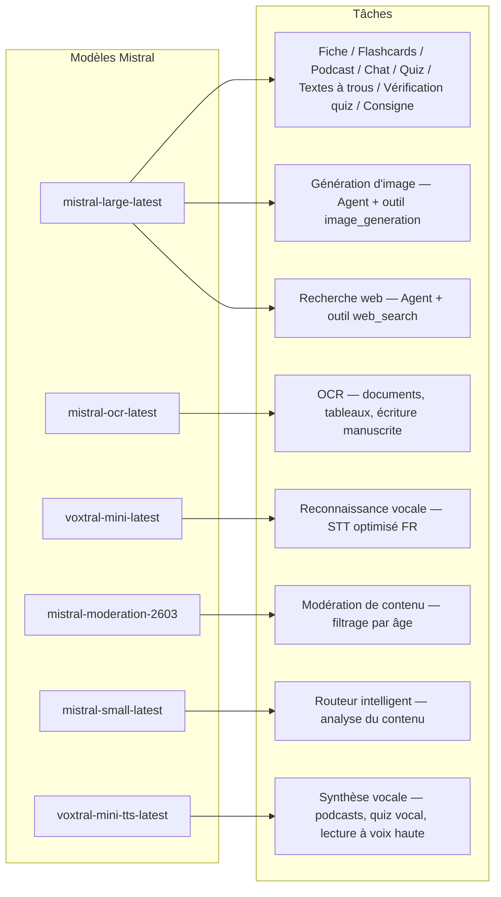
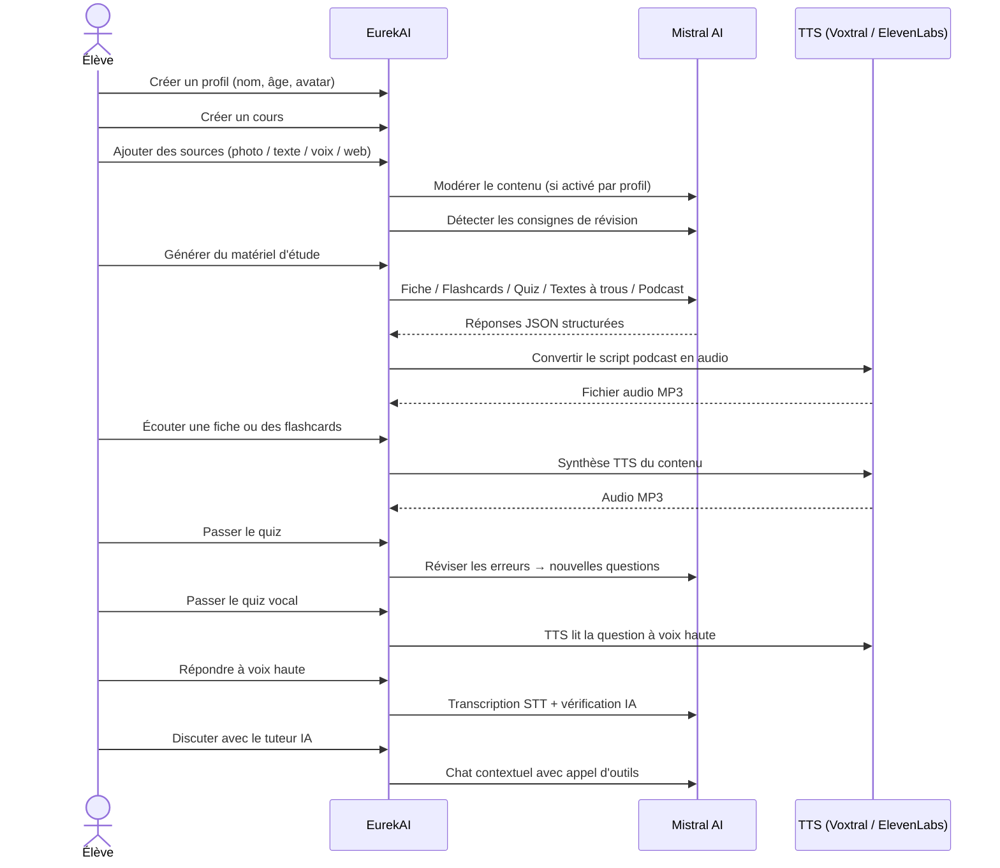

<p align="center">
  
</p>

<h1 align="center">EurekAI</h1>

<p align="center">
  <strong>Trasforma qualsiasi contenuto in un'esperienza di apprendimento interattiva — alimentata dall'IA.</strong>
</p>

<p align="center">
  <a href="https://mistral.ai"></a>
  <a href="https://www.typescriptlang.org"></a>
  <a href="https://mistral.ai"></a>
  <a href="https://elevenlabs.io"></a>
</p>

<p align="center">
  <a href="https://www.youtube.com/watch?v=_b1TQz2leoI">▶️ Guarda la demo su YouTube</a> · <a href="README-en.md">🇬🇧 Leggi in inglese</a>
</p>

<p align="center">
  <a href="https://sonarcloud.io/summary/new_code?id=jls42_EurekAI"></a>
  <a href="https://sonarcloud.io/summary/new_code?id=jls42_EurekAI"></a>
  <a href="https://sonarcloud.io/summary/new_code?id=jls42_EurekAI"></a>
  <a href="https://sonarcloud.io/summary/new_code?id=jls42_EurekAI"></a>
</p>
<p align="center">
  <a href="https://sonarcloud.io/summary/new_code?id=jls42_EurekAI"></a>
  <a href="https://sonarcloud.io/summary/new_code?id=jls42_EurekAI"></a>
  <a href="https://sonarcloud.io/summary/new_code?id=jls42_EurekAI"></a>
  <a href="https://sonarcloud.io/summary/new_code?id=jls42_EurekAI"></a>
</p>

---

## La storia — Perché EurekAI ?

**EurekAI** è nato durante il [Mistral AI Worldwide Hackathon](https://worldwide-hackathon.mistral.ai/) (marzo 2026). Avevo bisogno di un tema — e l'idea è nata da qualcosa di molto concreto: preparo regolarmente le verifiche con mia figlia, e ho pensato che fosse possibile rendere tutto più ludico e interattivo grazie all'IA.

L'obiettivo: prendere **qualsiasi input** — una foto del manuale, un testo copiato e incollato, una registrazione vocale, una ricerca web — e trasformarlo in **schede di ripasso, flashcard, quiz, podcast, testi a riempire, illustrazioni e molto altro**. Il tutto alimentato dai modelli francesi di Mistral AI, il che lo rende una soluzione naturalmente adatta agli studenti francofoni.

Ogni riga di codice è stata scritta durante l'hackathon. Tutte le API e le librerie open-source sono usate conformemente alle regole dell'hackathon.

---

## Funzionalità

| | Funzionalità | Descrizione |
|---|---|---|
| 📷 | **Upload OCR** | Fotografa il tuo manuale o i tuoi appunti — Mistral OCR ne estrae il contenuto |
| 📝 | **Inserimento testo** | Digita o incolla qualsiasi testo direttamente |
| 🎤 | **Input vocale** | Registrati — Voxtral STT trascrive la tua voce |
| 🌐 | **Ricerca web** | Fai una domanda — un Agent Mistral cerca le risposte sul web |
| 📄 | **Schede di ripasso** | Appunti strutturati con punti chiave, vocabolario, citazioni, aneddoti |
| 🃏 | **Flashcard** | 5-50 carte Q/R con riferimenti alle fonti per la memorizzazione attiva |
| ❓ | **Quiz a scelta multipla** | 5-50 domande a scelta multipla con revisione adattiva degli errori |
| ✏️ | **Testi a riempire** | Esercizi da completare con indizi e validazione tollerante |
| 🎙️ | **Podcast** | Mini-podcast a 2 voci convertito in audio tramite Mistral Voxtral TTS |
| 🖼️ | **Illustrazioni** | Immagini educative generate da un Agent Mistral |
| 🗣️ | **Quiz vocale** | Domande lette ad alta voce, risposta orale, l'IA verifica la risposta |
| 💬 | **Tutor IA** | Chat contestuale con i tuoi documenti di corso, con chiamata di strumenti |
| 🧠 | **Router intelligente** | L'IA analizza il tuo contenuto e raccomanda i generatori più pertinenti tra i 7 disponibili |
| 🔒 | **Controllo parentale** | Moderazione per età, PIN parentale, restrizioni della chat |
| 🌍 | **Multilingue** | Interfaccia e contenuti IA completi in francese e inglese |
| 🔊 | **Lettura ad alta voce** | Ascolta le schede e le flashcard tramite Mistral Voxtral TTS o ElevenLabs |

---

## Panoramica dell'architettura


---

## Mappa d'uso dei modelli



---

## Percorso utente



---

## Approfondimento — Funzionalità

### Input multimodale

EurekAI accetta 4 tipi di sorgenti, moderate a seconda del profilo (attivato di default per bambino e adolescente):

- **Upload OCR** — File JPG, PNG o PDF processati da `mistral-ocr-latest`. Gestisce il testo stampato, le tabelle e la scrittura a mano.
- **Testo libero** — Digita o incolla qualsiasi contenuto. Moderato prima della memorizzazione se la moderazione è attiva.
- **Input vocale** — Registra audio nel browser. Trascritto da `voxtral-mini-latest`. Il parametro `language="fr"` ottimizza il riconoscimento.
- **Ricerca web** — Inserisci una query. Un Agent Mistral temporaneo con lo strumento `web_search` recupera e riassume i risultati.

### Generazione di contenuti IA

Sette tipi di materiale didattico generato:

| Generatore | Modello | Output |
|---|---|---|
| **Scheda di ripasso** | `mistral-large-latest` | Titolo, riassunto, 10-25 punti chiave, vocabolario, citazioni, aneddoto |
| **Flashcards** | `mistral-large-latest` | 5-50 carte Q/R con riferimenti alle fonti per la memorizzazione attiva |
| **Quiz a scelta multipla** | `mistral-large-latest` | 5-50 domande, 4 opzioni ciascuna, spiegazioni, revisione adattiva |
| **Testi a riempire** | `mistral-large-latest` | Frasi da completare con indizi, validazione tollerante (Levenshtein) |
| **Podcast** | `mistral-large-latest` + Voxtral TTS | Script a 2 voci → audio MP3 |
| **Illustrazione** | Agent `mistral-large-latest` | Immagine educativa tramite lo strumento `image_generation` |
| **Quiz vocale** | `mistral-large-latest` + Voxtral TTS + STT | Domande TTS → risposta STT → verifica IA |

### Tutor IA via chat

Un tutor conversazionale con accesso completo ai documenti di corso:

- Utilizza `mistral-large-latest`
- **Chiamata di strumenti**: può generare schede, flashcard, quiz o testi a riempire durante la conversazione
- Cronologia di 50 messaggi per corso
- Moderazione del contenuto se attivata per il profilo

### Router automatico intelligente

Il router utilizza `mistral-small-latest` per analizzare il contenuto delle sorgenti e raccomandare quali generatori sono più pertinenti tra i 7 disponibili — così gli studenti non devono scegliere manualmente. L'interfaccia mostra il progresso in tempo reale: prima una fase di analisi, poi le generazioni individuali con possibilità di annullamento.

### Apprendimento adattivo

- **Statistiche dei quiz**: monitoraggio dei tentativi e della precisione per domanda
- **Revisione dei quiz**: genera 5-10 nuove domande mirate ai concetti deboli
- **Rilevamento di istruzioni**: individua le istruzioni di ripasso ("So la mia lezione se so...") e le prioritizza in tutti i generatori

### Sicurezza e controllo parentale

- **4 gruppi d'età**: bambino (≤10 anni), adolescente (11-15), studente (16-25), adulto (26+)
- **Moderazione del contenuto**: `mistral-moderation-2603` con 5 categorie bloccate per bambino/adolescente (sexual, hate, violence, selfharm, jailbreaking), nessuna restrizione per studente/adulto
- **PIN parentale**: hash SHA-256, richiesto per i profili sotto i 15 anni
- **Restrizioni della chat**: chat IA disattivata di default per i minori di 16 anni, attivabile dai genitori

### Sistema multi-profili

- Profili multipli con nome, età, avatar, preferenze di lingua
- Progetti collegati ai profili tramite `profileId`
- Cancellazione a cascata: eliminare un profilo elimina tutti i suoi progetti

### TTS multi-provider

- **Mistral Voxtral TTS** (predefinito) : `voxtral-mini-tts-latest`, non richiede chiave aggiuntiva
- **ElevenLabs** (alternativo) : `eleven_v3`, voci naturali, richiede `ELEVENLABS_API_KEY`
- Provider configurabile nelle impostazioni dell'app

### Internazionalizzazione

- Interfaccia completa disponibile in francese e inglese
- I prompt IA supportano oggi 2 lingue (FR, EN) con architettura pronta per 15 (es, de, it, pt, nl, ja, zh, ko, ar, hi, pl, ro, sv)
- Lingua configurabile per profilo

---

## Stack tecnologico

| Livello | Tecnologia | Ruolo |
|---|---|---|
| **Runtime** | Node.js + TypeScript 5.7 | Server e sicurezza dei tipi |
| **Backend** | Express 4.21 | API REST |
| **Server di dev** | Vite 7.3 + tsx | HMR, partials Handlebars, proxy |
| **Frontend** | HTML + TailwindCSS 4.2 + Alpine.js 3.15 | Interfaccia reattiva, TypeScript compilato da Vite |
| **Templating** | vite-plugin-handlebars | Composizione HTML tramite partials |
| **IA** | Mistral AI SDK 2.1 | Chat, OCR, STT, TTS, Agents, Moderazione |
| **TTS (predefinito)** | Mistral Voxtral TTS | `voxtral-mini-tts-latest`, sintesi vocale integrata |
| **TTS (alternativo)** | ElevenLabs SDK 2.36 | `eleven_v3`, voci naturali |
| **Icone** | Lucide 0.575 | Libreria di icone SVG |
| **Markdown** | Marked 17 | Rendering markdown nella chat |
| **Upload file** | Multer 1.4 | Gestione dei form multipart |
| **Audio** | ffmpeg-static | Concatenazione di segmenti audio |
| **Test** | Vitest 4 | Test unitari — copertura misurata da SonarCloud |
| **Persistenza** | File JSON | Storage senza dipendenze |

---

## Riferimento ai modelli

| Modello | Utilizzo | Perché |
|---|---|---|
| `mistral-large-latest` | Scheda, Flashcards, Podcast, Quiz, Testi a riempire, Chat, Verifica quiz vocale, Agent Immagine, Agent Ricerca Web, Rilevamento istruzioni | Miglior multilingual + follow delle istruzioni |
| `mistral-ocr-latest` | OCR di documenti | Testo stampato, tabelle, scrittura a mano |
| `voxtral-mini-latest` | Riconoscimento vocale (STT) | STT multilingue, ottimizzato con `language="fr"` |
| `voxtral-mini-tts-latest` | Sintesi vocale (TTS) | Podcast, quiz vocale, lettura ad alta voce |
| `mistral-moderation-2603` | Moderazione del contenuto | 5 categorie bloccate per bambino/adolescente (+ jailbreaking) |
| `mistral-small-latest` | Router intelligente | Analisi rapida del contenuto per decisioni di routing |
| `eleven_v3` (ElevenLabs) | Sintesi vocale (TTS alternativo) | Voci naturali, alternativa configurabile |

---

## Avvio rapido

```bash
# Cloner le dépôt
git clone https://github.com/jls42/EurekAI.git
cd EurekAI

# Installer les dépendances
npm install

# Configurer les clés API
cp .env.example .env
# Éditez .env avec vos clés :
#   MISTRAL_API_KEY=votre_clé_ici           (requis)
#   ELEVENLABS_API_KEY=votre_clé_ici        (optionnel, TTS alternatif)

# Lancer le développement
npm run dev
# → Backend :  http://localhost:3000 (API)
# → Frontend : http://localhost:5173 (serveur Vite avec HMR)
```

> **Nota** : Mistral Voxtral TTS è il provider predefinito — non è richiesta alcuna chiave aggiuntiva oltre a `MISTRAL_API_KEY`. ElevenLabs è un provider TTS alternativo configurabile nelle impostazioni.

---

## Struttura del progetto

```
server.ts                 — Point d'entrée Express, monte les routes + config
config.ts                 — Config runtime (modèles, voix, TTS provider), persistée dans output/config.json
store.ts                  — ProjectStore : CRUD projets/sources/générations, persistance JSON
profiles.ts               — ProfileStore : gestion des profils, hachage PIN
types.ts                  — Types TypeScript : Source, Generation (7 types), QuizStats, Profile
prompts.ts                — Tous les prompts IA centralisés (system + user templates, FR/EN)

generators/
  ocr.ts                  — Upload + OCR via Mistral (JPG, PNG, PDF)
  summary.ts              — Génération de fiche de révision (JSON structuré)
  flashcards.ts           — Flashcards Q/R (5-50, configurable)
  quiz.ts                 — Quiz QCM (5-50 questions, configurable) + révision adaptative
  fill-blank.ts           — Exercices à trous avec validation tolérante
  podcast.ts              — Script podcast 2 voix
  quiz-vocal.ts           — Quiz vocal : questions TTS + réponses STT + vérification IA
  image.ts                — Génération d'image via Agent Mistral (outil image_generation)
  chat.ts                 — Tuteur IA par chat avec appel d'outils
  router.ts               — Routeur automatique intelligent (contenu → générateurs recommandés)
  consigne.ts             — Détection de consignes de révision
  tts-provider.ts         — Dispatch TTS multi-provider (Mistral Voxtral / ElevenLabs)
  tts.ts                  — Génération audio podcast (concaténation de segments)
  stt.ts                  — Voxtral STT (audio → texte)
  websearch.ts            — Agent Mistral avec outil web_search
  moderation.ts           — Modération de contenu (filtrage par âge)

routes/
  projects.ts             — CRUD projets
  profiles.ts             — CRUD profils avec gestion du PIN
  sources.ts              — Upload OCR, texte libre, voix STT, recherche web, modération
  generate.ts             — Endpoints de génération (7 types + auto + route)
  generations.ts          — Tentatives de quiz/fill-blank, réponses vocales, lecture à voix haute
  chat.ts                 — Chat IA avec appel d'outils

helpers/
  index.ts                — safeParseJson, unwrapJsonArray, extractAllText, timer
  audio.ts                — collectStream (ReadableStream → Buffer)
  fill-blank-validate.ts  — Validation tolérante des réponses (normalisation, Levenshtein)

src/                      — Frontend (Vite + Handlebars)
  index.html              — Point d'entrée HTML principal
  main.ts                 — Entrée frontend (init Alpine.js + icônes Lucide)
  app/                    — Modules applicatifs Alpine.js
    state.ts              — Gestion d'état réactif
    navigation.ts         — Routage des vues + gardes par âge
    profiles.ts           — Logique du sélecteur de profils
    projects.ts           — CRUD des cours
    sources.ts            — Gestionnaires d'upload de sources
    generate.ts           — Déclencheurs de génération (individuel, tout, auto 2 phases)
    generations.ts        — Affichage + actions sur les générations
    chat.ts               — Interface de chat
    config.ts             — Interface de configuration (modèles, voix, TTS provider)
    render.ts             — Helpers de rendu HTML
    i18n.ts               — Changement de langue
    ...
  components/
    quiz.ts               — Composant quiz interactif
    quiz-vocal.ts         — Composant quiz vocal
    fill-blank.ts         — Composant textes à trous
    flashcards.ts         — Composant flashcards avec retournement
    step-by-step.ts       — Mixin navigation pas-à-pas (quiz, fill-blank, flashcards)
  i18n/
    fr.ts                 — Traductions françaises
    en.ts                 — Traductions anglaises
    index.ts              — Chargeur i18n
  partials/               — Partials HTML Handlebars (header, sidebar, dialogues, vues)
  styles/
    main.css              — Entrée TailwindCSS
    theme.css             — Variables de thème personnalisées

public/assets/            — Ressources statiques (logo, avatars)
output/                   — Données d'exécution (projets, config, fichiers audio)
```

---

## Riferimento API

### Config
| Metodo | Endpoint | Descrizione |
|---|---|---|
| `GET` | `/api/config` | Config corrente |
| `PUT` | `/api/config` | Modifica la config (modelli, voci, provider TTS) |
| `GET` | `/api/config/status` | Stato delle API (Mistral, ElevenLabs, TTS) |
| `POST` | `/api/config/reset` | Resetta la config di default |
| `GET` | `/api/config/voices` | Elenca le voci Mistral TTS (opzionale `?lang=fr`) |

### Profili
| Metodo | Endpoint | Descrizione |
|---|---|---|
| `GET` | `/api/profiles` | Elenca tutti i profili |
| `POST` | `/api/profiles` | Crea un profilo |
| `PUT` | `/api/profiles/:id` | Modifica un profilo (PIN richiesto per < 15 anni) |
| `DELETE` | `/api/profiles/:id` | Elimina un profilo + progetti a cascata |

### Progetti
| Metodo | Endpoint | Descrizione |
|---|---|---|
| `GET` | `/api/projects` | Elenca i progetti |
| `POST` | `/api/projects` | Crea un progetto `{name, profileId}` |
| `GET` | `/api/projects/:pid` | Dettagli del progetto |
| `PUT` | `/api/projects/:pid` | Rinomina `{name}` |
| `DELETE` | `/api/projects/:pid` | Elimina il progetto |

### Sorgenti
| Metodo | Endpoint | Descrizione |
|---|---|---|
| `POST` | `/api/projects/:pid/sources/upload` | Upload OCR (file multipart) |
| `POST` | `/api/projects/:pid/sources/text` | Testo libero `{text}` |
| `POST` | `/api/projects/:pid/sources/voice` | Voce STT (audio multipart) |
| `POST` | `/api/projects/:pid/sources/websearch` | Ricerca web `{query}` |
| `DELETE` | `/api/projects/:pid/sources/:sid` | Elimina una sorgente |
| `POST` | `/api/projects/:pid/moderate` | Modera `{text}` |
| `POST` | `/api/projects/:pid/detect-consigne` | Rileva le istruzioni di ripasso |

### Generazione
| Metodo | Endpoint | Descrizione |
|---|---|---|
| `POST` | `/api/projects/:pid/generate/summary` | Scheda di ripasso |
| `POST` | `/api/projects/:pid/generate/flashcards` | Flashcards |
| `POST` | `/api/projects/:pid/generate/quiz` | Quiz a scelta multipla |
| `POST` | `/api/projects/:pid/generate/fill-blank` | Testi a riempire |
| `POST` | `/api/projects/:pid/generate/podcast` | Podcast |
| `POST` | `/api/projects/:pid/generate/image` | Illustrazione |
| `POST` | `/api/projects/:pid/generate/quiz-vocal` | Quiz vocale |
| `POST` | `/api/projects/:pid/generate/quiz-review` | Revisione adattiva `{generationId, weakQuestions}` |
| `POST` | `/api/projects/:pid/generate/route` | Analisi di routing (piano dei generatori da avviare) |
| `POST` | `/api/projects/:pid/generate/auto` | Generazione auto backend (routing + 5 tipi: summary, flashcards, quiz, fill-blank, podcast) |

Tutte le route di generazione accettano `{sourceIds?, lang?, ageGroup?, count?, useConsigne?}`.

### CRUD Generazioni
| Metodo | Endpoint | Descrizione |
|---|---|---|
| `POST` | `/api/projects/:pid/generations/:gid/quiz-attempt` | Invia le risposte del quiz `{answers}` |
| `POST` | `/api/projects/:pid/generations/:gid/fill-blank-attempt` | Invia le risposte dei testi a riempire `{answers}` |
| `POST` | `/api/projects/:pid/generations/:gid/vocal-answer` | Verifica una risposta orale (audio + questionIndex) |
| `POST` | `/api/projects/:pid/generations/:gid/read-aloud` | Lettura TTS ad alta voce (schede/flashcards) |
| `PUT` | `/api/projects/:pid/generations/:gid` | Rinomina `{title}` |
| `DELETE` | `/api/projects/:pid/generations/:gid` | Elimina la generazione |

### Chat
| Metodo | Endpoint | Descrizione |
|---|---|---|
| `GET` | `/api/projects/:pid/chat` | Recupera la cronologia della chat |
| `POST` | `/api/projects/:pid/chat` | Invia un messaggio `{message, lang, ageGroup}` |
| `DELETE` | `/api/projects/:pid/chat` | Cancella la cronologia della chat |

---

## Decisioni architetturali

| Decisione | Giustificazione |
|---|---|
| **Alpine.js invece di React/Vue** | Impronta minima, reattività leggera con TypeScript compilato da Vite. Perfetto per un hackathon dove la velocità conta. |
| **Persistenza su file JSON** | Zero dipendenze, avvio immediato. Nessun database da configurare — si parte subito. |
| **Vite + Handlebars** | Il meglio dei due mondi: HMR veloce per lo sviluppo, partials HTML per l'organizzazione del codice, Tailwind JIT. |
| **Prompt centralizzati** | Tutti i prompt IA in `prompts.ts` — facile da iterare, testare e adattare per lingua/gruppo d'età. |
| **Sistema multi-generazioni** | Ogni generazione è un oggetto indipendente con il proprio ID — consente più schede, quiz, ecc. per corso. |
| **Prompt adattati per età** | 4 gruppi d'età con vocabolario, complessità e tono diversi — lo stesso contenuto insegna in modo diverso a seconda dell'allievo. |
| **Funzionalità basate sugli agenti** | La generazione di immagini e la ricerca web utilizzano agenti Mistral temporanei — con ciclo di vita proprio e pulizia automatica. |
| **TTS multi-fornitore** | Mistral Voxtral TTS predefinito (nessuna chiave aggiuntiva), ElevenLabs come alternativa — configurabile senza riavvio. |

---

## Crediti e ringraziamenti

- **[Mistral AI](https://mistral.ai)** — Modelli IA (Large, OCR, Voxtral STT, Voxtral TTS, Moderation, Small) + Hackathon mondiale
- **[ElevenLabs](https://elevenlabs.io)** — Motore di sintesi vocale alternativo (`eleven_v3`)
- **[Alpine.js](https://alpinejs.dev)** — Framework reattivo leggero
- **[TailwindCSS](https://tailwindcss.com)** — Framework CSS utility-first
- **[Vite](https://vitejs.dev)** — Strumento di build frontend
- **[Lucide](https://lucide.dev)** — Libreria di icone
- **[Marked](https://marked.js.org)** — Parser Markdown

Costruito con cura durante il Mistral AI Worldwide Hackathon, marzo 2026.

---

## Autore

**Julien LS** — [contact@jls42.org](mailto:contact@jls42.org)

## Licenza

[AGPL-3.0](LICENSE) — Copyright (C) 2026 Julien LS

**Questo documento è stato tradotto dalla versione fr alla lingua it utilizzando il modello gpt-5-mini. Per maggiori informazioni sul processo di traduzione, consultare https://gitlab.com/jls42/ai-powered-markdown-translator**

