<p align="center">
  
</p>

<h1 align="center">EurekAI</h1>

<p align="center">
  <strong>Trasforma qualsiasi contenuto in un’esperienza di apprendimento interattiva — alimentata da <a href="https://mistral.ai">Mistral AI</a>.</strong>
</p>

<p align="center">
  <a href="README-en.md">🇬🇧 Inglese</a> · <a href="README-es.md">🇪🇸 Spagnolo</a> · <a href="README-pt.md">🇧🇷 Portoghese</a> · <a href="README-de.md">🇩🇪 Tedesco</a> · <a href="README-it.md">🇮🇹 Italiano</a> · <a href="README-nl.md">🇳🇱 Olandese</a> · <a href="README-ar.md">🇸🇦 Arabo</a><br>
  <a href="README-hi.md">🇮🇳 Hindi</a> · <a href="README-zh.md">🇨🇳 Cinese</a> · <a href="README-ja.md">🇯🇵 Giapponese</a> · <a href="README-ko.md">🇰🇷 Coreano</a> · <a href="README-pl.md">🇵🇱 Polacco</a> · <a href="README-ro.md">🇷🇴 Rumeno</a> · <a href="README-sv.md">🇸🇪 Svedese</a>
</p>

<p align="center">
  <a href="https://www.youtube.com/watch?v=_b1TQz2leoI"></a>
</p>

<h4 align="center">📊 Qualità del codice</h4>

<p align="center">
  <a href="https://sonarcloud.io/summary/new_code?id=jls42_EurekAI"></a>
  <a href="https://sonarcloud.io/summary/new_code?id=jls42_EurekAI"></a>
  <a href="https://sonarcloud.io/summary/new_code?id=jls42_EurekAI"></a>
  <a href="https://sonarcloud.io/summary/new_code?id=jls42_EurekAI"></a>
</p>
<p align="center">
  <a href="https://sonarcloud.io/summary/new_code?id=jls42_EurekAI"></a>
  <a href="https://sonarcloud.io/summary/new_code?id=jls42_EurekAI"></a>
  <a href="https://sonarcloud.io/summary/new_code?id=jls42_EurekAI"></a>
  <a href="https://sonarcloud.io/summary/new_code?id=jls42_EurekAI"></a>
</p>
<p align="center">
  <a href="https://app.codacy.com/gh/jls42/EurekAI/dashboard?utm_source=gh&utm_medium=referral&utm_content=&utm_campaign=Badge_grade"></a>
  <a href="https://www.codefactor.io/repository/github/jls42/eurekai"></a>
</p>

---

## La storia — Perché EurekAI?

**EurekAI** è nato durante il [Mistral AI Worldwide Hackathon](https://luma.com/mistralhack-online) ([sito ufficiale](https://worldwide-hackathon.mistral.ai/)) (marzo 2026). Mi serviva un tema — e l’idea è arrivata da qualcosa di molto concreto: preparo regolarmente le verifiche con mia figlia, e mi sono detto che doveva essere possibile rendere tutto questo più divertente e interattivo grazie all’IA.

L’obiettivo: prendere **qualsiasi input** — una foto della lezione, un testo incollato, una registrazione vocale, una ricerca web — e trasformarlo in **schede di ripasso, flashcard, quiz, podcast, testi con spazi vuoti, illustrazioni e molto altro**. Il tutto alimentato dai modelli francesi di Mistral AI, il che lo rende una soluzione naturalmente adatta agli studenti francofoni.

Il [prototipo iniziale](https://github.com/jls42/worldwide-hackathon.mistral.ai) è stato progettato in 48 ore durante l’hackathon come proof of concept attorno ai servizi Mistral — già funzionante, ma limitato. Da allora, EurekAI è diventato un vero progetto: testi con spazi vuoti, navigazione tra gli esercizi, scraping web, moderazione parentale configurabile, revisione approfondita del codice e molto altro. L’intero codice è generato dall’IA — principalmente [Claude Code](https://code.claude.com/), con alcuni contributi tramite [Codex](https://openai.com/codex/) e [Gemini CLI](https://geminicli.com/).

---

## Panoramica

<p align="center">
  
</p>

| | |
|---|---|
| 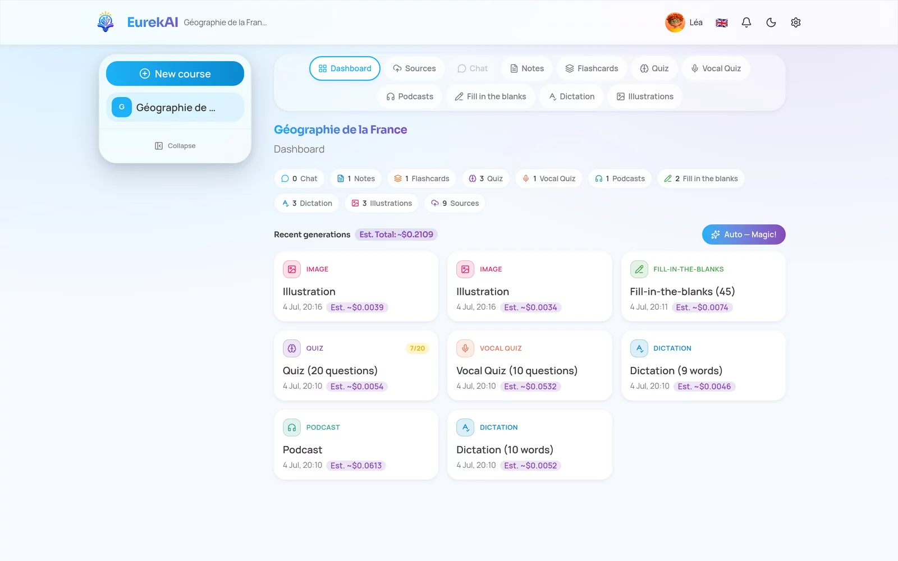<br>**Dashboard** — generazioni recenti, costo stimato per scheda e totale del progetto, pulsante «Auto — Magia!» | 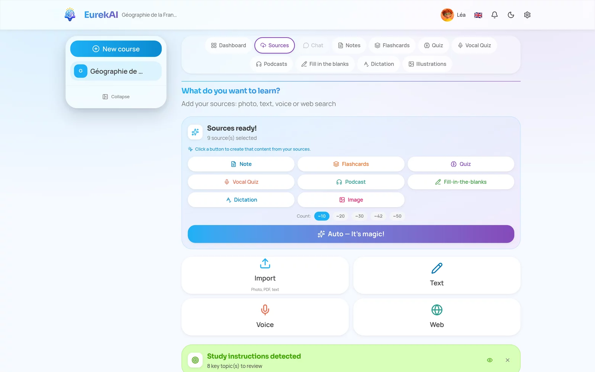<br>**Fonti** — import foto/PDF/testo/voce/web, generazione con un clic, rilevamento della consegna |

Ogni fonte importata mostra il suo [punteggio di fiducia OCR, la moderazione e il costo stimato](docs/screenshots/sources-list.webp).

### I componenti in azione

| | |
|---|---|
| 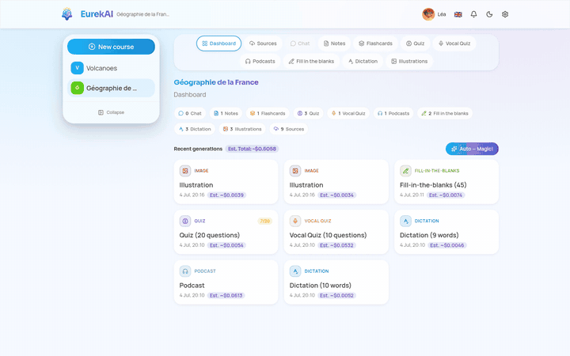<br>**Scheda di ripasso** — punti chiave, vocabolario, citazioni con fonte, lettura audio per sezione | <br>**Quiz a scelta multipla** — feedback immediato con spiegazione, navigazione passo passo |
| 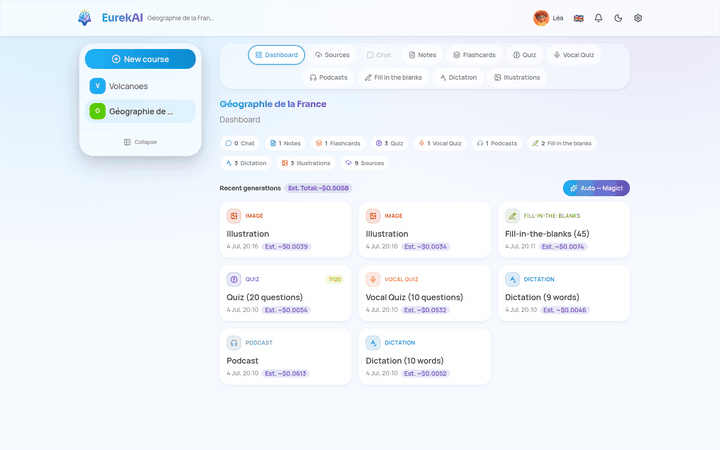<br>**Flashcard** — carta da girare e poi autovalutazione «lo sapevo / non lo sapevo» | <br>**Testi con spazi vuoti** — suggerimento su richiesta, validazione tollerante |
| 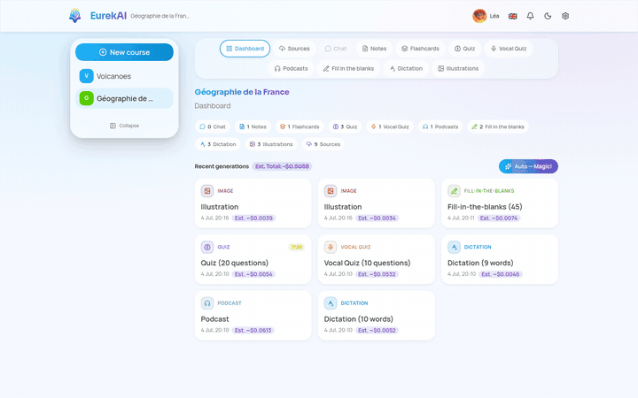<br>**Dettato** — parola dettata in audio, correzione rigorosa lettera per lettera | <br>**Quiz vocale** — domanda letta ad alta voce, risposta al microfono |
| <br>**Podcast** — mini-podcast a 2 voci, script dialogato consultabile | <br>**Illustrazioni** — immagini educative generate da Agent |
| 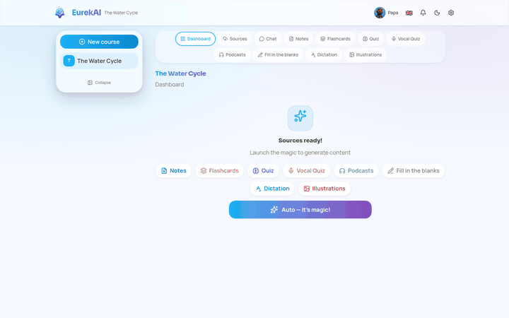<br>**Tutor IA** — chat ancorata ai documenti del corso, risposte spiegate, può generare quiz e flashcard | |

### Primo utilizzo

| | |
|---|---|
| 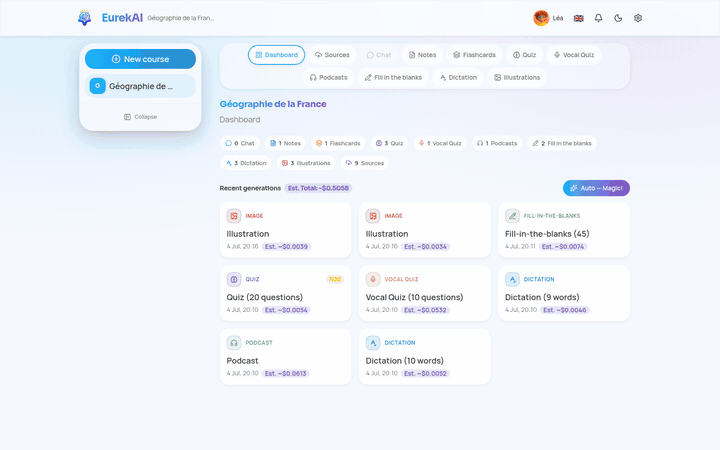<br>**Scelta del profilo** — ogni bambino ha il proprio spazio, il proprio avatar e la propria lingua | <br>**Creazione profilo** — età, avatar, PIN parentale per i minori di 15 anni |
| 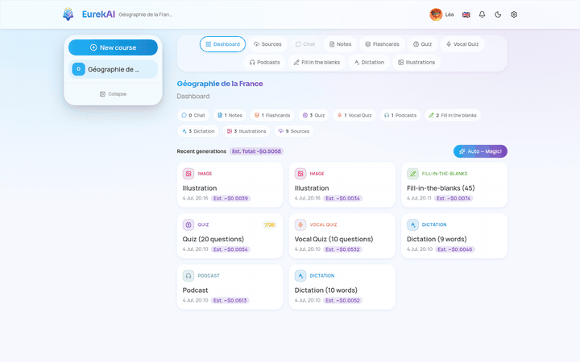<br>**Creazione corso** — un progetto per lezione, pronto a ricevere fonti | 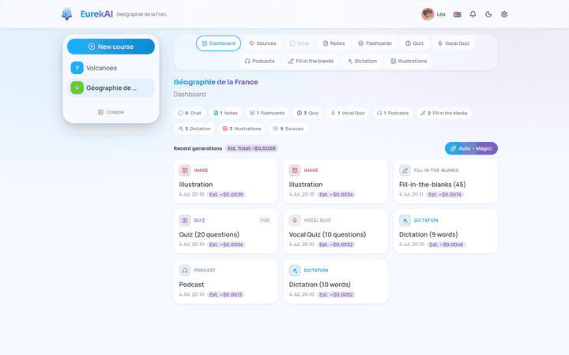<br>**Impostazioni** — stato API, scelta dei modelli IA con tariffe visualizzate |

---

## Funzionalità

| | Funzionalità | Descrizione |
|---|---|---|
| 📷 | **Importazione file** | Importa le tue lezioni — foto, PDF (tramite Mistral OCR con punteggio di fiducia medio, livelli `high`/`medium`/`low`) oppure file di testo (TXT, MD). Sessioni di upload con retry per file e avanzamento individuale |
| 📝 | **Inserimento testo** | Digita o incolla direttamente qualsiasi testo |
| 🎤 | **Input vocale** | Registrati — Voxtral STT trascrive la tua voce |
| 🌐 | **Web / URL** | Incolla un URL (scraping diretto tramite Readability + Lightpanda) oppure digita una ricerca (Agent Mistral web_search) |
| 📄 | **Schede di ripasso** | Note strutturate con punti chiave, vocabolario, citazioni, aneddoti |
| 🃏 | **Flashcard** | Carte Q/A interattive, lettura audio dialogata |
| ❓ | **Quiz a scelta multipla** | Domande a risposta multipla con ripasso adattivo degli errori (numero configurabile) |
| ✏️ | **Testi con spazi vuoti** | Esercizi da completare con suggerimenti e validazione tollerante |
| 🔤 | **Dettato** | Parole dettate in audio (Voxtral TTS) da una lista importata, inserimento da tastiera, correzione rigorosa lettera per lettera con regola ortografica spiegata |
| 🎙️ | **Podcast** | Mini-podcast a 2 voci in audio — voce Mistral predefinita oppure voci personalizzate (genitori!) |
| 🖼️ | **Illustrazioni** | Immagini educative generate da un Agent Mistral |
| 🗣️ | **Quiz vocale** | Domande lette ad alta voce (voce personalizzata possibile), risposta orale, verifica IA |
| 💬 | **Tutor IA** | Chat contestuale con i documenti del corso, con chiamata di strumenti |
| 🧠 | **Router automatico** | Un router basato su `mistral-small-latest` analizza il contenuto e propone una combinazione di generatori tra gli 8 tipi disponibili |
| 🔒 | **Controllo parentale** | Moderazione configurabile per profilo (categorie personalizzabili), PIN parentale, restrizioni della chat |
| 🌍 | **Multilingue** | Interfaccia disponibile in 9 lingue; generazione IA pilotabile in 15 lingue tramite i prompt |
| 🔊 | **Lettura ad alta voce** | Ascolta le schede e le flashcard (dialogo domanda/risposta) tramite Mistral Voxtral TTS |
| 💶 | **Monitoraggio dei costi API** | Stima trasparente del costo € di ogni generazione e fonte (token / caratteri / pagine / secondi audio). Badge per scheda + totale per progetto, visibile nella dashboard |
| 🎨 | **Tema per profilo** | Ogni profilo sceglie il proprio tema `dark` o `light` — persiste al cambio di profilo |

---

## Panoramica dell’architettura

<p align="center">
  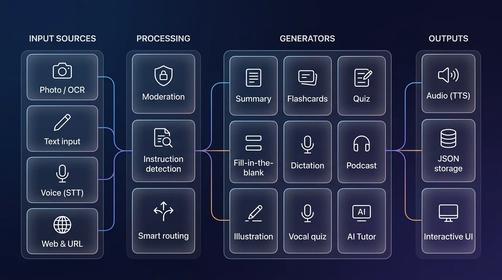
</p>

---

## Mappa di utilizzo dei modelli

<p align="center">
  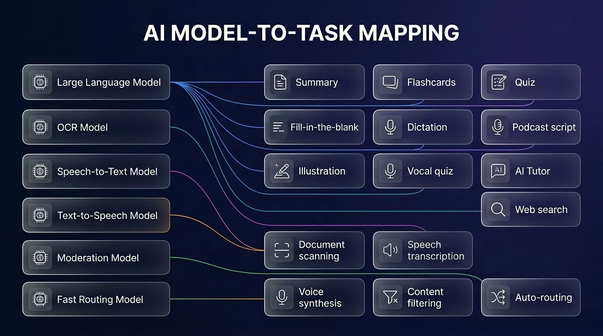
</p>

---

## Percorso utente

<p align="center">
  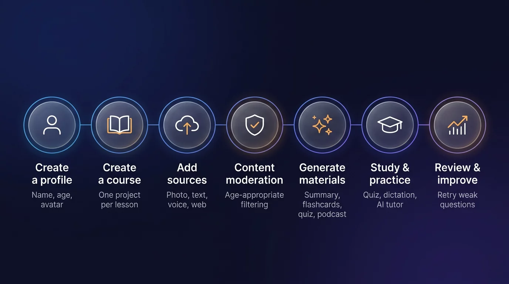
</p>

---

## Approfondimento — Funzionalità

### Input multi-modale

EurekAI accetta 4 tipi di fonti, moderati in base al profilo (attivato per impostazione predefinita per bambini e adolescenti) :

- **Importazione file** — File JPG, PNG o PDF elaborati con OCR Mistral — **OCR 4 (`mistral-ocr-4-0`) predefinito** (migliore qualità), **OCR 3 (`mistral-ocr-2512`) opzionale** nelle Impostazioni (meno costoso, ~½ del costo) — per testo stampato, tabelle e scrittura a mano; oppure file di testo (TXT, MD) importati direttamente. Gli upload multi-file usano un sistema di **sessioni di upload**: avanzamento individuale per file, retry del file fallito senza reinviare gli altri, dismiss della sessione al termine. L’OCR espone un **punteggio di fiducia** medio (`average`, clampato in `[0,1]`, calcolato a partire da `averagePageConfidenceScore` restituiti da Mistral), mostrato nell’interfaccia come badge tier `high` / `medium` / `low` (soglie ~0.9 / ~0.7) — avvisa senza bloccare se la scansione è di bassa qualità.
- **Testo libero** — Digita o incolla qualsiasi contenuto. Moderato prima della memorizzazione se la moderazione è attiva.
- **Input vocale** — Registra audio nel browser. Trascritto da `voxtral-mini-latest`. Il parametro `language="fr"` ottimizza il riconoscimento.
- **Web / URL** — Incolla uno o più URL per estrarre direttamente il contenuto (Readability + Lightpanda per le pagine JS), oppure digita parole chiave per una ricerca web tramite Agent Mistral. Il campo unico accetta entrambi — URL e parole chiave vengono separati automaticamente, ogni risultato crea una fonte indipendente.

### Generazione di contenuti IA

Otto tipi di materiale didattico generato:

| Generatore | Modello | Output |
|---|---|---|
| **Scheda di ripasso** | `mistral-large-latest` | Titolo, riepilogo, punti chiave, vocabolario, citazioni, aneddoto |
| **Flashcard** | `mistral-large-latest` | Carte Q/A con riferimenti alle fonti (numero configurabile) |
| **Quiz a scelta multipla** | `mistral-large-latest` | Domande a scelta multipla, spiegazioni, ripasso adattivo (numero configurabile) |
| **Testi con spazi vuoti** | `mistral-large-latest` | Frasi da completare con suggerimenti, validazione tollerante (Levenshtein) |
| **Dettato** | `mistral-large-latest` + Voxtral TTS | Parole chiave dettate in audio (1 MP3/parola) → inserimento da tastiera → correzione rigorosa (accenti) con regola spiegata |
| **Podcast** | `mistral-large-latest` + Voxtral TTS | Script a 2 voci → audio MP3 |
| **Illustrazione** | Agent `mistral-large-latest` | Immagine educativa tramite lo strumento `image_generation` |
| **Quiz vocale** | `mistral-large-latest` + Voxtral TTS + STT | Domande TTS → risposta STT → verifica IA |

### Tutor IA via chat

Un tutor conversazionale con accesso completo ai documenti del corso:

- Usa `mistral-large-latest`
- **Chiamata di strumenti**: può generare schede, flashcard, quiz o testi con spazi vuoti durante la conversazione
- Cronologia di 50 messaggi per corso
- Moderazione dei contenuti se attivata per il profilo

### Router automatico

Il router usa `mistral-small-latest` per analizzare il contenuto delle fonti e proporre i generatori più pertinenti tra gli 8 disponibili. L’interfaccia mostra l’avanzamento in tempo reale: prima una fase di analisi, poi le generazioni individuali con possibilità di annullamento.

### Apprendimento adattivo

- **Statistiche dei quiz**: tracciamento dei tentativi e della precisione per domanda
- **Ripasso quiz**: genera 5-10 nuove domande mirate ai concetti più deboli
- **Rilevamento della consegna**: rileva le istruzioni di ripasso ("So la mia lezione se so...") e le prioritizza nei generatori testuali compatibili (scheda, flashcard, quiz, testi con spazi vuoti)

### Sicurezza e controllo parentale

- **4 gruppi di età**: bambino (≤10 anni), adolescente (11-15), studente (16-25), adulto (26+)
- **Moderazione dei contenuti**: `mistral-moderation-2603` (Mistral Moderation 2) con 10 categorie disponibili, 5 bloccate per impostazione predefinita per bambino/adolescente (`sexual`, `hate_and_discrimination`, `violence_and_threats`, `selfharm`, `jailbreaking`). Categorie personalizzabili per profilo nelle impostazioni. L’alias `-latest` è volutamente evitato (punta ancora a una versione deprecata).
- **PIN parentale**: hash SHA-256, richiesto per i profili di età inferiore ai 15 anni. Per un deployment in produzione, prevedere un hash lento con salt (Argon2id, bcrypt).
- **Restrizioni della chat**: chat IA disattivata per impostazione predefinita per i minori di 16 anni, attivabile dai genitori

### Sistema multi-profilo

- Profili multipli con nome, età, avatar, preferenze di lingua
- **Voce per profilo** (`Profile.mistralVoices?: { host?, guest? }` — ogni ruolo è opzionale) — ogni bambino può avere la propria coppia di voci podcast/quiz vocale
- **Tema per profilo** (`Profile.theme: 'dark' | 'light'`) — cambio automatico al cambio di profilo, persistito lato backend
- Progetti collegati ai profili tramite `profileId`
- Eliminazione a cascata: eliminare un profilo elimina tutti i suoi progetti

### Monitoraggio dei costi API

Ogni chiamata Mistral (chat, OCR, STT, TTS, moderazione, agenti) è strumentata per fornire una stima € **trasparente** all’utente — nessuna sorpresa sulla fatturazione.

- **Fonte di verità**: `helpers/pricing.ts` — `MODEL_PRICING` per prefisso del modello (es: `mistral-large` → input 0.5 €/M token, output 1.5 €/M token), `PRICING_SOURCES` con URL della documentazione Mistral per il re-scraping periodico
- **Unità supportate**: `tokens`, `characters` (TTS), `pages` (OCR), `audio-seconds` (STT) — conversione gestita da `helpers/cost-calc.ts`
- **Catena di strumentazione**: `helpers/tracked-client.ts` (wrap client Mistral) → `helpers/usage-context.ts` (AsyncLocalStorage) → `helpers/cost-calc.ts` → `helpers/cost-persist.ts` → `helpers/cost-middleware.ts` (iniezione nella risposta HTTP)
- **UI**: badge costo per generazione (`src/partials/cost-badge-gen.html`), per fonte (`cost-badge-src.html`), totale cumulato nella dashboard (`Project.totalCost`)
- **Endpoint**: le risposte `/generate/*` e `/sources/*` decorano l’oggetto restituito (Generation / Source) con `estimatedCost`, `usage` e `costBreakdown`. `POST /generate/route` aggiunge un campo `costDelta: number` per il solo costo del routing. `GET /projects/:pid` restituisce il progetto arricchito di `totalCost` (somma calcolata da `costLog[]`) + la cronologia completa

### TTS (Mistral Voxtral) e voci personalizzate

- **Mistral Voxtral TTS** : `voxtral-mini-tts-latest`, sintesi vocale 100% Mistral, nessuna chiave aggiuntiva necessaria
- **Voci personalizzate**: i genitori possono creare le proprie voci tramite l’API Mistral Voices (a partire da un campione audio) e assegnarle ai ruoli host/guest — i podcast e i quiz vocali vengono quindi letti con la voce di un genitore, rendendo l’esperienza ancora più immersiva per il bambino
- Due ruoli vocali configurabili: **host** (narratore principale) e **guest** (seconda voce del podcast)
- Catalogo completo delle voci Mistral disponibile nelle impostazioni, filtrabile per lingua

### Internazionalizzazione

- Interfaccia disponibile in 9 lingue: fr, en, es, pt, it, nl, de, hi, ar
- I prompt IA supportano 15 lingue (fr, en, es, de, it, pt, nl, ja, zh, ko, ar, hi, pl, ro, sv)
- Lingua configurabile per profilo

---
## Stack tecnica

| Livello | Tecnologia | Ruolo |
|---|---|---|
| **Runtime** | Node.js + TypeScript 6.x | Server e sicurezza dei tipi |
| **Backend** | Express 5.x | API REST |
| **Server di sviluppo** | Vite 8.x (Rolldown) + tsx | HMR, partials Handlebars, proxy |
| **Frontend** | HTML + TailwindCSS 4.x + Alpine.js 3.x | Interfaccia reattiva, TypeScript compilato da Vite |
| **Templating** | vite-plugin-handlebars | Composizione HTML tramite partials |
| **IA** | Mistral AI SDK 2.x | Chat, OCR, STT, TTS, Agents, Moderazione |
| **TTS** | Mistral Voxtral TTS | `voxtral-mini-tts-latest`, sintesi vocale integrata |
| **Icone** | Lucide 1.x | Libreria di icone SVG |
| **Web scraping** | Readability + linkedom | Estrazione del contenuto principale delle pagine web (tecnologia Firefox Reader View) |
| **Browser headless** | Lightpanda | Browser headless ultraleggero (Zig + V8) per pagine JS/SPA — fallback scraping |
| **Markdown** | Marked | Rendering Markdown nella chat |
| **Upload file** | Multer 2.x | Gestione dei form multipart |
| **Audio** | ffmpeg-static | Concatenazione di segmenti audio |
| **Test** | Vitest | Test unitari — copertura misurata da SonarCloud |
| **Persistenza** | File JSON | Archiviazione senza dipendenze |

---

## Riferimento dei modelli

| Modello | Utilizzo | Perché |
|---|---|---|
| `mistral-large-latest` | Scheda, Flashcards, Podcast, Quiz, Testi con spazi vuoti, Chat, Verifica quiz vocale, Agente Image, Agente Web Search, Rilevamento istruzioni | Migliore multilingual + follow-up delle istruzioni |
| `mistral-ocr-4-0` (OCR 4, predefinito) | OCR di documenti — qualità superiore | Testo stampato, tabelle, scrittura a mano ($4 / 1000 pagine) |
| `mistral-ocr-2512` (OCR 3, opzione) | OCR di documenti | Selezionabile in Impostazioni, più economico ($2 / 1000 pagine) |
| `voxtral-mini-latest` | Riconoscimento vocale (STT) | STT multilingue, ottimizzato con `language="fr"` |
| `voxtral-mini-tts-latest` | Sintesi vocale (TTS) | Podcast, quiz vocale, lettura ad alta voce |
| `mistral-moderation-2603` | Moderazione dei contenuti | 5 categorie bloccate per bambino/adolescente (incluso `jailbreaking`) |
| `mistral-small-latest` | Router automatico | Analisi rapida del contenuto per decisioni di routing |

---

## Avvio rapido

```bash
# Cloner le dépôt
git clone https://github.com/jls42/EurekAI.git
cd EurekAI

# Installer les dépendances
npm install

# Configurer les clés API
cp .env.example .env
# Éditez .env (toutes optionnelles) :
#   MISTRAL_API_KEY=<your_api_key>           (optionnel — sinon chaque utilisateur saisit sa clé dans l'app)
#   SONAR_TOKEN=...                          (optionnel, CI SonarCloud uniquement)

# Lancer le développement
npm run dev
# → Backend :  http://localhost:3000 (API)
# → Frontend : http://localhost:5173 (serveur Vite avec HMR)
```

> **Nota**: Mistral Voxtral TTS è l’unico provider TTS — nessuna chiave aggiuntiva necessaria oltre a `MISTRAL_API_KEY`.

> **Chiave API inserita dall’utente**: `MISTRAL_API_KEY` è ora **opzionale**. Se manca, l’app si avvia comunque e invita ogni utente a inserire **la propria chiave Mistral** nell’interfaccia. La chiave viene **memorizzata nel browser** (cifrata tramite Web Crypto + IndexedDB in contesto sicuro) e inviata con la richiesta — **mai persistita sul server**. Precedenza: chiave del profilo > chiave globale del browser > `MISTRAL_API_KEY` (env). Impostare `EUREKAI_REQUIRE_USER_KEY=true` forza ogni utente a fornire la propria chiave (la chiave env serve più solo per i preloading).

> **HTTPS locale (tablet/LAN)**: `localhost` è già un contesto sicuro. Per un accesso LAN (tablet), genera un certificato locale e attiva HTTPS per sbloccare la cifratura del browser + cifrare la chiave in transito:
> ```bash
> ./scripts/gen-cert.sh 192.168.1.42   # mkcert se disponibile, altrimenti openssl self-signed
> export HTTPS_KEY=certs/key.pem HTTPS_CERT=certs/cert.pem
> npm run dev                          # Express + Vite in HTTPS
> ```

### Variabili d'ambiente

| Variabile | Richiesto | Predefinito | Ruolo |
|---|---|---|---|
| `MISTRAL_API_KEY` | opzionale | — | Chiave API Mistral (chat, OCR, STT, TTS Voxtral, agenti, moderazione). Se assente, l’utente inserisce la propria chiave nell’app (memorizzata nel browser, mai sul server) |
| `EUREKAI_REQUIRE_USER_KEY` | opzionale | `false` | `true` → disattiva il fallback su `MISTRAL_API_KEY` per le richieste IA (ogni utente DEVE fornire la propria chiave). Utile su un’istanza esposta |
| `HTTPS_KEY` / `HTTPS_CERT` | opzionale | — | Percorsi chiave/cert TLS (cf. `scripts/gen-cert.sh`) → Express e Vite servono in HTTPS (secure context LAN/tablet) |
| `PORT` | opzionale | `3000` | Porta HTTP del backend Express |
| `NODE_ENV` | opzionale | `development` | Se `production` → Express serve il frontend da `dist/` (altrimenti `public/`) |
| `SONAR_TOKEN` | opzionale CI | — | Usato solo dal workflow GitHub Actions SonarCloud |

### Test, qualità del codice e contributo

```bash
npm test                # vitest (déclenche pretest : typecheck + lint:complexity + lint:ci + lint:deadcode)
npm run test:coverage   # couverture vitest
npm run lint            # ESLint + typescript-eslint + sonarjs
npm run lint:fix        # auto-fix
npm run format          # prettier
npm run security        # Opengrep (SAST local) — bloque sur finding ERROR
```

**Hook Git (Husky)**: `pre-commit` esegue in sequenza `scripts/pre-commit-fast.sh` (conflitti, file di grandi dimensioni, shellcheck), `lint-staged` poi `npm test` ; `pre-push` esegue prima un gate `npm audit` (blocca su vulnerabilità critica transitiva, cf. `scripts/audit-verdict.mjs`) poi `npm run security`. Tutti bloccano il commit/push in caso di errore.

**Strumenti esterni richiesti (opzionali ma usati da `pretest` / `npm run security`)**:

```bash
# Lizard (Python) pour lint:complexity (CCN > 8 sur l'allowlist)
pipx install lizard          # ou : pipx run lizard

# Opengrep (binaire standalone ~40 Mo) pour npm run security
./scripts/install-opengrep.sh   # installe dans ~/.local/bin/
```

Senza questi strumenti, `npm test` fallisce a `pretest` (lizard assente) e `npm run security` fallisce (opengrep assente). Gli hook husky bloccano quindi il commit/push.

---

## Distribuzione con contenitore

L’immagine è pubblicata su **GitHub Container Registry**:

```bash
# Télécharger l'image
podman pull ghcr.io/jls42/eurekai:latest

# Lancer EurekAI
mkdir -p ./data
podman run -d --name eurekai \
  -e MISTRAL_API_KEY=<your_api_key> \
  -v ./data:/app/output:U \
  -p 3000:3000 \
  ghcr.io/jls42/eurekai:latest
# → http://localhost:3000
```

> **`:U`** è un flag Podman rootless che regola automaticamente i permessi del volume.

```bash
# Build local
podman build -t eurekai -f Containerfile .

# Publier sur ghcr.io (mainteneurs)
./scripts/publish-ghcr.sh
```

---

## Struttura del progetto

```
server.ts                 — Point d'entrée Express, monte les routes + config
config.ts                 — Config runtime (modèles, voix, modèle TTS), persistée dans output/config.json
store.ts                  — ProjectStore : CRUD projets/sources/générations, persistance JSON
profiles.ts               — ProfileStore : gestion des profils, hachage PIN
types.ts                  — Types TypeScript : Source, Generation (8 types), QuizStats, Profile
prompts.ts                — Tous les prompts IA centralisés (system + user templates, 15 langues)

generators/
  auto-agents.ts          — Source unique de vérité : AUTO_AGENTS_SET (8 agents) + MAX_AUTO_PLAN_LENGTH
  generation-types.ts     — Types générables individuellement (SINGLE_GENERATE_TYPES, coïncide avec les 8 agents auto)
  ocr.ts                  — OCR via Mistral (JPG, PNG, PDF) avec extraction interne des scores de confiance moyens par page
  summary.ts              — Génération de fiche de révision (JSON structuré)
  flashcards.ts           — Flashcards Q/R (nombre configurable)
  quiz.ts                 — Quiz QCM (nombre configurable) + révision adaptative
  fill-blank.ts           — Exercices à trous avec validation tolérante
  dictation.ts            — Dictée : mots + phrases-exemples + règles, 1 audio TTS par mot (8e agent auto)
  podcast.ts              — Script podcast 2 voix
  quiz-vocal.ts           — Quiz vocal : questions TTS + réponses STT + vérification IA
  image.ts                — Génération d'image via Agent Mistral (outil image_generation)
  chat.ts                 — Tuteur IA par chat avec appel d'outils
  router.ts               — Routeur automatique (contenu → générateurs recommandés)
  consigne.ts             — Détection de consignes de révision
  tts-provider.ts         — TTS Mistral Voxtral (synthèse vocale + listing des voix)
  tts.ts                  — Génération audio multi-voix (podcast + flashcards, concaténation de segments)
  stt.ts                  — Voxtral STT (audio → texte)
  websearch.ts            — Agent Mistral avec outil web_search (fallback)
  moderation.ts           — Modération de contenu (filtrage par âge)

routes/
  projects.ts             — CRUD projets
  profiles.ts             — CRUD profils avec gestion du PIN
  sources.ts              — Import fichiers (OCR + texte brut), texte libre, voix STT, scraping URL + recherche web, modération
  generate.ts             — Endpoints de génération (8 types + auto + route)
  generations.ts          — Tentatives de quiz/fill-blank, réponses vocales, lecture à voix haute
  chat.ts                 — Chat IA avec appel d'outils

helpers/
  # IO & parsing
  index.ts                — getContent, stripJsonMarkdown, safeParseJson, unwrapJsonArray, extractAllText, timer
  audio.ts                — collectStream (ReadableStream → Buffer)
  audio-files.ts          — Persistance et lecture des fichiers audio générés (podcast, flashcards)
  logger.ts               — Logger structuré (niveaux, contexte JSON)

  # Génération & UX
  auto-title.ts           — autoTitle(type, data, lang) : préfixe auto pour carte liste (Fiche, Note, Quiz, etc.)
  choice-labels.ts        — Labels localisés des choix (quiz, quiz-vocal) — 9 langues
  diversity.ts            — Diversité des générations (exclusion du contenu déjà produit, `diversityParams` : temperature/presencePenalty/randomSeed)
  fill-blank-validate.ts  — Validation tolérante des réponses (normalisation, Levenshtein)
  dictation-diff.ts       — Comparaison stricte lettre à lettre pour la correction de dictée (local, zéro coût IA)
  reading-comfort.ts      — Option « Confort de lecture » par profil (police Luciole, espacements) — partagé serveur/client
  ocr-models.ts           — Source de vérité sélection OCR (OCR 4 défaut / OCR 3 option) + normalizeOcrModel

  # Codes d'erreur stables
  error-codes.ts              — Re-export mince de l'API publique
  error-code-resolution.ts    — Orchestration extractErrorCode(e, agent) → FailedStepCode
  error-code-rules.ts         — Règles de mapping par agent/step
  error-matchers.ts           — Matchers par pattern d'erreur HTTP/LLM (délimités pour Lizard)

  # Cost tracking API (suivi coûts €)
  pricing.ts              — MODEL_PRICING + PRICING_SOURCES (tarifs Mistral par prefix de modèle)
  cost-calc.ts            — Conversion ApiUsage → coût € (tokens / characters / pages / audio-seconds)
  cost-persist.ts         — Écriture dans Project.costLog + totalCost
  cost-middleware.ts      — Injection de costDelta dans la réponse HTTP
  tracked-client.ts       — Wrap du client Mistral (capture ApiUsage automatiquement)
  usage-context.ts        — AsyncLocalStorage pour propager l'usage dans les pipelines async

  # Clé API Mistral & sécurité
  mistral-client-factory.ts — Source UNIQUE de construction du client Mistral (buildTrackedClient, resolveClient, requireKeyMiddleware)
  rate-limit.ts           — Rate-limiters Express (authLimiter, aiLimiter, generalLimiter)
  security-headers.ts     — Options Helmet / CSP (createHelmetOptions)
  redact.ts               — Redaction des secrets dans les logs (clé API, headers sensibles)
  mistral-retry.ts        — Retry avec backoff sur erreurs transitoires Mistral (3 tentatives)

  # Événements & notifications (SSE)
  event-bus.ts            — Bus d'événements de génération en mémoire (dispatch SSE, filet anti-uncaughtException)
  event-key.ts            — Clé d'événement typée partagée client/serveur (idempotence notifications)

  # Voix & profils
  voice-selection.ts      — selectVoices : rotation déterministe par profil + langue (host/guest)
  voice-types.ts          — Type MistralVoice (importable côté frontend sans embarquer le SDK Mistral)

src/                      — Frontend (Vite + Handlebars)
  index.html              — Point d'entrée HTML principal
  main.ts                 — Entrée frontend (init Alpine.js + icônes Lucide)
  app/                    — Modules applicatifs Alpine.js
    state.ts              — Gestion d'état réactif
    navigation.ts         — Routage des vues + gardes par âge
    profiles.ts           — Logique du sélecteur de profils
    projects.ts           — CRUD des cours
    sources.ts            — Gestionnaires d'upload de sources
    generate.ts           — Déclencheurs de génération (individuel, tout, auto 2 phases)
    generations.ts        — Affichage + actions sur les générations
    chat.ts               — Interface de chat
    config.ts             — Interface de configuration (modèles, voix, modèle TTS)
    render.ts             — Helpers de rendu HTML
    i18n.ts               — Changement de langue
    ...
  components/
    quiz.ts               — Composant quiz interactif
    quiz-vocal.ts         — Composant quiz vocal
    fill-blank.ts         — Composant textes à trous
    fill-blank-validate.ts — Ré-export client de la validation textes à trous (validateAnswer)
    flashcards.ts         — Composant flashcards avec retournement
    dictation.ts          — Composant dictée interactif
    step-by-step.ts       — Mixin navigation pas-à-pas (quiz, fill-blank, flashcards)
  i18n/
    fr.ts, en.ts, es.ts, — Dictionnaires par langue (9 langues)
    pt.ts, it.ts, nl.ts,
    de.ts, hi.ts, ar.ts
    languages.ts          — Registre des langues UI disponibles
    index.ts              — Chargeur i18n
  partials/               — Partials HTML Handlebars (header, sidebar, dialogues, vues)
  styles/
    main.css              — Entrée TailwindCSS
    theme.css             — Variables de thème personnalisées

public/assets/            — Ressources statiques (logo, avatars, schémas architecture)
docs/                     — Notes internes (inventaire prompts, audits, prompts des diagrammes) + screenshots du README
scripts/                  — Tooling : check-deps, check-models, check-security, check-complexity, gen-cert, install-opengrep, translate-readme, publish-ghcr, update-pricing
output/                   — Données d'exécution (projets, config, fichiers audio) ; en mode prod (`NODE_ENV=production`), Express sert le frontend depuis `dist/` au lieu de `public/`
```

> **Per i contributori IA**: consultare [`CLAUDE.md`](CLAUDE.md) per il contesto architetturale dettagliato, le regole obbligatorie (anti-leak prompts, codici di errore, cost tracking) e le trappole note (Lizard CCN, Opengrep, migrazione Codacy/Semgrep).

---

## Riferimento API

### Config
| Metodo | Endpoint | Descrizione |
|---|---|---|
| `GET` | `/api/config` | Configurazione corrente |
| `PUT` | `/api/config` | Modificare la config (modelli, voce, modello TTS) |
| `GET` | `/api/config/status` | Stato delle API: `mistral` (chiave Mistral definita), `ttsAvailable` (alias di `mistral`, Mistral Voxtral è l’unico provider TTS) |
| `POST` | `/api/config/reset` | Ripristinare la config predefinita |
| `GET` | `/api/config/voices` | Elencare le voci Mistral TTS (opzionale `?lang=fr`) |
| `GET` | `/api/moderation-categories` | Categorie di moderazione disponibili + predefiniti per età |
| `POST` | `/api/providers/mistral/validate` | Validare una chiave Mistral inserita dall’utente — sempre 200 `{status}` (`ok`/`invalid`/`quota`/`network`/`missing`), nessun fallback env |

### Profili
| Metodo | Endpoint | Descrizione |
|---|---|---|
| `GET` | `/api/profiles` | Elencare tutti i profili |
| `POST` | `/api/profiles` | Creare un profilo |
| `PUT` | `/api/profiles/:id` | Modificare un profilo (PIN richiesto per < 15 anni) |
| `DELETE` | `/api/profiles/:id` | Eliminare un profilo + cascade progetti `{pin?}` → `{ok, deletedProjects}` |

### Progetti
| Metodo | Endpoint | Descrizione |
|---|---|---|
| `GET` | `/api/projects` | Elencare i progetti (`?profileId=` opzionale) |
| `POST` | `/api/projects` | Creare un progetto `{name, profileId}` |
| `GET` | `/api/projects/:pid` | Dettagli del progetto |
| `PUT` | `/api/projects/:pid` | Rinominare `{name}` |
| `DELETE` | `/api/projects/:pid` | Eliminare il progetto |
| `GET` | `/api/projects/:pid/events` | Flusso SSE in tempo reale (`event: generation`) delle transizioni di generazione (`completed`/`failed`/`cancelled`) + heartbeat keep-alive |

### Fonti
| Metodo | Endpoint | Descrizione |
|---|---|---|
| `POST` | `/api/projects/:pid/sources/upload` | Importare file multipart (OCR per JPG/PNG/PDF, lettura diretta per TXT/MD) |
| `POST` | `/api/projects/:pid/sources/text` | Testo libero `{text}` |
| `POST` | `/api/projects/:pid/sources/voice` | Voce STT (audio multipart) |
| `POST` | `/api/projects/:pid/sources/websearch` | Scraping URL o ricerca web `{query}` — restituisce un array di fonti |
| `DELETE` | `/api/projects/:pid/sources/:sid` | Eliminare una fonte |
| `POST` | `/api/projects/:pid/moderate` | Moderare `{text}` |
| `POST` | `/api/projects/:pid/detect-consigne` | Rilevare le istruzioni di revisione |

### Generazione
| Metodo | Endpoint | Descrizione |
|---|---|---|
| `POST` | `/api/projects/:pid/generate/summary` | Scheda di revisione |
| `POST` | `/api/projects/:pid/generate/flashcards` | Flashcards |
| `POST` | `/api/projects/:pid/generate/quiz` | Quiz QCM |
| `POST` | `/api/projects/:pid/generate/fill-blank` | Testi con spazi vuoti |
| `POST` | `/api/projects/:pid/generate/dictation` | Dettatura (parole + frasi di esempio + regole, 1 audio TTS per parola; proposta anche dall’auto-router) |
| `POST` | `/api/projects/:pid/generate/podcast` | Podcast |
| `POST` | `/api/projects/:pid/generate/image` | Illustrazione |
| `POST` | `/api/projects/:pid/generate/quiz-vocal` | Quiz vocale |
| `POST` | `/api/projects/:pid/generate/quiz-review` | Revisione adattiva `{generationId, weakQuestions}` |
| `POST` | `/api/projects/:pid/generate/remediation-summary` | Scheda di ripasso mirata sulle domande sbagliate di un quiz `{generationId, weakQuestions}` — chiamata in parallelo a `quiz-review` dal pulsante «Allenarmi sui miei errori» |
| `POST` | `/api/projects/:pid/generate/route` | Analisi di routing (piano dei generatori da avviare) — restituisce `{plan, costDelta}` (costo del solo routing) |
| `POST` | `/api/projects/:pid/generate/auto` | Generazione auto backend (routing + 8 tipi: summary, flashcards, quiz, fill-blank, podcast, quiz-vocal, image, dictation). Esecuzione in parallelo — presuppone un tier Mistral con rate-limit ≥ 8 richieste simultanee; altrimenti diversi 429 possono risalire in `failedSteps`. |

Tutti gli endpoint di generazione accettano `{sourceIds?, lang?, ageGroup?, count?, useConsigne?}`. `quiz-review` e `remediation-summary` richiedono inoltre `{generationId, weakQuestions}`.

### CRUD Generazioni
| Metodo | Endpoint | Descrizione |
|---|---|---|
| `POST` | `/api/projects/:pid/generations/:gid/quiz-attempt` | Inviare le risposte del quiz `{answers}` |
| `POST` | `/api/projects/:pid/generations/:gid/fill-blank-attempt` | Inviare le risposte dei testi con spazi vuoti `{answers}` |
| `POST` | `/api/projects/:pid/generations/:gid/dictation-attempt` | Inviare le risposte della dettatura `{answers}` (punteggio server rigoroso) |
| `POST` | `/api/projects/:pid/generations/:gid/vocal-answer` | Verificare una risposta orale (audio + questionIndex) |
| `POST` | `/api/projects/:pid/generations/:gid/read-aloud` | Lettura TTS ad alta voce (schede/flashcards) |
| `POST` | `/api/projects/:pid/generations/:gid/cancel` | Annullare una generazione in corso (unico percorso di annullamento di un pending) |
| `PUT` | `/api/projects/:pid/generations/:gid` | Rinominare `{title}` |
| `DELETE` | `/api/projects/:pid/generations/:gid` | Eliminare la generazione |

### Chat
| Metodo | Endpoint | Descrizione |
|---|---|---|
| `GET` | `/api/projects/:pid/chat` | Recuperare la cronologia della chat |
| `POST` | `/api/projects/:pid/chat` | Inviare un messaggio `{message, lang, ageGroup}` |
| `DELETE` | `/api/projects/:pid/chat` | Cancellare la cronologia della chat |

---

## Decisioni architetturali

| Decisione | Giustificazione |
|---|---|
| **Alpine.js invece di React/Vue** | Ingombro minimo, reattività leggera con TypeScript compilato da Vite. Perfetto per un hackathon in cui la velocità conta. |
| **Persistenza in file JSON** | Zero dipendenze, avvio istantaneo. Nessun database da configurare — si parte subito e via. |
| **Vite + Handlebars** | Il meglio di entrambi i mondi: HMR veloce per lo sviluppo, partials HTML per l’organizzazione del codice, Tailwind JIT. |
| **Prompt centralizzati** | Tutti i prompt IA in `prompts.ts` — facile iterare, testare e adattare per lingua/fascia d’età. |
| **Sistema multi-generazione** | Ogni generazione è un oggetto indipendente con il proprio ID — permette più schede, quiz, ecc. per corso. |
| **Prompt adattati per età** | 4 gruppi di età con vocabolario, complessità e tono diversi — lo stesso contenuto insegna in modo diverso a seconda dell’apprendente. |
| **Funzionalità basate sugli Agent** | La generazione di immagini e la ricerca web usano Agent Mistral temporanei — ciclo di vita pulito con pulizia automatica. |
| **Scraping intelligente di URL** | Un campo unico accetta URL e parole chiave mescolati — gli URL vengono scrapati via Readability (pagine statiche) con fallback Lightpanda (pagine JS/SPA), le parole chiave attivano un Agent Mistral web_search. Ogni risultato crea una fonte indipendente. |
| **TTS 100% Mistral** | Mistral Voxtral TTS (nessuna chiave aggiuntiva oltre a `MISTRAL_API_KEY`) — sintesi vocale integrata nella catena di costo e nella risoluzione vocale per lingua. |

---

## Crediti e ringraziamenti

- **[Mistral AI](https://mistral.ai)** — Modelli IA (Large, OCR, Voxtral STT, Voxtral TTS, Moderation, Small) + Worldwide Hackathon
- **[Alpine.js](https://alpinejs.dev)** — Framework reattivo leggero
- **[TailwindCSS](https://tailwindcss.com)** — Framework CSS utility-first
- **[Vite](https://vitejs.dev)** — Strumento di build frontend
- **[Lucide](https://lucide.dev)** — Libreria di icone
- **[Marked](https://marked.js.org)** — Parser Markdown
- **[Readability](https://github.com/mozilla/readability)** — Estrazione di contenuti web (tecnologia Firefox Reader View)
- **[Lightpanda](https://lightpanda.io)** — Browser headless ultraleggero per lo scraping di pagine JS/SPA
- **[Luciole](https://luciole-vision.com)** — Font progettato per lettori ipovedenti, © Laurent Bourcellier & Jonathan Perez, [CC BY 4.0](https://creativecommons.org/licenses/by/4.0/) (opzione «Comfort di lettura» dei profili)

Iniziato durante il Mistral AI Worldwide Hackathon (marzo 2026), sviluppato interamente da IA con [Claude Code](https://code.claude.com/), [Codex](https://openai.com/codex/) e [Gemini CLI](https://geminicli.com/).

---

## Autore

**Julien LS** — [contact@jls42.org](mailto:contact@jls42.org)

## Licenza

[AGPL-3.0](LICENSE) — Copyright (C) 2026 Julien LS

**Articolo tradotto dal fr al it con gpt-5.4-mini.**
