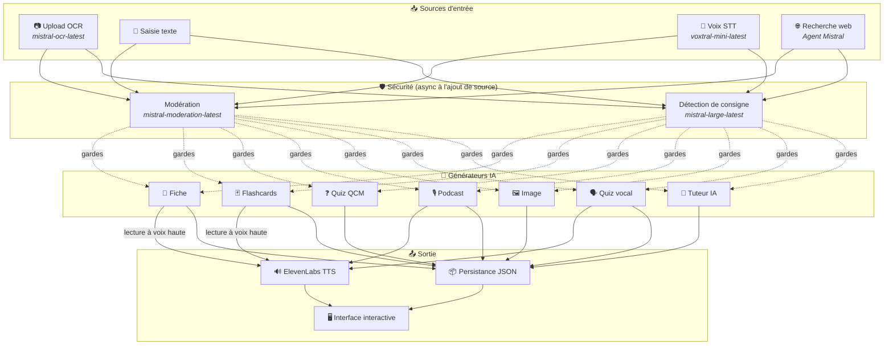
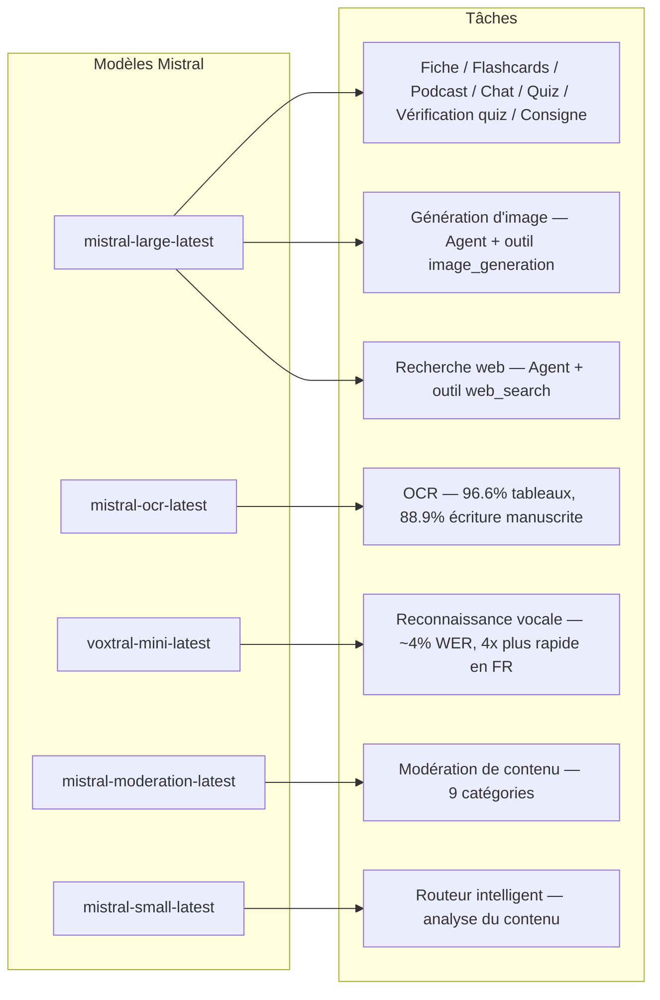
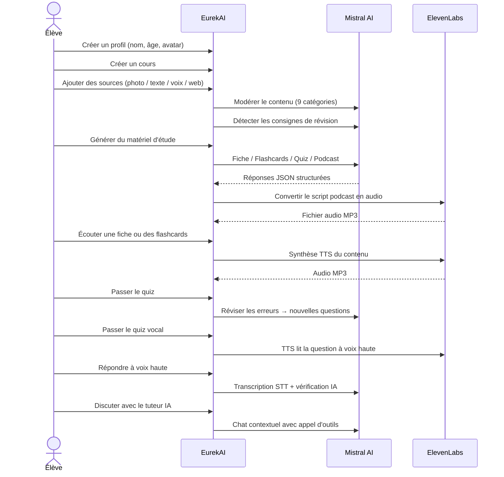

<p align="center">
  
</p>

<h1 align="center">EurekAI</h1>

<p align="center">
  <strong>あらゆるコンテンツを、AIで強化されたインタラクティブな学習体験へと変換します。</strong>
</p>

<p align="center">
  <a href="https://mistral.ai"></a>
  <a href="https://www.typescriptlang.org"></a>
  <a href="https://mistral.ai"></a>
  <a href="https://elevenlabs.io"></a>
</p>

<p align="center">
  <a href="https://www.youtube.com/watch?v=_b1TQz2leoI">▶️ YouTubeでデモを見る</a> · <a href="README-en.md">🇬🇧 英語で読む</a>
</p>

---

## 物語 — なぜ EurekAI なのか？

**EurekAI** は [Mistral AI Worldwide Hackathon](https://worldwidehackathon.mistral.ai/)（2026年3月）の期間中に生まれました。題材が必要だったのですが、アイデアはとても身近なところから来ました。私は娘と一緒に定期的にテスト対策をしているのですが、AI を使えば、もっと楽しくインタラクティブにできるはずだと思ったのです。

目的は、**どんな入力でも** — 教科書の写真、コピペしたテキスト、音声録音、Web検索など — **復習ノート、フラッシュカード、クイズ、ポッドキャスト、イラスト** などへ変換することです。すべては Mistral AI のフランス製モデルで動いており、フランス語話者の生徒に自然に適したソリューションになっています。

コードの1行1行は、このハッカソンの期間中に書かれました。すべての API とオープンソースライブラリは、ハッカソンのルールに従って使用されています。

---

## 機能

| | 機能 | 説明 |
|---|---|---|
| 📷 | **OCRアップロード** | 教科書やノートを撮影 — Mistral OCR が内容を抽出します |
| 📝 | **テキスト入力** | どんなテキストでも直接入力または貼り付け可能 |
| 🎤 | **音声入力** | ブラウザで録音 — Voxtral STT が音声を文字起こしします |
| 🌐 | **Web検索** | 質問を入力 — Mistral Agent が Web 上で答えを探します |
| 📄 | **復習ノート** | 重要ポイント、語彙、引用、逸話を含む構造化ノート |
| 🃏 | **フラッシュカード** | アクティブリコールのための出典参照付き Q/A カード5枚 |
| ❓ | **MCQクイズ** | 誤答の適応復習付きの10〜20問の多肢選択式問題 |
| 🎙️ | **ポッドキャスト** | 2人のミニポッドキャスト（Alex & Zoé）を ElevenLabs で音声化 |
| 🖼️ | **イラスト** | Mistral Agent が生成する教育用画像 |
| 🗣️ | **音声クイズ** | 問題を音声で読み上げ、音声で回答、AI が答えを確認 |
| 💬 | **AIチューター** | ツール呼び出し対応の、授業資料と連動したコンテキストチャット |
| 🧠 | **スマートルーター** | AI がコンテンツを解析し、最適な生成器を提案 |
| 🔒 | **保護者による管理** | 年齢に応じたモデレーション、保護者PIN、チャット制限 |
| 🌍 | **多言語対応** | UI と AI コンテンツはフランス語と英語に完全対応 |
| 🔊 | **読み上げ** | ElevenLabs TTS でノートやフラッシュカードを読み上げて聴取可能 |

---

## アーキテクチャ概要



---

## モデル使用マップ



---

## ユーザーフロー



---

## 詳細解説 — 機能

### マルチモーダル入力

EurekAI は 4 種類のソースを受け付け、すべて処理前にモデレーションされます。

- **OCRアップロード** — JPG、PNG、PDF ファイルを `mistral-ocr-latest` で処理。印刷テキスト、表（精度 96.6%）、手書き（精度 88.9%）に対応。
- **自由テキスト** — 任意の内容を入力または貼り付け可能。保存前にモデレーションを通過します。
- **音声入力** — ブラウザで音声を録音。`voxtral-mini-latest` により約4% WER で文字起こしされます。`language="fr"` パラメータで4倍高速化。
- **Web検索** — クエリを入力。`web_search` ツールを持つ一時的な Mistral Agent が結果を取得・要約します。

### AIコンテンツ生成

生成される学習素材は6種類です。

| ジェネレーター | モデル | 出力 |
|---|---|---|
| **復習ノート** | `mistral-large-latest` | タイトル、要約、10〜25個の重要ポイント、語彙、引用、逸話 |
| **フラッシュカード** | `mistral-large-latest` | 出典参照付き Q/A カード5枚 |
| **MCQクイズ** | `mistral-large-latest` | 10〜20問、各4択、解説、適応復習 |
| **ポッドキャスト** | `mistral-large-latest` + ElevenLabs | 2人用スクリプト（Alex & Zoé）→ MP3 音声 |
| **イラスト** | `mistral-large-latest` Agent | `image_generation` ツールによる教育用画像 |
| **音声クイズ** | `mistral-large-latest` + ElevenLabs + Voxtral | TTS の質問 → STT の回答 → AI による検証 |

### チャットによるAIチューター

授業資料に完全アクセスできる会話型チューターです。

- `mistral-large-latest` を使用（128K トークンのコンテキストウィンドウ）
- **ツール呼び出し**: 会話中にノート、フラッシュカード、クイズをその場で生成可能
- コースごとに50メッセージの履歴
- 年齢に応じたコンテンツモデレーション

### インテリジェント自動ルーター

ルーターは `mistral-small-latest` を使ってソース内容を解析し、どのジェネレーターが最も適切かを提案します。これにより、生徒は手動で選択する必要がありません。

### 適応学習

- **クイズ統計**: 問題ごとの試行回数と正答率を追跡
- **クイズ復習**: 弱い概念を狙った新しい問題を5〜10問生成
- **指示検出**: 復習指示（「〜を知っていれば授業を理解できたと言える」など）を検出し、すべてのジェネレーターで優先

### 安全性と保護者管理

- **4つの年齢グループ**: 子ども（6〜10）、ティーン（11〜15）、学生（16+）、大人
- **コンテンツモデレーション**: `mistral-moderation-latest` による9カテゴリ、年齢グループ別の閾値
- **保護者PIN**: SHA-256 ハッシュ、15歳未満のプロフィールで必須
- **チャット制限**: AIチャットは15歳以上のプロフィールのみ利用可能

### マルチプロフィールシステム

- 名前、年齢、アバター、言語設定を持つ複数プロフィール
- `profileId` によるプロフィール連動プロジェクト
- カスケード削除: プロフィールを削除すると、そのプロジェクトもすべて削除

### 国際化

- UI はフランス語と英語で完全利用可能
- AI プロンプトは現在2言語（FR、EN）に対応し、15言語（es, de, it, pt, nl, ja, zh, ko, ar, hi, pl, ro, sv）対応の構成を準備済み
- プロフィールごとに言語を設定可能

---

## 技術スタック

| レイヤー | 技術 | 役割 |
|---|---|---|
| **ランタイム** | Node.js + TypeScript 5.7 | サーバーと型安全性 |
| **バックエンド** | Express 4.21 | REST API |
| **開発サーバー** | Vite 7.3 + tsx | HMR、Handlebars partials、プロキシ |
| **フロントエンド** | HTML + TailwindCSS 4.2 + Alpine.js 3.15 | リアクティブなUI、Vite でコンパイルされる TypeScript |
| **テンプレート** | vite-plugin-handlebars | partials による HTML 構成 |
| **AI** | Mistral AI SDK 1.14 | Chat、OCR、STT、Agents、Moderation |
| **TTS** | ElevenLabs SDK 2.36 | ポッドキャストと音声クイズの音声合成 |
| **アイコン** | Lucide 0.575 | SVG アイコンライブラリ |
| **Markdown** | Marked 17 | チャット内の Markdown レンダリング |
| **ファイルアップロード** | Multer 1.4 | multipart フォーム処理 |
| **音声** | ffmpeg-static | 音声処理 |
| **テスト** | Vitest 4 | ユニットテスト |
| **永続化** | JSON ファイル | 依存関係なしのストレージ |

---

## モデルリファレンス

| モデル | 用途 | 理由 |
|---|---|---|
| `mistral-large-latest` | ノート、フラッシュカード、ポッドキャスト、MCQクイズ、チャット、クイズ検証、画像エージェント、Web検索エージェント、指示検出 | 最も優れた多言語対応 + 指示追従 |
| `mistral-ocr-latest` | 文書OCR | 表の精度 96.6%、手書き 88.9% |
| `voxtral-mini-latest` | 音声認識 | 約4% WER、`language="fr"` で4倍以上高速 |
| `mistral-moderation-latest` | コンテンツモデレーション | 9カテゴリ、子ども向け安全性 |
| `mistral-small-latest` | スマートルーター | ルーティング判断のための高速コンテンツ分析 |
| `eleven_v3` (ElevenLabs) | 音声合成 | ポッドキャストと音声クイズ向けの自然なフランス語音声 |

---

## クイックスタート

```bash
# Cloner le dépôt
git clone https://github.com/your-username/eurekai.git
cd eurekai

# Installer les dépendances
npm install

# Configurer les clés API
cp .env.example .env
# Éditez .env avec vos clés :
#   MISTRAL_API_KEY=votre_clé_ici
#   ELEVENLABS_API_KEY=votre_clé_ici  (optionnel, pour les fonctions audio)

# Lancer le développement
npm run dev
# → Backend :  http://localhost:3000 (API)
# → Frontend : http://localhost:5173 (serveur Vite avec HMR)
```

> **注**: ElevenLabs は任意です。このキーがない場合、ポッドキャストと音声クイズ機能はスクリプトを生成しますが、音声は合成しません。

---

## プロジェクト構成

```
server.ts                 — Point d'entrée Express, monte les routes + config
config.ts                 — Config runtime (modèles, voix, TTS), persistée dans output/config.json
store.ts                  — ProjectStore : CRUD projets/sources/générations, persistance JSON
profiles.ts               — ProfileStore : gestion des profils, hachage PIN
types.ts                  — Types TypeScript : Source, Generation (6 types), QuizStats, Profile
prompts.ts                — Tous les prompts IA centralisés (system + user templates, FR/EN)

generators/
  ocr.ts                  — Upload + OCR via Mistral (JPG, PNG, PDF)
  summary.ts              — Génération de fiche de révision (JSON structuré)
  flashcards.ts           — 5 flashcards Q/R
  quiz.ts                 — Quiz QCM (10-20 questions) + révision adaptative
  podcast.ts              — Script podcast 2 voix (Alex + Zoé)
  quiz-vocal.ts           — Quiz vocal : questions TTS + réponses STT + vérification IA
  image.ts                — Génération d'image via Agent Mistral (outil image_generation)
  chat.ts                 — Tuteur IA par chat avec appel d'outils
  router.ts               — Routeur automatique intelligent (contenu → générateurs recommandés)
  consigne.ts             — Détection de consignes de révision
  tts.ts                  — ElevenLabs TTS (eleven_v3, concaténation de segments)
  stt.ts                  — Voxtral STT (audio → texte)
  websearch.ts            — Agent Mistral avec outil web_search
  moderation.ts           — Modération de contenu (9 catégories)

routes/
  projects.ts             — CRUD projets
  sources.ts              — Upload OCR, texte libre, voix STT, recherche web, modération
  generate.ts             — Endpoints de génération (fiche/flashcards/quiz/podcast/image/vocal)
  generations.ts          — Tentatives de quiz, réponses vocales, lecture à voix haute, renommage, suppression
  chat.ts                 — Chat IA avec appel d'outils
  profiles.ts             — CRUD profils avec gestion du PIN

helpers/
  index.ts                — safeParseJson, unwrapJsonArray, extractAllText, timer
  audio.ts                — collectStream (ReadableStream → Buffer)

src/                      — Frontend (Vite + Handlebars)
  index.html              — Point d'entrée HTML principal
  main.ts                 — Entrée frontend (init Alpine.js + icônes Lucide)
  app/                    — Modules applicatifs Alpine.js
    state.ts              — Gestion d'état réactif
    navigation.ts         — Routage des vues + gardes par âge
    profiles.ts           — Logique du sélecteur de profils
    projects.ts           — CRUD des cours
    sources.ts            — Gestionnaires d'upload de sources
    generate.ts           — Déclencheurs de génération
    generations.ts        — Affichage + actions sur les générations
    chat.ts               — Interface de chat
    render.ts             — Helpers de rendu HTML
    i18n.ts               — Changement de langue
    ...
  components/
    quiz.ts               — Composant quiz interactif
    quiz-vocal.ts         — Composant quiz vocal
  i18n/
    fr.ts                 — Traductions françaises
    en.ts                 — Traductions anglaises
    index.ts              — Chargeur i18n
  partials/               — Partials HTML Handlebars (header, sidebar, dialogues, vues)
  styles/
    main.css              — Entrée TailwindCSS
    theme.css             — Variables de thème personnalisées

public/assets/            — Ressources statiques (logo, avatars)
output/                   — Données d'exécution (projets, config, fichiers audio)
```

---

## API リファレンス

### 設定
| メソッド | エンドポイント | 説明 |
|---|---|---|
| `GET` | `/api/config` | 現在の設定 |
| `PUT` | `/api/config` | 設定を変更（モデル、音声、TTS） |
| `GET` | `/api/config/status` | API の状態（Mistral、ElevenLabs） |

### プロフィール
| メソッド | エンドポイント | 説明 |
|---|---|---|
| `GET` | `/api/profiles` | すべてのプロフィールを一覧表示 |
| `POST` | `/api/profiles` | プロフィールを作成 |
| `PUT` | `/api/profiles/:id` | プロフィールを更新（15歳未満は PIN 必須） |
| `DELETE` | `/api/profiles/:id` | プロフィールを削除 + プロジェクトのカスケード削除 |

### プロジェクト
| メソッド | エンドポイント | 説明 |
|---|---|---|
| `GET` | `/api/projects` | プロジェクト一覧 |
| `POST` | `/api/projects` | `{name, profileId}` プロジェクトを作成 |
| `GET` | `/api/projects/:pid` | プロジェクト詳細 |
| `PUT` | `/api/projects/:pid` | `{name}` をリネーム |
| `DELETE` | `/api/projects/:pid` | プロジェクトを削除 |

### ソース
| メソッド | エンドポイント | 説明 |
|---|---|---|
| `POST` | `/api/projects/:pid/sources/upload` | OCRアップロード（multipart ファイル） |
| `POST` | `/api/projects/:pid/sources/text` | 自由テキスト `{text}` |
| `POST` | `/api/projects/:pid/sources/voice` | 音声 STT（multipart 音声） |
| `POST` | `/api/projects/:pid/sources/websearch` | Web検索 `{query}` |
| `DELETE` | `/api/projects/:pid/sources/:sid` | ソースを削除 |
| `POST` | `/api/projects/:pid/moderate` | `{text}` をモデレート |
| `POST` | `/api/projects/:pid/detect-consigne` | 復習指示を検出 |

### 生成
| メソッド | エンドポイント | 説明 |
|---|---|---|
| `POST` | `/api/projects/:pid/generate/summary` | `{sourceIds?}` 復習ノート |
| `POST` | `/api/projects/:pid/generate/flashcards` | `{sourceIds?}` フラッシュカード |
| `POST` | `/api/projects/:pid/generate/quiz` | `{sourceIds?}` MCQクイズ |
| `POST` | `/api/projects/:pid/generate/podcast` | `{sourceIds?}` ポッドキャスト |
| `POST` | `/api/projects/:pid/generate/image` | `{sourceIds?}` イラスト |
| `POST` | `/api/projects/:pid/generate/quiz-vocal` | `{sourceIds?}` 音声クイズ |
| `POST` | `/api/projects/:pid/generate/quiz-review` | `{generationId, weakQuestions}` 適応復習 |
| `POST` | `/api/projects/:pid/generate/auto` | ルーターによる自動生成 |

### 生成物 CRUD
| メソッド | エンドポイント | 説明 |
|---|---|---|
| `POST` | `/api/projects/:pid/generations/:gid/quiz-attempt` | 回答を送信 `{answers}` |
| `POST` | `/api/projects/:pid/generations/:gid/vocal-answer` | 音声回答を確認（multipart 音声 + questionIndex） |
| `POST` | `/api/projects/:pid/generations/:gid/read-aloud` | TTS による読み上げ（ノート/フラッシュカード） |
| `PUT` | `/api/projects/:pid/generations/:gid` | `{title}` をリネーム |
| `DELETE` | `/api/projects/:pid/generations/:gid` | 生成物を削除 |

### チャット
| メソッド | エンドポイント | 説明 |
|---|---|---|
| `GET` | `/api/projects/:pid/chat` | チャット履歴を取得 |
| `POST` | `/api/projects/:pid/chat` | `{message}` メッセージを送信 |
| `DELETE` | `/api/projects/:pid/chat` | チャット履歴を消去 |

---

## アーキテクチャ上の決定

| 決定 | 理由 |
|---|---|
| **React/Vue ではなく Alpine.js** | 最小限のフットプリント、Vite でコンパイルされた TypeScript による軽量な反応性。速度が重要なハッカソンに最適。 |
| **JSON ファイルでの永続化** | 依存関係ゼロ、即時起動。設定すべきデータベースなし — 起動したらすぐ使える。 |
| **Vite + Handlebars** | 開発時の高速 HMR、コード整理のための HTML partials、Tailwind JIT という両方の利点。 |
| **集中管理されたプロンプト** | すべての AI プロンプトは `prompts.ts` に集約 — 言語/年齢グループごとに反復・テスト・適応しやすい。 |
| **マルチジェネレーションシステム** | 各生成物は固有 ID を持つ独立したオブジェクト — 1つのコースに複数のノート、クイズなどを作成可能。 |
| **年齢に応じたプロンプト** | 4つの年齢グループごとに語彙、複雑さ、トーンを変更 — 同じ内容でも学習者に応じて異なる教え方が可能。 |
| **エージェントベースの機能** | 画像生成と Web 検索は一時的な Mistral Agent を使用 — 自動クリーンアップ付きのクリーンなライフサイクル。 |

---

## クレジット & 謝辞

- **[Mistral AI](https://mistral.ai)** — AI モデル（Large、OCR、Voxtral、Moderation、Small）+ Worldwide Hackathon
- **[ElevenLabs](https://elevenlabs.io)** — 音声合成エンジン（`eleven_v3`）
- **[Alpine.js](https://alpinejs.dev)** — 軽量リアクティブフレームワーク
- **[TailwindCSS](https://tailwindcss.com)** — ユーティリティファースト CSS フレームワーク
- **[Vite](https://vitejs.dev)** — フロントエンドビルドツール
- **[Lucide](https://lucide.dev)** — アイコンライブラリ
- **[Marked](https://marked.js.org)** — Markdown パーサー

2026年3月、Mistral AI Worldwide Hackathon の期間中に、心を込めて作られました。

---

## 作者

**Julien LS** — [contact@jls42.org](mailto:contact@jls42.org)

## ライセンス

[AGPL-3.0](LICENSE) — Copyright (C) 2026 Julien LS

**この文書は、gpt-5.4-mini モデルを使用して fr 版から ja 言語へ翻訳されました。翻訳プロセスの詳細については、https://gitlab.com/jls42/ai-powered-markdown-translator を参照してください。**

