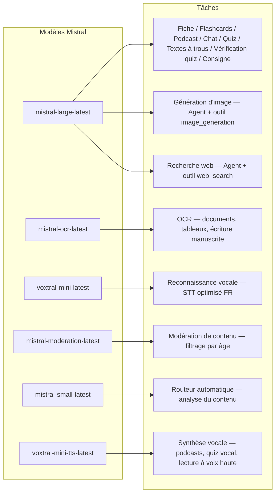
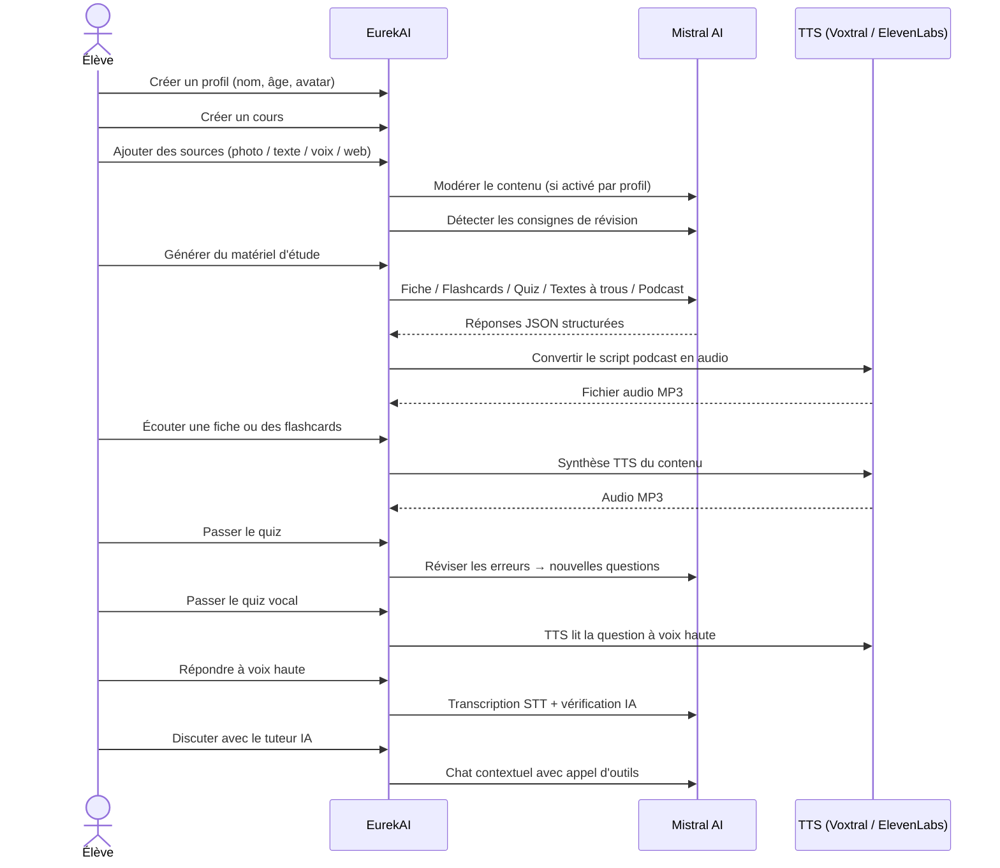

<p align="center">
  
</p>

<h1 align="center">EurekAI</h1>

<p align="center">
  <strong>あらゆるコンテンツをインタラクティブな学習体験に変換 — <a href="https://mistral.ai">Mistral AI</a> によって駆動。</strong>
</p>

<p align="center">
  <a href="README-en.md">🇬🇧 English</a> · <a href="README-es.md">🇪🇸 Español</a> · <a href="README-pt.md">🇧🇷 Português</a> · <a href="README-de.md">🇩🇪 Deutsch</a> · <a href="README-it.md">🇮🇹 Italiano</a> · <a href="README-nl.md">🇳🇱 Nederlands</a> · <a href="README-ar.md">🇸🇦 العربية</a><br>
  <a href="README-hi.md">🇮🇳 हिन्दी</a> · <a href="README-zh.md">🇨🇳 中文</a> · <a href="README-ja.md">🇯🇵 日本語</a> · <a href="README-ko.md">🇰🇷 한국어</a> · <a href="README-pl.md">🇵🇱 Polski</a> · <a href="README-ro.md">🇷🇴 Română</a> · <a href="README-sv.md">🇸🇪 Svenska</a>
</p>

<p align="center">
  <a href="https://www.youtube.com/watch?v=_b1TQz2leoI"></a>
</p>

<h4 align="center">📊 コード品質</h4>

<p align="center">
  <a href="https://sonarcloud.io/summary/new_code?id=jls42_EurekAI"></a>
  <a href="https://sonarcloud.io/summary/new_code?id=jls42_EurekAI"></a>
  <a href="https://sonarcloud.io/summary/new_code?id=jls42_EurekAI"></a>
  <a href="https://sonarcloud.io/summary/new_code?id=jls42_EurekAI"></a>
</p>
<p align="center">
  <a href="https://sonarcloud.io/summary/new_code?id=jls42_EurekAI"></a>
  <a href="https://sonarcloud.io/summary/new_code?id=jls42_EurekAI"></a>
  <a href="https://sonarcloud.io/summary/new_code?id=jls42_EurekAI"></a>
  <a href="https://sonarcloud.io/summary/new_code?id=jls42_EurekAI"></a>
</p>

---

## 背景 — なぜ EurekAI か？

**EurekAI** は [Mistral AI Worldwide ハッカソン](https://luma.com/mistralhack-online) ([公式サイト](https://worldwide-hackathon.mistral.ai/))（2026年3月）で生まれました。取り組むテーマが必要で、きっかけはとても具体的なものです：私は定期的に娘のテスト準備を手伝っており、AIを使えばもっと楽しくインタラクティブにできるはずだと考えました。

目的：写真（教科書のページ）、コピー＆ペーストしたテキスト、音声録音、ウェブ検索など、**任意の入力**を受け取り、それを**復習ノート、フラッシュカード、クイズ、ポッドキャスト、穴埋め問題、図解、その他**に変換すること。すべて Mistral AI のフランス製モデルで動くため、フランス語圏の生徒に自然に適したソリューションになっています。

プロジェクトはハッカソン中に開始され、その後も改良を続けています。コードの大部分は AI によって生成されており、主に [Claude Code](https://docs.anthropic.com/en/docs/claude-code) を利用し、[Codex](https://openai.com/index/introducing-codex/) による一部の貢献もあります。

---

## 機能

| | 機能 | 説明 |
|---|---|---|
| 📷 | **Upload OCR** | 教科書やノートを写真に撮ると、Mistral OCR が内容を抽出します |
| 📝 | **テキスト入力** | 任意のテキストを直接入力または貼り付け |
| 🎤 | **音声入力** | 録音すると Voxtral STT が音声を文字に起こします |
| 🌐 | **ウェブ検索** | 質問を入力すると、Mistral エージェントがウェブで回答を検索します |
| 📄 | **復習ノート** | 重要ポイント、語彙、引用、逸話を含む構造化ノート |
| 🃏 | **フラッシュカード** | 参照元付きのQ/Aカードを5〜50枚生成し、能動的記憶を支援 |
| ❓ | **多肢選択クイズ** | 5〜50問の選択式問題、誤答に応じた適応復習付き |
| ✏️ | **穴埋め問題** | ヒントとゆるい検証付きの穴埋め練習 |
| 🎙️ | **ポッドキャスト** | 2声のミニポッドキャストを Mistral Voxtral TTS で音声化 |
| 🖼️ | **図解** | Mistral エージェントが生成する教育用イメージ |
| 🗣️ | **音声クイズ** | 問題を音声で読み上げ、口答で回答、AIが判定 |
| 💬 | **AIチューター** | コース資料に基づくコンテキストチャット、ツール呼び出し可 |
| 🧠 | **自動ルーティング** | `mistral-small-latest` に基づくルーターが内容を分析し、7種類のジェネレーターから組み合わせを提案 |
| 🔒 | **ペアレンタルコントロール** | 年齢によるモデレーション、親用PIN、チャット制限 |
| 🌍 | **多言語対応** | インターフェイスは9言語対応；AI生成はプロンプトで15言語操作可 |
| 🔊 | **音声読み上げ** | Mistral Voxtral TTS または ElevenLabs でノートやフラッシュカードを読み上げ |

---

## アーキテクチャの概観


---

## モデルの利用マップ



---

## ユーザーフロー



---

## 詳細 — 機能

### マルチモーダル入力

EurekAI は4種類のソースを受け付け、プロファイルに応じてモデレーション（子供とティーンではデフォルトで有効）されます：

- **Upload OCR** — JPG、PNG、またはPDFファイルを `mistral-ocr-latest` で処理。印刷テキスト、表、手書き文字を扱います。
- **自由テキスト** — 任意のコンテンツを入力または貼り付け。保存前にモデレーションが有効なら検査されます。
- **音声入力** — ブラウザで音声を録音。`voxtral-mini-latest` で文字起こし。`language="fr"` の設定で認識を最適化。
- **ウェブ検索** — クエリを入力。`web_search` ツールを持つ一時的な Mistral エージェントが結果を取得して要約します。

### AIコンテンツ生成

7種類の学習教材を生成：

| 生成タイプ | モデル | 出力 |
|---|---|---|
| **復習ノート** | `mistral-large-latest` | タイトル、要約、10〜25の要点、語彙、引用、逸話 |
| **フラッシュカード** | `mistral-large-latest` | 参照元付きのQ/Aカードを5〜50枚で生成 |
| **多肢選択クイズ** | `mistral-large-latest` | 各4択の5〜50問、解説、適応的な復習 |
| **穴埋め問題** | `mistral-large-latest` | ヒント付きの穴埋め文、Levenshteinによる寛容な検証 |
| **ポッドキャスト** | `mistral-large-latest` + Voxtral TTS | 2声のスクリプト → MP3音声 |
| **図解** | Agent `mistral-large-latest` | `image_generation` ツールを使った教育用イメージ |
| **音声クイズ** | `mistral-large-latest` + Voxtral TTS + STT | TTSで問題読み上げ → STTで回答取得 → AIで検証 |

### チャットによるAIチューター

コース資料に完全アクセスできる対話型チューター：

- `mistral-large-latest` を使用
- **ツール呼び出し**：会話中に復習ノート、フラッシュカード、クイズ、穴埋め問題を生成可能
- コースごとに50メッセージの履歴
- プロファイルでモデレーションが有効なら内容を検査

### 自動ルーター

ルーターは `mistral-small-latest` を使い、ソースの内容を分析して7種類のジェネレーターの中から最適なものを提案します。UIはリアルタイムの進行状況を表示：まず分析フェーズ、その後個別生成（キャンセル可能）。

### 適応学習

- **クイズ統計**：問題ごとの試行回数と正答率を追跡
- **クイズ復習**：弱点概念を狙った5〜10問を生成
- **指示検出**：復習指示（「私は〜ができればこの授業は理解している」等）を検出し、対応可能な生成器（ノート、フラッシュカード、クイズ、穴埋め）で優先処理

### セキュリティとペアレンタルコントロール

- **4つの年齢グループ**：子供（≤10歳）、ティーン（11-15）、学生（16-25）、大人（26+）
- **コンテンツモデレーション**：`mistral-moderation-latest` によるモデレーションで、子供/ティーンには5カテゴリ（sexual, hate, violence, selfharm, jailbreaking）をブロック。学生/大人には制限なし
- **親用PIN**：SHA-256ハッシュ（15歳未満のプロファイルで必須）。本番導入ではソルト付き遅延ハッシュ（Argon2id、bcrypt）を推奨
- **チャット制限**：16歳未満はデフォルトでAIチャット無効、親が有効化可能

### マルチプロファイルシステム

- 名前、年齢、アバター、言語設定を持つ複数プロファイル
- `profileId` を介してプロファイルに紐づくプロジェクト
- カスケード削除：プロファイル削除で関連プロジェクトも削除

### 複数プロバイダのTTS

- **Mistral Voxtral TTS**（デフォルト）：`voxtral-mini-tts-latest`、追加キー不要
- **ElevenLabs**（代替）：`eleven_v3`、自然な音声、`ELEVENLABS_API_KEY` が必要
- プロバイダはアプリ設定で切替可能

### 国際化

- インターフェイスは9言語対応：fr、en、es、pt、it、nl、de、hi、ar
- AIプロンプトは15言語対応（fr、en、es、de、it、pt、nl、ja、zh、ko、ar、hi、pl、ro、sv）
- プロファイルごとに言語設定可

---

## 技術スタック

| 層 | 技術 | 役割 |
|---|---|---|
| **ランタイム** | Node.js + TypeScript 5.x | サーバーおよび型安全 |
| **バックエンド** | Express 4.x | REST API |
| **開発サーバー** | Vite 7.x + tsx | HMR、Handlebars partials、プロキシ |
| **フロントエンド** | HTML + TailwindCSS 4.x + Alpine.js 3.x | リアクティブUI、TypeScriptはViteでコンパイル |
| **テンプレート** | vite-plugin-handlebars | partialsによるHTML構成 |
| **AI** | Mistral AI SDK 2.x | チャット、OCR、STT、TTS、エージェント、モデレーション |
| **TTS（デフォルト）** | Mistral Voxtral TTS | `voxtral-mini-tts-latest`、組み込み音声合成 |
| **TTS（代替）** | ElevenLabs SDK 2.x | `eleven_v3`、自然な音声 |
| **アイコン** | Lucide | SVGアイコンライブラリ |
| **Markdown** | Marked | チャット内のMarkdownレンダリング |
| **ファイルアップロード** | Multer 1.4 LTS | マルチパートフォームの処理 |
| **オーディオ** | ffmpeg-static | 音声セグメントの連結 |
| **テスト** | Vitest | ユニットテスト — カバレッジは SonarCloud で測定 |
| **永続化** | JSONファイル | 依存のないストレージ |

---

## モデルリファレンス

| モデル | 利用 | 理由 |
|---|---|---|
| `mistral-large-latest` | ノート、フラッシュカード、ポッドキャスト、クイズ、穴埋め、チャット、音声クイズの検証、画像エージェント、ウェブ検索エージェント、指示検出 | 多言語対応かつ指示フォローが最良 |
| `mistral-ocr-latest` | ドキュメントOCR | 印刷テキスト、表、手書き文字の処理 |
| `voxtral-mini-latest` | 音声認識（STT） | 多言語STT、`language="fr"` で最適化 |
| `voxtral-mini-tts-latest` | 音声合成（TTS） | ポッドキャスト、音声クイズ、読み上げ |
| `mistral-moderation-latest` | コンテンツモデレーション | 子供/ティーン向けに5カテゴリをブロック（+ jailbreaking） |
| `mistral-small-latest` | 自動ルーター | ルーティング決定のための高速解析 |
| `eleven_v3` (ElevenLabs) | 音声合成（代替TTS） | 自然な音声、設定可能な代替手段 |

---

## クイックスタート

```bash
# Cloner le dépôt
git clone https://github.com/jls42/EurekAI.git
cd EurekAI

# Installer les dépendances
npm install

# Configurer les clés API
cp .env.example .env
# Éditez .env avec vos clés :
#   MISTRAL_API_KEY=votre_clé_ici           (requis)
#   ELEVENLABS_API_KEY=votre_clé_ici        (optionnel, TTS alternatif)
#   SONAR_TOKEN=...                          (optionnel, CI SonarCloud uniquement)

# Lancer le développement
npm run dev
# → Backend :  http://localhost:3000 (API)
# → Frontend : http://localhost:5173 (serveur Vite avec HMR)
```

> **注意**：Mistral Voxtral TTS がデフォルトのプロバイダです — `MISTRAL_API_KEY` 以外に追加のキーは不要です。ElevenLabs は設定で選べる代替TTSプロバイダです。

---

## プロジェクト構成

```
server.ts                 — Point d'entrée Express, monte les routes + config
config.ts                 — Config runtime (modèles, voix, TTS provider), persistée dans output/config.json
store.ts                  — ProjectStore : CRUD projets/sources/générations, persistance JSON
profiles.ts               — ProfileStore : gestion des profils, hachage PIN
types.ts                  — Types TypeScript : Source, Generation (7 types), QuizStats, Profile
prompts.ts                — Tous les prompts IA centralisés (system + user templates, 15 langues)

generators/
  ocr.ts                  — Upload + OCR via Mistral (JPG, PNG, PDF)
  summary.ts              — Génération de fiche de révision (JSON structuré)
  flashcards.ts           — Flashcards Q/R (5-50, configurable)
  quiz.ts                 — Quiz QCM (5-50 questions, configurable) + révision adaptative
  fill-blank.ts           — Exercices à trous avec validation tolérante
  podcast.ts              — Script podcast 2 voix
  quiz-vocal.ts           — Quiz vocal : questions TTS + réponses STT + vérification IA
  image.ts                — Génération d'image via Agent Mistral (outil image_generation)
  chat.ts                 — Tuteur IA par chat avec appel d'outils
  router.ts               — Routeur automatique (contenu → générateurs recommandés)
  consigne.ts             — Détection de consignes de révision
  tts-provider.ts         — Dispatch TTS multi-provider (Mistral Voxtral / ElevenLabs)
  tts.ts                  — Génération audio podcast (concaténation de segments)
  stt.ts                  — Voxtral STT (audio → texte)
  websearch.ts            — Agent Mistral avec outil web_search
  moderation.ts           — Modération de contenu (filtrage par âge)

routes/
  projects.ts             — CRUD projets
  profiles.ts             — CRUD profils avec gestion du PIN
  sources.ts              — Upload OCR, texte libre, voix STT, recherche web, modération
  generate.ts             — Endpoints de génération (7 types + auto + route)
  generations.ts          — Tentatives de quiz/fill-blank, réponses vocales, lecture à voix haute
  chat.ts                 — Chat IA avec appel d'outils

helpers/
  index.ts                — safeParseJson, unwrapJsonArray, extractAllText, timer
  audio.ts                — collectStream (ReadableStream → Buffer)
  fill-blank-validate.ts  — Validation tolérante des réponses (normalisation, Levenshtein)

src/                      — Frontend (Vite + Handlebars)
  index.html              — Point d'entrée HTML principal
  main.ts                 — Entrée frontend (init Alpine.js + icônes Lucide)
  app/                    — Modules applicatifs Alpine.js
    state.ts              — Gestion d'état réactif
    navigation.ts         — Routage des vues + gardes par âge
    profiles.ts           — Logique du sélecteur de profils
    projects.ts           — CRUD des cours
    sources.ts            — Gestionnaires d'upload de sources
    generate.ts           — Déclencheurs de génération (individuel, tout, auto 2 phases)
    generations.ts        — Affichage + actions sur les générations
    chat.ts               — Interface de chat
    config.ts             — Interface de configuration (modèles, voix, TTS provider)
    render.ts             — Helpers de rendu HTML
    i18n.ts               — Changement de langue
    ...
  components/
    quiz.ts               — Composant quiz interactif
    quiz-vocal.ts         — Composant quiz vocal
    fill-blank.ts         — Composant textes à trous
    flashcards.ts         — Composant flashcards avec retournement
    step-by-step.ts       — Mixin navigation pas-à-pas (quiz, fill-blank, flashcards)
  i18n/
    fr.ts, en.ts, es.ts, — Dictionnaires par langue (9 langues)
    pt.ts, it.ts, nl.ts,
    de.ts, hi.ts, ar.ts
    languages.ts          — Registre des langues UI disponibles
    index.ts              — Chargeur i18n
  partials/               — Partials HTML Handlebars (header, sidebar, dialogues, vues)
  styles/
    main.css              — Entrée TailwindCSS
    theme.css             — Variables de thème personnalisées

public/assets/            — Ressources statiques (logo, avatars)
output/                   — Données d'exécution (projets, config, fichiers audio)
```

---

## APIリファレンス

### 設定
| メソッド | エンドポイント | 説明 |
|---|---|---|
| `GET` | `/api/config` | 現在の設定を取得 |
| `PUT` | `/api/config` | 設定を変更（モデル、音声、TTSプロバイダ等） |
| `GET` | `/api/config/status` | API（Mistral, ElevenLabs, TTS）のステータス |
| `POST` | `/api/config/reset` | デフォルト設定にリセット |
| `GET` | `/api/config/voices` | Mistral TTS の音声一覧を取得（オプション `?lang=fr`） |

### プロファイル
| メソッド | エンドポイント | 説明 |
|---|---|---|
| `GET` | `/api/profiles` | すべてのプロファイルを一覧 |
| `POST` | `/api/profiles` | プロファイルを作成 |
| `PUT` | `/api/profiles/:id` | プロファイルを編集（< 15歳はPIN必須） |
| `DELETE` | `/api/profiles/:id` | プロファイルと関連プロジェクトを削除（`{pin?}` → `{ok, deletedProjects}`） |

### プロジェクト
| メソッド | エンドポイント | 説明 |
|---|---|---|
| `GET` | `/api/projects` | プロジェクト一覧（`?profileId=` はオプション） |
| `POST` | `/api/projects` | プロジェクトを作成 `{name, profileId}` |
| `GET` | `/api/projects/:pid` | プロジェクトの詳細 |
| `PUT` | `/api/projects/:pid` | 名前変更 `{name}` |
| `DELETE` | `/api/projects/:pid` | プロジェクトを削除 |

### ソース
| メソッド | エンドポイント | 説明 |
|---|---|---|
| `POST` | `/api/projects/:pid/sources/upload` | Upload OCR（multipartファイル） |
| `POST` | `/api/projects/:pid/sources/text` | 自由テキスト `{text}` |
| `POST` | `/api/projects/:pid/sources/voice` | 音声 STT（audio multipart） |
| `POST` | `/api/projects/:pid/sources/websearch` | ウェブ検索 `{query}` |
| `DELETE` | `/api/projects/:pid/sources/:sid` | ソースを削除 |
| `POST` | `/api/projects/:pid/moderate` | モデレーション `{text}` |
| `POST` | `/api/projects/:pid/detect-consigne` | 復習指示の検出 |

### 生成
| メソッド | エンドポイント | 説明 |
|---|---|---|
| `POST` | `/api/projects/:pid/generate/summary` | 復習ノート |
| `POST` | `/api/projects/:pid/generate/flashcards` | フラッシュカード |
| `POST` | `/api/projects/:pid/generate/quiz` | 多肢選択クイズ |
| `POST` | `/api/projects/:pid/generate/fill-blank` | 穴埋め問題 |
| `POST` | `/api/projects/:pid/generate/podcast` | ポッドキャスト |
| `POST` | `/api/projects/:pid/generate/image` | 図解 |
| `POST` | `/api/projects/:pid/generate/quiz-vocal` | 音声クイズ |
| `POST` | `/api/projects/:pid/generate/quiz-review` | 適応復習 `{generationId, weakQuestions}` |
| `POST` | `/api/projects/:pid/generate/route` | ルーティング分析（実行すべきジェネレーター計画） |
| `POST` | `/api/projects/:pid/generate/auto` | 自動バックエンド生成（ルーティング + 5タイプ：summary, flashcards, quiz, fill-blank, podcast） |

すべての生成ルートは `{sourceIds?, lang?, ageGroup?, count?, useConsigne?}` を受け付けます。`quiz-review` は追加で `{generationId, weakQuestions}` を要求します。

### CRUD 生成
| メソッド | エンドポイント | 説明 |
|---|---|---|
| `POST` | `/api/projects/:pid/generations/:gid/quiz-attempt` | クイズの回答を送信 `{answers}` |
| `POST` | `/api/projects/:pid/generations/:gid/fill-blank-attempt` | 穴埋め問題の回答を送信 `{answers}` |
| `POST` | `/api/projects/:pid/generations/:gid/vocal-answer` | 口答の検証（audio + questionIndex） |
| `POST` | `/api/projects/:pid/generations/:gid/read-aloud` | TTSでの読み上げ（ノート/フラッシュカード） |
| `PUT` | `/api/projects/:pid/generations/:gid` | 名前変更 `{title}` |
| `DELETE` | `/api/projects/:pid/generations/:gid` | 生成を削除 |

### チャット
| メソッド | エンドポイント | 説明 |
|---|---|---|
| `GET` | `/api/projects/:pid/chat` | チャット履歴を取得 |
| `POST` | `/api/projects/:pid/chat` | メッセージを送信 `{message, lang, ageGroup}` |
| `DELETE` | `/api/projects/:pid/chat` | チャット履歴を消去 |

---

## アーキテクチャ上の決定

| 決定 | 正当化 |
|---|---|
| **Alpine.js を採用（React/Vueではない）** | 最小限のフットプリント、TypeScriptでコンパイルされる軽量なリアクティビティ。ハッカソンでスピードを重視するには最適。 |
| **JSONファイルでの永続化** | 依存ゼロ、即スタート。データベースの設定不要で気軽に起動できる。 |
| **Vite + Handlebars** | 両方の良いところ：開発向けの高速HMR、コード整理のためのHTMLパーシャル、Tailwind JIT。 |
| **Prompts centralisés** | すべてのAIプロンプトは `prompts.ts` に — 言語や年齢層ごとに反復、テスト、調整しやすい。 |
| **Système multi-générations** | 各生成は固有のIDを持つ独立したオブジェクトです — コースごとに複数のシート、クイズ等を可能にします。 |
| **Prompts adaptés par âge** | 語彙、複雑さ、語調が異なる4つの年齢グループ — 同じコンテンツでも学習者によって教え方が変わります。 |
| **Fonctionnalités basées sur les Agents** | 画像生成とウェブ検索は一時的なMistralエージェントを使用します — ライフサイクルが管理され、自動クリーンアップされます。 |
| **TTS multi-provider** | デフォルトは Mistral Voxtral TTS（追加のキー不要）、代替に ElevenLabs — 再起動不要で設定可能。 |

---

## クレジット & 謝辞

- **[Mistral AI](https://mistral.ai)** — AIモデル（Large、OCR、Voxtral STT、Voxtral TTS、Moderation、Small）＋ワールドワイドハッカソン
- **[ElevenLabs](https://elevenlabs.io)** — 代替の音声合成エンジン（`eleven_v3`）
- **[Alpine.js](https://alpinejs.dev)** — 軽量リアクティブフレームワーク
- **[TailwindCSS](https://tailwindcss.com)** — ユーティリティCSSフレームワーク
- **[Vite](https://vitejs.dev)** — フロントエンドビルドツール
- **[Lucide](https://lucide.dev)** — アイコンライブラリ
- **[Marked](https://marked.js.org)** — Markdownパーサー

2026年3月に開催された Mistral AI Worldwide Hackathon 中に開始され、Claude Code と Codex によってAIのみで完全に開発されました。

---

## 著者

**Julien LS** — [contact@jls42.org](mailto:contact@jls42.org)

## ライセンス

[AGPL-3.0](LICENSE) — Copyright (C) 2026 Julien LS

**このドキュメントは gpt-5-mini モデルを使用して fr バージョンから ja 言語へ翻訳されました。翻訳プロセスの詳細については、https://gitlab.com/jls42/ai-powered-markdown-translator をご覧ください。**

