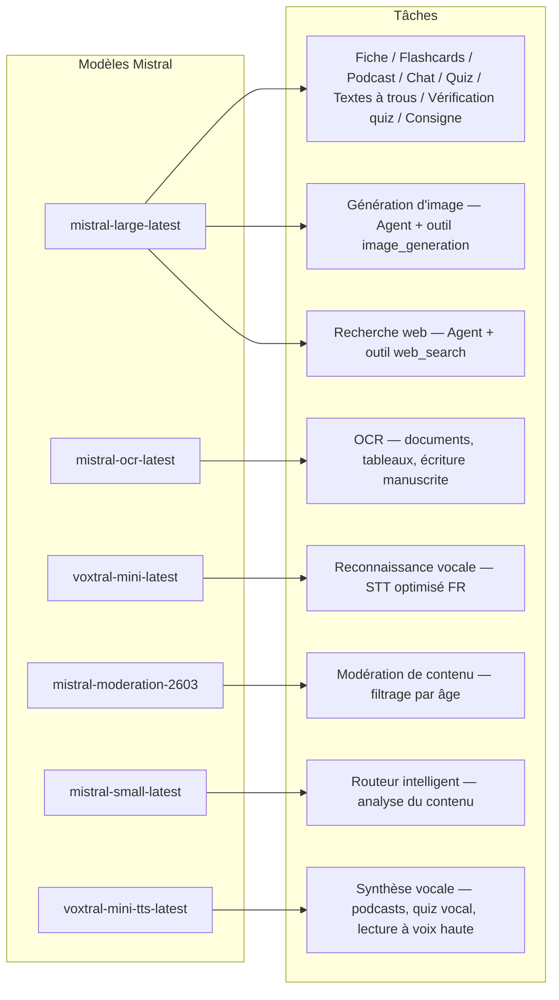
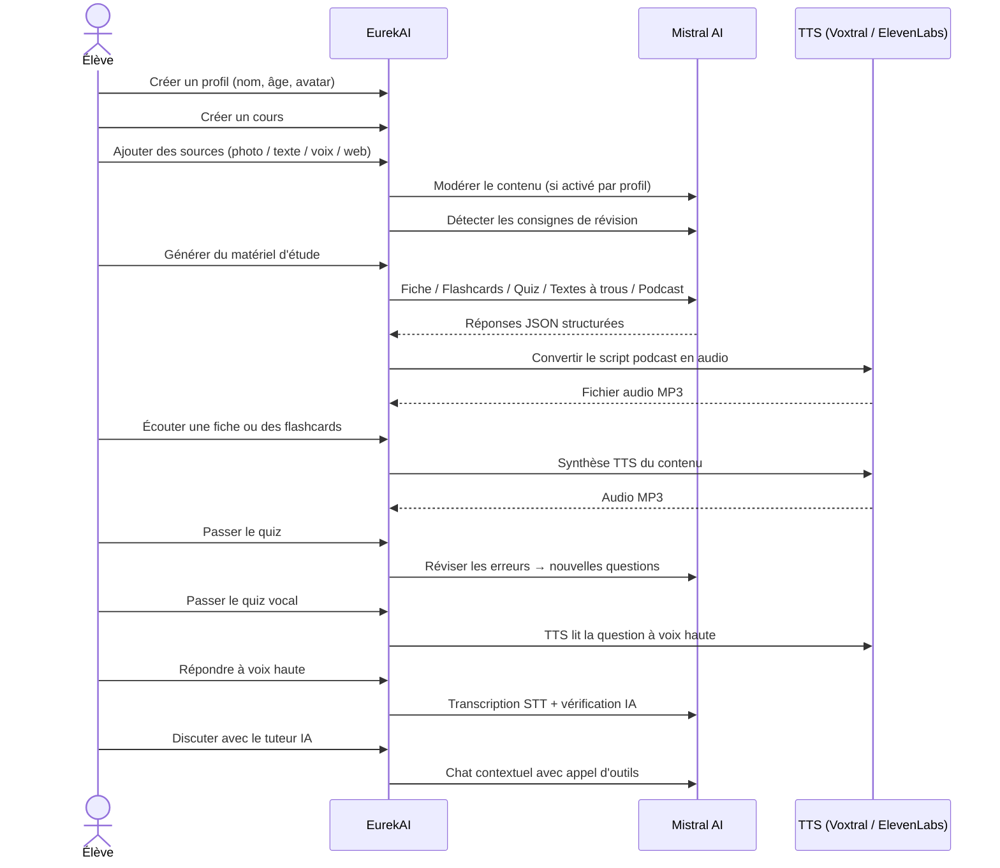

<p align="center">
  
</p>

<h1 align="center">EurekAI</h1>

<p align="center">
  <strong>あらゆるコンテンツをインタラクティブな学習体験に変換 — <a href="https://mistral.ai">Mistral AI</a> 搭載。</strong>
</p>

<p align="center">
  <a href="README-en.md">🇬🇧 English</a> · <a href="README-es.md">🇪🇸 Español</a> · <a href="README-pt.md">🇧🇷 Português</a> · <a href="README-de.md">🇩🇪 Deutsch</a> · <a href="README-it.md">🇮🇹 Italiano</a> · <a href="README-nl.md">🇳🇱 Nederlands</a> · <a href="README-ar.md">🇸🇦 العربية</a><br>
  <a href="README-hi.md">🇮🇳 हिन्दी</a> · <a href="README-zh.md">🇨🇳 中文</a> · <a href="README-ja.md">🇯🇵 日本語</a> · <a href="README-ko.md">🇰🇷 한국어</a> · <a href="README-pl.md">🇵🇱 Polski</a> · <a href="README-ro.md">🇷🇴 Română</a> · <a href="README-sv.md">🇸🇪 Svenska</a>
</p>

<p align="center">
  <a href="https://www.youtube.com/watch?v=_b1TQz2leoI"></a>
</p>

<h4 align="center">📊 コード品質</h4>

<p align="center">
  <a href="https://sonarcloud.io/summary/new_code?id=jls42_EurekAI"></a>
  <a href="https://sonarcloud.io/summary/new_code?id=jls42_EurekAI"></a>
  <a href="https://sonarcloud.io/summary/new_code?id=jls42_EurekAI"></a>
  <a href="https://sonarcloud.io/summary/new_code?id=jls42_EurekAI"></a>
</p>
<p align="center">
  <a href="https://sonarcloud.io/summary/new_code?id=jls42_EurekAI"></a>
  <a href="https://sonarcloud.io/summary/new_code?id=jls42_EurekAI"></a>
  <a href="https://sonarcloud.io/summary/new_code?id=jls42_EurekAI"></a>
  <a href="https://sonarcloud.io/summary/new_code?id=jls42_EurekAI"></a>
</p>

---

## 背景 — なぜ EurekAI？

**EurekAI** は [Mistral AI Worldwide Hackathon](https://luma.com/mistralhack-online)（[公式サイト](https://worldwide-hackathon.mistral.ai/)）中に生まれました（2026年3月）。テーマが必要で、きっかけはごく個人的なものです：私は娘のテスト対策をよく手伝うのですが、これをもっと楽しくインタラクティブにできないかと考え、AIで実現できるのではないかと思いつきました。

目的は、写真、コピー＆ペーストしたテキスト、音声録音、ウェブ検索など「どんな入力でも」受け取り、これを「復習ノート、フラッシュカード、クイズ、ポッドキャスト、穴埋め問題、イラストなど」に変換することです。Mistral AI のフランス語モデルを活用しているため、フランス語圏の生徒に自然に適したソリューションになっています。

すべてのコード行はハッカソン中に書かれました。使用しているすべての API とライブラリはハッカソンのルールに従ったオープンソースのものです。

---

## 機能

| | 機能 | 説明 |
|---|---|---|
| 📷 | **OCRアップロード** | 教科書やノートを撮影 — Mistral OCR が内容を抽出 |
| 📝 | **テキスト入力** | 任意のテキストを入力または貼り付け |
| 🎤 | **音声入力** | 録音 — Voxtral STT が音声を文字起こし |
| 🌐 | **ウェブ検索** | 質問を入力 — 一時的な Mistral エージェントがウェブで回答を検索 |
| 📄 | **復習ノート** | 重要ポイント、語彙、引用、豆知識を含む構造化ノート |
| 🃏 | **フラッシュカード** | 参照付きの Q/A カードを5〜50枚生成（能動学習向け） |
| ❓ | **選択式クイズ** | 5〜50問の四択問題、誤答に基づく適応的な復習 |
| ✏️ | **穴埋め問題** | ヒント付きの穴埋め練習、寛容な検証 |
| 🎙️ | **ポッドキャスト** | 2音声のミニポッドキャストを Mistral Voxtral TTS で音声化 |
| 🖼️ | **イラスト** | 教育用画像を Mistral エージェントが生成 |
| 🗣️ | **音声クイズ** | 問題を読み上げ、口頭で回答、AIが検証 |
| 💬 | **AIチューター** | 教材に基づくコンテキストチャット、ツール呼び出し対応 |
| 🧠 | **スマートルーター** | AIがコンテンツを解析し、7つの生成器の中から最適なものを推薦 |
| 🔒 | **ペアレンタルコントロール** | 年齢別モデレーション、親のPIN、チャット制限 |
| 🌍 | **多言語対応** | インターフェイスとAIコンテンツ（フランス語・英語） |
| 🔊 | **音声読み上げ** | Mistral Voxtral TTS または ElevenLabs でノートやフラッシュカードを再生 |

---

## アーキテクチャ概要


---

## モデル利用マップ



---

## ユーザーフロー



---

## 詳細 — 機能説明

### マルチモーダル入力

EurekAI は4種類のソースを受け付け、プロファイルに応じてモデレーションされます（子供／ティーンでデフォルト有効）：

- **OCRアップロード** — JPG、PNG、PDF を `mistral-ocr-latest` で処理。印刷文字、表、手書きに対応。
- **自由テキスト** — 任意のコンテンツを入力または貼り付け。保存前にモデレーションが有効であれば検閲されます。
- **音声入力** — ブラウザで音声を録音。`voxtral-mini-latest` が文字起こし。`language="fr"` パラメータで認識を最適化。
- **ウェブ検索** — クエリを入力。一時的な Mistral エージェントが `web_search` ツールで結果を取得して要約。

### AI コンテンツ生成

7種類の学習教材を生成：

| 生成器 | モデル | 出力 |
|---|---|---|
| **復習ノート** | `mistral-large-latest` | タイトル、要約、10〜25の重要ポイント、語彙、引用、豆知識 |
| **フラッシュカード** | `mistral-large-latest` | 参照付き Q/A カードを5〜50枚（能動学習） |
| **選択式クイズ** | `mistral-large-latest` | 5〜50問、各4選択、解説、適応的復習 |
| **穴埋め問題** | `mistral-large-latest` | ヒント付きの穴埋め文、レーベンシュタインによる寛容な検証 |
| **ポッドキャスト** | `mistral-large-latest` + Voxtral TTS | 2音声のスクリプト → MP3 音声 |
| **イラスト** | エージェント `mistral-large-latest` | ツール `image_generation` による教育用画像 |
| **音声クイズ** | `mistral-large-latest` + Voxtral TTS + STT | TTSで出題 → STTで回答 → AIによる検証 |

### チャットベースのAIチューター

教材ドキュメントへフルアクセスできる会話型チューター：

- `mistral-large-latest` を使用
- **ツール呼び出し**：会話中にノート、フラッシュカード、クイズ、穴埋め問題を生成可能
- コースごとに50メッセージの履歴保持
- プロファイルでモデレーションが有効ならチャット内容は検閲されます

### 自動スマートルーター

ルーターは `mistral-small-latest` を使い、ソースの内容を解析して7つの生成器のうち最も適切なものを推薦します — 生徒が手動で選ぶ必要がないように。UI はリアルタイム進行を表示：まず解析フェーズ、続いて個別生成（キャンセル可能）。

### 適応学習

- **クイズ統計**：問題ごとの試行回数と正答率を追跡
- **クイズ復習**：弱点概念に狙いを定めた5〜10問を生成
- **指示検出**：復習指示（例：「この単元が分かるなら…」）を検出し、全生成器で優先処理

### セキュリティ & ペアレンタルコントロール

- **4つの年齢グループ**：子供（≤10歳）、ティーン（11–15）、学生（16–25）、大人（26+）
- **コンテンツモデレーション**：`mistral-moderation-2603` を使用し、子供/ティーンには5カテゴリをブロック（sexual, hate, violence, selfharm, jailbreaking）、学生/大人には制限なし
- **親用PIN**：SHA-256 ハッシュ、15歳未満のプロファイルで必要
- **チャット制限**：16歳未満はデフォルトでチャットAI無効、親が有効化可能

### マルチプロファイルシステム

- 名前、年齢、アバター、言語設定を持つ複数プロファイル対応
- プロファイルに紐づくプロジェクトは `profileId`
- カスケード削除：プロファイル削除で関連プロジェクトも削除

### マルチプロバイダTTS

- **Mistral Voxtral TTS**（デフォルト）：`voxtral-mini-tts-latest`、追加キー不要
- **ElevenLabs**（代替）：`eleven_v3`、自然な音声、`ELEVENLABS_API_KEY` が必要
- プロバイダはアプリ設定で切替可能

### 国際化

- インターフェイスはフランス語と英語で完全対応
- AIプロンプトは現在2言語（FR, EN）に対応、将来的に15言語（es, de, it, pt, nl, ja, zh, ko, ar, hi, pl, ro, sv）を想定した設計
- 言語はプロファイル単位で設定可能

---

## 技術スタック

| 層 | 技術 | 役割 |
|---|---|---|
| **ランタイム** | Node.js + TypeScript 5.7 | サーバーと型安全 |
| **バックエンド** | Express 4.21 | REST API |
| **開発サーバー** | Vite 7.3 + tsx | HMR、Handlebars partials、プロキシ |
| **フロントエンド** | HTML + TailwindCSS 4.2 + Alpine.js 3.15 | リアクティブUI、TypeScript を Vite でコンパイル |
| **テンプレーティング** | vite-plugin-handlebars | partials による HTML 構成 |
| **AI** | Mistral AI SDK 2.1 | チャット、OCR、STT、TTS、Agents、モデレーション |
| **TTS（デフォルト）** | Mistral Voxtral TTS | `voxtral-mini-tts-latest`、統合音声合成 |
| **TTS（代替）** | ElevenLabs SDK 2.36 | `eleven_v3`、自然音声 |
| **アイコン** | Lucide 0.575 | SVG アイコンライブラリ |
| **Markdown** | Marked 17 | チャット内の Markdown レンダリング |
| **ファイルアップロード** | Multer 1.4 | multipart フォーム処理 |
| **オーディオ** | ffmpeg-static | 音声セグメントの結合 |
| **テスト** | Vitest 4 | ユニットテスト — カバレッジは SonarCloud に計測 |
| **永続化** | JSON ファイル | 外部依存なしのストレージ |

---

## モデル参照

| モデル | 利用箇所 | 理由 |
|---|---|---|
| `mistral-large-latest` | ノート、フラッシュカード、ポッドキャスト、クイズ、穴埋め、チャット、音声クイズ検証、画像エージェント、ウェブサーチエージェント、指示検出 | 多言語対応 + 指示追従が最適 |
| `mistral-ocr-latest` | ドキュメントOCR | 印刷文字、表、手書き対応 |
| `voxtral-mini-latest` | 音声認識（STT） | 多言語STT、`language="fr"` で最適化 |
| `voxtral-mini-tts-latest` | 音声合成（TTS） | ポッドキャスト、音声クイズ、読み上げ |
| `mistral-moderation-2603` | コンテンツモデレーション | 子供/ティーン向けに5カテゴリをブロック |
| `mistral-small-latest` | スマートルーター | ルーティングのための高速解析 |
| `eleven_v3` (ElevenLabs) | 音声合成（TTS代替） | 自然な声、設定可能な代替手段 |

---

## クイックスタート

```bash
# Cloner le dépôt
git clone https://github.com/jls42/EurekAI.git
cd EurekAI

# Installer les dépendances
npm install

# Configurer les clés API
cp .env.example .env
# Éditez .env avec vos clés :
#   MISTRAL_API_KEY=votre_clé_ici           (requis)
#   ELEVENLABS_API_KEY=votre_clé_ici        (optionnel, TTS alternatif)

# Lancer le développement
npm run dev
# → Backend :  http://localhost:3000 (API)
# → Frontend : http://localhost:5173 (serveur Vite avec HMR)
```

> **注**：Mistral Voxtral TTS がデフォルトのプロバイダです — `MISTRAL_API_KEY` 以外の追加キーは不要です。ElevenLabs は設定で選択可能な代替TTSプロバイダです。

---

## プロジェクト構成

```
server.ts                 — Point d'entrée Express, monte les routes + config
config.ts                 — Config runtime (modèles, voix, TTS provider), persistée dans output/config.json
store.ts                  — ProjectStore : CRUD projets/sources/générations, persistance JSON
profiles.ts               — ProfileStore : gestion des profils, hachage PIN
types.ts                  — Types TypeScript : Source, Generation (7 types), QuizStats, Profile
prompts.ts                — Tous les prompts IA centralisés (system + user templates, FR/EN)

generators/
  ocr.ts                  — Upload + OCR via Mistral (JPG, PNG, PDF)
  summary.ts              — Génération de fiche de révision (JSON structuré)
  flashcards.ts           — Flashcards Q/R (5-50, configurable)
  quiz.ts                 — Quiz QCM (5-50 questions, configurable) + révision adaptative
  fill-blank.ts           — Exercices à trous avec validation tolérante
  podcast.ts              — Script podcast 2 voix
  quiz-vocal.ts           — Quiz vocal : questions TTS + réponses STT + vérification IA
  image.ts                — Génération d'image via Agent Mistral (outil image_generation)
  chat.ts                 — Tuteur IA par chat avec appel d'outils
  router.ts               — Routeur automatique intelligent (contenu → générateurs recommandés)
  consigne.ts             — Détection de consignes de révision
  tts-provider.ts         — Dispatch TTS multi-provider (Mistral Voxtral / ElevenLabs)
  tts.ts                  — Génération audio podcast (concaténation de segments)
  stt.ts                  — Voxtral STT (audio → texte)
  websearch.ts            — Agent Mistral avec outil web_search
  moderation.ts           — Modération de contenu (filtrage par âge)

routes/
  projects.ts             — CRUD projets
  profiles.ts             — CRUD profils avec gestion du PIN
  sources.ts              — Upload OCR, texte libre, voix STT, recherche web, modération
  generate.ts             — Endpoints de génération (7 types + auto + route)
  generations.ts          — Tentatives de quiz/fill-blank, réponses vocales, lecture à voix haute
  chat.ts                 — Chat IA avec appel d'outils

helpers/
  index.ts                — safeParseJson, unwrapJsonArray, extractAllText, timer
  audio.ts                — collectStream (ReadableStream → Buffer)
  fill-blank-validate.ts  — Validation tolérante des réponses (normalisation, Levenshtein)

src/                      — Frontend (Vite + Handlebars)
  index.html              — Point d'entrée HTML principal
  main.ts                 — Entrée frontend (init Alpine.js + icônes Lucide)
  app/                    — Modules applicatifs Alpine.js
    state.ts              — Gestion d'état réactif
    navigation.ts         — Routage des vues + gardes par âge
    profiles.ts           — Logique du sélecteur de profils
    projects.ts           — CRUD des cours
    sources.ts            — Gestionnaires d'upload de sources
    generate.ts           — Déclencheurs de génération (individuel, tout, auto 2 phases)
    generations.ts        — Affichage + actions sur les générations
    chat.ts               — Interface de chat
    config.ts             — Interface de configuration (modèles, voix, TTS provider)
    render.ts             — Helpers de rendu HTML
    i18n.ts               — Changement de langue
    ...
  components/
    quiz.ts               — Composant quiz interactif
    quiz-vocal.ts         — Composant quiz vocal
    fill-blank.ts         — Composant textes à trous
    flashcards.ts         — Composant flashcards avec retournement
    step-by-step.ts       — Mixin navigation pas-à-pas (quiz, fill-blank, flashcards)
  i18n/
    fr.ts                 — Traductions françaises
    en.ts                 — Traductions anglaises
    index.ts              — Chargeur i18n
  partials/               — Partials HTML Handlebars (header, sidebar, dialogues, vues)
  styles/
    main.css              — Entrée TailwindCSS
    theme.css             — Variables de thème personnalisées

public/assets/            — Ressources statiques (logo, avatars)
output/                   — Données d'exécution (projets, config, fichiers audio)
```

---

## API リファレンス

### Config
| メソッド | エンドポイント | 説明 |
|---|---|---|
| `GET` | `/api/config` | 現在の設定を取得 |
| `PUT` | `/api/config` | 設定を変更（モデル、音声、TTSプロバイダ） |
| `GET` | `/api/config/status` | API 状態（Mistral、ElevenLabs、TTS） |
| `POST` | `/api/config/reset` | デフォルト設定にリセット |
| `GET` | `/api/config/voices` | Mistral TTS の音声一覧を取得（任意 `?lang=fr`） |

### プロファイル
| メソッド | エンドポイント | 説明 |
|---|---|---|
| `GET` | `/api/profiles` | すべてのプロファイルを一覧 |
| `POST` | `/api/profiles` | プロファイルを作成 |
| `PUT` | `/api/profiles/:id` | プロファイルを編集（<15歳はPIN必須） |
| `DELETE` | `/api/profiles/:id` | プロファイル削除 + プロジェクトのカスケード削除 |

### プロジェクト
| メソッド | エンドポイント | 説明 |
|---|---|---|
| `GET` | `/api/projects` | プロジェクト一覧 |
| `POST` | `/api/projects` | プロジェクトを作成 `{name, profileId}` |
| `GET` | `/api/projects/:pid` | プロジェクトの詳細 |
| `PUT` | `/api/projects/:pid` | 名前変更 `{name}` |
| `DELETE` | `/api/projects/:pid` | プロジェクト削除 |

### ソース
| メソッド | エンドポイント | 説明 |
|---|---|---|
| `POST` | `/api/projects/:pid/sources/upload` | OCRアップロード（multipartファイル） |
| `POST` | `/api/projects/:pid/sources/text` | 自由テキスト登録 `{text}` |
| `POST` | `/api/projects/:pid/sources/voice` | 音声STT（multipartオーディオ） |
| `POST` | `/api/projects/:pid/sources/websearch` | ウェブ検索 `{query}` |
| `DELETE` | `/api/projects/:pid/sources/:sid` | ソース削除 |
| `POST` | `/api/projects/:pid/moderate` | モデレーション `{text}` |
| `POST` | `/api/projects/:pid/detect-consigne` | 復習指示の検出 |

### 生成
| メソッド | エンドポイント | 説明 |
|---|---|---|
| `POST` | `/api/projects/:pid/generate/summary` | 復習ノート生成 |
| `POST` | `/api/projects/:pid/generate/flashcards` | フラッシュカード生成 |
| `POST` | `/api/projects/:pid/generate/quiz` | 選択式クイズ生成 |
| `POST` | `/api/projects/:pid/generate/fill-blank` | 穴埋め問題生成 |
| `POST` | `/api/projects/:pid/generate/podcast` | ポッドキャスト生成 |
| `POST` | `/api/projects/:pid/generate/image` | イラスト生成 |
| `POST` | `/api/projects/:pid/generate/quiz-vocal` | 音声クイズ生成 |
| `POST` | `/api/projects/:pid/generate/quiz-review` | 適応復習生成 `{generationId, weakQuestions}` |
| `POST` | `/api/projects/:pid/generate/route` | ルーティング解析（どの生成器を起動するかの計画） |
| `POST` | `/api/projects/:pid/generate/auto` | バックエンド自動生成（ルーティング + 5種：summary, flashcards, quiz, fill-blank, podcast） |

すべての生成ルートは `{sourceIds?, lang?, ageGroup?, count?, useConsigne?}` を受け付けます。

### 生成 CRUD
| メソッド | エンドポイント | 説明 |
|---|---|---|
| `POST` | `/api/projects/:pid/generations/:gid/quiz-attempt` | クイズの回答を送信 `{answers}` |
| `POST` | `/api/projects/:pid/generations/:gid/fill-blank-attempt` | 穴埋め回答の送信 `{answers}` |
| `POST` | `/api/projects/:pid/generations/:gid/vocal-answer` | 口頭回答の検証（オーディオ + questionIndex） |
| `POST` | `/api/projects/:pid/generations/:gid/read-aloud` | TTS による読み上げ（ノート/フラッシュカード） |
| `PUT` | `/api/projects/:pid/generations/:gid` | 名前変更 `{title}` |
| `DELETE` | `/api/projects/:pid/generations/:gid` | 生成の削除 |

### チャット
| メソッド | エンドポイント | 説明 |
|---|---|---|
| `GET` | `/api/projects/:pid/chat` | チャット履歴を取得 |
| `POST` | `/api/projects/:pid/chat` | メッセージを送信 `{message, lang, ageGroup}` |
| `DELETE` | `/api/projects/:pid/chat` | チャット履歴を消去 |

---

## 設計上の決定

| 決定 | 理由 |
|---|---|
| **Alpine.js を採用（React/Vue ではなく）** | 最小限のフットプリント、TypeScript でコンパイルされる軽量なリアクティビティ。ハッカソンでの速度重視に最適。 |
| **JSON ファイルによる永続化** | 依存をゼロにして即起動可能。データベース不要で素早く始められる。 |
| **Vite + Handlebars** | 開発時の高速 HMR と HTML partials によるコード整理、Tailwind の JIT を両立。 |
| **プロンプトの集中管理** | すべての AI プロンプトを `prompts.ts` に集約 — 言語/年齢グループごとに簡単に反復・テスト・調整可能。 |
| **マルチ生成システム** | 各生成は独立したオブジェクト（固有ID）として扱う — コースごとに複数のノートやクイズを保持可能。 |
| **年齢別に最適化されたプロンプト** | 語彙、複雑さ、語調が異なる4つの年齢層 — 同じ内容でも学習者に応じて教え方が変わります。 |
| **エージェントベースの機能** | 画像生成とウェブ検索は一時的なMistralエージェントを使用 — ライフサイクルが適切に管理され、自動でクリーンアップされます。 |
| **マルチプロバイダ TTS** | デフォルトは Mistral Voxtral TTS（追加のキー不要）、代替として ElevenLabs — 再起動なしで設定可能。 |

---

## クレジットと謝辞

- **[Mistral AI](https://mistral.ai)** — AIモデル（Large、OCR、Voxtral STT、Voxtral TTS、Moderation、Small）＋ Worldwide Hackathon
- **[ElevenLabs](https://elevenlabs.io)** — 代替の音声合成エンジン（`eleven_v3`）
- **[Alpine.js](https://alpinejs.dev)** — 軽量なリアクティブフレームワーク
- **[TailwindCSS](https://tailwindcss.com)** — ユーティリティファーストのCSSフレームワーク
- **[Vite](https://vitejs.dev)** — フロントエンドのビルドツール
- **[Lucide](https://lucide.dev)** — アイコンライブラリ
- **[Marked](https://marked.js.org)** — Markdownパーサー

Mistral AI Worldwide Hackathon（2026年3月）で丁寧に構築されました。

---

## 著者

**Julien LS** — [contact@jls42.org](mailto:contact@jls42.org)

## ライセンス

[AGPL-3.0](LICENSE) — 著作権 (C) 2026 Julien LS

**この文書はフランス語（fr）版から日本語（ja）へgpt-5-miniモデルを使用して翻訳されました。翻訳プロセスの詳細については、https://gitlab.com/jls42/ai-powered-markdown-translator をご覧ください。**

