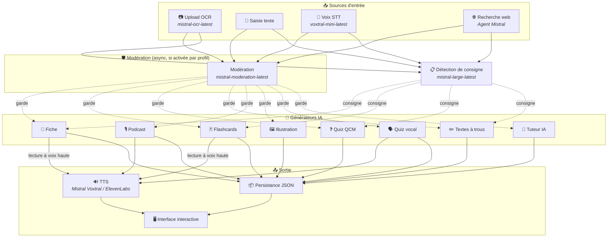
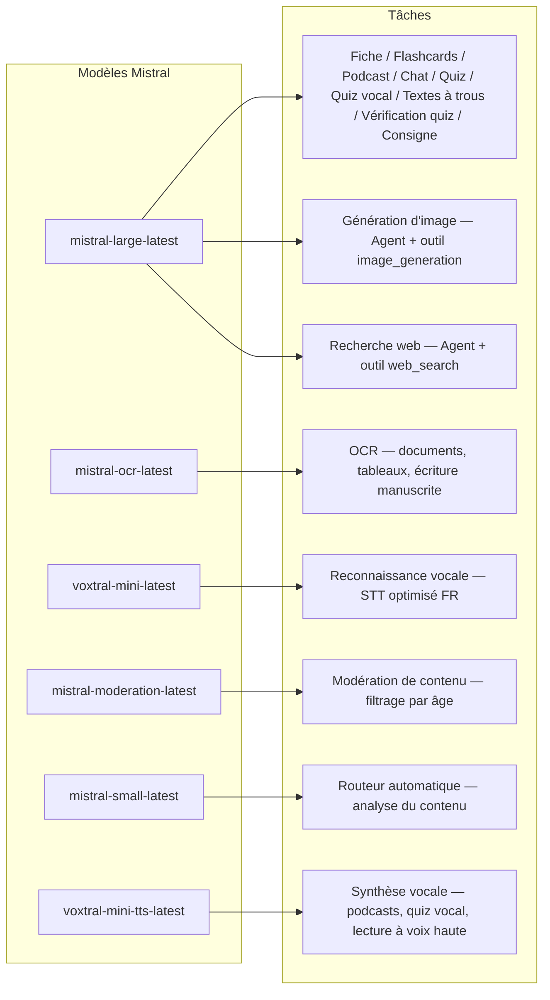
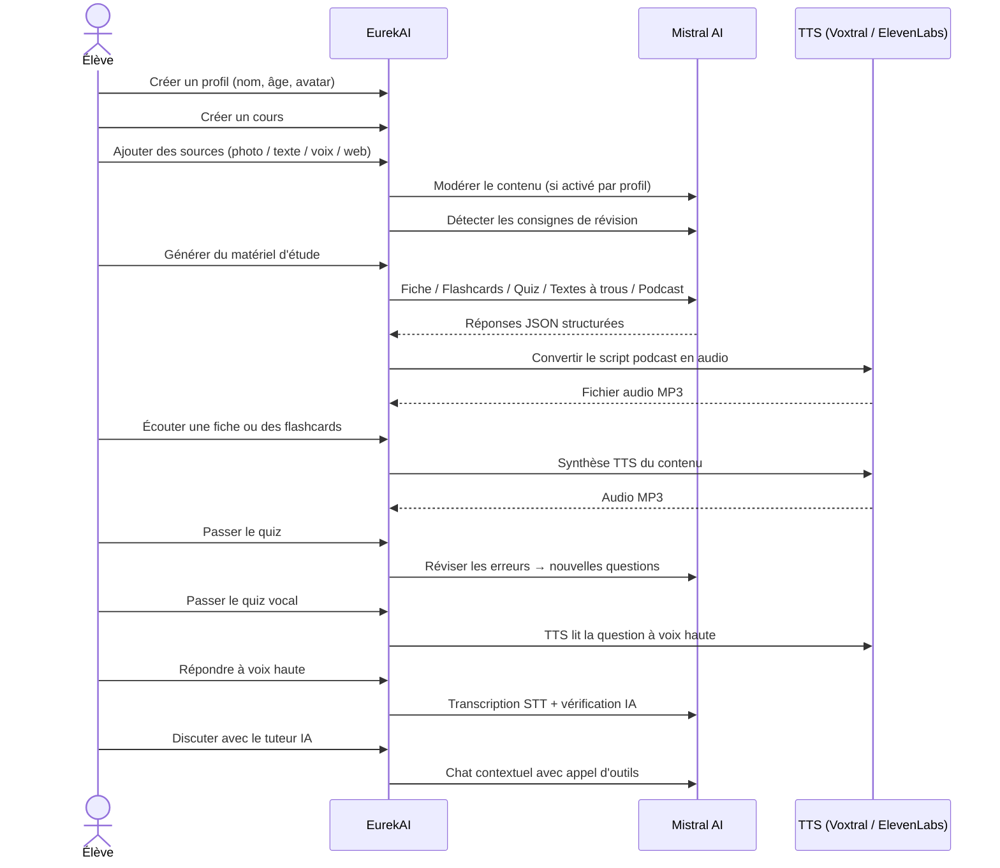

<p align="center">
  
</p>

<h1 align="center">EurekAI</h1>

<p align="center">
  <strong>あらゆるコンテンツをインタラクティブな学習体験に変換 — <a href="https://mistral.ai">Mistral AI</a> によって駆動。</strong>
</p>

<p align="center">
  <a href="README-en.md">🇬🇧 英語</a> · <a href="README-es.md">🇪🇸 スペイン語</a> · <a href="README-pt.md">🇧🇷 ポルトガル語</a> · <a href="README-de.md">🇩🇪 ドイツ語</a> · <a href="README-it.md">🇮🇹 イタリア語</a> · <a href="README-nl.md">🇳🇱 オランダ語</a> · <a href="README-ar.md">🇸🇦 アラビア語</a><br>
  <a href="README-hi.md">🇮🇳 ヒンディー語</a> · <a href="README-zh.md">🇨🇳 中国語</a> · <a href="README-ja.md">🇯🇵 日本語</a> · <a href="README-ko.md">🇰🇷 韓国語</a> · <a href="README-pl.md">🇵🇱 ポーランド語</a> · <a href="README-ro.md">🇷🇴 ルーマニア語</a> · <a href="README-sv.md">🇸🇪 スウェーデン語</a>
</p>

<p align="center">
  <a href="https://www.youtube.com/watch?v=_b1TQz2leoI"></a>
</p>

<h4 align="center">📊 コード品質</h4>

<p align="center">
  <a href="https://sonarcloud.io/summary/new_code?id=jls42_EurekAI"></a>
  <a href="https://sonarcloud.io/summary/new_code?id=jls42_EurekAI"></a>
  <a href="https://sonarcloud.io/summary/new_code?id=jls42_EurekAI"></a>
  <a href="https://sonarcloud.io/summary/new_code?id=jls42_EurekAI"></a>
</p>
<p align="center">
  <a href="https://sonarcloud.io/summary/new_code?id=jls42_EurekAI"></a>
  <a href="https://sonarcloud.io/summary/new_code?id=jls42_EurekAI"></a>
  <a href="https://sonarcloud.io/summary/new_code?id=jls42_EurekAI"></a>
  <a href="https://sonarcloud.io/summary/new_code?id=jls42_EurekAI"></a>
</p>

---

## ストーリー — なぜ EurekAI？

**EurekAI** は [Mistral AI Worldwide Hackathon](https://luma.com/mistralhack-online)（[公式サイト](https://worldwide-hackathon.mistral.ai/)）で生まれました（2026年3月）。テーマが必要で、きっかけは非常に実践的なものから来ました：私は娘と一緒に定期的にテスト対策をしていて、AIを使えばもっと楽しくインタラクティブにできるはずだと考えたのです。

目的は、**あらゆる入力** — 教科書の写真、コピーしたテキスト、音声記録、ウェブ検索 — を受け取り、**復習ノート、フラッシュカード、クイズ、ポッドキャスト、穴埋め問題、イラストなど** に変換することです。すべて Mistral AI のフランス語モデルによって駆動されるため、フランス語圏の生徒に自然と適したソリューションになっています。

プロジェクトはハッカソン中に開始され、その後も改善が続けられています。コードの大部分は AI により生成されており、主に [Claude Code](https://docs.anthropic.com/en/docs/claude-code) を使用し、一部は [Codex](https://openai.com/index/introducing-codex/) の貢献もあります。

---

## 機能

| | 機能 | 説明 |
|---|---|---|
| 📷 | **OCRアップロード** | 教科書やノートを写真に撮ると Mistral OCR が内容を抽出 |
| 📝 | **テキスト入力** | 任意のテキストを直接入力または貼り付け |
| 🎤 | **音声入力** | 録音 — Voxtral STT が音声を文字起こし |
| 🌐 | **ウェブ検索** | 質問を入力すると Mistral エージェントがウェブから回答を検索 |
| 📄 | **復習ノート** | 重要ポイント、語彙、引用、逸話などを含む構造化ノート |
| 🃏 | **フラッシュカード** | 出典参照付きのQ/Aカードで能動的記憶を支援（枚数設定可能） |
| ❓ | **選択式クイズ** | 選択問題、誤答の適応復習（問題数設定可能） |
| ✏️ | **穴埋め問題** | ヒントと許容的な検証付きの穴埋め |
| 🎙️ | **ポッドキャスト** | 2音声のミニポッドキャストを Mistral Voxtral TTS で音声化 |
| 🖼️ | **イラスト** | Mistral エージェントによる教育用画像生成 |
| 🗣️ | **音声クイズ** | 問題を音声で読み上げ、口頭回答をAIが判定 |
| 💬 | **AIチューター** | コース資料を参照するコンテキストチャット、ツール呼び出し可 |
| 🧠 | **自動ルーター** | `mistral-small-latest` に基づくルーターが内容を分析し、7種類の生成器から組み合わせを提案 |
| 🔒 | **ペアレンタルコントロール** | 年齢によるモデレーション、保護者用PIN、チャット制限 |
| 🌍 | **多言語対応** | インターフェースは9言語対応；プロンプトで15言語の生成を制御可能 |
| 🔊 | **音声読み上げ** | 復習ノートやフラッシュカードを Mistral Voxtral TTS または ElevenLabs で再生 |

---

## アーキテクチャ概要



---

## モデルの利用マップ



---

## ユーザーの流れ



---

## 詳細 — 機能

### マルチモーダル入力

EurekAI はデフォルトで年齢プロファイルに応じてモデレーションされた4種類のソースを受け入れます：

- **OCRアップロード** — JPG、PNG、PDF ファイルを `mistral-ocr-latest` で処理。印刷テキスト、表、手書き文字に対応。
- **自由テキスト** — 任意の内容を入力または貼り付け。モデレーションが有効な場合は保存前に審査されます。
- **音声入力** — ブラウザで音声を録音。`voxtral-mini-latest` が文字起こしを行います。`language="fr"` の設定で認識率を最適化。
- **ウェブ検索** — クエリを入力。`web_search` ツールを持つ一時的な Mistral エージェントが結果を取得して要約します。

### AIによるコンテンツ生成

生成される学習教材の種類は7つ：

| 生成タイプ | モデル | 出力 |
|---|---|---|
| **復習ノート** | `mistral-large-latest` | タイトル、要約、重要ポイント、語彙、引用、逸話 |
| **フラッシュカード** | `mistral-large-latest` | 出典参照付きのQ/Aカード（枚数設定可能） |
| **選択式クイズ** | `mistral-large-latest` | 選択問題、解説、適応復習（問題数設定可能） |
| **穴埋め問題** | `mistral-large-latest` | ヒント付きの穴埋め文、緩やかな検証（Levenshtein） |
| **ポッドキャスト** | `mistral-large-latest` + Voxtral TTS | 2音声のスクリプト → MP3オーディオ |
| **イラスト** | Agent `mistral-large-latest` | `image_generation` ツール経由の教育用画像 |
| **音声クイズ** | `mistral-large-latest` + Voxtral TTS + STT | TTSで出題 → STTで回答取得 → AIが検証 |

### チャットによるAIチューター

会話型のチューターで、コース資料へフルアクセスします：

- `mistral-large-latest` を使用
- ツール呼び出し：会話中に復習ノート、フラッシュカード、クイズ、穴埋め問題を生成可能
- コースごとに最大50メッセージの履歴
- プロファイルで有効化されている場合はコンテンツのモデレーションを実行

### 自動ルーター

ルーターは `mistral-small-latest` を使い、ソース内容を分析して7種類の生成器の中から最適な組み合わせを提案します。インターフェースはリアルタイムで進捗を表示：まず分析フェーズ、続いて個別生成（キャンセル可能）。

### 適応学習

- **クイズ統計**：各問題ごとの試行回数と正答率を追跡
- **復習問題生成**：弱点に焦点を当てた5〜10問を生成
- **学習指示の検出**：復習指示（「〜ができれば理解している」など）を検出し、復習ノート、フラッシュカード、クイズ、穴埋めなどのテキスト生成で優先

### セキュリティとペアレンタルコントロール

- **4つの年齢グループ**：子供（≤10歳）、ティーン（11-15歳）、学生（16-25歳）、大人（26歳以上）
- **コンテンツモデレーション**：`mistral-moderation-latest` を使用。子供/ティーン向けに5つのカテゴリをブロック（`sexual`, `hate_and_discrimination`, `violence_and_threats`, `selfharm`, `jailbreaking`）、学生/大人には制限なし
- **保護者用PIN**：SHA-256 ハッシュ。15歳未満のプロファイルに必須。実運用ではソルト付きの遅延ハッシュ（Argon2id、bcrypt）を推奨
- **チャット制限**：16歳未満はデフォルトでAIチャット無効、保護者が有効化可能

### マルチプロファイルシステム

- 名前、年齢、アバター、言語設定を持つ複数プロファイル対応
- プロファイルに紐づくプロジェクトは `profileId` で管理
- カスケード削除：プロファイル削除で関連プロジェクトも削除

### TTS マルチプロバイダ

- **Mistral Voxtral TTS**（デフォルト）：`voxtral-mini-tts-latest`、追加キー不要
- **ElevenLabs**（代替）：`eleven_v3`、より自然な音声、`ELEVENLABS_API_KEY` が必要
- プロバイダはアプリ設定で切り替え可能

### 国際化

- インターフェースは9言語対応：fr, en, es, pt, it, nl, de, hi, ar
- プロンプトは15言語をサポート：fr, en, es, de, it, pt, nl, ja, zh, ko, ar, hi, pl, ro, sv
- 言語はプロファイルごとに設定可能

---

## 技術スタック

| レイヤー | テクノロジー | 役割 |
|---|---|---|
| **ランタイム** | Node.js + TypeScript 6.x | サーバーと型の安全性 |
| **バックエンド** | Express 5.x | REST API |
| **開発サーバー** | Vite 8.x (Rolldown) + tsx | HMR、Handlebarsパーシャル、プロキシ |
| **フロントエンド** | HTML + TailwindCSS 4.x + Alpine.js 3.x | リアクティブなUI、TypeScriptはViteでビルド |
| **テンプレート** | vite-plugin-handlebars | パーシャルによるHTML構成 |
| **AI** | Mistral AI SDK 2.x | チャット、OCR、STT、TTS、エージェント、モデレーション |
| **TTS（デフォルト）** | Mistral Voxtral TTS | `voxtral-mini-tts-latest`、組み込み音声合成 |
| **TTS（代替）** | ElevenLabs SDK 2.x | `eleven_v3`、自然な音声 |
| **アイコン** | Lucide 1.x | SVGアイコンライブラリ |
| **Markdown** | Marked | チャット内のMarkdownレンダリング |
| **ファイルアップロード** | Multer 2.x | multipartフォーム処理 |
| **オーディオ** | ffmpeg-static | オーディオセグメントの結合 |
| **テスト** | Vitest | 単体テスト — カバレッジは SonarCloud で計測 |
| **永続化** | JSONファイル | 依存を持たないストレージ |

---

## モデル参照

| モデル | 用途 | 理由 |
|---|---|---|
| `mistral-large-latest` | ノート、フラッシュカード、ポッドキャスト、クイズ、穴埋め、チャット、音声クイズの検証、画像エージェント、ウェブ検索エージェント、指示検出 | 多言語対応かつ指示の追従が優れているため |
| `mistral-ocr-latest` | ドキュメントOCR | 印刷テキスト、表、手書き対応 |
| `voxtral-mini-latest` | 音声認識（STT） | 多言語STT、`language="fr"` と組み合わせると最適 |
| `voxtral-mini-tts-latest` | 音声合成（TTS） | ポッドキャスト、音声クイズ、音声読み上げ |
| `mistral-moderation-latest` | コンテンツモデレーション | 子供/ティーン向けに5カテゴリをブロック（+ ジェイルブレイク対策） |
| `mistral-small-latest` | 自動ルーター | コンテンツ分析によるルーティング判断が高速 |
| `eleven_v3` (ElevenLabs) | 音声合成（TTS代替） | 自然な音声、代替プロバイダとして設定可能 |

---

## クイックスタート

```bash
# Cloner le dépôt
git clone https://github.com/jls42/EurekAI.git
cd EurekAI

# Installer les dépendances
npm install

# Configurer les clés API
cp .env.example .env
# Éditez .env avec vos clés :
#   MISTRAL_API_KEY=votre_clé_ici           (requis)
#   ELEVENLABS_API_KEY=votre_clé_ici        (optionnel, TTS alternatif)
#   SONAR_TOKEN=...                          (optionnel, CI SonarCloud uniquement)

# Lancer le développement
npm run dev
# → Backend :  http://localhost:3000 (API)
# → Frontend : http://localhost:5173 (serveur Vite avec HMR)
```

> **注意**：Mistral Voxtral TTS がデフォルトプロバイダです — `MISTRAL_API_KEY` 以外の追加キーは不要です。ElevenLabs は設定で選べる代替TTSプロバイダです。

---

## プロジェクト構成

```
server.ts                 — Point d'entrée Express, monte les routes + config
config.ts                 — Config runtime (modèles, voix, TTS provider), persistée dans output/config.json
store.ts                  — ProjectStore : CRUD projets/sources/générations, persistance JSON
profiles.ts               — ProfileStore : gestion des profils, hachage PIN
types.ts                  — Types TypeScript : Source, Generation (7 types), QuizStats, Profile
prompts.ts                — Tous les prompts IA centralisés (system + user templates, 15 langues)

generators/
  ocr.ts                  — Upload + OCR via Mistral (JPG, PNG, PDF)
  summary.ts              — Génération de fiche de révision (JSON structuré)
  flashcards.ts           — Flashcards Q/R (5-50, configurable)
  quiz.ts                 — Quiz QCM (5-50 questions, configurable) + révision adaptative
  fill-blank.ts           — Exercices à trous avec validation tolérante
  podcast.ts              — Script podcast 2 voix
  quiz-vocal.ts           — Quiz vocal : questions TTS + réponses STT + vérification IA
  image.ts                — Génération d'image via Agent Mistral (outil image_generation)
  chat.ts                 — Tuteur IA par chat avec appel d'outils
  router.ts               — Routeur automatique (contenu → générateurs recommandés)
  consigne.ts             — Détection de consignes de révision
  tts-provider.ts         — Dispatch TTS multi-provider (Mistral Voxtral / ElevenLabs)
  tts.ts                  — Génération audio podcast (concaténation de segments)
  stt.ts                  — Voxtral STT (audio → texte)
  websearch.ts            — Agent Mistral avec outil web_search
  moderation.ts           — Modération de contenu (filtrage par âge)

routes/
  projects.ts             — CRUD projets
  profiles.ts             — CRUD profils avec gestion du PIN
  sources.ts              — Upload OCR, texte libre, voix STT, recherche web, modération
  generate.ts             — Endpoints de génération (7 types + auto + route)
  generations.ts          — Tentatives de quiz/fill-blank, réponses vocales, lecture à voix haute
  chat.ts                 — Chat IA avec appel d'outils

helpers/
  index.ts                — getContent, stripJsonMarkdown, safeParseJson, unwrapJsonArray, extractAllText, timer
  audio.ts                — collectStream (ReadableStream → Buffer)
  fill-blank-validate.ts  — Validation tolérante des réponses (normalisation, Levenshtein)
  diversity.ts            — Diversité des générations (exclusion du contenu déjà produit, randomSeed)

src/                      — Frontend (Vite + Handlebars)
  index.html              — Point d'entrée HTML principal
  main.ts                 — Entrée frontend (init Alpine.js + icônes Lucide)
  app/                    — Modules applicatifs Alpine.js
    state.ts              — Gestion d'état réactif
    navigation.ts         — Routage des vues + gardes par âge
    profiles.ts           — Logique du sélecteur de profils
    projects.ts           — CRUD des cours
    sources.ts            — Gestionnaires d'upload de sources
    generate.ts           — Déclencheurs de génération (individuel, tout, auto 2 phases)
    generations.ts        — Affichage + actions sur les générations
    chat.ts               — Interface de chat
    config.ts             — Interface de configuration (modèles, voix, TTS provider)
    render.ts             — Helpers de rendu HTML
    i18n.ts               — Changement de langue
    ...
  components/
    quiz.ts               — Composant quiz interactif
    quiz-vocal.ts         — Composant quiz vocal
    fill-blank.ts         — Composant textes à trous
    flashcards.ts         — Composant flashcards avec retournement
    step-by-step.ts       — Mixin navigation pas-à-pas (quiz, fill-blank, flashcards)
  i18n/
    fr.ts, en.ts, es.ts, — Dictionnaires par langue (9 langues)
    pt.ts, it.ts, nl.ts,
    de.ts, hi.ts, ar.ts
    languages.ts          — Registre des langues UI disponibles
    index.ts              — Chargeur i18n
  partials/               — Partials HTML Handlebars (header, sidebar, dialogues, vues)
  styles/
    main.css              — Entrée TailwindCSS
    theme.css             — Variables de thème personnalisées

public/assets/            — Ressources statiques (logo, avatars)
output/                   — Données d'exécution (projets, config, fichiers audio)
```

---

## APIリファレンス

### 設定
| メソッド | エンドポイント | 説明 |
|---|---|---|
| `GET` | `/api/config` | 現在の設定を取得 |
| `PUT` | `/api/config` | 設定の変更（モデル、音声、TTSプロバイダ等） |
| `GET` | `/api/config/status` | APIのステータス（Mistral、ElevenLabs、TTS） |
| `POST` | `/api/config/reset` | 設定をデフォルトにリセット |
| `GET` | `/api/config/voices` | Mistral TTS の音声一覧を取得（オプション `?lang=fr`） |

### プロファイル
| メソッド | エンドポイント | 説明 |
|---|---|---|
| `GET` | `/api/profiles` | すべてのプロファイルを一覧 |
| `POST` | `/api/profiles` | プロファイルを作成 |
| `PUT` | `/api/profiles/:id` | プロファイルを編集（15歳未満はPIN必須） |
| `DELETE` | `/api/profiles/:id` | プロファイルを削除（プロジェクトのカスケード削除 `{pin?}` → `{ok, deletedProjects}`） |

### プロジェクト
| メソッド | エンドポイント | 説明 |
|---|---|---|
| `GET` | `/api/projects` | プロジェクトを一覧（`?profileId=` オプション） |
| `POST` | `/api/projects` | プロジェクトを作成 `{name, profileId}` |
| `GET` | `/api/projects/:pid` | プロジェクトの詳細 |
| `PUT` | `/api/projects/:pid` | 名前を変更 `{name}` |
| `DELETE` | `/api/projects/:pid` | プロジェクトを削除 |

### ソース
| メソッド | エンドポイント | 説明 |
|---|---|---|
| `POST` | `/api/projects/:pid/sources/upload` | OCRアップロード（multipartファイル） |
| `POST` | `/api/projects/:pid/sources/text` | 自由テキスト `{text}` |
| `POST` | `/api/projects/:pid/sources/voice` | 音声STT（multipartオーディオ） |
| `POST` | `/api/projects/:pid/sources/websearch` | ウェブ検索 `{query}` |
| `DELETE` | `/api/projects/:pid/sources/:sid` | ソースを削除 |
| `POST` | `/api/projects/:pid/moderate` | モデレーションを実行 `{text}` |
| `POST` | `/api/projects/:pid/detect-consigne` | 学習指示の検出 |

### 生成
| メソッド | エンドポイント | 説明 |
|---|---|---|
| `POST` | `/api/projects/:pid/generate/summary` | 復習ノート生成 |
| `POST` | `/api/projects/:pid/generate/flashcards` | フラッシュカード生成 |
| `POST` | `/api/projects/:pid/generate/quiz` | 選択式クイズ生成 |
| `POST` | `/api/projects/:pid/generate/fill-blank` | 穴埋め問題生成 |
| `POST` | `/api/projects/:pid/generate/podcast` | ポッドキャスト生成 |
| `POST` | `/api/projects/:pid/generate/image` | イラスト生成 |
| `POST` | `/api/projects/:pid/generate/quiz-vocal` | 音声クイズ生成 |
| `POST` | `/api/projects/:pid/generate/quiz-review` | 適応復習の生成 `{generationId, weakQuestions}` |
| `POST` | `/api/projects/:pid/generate/route` | ルーティング分析（起動する生成器のプラン） |
| `POST` | `/api/projects/:pid/generate/auto` | バックエンド自動生成（ルーティング＋5タイプ：summary, flashcards, quiz, fill-blank, podcast） |

すべての生成ルートは `{sourceIds?, lang?, ageGroup?, count?, useConsigne?}` を受け付けます。`quiz-review` はさらに `{generationId, weakQuestions}` を必要とします。

### CRUD 生成
| メソッド | エンドポイント | 説明 |
|---|---|---|
| `POST` | `/api/projects/:pid/generations/:gid/quiz-attempt` | クイズ回答を送信 `{answers}` |
| `POST` | `/api/projects/:pid/generations/:gid/fill-blank-attempt` | 穴埋め回答を送信 `{answers}` |
| `POST` | `/api/projects/:pid/generations/:gid/vocal-answer` | 口頭回答を検証（オーディオ + questionIndex） |
| `POST` | `/api/projects/:pid/generations/:gid/read-aloud` | TTSによる読み上げ（ノート/フラッシュカード） |
| `PUT` | `/api/projects/:pid/generations/:gid` | 名前変更 `{title}` |
| `DELETE` | `/api/projects/:pid/generations/:gid` | 生成物の削除 |

### チャット
| メソッド | エンドポイント | 説明 |
|---|---|---|
| `GET` | `/api/projects/:pid/chat` | チャット履歴を取得 |
| `POST` | `/api/projects/:pid/chat` | メッセージを送信 `{message, lang, ageGroup}` |
| `DELETE` | `/api/projects/:pid/chat` | チャット履歴を消去 |

---

## アーキテクチャ上の決定

| 決定 | 理由 |
|---|---|
| **React/VueではなくAlpine.js** | フットプリントが小さく、TypeScriptでビルドされた軽量なリアクティビティ。ハッカソンのようにスピードが重要な場面に最適です。 |
| **JSONファイルでの永続化** | 依存関係ゼロで即時起動可能。データベースの設定が不要なので、すぐに始められます。 |
| **Vite + Handlebars** | 二つの世界のベスト：開発向けの高速HMR、コード整理のためのHTMLパーシャル、Tailwind JIT。 |
| **Prompts centralisés** | すべてのAIプロンプトが `prompts.ts` に — 言語／年齢層ごとに反復、テスト、調整しやすい。 |
| **Système multi-générations** | 各生成は固有のIDを持つ独立したオブジェクト — コースごとに複数のカードやクイズ等を可能にする。 |
| **Prompts adaptés par âge** | 語彙、複雑さ、語調が異なる4つの年齢グループ — 同じコンテンツでも学習者に応じて異なる教え方を提供。 |
| **Fonctionnalités basées sur les Agents** | 画像生成とウェブ検索は一時的なMistralエージェントを使用 — クリーンなライフサイクルと自動クリーンアップ。 |
| **TTS multi-provider** | デフォルトはMistral Voxtral TTS（追加キー不要）、代替はElevenLabs — 再起動不要で設定可能。 |

---

## クレジットと謝辞

- **[Mistral AI](https://mistral.ai)** — AIモデル（Large、OCR、Voxtral STT、Voxtral TTS、Moderation、Small）＋ Worldwide ハッカソン
- **[ElevenLabs](https://elevenlabs.io)** — 代替の音声合成エンジン（`eleven_v3`）
- **[Alpine.js](https://alpinejs.dev)** — 軽量リアクティブフレームワーク
- **[TailwindCSS](https://tailwindcss.com)** — ユーティリティCSSフレームワーク
- **[Vite](https://vitejs.dev)** — フロントエンドビルドツール
- **[Lucide](https://lucide.dev)** — アイコンライブラリ
- **[Marked](https://marked.js.org)** — Markdownパーサー

Mistral AI Worldwide Hackathon（2026年3月）中に開始、Claude Code と Codex によってAIのみで完全に開発。

---

## 著者

**Julien LS** — [contact@jls42.org](mailto:contact@jls42.org)

## ライセンス

[AGPL-3.0](LICENSE) — 著作権 (C) 2026 Julien LS

**この文書は、gpt-5-mini モデルを使用してフランス語 (fr) 版から日本語 (ja) に翻訳されました。翻訳プロセスの詳細については、https://gitlab.com/jls42/ai-powered-markdown-translator をご覧ください。**

