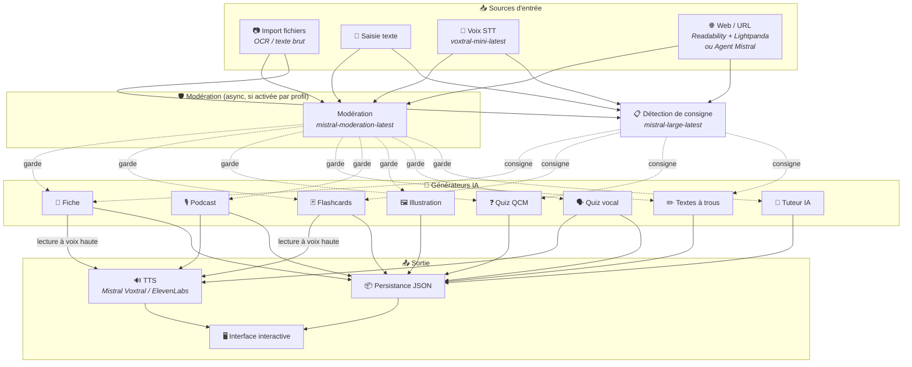
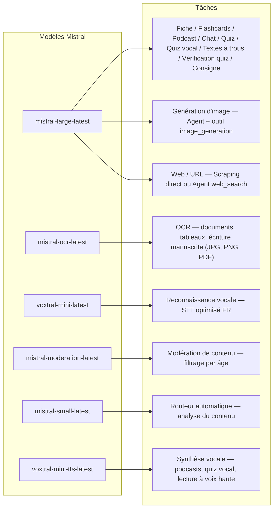
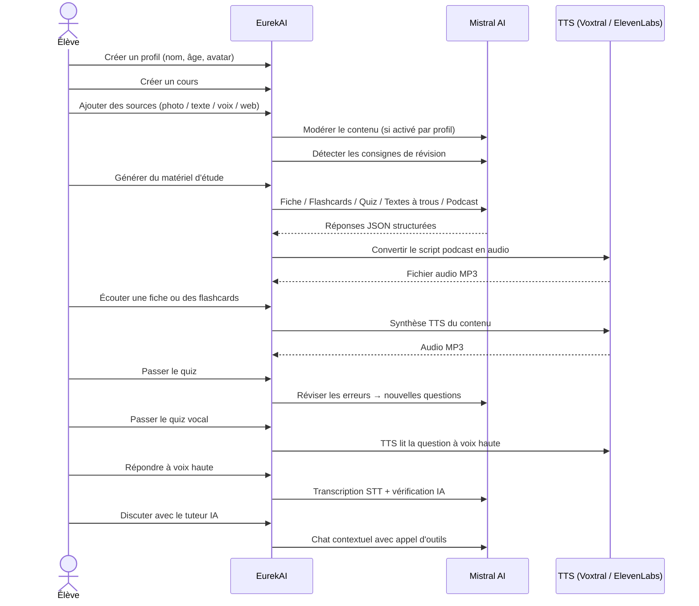

<p align="center">
  
</p>

<h1 align="center">EurekAI</h1>

<p align="center">
  <strong>あらゆるコンテンツをインタラクティブな学習体験に変換します — <a href="https://mistral.ai">Mistral AI</a> によって強化。</strong>
</p>

<p align="center">
  <a href="README-en.md">🇬🇧 英語</a> · <a href="README-es.md">🇪🇸 スペイン語</a> · <a href="README-pt.md">🇧🇷 ポルトガル語</a> · <a href="README-de.md">🇩🇪 ドイツ語</a> · <a href="README-it.md">🇮🇹 イタリア語</a> · <a href="README-nl.md">🇳🇱 オランダ語</a> · <a href="README-ar.md">🇸🇦 アラビア語</a><br>
  <a href="README-hi.md">🇮🇳 ヒンディー語</a> · <a href="README-zh.md">🇨🇳 中国語</a> · <a href="README-ja.md">🇯🇵 日本語</a> · <a href="README-ko.md">🇰🇷 韓国語</a> · <a href="README-pl.md">🇵🇱 ポーランド語</a> · <a href="README-ro.md">🇷🇴 ルーマニア語</a> · <a href="README-sv.md">🇸🇪 スウェーデン語</a>
</p>

<p align="center">
  <a href="https://www.youtube.com/watch?v=_b1TQz2leoI"></a>
</p>

<h4 align="center">📊 コード品質</h4>

<p align="center">
  <a href="https://sonarcloud.io/summary/new_code?id=jls42_EurekAI"></a>
  <a href="https://sonarcloud.io/summary/new_code?id=jls42_EurekAI"></a>
  <a href="https://sonarcloud.io/summary/new_code?id=jls42_EurekAI"></a>
  <a href="https://sonarcloud.io/summary/new_code?id=jls42_EurekAI"></a>
</p>
<p align="center">
  <a href="https://sonarcloud.io/summary/new_code?id=jls42_EurekAI"></a>
  <a href="https://sonarcloud.io/summary/new_code?id=jls42_EurekAI"></a>
  <a href="https://sonarcloud.io/summary/new_code?id=jls42_EurekAI"></a>
  <a href="https://sonarcloud.io/summary/new_code?id=jls42_EurekAI"></a>
</p>

---

## 背景 — なぜ EurekAI？

**EurekAI** は [Mistral AI Worldwide Hackathon](https://luma.com/mistralhack-online)（[公式サイト](https://worldwide-hackathon.mistral.ai/)）（2026年3月）で生まれました。テーマが必要で、きっかけはとても個人的なものです：私は娘のテスト準備をよく手伝っており、AIを使ってもっと楽しくインタラクティブにできるはずだと考えました。

目的：写真、コピーしたテキスト、音声録音、ウェブ検索など、**任意の入力**を受け取り、それを**復習シート、フラッシュカード、クイズ、ポッドキャスト、穴埋め問題、イラストなど**に変換すること。すべて Mistral AI のフランス製モデルで駆動しているため、フランス語圏の学習者にとって自然に適したソリューションになっています。

[最初のプロトタイプ](https://github.com/jls42/worldwide-hackathon.mistral.ai) はハッカソン中の48時間で、Mistralのサービスを使った概念実証として作られました — 既に動作しますが機能は限定的でした。その後、EurekAI は本格的なプロジェクトへと発展しました：穴埋め問題、演習のナビゲーション、ウェブスクレイピング、設定可能な親のモデレーション、詳細なコードレビューなど。コードの大部分はAIによって生成されており、主に [Claude Code](https://code.claude.com/) を使用し、一部 [Codex](https://openai.com/codex/) や [Gemini CLI](https://geminicli.com/) が貢献しています。

---

## 機能

| | 機能 | 説明 |
|---|---|---|
| 📷 | **ファイルのインポート** | レッスンをインポート — 写真、PDF（Mistral OCR経由）またはテキストファイル（TXT、MD） |
| 📝 | **テキスト入力** | 任意のテキストを直接入力または貼り付け |
| 🎤 | **音声入力** | 録音 — Voxtral STT が音声を文字起こし |
| 🌐 | **Web / URL** | URLを貼り付け（Readability + Lightpandaで直接スクレイピング）または検索語を入力（Agent Mistral web_search） |
| 📄 | **復習シート** | 重要ポイント、語彙、引用、逸話を含む構造化ノート |
| 🃏 | **フラッシュカード** | ソース参照付きのQ/Aカード（枚数設定可） |
| ❓ | **選択式クイズ** | 選択式問題と誤答に対する適応的レビュー（枚数設定可） |
| ✏️ | **穴埋め問題** | ヒント付きの完成問題、許容的な検証 |
| 🎙️ | **ポッドキャスト** | 2音声のミニポッドキャスト — デフォルトは Mistral 音声、カスタム音声も可能（親の声など） |
| 🖼️ | **イラスト** | Agent Mistral による教育用画像生成 |
| 🗣️ | **音声クイズ** | 問題を読み上げ（カスタム音声可）、口頭で回答、AIによる検証 |
| 💬 | **AIチューター** | コースドキュメントに基づくコンテキストチャット、ツール呼び出し対応 |
| 🧠 | **自動ルーター** | `mistral-small-latest` に基づくルーターが内容を分析し、7種類のジェネレータの組み合わせを提案 |
| 🔒 | **ペアレンタルコントロール** | プロファイルごとに設定可能なモデレーション（カテゴリカスタマイズ可）、親用PIN、チャット制限 |
| 🌍 | **多言語対応** | インターフェイスは9言語対応；プロンプトで15言語のAI生成を制御可能 |
| 🔊 | **音声読み上げ** | Mistral Voxtral TTS または ElevenLabs による復習シート＆フラッシュカードの読み上げ |

---

## アーキテクチャ概要



---

## モデル利用マップ



---

## ユーザーフロー



---

## 詳細 — 機能

### マルチモーダル入力

EurekAI は4種類のソースを受け付け、プロファイルに応じてモデレーション（子ども・ティーンではデフォルトで有効）されます：

- **ファイルのインポート** — JPG、PNG、PDF ファイルは `mistral-ocr-latest` によって処理（印刷テキスト、表、手書き文字）、TXT/MD は直接インポート。
- **自由テキスト** — 任意のコンテンツを入力または貼り付け。保存前にモデレーションが有効なら審査。
- **音声入力** — ブラウザで音声を録音。`voxtral-mini-latest` で文字起こし。`language="fr"` が認識を最適化。
- **Web / URL** — 1つまたは複数のURLを貼り付けて直接スクレイピング（JSページは Readability + Lightpanda）、またはキーワードで Agent Mistral によるウェブ検索。入力欄はURLとキーワードの両方を受け付け、自動で分離し、それぞれ独立したソースを作成します。

### AIによるコンテンツ生成

生成される学習素材は7種類：

| ジェネレータ | モデル | 出力 |
|---|---|---|
| **復習シート** | `mistral-large-latest` | タイトル、要約、重要ポイント、語彙、引用、逸話 |
| **フラッシュカード** | `mistral-large-latest` | ソース参照付きのQ/Aカード（枚数設定可） |
| **選択式クイズ** | `mistral-large-latest` | 選択式問題、解説、適応的復習（枚数設定可） |
| **穴埋め問題** | `mistral-large-latest` | ヒント付きの文、許容的検証（Levenshtein） |
| **ポッドキャスト** | `mistral-large-latest` + Voxtral TTS | 2音声用スクリプト → MP3音声 |
| **イラスト** | Agent `mistral-large-latest` | `image_generation` ツール経由の教育用画像 |
| **音声クイズ** | `mistral-large-latest` + Voxtral TTS + STT | TTSで出題 → STTで回答 → AIによる検証 |

### チャットによるAIチューター

ドキュメントにフルアクセスする会話型チューター：

- `mistral-large-latest` を使用
- ツール呼び出し：会話中に復習シート、フラッシュカード、クイズ、穴埋め問題を生成可能
- コースごとに50メッセージの履歴
- プロファイルで有効ならコンテンツのモデレーションを適用

### 自動ルーター

ルーターは `mistral-small-latest` を使ってソースの内容を分析し、7種類のジェネレータから最も適したものを提案します。インターフェイスはリアルタイムで進行状況を表示：まず分析フェーズ、その後個別生成（キャンセル可能）。

### 適応学習

- **クイズ統計**：問題ごとの試行回数と正答率を追跡
- **クイズ復習**：弱点概念に焦点を当てた5〜10問を生成
- **指示検出**：復習指示（「私は…ができれば学習済み」など）を検出し、対応可能なテキスト生成（復習シート、フラッシュカード、クイズ、穴埋め）で優先

### セキュリティとペアレンタルコントロール

- **4つの年齢グループ**：子ども（≤10歳）、ティーン（11–15）、学生（16–25）、大人（26+）
- **コンテンツモデレーション**：`mistral-moderation-latest`、10カテゴリから選択可能。子ども/ティーンではデフォルトで5カテゴリをブロック（`sexual`, `hate_and_discrimination`, `violence_and_threats`, `selfharm`, `jailbreaking`）。設定でプロファイルごとにカスタマイズ可。
- **親用PIN**：SHA-256 ハッシュ、15歳未満のプロファイルで必須。プロダクション展開時はソルト付きの遅延ハッシュ（Argon2id、bcrypt）を検討。
- **チャット制限**：16歳未満はデフォルトでAIチャット無効、親が有効化可能

### マルチプロフィールシステム

- 名前、年齢、アバター、言語設定を持つ複数プロフィール
- プロファイルに紐づくプロジェクトは `profileId`
- カスケード削除：プロファイル削除で関連プロジェクトも削除

### マルチTTSプロバイダーとカスタム音声

- **Mistral Voxtral TTS**（デフォルト）：`voxtral-mini-tts-latest`、追加キー不要
- **ElevenLabs**（代替）：`eleven_v3`、自然な音声、`ELEVENLABS_API_KEY` が必要
- アプリ設定でプロバイダーを選択可能
- **カスタム音声**：親はサンプル音声から Mistral Voices API で自分の声を作成し、ホスト/ゲスト役割に割り当てられる — ポッドキャストや音声クイズが親の声で再生され、子どもの体験をより没入的にする
- 設定でホスト（メインナレーター）とゲスト（第二音声）の2つの音声役割を設定可能
- 言語でフィルタ可能な Mistral の全音声カタログが設定に表示

### 国際化

- インターフェイスは9言語対応：fr, en, es, pt, it, nl, de, hi, ar
- AIプロンプトは15言語をサポート（fr, en, es, de, it, pt, nl, ja, zh, ko, ar, hi, pl, ro, sv）
- プロファイルごとに言語を設定可能

---

## 技術スタック

| レイヤー | 技術 | 役割 |
|---|---|---|
| **Runtime** | Node.js + TypeScript 6.x | サーバーと型安全 |
| **Backend** | Express 5.x | REST API |
| **開発サーバー** | Vite 8.x (Rolldown) + tsx | HMR、Handlebars partials、プロキシ |
| **フロントエンド** | HTML + TailwindCSS 4.x + Alpine.js 3.x | リアクティブUI、ViteでTypeScriptをコンパイル |
| **テンプレート** | vite-plugin-handlebars | partialsによるHTML構成 |
| **AI** | Mistral AI SDK 2.x | チャット、OCR、STT、TTS、Agents、モデレーション |
| **TTS（デフォルト）** | Mistral Voxtral TTS | `voxtral-mini-tts-latest`、統合音声合成 |
| **TTS（代替）** | ElevenLabs SDK 2.x | `eleven_v3`、自然な音声 |
| **アイコン** | Lucide 1.x | SVGアイコンライブラリ |
| **ウェブスクレイピング** | Readability + linkedom | ページの主要コンテンツ抽出（Firefox Reader View 技術） |
| **ヘッドレスブラウザ** | Lightpanda | JS/SPAページ用の超軽量ヘッドレス（Zig + V8） — フォールバックスクレイピングあり |
| **Markdown** | Marked | チャット内のMarkdownレンダリング |
| **ファイルアップロード** | Multer 2.x | multipartフォーム処理 |
| **オーディオ** | ffmpeg-static | オーディオセグメントの連結 |
| **テスト** | Vitest | 単体テスト — カバレッジは SonarCloud で計測 |
| **永続化** | JSONファイル | 依存なしのストレージ |

---

## モデル参照

| モデル | 使用箇所 | 理由 |
|---|---|---|
| `mistral-large-latest` | 復習シート、フラッシュカード、ポッドキャスト、クイズ、穴埋め、チャット、音声クイズ検証、画像Agent、Web検索Agent、指示検出 | 多言語対応かつ指示追従が優れているため |
| `mistral-ocr-latest` | ドキュメントOCR | 印刷テキスト、表、手書き認識 |
| `voxtral-mini-latest` | 音声認識（STT） | 多言語STT、`language="fr"` で最適化 |
| `voxtral-mini-tts-latest` | 音声合成（TTS） | ポッドキャスト、音声クイズ、読み上げ |
| `mistral-moderation-latest` | コンテンツモデレーション | 子ども/ティーン向けに5カテゴリをブロック（+ ジェイルブレイク対策） |
| `mistral-small-latest` | 自動ルーター | ルーティング判断のための高速解析 |
| `eleven_v3` (ElevenLabs) | 音声合成（TTS代替） | 自然な音声、設定可能な代替手段 |

---

## クイックスタート

```bash
# Cloner le dépôt
git clone https://github.com/jls42/EurekAI.git
cd EurekAI

# Installer les dépendances
npm install

# Configurer les clés API
cp .env.example .env
# Éditez .env avec vos clés :
#   MISTRAL_API_KEY=votre_clé_ici           (requis)
#   ELEVENLABS_API_KEY=votre_clé_ici        (optionnel, TTS alternatif)
#   SONAR_TOKEN=...                          (optionnel, CI SonarCloud uniquement)

# Lancer le développement
npm run dev
# → Backend :  http://localhost:3000 (API)
# → Frontend : http://localhost:5173 (serveur Vite avec HMR)
```

> **注意**：Mistral Voxtral TTS はデフォルトのプロバイダーです — `MISTRAL_API_KEY` 以外の追加キーは不要です。ElevenLabs は設定で選べる代替TTSプロバイダーです。

---

## プロジェクト構成

```
server.ts                 — Point d'entrée Express, monte les routes + config
config.ts                 — Config runtime (modèles, voix, TTS provider), persistée dans output/config.json
store.ts                  — ProjectStore : CRUD projets/sources/générations, persistance JSON
profiles.ts               — ProfileStore : gestion des profils, hachage PIN
types.ts                  — Types TypeScript : Source, Generation (7 types), QuizStats, Profile
prompts.ts                — Tous les prompts IA centralisés (system + user templates, 15 langues)

generators/
  ocr.ts                  — OCR via Mistral (JPG, PNG, PDF)
  summary.ts              — Génération de fiche de révision (JSON structuré)
  flashcards.ts           — Flashcards Q/R (5-50, configurable)
  quiz.ts                 — Quiz QCM (5-50 questions, configurable) + révision adaptative
  fill-blank.ts           — Exercices à trous avec validation tolérante
  podcast.ts              — Script podcast 2 voix
  quiz-vocal.ts           — Quiz vocal : questions TTS + réponses STT + vérification IA
  image.ts                — Génération d'image via Agent Mistral (outil image_generation)
  chat.ts                 — Tuteur IA par chat avec appel d'outils
  router.ts               — Routeur automatique (contenu → générateurs recommandés)
  consigne.ts             — Détection de consignes de révision
  tts-provider.ts         — Dispatch TTS multi-provider (Mistral Voxtral / ElevenLabs)
  tts.ts                  — Génération audio podcast (concaténation de segments)
  stt.ts                  — Voxtral STT (audio → texte)
  websearch.ts            — Agent Mistral avec outil web_search (fallback)
  moderation.ts           — Modération de contenu (filtrage par âge)

routes/
  projects.ts             — CRUD projets
  profiles.ts             — CRUD profils avec gestion du PIN
  sources.ts              — Import fichiers (OCR + texte brut), texte libre, voix STT, scraping URL + recherche web, modération
  generate.ts             — Endpoints de génération (7 types + auto + route)
  generations.ts          — Tentatives de quiz/fill-blank, réponses vocales, lecture à voix haute
  chat.ts                 — Chat IA avec appel d'outils

helpers/
  index.ts                — getContent, stripJsonMarkdown, safeParseJson, unwrapJsonArray, extractAllText, timer
  audio.ts                — collectStream (ReadableStream → Buffer)
  fill-blank-validate.ts  — Validation tolérante des réponses (normalisation, Levenshtein)
  diversity.ts            — Diversité des générations (exclusion du contenu déjà produit, randomSeed)

src/                      — Frontend (Vite + Handlebars)
  index.html              — Point d'entrée HTML principal
  main.ts                 — Entrée frontend (init Alpine.js + icônes Lucide)
  app/                    — Modules applicatifs Alpine.js
    state.ts              — Gestion d'état réactif
    navigation.ts         — Routage des vues + gardes par âge
    profiles.ts           — Logique du sélecteur de profils
    projects.ts           — CRUD des cours
    sources.ts            — Gestionnaires d'upload de sources
    generate.ts           — Déclencheurs de génération (individuel, tout, auto 2 phases)
    generations.ts        — Affichage + actions sur les générations
    chat.ts               — Interface de chat
    config.ts             — Interface de configuration (modèles, voix, TTS provider)
    render.ts             — Helpers de rendu HTML
    i18n.ts               — Changement de langue
    ...
  components/
    quiz.ts               — Composant quiz interactif
    quiz-vocal.ts         — Composant quiz vocal
    fill-blank.ts         — Composant textes à trous
    flashcards.ts         — Composant flashcards avec retournement
    step-by-step.ts       — Mixin navigation pas-à-pas (quiz, fill-blank, flashcards)
  i18n/
    fr.ts, en.ts, es.ts, — Dictionnaires par langue (9 langues)
    pt.ts, it.ts, nl.ts,
    de.ts, hi.ts, ar.ts
    languages.ts          — Registre des langues UI disponibles
    index.ts              — Chargeur i18n
  partials/               — Partials HTML Handlebars (header, sidebar, dialogues, vues)
  styles/
    main.css              — Entrée TailwindCSS
    theme.css             — Variables de thème personnalisées

public/assets/            — Ressources statiques (logo, avatars)
output/                   — Données d'exécution (projets, config, fichiers audio)
```

---

## API 参照

### 設定
| メソッド | エンドポイント | 説明 |
|---|---|---|
| `GET` | `/api/config` | 現在の設定取得 |
| `PUT` | `/api/config` | 設定の更新（モデル、音声、TTSプロバイダー等） |
| `GET` | `/api/config/status` | APIステータス（Mistral, ElevenLabs, TTS） |
| `POST` | `/api/config/reset` | デフォルト設定にリセット |
| `GET` | `/api/config/voices` | Mistral TTS の音声一覧（オプション `?lang=fr`） |
| `GET` | `/api/moderation-categories` | 使用可能なモデレーションカテゴリ + 年齢別デフォルト |

### プロファイル
| メソッド | エンドポイント | 説明 |
|---|---|---|
| `GET` | `/api/profiles` | すべてのプロファイルを一覧 |
| `POST` | `/api/profiles` | プロファイル作成 |
| `PUT` | `/api/profiles/:id` | プロファイル編集（< 15歳はPIN必須） |
| `DELETE` | `/api/profiles/:id` | プロファイル削除 + プロジェクトのカスケード削除 `{pin?}` → `{ok, deletedProjects}` |

### プロジェクト
| メソッド | エンドポイント | 説明 |
|---|---|---|
| `GET` | `/api/projects` | プロジェクト一覧（`?profileId=` オプション） |
| `POST` | `/api/projects` | プロジェクト作成 `{name, profileId}` |
| `GET` | `/api/projects/:pid` | プロジェクト詳細 |
| `PUT` | `/api/projects/:pid` | 名前変更 `{name}` |
| `DELETE` | `/api/projects/:pid` | プロジェクト削除 |

### ソース
| メソッド | エンドポイント | 説明 |
|---|---|---|
| `POST` | `/api/projects/:pid/sources/upload` | マルチパートファイルのインポート（JPG/PNG/PDFはOCR、TXT/MDは直接読み込み） |
| `POST` | `/api/projects/:pid/sources/text` | 自由テキスト `{text}` |
| `POST` | `/api/projects/:pid/sources/voice` | 音声 STT（オーディオ multipart） |
| `POST` | `/api/projects/:pid/sources/websearch` | URLスクレイピングまたはウェブ検索 `{query}` — ソースの配列を返す |
| `DELETE` | `/api/projects/:pid/sources/:sid` | ソース削除 |
| `POST` | `/api/projects/:pid/moderate` | モデレート `{text}` |
| `POST` | `/api/projects/:pid/detect-consigne` | 復習指示の検出 | ### 生成
| メソッド | エンドポイント | 説明 |
|---|---|---|
| `POST` | `/api/projects/:pid/generate/summary` | 復習シート |
| `POST` | `/api/projects/:pid/generate/flashcards` | フラッシュカード |
| `POST` | `/api/projects/:pid/generate/quiz` | 多肢選択クイズ（QCM） |
| `POST` | `/api/projects/:pid/generate/fill-blank` | 穴埋め問題 |
| `POST` | `/api/projects/:pid/generate/podcast` | ポッドキャスト |
| `POST` | `/api/projects/:pid/generate/image` | イラスト |
| `POST` | `/api/projects/:pid/generate/quiz-vocal` | 音声クイズ |
| `POST` | `/api/projects/:pid/generate/quiz-review` | 適応型復習 `{generationId, weakQuestions}` |
| `POST` | `/api/projects/:pid/generate/route` | ルーティング解析（起動するジェネレーターの計画） |
| `POST` | `/api/projects/:pid/generate/auto` | 自動バックエンド生成（ルーティング + 5種：summary、flashcards、quiz、fill-blank、podcast） |

すべての生成ルートは `{sourceIds?, lang?, ageGroup?, count?, useConsigne?}` を受け付けます。`quiz-review` はさらに `{generationId, weakQuestions}` を必要とします。

### 生成のCRUD
| メソッド | エンドポイント | 説明 |
|---|---|---|
| `POST` | `/api/projects/:pid/generations/:gid/quiz-attempt` | クイズの回答を送信 `{answers}` |
| `POST` | `/api/projects/:pid/generations/:gid/fill-blank-attempt` | 穴埋め問題の回答を送信 `{answers}` |
| `POST` | `/api/projects/:pid/generations/:gid/vocal-answer` | 音声回答を検証する（audio + questionIndex） |
| `POST` | `/api/projects/:pid/generations/:gid/read-aloud` | TTSで音声再生（復習シート/フラッシュカード） |
| `PUT` | `/api/projects/:pid/generations/:gid` | 名前変更 `{title}` |
| `DELETE` | `/api/projects/:pid/generations/:gid` | 生成を削除する |

### チャット
| メソッド | エンドポイント | 説明 |
|---|---|---|
| `GET` | `/api/projects/:pid/chat` | チャット履歴を取得する |
| `POST` | `/api/projects/:pid/chat` | メッセージを送信 `{message, lang, ageGroup}` |
| `DELETE` | `/api/projects/:pid/chat` | チャット履歴を消去する |

---

## アーキテクチャの決定

| 決定 | 根拠 |
|---|---|
| **React/VueではなくAlpine.js** | 最小限のフットプリント、ViteでコンパイルされたTypeScriptによる軽いリアクティビティ。スピードが重要なハッカソンに最適。 |
| **JSONファイルでの永続化** | 依存関係ゼロ、即起動。データベースの設定は不要 — すぐに始められる。 |
| **Vite + Handlebars** | 両者の長所：開発向けの高速HMR、コード整理のためのHTML部分テンプレート、TailwindのJIT。 |
| **プロンプトの集中管理** | すべてのAIプロンプトを `prompts.ts` に集約 — 言語／年齢層ごとに反復・テスト・調整しやすい。 |
| **マルチ生成システム** | 各生成は固有のIDを持つ独立したオブジェクト — コースごとに複数の復習シートやクイズ等を許容。 |
| **年齢別に最適化されたプロンプト** | 語彙、難易度、口調が異なる4つの年齢グループ — 同じコンテンツでも学習者に応じて教え方を変える。 |
| **エージェントベースの機能** | 画像生成とウェブ検索は一時的な Mistral エージェントを使用 — ライフサイクル管理され自動でクリーンアップ。 |
| **スマートなURLスクレイピング** | 単一フィールドでURLとキーワードの混合を許容 — URLは Readability（静的ページ）でスクレイプし、フォールバックで Lightpanda（JS/SPAページ）を使用。キーワードは Mistral の web_search エージェントを起動。各結果は独立したソースとして作成される。 |
| **複数プロバイダー対応TTS** | デフォルトは Mistral Voxtral TTS（追加キー不要）、代替に ElevenLabs — 再起動不要で設定可能。 |

---

## クレジットと謝辞

- **[Mistral AI](https://mistral.ai)** — AIモデル（Large、OCR、Voxtral STT、Voxtral TTS、Moderation、Small） + Worldwide Hackathon
- **[ElevenLabs](https://elevenlabs.io)** — 代替音声合成エンジン（`eleven_v3`）
- **[Alpine.js](https://alpinejs.dev)** — 軽量リアクティブフレームワーク
- **[TailwindCSS](https://tailwindcss.com)** — ユーティリティファーストCSSフレームワーク
- **[Vite](https://vitejs.dev)** — フロントエンドビルドツール
- **[Lucide](https://lucide.dev)** — アイコンライブラリ
- **[Marked](https://marked.js.org)** — Markdownパーサー
- **[Readability](https://github.com/mozilla/readability)** — ウェブコンテンツ抽出（Firefox Reader View技術）
- **[Lightpanda](https://lightpanda.io)** — JS/SPAページのスクレイピング向け超軽量ヘッドレスブラウザ

Mistral AI Worldwide Hackathon（2026年3月）で開始し、[Claude Code](https://code.claude.com/)、[Codex](https://openai.com/codex/)、[Gemini CLI](https://geminicli.com/) によってAIが完全に開発しました。

---

## 著者

**Julien LS** — [contact@jls42.org](mailto:contact@jls42.org)

## ライセンス

[AGPL-3.0](LICENSE) — 著作権 (C) 2026 Julien LS

**この文書は、gpt-5-mini モデルを使用して fr 版から ja 言語へ翻訳されました。翻訳プロセスの詳細については、https://gitlab.com/jls42/ai-powered-markdown-translator をご覧ください。**

