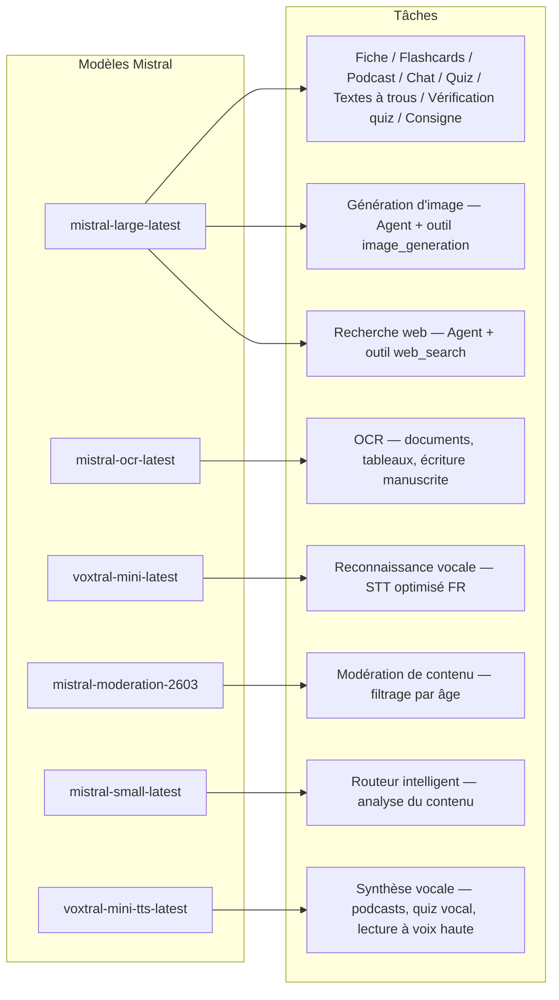
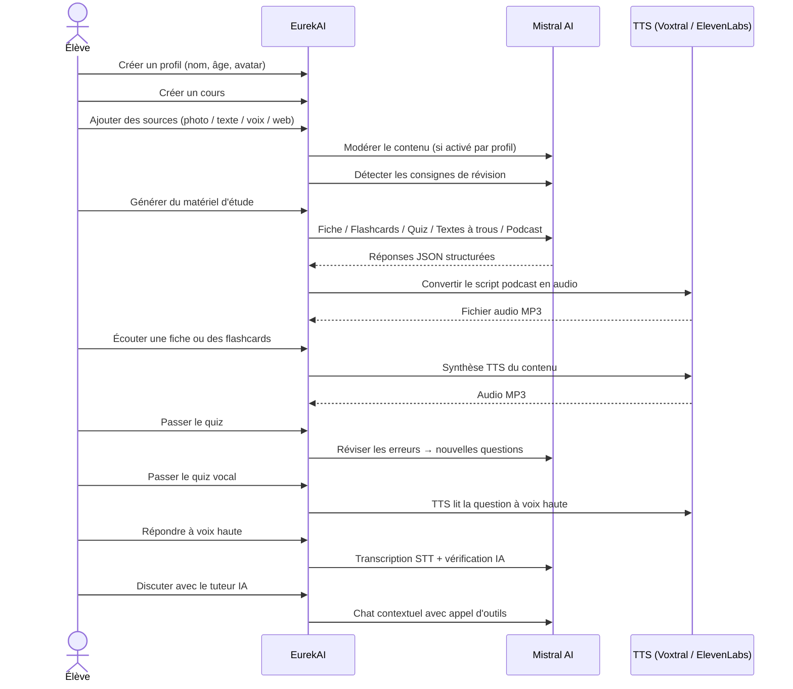

<p align="center">
  
</p>

<h1 align="center">EurekAI</h1>

<p align="center">
  <strong>あらゆるコンテンツをAIで駆動されるインタラクティブな学習体験に変換します。</strong>
</p>

<p align="center">
  <a href="https://mistral.ai"></a>
  <a href="https://www.typescriptlang.org"></a>
  <a href="https://mistral.ai"></a>
  <a href="https://elevenlabs.io"></a>
</p>

<p align="center">
  <a href="https://www.youtube.com/watch?v=_b1TQz2leoI">▶️ YouTubeでデモを見る</a> · <a href="README-en.md">🇬🇧 英語で読む</a>
</p>

<p align="center">
  <a href="https://sonarcloud.io/summary/new_code?id=jls42_EurekAI"></a>
  <a href="https://sonarcloud.io/summary/new_code?id=jls42_EurekAI"></a>
  <a href="https://sonarcloud.io/summary/new_code?id=jls42_EurekAI"></a>
  <a href="https://sonarcloud.io/summary/new_code?id=jls42_EurekAI"></a>
</p>
<p align="center">
  <a href="https://sonarcloud.io/summary/new_code?id=jls42_EurekAI"></a>
  <a href="https://sonarcloud.io/summary/new_code?id=jls42_EurekAI"></a>
  <a href="https://sonarcloud.io/summary/new_code?id=jls42_EurekAI"></a>
  <a href="https://sonarcloud.io/summary/new_code?id=jls42_EurekAI"></a>
</p>

---

## 由来 — なぜ EurekAI？

**EurekAI** は [Mistral AI Worldwide Hackathon](https://worldwidehackathon.mistral.ai/)（2026年3月）で誕生しました。テーマが必要で、着想はごく身近なところから来ました：娘のテスト準備をよく手伝っていて、AIを使えばもっと楽しくインタラクティブにできるはずだと考えたのです。

目的：あらゆる入力 — 教科書の写真、コピー＆ペーストしたテキスト、音声録音、ウェブ検索 — を取り込み、**復習ノート、フラッシュカード、クイズ、ポッドキャスト、穴埋め問題、イラストなど** に変換すること。すべてMistral AIのフランス製モデルで駆動されており、フランス語話者の生徒に自然に適したソリューションになっています。

コードの一行一行はハッカソン期間中に書かれました。すべてのAPIとオープンソースライブラリはハッカソンのルールに従って使用されています。

---

## 機能

| | 機能 | 説明 |
|---|---|---|
| 📷 | **OCR アップロード** | 教科書やノートを写真で撮ると、Mistral OCRが内容を抽出します |
| 📝 | **テキスト入力** | 任意のテキストを直接入力または貼り付け |
| 🎤 | **音声入力** | 録音するとVoxtral STTが音声を文字起こし |
| 🌐 | **ウェブ検索** | 質問を投げると、Mistralエージェントがウェブで回答を検索 |
| 📄 | **復習ノート** | 重要点、語彙、引用、逸話を含む構造化されたノート |
| 🃏 | **フラッシュカード** | 5〜50枚のQ/Aカード、出典参照付きで能動的な記憶を支援 |
| ❓ | **四択クイズ** | 5〜50問の択一式問題、誤答に応じた適応復習付き |
| ✏️ | **穴埋め問題** | ヒントと許容的な採点で完成させる練習問題 |
| 🎙️ | **ポッドキャスト** | 2声のミニポッドキャストをMistral Voxtral TTSで音声化 |
| 🖼️ | **イラスト** | Mistralエージェントが生成する教育用画像 |
| 🗣️ | **音声クイズ** | 問題を音声で読み上げ、口頭で回答するとAIが判定 |
| 💬 | **AIチューター** | コース資料に基づくコンテキストチャット、ツール呼び出し可 |
| 🧠 | **インテリジェントルーター** | AIが内容を分析し、7つの生成器の中から最適なものを推奨 |
| 🔒 | **ペアレンタルコントロール** | 年齢によるモデレーション、親用PIN、チャット制限 |
| 🌍 | **多言語対応** | インターフェースとAIコンテンツはフランス語と英語に対応 |
| 🔊 | **音声読み上げ** | 復習ノートやフラッシュカードをMistral Voxtral TTSまたはElevenLabsで再生 |

---

## アーキテクチャ概要


---

## モデル使用マップ



---

## ユーザーフロー



---

## 詳細 — 機能

### マルチモーダル入力

EurekAI は 4 種類のソースを受け付け、プロファイルに応じてモデレートされます（子どもとティーンはデフォルトで有効）：

- **OCR アップロード** — JPG、PNG、またはPDFファイルを `mistral-ocr-latest` で処理。印刷文字、表、手書き文字に対応。
- **自由テキスト** — 任意のコンテンツを入力または貼り付け。モデレーションが有効な場合は保存前に審査。
- **音声入力** — ブラウザで音声を録音。`voxtral-mini-latest` が文字起こしを行います。`language="fr"` パラメータが認識を最適化。
- **ウェブ検索** — クエリを入力。`web_search` ツールを持つ一時的な Mistral エージェントが結果を取得して要約します。

### AIコンテンツ生成

生成される学習教材は7種類：

| ジェネレータ | モデル | 出力 |
|---|---|---|
| **復習ノート** | `mistral-large-latest` | タイトル、要約、10〜25の重要点、語彙、引用、逸話 |
| **フラッシュカード** | `mistral-large-latest` | 5〜50枚のQ/Aカード、出典参照付きで能動学習向け |
| **四択クイズ** | `mistral-large-latest` | 5〜50問、各問4択、解説、適応復習 |
| **穴埋め問題** | `mistral-large-latest` | ヒント付きの穴埋め文、許容度の高い検証（Levenshtein） |
| **ポッドキャスト** | `mistral-large-latest` + Voxtral TTS | 2声のスクリプト → MP3音声 |
| **イラスト** | Agent `mistral-large-latest` | ツール `image_generation` による教育用画像 |
| **音声クイズ** | `mistral-large-latest` + Voxtral TTS + STT | TTSで問題読み上げ → STTで回答 → AIが検証 |

### チャットによるAIチューター

- `mistral-large-latest` を使用
- **ツール呼び出し**：会話中に復習ノート、フラッシュカード、クイズ、穴埋め問題を生成可能
- 各コースあたり50メッセージの履歴
- プロファイルで有効な場合はコンテンツのモデレーション

### 自動インテリジェントルーター

ルーターは `mistral-small-latest` を使用してソースの内容を分析し、7つの生成器の中から最も適切なものを推奨します — 生徒が手動で選ぶ必要がないように。インターフェースはリアルタイムで進行状況を表示します：まず分析フェーズ、続いて個別の生成処理（キャンセル可能）。

### 適応学習

- **クイズ統計**：各問題の試行回数と正答率を追跡
- **クイズ復習**：弱点に焦点を当てた5〜10問の新しい問題を生成
- **指示検出**：復習指示（"Je sais ma leçon si je sais..."）を検出し、全ジェネレータで優先

### セキュリティ & ペアレンタルコントロール

- **年齢グループ4つ**：子ども (≤10歳)、ティーン (11-15)、学生 (16-25)、大人 (26+)
- **コンテンツのモデレーション**：`mistral-moderation-2603` によるモデレーション。子ども/ティーンには 5 カテゴリ（sexual, hate, violence, selfharm, jailbreaking）をブロック。学生/大人には制限なし
- **親用PIN**：SHA-256でハッシュ化、15歳未満のプロファイルに必須
- **チャット制限**：16歳未満はデフォルトでAIチャット無効、保護者が有効化可能

### マルチプロファイルシステム

- 名前、年齢、アバター、言語設定を持つ複数のプロファイル
- `profileId` を介してプロファイルに紐づくプロジェクト
- カスケード削除：プロファイルを削除すると関連する全プロジェクトが削除される

### TTS（複数プロバイダ対応）

- **Mistral Voxtral TTS**（デフォルト）：`voxtral-mini-tts-latest`、追加のキー不要
- **ElevenLabs**（代替）：`eleven_v3`、自然な音声、`ELEVENLABS_API_KEY` が必要
- プロバイダはアプリ設定で変更可能

### 多言語化

- インターフェースはフランス語と英語で利用可能
- AIプロンプトは現状2言語（FR、EN）をサポートしており、15言語（es, de, it, pt, nl, ja, zh, ko, ar, hi, pl, ro, sv）に対応できるアーキテクチャを備えています
- 言語はプロファイルごとに設定可能

---

## 技術スタック

| 層 | 技術 | 役割 |
|---|---|---|
| **ランタイム** | Node.js + TypeScript 5.7 | サーバーと型安全性 |
| **バックエンド** | Express 4.21 | REST API |
| **開発サーバ** | Vite 7.3 + tsx | HMR、Handlebarsのパーシャル、プロキシ |
| **フロントエンド** | HTML + TailwindCSS 4.2 + Alpine.js 3.15 | リアクティブなUI、ViteでコンパイルされるTypeScript |
| **テンプレーティング** | vite-plugin-handlebars | パーシャルによるHTML構成 |
| **AI** | Mistral AI SDK 2.1 | チャット、OCR、STT、TTS、エージェント、モデレーション |
| **TTS（デフォルト）** | Mistral Voxtral TTS | `voxtral-mini-tts-latest`、組み込み音声合成 |
| **TTS（代替）** | ElevenLabs SDK 2.36 | `eleven_v3`、自然な音声 |
| **アイコン** | Lucide 0.575 | SVGアイコンライブラリ |
| **Markdown** | Marked 17 | チャットでのMarkdownレンダリング |
| **ファイルアップロード** | Multer 1.4 | マルチパートフォームの処理 |
| **オーディオ** | ffmpeg-static | オーディオセグメントの結合 |
| **テスト** | Vitest 4 | 単体テスト — カバレッジは SonarCloud で計測 |
| **永続化** | JSONファイル | 依存なしのストレージ |

---

## モデル参照

| モデル | 利用 | 理由 |
|---|---|---|
| `mistral-large-latest` | 復習ノート、フラッシュカード、ポッドキャスト、クイズ、穴埋め、チャット、音声クイズの検証、画像エージェント、ウェブ検索エージェント、指示検出 | 多言語対応が優れ、指示の追従性が高い |
| `mistral-ocr-latest` | ドキュメントOCR | 印刷文字、表、手書き文字 |
| `voxtral-mini-latest` | 音声認識 (STT) | 多言語STT、`language="fr"` で最適化 |
| `voxtral-mini-tts-latest` | 音声合成 (TTS) | ポッドキャスト、音声クイズ、読み上げ |
| `mistral-moderation-2603` | コンテンツモデレーション | 子ども/ティーン向けに5カテゴリをブロック (+ jailbreaking) |
| `mistral-small-latest` | インテリジェントルーター | ルーティング判断のための高速な内容分析 |
| `eleven_v3` (ElevenLabs) | 音声合成（代替TTS） | 自然な声、設定可能な代替手段 |

---

## クイックスタート

```bash
# Cloner le dépôt
git clone https://github.com/jls42/EurekAI.git
cd EurekAI

# Installer les dépendances
npm install

# Configurer les clés API
cp .env.example .env
# Éditez .env avec vos clés :
#   MISTRAL_API_KEY=votre_clé_ici           (requis)
#   ELEVENLABS_API_KEY=votre_clé_ici        (optionnel, TTS alternatif)

# Lancer le développement
npm run dev
# → Backend :  http://localhost:3000 (API)
# → Frontend : http://localhost:5173 (serveur Vite avec HMR)
```

> **注意**：Mistral Voxtral TTS がデフォルトプロバイダです — `MISTRAL_API_KEY` 以上の追加キーは不要。ElevenLabs は設定で選べる代替TTSプロバイダです。

---

## プロジェクト構成

```
server.ts                 — Point d'entrée Express, monte les routes + config
config.ts                 — Config runtime (modèles, voix, TTS provider), persistée dans output/config.json
store.ts                  — ProjectStore : CRUD projets/sources/générations, persistance JSON
profiles.ts               — ProfileStore : gestion des profils, hachage PIN
types.ts                  — Types TypeScript : Source, Generation (7 types), QuizStats, Profile
prompts.ts                — Tous les prompts IA centralisés (system + user templates, FR/EN)

generators/
  ocr.ts                  — Upload + OCR via Mistral (JPG, PNG, PDF)
  summary.ts              — Génération de fiche de révision (JSON structuré)
  flashcards.ts           — Flashcards Q/R (5-50, configurable)
  quiz.ts                 — Quiz QCM (5-50 questions, configurable) + révision adaptative
  fill-blank.ts           — Exercices à trous avec validation tolérante
  podcast.ts              — Script podcast 2 voix
  quiz-vocal.ts           — Quiz vocal : questions TTS + réponses STT + vérification IA
  image.ts                — Génération d'image via Agent Mistral (outil image_generation)
  chat.ts                 — Tuteur IA par chat avec appel d'outils
  router.ts               — Routeur automatique intelligent (contenu → générateurs recommandés)
  consigne.ts             — Détection de consignes de révision
  tts-provider.ts         — Dispatch TTS multi-provider (Mistral Voxtral / ElevenLabs)
  tts.ts                  — Génération audio podcast (concaténation de segments)
  stt.ts                  — Voxtral STT (audio → texte)
  websearch.ts            — Agent Mistral avec outil web_search
  moderation.ts           — Modération de contenu (filtrage par âge)

routes/
  projects.ts             — CRUD projets
  profiles.ts             — CRUD profils avec gestion du PIN
  sources.ts              — Upload OCR, texte libre, voix STT, recherche web, modération
  generate.ts             — Endpoints de génération (7 types + auto + route)
  generations.ts          — Tentatives de quiz/fill-blank, réponses vocales, lecture à voix haute
  chat.ts                 — Chat IA avec appel d'outils

helpers/
  index.ts                — safeParseJson, unwrapJsonArray, extractAllText, timer
  audio.ts                — collectStream (ReadableStream → Buffer)
  fill-blank-validate.ts  — Validation tolérante des réponses (normalisation, Levenshtein)

src/                      — Frontend (Vite + Handlebars)
  index.html              — Point d'entrée HTML principal
  main.ts                 — Entrée frontend (init Alpine.js + icônes Lucide)
  app/                    — Modules applicatifs Alpine.js
    state.ts              — Gestion d'état réactif
    navigation.ts         — Routage des vues + gardes par âge
    profiles.ts           — Logique du sélecteur de profils
    projects.ts           — CRUD des cours
    sources.ts            — Gestionnaires d'upload de sources
    generate.ts           — Déclencheurs de génération (individuel, tout, auto 2 phases)
    generations.ts        — Affichage + actions sur les générations
    chat.ts               — Interface de chat
    config.ts             — Interface de configuration (modèles, voix, TTS provider)
    render.ts             — Helpers de rendu HTML
    i18n.ts               — Changement de langue
    ...
  components/
    quiz.ts               — Composant quiz interactif
    quiz-vocal.ts         — Composant quiz vocal
    fill-blank.ts         — Composant textes à trous
    flashcards.ts         — Composant flashcards avec retournement
    step-by-step.ts       — Mixin navigation pas-à-pas (quiz, fill-blank, flashcards)
  i18n/
    fr.ts                 — Traductions françaises
    en.ts                 — Traductions anglaises
    index.ts              — Chargeur i18n
  partials/               — Partials HTML Handlebars (header, sidebar, dialogues, vues)
  styles/
    main.css              — Entrée TailwindCSS
    theme.css             — Variables de thème personnalisées

public/assets/            — Ressources statiques (logo, avatars)
output/                   — Données d'exécution (projets, config, fichiers audio)
```

---

## API リファレンス

### 設定
| メソッド | エンドポイント | 説明 |
|---|---|---|
| `GET` | `/api/config` | 現在の設定 |
| `PUT` | `/api/config` | 設定の変更（モデル、ボイス、TTSプロバイダ） |
| `GET` | `/api/config/status` | API のステータス（Mistral、ElevenLabs、TTS） |
| `POST` | `/api/config/reset` | デフォルト設定にリセット |
| `GET` | `/api/config/voices` | Mistral TTSのボイス一覧を取得（オプション `?lang=fr`） |

### プロファイル
| メソッド | エンドポイント | 説明 |
|---|---|---|
| `GET` | `/api/profiles` | すべてのプロファイルを一覧表示 |
| `POST` | `/api/profiles` | プロファイルを作成 |
| `PUT` | `/api/profiles/:id` | プロファイルを編集（< 15歳はPIN必須） |
| `DELETE` | `/api/profiles/:id` | プロファイルを削除 + プロジェクトのカスケード削除 |

### プロジェクト
| メソッド | エンドポイント | 説明 |
|---|---|---|
| `GET` | `/api/projects` | プロジェクト一覧 |
| `POST` | `/api/projects` | プロジェクト作成 `{name, profileId}` |
| `GET` | `/api/projects/:pid` | プロジェクト詳細 |
| `PUT` | `/api/projects/:pid` | 名前変更 `{name}` |
| `DELETE` | `/api/projects/:pid` | プロジェクト削除 |

### ソース
| メソッド | エンドポイント | 説明 |
|---|---|---|
| `POST` | `/api/projects/:pid/sources/upload` | OCRアップロード（マルチパートファイル） |
| `POST` | `/api/projects/:pid/sources/text` | 自由テキスト `{text}` |
| `POST` | `/api/projects/:pid/sources/voice` | 音声STT（マルチパート音声） |
| `POST` | `/api/projects/:pid/sources/websearch` | ウェブ検索 `{query}` |
| `DELETE` | `/api/projects/:pid/sources/:sid` | ソースを削除 |
| `POST` | `/api/projects/:pid/moderate` | モデレーション `{text}` |
| `POST` | `/api/projects/:pid/detect-consigne` | 復習指示を検出 |

### 生成
| メソッド | エンドポイント | 説明 |
|---|---|---|
| `POST` | `/api/projects/:pid/generate/summary` | 復習ノート |
| `POST` | `/api/projects/:pid/generate/flashcards` | フラッシュカード |
| `POST` | `/api/projects/:pid/generate/quiz` | 四択クイズ |
| `POST` | `/api/projects/:pid/generate/fill-blank` | 穴埋め問題 |
| `POST` | `/api/projects/:pid/generate/podcast` | ポッドキャスト |
| `POST` | `/api/projects/:pid/generate/image` | イラスト |
| `POST` | `/api/projects/:pid/generate/quiz-vocal` | 音声クイズ |
| `POST` | `/api/projects/:pid/generate/quiz-review` | 適応復習 `{generationId, weakQuestions}` |
| `POST` | `/api/projects/:pid/generate/route` | ルーティング分析（どのジェネレータを実行するかのプラン） |
| `POST` | `/api/projects/:pid/generate/auto` | 自動バックエンド生成（ルーティング + 5 種類：summary, flashcards, quiz, fill-blank, podcast） |

すべての生成ルートは `{sourceIds?, lang?, ageGroup?, count?, useConsigne?}` を受け付けます。

### CRUD 生成
| メソッド | エンドポイント | 説明 |
|---|---|---|
| `POST` | `/api/projects/:pid/generations/:gid/quiz-attempt` | クイズの回答を送信 `{answers}` |
| `POST` | `/api/projects/:pid/generations/:gid/fill-blank-attempt` | 穴埋め回答を送信 `{answers}` |
| `POST` | `/api/projects/:pid/generations/:gid/vocal-answer` | 口頭回答を検証（音声 + questionIndex） |
| `POST` | `/api/projects/:pid/generations/:gid/read-aloud` | TTSでの読み上げ（復習ノート/フラッシュカード） |
| `PUT` | `/api/projects/:pid/generations/:gid` | 名前変更 `{title}` |
| `DELETE` | `/api/projects/:pid/generations/:gid` | 生成を削除 |

### チャット
| メソッド | エンドポイント | 説明 |
|---|---|---|
| `GET` | `/api/projects/:pid/chat` | チャット履歴を取得 |
| `POST` | `/api/projects/:pid/chat` | メッセージを送信 `{message, lang, ageGroup}` |
| `DELETE` | `/api/projects/:pid/chat` | チャット履歴を消去 |

---

## アーキテクチャ上の決定

| 決定 | 理由 |
|---|---|
| **React/VueではなくAlpine.jsを採用** | 軽量なフットプリント、ViteでコンパイルされるTypeScriptと組み合わせた軽いリアクティビティ。スピードが重要なハッカソンに最適。 |
| **JSONファイルによる永続化** | 依存なしで即起動可能。データベース設定不要 — すぐに始められます。 |
| **Vite + Handlebars** | 両者の利点を活かす：開発時の高速HMR、コード整理のためのHTMLパーシャル、TailwindのJIT。 |
| **プロンプトの中央管理** | すべてのAIプロンプトを `prompts.ts` に集約 — 言語や年齢グループごとに反復・テスト・調整が容易。 | |
| **マルチ世代システム** | 各世代は固有のIDを持つ独立したオブジェクトです — コースごとに複数のカードやクイズなどを作成できます。 |
| **年齢別に調整されたプロンプト** | 語彙、複雑さ、語調が異なる4つの年齢グループ — 同じ内容でも学習者によって異なる教え方をします。 |
| **エージェントベースの機能** | 画像生成とウェブ検索は一時的なMistralエージェントを使用します — ライフサイクルが分離され自動でクリーンアップされます。 |
| **マルチプロバイダTTS** | デフォルトはMistral Voxtral TTS（追加のキー不要）、代替としてElevenLabs — 再起動なしで設定可能。 |

---

## クレジット & 謝辞

- **[Mistral AI](https://mistral.ai)** — AIモデル（Large, OCR, Voxtral STT, Voxtral TTS, Moderation, Small）＋Worldwide Hackathon
- **[ElevenLabs](https://elevenlabs.io)** — 代替音声合成エンジン (`eleven_v3`)
- **[Alpine.js](https://alpinejs.dev)** — 軽量リアクティブフレームワーク
- **[TailwindCSS](https://tailwindcss.com)** — ユーティリティCSSフレームワーク
- **[Vite](https://vitejs.dev)** — フロントエンドビルドツール
- **[Lucide](https://lucide.dev)** — アイコンライブラリ
- **[Marked](https://marked.js.org)** — Markdownパーサー

2026年3月のMistral AI Worldwide Hackathonで丁寧に構築されました。

---

## 著者

**Julien LS** — [contact@jls42.org](mailto:contact@jls42.org)

## ライセンス

[AGPL-3.0](LICENSE) — 著作権 (C) 2026 Julien LS

**この文書は gpt-5-mini モデルを使用して fr 版から ja 言語に翻訳されました。翻訳プロセスの詳細については https://gitlab.com/jls42/ai-powered-markdown-translator をご覧ください。**

