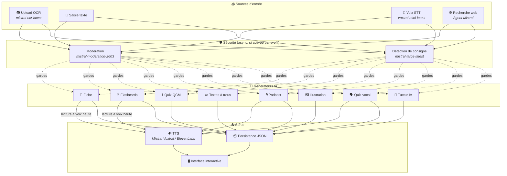
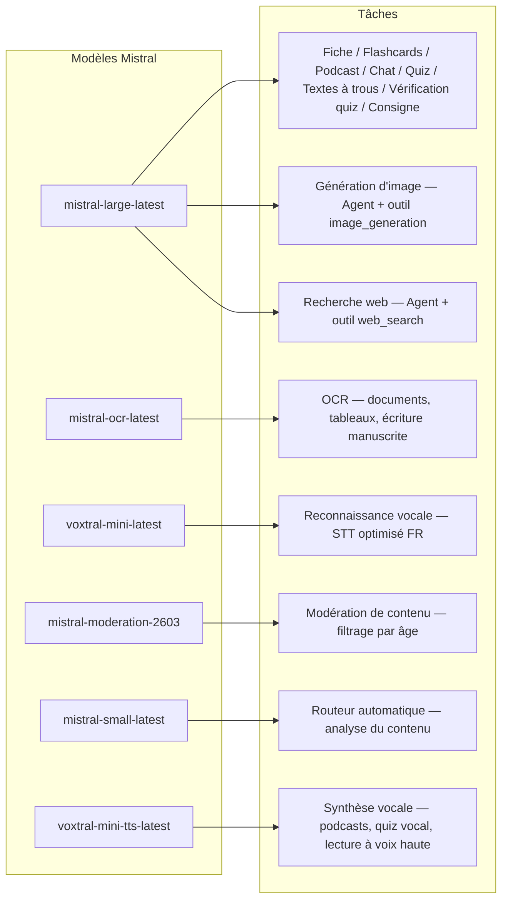
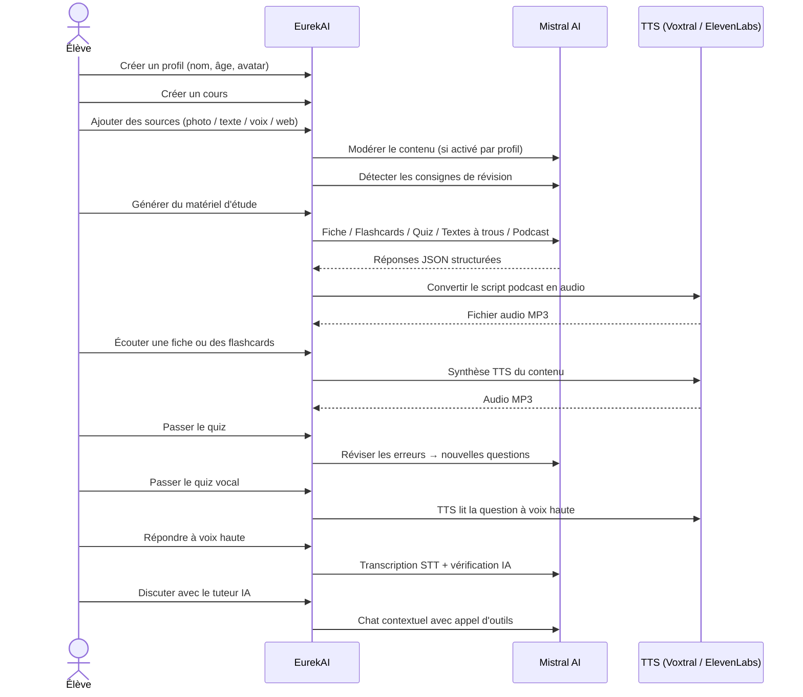

<p align="center">
  
</p>

<h1 align="center">EurekAI</h1>

<p align="center">
  <strong>あらゆるコンテンツをインタラクティブな学習体験に変換 — <a href="https://mistral.ai">Mistral AI</a> によって実現。</strong>
</p>

<p align="center">
  <a href="README-en.md">🇬🇧 英語</a> · <a href="README-es.md">🇪🇸 スペイン語</a> · <a href="README-pt.md">🇧🇷 ポルトガル語</a> · <a href="README-de.md">🇩🇪 ドイツ語</a> · <a href="README-it.md">🇮🇹 イタリア語</a> · <a href="README-nl.md">🇳🇱 オランダ語</a> · <a href="README-ar.md">🇸🇦 アラビア語</a><br>
  <a href="README-hi.md">🇮🇳 ヒンディー語</a> · <a href="README-zh.md">🇨🇳 中国語</a> · <a href="README-ja.md">🇯🇵 日本語</a> · <a href="README-ko.md">🇰🇷 韓国語</a> · <a href="README-pl.md">🇵🇱 ポーランド語</a> · <a href="README-ro.md">🇷🇴 ルーマニア語</a> · <a href="README-sv.md">🇸🇪 スウェーデン語</a>
</p>

<p align="center">
  <a href="https://www.youtube.com/watch?v=_b1TQz2leoI"></a>
</p>

<h4 align="center">📊 コード品質</h4>

<p align="center">
  <a href="https://sonarcloud.io/summary/new_code?id=jls42_EurekAI"></a>
  <a href="https://sonarcloud.io/summary/new_code?id=jls42_EurekAI"></a>
  <a href="https://sonarcloud.io/summary/new_code?id=jls42_EurekAI"></a>
  <a href="https://sonarcloud.io/summary/new_code?id=jls42_EurekAI"></a>
</p>
<p align="center">
  <a href="https://sonarcloud.io/summary/new_code?id=jls42_EurekAI"></a>
  <a href="https://sonarcloud.io/summary/new_code?id=jls42_EurekAI"></a>
  <a href="https://sonarcloud.io/summary/new_code?id=jls42_EurekAI"></a>
  <a href="https://sonarcloud.io/summary/new_code?id=jls42_EurekAI"></a>
</p>

---

## 背景 — なぜ EurekAI？

**EurekAI** は [Mistral AI Worldwide Hackathon](https://luma.com/mistralhack-online)（[公式サイト](https://worldwide-hackathon.mistral.ai/)）中（2026年3月）に生まれました。テーマが必要で、きっかけは非常に日常的なものでした：私は娘のテスト対策をよく手伝うのですが、これをAIでより楽しくインタラクティブにできないかと思ったのです。

目的：写真（教科書のページ）、コピー＆ペーストしたテキスト、音声録音、ウェブ検索など「どんな入力でも」受け取り、それを **復習ノート、フラッシュカード、クイズ、ポッドキャスト、穴埋め問題、イラストなど** に変換すること。すべて Mistral AI のフランス語系モデルで駆動されており、フランス語話者の生徒に自然に適したソリューションになっています。

プロジェクトはハッカソン中に開始され、その後も改良を続けています。コードの大部分はAIによって生成されており、主に [Claude Code](https://docs.anthropic.com/en/docs/claude-code) を使用し、一部は [Codex](https://openai.com/index/introducing-codex/) による貢献があります。

---

## 機能

| | 機能 | 説明 |
|---|---|---|
| 📷 | **Upload OCR** | 教科書やノートを写真で撮影 — Mistral OCR が内容を抽出 |
| 📝 | **テキスト入力** | どんなテキストでも直接入力または貼り付け |
| 🎤 | **音声入力** | 録音 — Voxtral STT が音声を文字起こし |
| 🌐 | **ウェブ検索** | 質問を入力 — 一時的な Mistral エージェントがウェブで回答を検索 |
| 📄 | **復習ノート** | 重要ポイント、語彙、引用、逸話を含む構造化されたノート |
| 🃏 | **フラッシュカード** | 5〜50枚のQ/Aカード、出典参照でアクティブリコールを支援 |
| ❓ | **選択式クイズ** | 5〜50問の選択式問題、誤答に基づく適応的復習 |
| ✏️ | **穴埋め問題** | ヒントと許容入力で検証する穴埋め演習 |
| 🎙️ | **ポッドキャスト** | 2音声のミニポッドキャストを Mistral Voxtral TTS で音声化 |
| 🖼️ | **イラスト** | 教育用画像を Mistral エージェントが生成 |
| 🗣️ | **音声クイズ** | 問題を音声で読み上げ、口頭で回答、AIが検証 |
| 💬 | **AIチューター** | コース資料にコンテキストを持ったチャット、ツール呼び出し対応 |
| 🧠 | **自動ルーティング** | `mistral-small-latest` に基づくルーターが内容を分析し、7種類のジェネレータから組み合わせを提案 |
| 🔒 | **ペアレンタルコントロール** | 年齢によるモデレーション、保護者PIN、チャット制限 |
| 🌍 | **多言語対応** | インターフェイスは9言語対応；プロンプトで15言語の生成が可能 |
| 🔊 | **音声読み上げ** | Mistral Voxtral TTS または ElevenLabs でノートやフラッシュカードを再生 |

---

## アーキテクチャ概要



---

## モデル使用マップ



---

## ユーザーフロー



---

## 詳細な機能解説

### マルチモーダル入力

EurekAI は4種類のソースを受け入れ、プロファイルに応じてモデレーション（子供・ティーンはデフォルトで有効）されます：

- **Upload OCR** — JPG、PNG、PDF ファイルを `mistral-ocr-latest` で処理。印刷されたテキスト、表、手書き文字を扱います。
- **自由テキスト** — 任意のコンテンツを入力または貼り付け。保存前にモデレーションが有効なら検査されます。
- **音声入力** — ブラウザでオーディオを録音。`voxtral-mini-latest` で文字起こし。`language="fr"` の設定が認識精度を最適化します。
- **ウェブ検索** — クエリを入力。`web_search` ツールを持つ一時的な Mistral エージェントが結果を取得して要約します。

### AIコンテンツ生成

生成される学習教材は7種類：

| ジェネレータ | モデル | 出力 |
|---|---|---|
| **復習ノート** | `mistral-large-latest` | タイトル、要約、10〜25の要点、語彙、引用、逸話 |
| **フラッシュカード** | `mistral-large-latest` | 5〜50枚のQ/Aカード、出典参照付き |
| **選択式クイズ** | `mistral-large-latest` | 5〜50問、各4選択、解説、適応的復習 |
| **穴埋め問題** | `mistral-large-latest` | ヒント付きの文章穴埋め、許容入力（Levenshtein）で検証 |
| **ポッドキャスト** | `mistral-large-latest` + Voxtral TTS | 2音声のスクリプト → MP3 音声 |
| **イラスト** | Agent `mistral-large-latest` | ツール `image_generation` による教育用画像 |
| **音声クイズ** | `mistral-large-latest` + Voxtral TTS + STT | TTSで問題 → STTで回答 → AIが検証 |

### チャット型AIチューター

コース資料にフルアクセスできる対話型チューター：

- `mistral-large-latest` を使用
- ツール呼び出し：会話中にノート、フラッシュカード、クイズ、穴埋め問題を生成可能
- コースごとに50メッセージの履歴
- プロファイルでモデレーションが有効なら内容を検閲

### 自動ルーター

ルーターは `mistral-small-latest` を使ってソースの内容を分析し、7種類のジェネレータの中から最適なものを提案します。UI はリアルタイムで進捗を表示：まず分析フェーズ、その後個別生成が行われ、キャンセルも可能です。

### 適応学習

- **クイズ統計**：設問ごとの試行回数と正答率を追跡
- **クイズ復習**：弱点を狙った5〜10問を生成
- **指示検出**：復習の指示（「Je sais ma leçon si je sais...」のようなもの）を検出し、互換性のあるテキスト系ジェネレータ（ノート、フラッシュカード、クイズ、穴埋め）で優先処理

### セキュリティとペアレンタルコントロール

- **4つの年齢グループ**：子供（≤10歳）、ティーン（11-15）、学生（16-25）、大人（26+）
- **コンテンツモデレーション**：`mistral-moderation-2603` による検査。子供/ティーン用には5カテゴリ（sexual、hate、violence、selfharm、jailbreaking）をブロック。学生/大人には制限なし
- **保護者PIN**：SHA-256 ハッシュ、15歳未満のプロファイルで必要。実運用ではソルト付きの遅延ハッシュ（Argon2id、bcrypt）を推奨
- **チャット制限**：16歳未満はデフォルトでAIチャット無効、保護者が有効化可能

### マルチプロファイルシステム

- 名前、年齢、アバター、言語設定を持つ複数プロファイル対応
- プロファイルに紐づくプロジェクトは `profileId`
- カスケード削除：プロファイルを削除するとすべてのプロジェクトが削除されます

### 複数TTSプロバイダ

- **Mistral Voxtral TTS**（デフォルト）：`voxtral-mini-tts-latest`、追加キー不要
- **ElevenLabs**（代替）：`eleven_v3`、自然な音声だが `ELEVENLABS_API_KEY` を要する
- プロバイダはアプリ設定で切替可能

### 国際化

- インターフェイスは9言語対応：fr, en, es, pt, it, nl, de, hi, ar
- AIプロンプトは15言語をサポート（fr, en, es, de, it, pt, nl, ja, zh, ko, ar, hi, pl, ro, sv）
- 言語はプロファイルごとに設定可能

---

## 技術スタック

| レイヤー | 技術 | 役割 |
|---|---|---|
| **ランタイム** | Node.js + TypeScript 5.x | サーバーと型安全 |
| **バックエンド** | Express 4.x | REST API |
| **開発サーバ** | Vite 7.x + tsx | HMR、Handlebars partials、プロキシ |
| **フロントエンド** | HTML + TailwindCSS 4.x + Alpine.js 3.x | リアクティブUI、TypeScriptはViteでコンパイル |
| **テンプレーティング** | vite-plugin-handlebars | partials による HTML 組成 |
| **AI** | Mistral AI SDK 2.x | チャット、OCR、STT、TTS、エージェント、モデレーション |
| **TTS（デフォルト）** | Mistral Voxtral TTS | `voxtral-mini-tts-latest`、統合された音声合成 |
| **TTS（代替）** | ElevenLabs SDK 2.x | `eleven_v3`、自然音声 |
| **アイコン** | Lucide | SVG アイコンライブラリ |
| **Markdown** | Marked | チャット内の Markdown レンダリング |
| **ファイルアップロード** | Multer 1.4 LTS | multipart フォーム処理 |
| **オーディオ** | ffmpeg-static | オーディオセグメントの連結 |
| **テスト** | Vitest | ユニットテスト — SonarCloud でカバレッジ計測 |
| **永続化** | JSON ファイル | 依存なしのストレージ |

---

## モデル参照

| モデル | 用途 | 理由 |
|---|---|---|
| `mistral-large-latest` | ノート、フラッシュカード、ポッドキャスト、クイズ、穴埋め、チャット、音声クイズ検証、画像エージェント、ウェブ検索エージェント、指示検出 | 多言語対応かつ指示追従性が高い |
| `mistral-ocr-latest` | ドキュメントOCR | 印刷文字、表、手書き |
| `voxtral-mini-latest` | 音声認識（STT） | 多言語STT、`language="fr"` と併用で最適化 |
| `voxtral-mini-tts-latest` | 音声合成（TTS） | ポッドキャスト、音声クイズ、読み上げ |
| `mistral-moderation-2603` | コンテンツモデレーション | 子供/ティーン向けに5カテゴリと jailbreaking をブロック |
| `mistral-small-latest` | 自動ルーター | ルーティング判定のための高速分析 |
| `eleven_v3` (ElevenLabs) | 音声合成（代替TTS） | 自然な音声、設定で切替可能 |

---

## クイックスタート

```bash
# Cloner le dépôt
git clone https://github.com/jls42/EurekAI.git
cd EurekAI

# Installer les dépendances
npm install

# Configurer les clés API
cp .env.example .env
# Éditez .env avec vos clés :
#   MISTRAL_API_KEY=votre_clé_ici           (requis)
#   ELEVENLABS_API_KEY=votre_clé_ici        (optionnel, TTS alternatif)
#   SONAR_TOKEN=...                          (optionnel, CI SonarCloud uniquement)

# Lancer le développement
npm run dev
# → Backend :  http://localhost:3000 (API)
# → Frontend : http://localhost:5173 (serveur Vite avec HMR)
```

> **注**：Mistral Voxtral TTS はデフォルトのプロバイダです — `MISTRAL_API_KEY` 以外に追加の鍵は不要です。ElevenLabs は設定で選べる代替のTTSプロバイダです。

---

## プロジェクト構成

```
server.ts                 — Point d'entrée Express, monte les routes + config
config.ts                 — Config runtime (modèles, voix, TTS provider), persistée dans output/config.json
store.ts                  — ProjectStore : CRUD projets/sources/générations, persistance JSON
profiles.ts               — ProfileStore : gestion des profils, hachage PIN
types.ts                  — Types TypeScript : Source, Generation (7 types), QuizStats, Profile
prompts.ts                — Tous les prompts IA centralisés (system + user templates, 15 langues)

generators/
  ocr.ts                  — Upload + OCR via Mistral (JPG, PNG, PDF)
  summary.ts              — Génération de fiche de révision (JSON structuré)
  flashcards.ts           — Flashcards Q/R (5-50, configurable)
  quiz.ts                 — Quiz QCM (5-50 questions, configurable) + révision adaptative
  fill-blank.ts           — Exercices à trous avec validation tolérante
  podcast.ts              — Script podcast 2 voix
  quiz-vocal.ts           — Quiz vocal : questions TTS + réponses STT + vérification IA
  image.ts                — Génération d'image via Agent Mistral (outil image_generation)
  chat.ts                 — Tuteur IA par chat avec appel d'outils
  router.ts               — Routeur automatique (contenu → générateurs recommandés)
  consigne.ts             — Détection de consignes de révision
  tts-provider.ts         — Dispatch TTS multi-provider (Mistral Voxtral / ElevenLabs)
  tts.ts                  — Génération audio podcast (concaténation de segments)
  stt.ts                  — Voxtral STT (audio → texte)
  websearch.ts            — Agent Mistral avec outil web_search
  moderation.ts           — Modération de contenu (filtrage par âge)

routes/
  projects.ts             — CRUD projets
  profiles.ts             — CRUD profils avec gestion du PIN
  sources.ts              — Upload OCR, texte libre, voix STT, recherche web, modération
  generate.ts             — Endpoints de génération (7 types + auto + route)
  generations.ts          — Tentatives de quiz/fill-blank, réponses vocales, lecture à voix haute
  chat.ts                 — Chat IA avec appel d'outils

helpers/
  index.ts                — safeParseJson, unwrapJsonArray, extractAllText, timer
  audio.ts                — collectStream (ReadableStream → Buffer)
  fill-blank-validate.ts  — Validation tolérante des réponses (normalisation, Levenshtein)

src/                      — Frontend (Vite + Handlebars)
  index.html              — Point d'entrée HTML principal
  main.ts                 — Entrée frontend (init Alpine.js + icônes Lucide)
  app/                    — Modules applicatifs Alpine.js
    state.ts              — Gestion d'état réactif
    navigation.ts         — Routage des vues + gardes par âge
    profiles.ts           — Logique du sélecteur de profils
    projects.ts           — CRUD des cours
    sources.ts            — Gestionnaires d'upload de sources
    generate.ts           — Déclencheurs de génération (individuel, tout, auto 2 phases)
    generations.ts        — Affichage + actions sur les générations
    chat.ts               — Interface de chat
    config.ts             — Interface de configuration (modèles, voix, TTS provider)
    render.ts             — Helpers de rendu HTML
    i18n.ts               — Changement de langue
    ...
  components/
    quiz.ts               — Composant quiz interactif
    quiz-vocal.ts         — Composant quiz vocal
    fill-blank.ts         — Composant textes à trous
    flashcards.ts         — Composant flashcards avec retournement
    step-by-step.ts       — Mixin navigation pas-à-pas (quiz, fill-blank, flashcards)
  i18n/
    fr.ts, en.ts, es.ts, — Dictionnaires par langue (9 langues)
    pt.ts, it.ts, nl.ts,
    de.ts, hi.ts, ar.ts
    languages.ts          — Registre des langues UI disponibles
    index.ts              — Chargeur i18n
  partials/               — Partials HTML Handlebars (header, sidebar, dialogues, vues)
  styles/
    main.css              — Entrée TailwindCSS
    theme.css             — Variables de thème personnalisées

public/assets/            — Ressources statiques (logo, avatars)
output/                   — Données d'exécution (projets, config, fichiers audio)
```

---

## APIリファレンス

### 設定
| メソッド | エンドポイント | 説明 |
|---|---|---|
| `GET` | `/api/config` | 現在の設定を取得 |
| `PUT` | `/api/config` | 設定を変更（モデル、音声、TTSプロバイダ） |
| `GET` | `/api/config/status` | APIのステータス（Mistral、ElevenLabs、TTS） |
| `POST` | `/api/config/reset` | 設定をデフォルトにリセット |
| `GET` | `/api/config/voices` | Mistral TTS の音声一覧を取得（オプション `?lang=fr`） |

### プロファイル
| メソッド | エンドポイント | 説明 |
|---|---|---|
| `GET` | `/api/profiles` | すべてのプロファイルを一覧表示 |
| `POST` | `/api/profiles` | プロファイルを作成 |
| `PUT` | `/api/profiles/:id` | プロファイルを編集（15歳未満はPIN必須） |
| `DELETE` | `/api/profiles/:id` | プロファイルと関連プロジェクトを削除（`{pin?}` → `{ok, deletedProjects}`） |

### プロジェクト
| メソッド | エンドポイント | 説明 |
|---|---|---|
| `GET` | `/api/projects` | プロジェクトを一覧表示（`?profileId=` はオプション） |
| `POST` | `/api/projects` | プロジェクトを作成 `{name, profileId}` |
| `GET` | `/api/projects/:pid` | プロジェクトの詳細 |
| `PUT` | `/api/projects/:pid` | 名前変更 `{name}` |
| `DELETE` | `/api/projects/:pid` | プロジェクトを削除 |

### ソース
| メソッド | エンドポイント | 説明 |
|---|---|---|
| `POST` | `/api/projects/:pid/sources/upload` | Upload OCR（multipart ファイル） |
| `POST` | `/api/projects/:pid/sources/text` | 自由テキスト `{text}` |
| `POST` | `/api/projects/:pid/sources/voice` | 音声 STT（multipart オーディオ） |
| `POST` | `/api/projects/:pid/sources/websearch` | ウェブ検索 `{query}` |
| `DELETE` | `/api/projects/:pid/sources/:sid` | ソースを削除 |
| `POST` | `/api/projects/:pid/moderate` | モデレート `{text}` |
| `POST` | `/api/projects/:pid/detect-consigne` | 復習指示を検出 |

### 生成
| メソッド | エンドポイント | 説明 |
|---|---|---|
| `POST` | `/api/projects/:pid/generate/summary` | 復習ノート |
| `POST` | `/api/projects/:pid/generate/flashcards` | フラッシュカード |
| `POST` | `/api/projects/:pid/generate/quiz` | 選択式クイズ |
| `POST` | `/api/projects/:pid/generate/fill-blank` | 穴埋め問題 |
| `POST` | `/api/projects/:pid/generate/podcast` | ポッドキャスト |
| `POST` | `/api/projects/:pid/generate/image` | イラスト |
| `POST` | `/api/projects/:pid/generate/quiz-vocal` | 音声クイズ |
| `POST` | `/api/projects/:pid/generate/quiz-review` | 適応的復習 `{generationId, weakQuestions}` |
| `POST` | `/api/projects/:pid/generate/route` | ルーティング分析（起動するジェネレータ計画） |
| `POST` | `/api/projects/:pid/generate/auto` | 自動バックエンド生成（ルーティング + 5タイプ：summary, flashcards, quiz, fill-blank, podcast） |

すべての生成ルートは `{sourceIds?, lang?, ageGroup?, count?, useConsigne?}` を受け入れます。`quiz-review` はさらに `{generationId, weakQuestions}` を必要とします。

### CRUD 生成
| メソッド | エンドポイント | 説明 |
|---|---|---|
| `POST` | `/api/projects/:pid/generations/:gid/quiz-attempt` | クイズの回答を送信 `{answers}` |
| `POST` | `/api/projects/:pid/generations/:gid/fill-blank-attempt` | 穴埋め回答を送信 `{answers}` |
| `POST` | `/api/projects/:pid/generations/:gid/vocal-answer` | 口頭回答を検証（オーディオ + questionIndex） |
| `POST` | `/api/projects/:pid/generations/:gid/read-aloud` | TTSでの読み上げ（ノート/フラッシュカード） |
| `PUT` | `/api/projects/:pid/generations/:gid` | 名前変更 `{title}` |
| `DELETE` | `/api/projects/:pid/generations/:gid` | 生成を削除 |

### チャット
| メソッド | エンドポイント | 説明 |
|---|---|---|
| `GET` | `/api/projects/:pid/chat` | チャット履歴を取得 |
| `POST` | `/api/projects/:pid/chat` | メッセージを送信 `{message, lang, ageGroup}` |
| `DELETE` | `/api/projects/:pid/chat` | チャット履歴を消去 |

---

## アーキテクチャ上の決定

| 決定 | 正当化 |
|---|---|
| **Alpine.js を選択（React/Vue ではなく）** | フットプリントが小さく、TypeScript と Vite による軽量なリアクティビティ。ハッカソンでのスピードを重視するには最適。 |
| **永続化を JSON ファイルに** | 依存がなく、即起動可能。データベースの設定が不要で、すぐに始められる。 |
| **Vite + Handlebars** | 両者の長所を活かす：開発向けの高速なHMR、コード整理のためのHTMLパーシャル、TailwindのJIT。 |
| **Prompts centralisés** | すべてのAIプロンプトが`prompts.ts`に集約 — 言語や年齢層ごとに反復、テスト、調整が容易。 |
| **Système multi-générations** | 各生成は独立したIDを持つオブジェクト — コースごとに複数の学習カードやクイズなどを可能にする。 |
| **Prompts adaptés par âge** | 4つの年齢グループで語彙、複雑さ、口調を変化 — 同じコンテンツが学習者に応じて異なる教え方になる。 |
| **Fonctionnalités basées sur les Agents** | 画像生成とウェブ検索は一時的なMistralエージェントを使用 — ライフサイクルが分離され自動クリーンアップ。 |
| **TTS multi-provider** | デフォルトは Mistral Voxtral TTS（追加キー不要）、代替は ElevenLabs — 再起動不要で設定可能。 |

---

## クレジットと謝辞

- **[Mistral AI](https://mistral.ai)** — AIモデル（Large、OCR、Voxtral STT、Voxtral TTS、Moderation、Small）＋Worldwide Hackathon
- **[ElevenLabs](https://elevenlabs.io)** — 代替の音声合成エンジン（`eleven_v3`）
- **[Alpine.js](https://alpinejs.dev)** — 軽量リアクティブフレームワーク
- **[TailwindCSS](https://tailwindcss.com)** — ユーティリティファーストなCSSフレームワーク
- **[Vite](https://vitejs.dev)** — フロントエンドビルドツール
- **[Lucide](https://lucide.dev)** — アイコンライブラリ
- **[Marked](https://marked.js.org)** — Markdownパーサー

Mistral AI Worldwide Hackathon（2026年3月）で開始、Claude Code と Codex を用いてAIだけで完全に開発されました。

---

## 著者

**Julien LS** — [contact@jls42.org](mailto:contact@jls42.org)

## ライセンス

[AGPL-3.0](LICENSE) — 著作権 (C) 2026 Julien LS

**この文書は gpt-5-mini モデルを使用して fr 版から ja 言語へ翻訳されました。翻訳プロセスの詳細については https://gitlab.com/jls42/ai-powered-markdown-translator をご覧ください。**

