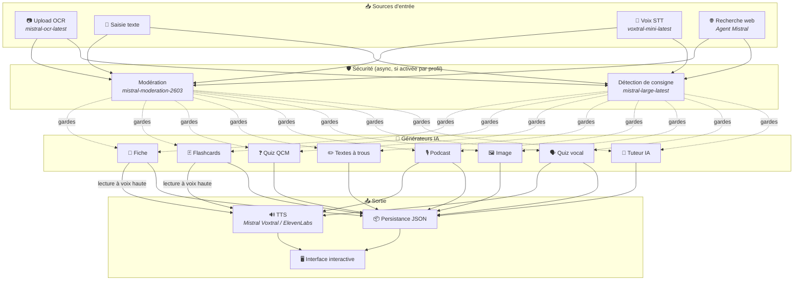
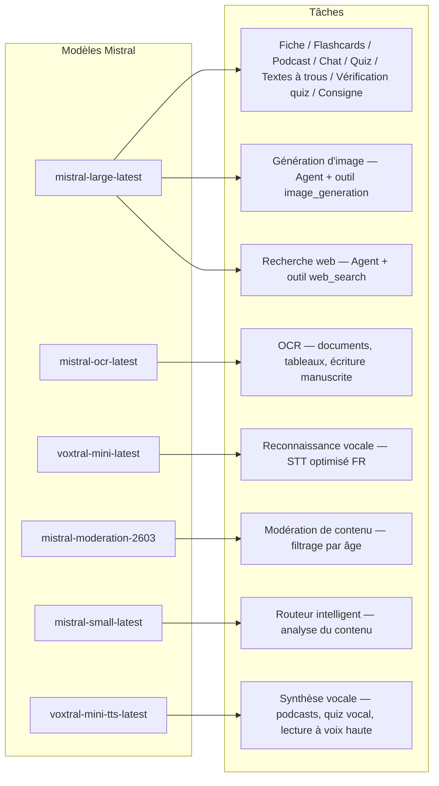
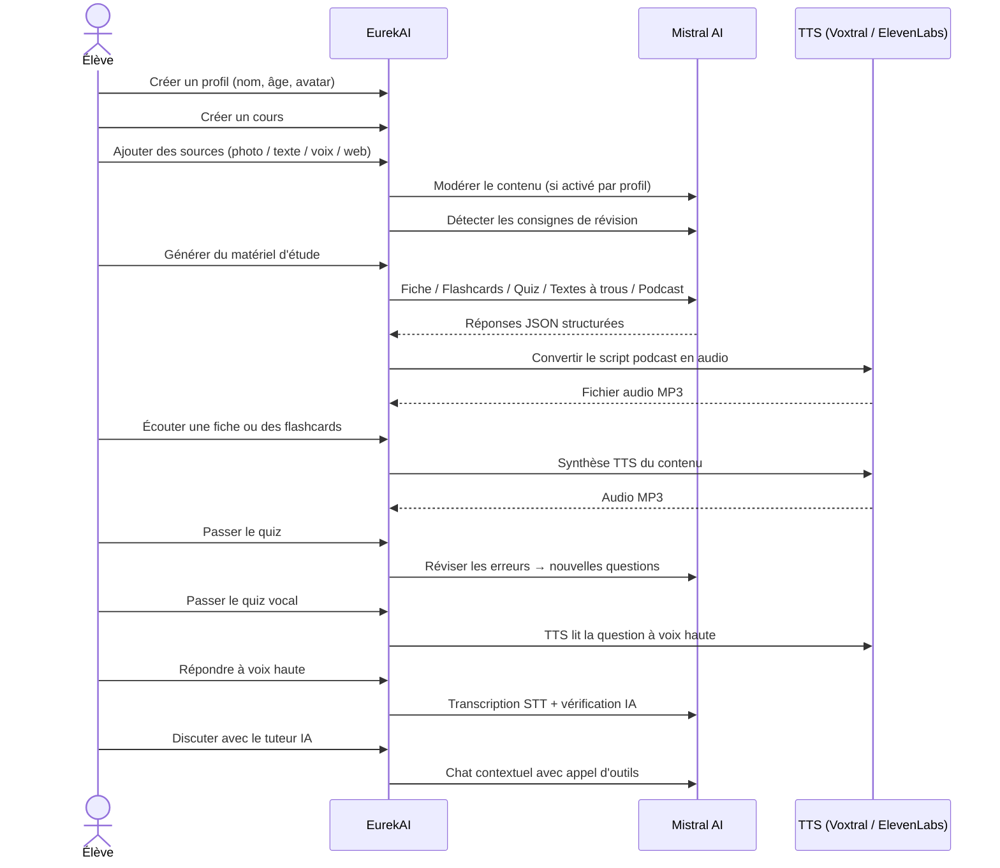

<p align="center">
  
</p>

<h1 align="center">EurekAI</h1>

<p align="center">
  <strong>어떤 콘텐츠든 인터랙티브 학습 경험으로 전환 — <a href="https://mistral.ai">Mistral AI</a>로 구동됩니다.</strong>
</p>

<p align="center">
  <a href="README-en.md">🇬🇧 영어</a> · <a href="README-es.md">🇪🇸 스페인어</a> · <a href="README-pt.md">🇧🇷 포르투갈어</a> · <a href="README-de.md">🇩🇪 독일어</a> · <a href="README-it.md">🇮🇹 이탈리아어</a> · <a href="README-nl.md">🇳🇱 네덜란드어</a> · <a href="README-ar.md">🇸🇦 아랍어</a><br>
  <a href="README-hi.md">🇮🇳 힌디어</a> · <a href="README-zh.md">🇨🇳 중국어</a> · <a href="README-ja.md">🇯🇵 일본어</a> · <a href="README-ko.md">🇰🇷 한국어</a> · <a href="README-pl.md">🇵🇱 폴란드어</a> · <a href="README-ro.md">🇷🇴 루마니아어</a> · <a href="README-sv.md">🇸🇪 스웨덴어</a>
</p>

<p align="center">
  <a href="https://www.youtube.com/watch?v=_b1TQz2leoI"></a>
</p>

<h4 align="center">📊 코드 품질</h4>

<p align="center">
  <a href="https://sonarcloud.io/summary/new_code?id=jls42_EurekAI"></a>
  <a href="https://sonarcloud.io/summary/new_code?id=jls42_EurekAI"></a>
  <a href="https://sonarcloud.io/summary/new_code?id=jls42_EurekAI"></a>
  <a href="https://sonarcloud.io/summary/new_code?id=jls42_EurekAI"></a>
</p>
<p align="center">
  <a href="https://sonarcloud.io/summary/new_code?id=jls42_EurekAI"></a>
  <a href="https://sonarcloud.io/summary/new_code?id=jls42_EurekAI"></a>
  <a href="https://sonarcloud.io/summary/new_code?id=jls42_EurekAI"></a>
  <a href="https://sonarcloud.io/summary/new_code?id=jls42_EurekAI"></a>
</p>

---

## 이야기 — 왜 EurekAI인가?

**EurekAI**는 [Mistral AI Worldwide Hackathon](https://luma.com/mistralhack-online) ([공식 사이트](https://worldwide-hackathon.mistral.ai/)) 동안 탄생했습니다 (2026년 3월). 주제가 필요했는데 — 아이디어는 아주 현실적인 상황에서 나왔습니다: 저는 딸과 함께 정기적으로 시험 준비를 하는데, AI를 통해 이를 더 재미있고 인터랙티브하게 만들 수 있지 않을까 생각했습니다.

목표: **어떤 입력이든** — 교과서 사진, 복사한 텍스트, 음성 녹음, 웹 검색 — 을 받아서 **요약 노트, 플래시카드, 퀴즈, 팟캐스트, 빈칸 채우기 텍스트, 일러스트레이션 등**으로 변환하는 것입니다. 모두 Mistral AI의 프랑스어 모델로 구동되어 프랑스어권 학생들에게 자연스럽게 맞춰진 솔루션입니다.

모든 코드 라인은 해커톤 기간에 작성되었습니다. 모든 API와 오픈소스 라이브러리는 해커톤 규칙에 따라 사용되었습니다.

---

## 기능

| | 기능 | 설명 |
|---|---|---|
| 📷 | **OCR 업로드** | 교과서나 노트를 사진으로 찍으세요 — Mistral OCR이 내용을 추출합니다 |
| 📝 | **텍스트 입력** | 원하는 텍스트를 직접 입력하거나 붙여넣기 하세요 |
| 🎤 | **음성 입력** | 녹음하세요 — Voxtral STT가 음성을 전사합니다 |
| 🌐 | **웹 검색** | 질문을 입력하면 — Mistral 에이전트가 웹에서 답을 찾습니다 |
| 📄 | **요약 노트** | 핵심 포인트, 어휘, 인용문, 일화가 포함된 구조화된 노트 |
| 🃏 | **플래시카드** | 출처 참조가 포함된 5-50개의 Q/A 카드로 능동적 암기 지원 |
| ❓ | **객관식 퀴즈** | 5-50개의 객관식 문제, 오답에 대한 적응형 복습 |
| ✏️ | **빈칸 채우기 텍스트** | 힌트와 관용적 허용 오답 검증이 있는 완성형 연습 |
| 🎙️ | **팟캐스트** | 2인 음성 미니 팟캐스트를 Mistral Voxtral TTS로 오디오 변환 |
| 🖼️ | **일러스트레이션** | Mistral 에이전트가 생성한 교육용 이미지 |
| 🗣️ | **음성 퀴즈** | 질문을 음성으로 읽어주고, 구두 답변을 AI가 검증 |
| 💬 | **AI 튜터** | 수업 자료와의 컨텍스트 채팅, 도구 호출 가능 |
| 🧠 | **스마트 라우터** | AI가 콘텐츠를 분석해 7가지 생성기 중 적합한 것을 추천 |
| 🔒 | **부모 통제** | 연령별 검열, 부모 PIN, 채팅 제한 |
| 🌍 | **다국어 지원** | 인터페이스 및 AI 콘텐츠가 프랑스어와 영어로 완비 |
| 🔊 | **음성 재생** | Mistral Voxtral TTS 또는 ElevenLabs로 노트와 플래시카드 듣기 |

---

## 아키텍처 개요



---

## 모델 사용 지도



---

## 사용자 흐름



---

## 심층 분석 — 기능들

### 멀티 모달 입력

EurekAI는 프로필에 따라(어린이/청소년 기본 활성화) 다음 네 가지 소스를 허용합니다:

- **OCR 업로드** — JPG, PNG 또는 PDF 파일을 `mistral-ocr-latest`로 처리합니다. 인쇄된 텍스트, 표, 손글씨를 처리합니다.
- **자유 텍스트** — 원하는 콘텐츠를 입력하거나 붙여넣으세요. 저장 전에 모더레이션이 활성화되어 있다면 검열됩니다.
- **음성 입력** — 브라우저에서 오디오를 녹음합니다. `voxtral-mini-latest`로 전사됩니다. `language="fr"` 설정이 인식률을 최적화합니다.
- **웹 검색** — 쿼리를 입력하세요. `web_search` 도구를 사용하는 임시 Mistral 에이전트가 결과를 가져와 요약합니다.

### AI 콘텐츠 생성

학습 자료로 생성되는 일곱 가지 유형:

| 생성기 | 모델 | 출력 |
|---|---|---|
| **요약 노트** | `mistral-large-latest` | 제목, 요약, 10-25개 핵심 포인트, 어휘, 인용문, 일화 |
| **플래시카드** | `mistral-large-latest` | 출처 참조가 포함된 5-50개의 Q/A 카드로 능동적 암기 |
| **객관식 퀴즈** | `mistral-large-latest` | 5-50문제, 각 4지선다, 해설, 적응형 복습 |
| **빈칸 텍스트** | `mistral-large-latest` | 힌트가 있는 완성형 문장, 관용적 허용(Levenshtein) 검증 |
| **팟캐스트** | `mistral-large-latest` + Voxtral TTS | 2인 스크립트 → MP3 오디오 |
| **일러스트레이션** | Agent `mistral-large-latest` | `image_generation` 도구를 통한 교육용 이미지 |
| **음성 퀴즈** | `mistral-large-latest` + Voxtral TTS + STT | TTS로 질문 제공 → STT로 답변 수집 → AI가 검증 |

### 채팅 기반 AI 튜터

수업 자료에 완전 접근 가능한 대화형 튜터:

- `mistral-large-latest` 사용
- **도구 호출**: 대화 중에 요약, 플래시카드, 퀴즈 또는 빈칸 텍스트를 생성할 수 있음
- 코스별 50개 메시지의 히스토리 보존
- 프로필에 대해 활성화된 경우 콘텐츠 검열 적용

### 자동 스마트 라우터

라우터는 `mistral-small-latest`를 사용해 소스의 콘텐츠를 분석하고 7가지 생성기 중에서 어떤 것이 적절한지 추천합니다 — 학생들이 수동으로 선택할 필요가 없도록. 인터페이스는 실시간 진행률을 표시합니다: 먼저 분석 단계가 있고, 이후 개별 생성들이 진행되며 취소 가능.

### 적응형 학습

- **퀴즈 통계**: 문제별 시도 수 및 정확도 추적
- **퀴즈 복습**: 약한 개념을 겨냥한 5-10개의 새로운 문제 생성
- **지시문 탐지**: 복습 지시("내가 이 강의를 알면...")를 감지하고 모든 생성기에서 우선순위를 부여

### 보안 & 부모 통제

- **4개의 연령 그룹**: 어린이 (≤10세), 청소년 (11-15세), 학생 (16-25세), 성인 (26세 이상)
- **콘텐츠 검열**: `mistral-moderation-2603` — 어린이/청소년에게는 5개 카테고리 차단(성적, 증오, 폭력, 자해, 탈옥), 학생/성인에는 제한 없음
- **부모 PIN**: SHA-256 해시, 15세 미만 프로필에 필요
- **채팅 제한**: 16세 미만에는 기본적으로 AI 채팅 비활성화, 부모가 활성화 가능

### 멀티 프로필 시스템

- 이름, 나이, 아바타, 언어 선호를 가진 다중 프로필 지원
- 프로필에 연결된 프로젝트는 `profileId`
- 연쇄 삭제: 프로필을 삭제하면 해당 프로필의 모든 프로젝트도 삭제

### 다중 TTS 제공자

- **Mistral Voxtral TTS** (기본): `voxtral-mini-tts-latest`, 추가 키 불필요
- **ElevenLabs** (대안): `eleven_v3`, 자연스러운 음성, `ELEVENLABS_API_KEY` 필요
- 애플리케이션 설정에서 제공자 구성 가능

### 국제화

- 인터페이스는 프랑스어와 영어로 완비
- AI 프롬프트는 현재 2개 언어(FR, EN)를 지원하며 15개 언어(es, de, it, pt, nl, ja, zh, ko, ar, hi, pl, ro, sv)를 지원할 준비가 되어 있음
- 언어는 프로필별로 구성 가능

---

## 기술 스택

| 레이어 | 기술 | 역할 |
|---|---|---|
| **런타임** | Node.js + TypeScript 5.7 | 서버 및 타입 안정성 |
| **백엔드** | Express 4.21 | REST API |
| **개발 서버** | Vite 7.3 + tsx | HMR, Handlebars partials, 프록시 |
| **프론트엔드** | HTML + TailwindCSS 4.2 + Alpine.js 3.15 | 반응형 인터페이스, Vite로 컴파일된 TypeScript |
| **템플릿** | vite-plugin-handlebars | partials로 HTML 구성 |
| **AI** | Mistral AI SDK 2.1 | 채팅, OCR, STT, TTS, 에이전트, 모더레이션 |
| **기본 TTS** | Mistral Voxtral TTS | `voxtral-mini-tts-latest`, 통합 음성 합성 |
| **대안 TTS** | ElevenLabs SDK 2.36 | `eleven_v3`, 자연스러운 음성 |
| **아이콘** | Lucide 0.575 | SVG 아이콘 라이브러리 |
| **마크다운** | Marked 17 | 채팅 내 마크다운 렌더링 |
| **파일 업로드** | Multer 1.4 | multipart 폼 처리 |
| **오디오** | ffmpeg-static | 오디오 세그먼트 연결 |
| **테스트** | Vitest 4 | 단위 테스트 — SonarCloud로 커버리지 측정 |
| **영속성** | JSON 파일 | 의존성 없는 저장소 |

---

## 모델 참조

| 모델 | 사용처 | 이유 |
|---|---|---|
| `mistral-large-latest` | 노트, 플래시카드, 팟캐스트, 퀴즈, 빈칸 텍스트, 채팅, 음성 퀴즈 검증, 이미지 에이전트, 웹 검색 에이전트, 지시문 탐지 | 다국어 성능 우수 + 지시문 준수 |
| `mistral-ocr-latest` | 문서 OCR | 인쇄문, 표, 손글씨 처리 |
| `voxtral-mini-latest` | 음성 인식 (STT) | 다국어 STT, `language="fr"`로 최적화 |
| `voxtral-mini-tts-latest` | 음성 합성 (TTS) | 팟캐스트, 음성 퀴즈, 읽기 기능 |
| `mistral-moderation-2603` | 콘텐츠 모더레이션 | 어린이/청소년용 5개 카테고리 차단 |
| `mistral-small-latest` | 스마트 라우터 | 라우팅 결정을 위한 빠른 콘텐츠 분석 |
| `eleven_v3` (ElevenLabs) | 음성 합성 (대체 TTS) | 자연스러운 음성, 구성 가능한 대안 |

---

## 빠른 시작

```bash
# Cloner le dépôt
git clone https://github.com/jls42/EurekAI.git
cd EurekAI

# Installer les dépendances
npm install

# Configurer les clés API
cp .env.example .env
# Éditez .env avec vos clés :
#   MISTRAL_API_KEY=votre_clé_ici           (requis)
#   ELEVENLABS_API_KEY=votre_clé_ici        (optionnel, TTS alternatif)

# Lancer le développement
npm run dev
# → Backend :  http://localhost:3000 (API)
# → Frontend : http://localhost:5173 (serveur Vite avec HMR)
```

> **참고** : Mistral Voxtral TTS가 기본 제공자입니다 — `MISTRAL_API_KEY` 외에 추가 키 필요 없음. ElevenLabs는 설정에서 구성 가능한 대체 TTS 제공자입니다.

---

## 프로젝트 구조

```
server.ts                 — Point d'entrée Express, monte les routes + config
config.ts                 — Config runtime (modèles, voix, TTS provider), persistée dans output/config.json
store.ts                  — ProjectStore : CRUD projets/sources/générations, persistance JSON
profiles.ts               — ProfileStore : gestion des profils, hachage PIN
types.ts                  — Types TypeScript : Source, Generation (7 types), QuizStats, Profile
prompts.ts                — Tous les prompts IA centralisés (system + user templates, FR/EN)

generators/
  ocr.ts                  — Upload + OCR via Mistral (JPG, PNG, PDF)
  summary.ts              — Génération de fiche de révision (JSON structuré)
  flashcards.ts           — Flashcards Q/R (5-50, configurable)
  quiz.ts                 — Quiz QCM (5-50 questions, configurable) + révision adaptative
  fill-blank.ts           — Exercices à trous avec validation tolérante
  podcast.ts              — Script podcast 2 voix
  quiz-vocal.ts           — Quiz vocal : questions TTS + réponses STT + vérification IA
  image.ts                — Génération d'image via Agent Mistral (outil image_generation)
  chat.ts                 — Tuteur IA par chat avec appel d'outils
  router.ts               — Routeur automatique intelligent (contenu → générateurs recommandés)
  consigne.ts             — Détection de consignes de révision
  tts-provider.ts         — Dispatch TTS multi-provider (Mistral Voxtral / ElevenLabs)
  tts.ts                  — Génération audio podcast (concaténation de segments)
  stt.ts                  — Voxtral STT (audio → texte)
  websearch.ts            — Agent Mistral avec outil web_search
  moderation.ts           — Modération de contenu (filtrage par âge)

routes/
  projects.ts             — CRUD projets
  profiles.ts             — CRUD profils avec gestion du PIN
  sources.ts              — Upload OCR, texte libre, voix STT, recherche web, modération
  generate.ts             — Endpoints de génération (7 types + auto + route)
  generations.ts          — Tentatives de quiz/fill-blank, réponses vocales, lecture à voix haute
  chat.ts                 — Chat IA avec appel d'outils

helpers/
  index.ts                — safeParseJson, unwrapJsonArray, extractAllText, timer
  audio.ts                — collectStream (ReadableStream → Buffer)
  fill-blank-validate.ts  — Validation tolérante des réponses (normalisation, Levenshtein)

src/                      — Frontend (Vite + Handlebars)
  index.html              — Point d'entrée HTML principal
  main.ts                 — Entrée frontend (init Alpine.js + icônes Lucide)
  app/                    — Modules applicatifs Alpine.js
    state.ts              — Gestion d'état réactif
    navigation.ts         — Routage des vues + gardes par âge
    profiles.ts           — Logique du sélecteur de profils
    projects.ts           — CRUD des cours
    sources.ts            — Gestionnaires d'upload de sources
    generate.ts           — Déclencheurs de génération (individuel, tout, auto 2 phases)
    generations.ts        — Affichage + actions sur les générations
    chat.ts               — Interface de chat
    config.ts             — Interface de configuration (modèles, voix, TTS provider)
    render.ts             — Helpers de rendu HTML
    i18n.ts               — Changement de langue
    ...
  components/
    quiz.ts               — Composant quiz interactif
    quiz-vocal.ts         — Composant quiz vocal
    fill-blank.ts         — Composant textes à trous
    flashcards.ts         — Composant flashcards avec retournement
    step-by-step.ts       — Mixin navigation pas-à-pas (quiz, fill-blank, flashcards)
  i18n/
    fr.ts                 — Traductions françaises
    en.ts                 — Traductions anglaises
    index.ts              — Chargeur i18n
  partials/               — Partials HTML Handlebars (header, sidebar, dialogues, vues)
  styles/
    main.css              — Entrée TailwindCSS
    theme.css             — Variables de thème personnalisées

public/assets/            — Ressources statiques (logo, avatars)
output/                   — Données d'exécution (projets, config, fichiers audio)
```

---

## API 참조

### 구성
| 메서드 | 엔드포인트 | 설명 |
|---|---|---|
| `GET` | `/api/config` | 현재 구성 조회 |
| `PUT` | `/api/config` | 구성 수정 (모델, 음성, TTS 제공자) |
| `GET` | `/api/config/status` | API 상태 (Mistral, ElevenLabs, TTS) |
| `POST` | `/api/config/reset` | 기본 구성으로 재설정 |
| `GET` | `/api/config/voices` | Mistral TTS 음성 목록 조회 (선택적 `?lang=fr`) |

### 프로필
| 메서드 | 엔드포인트 | 설명 |
|---|---|---|
| `GET` | `/api/profiles` | 모든 프로필 나열 |
| `POST` | `/api/profiles` | 프로필 생성 |
| `PUT` | `/api/profiles/:id` | 프로필 수정 (15세 미만은 PIN 필요) |
| `DELETE` | `/api/profiles/:id` | 프로필 삭제 + 연쇄 프로젝트 삭제 |

### 프로젝트
| 메서드 | 엔드포인트 | 설명 |
|---|---|---|
| `GET` | `/api/projects` | 프로젝트 목록 |
| `POST` | `/api/projects` | 프로젝트 생성 `{name, profileId}` |
| `GET` | `/api/projects/:pid` | 프로젝트 상세 |
| `PUT` | `/api/projects/:pid` | 이름 변경 `{name}` |
| `DELETE` | `/api/projects/:pid` | 프로젝트 삭제 |

### 소스
| 메서드 | 엔드포인트 | 설명 |
|---|---|---|
| `POST` | `/api/projects/:pid/sources/upload` | OCR 업로드 (multipart 파일) |
| `POST` | `/api/projects/:pid/sources/text` | 자유 텍스트 `{text}` |
| `POST` | `/api/projects/:pid/sources/voice` | 음성 STT (multipart 오디오) |
| `POST` | `/api/projects/:pid/sources/websearch` | 웹 검색 `{query}` |
| `DELETE` | `/api/projects/:pid/sources/:sid` | 소스 삭제 |
| `POST` | `/api/projects/:pid/moderate` | 검열 `{text}` |
| `POST` | `/api/projects/:pid/detect-consigne` | 복습 지시문 감지 |

### 생성
| 메서드 | 엔드포인트 | 설명 |
|---|---|---|
| `POST` | `/api/projects/:pid/generate/summary` | 요약 노트 |
| `POST` | `/api/projects/:pid/generate/flashcards` | 플래시카드 |
| `POST` | `/api/projects/:pid/generate/quiz` | 객관식 퀴즈 |
| `POST` | `/api/projects/:pid/generate/fill-blank` | 빈칸 텍스트 |
| `POST` | `/api/projects/:pid/generate/podcast` | 팟캐스트 |
| `POST` | `/api/projects/:pid/generate/image` | 일러스트레이션 |
| `POST` | `/api/projects/:pid/generate/quiz-vocal` | 음성 퀴즈 |
| `POST` | `/api/projects/:pid/generate/quiz-review` | 적응형 복습 `{generationId, weakQuestions}` |
| `POST` | `/api/projects/:pid/generate/route` | 라우팅 분석 (실행할 생성기 계획) |
| `POST` | `/api/projects/:pid/generate/auto` | 자동 백엔드 생성 (라우팅 + 5종 : 요약, 플래시카드, 퀴즈, 빈칸, 팟캐스트) |

모든 생성 라우트는 `{sourceIds?, lang?, ageGroup?, count?, useConsigne?}`를 허용합니다.

### CRUD 생성물
| 메서드 | 엔드포인트 | 설명 |
|---|---|---|
| `POST` | `/api/projects/:pid/generations/:gid/quiz-attempt` | 퀴즈 답안 제출 `{answers}` |
| `POST` | `/api/projects/:pid/generations/:gid/fill-blank-attempt` | 빈칸 텍스트 답안 제출 `{answers}` |
| `POST` | `/api/projects/:pid/generations/:gid/vocal-answer` | 구두 답변 검증 (오디오 + questionIndex) |
| `POST` | `/api/projects/:pid/generations/:gid/read-aloud` | TTS로 음성 재생 (노트/플래시카드) |
| `PUT` | `/api/projects/:pid/generations/:gid` | 이름 변경 `{title}` |
| `DELETE` | `/api/projects/:pid/generations/:gid` | 생성물 삭제 |

### 채팅
| 메서드 | 엔드포인트 | 설명 |
|---|---|---|
| `GET` | `/api/projects/:pid/chat` | 채팅 히스토리 조회 |
| `POST` | `/api/projects/:pid/chat` | 메시지 전송 `{message, lang, ageGroup}` |
| `DELETE` | `/api/projects/:pid/chat` | 채팅 히스토리 삭제 |

---

## 아키텍처 결정

| 결정 | 정당성 |
|---|---|
| **Alpine.js 선택 (React/Vue 대신)** | 최소한의 오버헤드, TypeScript로 컴파일된 가벼운 반응성. 해커톤처럼 속도가 중요한 경우에 적합. |
| **JSON 파일로 영속성 유지** | 외부 의존성 없이 즉시 시작 가능. 데이터베이스 설정 불필요 — 바로 실행 가능. |
| **Vite + Handlebars** | 두 기술의 장점 결합: 빠른 HMR, 코드 조직을 위한 HTML partials, Tailwind JIT. |
| **프롬프트 중앙화** | 모든 AI 프롬프트를 `prompts.ts`에 모아두어 언어/연령대별로 쉽게 반복, 테스트, 조정 가능. |
| **다중 생성 시스템** | 각 생성물은 고유 ID를 가진 독립 객체 — 한 코스에 여러 노트, 퀴즈 등을 허용. | **연령별 맞춤 프롬프트** | 4개의 연령대에 맞춘 어휘, 복잡성 및 어조 — 동일한 내용이 학습자에 따라 다르게 가르쳐집니다. |
| **에이전트 기반 기능** | 이미지 생성과 웹 검색은 임시 Mistral 에이전트를 사용 — 자동 정리로 깔끔한 수명주기 보장. |
| **다중 제공자 TTS** | 기본값: Mistral Voxtral TTS(추가 키 불필요), 대안: ElevenLabs — 재시작 없이 구성 가능. |

---

## 크레딧 및 감사

- **[Mistral AI](https://mistral.ai)** — AI 모델 (Large, OCR, Voxtral STT, Voxtral TTS, Moderation, Small) + Worldwide Hackathon
- **[ElevenLabs](https://elevenlabs.io)** — 대체 음성 합성 엔진 (`eleven_v3`)
- **[Alpine.js](https://alpinejs.dev)** — 가벼운 반응형 프레임워크
- **[TailwindCSS](https://tailwindcss.com)** — 유틸리티 기반 CSS 프레임워크
- **[Vite](https://vitejs.dev)** — 프론트엔드 빌드 도구
- **[Lucide](https://lucide.dev)** — 아이콘 라이브러리
- **[Marked](https://marked.js.org)** — Markdown 파서

Mistral AI Worldwide Hackathon, 2026년 3월 동안 정성을 들여 제작됨.

---

## 저자

**Julien LS** — [contact@jls42.org](mailto:contact@jls42.org)

## 라이선스

[AGPL-3.0](LICENSE) — 저작권 (C) 2026 Julien LS

**이 문서는 gpt-5-mini 모델을 사용하여 fr 버전에서 ko 언어로 번역되었습니다. 번역 과정에 대한 자세한 정보는 https://gitlab.com/jls42/ai-powered-markdown-translator 를 참조하십시오.**

