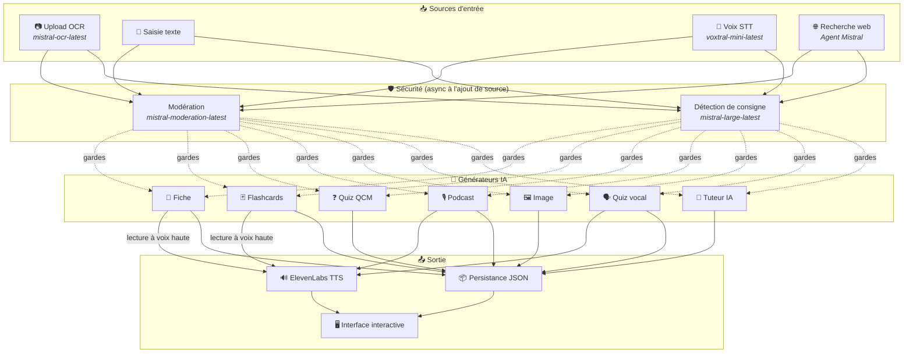
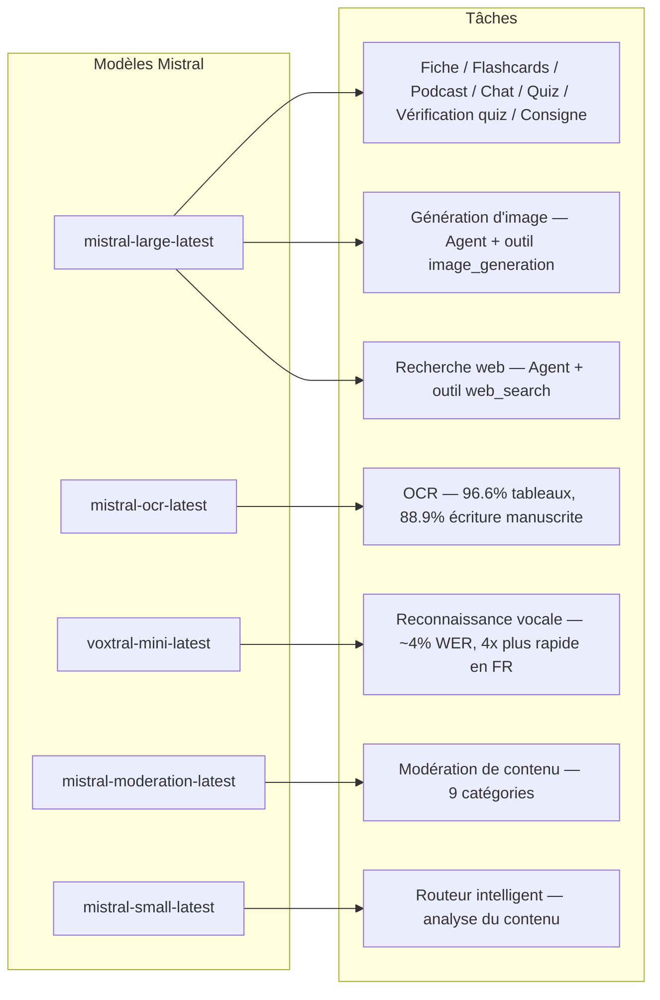
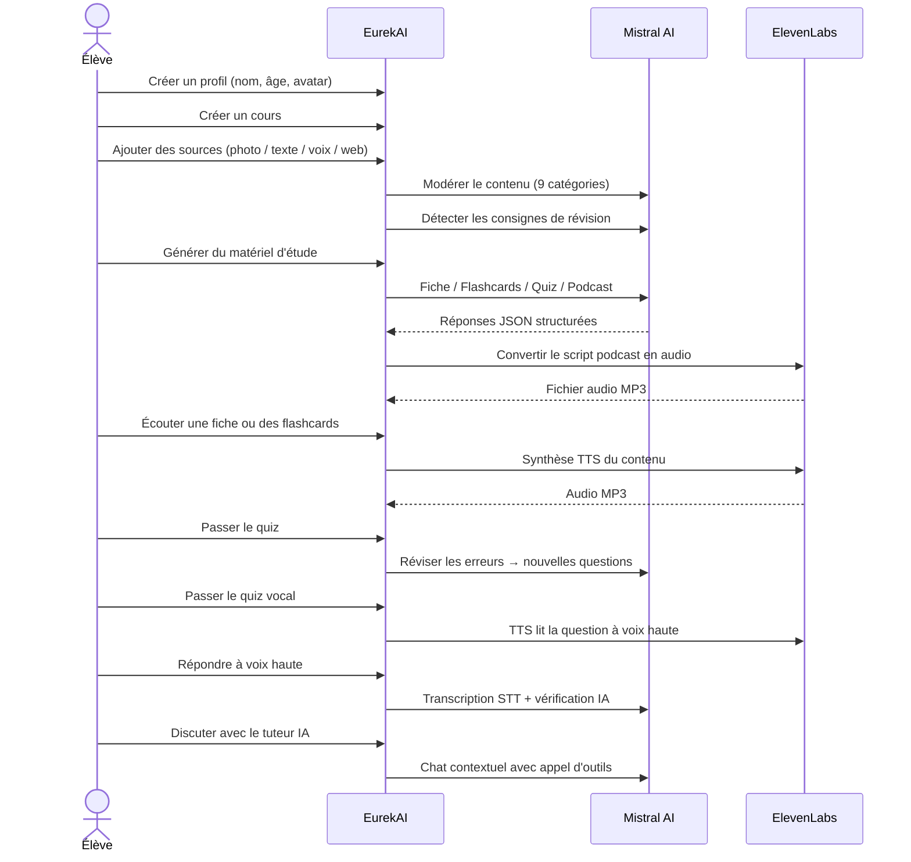

<p align="center">
  
</p>

<h1 align="center">EurekAI</h1>

<p align="center">
  <strong>아무 콘텐츠나 대화형 학습 경험으로 바꿔보세요 — AI로 구동됩니다.</strong>
</p>

<p align="center">
  <a href="https://mistral.ai"></a>
  <a href="https://www.typescriptlang.org"></a>
  <a href="https://mistral.ai"></a>
  <a href="https://elevenlabs.io"></a>
</p>

<p align="center">
  <a href="https://www.youtube.com/watch?v=_b1TQz2leoI">▶️ YouTube에서 데모 보기</a> · <a href="README-en.md">🇬🇧 영어로 읽기</a>
</p>

---

## 이야기 — 왜 EurekAI인가?

**EurekAI**는 [Mistral AI Worldwide Hackathon](https://worldwidehackathon.mistral.ai/) (2026년 3월) 기간에 탄생했습니다. 주제가 필요했는데, 아주 현실적인 경험에서 아이디어가 떠올랐습니다. 저는 딸과 함께 시험공부를 자주 하는데, AI를 활용하면 그것을 더 재미있고 상호작용적으로 만들 수 있겠다고 생각했습니다.

목표는 **어떤 입력이든** — 교과서 사진, 복사해 붙여 넣은 텍스트, 음성 녹음, 웹 검색 — **복습 노트, 플래시카드, 퀴즈, 팟캐스트, 일러스트 등으로** 바꾸는 것입니다. 이 모든 것은 Mistral AI의 프랑스 모델로 구동되어, 프랑스어를 사용하는 학생들에게 자연스럽게 적합한 솔루션이 됩니다.

모든 코드 줄은 해커톤 기간 동안 작성되었습니다. 모든 오픈소스 API와 라이브러리는 해커톤 규칙에 따라 사용되었습니다.

---

## 기능

| | 기능 | 설명 |
|---|---|---|
| 📷 | **OCR 업로드** | 교과서나 노트를 사진으로 찍어 업로드하세요 — Mistral OCR이 내용을 추출합니다 |
| 📝 | **텍스트 입력** | 원하는 텍스트를 직접 입력하거나 붙여넣을 수 있습니다 |
| 🎤 | **음성 입력** | 브라우저에서 오디오를 녹음하세요 — Voxtral STT가 음성을 전사합니다 |
| 🌐 | **웹 검색** | 질문을 입력하세요 — Mistral 에이전트가 웹에서 답을 찾습니다 |
| 📄 | **복습 노트** | 핵심 포인트, 어휘, 인용구, 일화가 포함된 구조화된 노트 |
| 🃏 | **플래시카드** | 능동적 암기를 위한 출처 참조가 포함된 5개의 Q/A 카드 |
| ❓ | **객관식 퀴즈** | 오답을 적응적으로 복습하는 10-20개의 객관식 문제 |
| 🎙️ | **팟캐스트** | ElevenLabs를 통해 오디오로 변환되는 2인 미니 팟캐스트(Alex & Zoé) |
| 🖼️ | **일러스트** | Mistral 에이전트가 생성한 교육용 이미지 |
| 🗣️ | **음성 퀴즈** | 문제를 소리 내어 읽고, 구두로 답하면 AI가 답변을 확인합니다 |
| 💬 | **AI 튜터** | 도구 호출 기능이 있는, 수업 자료와 함께하는 문맥형 채팅 |
| 🧠 | **스마트 라우터** | AI가 콘텐츠를 분석하고 가장 적합한 생성기를 추천합니다 |
| 🔒 | **부모 통제** | 연령 기반 모더레이션, 부모 PIN, 채팅 제한 |
| 🌍 | **다국어 지원** | 프랑스어와 영어로 제공되는 전체 인터페이스 및 AI 콘텐츠 |
| 🔊 | **읽어주기** | ElevenLabs TTS를 통해 노트와 플래시카드를 소리 내어 들을 수 있습니다 |

---

## 아키텍처 개요



---

## 모델 사용 맵



---

## 사용자 흐름



---

## 심층 살펴보기 — 기능

### 다중 모달 입력

EurekAI는 처리 전에 모두 모더레이션되는 4가지 소스 유형을 지원합니다:

- **OCR 업로드** — `mistral-ocr-latest`로 처리되는 JPG, PNG 또는 PDF 파일. 인쇄 텍스트, 표(정확도 96.6%), 손글씨(정확도 88.9%)를 처리합니다.
- **자유 텍스트** — 원하는 콘텐츠를 입력하거나 붙여넣으세요. 저장 전에 모더레이션을 거칩니다.
- **음성 입력** — 브라우저에서 오디오를 녹음합니다. `voxtral-mini-latest`로 약 4% WER의 정확도로 전사됩니다. `language="fr"` 매개변수로 4배 더 빨라집니다.
- **웹 검색** — 쿼리를 입력하세요. `web_search` 도구가 있는 임시 Mistral 에이전트가 결과를 가져오고 요약합니다.

### AI 콘텐츠 생성

생성되는 6가지 학습 자료 유형:

| 생성기 | 모델 | 출력 |
|---|---|---|
| **복습 노트** | `mistral-large-latest` | 제목, 요약, 10-25개 핵심 포인트, 어휘, 인용구, 일화 |
| **플래시카드** | `mistral-large-latest` | 출처 참조가 포함된 5개의 Q/A 카드 |
| **객관식 퀴즈** | `mistral-large-latest` | 10-20개 문제, 각 4개 선택지, 설명, 적응형 복습 |
| **팟캐스트** | `mistral-large-latest` + ElevenLabs | 2인 스크립트(Alex & Zoé) → MP3 오디오 |
| **일러스트** | `mistral-large-latest` 에이전트 | `image_generation` 도구를 통한 교육용 이미지 |
| **음성 퀴즈** | `mistral-large-latest` + ElevenLabs + Voxtral | TTS 문제 → STT 답변 → AI 검증 |

### 채팅형 AI 튜터

수업 자료 전체에 접근할 수 있는 대화형 튜터:

- `mistral-large-latest` 사용(128K 토큰 컨텍스트 윈도우)
- **도구 호출**: 대화 중에 온라인으로 노트, 플래시카드 또는 퀴즈를 생성할 수 있음
- 과목당 최대 50개의 메시지 기록
- 연령에 따른 프로필용 콘텐츠 모더레이션

### 자동 스마트 라우터

라우터는 `mistral-small-latest`를 사용해 소스 콘텐츠를 분석하고 어떤 생성기가 가장 적합한지 추천합니다. 학생들이 수동으로 선택할 필요가 없도록 합니다.

### 적응형 학습

- **퀴즈 통계**: 문제별 시도 횟수와 정확도 추적
- **퀴즈 복습**: 약한 개념을 겨냥한 5-10개의 새 문제 생성
- **지시문 감지**: 복습 지시("나는 내 수업을 안다고 하려면...")를 감지하고 모든 생성기에서 우선 적용

### 보안 및 부모 통제

- **4개 연령 그룹**: 어린이(6-10), 청소년(11-15), 학생(16+), 성인
- **콘텐츠 모더레이션**: `mistral-moderation-latest`를 통한 9개 카테고리, 연령 그룹별 조정된 임계값
- **부모 PIN**: SHA-256 해시, 15세 미만 프로필에 필요
- **채팅 제한**: AI 채팅은 15세 이상 프로필에서만 사용 가능

### 다중 프로필 시스템

- 이름, 나이, 아바타, 언어 설정이 포함된 여러 프로필
- `profileId`를 통해 프로필에 연결된 프로젝트
- 계단식 삭제: 프로필을 삭제하면 해당 프로젝트가 모두 삭제됨

### 국제화

- 전체 인터페이스를 프랑스어와 영어로 제공
- AI 프롬프트는 현재 2개 언어(FR, EN)를 지원하며, 15개 언어(es, de, it, pt, nl, ja, zh, ko, ar, hi, pl, ro, sv)를 위한 아키텍처가 준비됨
- 프로필별 언어 설정 가능

---

## 기술 스택

| 계층 | 기술 | 역할 |
|---|---|---|
| **런타임** | Node.js + TypeScript 5.7 | 서버 및 타입 안전성 |
| **백엔드** | Express 4.21 | REST API |
| **개발 서버** | Vite 7.3 + tsx | HMR, Handlebars partials, 프록시 |
| **프론트엔드** | HTML + TailwindCSS 4.2 + Alpine.js 3.15 | 반응형 인터페이스, Vite로 컴파일된 TypeScript |
| **템플릿 엔진** | vite-plugin-handlebars | partials 기반 HTML 구성 |
| **AI** | Mistral AI SDK 1.14 | 채팅, OCR, STT, 에이전트, 모더레이션 |
| **TTS** | ElevenLabs SDK 2.36 | 팟캐스트와 음성 퀴즈용 음성 합성 |
| **아이콘** | Lucide 0.575 | SVG 아이콘 라이브러리 |
| **Markdown** | Marked 17 | 채팅에서 마크다운 렌더링 |
| **파일 업로드** | Multer 1.4 | multipart 폼 처리 |
| **오디오** | ffmpeg-static | 오디오 처리 |
| **테스트** | Vitest 4 | 단위 테스트 |
| **지속성** | JSON 파일 | 의존성 없는 저장소 |

---

## 모델 참고

| 모델 | 사용처 | 이유 |
|---|---|---|
| `mistral-large-latest` | 노트, 플래시카드, 팟캐스트, 객관식 퀴즈, 채팅, 퀴즈 검증, 이미지 에이전트, 웹 검색 에이전트, 지시문 감지 | 최고의 다국어 지원 + 지시 따르기 |
| `mistral-ocr-latest` | 문서 OCR | 표 96.6% 정확도, 손글씨 88.9% |
| `voxtral-mini-latest` | 음성 인식 | 약 4% WER, `language="fr"`로 4배 이상 속도 향상 |
| `mistral-moderation-latest` | 콘텐츠 모더레이션 | 9개 카테고리, 아동 안전 |
| `mistral-small-latest` | 스마트 라우터 | 라우팅 결정을 위한 빠른 콘텐츠 분석 |
| `eleven_v3` (ElevenLabs) | 음성 합성 | 팟캐스트와 음성 퀴즈를 위한 자연스러운 프랑스어 음성 |

---

## 빠른 시작

```bash
# Cloner le dépôt
git clone https://github.com/your-username/eurekai.git
cd eurekai

# Installer les dépendances
npm install

# Configurer les clés API
cp .env.example .env
# Éditez .env avec vos clés :
#   MISTRAL_API_KEY=votre_clé_ici
#   ELEVENLABS_API_KEY=votre_clé_ici  (optionnel, pour les fonctions audio)

# Lancer le développement
npm run dev
# → Backend :  http://localhost:3000 (API)
# → Frontend : http://localhost:5173 (serveur Vite avec HMR)
```

> **참고**: ElevenLabs는 선택 사항입니다. 이 키가 없으면 팟캐스트와 음성 퀴즈 기능은 스크립트만 생성하고 오디오는 합성하지 않습니다.

---

## 프로젝트 구조

```
server.ts                 — Point d'entrée Express, monte les routes + config
config.ts                 — Config runtime (modèles, voix, TTS), persistée dans output/config.json
store.ts                  — ProjectStore : CRUD projets/sources/générations, persistance JSON
profiles.ts               — ProfileStore : gestion des profils, hachage PIN
types.ts                  — Types TypeScript : Source, Generation (6 types), QuizStats, Profile
prompts.ts                — Tous les prompts IA centralisés (system + user templates, FR/EN)

generators/
  ocr.ts                  — Upload + OCR via Mistral (JPG, PNG, PDF)
  summary.ts              — Génération de fiche de révision (JSON structuré)
  flashcards.ts           — 5 flashcards Q/R
  quiz.ts                 — Quiz QCM (10-20 questions) + révision adaptative
  podcast.ts              — Script podcast 2 voix (Alex + Zoé)
  quiz-vocal.ts           — Quiz vocal : questions TTS + réponses STT + vérification IA
  image.ts                — Génération d'image via Agent Mistral (outil image_generation)
  chat.ts                 — Tuteur IA par chat avec appel d'outils
  router.ts               — Routeur automatique intelligent (contenu → générateurs recommandés)
  consigne.ts             — Détection de consignes de révision
  tts.ts                  — ElevenLabs TTS (eleven_v3, concaténation de segments)
  stt.ts                  — Voxtral STT (audio → texte)
  websearch.ts            — Agent Mistral avec outil web_search
  moderation.ts           — Modération de contenu (9 catégories)

routes/
  projects.ts             — CRUD projets
  sources.ts              — Upload OCR, texte libre, voix STT, recherche web, modération
  generate.ts             — Endpoints de génération (fiche/flashcards/quiz/podcast/image/vocal)
  generations.ts          — Tentatives de quiz, réponses vocales, lecture à voix haute, renommage, suppression
  chat.ts                 — Chat IA avec appel d'outils
  profiles.ts             — CRUD profils avec gestion du PIN

helpers/
  index.ts                — safeParseJson, unwrapJsonArray, extractAllText, timer
  audio.ts                — collectStream (ReadableStream → Buffer)

src/                      — Frontend (Vite + Handlebars)
  index.html              — Point d'entrée HTML principal
  main.ts                 — Entrée frontend (init Alpine.js + icônes Lucide)
  app/                    — Modules applicatifs Alpine.js
    state.ts              — Gestion d'état réactif
    navigation.ts         — Routage des vues + gardes par âge
    profiles.ts           — Logique du sélecteur de profils
    projects.ts           — CRUD des cours
    sources.ts            — Gestionnaires d'upload de sources
    generate.ts           — Déclencheurs de génération
    generations.ts        — Affichage + actions sur les générations
    chat.ts               — Interface de chat
    render.ts             — Helpers de rendu HTML
    i18n.ts               — Changement de langue
    ...
  components/
    quiz.ts               — Composant quiz interactif
    quiz-vocal.ts         — Composant quiz vocal
  i18n/
    fr.ts                 — Traductions françaises
    en.ts                 — Traductions anglaises
    index.ts              — Chargeur i18n
  partials/               — Partials HTML Handlebars (header, sidebar, dialogues, vues)
  styles/
    main.css              — Entrée TailwindCSS
    theme.css             — Variables de thème personnalisées

public/assets/            — Ressources statiques (logo, avatars)
output/                   — Données d'exécution (projets, config, fichiers audio)
```

---

## API 참조

### 설정
| 메서드 | 엔드포인트 | 설명 |
|---|---|---|
| `GET` | `/api/config` | 현재 설정 |
| `PUT` | `/api/config` | 설정 수정(모델, 음성, TTS) |
| `GET` | `/api/config/status` | API 상태(Mistral, ElevenLabs) |

### 프로필
| 메서드 | 엔드포인트 | 설명 |
|---|---|---|
| `GET` | `/api/profiles` | 모든 프로필 나열 |
| `POST` | `/api/profiles` | 프로필 생성 |
| `PUT` | `/api/profiles/:id` | 프로필 수정(15세 미만은 PIN 필요) |
| `DELETE` | `/api/profiles/:id` | 프로필 삭제 + 프로젝트 연쇄 삭제 |

### 프로젝트
| 메서드 | 엔드포인트 | 설명 |
|---|---|---|
| `GET` | `/api/projects` | 프로젝트 나열 |
| `POST` | `/api/projects` | `{name, profileId}` 프로젝트 생성 |
| `GET` | `/api/projects/:pid` | 프로젝트 상세 |
| `PUT` | `/api/projects/:pid` | `{name}` 이름 변경 |
| `DELETE` | `/api/projects/:pid` | 프로젝트 삭제 |

### 소스
| 메서드 | 엔드포인트 | 설명 |
|---|---|---|
| `POST` | `/api/projects/:pid/sources/upload` | OCR 업로드(multipart 파일) |
| `POST` | `/api/projects/:pid/sources/text` | 자유 텍스트 `{text}` |
| `POST` | `/api/projects/:pid/sources/voice` | STT 음성(multipart 오디오) |
| `POST` | `/api/projects/:pid/sources/websearch` | 웹 검색 `{query}` |
| `DELETE` | `/api/projects/:pid/sources/:sid` | 소스 삭제 |
| `POST` | `/api/projects/:pid/moderate` | `{text}` 모더레이션 |
| `POST` | `/api/projects/:pid/detect-consigne` | 복습 지시문 감지 |

### 생성
| 메서드 | 엔드포인트 | 설명 |
|---|---|---|
| `POST` | `/api/projects/:pid/generate/summary` | 복습 노트 `{sourceIds?}` |
| `POST` | `/api/projects/:pid/generate/flashcards` | 플래시카드 `{sourceIds?}` |
| `POST` | `/api/projects/:pid/generate/quiz` | 객관식 퀴즈 `{sourceIds?}` |
| `POST` | `/api/projects/:pid/generate/podcast` | 팟캐스트 `{sourceIds?}` |
| `POST` | `/api/projects/:pid/generate/image` | 일러스트 `{sourceIds?}` |
| `POST` | `/api/projects/:pid/generate/quiz-vocal` | 음성 퀴즈 `{sourceIds?}` |
| `POST` | `/api/projects/:pid/generate/quiz-review` | 적응형 복습 `{generationId, weakQuestions}` |
| `POST` | `/api/projects/:pid/generate/auto` | 라우터를 통한 자동 생성 |

### 생성 CRUD
| 메서드 | 엔드포인트 | 설명 |
|---|---|---|
| `POST` | `/api/projects/:pid/generations/:gid/quiz-attempt` | 응답 제출 `{answers}` |
| `POST` | `/api/projects/:pid/generations/:gid/vocal-answer` | 구두 답변 검증(multipart 오디오 + questionIndex) |
| `POST` | `/api/projects/:pid/generations/:gid/read-aloud` | TTS 읽어주기(노트/플래시카드) |
| `PUT` | `/api/projects/:pid/generations/:gid` | `{title}` 이름 변경 |
| `DELETE` | `/api/projects/:pid/generations/:gid` | 생성 삭제 |

### 채팅
| 메서드 | 엔드포인트 | 설명 |
|---|---|---|
| `GET` | `/api/projects/:pid/chat` | 채팅 기록 가져오기 |
| `POST` | `/api/projects/:pid/chat` | 메시지 보내기 `{message}` |
| `DELETE` | `/api/projects/:pid/chat` | 채팅 기록 지우기 |

---

## 아키텍처 결정

| 결정 | 근거 |
|---|---|
| **React/Vue 대신 Alpine.js** | 최소한의 용량, Vite로 컴파일된 TypeScript와 가벼운 반응성. 속도가 중요한 해커톤에 완벽합니다. |
| **JSON 파일 기반 지속성** | 의존성 제로, 즉시 시작. 구성할 데이터베이스가 없으며, 시작만 하면 됩니다. |
| **Vite + Handlebars** | 두 세계의 장점: 개발을 위한 빠른 HMR, 코드 구성을 위한 HTML partials, Tailwind JIT. |
| **중앙화된 프롬프트** | 모든 AI 프롬프트를 `prompts.ts`에 저장 — 언어/연령 그룹별로 쉽게 반복, 테스트, 조정 가능. |
| **다중 생성 시스템** | 각 생성 결과는 고유 ID를 가진 독립 객체 — 과목당 여러 노트, 퀴즈 등을 가능하게 함. |
| **연령 맞춤 프롬프트** | 어휘, 복잡성, 톤이 다른 4개 연령 그룹 — 같은 콘텐츠도 학습자에 따라 다르게 가르침. |
| **에이전트 기반 기능** | 이미지 생성과 웹 검색은 임시 Mistral 에이전트를 사용 — 자동 정리되는 깨끗한 수명 주기. |

---

## 크레딧 및 감사

- **[Mistral AI](https://mistral.ai)** — AI 모델(Large, OCR, Voxtral, Moderation, Small) + Worldwide Hackathon
- **[ElevenLabs](https://elevenlabs.io)** — 음성 합성 엔진(`eleven_v3`)
- **[Alpine.js](https://alpinejs.dev)** — 가벼운 반응형 프레임워크
- **[TailwindCSS](https://tailwindcss.com)** — 유틸리티 CSS 프레임워크
- **[Vite](https://vitejs.dev)** — 프론트엔드 빌드 도구
- **[Lucide](https://lucide.dev)** — 아이콘 라이브러리
- **[Marked](https://marked.js.org)** — Markdown 파서

2026년 3월 Mistral AI Worldwide Hackathon에서 정성껏 제작되었습니다.

---

## 작성자

**Julien LS** — [contact@jls42.org](mailto:contact@jls42.org)

## 라이선스

[AGPL-3.0](LICENSE) — Copyright (C) 2026 Julien LS

**이 문서는 gpt-5.4-mini 모델을 사용하여 fr 버전에서 ko 언어로 번역되었습니다. 번역 과정에 대한 자세한 정보는 https://gitlab.com/jls42/ai-powered-markdown-translator를 참조하세요.**

