<p align="center">
  
</p>

<h1 align="center">EurekAI</h1>

<p align="center">
  <strong>어떤 콘텐츠든 인터랙티브한 학습 경험으로 변환합니다 — <a href="https://mistral.ai">Mistral AI</a> 기반.</strong>
</p>

<p align="center">
  <a href="README-en.md">🇬🇧 English</a> · <a href="README-es.md">🇪🇸 Español</a> · <a href="README-pt.md">🇧🇷 Português</a> · <a href="README-de.md">🇩🇪 Deutsch</a> · <a href="README-it.md">🇮🇹 Italiano</a> · <a href="README-nl.md">🇳🇱 Nederlands</a> · <a href="README-ar.md">🇸🇦 العربية</a><br>
  <a href="README-hi.md">🇮🇳 हिन्दी</a> · <a href="README-zh.md">🇨🇳 中文</a> · <a href="README-ja.md">🇯🇵 日本語</a> · <a href="README-ko.md">🇰🇷 한국어</a> · <a href="README-pl.md">🇵🇱 Polski</a> · <a href="README-ro.md">🇷🇴 Română</a> · <a href="README-sv.md">🇸🇪 Svenska</a>
</p>

<p align="center">
  <a href="https://www.youtube.com/watch?v=_b1TQz2leoI"></a>
</p>

<h4 align="center">📊 코드 품질</h4>

<p align="center">
  <a href="https://sonarcloud.io/summary/new_code?id=jls42_EurekAI"></a>
  <a href="https://sonarcloud.io/summary/new_code?id=jls42_EurekAI"></a>
  <a href="https://sonarcloud.io/summary/new_code?id=jls42_EurekAI"></a>
  <a href="https://sonarcloud.io/summary/new_code?id=jls42_EurekAI"></a>
</p>
<p align="center">
  <a href="https://sonarcloud.io/summary/new_code?id=jls42_EurekAI"></a>
  <a href="https://sonarcloud.io/summary/new_code?id=jls42_EurekAI"></a>
  <a href="https://sonarcloud.io/summary/new_code?id=jls42_EurekAI"></a>
  <a href="https://sonarcloud.io/summary/new_code?id=jls42_EurekAI"></a>
</p>
<p align="center">
  <a href="https://app.codacy.com/gh/jls42/EurekAI/dashboard?utm_source=gh&utm_medium=referral&utm_content=&utm_campaign=Badge_grade"></a>
  <a href="https://www.codefactor.io/repository/github/jls42/eurekai"></a>
</p>

---

## 이야기 — 왜 EurekAI인가?

**EurekAI**는 [Mistral AI Worldwide Hackathon](https://luma.com/mistralhack-online)([공식 사이트](https://worldwide-hackathon.mistral.ai/))(2026년 3월) 기간에 탄생했습니다. 주제가 필요했고, 아이디어는 아주 구체적인 경험에서 나왔습니다. 저는 딸과 함께 정기적으로 시험을 준비하는데, AI를 활용해 이를 더 재미있고 인터랙티브하게 만들 수 있을 거라고 생각했습니다.

목표는 **어떤 입력**이든 — 수업 사진, 복사·붙여넣기한 텍스트, 음성 녹음, 웹 검색 — 받아 **복습 노트, 플래시카드, 퀴즈, 팟캐스트, 빈칸 채우기, 일러스트레이션 등**으로 변환하는 것이었습니다. 이 모든 것은 Mistral AI의 프랑스 모델로 구동되며, 프랑스어권 학생에게 자연스럽게 맞는 솔루션입니다.

[초기 프로토타입](https://github.com/jls42/worldwide-hackathon.mistral.ai)은 해커톤 동안 48시간 만에 Mistral 서비스를 중심으로 한 개념 증명으로 설계되었습니다. 이미 동작했지만 한계가 있었습니다. 이후 EurekAI는 진정한 프로젝트로 성장했습니다. 빈칸 채우기, 연습 문제 탐색, 웹 스크래핑, 설정 가능한 부모 관리 감독, 심층 코드 리뷰 등이 추가되었습니다. 코드 전체는 AI로 생성되었으며 — 주로 [Claude Code](https://code.claude.com/), 일부는 [Codex](https://openai.com/codex/)와 [Gemini CLI](https://geminicli.com/)를 통해 기여되었습니다.

---

## 개요

<p align="center">
  
</p>

| | |
|---|---|
| 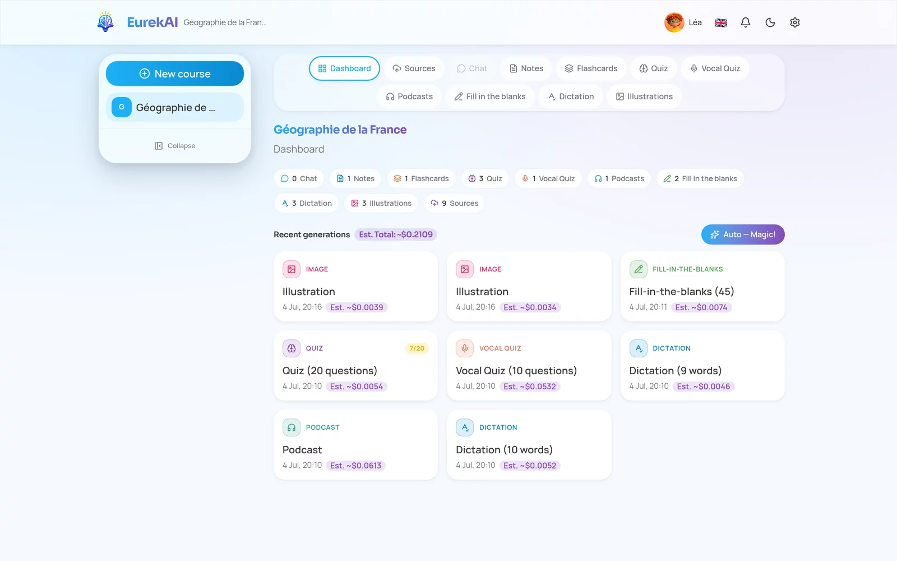<br>**대시보드** — 최근 생성 항목, 카드별 및 프로젝트 총 예상 비용, « Auto — Magie ! » 버튼 | 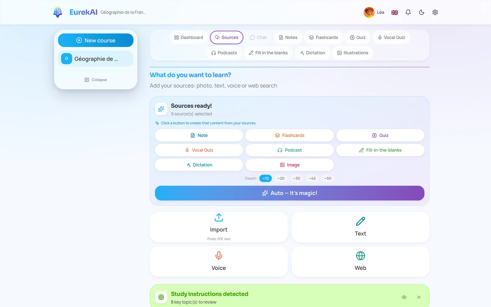<br>**소스** — 사진/PDF/텍스트/음성/웹 가져오기, 원클릭 생성, 지시문 감지 |

가져온 각 소스는 [OCR 신뢰도 점수, 모더레이션, 예상 비용](docs/screenshots/sources-list.webp)을 표시합니다.

### 실제 동작하는 구성 요소

| | |
|---|---|
| 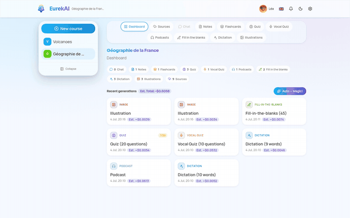<br>**복습 노트** — 핵심 포인트, 어휘, 출처가 있는 인용, 섹션별 오디오 재생 | <br>**객관식 퀴즈** — 설명이 포함된 즉시 피드백, 단계별 탐색 |
| 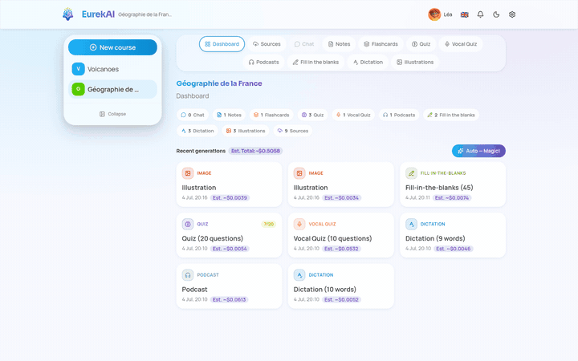<br>**플래시카드** — 카드를 뒤집은 뒤 « 알았다 / 몰랐다 » 자기 평가 | <br>**빈칸 채우기** — 요청 시 힌트, 관대한 검증 |
| 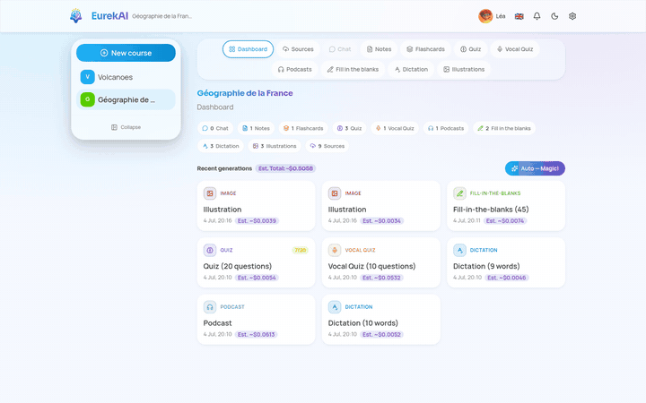<br>**받아쓰기** — 오디오로 불러 주는 단어, 글자 단위 엄격한 교정 | <br>**음성 퀴즈** — 질문을 큰 소리로 읽고, 마이크로 답변 |
| <br>**팟캐스트** — 2인 음성 미니 팟캐스트, 대화형 스크립트 열람 가능 | <br>**일러스트레이션** — Agent가 생성한 교육용 이미지 |
| 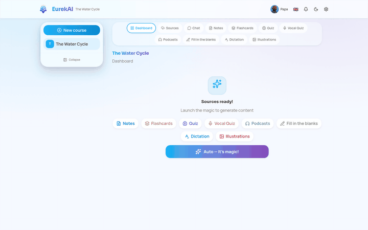<br>**AI 튜터** — 수업 문서에 기반한 채팅, 설명이 포함된 답변, 퀴즈와 플래시카드 생성 가능 | |

### 시작하기

| | |
|---|---|
| 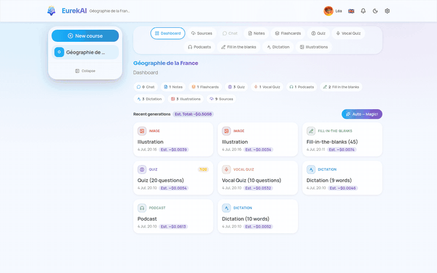<br>**프로필 선택** — 각 아이에게 자신만의 공간, 아바타, 언어가 있습니다 | <br>**프로필 생성** — 나이, 아바타, 15세 미만용 부모 PIN |
| 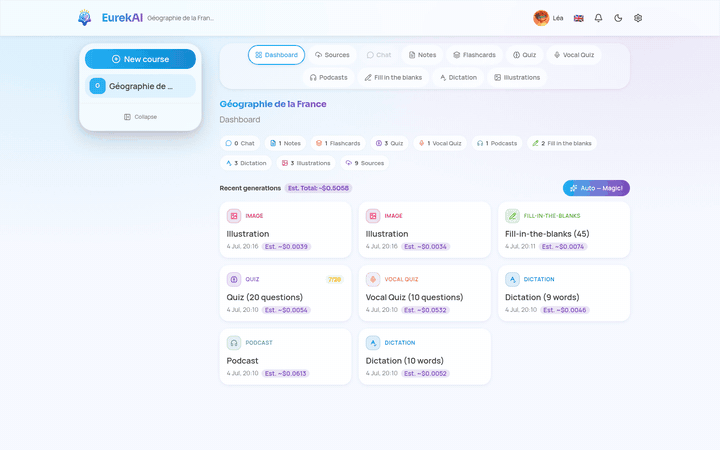<br>**코스 생성** — 수업당 하나의 프로젝트, 소스를 받을 준비 완료 | 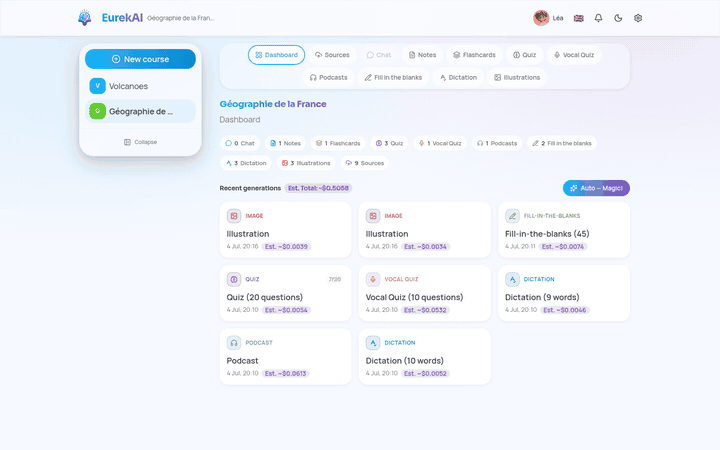<br>**설정** — API 상태, 요금이 표시된 AI 모델 선택 |

---

## 기능

| | 기능 | 설명 |
|---|---|---|
| 📷 | **파일 가져오기** | 수업을 가져옵니다 — 사진, PDF(평균 신뢰도 점수가 있는 Mistral OCR, 티어 `high`/`medium`/`low`) 또는 텍스트 파일(TXT, MD). 파일별 재시도와 개별 진행률이 있는 업로드 세션 |
| 📝 | **텍스트 입력** | 어떤 텍스트든 직접 입력하거나 붙여넣기 |
| 🎤 | **음성 입력** | 녹음하세요 — Voxtral STT가 음성을 전사합니다 |
| 🌐 | **웹 / URL** | URL을 붙여넣거나(Readability + Lightpanda를 통한 직접 스크래핑) 검색어를 입력(Agent Mistral web_search) |
| 📄 | **복습 노트** | 핵심 포인트, 어휘, 인용, 일화가 있는 구조화된 노트 |
| 🃏 | **플래시카드** | 인터랙티브 Q/A 카드, 대화형 오디오 재생 |
| ❓ | **객관식 퀴즈** | 오류에 대한 적응형 복습이 있는 객관식 문제(개수 설정 가능) |
| ✏️ | **빈칸 채우기** | 힌트와 관대한 검증이 있는 빈칸 채우기 연습 |
| 🔤 | **받아쓰기** | 가져온 목록에서 오디오로 불러 주는 단어(Voxtral TTS), 키보드 입력, 철자 규칙 설명이 포함된 글자 단위 엄격한 교정 |
| 🎙️ | **팟캐스트** | 2인 음성 미니 팟캐스트 오디오 — 기본 Mistral 음성 또는 맞춤 음성(부모님!) |
| 🖼️ | **일러스트레이션** | Agent Mistral이 생성한 교육용 이미지 |
| 🗣️ | **음성 퀴즈** | 큰 소리로 읽히는 질문(맞춤 음성 가능), 구두 답변, AI 검증 |
| 💬 | **AI 튜터** | 수업 문서와 도구 호출이 있는 맥락형 채팅 |
| 🧠 | **자동 라우터** | `mistral-small-latest` 기반 라우터가 콘텐츠를 분석하고 사용 가능한 8가지 유형 중 생성기 조합을 제안합니다 |
| 🔒 | **부모 관리** | 프로필별 설정 가능한 모더레이션(사용자 지정 카테고리), 부모 PIN, 채팅 제한 |
| 🌍 | **다국어** | 인터페이스 9개 언어 지원; 프롬프트를 통해 AI 생성을 15개 언어로 제어 가능 |
| 🔊 | **소리 내어 읽기** | Mistral Voxtral TTS로 노트와 플래시카드(질문/답변 대화)를 들으세요 |
| 💶 | **API 비용 추적** | 각 생성 및 소스의 € 비용을 투명하게 추정(토큰 / 문자 / 페이지 / 오디오 초). 카드별 배지 + 프로젝트별 합계, 대시보드에 표시 |
| 🎨 | **프로필별 테마** | 각 프로필이 `dark` 또는 `light` 테마를 선택 — 프로필 전환 시에도 유지 |

---

## 아키텍처 개요

<p align="center">
  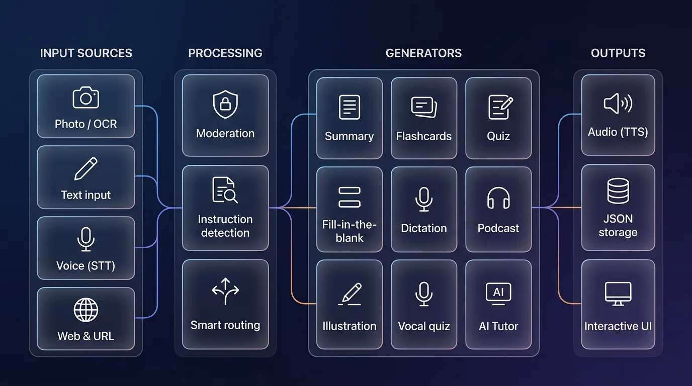
</p>

---

## 모델 사용 맵

<p align="center">
  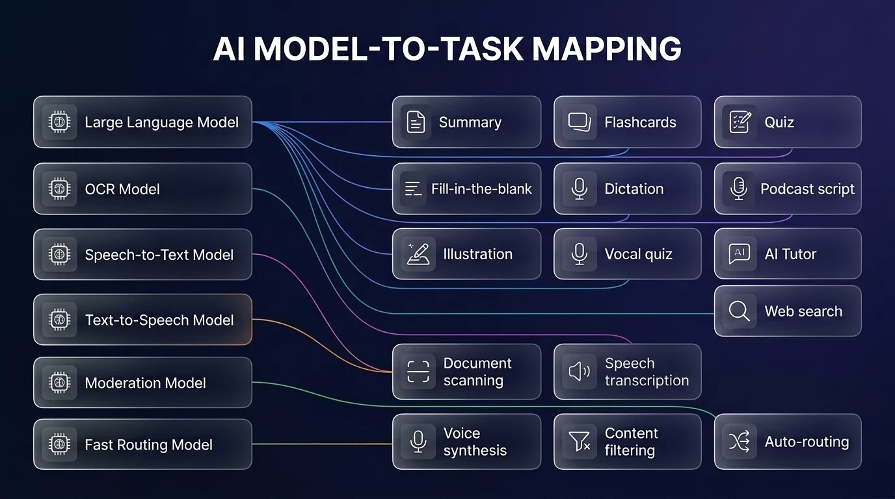
</p>

---

## 사용자 여정

<p align="center">
  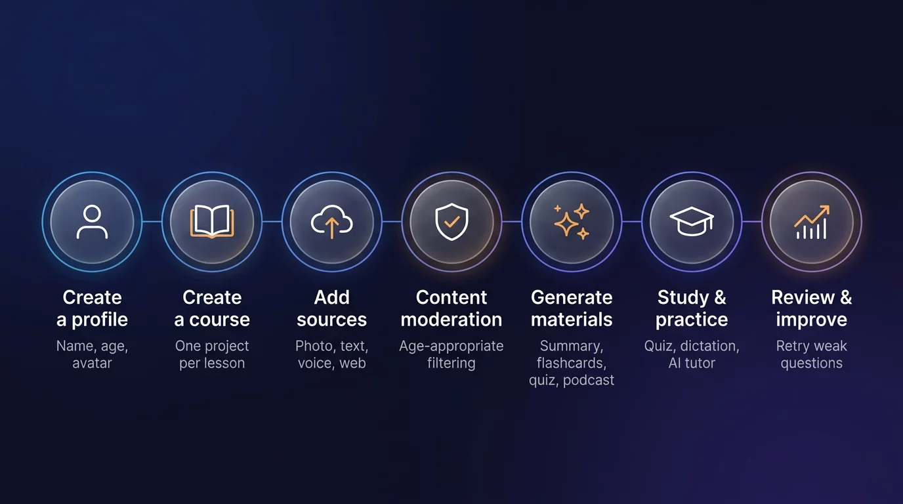
</p>

---

## 심층 분석 — 기능

### 멀티모달 입력

EurekAI는 프로필에 따라 모더레이션되는 4가지 유형의 소스를 받습니다(어린이 및 청소년은 기본적으로 활성화):

- **파일 가져오기** — OCR Mistral로 처리되는 JPG, PNG 또는 PDF 파일 — **기본값 OCR 4(`mistral-ocr-4-0`)**(최고 품질), 설정의 **선택 사항 OCR 3(`mistral-ocr-2512`)**(더 저렴, 비용 약 ½) — 인쇄 텍스트, 표, 필기용; 또는 텍스트 파일(TXT, MD)을 직접 가져오기. 다중 파일 업로드는 **업로드 세션** 시스템을 사용합니다: 파일별 개별 진행률, 다른 파일을 다시 제출하지 않고 실패한 파일만 재시도, 완료 시 세션 dismiss. OCR은 평균 **신뢰도 점수**(`average`, `[0,1]`로 클램프, Mistral이 반환한 `averagePageConfidenceScore`에서 계산)를 노출하며, UI에 티어 배지 `high` / `medium` / `low`(임계값 ~0.9 / ~0.7)로 표시됩니다 — 스캔 품질이 낮아도 차단하지 않고 경고합니다.
- **자유 텍스트** — 어떤 콘텐츠든 입력하거나 붙여넣기. 모더레이션이 활성인 경우 저장 전에 모더레이션됩니다.
- **음성 입력** — 브라우저에서 오디오를 녹음합니다. `voxtral-mini-latest`로 전사됩니다. `language="fr"` 매개변수가 인식을 최적화합니다.
- **웹 / URL** — 하나 이상의 URL을 붙여넣어 콘텐츠를 직접 스크래핑하거나(JS 페이지용 Readability + Lightpanda), 키워드를 입력해 Agent Mistral을 통한 웹 검색을 수행합니다. 단일 필드가 둘 다 받습니다 — URL과 키워드가 자동으로 분리되며, 각 결과가 독립적인 소스를 만듭니다.

### AI 콘텐츠 생성

생성된 학습 자료 유형 8가지:

| 생성기 | 모델 | 출력 |
|---|---|---|
| **복습 노트** | `mistral-large-latest` | 제목, 요약, 핵심 포인트, 어휘, 인용, 일화 |
| **플래시카드** | `mistral-large-latest` | 소스 참조가 있는 Q/A 카드(개수 설정 가능) |
| **객관식 퀴즈** | `mistral-large-latest` | 객관식 문제, 설명, 적응형 복습(개수 설정 가능) |
| **빈칸 채우기** | `mistral-large-latest` | 힌트가 있는 완성할 문장, 관대한 검증(Levenshtein) |
| **받아쓰기** | `mistral-large-latest` + Voxtral TTS | 오디오로 불러 주는 핵심 단어(단어당 MP3 1개) → 키보드 입력 → 설명이 포함된 엄격한 교정(악센트) |
| **팟캐스트** | `mistral-large-latest` + Voxtral TTS | 2인 음성 스크립트 → MP3 오디오 |
| **일러스트레이션** | Agent `mistral-large-latest` | `image_generation` 도구를 통한 교육용 이미지 |
| **음성 퀴즈** | `mistral-large-latest` + Voxtral TTS + STT | TTS 질문 → STT 답변 → AI 검증 |

### 채팅 AI 튜터

수업 문서에 완전히 접근할 수 있는 대화형 튜터:

- `mistral-large-latest` 사용
- **도구 호출**: 대화 중에 노트, 플래시카드, 퀴즈 또는 빈칸 채우기를 생성할 수 있음
- 코스당 메시지 기록 50개
- 프로필에 활성화된 경우 콘텐츠 모더레이션

### 자동 라우터

라우터는 `mistral-small-latest`을 사용해 소스 콘텐츠를 분석하고 사용 가능한 8가지 중 가장 관련성 높은 생성기를 제안합니다. 인터페이스는 실시간 진행 상황을 표시합니다: 먼저 분석 단계, 그다음 개별 생성(취소 가능).

### 적응형 학습

- **퀴즈 통계**: 문제별 시도 횟수 및 정확도 추적
- **퀴즈 복습**: 약한 개념을 겨냥한 새 문제 5–10개 생성
- **지시문 감지**: 복습 지시("내가 수업을 안다"는 것은 "…를 알 때")를 감지하고 호환되는 텍스트 생성기(노트, 플래시카드, 퀴즈, 빈칸 채우기)에서 우선순위를 둡니다

### 보안 및 부모 관리

- **연령 그룹 4개**: 어린이(≤10세), 청소년(11–15), 학생(16–25), 성인(26+)
- **콘텐츠 모더레이션**: `mistral-moderation-2603`(Mistral Moderation 2), 사용 가능한 카테고리 11개, 어린이/청소년 기본 차단 5개(`sexual`, `hate_and_discrimination`, `violence_and_threats`, `selfharm`, `jailbreaking`). 설정에서 프로필별 카테고리 사용자 지정 가능; Moderation 2는 이전 « 위험한 콘텐츠 » 카테고리를 `dangerous` + `criminal`로 분리했습니다(기존 프로필은 자동으로 마이그레이션되며, 차단된 카테고리는 이미 가져온 소스에도 적용됩니다). 기본 보안: 모델 응답으로 차단된 카테고리를 확인할 수 없으면 콘텐츠가 거부됩니다(« 모더레이션 사용 불가 »); 모더레이션이 활성인 경우, 생성과 채팅 모두 신고되었거나, 오류이거나, 확인 중인 소스를 제외합니다(모더레이션이 비활성화된 상태로 가져온 소스는 다시 확인되지 않음). `helpers/moderation-model.ts`에 고정된 날짜 ID: 더 이상 사용되지 않는 별칭 `-latest`은 API에 더 이상 나열되지 않습니다.
- **부모 PIN**: SHA-256 해시, 15세 미만 프로필에 필요. 프로덕션 배포에서는 솔트가 있는 느린 해시(Argon2id, bcrypt)를 계획하세요.
- **채팅 제한**: 16세 미만은 기본적으로 AI 채팅 비활성화, 부모가 활성화 가능

### 다중 프로필 시스템

- 이름, 나이, 아바타, 언어 선호도가 있는 다중 프로필
- **프로필별 음성**(`Profile.mistralVoices?: { host?, guest? }` — 각 역할은 선택 사항) — 각 아이가 자신만의 팟캐스트/음성 퀴즈 음성 쌍을 가질 수 있음
- **프로필별 테마**(`Profile.theme: 'dark' | 'light'`) — 프로필 전환 시 자동 전환, 백엔드에 유지
- `profileId`를 통해 프로필에 연결된 프로젝트
- 연쇄 삭제: 프로필을 삭제하면 모든 프로젝트가 삭제됩니다

### API 비용 추적

청구 가능한 각 Mistral 호출(chat, OCR, STT, TTS, agents)은 사용자에게 **투명한** € 추정을 제공하도록 계측됩니다. 무료인 모더레이션은 계산되지 않습니다. 알려진 한계: 에이전트 도구 비용(웹 검색 30 $/1000회 호출, 이미지 생성 100 $/1000장)은 아직 계산되지 않습니다 — 표시되는 일러스트레이션 비용은 과소평가됩니다.

- **진실의 원천**: `helpers/pricing.ts` — 모델 prefix별 `MODEL_PRICING`(예: `mistral-large` → 입력 0.5 €/M tokens, 출력 1.5 €/M tokens), 주기적 재스크래핑을 위한 Mistral 문서 URL이 있는 `PRICING_SOURCES`
- **지원 단위**: `tokens`, `characters`(TTS), `pages`(OCR), `audio-seconds`(STT) — `helpers/cost-calc.ts`로 구동되는 변환
- **계측 체인**: `helpers/tracked-client.ts`(Mistral 클라이언트 wrap) → `helpers/usage-context.ts`(AsyncLocalStorage) → `helpers/cost-calc.ts` → `helpers/cost-persist.ts` → `helpers/cost-middleware.ts`(HTTP 응답에 주입)
- **UI**: 생성별 비용 배지(`src/partials/cost-badge-gen.html`), 소스별(`cost-badge-src.html`), 대시보드의 누적 합계(`Project.totalCost`)
- **Endpoints**: `/generate/*` 및 `/sources/*` 응답은 반환된 객체(Generation / Source)를 `estimatedCost`, `usage`, `costBreakdown`로 장식합니다. `POST /generate/route`는 라우팅만의 비용에 대한 `costDelta: number` 필드를 추가합니다. `GET /projects/:pid`는 `totalCost`( `costLog[]`에서 계산된 합계)로 보강된 프로젝트 + 전체 기록을 반환합니다

### TTS(Mistral Voxtral) 및 맞춤 음성

- **Mistral Voxtral TTS**: `voxtral-mini-tts-latest`, 100% Mistral 음성 합성, 추가 키 불필요
- **맞춤 음성**: 부모는 Mistral Voices API를 통해(오디오 샘플에서) 자신만의 음성을 만들고 호스트/게스트 역할에 할당할 수 있습니다 — 그러면 팟캐스트와 음성 퀴즈가 부모의 음성으로 재생되어 아이에게 더욱 몰입감 있는 경험이 됩니다
- 설정 가능한 두 가지 음성 역할: **호스트**(주요 내레이터)와 **게스트**(팟캐스트의 두 번째 음성)
- 설정에서 언어별로 필터링할 수 있는 전체 Mistral 음성 카탈로그 제공
### 국제화

- 인터페이스는 9개 언어로 제공: fr, en, es, pt, it, nl, de, hi, ar
- AI 프롬프트는 15개 언어를 지원 (fr, en, es, de, it, pt, nl, ja, zh, ko, ar, hi, pl, ro, sv)
- 프로필별 언어 설정 가능

---

## 기술 스택

| 계층 | 기술 | 역할 |
|---|---|---|
| **Runtime** | Node.js + TypeScript 6.x | 서버 및 타입 안전성 |
| **Backend** | Express 5.x | REST API |
| **개발 서버** | Vite 8.x (Rolldown) + tsx | HMR, Handlebars partials, 프록시 |
| **Frontend** | HTML + TailwindCSS 4.x + Alpine.js 3.x | 반응형 인터페이스, Vite로 컴파일되는 TypeScript |
| **Templating** | vite-plugin-handlebars | partials를 통한 HTML 구성 |
| **IA** | Mistral AI SDK 2.x | Chat, OCR, STT, TTS, Agents, 모더레이션 |
| **TTS** | Mistral Voxtral TTS | `voxtral-mini-tts-latest`, 통합 음성 합성 |
| **아이콘** | Lucide 1.x | SVG 아이콘 라이브러리 |
| **웹 스크래핑** | Readability + linkedom | 웹 페이지 본문 추출 (Firefox Reader View 기술) |
| **Headless browser** | Lightpanda | JS/SPA 페이지용 초경량 headless 브라우저 (Zig + V8) — 스크래핑 폴백 |
| **Markdown** | Marked | 채팅 내 마크다운 렌더링 |
| **파일 업로드** | Multer 2.x | multipart 폼 처리 |
| **Audio** | ffmpeg-static | 오디오 세그먼트 연결 |
| **테스트** | Vitest | 단위 테스트 — SonarCloud로 커버리지 측정 |
| **영속성** | JSON 파일 | 의존성 없는 저장 |

---

## 모델 참조

| 모델 | 용도 | 이유 |
|---|---|---|
| `mistral-large-latest` | 요약 노트, Flashcards, Podcast, Quiz, 빈칸 채우기, Chat, 음성 퀴즈 검증, Agent Image, Agent Web Search, 지시문 감지 | 최고의 다국어 + 지시 따르기 |
| `mistral-ocr-4-0` (OCR 4, 기본) | 문서 OCR — 우수한 품질 | 인쇄 텍스트, 표, 손글씨 ($4 / 1000페이지) |
| `mistral-ocr-2512` (OCR 3, 옵션) | 문서 OCR | 설정에서 선택 가능, 더 저렴 ($2 / 1000페이지) |
| `voxtral-mini-latest` | 음성 인식 (STT) | 다국어 STT, `language="fr"`로 최적화 |
| `voxtral-mini-tts-latest` | 음성 합성 (TTS) | Podcasts, 음성 퀴즈, 소리 내어 읽기 |
| `mistral-moderation-2603` | 콘텐츠 모더레이션 | 아동/청소년용 차단 카테고리 5개 (`jailbreaking` 포함) |
| `mistral-small-latest` | 자동 라우터 | 라우팅 결정을 위한 콘텐츠 빠른 분석 |

---

## 빠른 시작

```bash
# Cloner le dépôt
git clone https://github.com/jls42/EurekAI.git
cd EurekAI

# Installer les dépendances
npm install

# Configurer les clés API
cp .env.example .env
# Éditez .env (toutes optionnelles) :
#   MISTRAL_API_KEY=<your_api_key>           (optionnel — sinon chaque utilisateur saisit sa clé dans l'app)
#   SONAR_TOKEN=...                          (optionnel, CI SonarCloud uniquement)

# Lancer le développement
npm run dev
# → Backend :  http://localhost:3000 (API)
# → Frontend : http://localhost:5173 (serveur Vite avec HMR)
```

> **참고** : Mistral Voxtral TTS는 유일한 TTS 제공자입니다 — `MISTRAL_API_KEY` 외에 추가 키가 필요하지 않습니다.

> **사용자가 입력하는 API 키** : `MISTRAL_API_KEY`는 이제 **선택 사항**입니다. 없으면 앱이 그래도 시작되며, 각 사용자에게 인터페이스에서 **본인의 Mistral 키**를 입력하도록 안내합니다. 키는 **브라우저에 저장**되며(보안 컨텍스트에서 Web Crypto + IndexedDB로 암호화) 요청별로 전송됩니다 — **서버에는 절대 영속화되지 않습니다**. 우선순위: 프로필 키 > 브라우저 전역 키 > `MISTRAL_API_KEY` (env). `EUREKAI_REQUIRE_USER_KEY=true`를 설정하면 각 사용자가 자신의 키를 제공해야 합니다(env 키는 사전 로드에만 사용됨).

> **로컬 HTTPS (태블릿/LAN)** : `localhost`는 이미 보안 컨텍스트입니다. LAN 접근(태블릿)을 위해 로컬 인증서를 생성하고 HTTPS를 활성화하여 브라우저 암호화를 해제하고 전송 중 키를 암호화하세요 :
> ```bash
> ./scripts/gen-cert.sh 192.168.1.42   # mkcert si dispo, sinon openssl self-signed
> export HTTPS_KEY=certs/key.pem HTTPS_CERT=certs/cert.pem
> npm run dev                          # Express + Vite en HTTPS
> ```

### 환경 변수

| 변수 | 필수 | 기본값 | 역할 |
|---|---|---|---|
| `MISTRAL_API_KEY` | 선택 | — | Mistral API 키 (chat, OCR, STT, TTS Voxtral, agents, 모더레이션). 없으면 사용자가 앱에서 키를 입력 (브라우저에 저장, 서버에는 절대 저장 안 함) |
| `EUREKAI_REQUIRE_USER_KEY` | 선택 | `false` | `true` → AI 요청에 대한 `MISTRAL_API_KEY` 폴백 비활성화 (각 사용자가 반드시 자신의 키를 제공해야 함). 외부 노출 인스턴스에 유용 |
| `HTTPS_KEY` / `HTTPS_CERT` | 선택 | — | TLS 키/인증서 경로 (`scripts/gen-cert.sh` 참조) → Express와 Vite가 HTTPS로 제공 (LAN/태블릿 secure context) |
| `PORT` | 선택 | `3000` | Express 백엔드 HTTP 포트 |
| `NODE_ENV` | 선택 | `development` | `production`이면 → Express가 `dist/`에서 프론트엔드를 제공 (그렇지 않으면 `public/`) |
| `SONAR_TOKEN` | 선택 CI | — | GitHub Actions SonarCloud 워크플로에서만 사용 |

### 테스트, 코드 품질 및 기여

```bash
npm test                # vitest (déclenche pretest : typecheck + lint:complexity + lint:ci + lint:deadcode)
npm run test:coverage   # couverture vitest
npm run lint            # ESLint + typescript-eslint + sonarjs
npm run lint:fix        # auto-fix
npm run format          # prettier
npm run security        # Opengrep (SAST local) — bloque sur finding ERROR
```

**Git 훅 (Husky)** : `pre-commit`는 `scripts/pre-commit-fast.sh` (충돌, 대용량 파일, shellcheck), `lint-staged`, 이어서 `npm test`를 실행합니다 ; `pre-push`는 먼저 `npm audit` 게이트를 실행한 다음(전이적 치명 취약점 시 차단, `scripts/audit-verdict.mjs` 참조) `npm run security`를 실행합니다. 실패 시 모두 commit/push를 차단합니다.

**필요한 외부 도구 (선택 사항이지만 `pretest` / `npm run security`에서 사용)** :

```bash
# Lizard (Python) pour lint:complexity (CCN > 8 sur l'allowlist)
pipx install lizard          # ou : pipx run lizard

# Opengrep (binaire standalone ~40 Mo) pour npm run security
./scripts/install-opengrep.sh   # installe dans ~/.local/bin/
```

이 도구들이 없으면 `npm test`는 `pretest`에서 실패하고(lizard 없음) `npm run security`도 실패합니다(opengrep 없음). 그러면 husky 훅이 commit/push를 차단합니다.

---

## 컨테이너 배포

이미지는 **GitHub Container Registry**에 게시됩니다 :

```bash
# Télécharger l'image
podman pull ghcr.io/jls42/eurekai:latest

# Lancer EurekAI
mkdir -p ./data
podman run -d --name eurekai \
  -e MISTRAL_API_KEY=<your_api_key> \
  -v ./data:/app/output:U \
  -p 3000:3000 \
  ghcr.io/jls42/eurekai:latest
# → http://localhost:3000
```

> **`:U`**는 볼륨 권한을 자동으로 조정하는 Podman rootless 플래그입니다.

```bash
# Build local
podman build -t eurekai -f Containerfile .

# Publier sur ghcr.io (mainteneurs)
./scripts/publish-ghcr.sh
```

---

## 프로젝트 구조

```
server.ts                 — Point d'entrée Express, monte les routes + config
config.ts                 — Config runtime (modèles, voix, modèle TTS), persistée dans output/config.json
store.ts                  — ProjectStore : CRUD projets/sources/générations, persistance JSON
profiles.ts               — ProfileStore : gestion des profils, hachage PIN
types.ts                  — Types TypeScript : Source, Generation (8 types), QuizStats, Profile
prompts.ts                — Tous les prompts IA centralisés (system + user templates, 15 langues)

generators/
  auto-agents.ts          — Source unique de vérité : AUTO_AGENTS_SET (8 agents) + MAX_AUTO_PLAN_LENGTH
  generation-types.ts     — Types générables individuellement (SINGLE_GENERATE_TYPES, coïncide avec les 8 agents auto)
  ocr.ts                  — OCR via Mistral (JPG, PNG, PDF) avec extraction interne des scores de confiance moyens par page
  summary.ts              — Génération de fiche de révision (JSON structuré)
  flashcards.ts           — Flashcards Q/R (nombre configurable)
  quiz.ts                 — Quiz QCM (nombre configurable) + révision adaptative
  fill-blank.ts           — Exercices à trous avec validation tolérante
  dictation.ts            — Dictée : mots + phrases-exemples + règles, 1 audio TTS par mot (8e agent auto)
  podcast.ts              — Script podcast 2 voix
  quiz-vocal.ts           — Quiz vocal : questions TTS + réponses STT + vérification IA
  image.ts                — Génération d'image via Agent Mistral (outil image_generation)
  chat.ts                 — Tuteur IA par chat avec appel d'outils
  router.ts               — Routeur automatique (contenu → générateurs recommandés)
  consigne.ts             — Détection de consignes de révision
  tts-provider.ts         — TTS Mistral Voxtral (synthèse vocale + listing des voix)
  tts.ts                  — Génération audio multi-voix (podcast + flashcards, concaténation de segments)
  stt.ts                  — Voxtral STT (audio → texte)
  websearch.ts            — Agent Mistral avec outil web_search (fallback)
  moderation.ts           — Modération de contenu (filtrage par âge)

routes/
  projects.ts             — CRUD projets
  profiles.ts             — CRUD profils avec gestion du PIN
  sources.ts              — Import fichiers (OCR + texte brut), texte libre, voix STT, scraping URL + recherche web, modération
  generate.ts             — Endpoints de génération (8 types + auto + route)
  generations.ts          — Tentatives de quiz/fill-blank, réponses vocales, lecture à voix haute
  chat.ts                 — Chat IA avec appel d'outils

helpers/
  # IO & parsing
  index.ts                — getContent, stripJsonMarkdown, safeParseJson, unwrapJsonArray, extractAllText, timer
  audio.ts                — collectStream (ReadableStream → Buffer)
  audio-files.ts          — Persistance et lecture des fichiers audio générés (podcast, flashcards)
  logger.ts               — Logger structuré (niveaux, contexte JSON)

  # Génération & UX
  auto-title.ts           — autoTitle(type, data, lang) : préfixe auto pour carte liste (Fiche, Note, Quiz, etc.)
  choice-labels.ts        — Labels localisés des choix (quiz, quiz-vocal) — 9 langues
  diversity.ts            — Diversité des générations (exclusion du contenu déjà produit, `diversityParams` : temperature/presencePenalty/randomSeed)
  fill-blank-validate.ts  — Validation tolérante des réponses (normalisation, Levenshtein)
  dictation-diff.ts       — Comparaison stricte lettre à lettre pour la correction de dictée (local, zéro coût IA)
  reading-comfort.ts      — Option « Confort de lecture » par profil (police Luciole, espacements) — partagé serveur/client
  ocr-models.ts           — Source de vérité sélection OCR (OCR 4 défaut / OCR 3 option) + normalizeOcrModel
  moderation-model.ts     — Modèle de modération épinglé + ses 11 catégories + migration des catégories legacy
  moderation-http.ts      — Statut de modération → réponse HTTP (400 signalé / 503 indisponible / 409 en cours)
  chat-sources.ts         — Sources accessibles au chat (sans les sources non vérifiées si la modération est active)

  # Codes d'erreur stables
  error-codes.ts              — Re-export mince de l'API publique
  error-code-resolution.ts    — Orchestration extractErrorCode(e, agent) → FailedStepCode
  error-code-rules.ts         — Règles de mapping par agent/step
  error-matchers.ts           — Matchers par pattern d'erreur HTTP/LLM (délimités pour Lizard)

  # Cost tracking API (suivi coûts €)
  pricing.ts              — MODEL_PRICING + PRICING_SOURCES (tarifs Mistral par prefix de modèle)
  cost-calc.ts            — Conversion ApiUsage → coût € (tokens / characters / pages / audio-seconds)
  cost-persist.ts         — Écriture dans Project.costLog + totalCost
  cost-middleware.ts      — Injection de costDelta dans la réponse HTTP
  tracked-client.ts       — Wrap du client Mistral (capture ApiUsage automatiquement)
  usage-context.ts        — AsyncLocalStorage pour propager l'usage dans les pipelines async

  # Clé API Mistral & sécurité
  mistral-client-factory.ts — Source UNIQUE de construction du client Mistral (buildTrackedClient, resolveClient, requireKeyMiddleware)
  rate-limit.ts           — Rate-limiters Express (authLimiter, aiLimiter, generalLimiter)
  security-headers.ts     — Options Helmet / CSP (createHelmetOptions)
  redact.ts               — Redaction des secrets dans les logs (clé API, headers sensibles)
  mistral-retry.ts        — Retry avec backoff sur erreurs transitoires Mistral (3 tentatives)

  # Événements & notifications (SSE)
  event-bus.ts            — Bus d'événements de génération en mémoire (dispatch SSE, filet anti-uncaughtException)
  event-key.ts            — Clé d'événement typée partagée client/serveur (idempotence notifications)

  # Voix & profils
  voice-selection.ts      — selectVoices : rotation déterministe par profil + langue (host/guest)
  voice-types.ts          — Type MistralVoice (importable côté frontend sans embarquer le SDK Mistral)

src/                      — Frontend (Vite + Handlebars)
  index.html              — Point d'entrée HTML principal
  main.ts                 — Entrée frontend (init Alpine.js + icônes Lucide)
  app/                    — Modules applicatifs Alpine.js
    state.ts              — Gestion d'état réactif
    navigation.ts         — Routage des vues + gardes par âge
    profiles.ts           — Logique du sélecteur de profils
    projects.ts           — CRUD des cours
    sources.ts            — Gestionnaires d'upload de sources
    generate.ts           — Déclencheurs de génération (individuel, tout, auto 2 phases)
    generations.ts        — Affichage + actions sur les générations
    chat.ts               — Interface de chat
    config.ts             — Interface de configuration (modèles, voix, modèle TTS)
    render.ts             — Helpers de rendu HTML
    i18n.ts               — Changement de langue
    ...
  components/
    quiz.ts               — Composant quiz interactif
    quiz-vocal.ts         — Composant quiz vocal
    fill-blank.ts         — Composant textes à trous
    fill-blank-validate.ts — Ré-export client de la validation textes à trous (validateAnswer)
    flashcards.ts         — Composant flashcards avec retournement
    dictation.ts          — Composant dictée interactif
    step-by-step.ts       — Mixin navigation pas-à-pas (quiz, fill-blank, flashcards)
  i18n/
    fr.ts, en.ts, es.ts, — Dictionnaires par langue (9 langues)
    pt.ts, it.ts, nl.ts,
    de.ts, hi.ts, ar.ts
    languages.ts          — Registre des langues UI disponibles
    index.ts              — Chargeur i18n
  partials/               — Partials HTML Handlebars (header, sidebar, dialogues, vues)
  styles/
    main.css              — Entrée TailwindCSS
    theme.css             — Variables de thème personnalisées

public/assets/            — Ressources statiques (logo, avatars, schémas architecture)
docs/                     — Notes internes (inventaire prompts, audits, prompts des diagrammes) + screenshots du README
scripts/                  — Tooling : check-deps, check-models, check-security, check-complexity, gen-cert, install-opengrep, translate-readme, publish-ghcr, update-pricing
output/                   — Données d'exécution (projets, config, fichiers audio) ; en mode prod (`NODE_ENV=production`), Express sert le frontend depuis `dist/` au lieu de `public/`
```

> **AI 기여자를 위한 안내** : 상세 아키텍처 컨텍스트, 필수 규칙(프롬프트 유출 방지, 오류 코드, cost tracking), 알려진 함정(Lizard CCN, Opengrep, Codacy/Semgrep 마이그레이션)은 [`CLAUDE.md`](CLAUDE.md)를 참고하세요.

---

## API 참조

### Config
| 메서드 | Endpoint | 설명 |
|---|---|---|
| `GET` | `/api/config` | 현재 구성 |
| `PUT` | `/api/config` | 구성 수정 (모델, 음성, TTS 모델) |
| `GET` | `/api/config/status` | API 상태 : `mistral` (Mistral 키 정의됨), `ttsAvailable` (`mistral`의 별칭, Mistral Voxtral이 유일한 TTS 제공자) |
| `POST` | `/api/config/reset` | 기본 구성으로 재설정 |
| `GET` | `/api/config/voices` | Mistral TTS 음성 목록 (선택 `?lang=fr`) |
| `GET` | `/api/moderation-categories` | 사용 가능한 모더레이션 카테고리 + 연령별 기본값 |
| `POST` | `/api/providers/mistral/validate` | 사용자가 입력한 Mistral 키 검증 — 항상 200 `{status}` (`ok`/`invalid`/`quota`/`network`/`missing`), env 폴백 없음 |

### 프로필
| 메서드 | Endpoint | 설명 |
|---|---|---|
| `GET` | `/api/profiles` | 모든 프로필 목록 |
| `POST` | `/api/profiles` | 프로필 생성 |
| `PUT` | `/api/profiles/:id` | 프로필 수정 (15세 미만은 PIN 필요) |
| `DELETE` | `/api/profiles/:id` | 프로필 삭제 + 프로젝트 연쇄 `{pin?}` → `{ok, deletedProjects}` |

### 프로젝트
| 메서드 | Endpoint | 설명 |
|---|---|---|
| `GET` | `/api/projects` | 프로젝트 목록 (`?profileId=` 선택) |
| `POST` | `/api/projects` | 프로젝트 생성 `{name, profileId}` |
| `GET` | `/api/projects/:pid` | 프로젝트 상세 |
| `PUT` | `/api/projects/:pid` | 이름 변경 `{name}` |
| `DELETE` | `/api/projects/:pid` | 프로젝트 삭제 |
| `GET` | `/api/projects/:pid/events` | 생성 전환의 실시간 SSE 스트림 (`event: generation`) (`completed`/`failed`/`cancelled`) + heartbeat keep-alive |

### 소스
| 메서드 | Endpoint | 설명 |
|---|---|---|
| `POST` | `/api/projects/:pid/sources/upload` | multipart 파일 가져오기 (JPG/PNG/PDF는 OCR, TXT/MD는 직접 읽기) |
| `POST` | `/api/projects/:pid/sources/text` | 자유 텍스트 `{text}` |
| `POST` | `/api/projects/:pid/sources/voice` | 음성 STT (오디오 multipart) |
| `POST` | `/api/projects/:pid/sources/websearch` | URL 스크래핑 또는 웹 검색 `{query}` — 소스 배열 반환 |
| `DELETE` | `/api/projects/:pid/sources/:sid` | 소스 삭제 |
| `POST` | `/api/projects/:pid/moderate` | 모더레이션 `{text}` |
| `POST` | `/api/projects/:pid/detect-consigne` | 복습 지시문 감지 |

### 생성
| 메서드 | Endpoint | 설명 |
|---|---|---|
| `POST` | `/api/projects/:pid/generate/summary` | 복습 요약 노트 |
| `POST` | `/api/projects/:pid/generate/flashcards` | Flashcards |
| `POST` | `/api/projects/:pid/generate/quiz` | 객관식 Quiz |
| `POST` | `/api/projects/:pid/generate/fill-blank` | 빈칸 채우기 |
| `POST` | `/api/projects/:pid/generate/dictation` | 받아쓰기 (단어 + 예문 + 규칙, 단어당 TTS 오디오 1개 ; auto-router에서도 제안) |
| `POST` | `/api/projects/:pid/generate/podcast` | Podcast |
| `POST` | `/api/projects/:pid/generate/image` | 일러스트 |
| `POST` | `/api/projects/:pid/generate/quiz-vocal` | 음성 퀴즈 |
| `POST` | `/api/projects/:pid/generate/quiz-review` | 적응형 복습 `{generationId, weakQuestions}` |
| `POST` | `/api/projects/:pid/generate/remediation-summary` | 퀴즈에서 틀린 문제에 맞춘 집중 복습 노트 `{generationId, weakQuestions}` — « 틀린 문제로 연습하기 » 버튼이 `quiz-review`와 병렬로 호출 |
| `POST` | `/api/projects/:pid/generate/route` | 라우팅 분석 (실행할 생성기 계획) — `{plan, costDelta}` 반환 (라우팅만의 비용) |
| `POST` | `/api/projects/:pid/generate/auto` | 백엔드 자동 생성 (라우팅 + 8종 : summary, flashcards, quiz, fill-blank, podcast, quiz-vocal, image, dictation). 병렬 실행 — 동시 요청 rate-limit ≥ 8인 Mistral 티어를 가정 ; 그렇지 않으면 `failedSteps`에 여러 429가 나타날 수 있음. |

모든 생성 라우트는 `{sourceIds?, lang?, ageGroup?, count?, useConsigne?}`를 허용합니다. `quiz-review`와 `remediation-summary`는 추가로 `{generationId, weakQuestions}`가 필요합니다.

### CRUD 생성물
| 메서드 | Endpoint | 설명 |
|---|---|---|
| `POST` | `/api/projects/:pid/generations/:gid/quiz-attempt` | 퀴즈 답안 제출 `{answers}` |
| `POST` | `/api/projects/:pid/generations/:gid/fill-blank-attempt` | 빈칸 채우기 답안 제출 `{answers}` |
| `POST` | `/api/projects/:pid/generations/:gid/dictation-attempt` | 받아쓰기 답안 제출 `{answers}` (엄격한 서버 점수) |
| `POST` | `/api/projects/:pid/generations/:gid/vocal-answer` | 구두 답변 검증 (오디오 + questionIndex) |
| `POST` | `/api/projects/:pid/generations/:gid/read-aloud` | TTS 소리 내어 읽기 (요약 노트/flashcards) |
| `POST` | `/api/projects/:pid/generations/:gid/cancel` | 진행 중인 생성 취소 (pending 취소의 유일한 경로) |
| `PUT` | `/api/projects/:pid/generations/:gid` | 이름 변경 `{title}` |
| `DELETE` | `/api/projects/:pid/generations/:gid` | 생성물 삭제 |

### Chat
| 메서드 | Endpoint | 설명 |
|---|---|---|
| `GET` | `/api/projects/:pid/chat` | 채팅 기록 가져오기 |
| `POST` | `/api/projects/:pid/chat` | 메시지 보내기 `{message, lang, ageGroup}` |
| `DELETE` | `/api/projects/:pid/chat` | 채팅 기록 지우기 |

---

## 아키텍처 결정

| 결정 | 근거 |
|---|---|
| **React/Vue 대신 Alpine.js** | 최소 풋프린트, Vite로 컴파일되는 TypeScript와 가벼운 반응성. 속도가 중요한 해커톤에 적합. |
| **JSON 파일 영속성** | 의존성 제로, 즉시 시작. 구성할 데이터베이스 없음 — 시작하면 바로 동작. |
| **Vite + Handlebars** | 양쪽의 장점 : 개발용 빠른 HMR, 코드 구성을 위한 HTML partials, Tailwind JIT. |
| **중앙화된 프롬프트** | 모든 AI 프롬프트가 `prompts.ts`에 — 언어/연령대별 반복, 테스트, 조정이 쉬움. |
| **다중 생성 시스템** | 각 생성은 자체 ID를 가진 독립 객체 — 수업당 여러 요약 노트, 퀴즈 등 가능. |
| **연령별 맞춤 프롬프트** | 어휘, 복잡도, 톤이 다른 4개 연령대 — 같은 내용이 학습자에 따라 다르게 가르침. |
| **Agents 기반 기능** | 이미지 생성과 웹 검색은 임시 Mistral Agents 사용 — 자동 정리되는 깔끔한 수명 주기. |
| **지능형 URL 스크래핑** | 하나의 필드가 URL과 키워드를 혼합 허용 — URL은 Readability로 스크래핑(정적 페이지)하고 Lightpanda 폴백(JS/SPA 페이지), 키워드는 Mistral web_search Agent를 트리거. 각 결과가 독립 소스를 생성. |
| **TTS 100% Mistral** | Mistral Voxtral TTS (`MISTRAL_API_KEY` 외 추가 키 없음) — 비용 체인과 언어별 음성 해석에 통합된 음성 합성. |

---

## 크레딧 및 감사

- **[Mistral AI](https://mistral.ai)** — AI 모델 (Large, OCR, Voxtral STT, Voxtral TTS, Moderation, Small) + Worldwide Hackathon
- **[Alpine.js](https://alpinejs.dev)** — 가벼운 반응형 프레임워크
- **[TailwindCSS](https://tailwindcss.com)** — 유틸리티 CSS 프레임워크
- **[Vite](https://vitejs.dev)** — 프론트엔드 빌드 도구
- **[Lucide](https://lucide.dev)** — 아이콘 라이브러리
- **[Marked](https://marked.js.org)** — Markdown 파서
- **[Readability](https://github.com/mozilla/readability)** — 웹 콘텐츠 추출 (Firefox Reader View 기술)
- **[Lightpanda](https://lightpanda.io)** — JS/SPA 페이지 스크래핑용 초경량 headless 브라우저
- **[Luciole](https://luciole-vision.com)** — 저시력 독자를 위해 설계된 서체, © Laurent Bourcellier & Jonathan Perez, [CC BY 4.0](https://creativecommons.org/licenses/by/4.0/) (프로필의 « 읽기 편의 » 옵션)

Mistral AI Worldwide Hackathon(2026년 3월) 기간에 시작되었으며, [Claude Code](https://code.claude.com/), [Codex](https://openai.com/codex/), [Gemini CLI](https://geminicli.com/)로 전적으로 AI에 의해 개발되었습니다.

---

## 작성자

**Julien LS** — [contact@jls42.org](mailto:contact@jls42.org)

## 라이선스

[AGPL-3.0](LICENSE) — Copyright (C) 2026 Julien LS

**grok-4.5로 프랑스어에서 한국어로 번역된 기사.**
