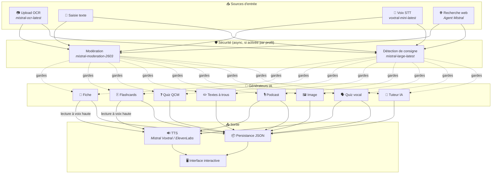
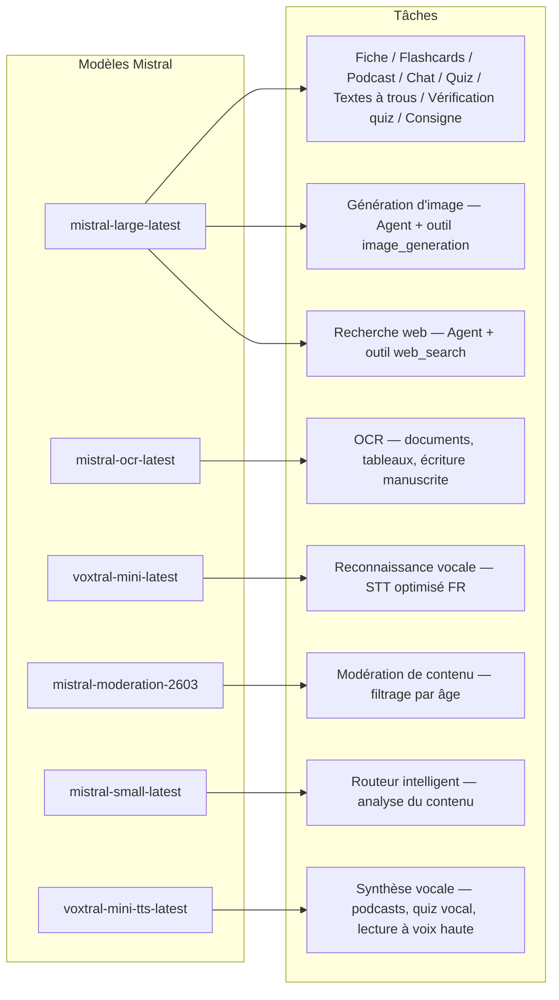
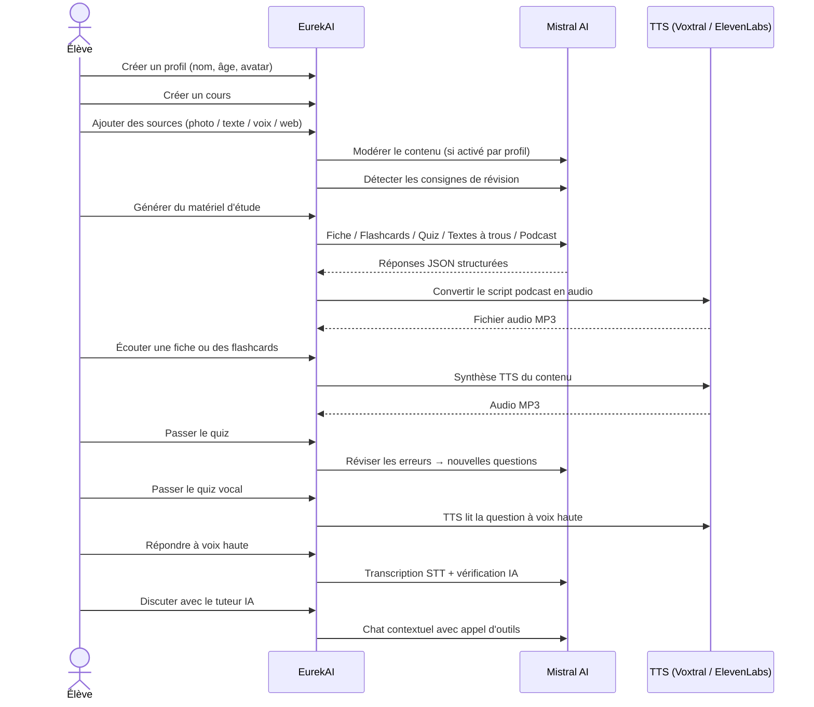

<p align="center">
  
</p>

<h1 align="center">EurekAI</h1>

<p align="center">
  <strong>Transformeer elk soort inhoud in een interactieve leerervaring — aangedreven door <a href="https://mistral.ai">Mistral AI</a>.</strong>
</p>

<p align="center">
  <a href="README-en.md">🇬🇧 Engels</a> · <a href="README-es.md">🇪🇸 Spaans</a> · <a href="README-pt.md">🇧🇷 Portugees</a> · <a href="README-de.md">🇩🇪 Duits</a> · <a href="README-it.md">🇮🇹 Italiaans</a> · <a href="README-nl.md">🇳🇱 Nederlands</a> · <a href="README-ar.md">🇸🇦 العربية</a><br>
  <a href="README-hi.md">🇮🇳 हिन्दी</a> · <a href="README-zh.md">🇨🇳 中文</a> · <a href="README-ja.md">🇯🇵 日本語</a> · <a href="README-ko.md">🇰🇷 한국어</a> · <a href="README-pl.md">🇵🇱 Pools</a> · <a href="README-ro.md">🇷🇴 Roemeens</a> · <a href="README-sv.md">🇸🇪 Zweeds</a>
</p>

<p align="center">
  <a href="https://www.youtube.com/watch?v=_b1TQz2leoI"></a>
</p>

<h4 align="center">📊 Codekwaliteit</h4>

<p align="center">
  <a href="https://sonarcloud.io/summary/new_code?id=jls42_EurekAI"></a>
  <a href="https://sonarcloud.io/summary/new_code?id=jls42_EurekAI"></a>
  <a href="https://sonarcloud.io/summary/new_code?id=jls42_EurekAI"></a>
  <a href="https://sonarcloud.io/summary/new_code?id=jls42_EurekAI"></a>
</p>
<p align="center">
  <a href="https://sonarcloud.io/summary/new_code?id=jls42_EurekAI"></a>
  <a href="https://sonarcloud.io/summary/new_code?id=jls42_EurekAI"></a>
  <a href="https://sonarcloud.io/summary/new_code?id=jls42_EurekAI"></a>
  <a href="https://sonarcloud.io/summary/new_code?id=jls42_EurekAI"></a>
</p>

---

## Het verhaal — Waarom EurekAI ?

**EurekAI** is ontstaan tijdens de [Mistral AI Worldwide Hackathon](https://luma.com/mistralhack-online) ([officiële site](https://worldwide-hackathon.mistral.ai/)) (maart 2026). Ik had een onderwerp nodig — en het idee kwam uit iets heel concreets: ik bereid regelmatig toetsen voor met mijn dochter, en ik dacht dat het mogelijk moest zijn om dat leuker en interactiever te maken met AI.

Het doel: neem **elke invoer** — een foto van het lesboek, gekopieerde tekst, een geluidsopname, een webzoekopdracht — en transformeer het in **samenvattingen, flashcards, quizzen, podcasts, invuloefeningen, illustraties en meer**. Alles aangedreven door de Franse modellen van Mistral AI, waardoor het van nature geschikt is voor Franstalige leerlingen.

Elke regel code is geschreven tijdens de hackathon. Alle open-source API's en bibliotheken worden gebruikt in overeenstemming met de regels van de hackathon.

---

## Functionaliteiten

| | Functionaliteit | Beschrijving |
|---|---|---|
| 📷 | **Upload OCR** | Maak een foto van je lesboek of notities — Mistral OCR extraheert de inhoud |
| 📝 | **Tekstinvoer** | Typ of plak elke tekst rechtstreeks |
| 🎤 | **Spraakinvoer** | Neem jezelf op — Voxtral STT transcribeert je stem |
| 🌐 | **Webzoekopdracht** | Stel een vraag — een Mistral-agent zoekt antwoorden op het web |
| 📄 | **Samenvattingen** | Gestructureerde notities met kernpunten, woordenschat, citaten, anekdotes |
| 🃏 | **Flashcards** | 5-50 Q/A-kaarten met bronverwijzingen voor actief onthouden |
| ❓ | **Meerkeuzequiz** | 5-50 meerkeuzevragen met adaptieve herhaling van fouten |
| ✏️ | **Invuloefeningen** | Oefeningen met ontbrekende woorden, hints en tolerante validatie |
| 🎙️ | **Podcast** | Mini-podcast met 2 stemmen geconverteerd naar audio via Mistral Voxtral TTS |
| 🖼️ | **Illustraties** | Educatieve afbeeldingen gegenereerd door een Mistral-agent |
| 🗣️ | **Spraakquiz** | Vragen worden voorgelezen, mondelinge antwoord, AI controleert het antwoord |
| 💬 | **AI-tutor** | Contextuele chat met je lesdocumenten, met aanroep van hulpmiddelen |
| 🧠 | **Slimme router** | De AI analyseert je inhoud en raadt de meest relevante generatoren aan uit de 7 beschikbare |
| 🔒 | **Ouderlijk toezicht** | Leeftijdsmoderatie, ouderlijke PIN, chatbeperkingen |
| 🌍 | **Meertalig** | Interface en AI-inhoud volledig in Frans en Engels |
| 🔊 | **Voorlezen** | Luister naar samenvattingen en flashcards via Mistral Voxtral TTS of ElevenLabs |

---

## Overzicht van de architectuur



---

## Overzicht van modelgebruik



---

## Gebruikersstroom



---

## Diepgaande blik — Functionaliteiten

### Multimodale invoer

EurekAI accepteert 4 typen bronnen, gemodereerd volgens profiel (standaard ingeschakeld voor kind en tiener):

- **Upload OCR** — JPG-, PNG- of PDF-bestanden verwerkt door `mistral-ocr-latest`. Behandelt gedrukt tekst, tabellen en handschrift.
- **Vrije tekst** — Typ of plak elke inhoud. Gemodereerd vóór opslag als moderatie is ingeschakeld.
- **Spraakinvoer** — Neem audio op in de browser. Getranscribeerd door `voxtral-mini-latest`. De instelling `language="fr"` optimaliseert de herkenning.
- **Webzoekopdracht** — Voer een zoekopdracht in. Een tijdelijke Mistral-agent met het hulpmiddel `web_search` haalt de resultaten op en vat ze samen.

### AI-inhoudsgeneratie

Zeven typen gegenereerd leermateriaal:

| Generator | Model | Uitvoer |
|---|---|---|
| **Samenvatting** | `mistral-large-latest` | Titel, samenvatting, 10-25 kernpunten, woordenschat, citaten, anekdote |
| **Flashcards** | `mistral-large-latest` | 5-50 Q/A-kaarten met bronverwijzingen voor actief onthouden |
| **Meerkeuzequiz** | `mistral-large-latest` | 5-50 vragen, 4 keuzes elk, uitleg, adaptieve herhaling |
| **Invuloefeningen** | `mistral-large-latest` | Zinnen om aan te vullen met hints, tolerante validatie (Levenshtein) |
| **Podcast** | `mistral-large-latest` + Voxtral TTS | Script voor 2 stemmen → MP3-audio |
| **Illustratie** | Agent `mistral-large-latest` | Educatieve afbeelding via het hulpmiddel `image_generation` |
| **Spraakquiz** | `mistral-large-latest` + Voxtral TTS + STT | Vragen TTS → antwoord STT → AI-verificatie |

### AI-tutor via chat

Een conversationele tutor met volledige toegang tot de lesdocumenten:

- Gebruikt `mistral-large-latest`
- **Roep hulpmiddelen aan**: kan tijdens het gesprek samenvattingen, flashcards, quizzen of invuloefeningen genereren
- Geschiedenis van 50 berichten per cursus
- Inhoudsmoderatie indien ingeschakeld voor het profiel

### Slimme automatische router

De router gebruikt `mistral-small-latest` om de inhoud van bronnen te analyseren en aan te bevelen welke generatoren het meest relevant zijn uit de 7 beschikbare — zodat leerlingen niet handmatig hoeven te kiezen. De interface toont realtime voortgang: eerst een analysefase, daarna de individuele generaties met annuleeroptie.

### Adaptief leren

- **Quizstatistieken**: bijhouden van pogingen en nauwkeurigheid per vraag
- **Quizherziening**: genereert 5-10 nieuwe vragen gericht op zwakke concepten
- **Detectie van instructies**: detecteert herhalingsinstructies ("Ik ken mijn les als ik ... weet") en prioriteert deze in alle generatoren

### Beveiliging & ouderlijk toezicht

- **4 leeftijdsgroepen**: kind (≤10 jaar), tiener (11-15), student (16-25), volwassene (26+)
- **Inhoudsmoderatie**: `mistral-moderation-2603` met 5 geblokkeerde categorieën voor kind/tiener (sexual, hate, violence, selfharm, jailbreaking), geen restricties voor student/volwassene
- **Ouderlijk PIN**: SHA-256-hash, vereist voor profielen jonger dan 15 jaar
- **Chatbeperkingen**: AI-chat standaard uitgeschakeld voor onder 16 jaar, door ouders inschakelbaar

### Multi-profielsysteem

- Meerdere profielen met naam, leeftijd, avatar, taalvoorkeuren
- Projecten gekoppeld aan profielen via `profileId`
- Cascaderende verwijdering: een profiel verwijderen verwijdert al zijn projecten

### TTS meervoudige providers

- **Mistral Voxtral TTS** (standaard): `voxtral-mini-tts-latest`, geen extra sleutel nodig
- **ElevenLabs** (alternatief): `eleven_v3`, natuurlijke stemmen, vereist `ELEVENLABS_API_KEY`
- Provider configureerbaar in de applicatie-instellingen

### Internationalisatie

- Volledige interface beschikbaar in het Frans en Engels
- AI-prompts ondersteunen vandaag 2 talen (FR, EN) met een architectuur klaar voor 15 (es, de, it, pt, nl, ja, zh, ko, ar, hi, pl, ro, sv)
- Taal instelbaar per profiel

---

## Technische stack

| Laag | Technologie | Rol |
|---|---|---|
| **Runtime** | Node.js + TypeScript 5.7 | Server en typeveiligheid |
| **Backend** | Express 4.21 | REST API |
| **Dev-server** | Vite 7.3 + tsx | HMR, Handlebars partials, proxy |
| **Frontend** | HTML + TailwindCSS 4.2 + Alpine.js 3.15 | Reactieve interface, TypeScript gecompileerd door Vite |
| **Templating** | vite-plugin-handlebars | HTML-compositie via partials |
| **AI** | Mistral AI SDK 2.1 | Chat, OCR, STT, TTS, Agents, Moderatie |
| **TTS (standaard)** | Mistral Voxtral TTS | `voxtral-mini-tts-latest`, geïntegreerde spraaksynthese |
| **TTS (alternatief)** | ElevenLabs SDK 2.36 | `eleven_v3`, natuurlijke stemmen |
| **Iconen** | Lucide 0.575 | SVG-icoonbibliotheek |
| **Markdown** | Marked 17 | Markdown-rendering in de chat |
| **Bestandsupload** | Multer 1.4 | Multipart-formulierbeheer |
| **Audio** | ffmpeg-static | Samenvoegen van audiosegmenten |
| **Tests** | Vitest 4 | Unit tests — coverage gemeten door SonarCloud |
| **Persistentie** | JSON-bestanden | Opslag zonder afhankelijkheden |

---

## Modelreferentie

| Model | Gebruik | Waarom |
|---|---|---|
| `mistral-large-latest` | Samenvatting, Flashcards, Podcast, Quiz, Invuloefeningen, Chat, Spraakquiz-verificatie, Agent Image, Agent Web Search, Detectie van instructies | Beste meertalig + instructievastheid |
| `mistral-ocr-latest` | Document OCR | Gedrukt tekst, tabellen, handschrift |
| `voxtral-mini-latest` | Spraakherkenning (STT) | Multilinguale STT, geoptimaliseerd met `language="fr"` |
| `voxtral-mini-tts-latest` | Spraaksynthese (TTS) | Podcasts, spraakquiz, voorlezen |
| `mistral-moderation-2603` | Inhoudsmoderatie | 5 categorieën geblokkeerd voor kind/tiener (+ jailbreaking) |
| `mistral-small-latest` | Slimme router | Snelle inhoudsanalyse voor routeringsbeslissingen |
| `eleven_v3` (ElevenLabs) | Spraaksynthese (alternatieve TTS) | Natuurlijke stemmen, configureerbaar alternatief |

---

## Snelstart

```bash
# Cloner le dépôt
git clone https://github.com/jls42/EurekAI.git
cd EurekAI

# Installer les dépendances
npm install

# Configurer les clés API
cp .env.example .env
# Éditez .env avec vos clés :
#   MISTRAL_API_KEY=votre_clé_ici           (requis)
#   ELEVENLABS_API_KEY=votre_clé_ici        (optionnel, TTS alternatif)

# Lancer le développement
npm run dev
# → Backend :  http://localhost:3000 (API)
# → Frontend : http://localhost:5173 (serveur Vite avec HMR)
```

> **Opmerking** : Mistral Voxtral TTS is de standaardprovider — geen extra sleutel nodig buiten `MISTRAL_API_KEY`. ElevenLabs is een alternatief TTS-provider die configureerbaar is in de instellingen.

---

## Projectstructuur

```
server.ts                 — Point d'entrée Express, monte les routes + config
config.ts                 — Config runtime (modèles, voix, TTS provider), persistée dans output/config.json
store.ts                  — ProjectStore : CRUD projets/sources/générations, persistance JSON
profiles.ts               — ProfileStore : gestion des profils, hachage PIN
types.ts                  — Types TypeScript : Source, Generation (7 types), QuizStats, Profile
prompts.ts                — Tous les prompts IA centralisés (system + user templates, FR/EN)

generators/
  ocr.ts                  — Upload + OCR via Mistral (JPG, PNG, PDF)
  summary.ts              — Génération de fiche de révision (JSON structuré)
  flashcards.ts           — Flashcards Q/R (5-50, configurable)
  quiz.ts                 — Quiz QCM (5-50 questions, configurable) + révision adaptative
  fill-blank.ts           — Exercices à trous avec validation tolérante
  podcast.ts              — Script podcast 2 voix
  quiz-vocal.ts           — Quiz vocal : questions TTS + réponses STT + vérification IA
  image.ts                — Génération d'image via Agent Mistral (outil image_generation)
  chat.ts                 — Tuteur IA par chat avec appel d'outils
  router.ts               — Routeur automatique intelligent (contenu → générateurs recommandés)
  consigne.ts             — Détection de consignes de révision
  tts-provider.ts         — Dispatch TTS multi-provider (Mistral Voxtral / ElevenLabs)
  tts.ts                  — Génération audio podcast (concaténation de segments)
  stt.ts                  — Voxtral STT (audio → texte)
  websearch.ts            — Agent Mistral avec outil web_search
  moderation.ts           — Modération de contenu (filtrage par âge)

routes/
  projects.ts             — CRUD projets
  profiles.ts             — CRUD profils avec gestion du PIN
  sources.ts              — Upload OCR, texte libre, voix STT, recherche web, modération
  generate.ts             — Endpoints de génération (7 types + auto + route)
  generations.ts          — Tentatives de quiz/fill-blank, réponses vocales, lecture à voix haute
  chat.ts                 — Chat IA avec appel d'outils

helpers/
  index.ts                — safeParseJson, unwrapJsonArray, extractAllText, timer
  audio.ts                — collectStream (ReadableStream → Buffer)
  fill-blank-validate.ts  — Validation tolérante des réponses (normalisation, Levenshtein)

src/                      — Frontend (Vite + Handlebars)
  index.html              — Point d'entrée HTML principal
  main.ts                 — Entrée frontend (init Alpine.js + icônes Lucide)
  app/                    — Modules applicatifs Alpine.js
    state.ts              — Gestion d'état réactif
    navigation.ts         — Routage des vues + gardes par âge
    profiles.ts           — Logique du sélecteur de profils
    projects.ts           — CRUD des cours
    sources.ts            — Gestionnaires d'upload de sources
    generate.ts           — Déclencheurs de génération (individuel, tout, auto 2 phases)
    generations.ts        — Affichage + actions sur les générations
    chat.ts               — Interface de chat
    config.ts             — Interface de configuration (modèles, voix, TTS provider)
    render.ts             — Helpers de rendu HTML
    i18n.ts               — Changement de langue
    ...
  components/
    quiz.ts               — Composant quiz interactif
    quiz-vocal.ts         — Composant quiz vocal
    fill-blank.ts         — Composant textes à trous
    flashcards.ts         — Composant flashcards avec retournement
    step-by-step.ts       — Mixin navigation pas-à-pas (quiz, fill-blank, flashcards)
  i18n/
    fr.ts                 — Traductions françaises
    en.ts                 — Traductions anglaises
    index.ts              — Chargeur i18n
  partials/               — Partials HTML Handlebars (header, sidebar, dialogues, vues)
  styles/
    main.css              — Entrée TailwindCSS
    theme.css             — Variables de thème personnalisées

public/assets/            — Ressources statiques (logo, avatars)
output/                   — Données d'exécution (projets, config, fichiers audio)
```

---

## API-referentie

### Config
| Methode | Endpoint | Beschrijving |
|---|---|---|
| `GET` | `/api/config` | Huidige configuratie |
| `PUT` | `/api/config` | Config wijzigen (modellen, stemmen, TTS-provider) |
| `GET` | `/api/config/status` | API-status (Mistral, ElevenLabs, TTS) |
| `POST` | `/api/config/reset` | Reset naar standaardconfiguratie |
| `GET` | `/api/config/voices` | Lijst Mistral TTS-stemmen (optioneel `?lang=fr`) |

### Profielen
| Methode | Endpoint | Beschrijving |
|---|---|---|
| `GET` | `/api/profiles` | Alle profielen opvragen |
| `POST` | `/api/profiles` | Profiel aanmaken |
| `PUT` | `/api/profiles/:id` | Profiel wijzigen (PIN vereist voor < 15 jaar) |
| `DELETE` | `/api/profiles/:id` | Profiel verwijderen + cascade projecten |

### Projecten
| Methode | Endpoint | Beschrijving |
|---|---|---|
| `GET` | `/api/projects` | Projecten opsommen |
| `POST` | `/api/projects` | Project aanmaken `{name, profileId}` |
| `GET` | `/api/projects/:pid` | Projectdetails |
| `PUT` | `/api/projects/:pid` | Hernoemen `{name}` |
| `DELETE` | `/api/projects/:pid` | Project verwijderen |

### Bronnen
| Methode | Endpoint | Beschrijving |
|---|---|---|
| `POST` | `/api/projects/:pid/sources/upload` | Upload OCR (multipart-bestanden) |
| `POST` | `/api/projects/:pid/sources/text` | Vrije tekst `{text}` |
| `POST` | `/api/projects/:pid/sources/voice` | Spraak STT (multipart-audio) |
| `POST` | `/api/projects/:pid/sources/websearch` | Webzoekopdracht `{query}` |
| `DELETE` | `/api/projects/:pid/sources/:sid` | Bron verwijderen |
| `POST` | `/api/projects/:pid/moderate` | Modereren `{text}` |
| `POST` | `/api/projects/:pid/detect-consigne` | Detectie van herhalingsinstructies |

### Generatie
| Methode | Endpoint | Beschrijving |
|---|---|---|
| `POST` | `/api/projects/:pid/generate/summary` | Samenvatting |
| `POST` | `/api/projects/:pid/generate/flashcards` | Flashcards |
| `POST` | `/api/projects/:pid/generate/quiz` | Meerkeuzequiz |
| `POST` | `/api/projects/:pid/generate/fill-blank` | Invuloefeningen |
| `POST` | `/api/projects/:pid/generate/podcast` | Podcast |
| `POST` | `/api/projects/:pid/generate/image` | Illustratie |
| `POST` | `/api/projects/:pid/generate/quiz-vocal` | Spraakquiz |
| `POST` | `/api/projects/:pid/generate/quiz-review` | Adaptieve herziening `{generationId, weakQuestions}` |
| `POST` | `/api/projects/:pid/generate/route` | Routeringsanalyse (plan van te starten generatoren) |
| `POST` | `/api/projects/:pid/generate/auto` | Automatische backendgeneratie (routering + 5 types: summary, flashcards, quiz, fill-blank, podcast) |

Alle generatie-routes accepteren `{sourceIds?, lang?, ageGroup?, count?, useConsigne?}`.

### CRUD Generaties
| Methode | Endpoint | Beschrijving |
|---|---|---|
| `POST` | `/api/projects/:pid/generations/:gid/quiz-attempt` | Quizantwoorden indienen `{answers}` |
| `POST` | `/api/projects/:pid/generations/:gid/fill-blank-attempt` | Invuloefeningantwoorden indienen `{answers}` |
| `POST` | `/api/projects/:pid/generations/:gid/vocal-answer` | Mondeling antwoord verifiëren (audio + questionIndex) |
| `POST` | `/api/projects/:pid/generations/:gid/read-aloud` | TTS-voorlezen (samenvattingen/flashcards) |
| `PUT` | `/api/projects/:pid/generations/:gid` | Hernoemen `{title}` |
| `DELETE` | `/api/projects/:pid/generations/:gid` | Generatie verwijderen |

### Chat
| Methode | Endpoint | Beschrijving |
|---|---|---|
| `GET` | `/api/projects/:pid/chat` | Chatgeschiedenis ophalen |
| `POST` | `/api/projects/:pid/chat` | Bericht sturen `{message, lang, ageGroup}` |
| `DELETE` | `/api/projects/:pid/chat` | Chatgeschiedenis wissen |

---

## Architecturale beslissingen

| Beslissing | Rechtvaardiging |
|---|---|
| **Alpine.js in plaats van React/Vue** | Minimale footprint, lichte reactiviteit met TypeScript gecompileerd door Vite. Perfect voor een hackathon waar snelheid telt. |
| **Persistentie in JSON-bestanden** | Geen afhankelijkheden, directe start. Geen databaseconfiguratie nodig — je kunt meteen beginnen. |
| **Vite + Handlebars** | Het beste van beide werelden: snelle HMR voor ontwikkeling, HTML-partials voor codeorganisatie, Tailwind JIT. |
| **Gecentraliseerde prompts** | Alle AI-prompts in `prompts.ts` — gemakkelijk itereren, testen en aanpassen per taal/leeftijdsgroep. |
| **Multi-generatie systeem** | Elke generatie is een onafhankelijk object met zijn eigen ID — maakt meerdere samenvattingen, quizzen, enz. per cursus mogelijk. |
| **Leeftijdsgeschikte prompts** | 4 leeftijdsgroepen met verschillend vocabulaire, complexiteit en toon — dezelfde inhoud wordt anders onderwezen afhankelijk van de leerling. |
| **Agentgebaseerde functies** | De beeldgeneratie en webzoekopdrachten gebruiken tijdelijke Mistral Agents — eigen levenscyclus met automatische opschoning. |
| **TTS multi-provider** | Standaard Mistral Voxtral TTS (geen extra sleutel), ElevenLabs als alternatief — configureerbaar zonder herstart. |

---

## Credits & dank

- **[Mistral AI](https://mistral.ai)** — AI-modellen (Large, OCR, Voxtral STT, Voxtral TTS, Moderation, Small) + Worldwide Hackathon
- **[ElevenLabs](https://elevenlabs.io)** — Alternatieve spraaksynthesemotor (`eleven_v3`)
- **[Alpine.js](https://alpinejs.dev)** — Lichtgewicht reactief framework
- **[TailwindCSS](https://tailwindcss.com)** — Utility-first CSS-framework
- **[Vite](https://vitejs.dev)** — Frontend buildtool
- **[Lucide](https://lucide.dev)** — Pictogrammenbibliotheek
- **[Marked](https://marked.js.org)** — Markdown-parser

Gebouwd met zorg tijdens de Mistral AI Worldwide Hackathon, maart 2026.

---

## Auteur

**Julien LS** — [contact@jls42.org](mailto:contact@jls42.org)

## Licentie

[AGPL-3.0](LICENSE) — Copyright (C) 2026 Julien LS

**Dit document is vertaald van de Franse versie naar het Nederlands met behulp van het model gpt-5-mini. Voor meer informatie over het vertaalproces, raadpleeg https://gitlab.com/jls42/ai-powered-markdown-translator**

