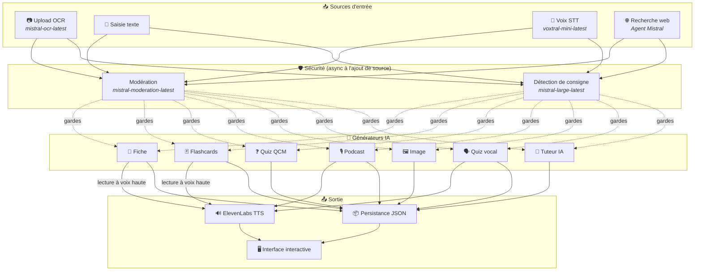
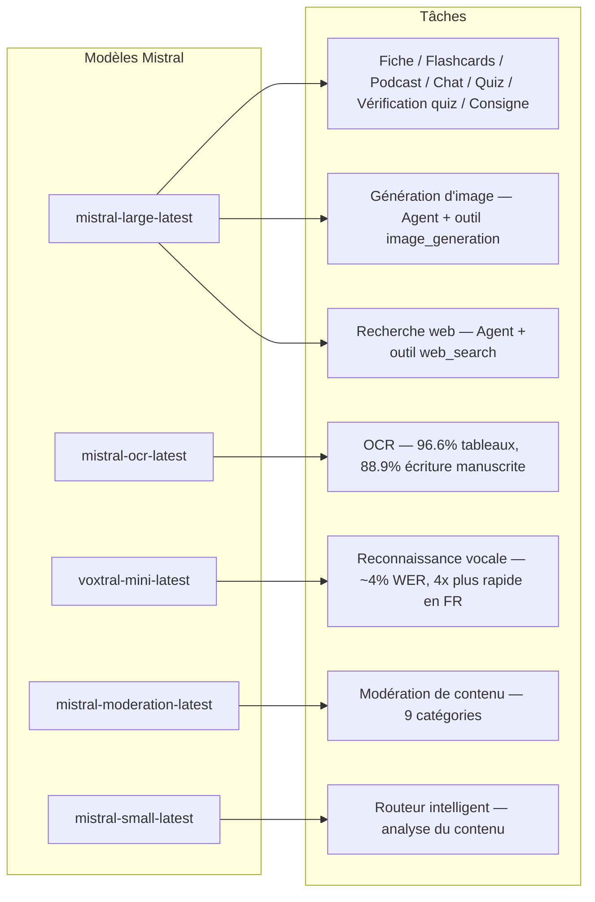
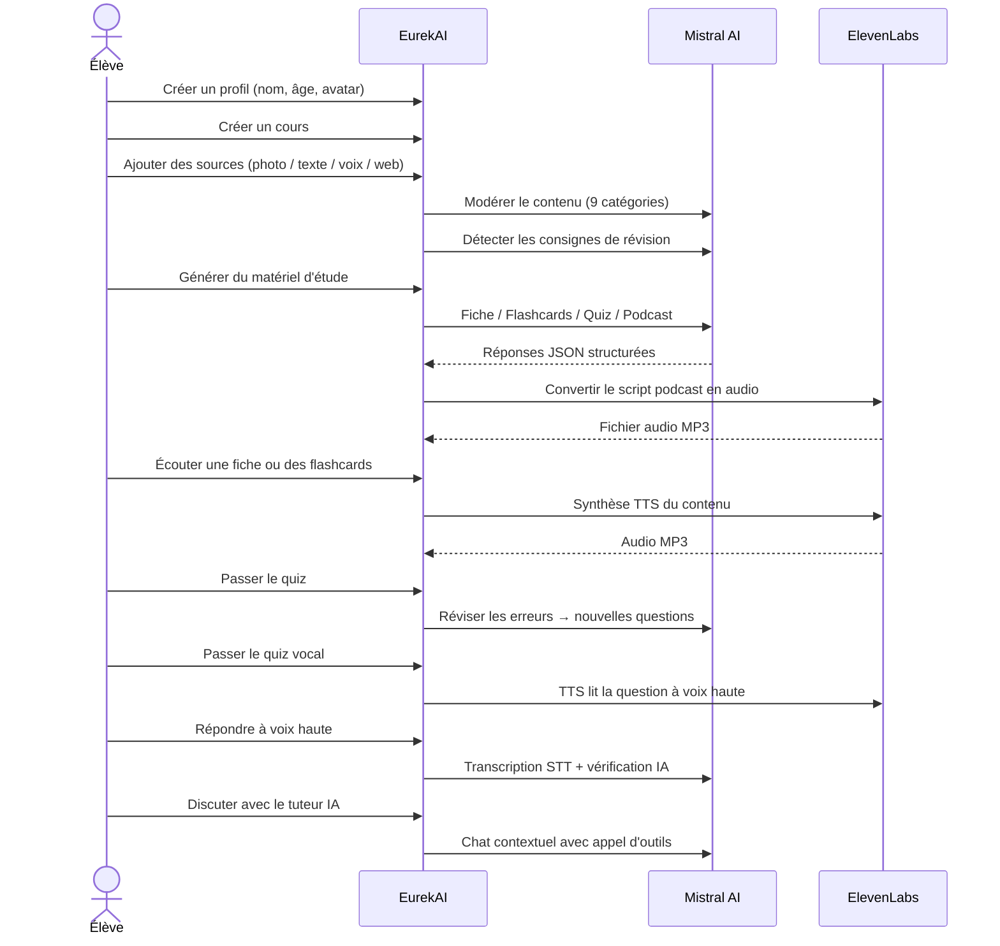

<p align="center">
  
</p>

<h1 align="center">EurekAI</h1>

<p align="center">
  <strong>Zet gelijk welke inhoud om in een interactieve leerervaring — aangedreven door AI.</strong>
</p>

<p align="center">
  <a href="https://mistral.ai"></a>
  <a href="https://www.typescriptlang.org"></a>
  <a href="https://mistral.ai"></a>
  <a href="https://elevenlabs.io"></a>
</p>

<p align="center">
  <a href="https://www.youtube.com/watch?v=_b1TQz2leoI">▶️ Bekijk de demo op YouTube</a> · <a href="README-en.md">🇬🇧 Lees in het Engels</a>
</p>

---

## Het verhaal — Waarom EurekAI?

**EurekAI** is ontstaan tijdens de [Mistral AI Worldwide Hackathon](https://worldwidehackathon.mistral.ai/) (maart 2026). Ik had een onderwerp nodig — en het idee kwam voort uit iets heel concreets: ik bereid regelmatig toetsen voor met mijn dochter, en ik dacht dat het toch mogelijk moest zijn om dat speelser en interactiever te maken met behulp van AI.

Het doel: **elke input** nemen — een foto van het handboek, een gekopieerde tekst, een spraakopname, een webzoekopdracht — en die omzetten in **samenvattingen, flashcards, quizzen, podcasts, illustraties en nog veel meer**. Alles aangedreven door de Franse modellen van Mistral AI, waardoor het van nature geschikt is voor Franstalige leerlingen.

Elke regel code is geschreven tijdens de hackathon. Alle API's en open-sourcebibliotheken worden gebruikt in overeenstemming met de regels van de hackathon.

---

## Functionaliteiten

| | Functionaliteit | Beschrijving |
|---|---|---|
| 📷 | **OCR-upload** | Maak een foto van je handboek of notities — Mistral OCR haalt de inhoud eruit |
| 📝 | **Tekstinvoer** | Typ of plak rechtstreeks om het even welke tekst |
| 🎤 | **Spraakinvoer** | Neem jezelf op — Voxtral STT transcribeert je stem |
| 🌐 | **Webzoekopdracht** | Stel een vraag — een Mistral-agent zoekt antwoorden op het web |
| 📄 | **Samenvattingen** | Gestructureerde notities met kernpunten, vocabulaire, citaten, anekdotes |
| 🃏 | **Flashcards** | 5 vraag-antwoordkaarten met bronverwijzingen voor actief onthouden |
| ❓ | **Meerkeuzequiz** | 10-20 meerkeuzevragen met adaptieve herhaling van fouten |
| 🎙️ | **Podcast** | Mini-podcast met 2 stemmen (Alex & Zoé) omgezet naar audio via ElevenLabs |
| 🖼️ | **Illustraties** | Educatieve beelden gegenereerd door een Mistral-agent |
| 🗣️ | **Stemquiz** | Vragen worden hardop voorgelezen, mondeling antwoord, de AI controleert het antwoord |
| 💬 | **AI-tutor** | Contextuele chat met je cursusdocumenten, met toolaanroepen |
| 🧠 | **Slimme router** | De AI analyseert je inhoud en beveelt de beste generators aan |
| 🔒 | **Ouderlijk toezicht** | Leeftijdsmoderatie, ouderlijke pincode, chatbeperkingen |
| 🌍 | **Meertalig** | Volledige interface en AI-inhoud in het Frans en Engels |
| 🔊 | **Voorlezen** | Luister naar samenvattingen en flashcards die hardop worden voorgelezen via ElevenLabs TTS |

---

## Overzicht van de architectuur



---

## Overzicht van modelgebruik



---

## Gebruikerspad



---

## Diepgaand — Functionaliteiten

### Meervoudige invoer

EurekAI accepteert 4 soorten bronnen, allemaal gemodereerd vóór verwerking:

- **OCR-upload** — JPG-, PNG- of PDF-bestanden verwerkt door `mistral-ocr-latest`. Ondersteunt gedrukte tekst, tabellen (96.6% nauwkeurigheid) en handschrift (88.9% nauwkeurigheid).
- **Vrije tekst** — Typ of plak om het even welke inhoud. Gaat door moderatie vóór opslag.
- **Spraakinvoer** — Neem audio op in de browser. Getranscribeerd door `voxtral-mini-latest` met ~4% WER. De parameter `language="fr"` maakt het 4x sneller.
- **Webzoekopdracht** — Voer een zoekopdracht in. Een tijdelijke Mistral-agent met de tool `web_search` haalt resultaten op en vat ze samen.

### Generatie van AI-inhoud

Zes soorten gegenereerd leermateriaal:

| Generator | Model | Uitvoer |
|---|---|---|
| **Samenvatting** | `mistral-large-latest` | Titel, samenvatting, 10-25 kernpunten, vocabulaire, citaten, anekdote |
| **Flashcards** | `mistral-large-latest` | 5 vraag-antwoordkaarten met bronverwijzingen |
| **Meerkeuzequiz** | `mistral-large-latest` | 10-20 vragen, elk met 4 keuzes, uitleg, adaptieve herhaling |
| **Podcast** | `mistral-large-latest` + ElevenLabs | Script met 2 stemmen (Alex & Zoé) → MP3-audio |
| **Illustratie** | Agent `mistral-large-latest` | Educatieve afbeelding via de tool `image_generation` |
| **Stemquiz** | `mistral-large-latest` + ElevenLabs + Voxtral | Vragen TTS → antwoord STT → AI-verificatie |

### AI-tutor via chat

Een conversationele tutor met volledige toegang tot cursusdocumenten:

- Gebruikt `mistral-large-latest` (contextvenster van 128K tokens)
- **Toolaanroepen**: kan tijdens het gesprek online samenvattingen, flashcards of quizzen genereren
- Geschiedenis van 50 berichten per cursus
- Inhoudsmoderatie voor profielen op basis van leeftijd

### Slimme automatische router

De router gebruikt `mistral-small-latest` om de inhoud van de bronnen te analyseren en aan te bevelen welke generators het meest relevant zijn — zodat leerlingen niet handmatig hoeven te kiezen.

### Adaptief leren

- **Quizstatistieken**: bijhouden van pogingen en nauwkeurigheid per vraag
- **Quizherhaling**: genereert 5-10 nieuwe vragen die zich richten op zwakke concepten
- **Detectie van leerinstructies**: detecteert herhalingsinstructies ("Ik ken mijn les als ik weet...") en geeft die prioriteit in alle generators

### Beveiliging & ouderlijk toezicht

- **4 leeftijdsgroepen**: kind (6-10), tiener (11-15), student (16+), volwassene
- **Inhoudsmoderatie**: 9 categorieën via `mistral-moderation-latest`, aangepaste drempels per leeftijdsgroep
- **Ouderlijke pincode**: SHA-256-hash, vereist voor profielen jonger dan 15 jaar
- **Chatbeperkingen**: AI-chat alleen beschikbaar voor profielen van 15 jaar en ouder

### Systeem met meerdere profielen

- Meerdere profielen met naam, leeftijd, avatar, taalvoorkeuren
- Projecten gekoppeld aan profielen via `profileId`
- Cascadesverwijdering: een profiel verwijderen verwijdert al zijn projecten

### Internationalisering

- Volledige interface beschikbaar in het Frans en Engels
- AI-prompts ondersteunen vandaag 2 talen (FR, EN) met architectuur klaar voor 15 (es, de, it, pt, nl, ja, zh, ko, ar, hi, pl, ro, sv)
- Taal configureerbaar per profiel

---

## Technische stack

| Laag | Technologie | Rol |
|---|---|---|
| **Runtime** | Node.js + TypeScript 5.7 | Server en typeveiligheid |
| **Backend** | Express 4.21 | REST API |
| **Devserver** | Vite 7.3 + tsx | HMR, Handlebars-partials, proxy |
| **Frontend** | HTML + TailwindCSS 4.2 + Alpine.js 3.15 | Reactieve interface, door Vite gecompileerde TypeScript |
| **Templating** | vite-plugin-handlebars | HTML-compositie via partials |
| **AI** | Mistral AI SDK 1.14 | Chat, OCR, STT, Agents, Moderatie |
| **TTS** | ElevenLabs SDK 2.36 | Spraaksynthese voor podcasts en stemquizzen |
| **Iconen** | Lucide 0.575 | SVG-icoonbibliotheek |
| **Markdown** | Marked 17 | Markdown-rendering in chat |
| **Bestandsupload** | Multer 1.4 | Afhandeling van multipart-formulieren |
| **Audio** | ffmpeg-static | Audiobewerking |
| **Tests** | Vitest 4 | Unittests |
| **Persistente opslag** | JSON-bestanden | Opslag zonder afhankelijkheden |

---

## Modelreferentie

| Model | Gebruik | Waarom |
|---|---|---|
| `mistral-large-latest` | Samenvatting, Flashcards, Podcast, Meerkeuzequiz, Chat, Quizverificatie, Afbeeldingsagent, Webzoekagent, Detectie van instructies | Beste meertalig + instructievolging |
| `mistral-ocr-latest` | Document-OCR | 96.6% nauwkeurigheid voor tabellen, 88.9% handschrift |
| `voxtral-mini-latest` | Spraakherkenning | ~4% WER, `language="fr"` geeft 4x+ snelheid |
| `mistral-moderation-latest` | Inhoudsmoderatie | 9 categorieën, kinderveiligheid |
| `mistral-small-latest` | Slimme router | Snelle inhoudsanalyse voor routeringsbeslissingen |
| `eleven_v3` (ElevenLabs) | Spraaksynthese | Natuurlijke Franse stemmen voor podcasts en stemquizzen |

---

## Snel aan de slag

```bash
# Cloner le dépôt
git clone https://github.com/your-username/eurekai.git
cd eurekai

# Installer les dépendances
npm install

# Configurer les clés API
cp .env.example .env
# Éditez .env avec vos clés :
#   MISTRAL_API_KEY=votre_clé_ici
#   ELEVENLABS_API_KEY=votre_clé_ici  (optionnel, pour les fonctions audio)

# Lancer le développement
npm run dev
# → Backend :  http://localhost:3000 (API)
# → Frontend : http://localhost:5173 (serveur Vite avec HMR)
```

> **Opmerking**: ElevenLabs is optioneel. Zonder deze sleutel zullen de podcast- en stemquizfuncties de scripts genereren maar geen audio synthetiseren.

---

## Projectstructuur

```
server.ts                 — Point d'entrée Express, monte les routes + config
config.ts                 — Config runtime (modèles, voix, TTS), persistée dans output/config.json
store.ts                  — ProjectStore : CRUD projets/sources/générations, persistance JSON
profiles.ts               — ProfileStore : gestion des profils, hachage PIN
types.ts                  — Types TypeScript : Source, Generation (6 types), QuizStats, Profile
prompts.ts                — Tous les prompts IA centralisés (system + user templates, FR/EN)

generators/
  ocr.ts                  — Upload + OCR via Mistral (JPG, PNG, PDF)
  summary.ts              — Génération de fiche de révision (JSON structuré)
  flashcards.ts           — 5 flashcards Q/R
  quiz.ts                 — Quiz QCM (10-20 questions) + révision adaptative
  podcast.ts              — Script podcast 2 voix (Alex + Zoé)
  quiz-vocal.ts           — Quiz vocal : questions TTS + réponses STT + vérification IA
  image.ts                — Génération d'image via Agent Mistral (outil image_generation)
  chat.ts                 — Tuteur IA par chat avec appel d'outils
  router.ts               — Routeur automatique intelligent (contenu → générateurs recommandés)
  consigne.ts             — Détection de consignes de révision
  tts.ts                  — ElevenLabs TTS (eleven_v3, concaténation de segments)
  stt.ts                  — Voxtral STT (audio → texte)
  websearch.ts            — Agent Mistral avec outil web_search
  moderation.ts           — Modération de contenu (9 catégories)

routes/
  projects.ts             — CRUD projets
  sources.ts              — Upload OCR, texte libre, voix STT, recherche web, modération
  generate.ts             — Endpoints de génération (fiche/flashcards/quiz/podcast/image/vocal)
  generations.ts          — Tentatives de quiz, réponses vocales, lecture à voix haute, renommage, suppression
  chat.ts                 — Chat IA avec appel d'outils
  profiles.ts             — CRUD profils avec gestion du PIN

helpers/
  index.ts                — safeParseJson, unwrapJsonArray, extractAllText, timer
  audio.ts                — collectStream (ReadableStream → Buffer)

src/                      — Frontend (Vite + Handlebars)
  index.html              — Point d'entrée HTML principal
  main.ts                 — Entrée frontend (init Alpine.js + icônes Lucide)
  app/                    — Modules applicatifs Alpine.js
    state.ts              — Gestion d'état réactif
    navigation.ts         — Routage des vues + gardes par âge
    profiles.ts           — Logique du sélecteur de profils
    projects.ts           — CRUD des cours
    sources.ts            — Gestionnaires d'upload de sources
    generate.ts           — Déclencheurs de génération
    generations.ts        — Affichage + actions sur les générations
    chat.ts               — Interface de chat
    render.ts             — Helpers de rendu HTML
    i18n.ts               — Changement de langue
    ...
  components/
    quiz.ts               — Composant quiz interactif
    quiz-vocal.ts         — Composant quiz vocal
  i18n/
    fr.ts                 — Traductions françaises
    en.ts                 — Traductions anglaises
    index.ts              — Chargeur i18n
  partials/               — Partials HTML Handlebars (header, sidebar, dialogues, vues)
  styles/
    main.css              — Entrée TailwindCSS
    theme.css             — Variables de thème personnalisées

public/assets/            — Ressources statiques (logo, avatars)
output/                   — Données d'exécution (projets, config, fichiers audio)
```

---

## API-referentie

### Configuratie
| Methode | Endpoint | Beschrijving |
|---|---|---|
| `GET` | `/api/config` | Huidige configuratie |
| `PUT` | `/api/config` | Configuratie wijzigen (modellen, stemmen, TTS) |
| `GET` | `/api/config/status` | Status van de API's (Mistral, ElevenLabs) |

### Profielen
| Methode | Endpoint | Beschrijving |
|---|---|---|
| `GET` | `/api/profiles` | Alle profielen opsommen |
| `POST` | `/api/profiles` | Een profiel aanmaken |
| `PUT` | `/api/profiles/:id` | Een profiel wijzigen (pincode vereist voor < 15 jaar) |
| `DELETE` | `/api/profiles/:id` | Een profiel verwijderen + cascade projecten |

### Projecten
| Methode | Endpoint | Beschrijving |
|---|---|---|
| `GET` | `/api/projects` | Projecten opsommen |
| `POST` | `/api/projects` | Een `{name, profileId}`-project aanmaken |
| `GET` | `/api/projects/:pid` | Projectdetails |
| `PUT` | `/api/projects/:pid` | `{name}` hernoemen |
| `DELETE` | `/api/projects/:pid` | Het project verwijderen |

### Bronnen
| Methode | Endpoint | Beschrijving |
|---|---|---|
| `POST` | `/api/projects/:pid/sources/upload` | OCR-upload (multipart-bestanden) |
| `POST` | `/api/projects/:pid/sources/text` | Vrije tekst `{text}` |
| `POST` | `/api/projects/:pid/sources/voice` | STT-stem (multipart-audio) |
| `POST` | `/api/projects/:pid/sources/websearch` | Webzoekopdracht `{query}` |
| `DELETE` | `/api/projects/:pid/sources/:sid` | Een bron verwijderen |
| `POST` | `/api/projects/:pid/moderate` | `{text}` modereren |
| `POST` | `/api/projects/:pid/detect-consigne` | Herhalingsinstructies detecteren |

### Generatie
| Methode | Endpoint | Beschrijving |
|---|---|---|
| `POST` | `/api/projects/:pid/generate/summary` | Samenvatting `{sourceIds?}` |
| `POST` | `/api/projects/:pid/generate/flashcards` | Flashcards `{sourceIds?}` |
| `POST` | `/api/projects/:pid/generate/quiz` | Meerkeuzequiz `{sourceIds?}` |
| `POST` | `/api/projects/:pid/generate/podcast` | Podcast `{sourceIds?}` |
| `POST` | `/api/projects/:pid/generate/image` | Illustratie `{sourceIds?}` |
| `POST` | `/api/projects/:pid/generate/quiz-vocal` | Stemquiz `{sourceIds?}` |
| `POST` | `/api/projects/:pid/generate/quiz-review` | Adaptieve herhaling `{generationId, weakQuestions}` |
| `POST` | `/api/projects/:pid/generate/auto` | Automatische generatie door de router |

### CRUD-generaties
| Methode | Endpoint | Beschrijving |
|---|---|---|
| `POST` | `/api/projects/:pid/generations/:gid/quiz-attempt` | Antwoorden indienen `{answers}` |
| `POST` | `/api/projects/:pid/generations/:gid/vocal-answer` | Een mondeling antwoord controleren (multipart-audio + questionIndex) |
| `POST` | `/api/projects/:pid/generations/:gid/read-aloud` | TTS hardop voorlezen (samenvattingen/flashcards) |
| `PUT` | `/api/projects/:pid/generations/:gid` | `{title}` hernoemen |
| `DELETE` | `/api/projects/:pid/generations/:gid` | De generatie verwijderen |

### Chat
| Methode | Endpoint | Beschrijving |
|---|---|---|
| `GET` | `/api/projects/:pid/chat` | De chatgeschiedenis ophalen |
| `POST` | `/api/projects/:pid/chat` | Een bericht sturen `{message}` |
| `DELETE` | `/api/projects/:pid/chat` | De chatgeschiedenis wissen |

---

## Architecturale beslissingen

| Beslissing | Rechtvaardiging |
|---|---|
| **Alpine.js in plaats van React/Vue** | Minimale footprint, lichte reactiviteit met door Vite gecompileerde TypeScript. Perfect voor een hackathon waar snelheid telt. |
| **Opslag in JSON-bestanden** | Geen afhankelijkheden, directe start. Geen database om in te stellen — starten en gaan. |
| **Vite + Handlebars** | Het beste van twee werelden: snelle HMR voor ontwikkeling, HTML-partials voor codeorganisatie, Tailwind JIT. |
| **Gecentraliseerde prompts** | Alle AI-prompts in `prompts.ts` — makkelijk te itereren, testen en aanpassen per taal/leeftijdsgroep. |
| **Systeem met meerdere generaties** | Elke generatie is een zelfstandig object met een eigen ID — maakt meerdere samenvattingen, quizzen, enz. per cursus mogelijk. |
| **Leeftijdsafhankelijke prompts** | 4 leeftijdsgroepen met verschillende woordenschat, complexiteit en toon — dezelfde inhoud leert anders afhankelijk van de leerling. |
| **Functies gebaseerd op Agents** | Afbeeldingsgeneratie en webzoekopdrachten gebruiken tijdelijke Mistral-agents — nette levenscyclus met automatische opschoning. |

---

## Credits & dankbetuigingen

- **[Mistral AI](https://mistral.ai)** — AI-modellen (Large, OCR, Voxtral, Moderation, Small) + Worldwide Hackathon
- **[ElevenLabs](https://elevenlabs.io)** — Spraaksynthese-engine (`eleven_v3`)
- **[Alpine.js](https://alpinejs.dev)** — Lichtgewicht reactief framework
- **[TailwindCSS](https://tailwindcss.com)** — Utility-first CSS-framework
- **[Vite](https://vitejs.dev)** — Frontend-buildtool
- **[Lucide](https://lucide.dev)** — Icoonbibliotheek
- **[Marked](https://marked.js.org)** — Markdown-parser

Met zorg gebouwd tijdens de Mistral AI Worldwide Hackathon, maart 2026.

---

## Auteur

**Julien LS** — [contact@jls42.org](mailto:contact@jls42.org)

## Licentie

[AGPL-3.0](LICENSE) — Copyright (C) 2026 Julien LS

**Dit document is vertaald van de fr-versie naar de nl-taal met behulp van het model gpt-5.4-mini. Voor meer informatie over het vertaalproces, raadpleeg https://gitlab.com/jls42/ai-powered-markdown-translator**

