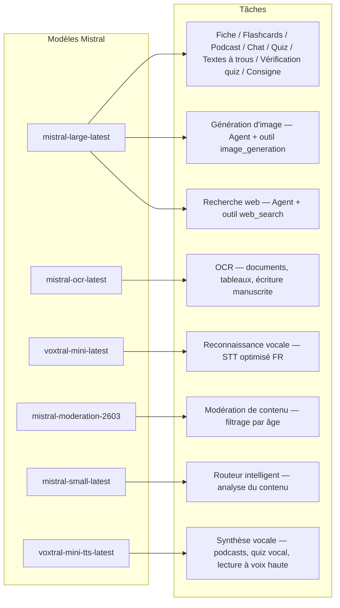
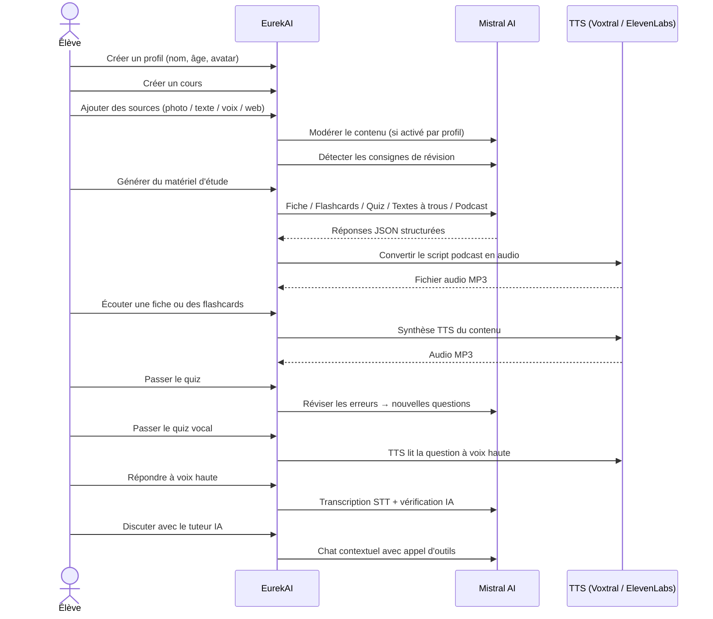

<p align="center">
  
</p>

<h1 align="center">EurekAI</h1>

<p align="center">
  <strong>Przekształć dowolne treści w interaktywną formę nauki — zasilane przez SI.</strong>
</p>

<p align="center">
  <a href="https://mistral.ai"></a>
  <a href="https://www.typescriptlang.org"></a>
  <a href="https://mistral.ai"></a>
  <a href="https://elevenlabs.io"></a>
</p>

<p align="center">
  <a href="https://www.youtube.com/watch?v=_b1TQz2leoI">▶️ Zobacz demo na YouTube</a> · <a href="README-en.md">🇬🇧 Read in English</a>
</p>

<p align="center">
  <a href="https://sonarcloud.io/summary/new_code?id=jls42_EurekAI"></a>
  <a href="https://sonarcloud.io/summary/new_code?id=jls42_EurekAI"></a>
  <a href="https://sonarcloud.io/summary/new_code?id=jls42_EurekAI"></a>
  <a href="https://sonarcloud.io/summary/new_code?id=jls42_EurekAI"></a>
</p>
<p align="center">
  <a href="https://sonarcloud.io/summary/new_code?id=jls42_EurekAI"></a>
  <a href="https://sonarcloud.io/summary/new_code?id=jls42_EurekAI"></a>
  <a href="https://sonarcloud.io/summary/new_code?id=jls42_EurekAI"></a>
  <a href="https://sonarcloud.io/summary/new_code?id=jls42_EurekAI"></a>
</p>

---

## Historia — Dlaczego EurekAI?

**EurekAI** powstało podczas [Mistral AI Worldwide Hackathon](https://worldwidehackathon.mistral.ai/) (marzec 2026). Potrzebowałem tematu — a pomysł narodził się z czegoś bardzo praktycznego: regularnie przygotowuję sprawdziany z moją córką i pomyślałem, że da się to uczynić bardziej zabawnym i interaktywnym dzięki SI.

Cel: wziąć **dowolne źródło** — zdjęcie podręcznika, skopiowany tekst, nagranie głosowe, wyszukiwanie w sieci — i przekształcić je w **fiszki, flashcards, quizy, podcasty, teksty z lukami, ilustracje i więcej**. Wszystko napędzane francuskimi modelami Mistral AI, co czyni rozwiązanie naturalnie dostosowanym do uczniów francuskojęzycznych.

Każda linia kodu została napisana podczas hackathonu. Wszystkie API i biblioteki open-source są użyte zgodnie z zasadami hackathonu.

---

## Funkcjonalności

| | Funkcja | Opis |
|---|---|---|
| 📷 | **Upload OCR** | Zrób zdjęcie podręcznika lub notatek — Mistral OCR wydobywa z niego treść |
| 📝 | **Wprowadzanie tekstu** | Wpisz lub wklej dowolny tekst bezpośrednio |
| 🎤 | **Wejście głosowe** | Nagraj się — Voxtral STT transkrybuje twój głos |
| 🌐 | **Wyszukiwanie w sieci** | Zadaj pytanie — Agent Mistral szuka odpowiedzi w internecie |
| 📄 | **Fiszki / Fiche de révision** | Strukturyzowane notatki z kluczowymi punktami, słownictwem, cytatami, anegdotami |
| 🃏 | **Flashcards** | 5–50 kart Q/A z odwołaniami do źródeł dla aktywnej pamięci |
| ❓ | **Quizy wielokrotnego wyboru** | 5–50 pytań wielokrotnego wyboru z adaptacyjną korektą błędów |
| ✏️ | **Teksty z lukami** | Ćwiczenia do uzupełnienia z podpowiedziami i tolerancyjną walidacją |
| 🎙️ | **Podcast** | Mini-podcast na 2 głosy konwertowany na audio przez Mistral Voxtral TTS |
| 🖼️ | **Ilustracje** | Obrazki edukacyjne generowane przez Agenta Mistral |
| 🗣️ | **Quiz głosowy** | Pytania czytane na głos, odpowiedź ustna, SI weryfikuje odpowiedź |
| 💬 | **Tutor SI** | Czat kontekstowy z dostępem do twoich materiałów, z możliwością wywoływania narzędzi |
| 🧠 | **Inteligentny router** | SI analizuje treść i rekomenduje najbardziej odpowiednie generatory spośród 7 dostępnych |
| 🔒 | **Kontrola rodzicielska** | Moderacja według wieku, PIN rodzica, ograniczenia czatu |
| 🌍 | **Wielojęzyczność** | Interfejs i treści SI w pełni po francusku i angielsku |
| 🔊 | **Odtwarzanie na głos** | Odtwarzaj fiszki i flashcards przez Mistral Voxtral TTS lub ElevenLabs |

---

## Przegląd architektury


---

## Mapa użycia modeli



---

## Ścieżka użytkownika



---

## Głębsze spojrzenie — Funkcje

### Wejście wielomodalne

EurekAI akceptuje 4 typy źródeł, moderowane według profilu (domyślnie włączone dla dziecka i nastolatka):

- **Upload OCR** — pliki JPG, PNG lub PDF przetwarzane przez `mistral-ocr-latest`. Obsługuje drukowany tekst, tabele i pismo odręczne.
- **Tekst swobodny** — wpisz lub wklej dowolną treść. Moderowany przed zapisaniem, jeśli moderacja jest aktywna.
- **Wejście głosowe** — nagrywaj audio w przeglądarce. Transkrypcja przez `voxtral-mini-latest`. Parametr `language="fr"` optymalizuje rozpoznawanie.
- **Wyszukiwanie w sieci** — wpisz zapytanie. Tymczasowy Agent Mistral z narzędziem `web_search` pobiera i streszcza wyniki.

### Generowanie treści SI

Siedem typów materiałów do nauki generowanych automatycznie:

| Generator | Model | Wynik |
|---|---|---|
| **Fiszka / Fiche de révision** | `mistral-large-latest` | Tytuł, streszczenie, 10–25 punktów kluczowych, słownictwo, cytaty, anegdota |
| **Flashcards** | `mistral-large-latest` | 5–50 kart Q/A z odwołaniami do źródeł dla aktywnego zapamiętywania |
| **Quiz wielokrotnego wyboru** | `mistral-large-latest` | 5–50 pytań, 4 opcje każda, wyjaśnienia, adaptacyjna korekta |
| **Teksty z lukami** | `mistral-large-latest` | Zdania do uzupełnienia z podpowiedziami, tolerancyjna walidacja (Levenshtein) |
| **Podcast** | `mistral-large-latest` + Voxtral TTS | Skrypt 2 głosy → audio MP3 |
| **Ilustracja** | Agent `mistral-large-latest` | Obraz edukacyjny przez narzędzie `image_generation` |
| **Quiz głosowy** | `mistral-large-latest` + Voxtral TTS + STT | Pytania TTS → odpowiedź STT → weryfikacja przez SI |

### Czatowy tutor SI

Czatowy tutor z pełnym dostępem do dokumentów kursu:

- Używa `mistral-large-latest`
- **Wywoływanie narzędzi**: może generować fiszki, flashcards, quizy lub teksty z lukami podczas rozmowy
- Historia do 50 wiadomości na kurs
- Moderacja treści, jeśli jest włączona dla profilu

### Automatyczny inteligentny router

Router używa `mistral-small-latest` do analizy zawartości źródeł i rekomendowania, które generatory są najbardziej trafne spośród 7 dostępnych — aby uczniowie nie musieli wybierać ręcznie. Interfejs pokazuje postęp w czasie rzeczywistym: najpierw faza analizy, potem poszczególne generacje z możliwością anulowania.

### Uczenie adaptacyjne

- **Statystyki quizów**: śledzenie prób i dokładności na poziomie pytań
- **Rewizja quizu**: generuje 5–10 nowych pytań celowanych na słabe koncepcje
- **Wykrywanie poleceń**: wykrywa instrukcje dotyczące powtórek ("Je sais ma leçon si je sais...") i priorytetyzuje je we wszystkich generatorach

### Bezpieczeństwo & kontrola rodzicielska

- **4 grupy wiekowe**: dziecko (≤10 lat), nastolatek (11–15), uczeń/studenta (16–25), dorosły (26+)
- **Moderacja treści**: `mistral-moderation-2603` z 5 kategoriami blokowanymi dla dziecka/nastolatka (sexual, hate, violence, selfharm, jailbreaking), brak ograniczeń dla ucznia/dorosłego
- **PIN rodzica**: hash SHA-256, wymagany dla profili poniżej 15 lat
- **Ograniczenia czatu**: czat SI domyślnie wyłączony dla osób poniżej 16 lat, aktywowany przez rodziców

### System wielu profili

- Wiele profili z imieniem, wiekiem, awatarem, preferencjami językowymi
- Projekty powiązane z profilami przez `profileId`
- Usuwanie kaskadowe: usunięcie profilu usuwa wszystkie jego projekty

### TTS — wielu dostawców

- **Mistral Voxtral TTS** (domyślny): `voxtral-mini-tts-latest`, brak dodatkowego klucza wymaganego
- **ElevenLabs** (alternatywa): `eleven_v3`, naturalne głosy, wymaga `ELEVENLABS_API_KEY`
- Dostawca konfigurowalny w ustawieniach aplikacji

### Internacjonalizacja

- Pełny interfejs dostępny po francusku i po angielsku
- Prompty SI obsługują dziś 2 języki (FR, EN) z architekturą przygotowaną na 15 (es, de, it, pt, nl, ja, zh, ko, ar, hi, pl, ro, sv)
- Język konfigurowalny per profil

---

## Stos technologiczny

| Warstwa | Technologia | Rola |
|---|---|---|
| **Runtime** | Node.js + TypeScript 5.7 | Serwer i bezpieczeństwo typów |
| **Backend** | Express 4.21 | API REST |
| **Serwer deweloperski** | Vite 7.3 + tsx | HMR, partials Handlebars, proxy |
| **Frontend** | HTML + TailwindCSS 4.2 + Alpine.js 3.15 | Interaktywny interfejs, TypeScript kompilowany przez Vite |
| **Templating** | vite-plugin-handlebars | Kompozycja HTML przez partials |
| **SI** | Mistral AI SDK 2.1 | Czat, OCR, STT, TTS, Agenci, Moderacja |
| **TTS (domyślny)** | Mistral Voxtral TTS | `voxtral-mini-tts-latest`, zintegrowana synteza mowy |
| **TTS (alternatywny)** | ElevenLabs SDK 2.36 | `eleven_v3`, naturalne głosy |
| **Ikony** | Lucide 0.575 | Biblioteka ikon SVG |
| **Markdown** | Marked 17 | Renderowanie markdown w czacie |
| **Upload plików** | Multer 1.4 | Obsługa formularzy multipart |
| **Audio** | ffmpeg-static | Konkatenacja segmentów audio |
| **Testy** | Vitest 4 | Testy jednostkowe — pokrycie mierzone przez SonarCloud |
| **Trwałość danych** | Pliki JSON | Przechowywanie bez zależności |

---

## Referencja modeli

| Model | Zastosowanie | Dlaczego |
|---|---|---|
| `mistral-large-latest` | Fiszki, Flashcards, Podcast, Quiz, Teksty z lukami, Czat, Weryfikacja quizu głosowego, Agent obrazów, Agent wyszukiwania WWW, Wykrywanie poleceń | Najlepszy wielojęzyczny + śledzenie instrukcji |
| `mistral-ocr-latest` | OCR dokumentów | Tekst drukowany, tabele, pismo ręczne |
| `voxtral-mini-latest` | Rozpoznawanie mowy (STT) | STT wielojęzyczne, optymalizowane z `language="fr"` |
| `voxtral-mini-tts-latest` | Synteza mowy (TTS) | Podcasty, quizy głosowe, odczyt na głos |
| `mistral-moderation-2603` | Moderacja treści | 5 kategorii blokowanych dla dziecka/nastolatka (+ jailbreaking) |
| `mistral-small-latest` | Router inteligentny | Szybka analiza treści do decyzji routingu |
| `eleven_v3` (ElevenLabs) | Synteza mowy (TTS alternatywny) | Naturalne głosy, konfigurowalna alternatywa |

---

## Szybkie uruchomienie

```bash
# Cloner le dépôt
git clone https://github.com/jls42/EurekAI.git
cd EurekAI

# Installer les dépendances
npm install

# Configurer les clés API
cp .env.example .env
# Éditez .env avec vos clés :
#   MISTRAL_API_KEY=votre_clé_ici           (requis)
#   ELEVENLABS_API_KEY=votre_clé_ici        (optionnel, TTS alternatif)

# Lancer le développement
npm run dev
# → Backend :  http://localhost:3000 (API)
# → Frontend : http://localhost:5173 (serveur Vite avec HMR)
```

> **Uwaga** : Mistral Voxtral TTS jest domyślnym providerem — nie jest potrzebny żaden dodatkowy klucz poza `MISTRAL_API_KEY`. ElevenLabs to opcjonalny provider TTS konfigurowalny w ustawieniach.

---

## Struktura projektu

```
server.ts                 — Point d'entrée Express, monte les routes + config
config.ts                 — Config runtime (modèles, voix, TTS provider), persistée dans output/config.json
store.ts                  — ProjectStore : CRUD projets/sources/générations, persistance JSON
profiles.ts               — ProfileStore : gestion des profils, hachage PIN
types.ts                  — Types TypeScript : Source, Generation (7 types), QuizStats, Profile
prompts.ts                — Tous les prompts IA centralisés (system + user templates, FR/EN)

generators/
  ocr.ts                  — Upload + OCR via Mistral (JPG, PNG, PDF)
  summary.ts              — Génération de fiche de révision (JSON structuré)
  flashcards.ts           — Flashcards Q/R (5-50, configurable)
  quiz.ts                 — Quiz QCM (5-50 questions, configurable) + révision adaptative
  fill-blank.ts           — Exercices à trous avec validation tolérante
  podcast.ts              — Script podcast 2 voix
  quiz-vocal.ts           — Quiz vocal : questions TTS + réponses STT + vérification IA
  image.ts                — Génération d'image via Agent Mistral (outil image_generation)
  chat.ts                 — Tuteur IA par chat avec appel d'outils
  router.ts               — Routeur automatique intelligent (contenu → générateurs recommandés)
  consigne.ts             — Détection de consignes de révision
  tts-provider.ts         — Dispatch TTS multi-provider (Mistral Voxtral / ElevenLabs)
  tts.ts                  — Génération audio podcast (concaténation de segments)
  stt.ts                  — Voxtral STT (audio → texte)
  websearch.ts            — Agent Mistral avec outil web_search
  moderation.ts           — Modération de contenu (filtrage par âge)

routes/
  projects.ts             — CRUD projets
  profiles.ts             — CRUD profils avec gestion du PIN
  sources.ts              — Upload OCR, texte libre, voix STT, recherche web, modération
  generate.ts             — Endpoints de génération (7 types + auto + route)
  generations.ts          — Tentatives de quiz/fill-blank, réponses vocales, lecture à voix haute
  chat.ts                 — Chat IA avec appel d'outils

helpers/
  index.ts                — safeParseJson, unwrapJsonArray, extractAllText, timer
  audio.ts                — collectStream (ReadableStream → Buffer)
  fill-blank-validate.ts  — Validation tolérante des réponses (normalisation, Levenshtein)

src/                      — Frontend (Vite + Handlebars)
  index.html              — Point d'entrée HTML principal
  main.ts                 — Entrée frontend (init Alpine.js + icônes Lucide)
  app/                    — Modules applicatifs Alpine.js
    state.ts              — Gestion d'état réactif
    navigation.ts         — Routage des vues + gardes par âge
    profiles.ts           — Logique du sélecteur de profils
    projects.ts           — CRUD des cours
    sources.ts            — Gestionnaires d'upload de sources
    generate.ts           — Déclencheurs de génération (individuel, tout, auto 2 phases)
    generations.ts        — Affichage + actions sur les générations
    chat.ts               — Interface de chat
    config.ts             — Interface de configuration (modèles, voix, TTS provider)
    render.ts             — Helpers de rendu HTML
    i18n.ts               — Changement de langue
    ...
  components/
    quiz.ts               — Composant quiz interactif
    quiz-vocal.ts         — Composant quiz vocal
    fill-blank.ts         — Composant textes à trous
    flashcards.ts         — Composant flashcards avec retournement
    step-by-step.ts       — Mixin navigation pas-à-pas (quiz, fill-blank, flashcards)
  i18n/
    fr.ts                 — Traductions françaises
    en.ts                 — Traductions anglaises
    index.ts              — Chargeur i18n
  partials/               — Partials HTML Handlebars (header, sidebar, dialogues, vues)
  styles/
    main.css              — Entrée TailwindCSS
    theme.css             — Variables de thème personnalisées

public/assets/            — Ressources statiques (logo, avatars)
output/                   — Données d'exécution (projets, config, fichiers audio)
```

---

## Referencja API

### Konfiguracja
| Metoda | Endpoint | Opis |
|---|---|---|
| `GET` | `/api/config` | Bieżąca konfiguracja |
| `PUT` | `/api/config` | Zmiana konfiguracji (modele, głosy, provider TTS) |
| `GET` | `/api/config/status` | Status API (Mistral, ElevenLabs, TTS) |
| `POST` | `/api/config/reset` | Reset konfiguracji do domyślnej |
| `GET` | `/api/config/voices` | Wypisz głosy Mistral TTS (opcjonalnie `?lang=fr`) |

### Profile
| Metoda | Endpoint | Opis |
|---|---|---|
| `GET` | `/api/profiles` | Wypisz wszystkie profile |
| `POST` | `/api/profiles` | Utwórz profil |
| `PUT` | `/api/profiles/:id` | Modyfikuj profil (PIN wymagany dla < 15 lat) |
| `DELETE` | `/api/profiles/:id` | Usuń profil + kaskada projektów |

### Projekty
| Metoda | Endpoint | Opis |
|---|---|---|
| `GET` | `/api/projects` | Wypisz projekty |
| `POST` | `/api/projects` | Utwórz projekt `{name, profileId}` |
| `GET` | `/api/projects/:pid` | Szczegóły projektu |
| `PUT` | `/api/projects/:pid` | Zmień nazwę `{name}` |
| `DELETE` | `/api/projects/:pid` | Usuń projekt |

### Źródła
| Metoda | Endpoint | Opis |
|---|---|---|
| `POST` | `/api/projects/:pid/sources/upload` | Upload OCR (pliki multipart) |
| `POST` | `/api/projects/:pid/sources/text` | Tekst swobodny `{text}` |
| `POST` | `/api/projects/:pid/sources/voice` | Głos STT (audio multipart) |
| `POST` | `/api/projects/:pid/sources/websearch` | Wyszukiwanie w sieci `{query}` |
| `DELETE` | `/api/projects/:pid/sources/:sid` | Usuń źródło |
| `POST` | `/api/projects/:pid/moderate` | Moderuj `{text}` |
| `POST` | `/api/projects/:pid/detect-consigne` | Wykryj polecenia powtórkowe |

### Generowanie
| Metoda | Endpoint | Opis |
|---|---|---|
| `POST` | `/api/projects/:pid/generate/summary` | Fiszka / Fiche de révision |
| `POST` | `/api/projects/:pid/generate/flashcards` | Flashcards |
| `POST` | `/api/projects/:pid/generate/quiz` | Quiz wielokrotnego wyboru |
| `POST` | `/api/projects/:pid/generate/fill-blank` | Teksty z lukami |
| `POST` | `/api/projects/:pid/generate/podcast` | Podcast |
| `POST` | `/api/projects/:pid/generate/image` | Ilustracja |
| `POST` | `/api/projects/:pid/generate/quiz-vocal` | Quiz głosowy |
| `POST` | `/api/projects/:pid/generate/quiz-review` | Rewizja adaptacyjna `{generationId, weakQuestions}` |
| `POST` | `/api/projects/:pid/generate/route` | Analiza routingu (plan generatorów do uruchomienia) |
| `POST` | `/api/projects/:pid/generate/auto` | Auto-generacja backend (routing + 5 typów: summary, flashcards, quiz, fill-blank, podcast) |

Wszystkie trasy generowania akceptują `{sourceIds?, lang?, ageGroup?, count?, useConsigne?}`.

### CRUD Generacji
| Metoda | Endpoint | Opis |
|---|---|---|
| `POST` | `/api/projects/:pid/generations/:gid/quiz-attempt` | Prześlij odpowiedzi do quizu `{answers}` |
| `POST` | `/api/projects/:pid/generations/:gid/fill-blank-attempt` | Prześlij odpowiedzi do tekstów z lukami `{answers}` |
| `POST` | `/api/projects/:pid/generations/:gid/vocal-answer` | Zweryfikuj odpowiedź ustną (audio + questionIndex) |
| `POST` | `/api/projects/:pid/generations/:gid/read-aloud` | Odtwarzanie TTS na głos (fiszki/flashcards) |
| `PUT` | `/api/projects/:pid/generations/:gid` | Zmień nazwę `{title}` |
| `DELETE` | `/api/projects/:pid/generations/:gid` | Usuń generację |

### Czat
| Metoda | Endpoint | Opis |
|---|---|---|
| `GET` | `/api/projects/:pid/chat` | Pobierz historię czatu |
| `POST` | `/api/projects/:pid/chat` | Wyślij wiadomość `{message, lang, ageGroup}` |
| `DELETE` | `/api/projects/:pid/chat` | Wyczyść historię czatu |

---

## Decyzje architektoniczne

| Decyzja | Uzasadnienie |
|---|---|
| **Alpine.js zamiast React/Vue** | Minimalne zużycie zasobów, lekka reaktywność z TypeScript kompilowanym przez Vite. Idealne na hackathon, gdzie liczy się szybkość. |
| **Przechowywanie w plikach JSON** | Zero zależności, natychmiastowy start. Brak potrzeby konfiguracji bazy danych — uruchamiasz i działasz. |
| **Vite + Handlebars** | Najlepsze z obu światów: szybki HMR dla developmentu, partials HTML dla organizacji kodu, Tailwind JIT. |
| **Zcentralizowane prompt’y** | Wszystkie prompty SI w `prompts.ts` — łatwe iterowanie, testowanie i dostosowywanie według języka/grupy wiekowej. |
| **System wielopokoleniowy** | Każde pokolenie to niezależny obiekt z własnym ID — umożliwia wiele kart, quizów itp. na kurs. |
| **Polecenia dostosowane do wieku** | 4 grupy wiekowe z różnym słownictwem, stopniem trudności i tonem — ta sama treść uczy inaczej w zależności od ucznia. |
| **Funkcje oparte na agentach** | Generowanie obrazów i wyszukiwanie w sieci używają tymczasowych Agentów Mistral — oddzielny cykl życia z automatycznym czyszczeniem. |
| **TTS z wieloma dostawcami** | Mistral Voxtral TTS domyślnie (bez dodatkowego klucza), ElevenLabs jako alternatywa — konfigurowalne bez restartu. |

---

## Podziękowania i uznania

- **[Mistral AI](https://mistral.ai)** — Modele SI (Large, OCR, Voxtral STT, Voxtral TTS, Moderation, Small) + Worldwide Hackathon
- **[ElevenLabs](https://elevenlabs.io)** — Alternatywny silnik syntezy mowy (`eleven_v3`)
- **[Alpine.js](https://alpinejs.dev)** — Lekki framework reaktywny
- **[TailwindCSS](https://tailwindcss.com)** — Framework narzędziowy CSS
- **[Vite](https://vitejs.dev)** — Narzędzie do budowania front-endu
- **[Lucide](https://lucide.dev)** — Biblioteka ikon
- **[Marked](https://marked.js.org)** — Parser Markdown

Stworzone z dbałością podczas Mistral AI Worldwide Hackathon, marzec 2026.

---

## Autor

**Julien LS** — [contact@jls42.org](mailto:contact@jls42.org)

## Licencja

[AGPL-3.0](LICENSE) — Prawa autorskie (C) 2026 Julien LS

**Ten dokument został przetłumaczony z wersji fr na język pl przy użyciu modelu gpt-5-mini. Aby uzyskać więcej informacji na temat procesu tłumaczenia, zapoznaj się z https://gitlab.com/jls42/ai-powered-markdown-translator**

