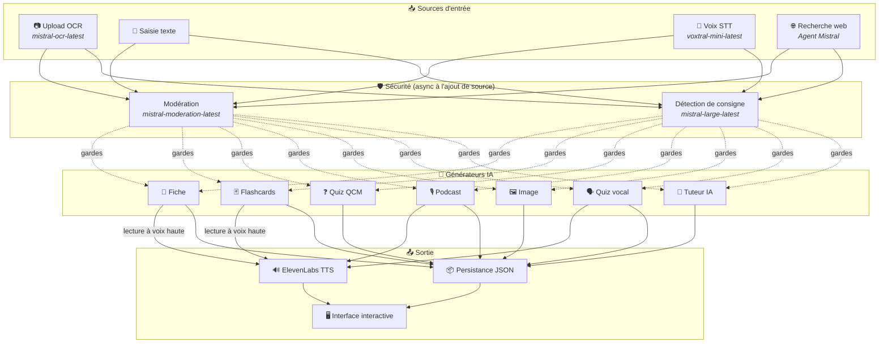
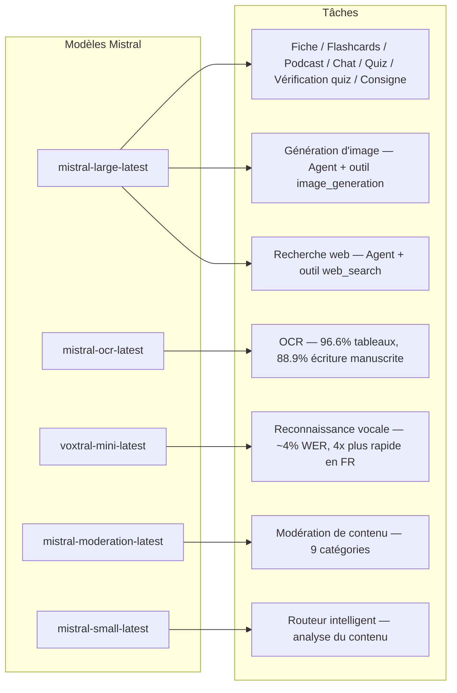
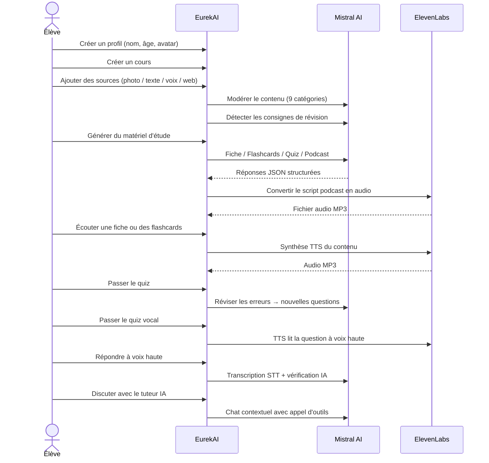

<p align="center">
  
</p>

<h1 align="center">EurekAI</h1>

<p align="center">
  <strong>Przekształć dowolną treść w interaktywne doświadczenie edukacyjne — zasilane przez AI.</strong>
</p>

<p align="center">
  <a href="https://mistral.ai"></a>
  <a href="https://www.typescriptlang.org"></a>
  <a href="https://mistral.ai"></a>
  <a href="https://elevenlabs.io"></a>
</p>

<p align="center">
  <a href="https://www.youtube.com/watch?v=_b1TQz2leoI">▶️ Zobacz demo na YouTube</a> · <a href="README-en.md">🇬🇧 Read in English</a>
</p>

---

## Historia — Dlaczego EurekAI?

**EurekAI** narodziło się podczas [Mistral AI Worldwide Hackathon](https://worldwidehackathon.mistral.ai/) (marzec 2026). Potrzebowałem pomysłu — i zrodził się on z czegoś bardzo konkretnego: regularnie przygotowuję się do sprawdzianów z moją córką i pomyślałem, że powinno dać się to zrobić w bardziej angażujący i interaktywny sposób dzięki AI.

Cel: wziąć **dowolne wejście** — zdjęcie podręcznika, wklejony tekst, nagranie głosowe, wyszukiwanie w sieci — i przekształcić je w **notatki do powtórki, fiszki, quizy, podcasty, ilustracje i wiele więcej**. Wszystko zasilane przez francuskie modele Mistral AI, dzięki czemu rozwiązanie jest naturalnie dopasowane do uczniów francuskojęzycznych.

Każda linia kodu została napisana podczas hackathonu. Wszystkie interfejsy API i biblioteki open-source są używane zgodnie z zasadami hackathonu.

---

## Funkcje

| | Funkcja | Opis |
|---|---|---|
| 📷 | **Upload OCR** | Zrób zdjęcie podręcznika lub notatek — Mistral OCR wyodrębnia z nich treść |
| 📝 | **Wprowadzanie tekstu** | Wpisz lub wklej dowolny tekst bezpośrednio |
| 🎤 | **Wejście głosowe** | Nagraj się — Voxtral STT transkrybuje Twój głos |
| 🌐 | **Wyszukiwanie w sieci** | Zadaj pytanie — Agent Mistral szuka odpowiedzi w internecie |
| 📄 | **Notatki do powtórki** | Ustrukturyzowane notatki z kluczowymi punktami, słownictwem, cytatami, anegdotami |
| 🃏 | **Fiszki** | 5 kart Q/A z odniesieniami do źródeł do aktywnego zapamiętywania |
| ❓ | **Quiz wielokrotnego wyboru** | 10-20 pytań wielokrotnego wyboru z adaptacyjną powtórką błędów |
| 🎙️ | **Podcast** | Mini-podcast na 2 głosy (Alex i Zoé) konwertowany na audio przez ElevenLabs |
| 🖼️ | **Ilustracje** | Edukacyjne obrazy generowane przez Agenta Mistral |
| 🗣️ | **Quiz głosowy** | Pytania czytane na głos, odpowiedź ustna, AI sprawdza odpowiedź |
| 💬 | **Nauczyciel AI** | Kontekstowy czat z Twoimi materiałami z kursu, z wywoływaniem narzędzi |
| 🧠 | **Inteligentny router** | AI analizuje Twoją treść i rekomenduje najlepsze generatory |
| 🔒 | **Kontrola rodzicielska** | Moderacja według wieku, PIN rodzicielski, ograniczenia czatu |
| 🌍 | **Wielojęzyczność** | Pełny interfejs i treści AI w języku francuskim i angielskim |
| 🔊 | **Czytanie na głos** | Słuchaj notatek i fiszek czytanych na głos przez ElevenLabs TTS |

---

## Przegląd architektury



---

## Mapa wykorzystania modeli



---

## Ścieżka użytkownika



---

## Szczegółowo — Funkcje

### Wejście wielomodalne

EurekAI akceptuje 4 typy źródeł, wszystkie moderowane przed przetwarzaniem:

- **Upload OCR** — Pliki JPG, PNG lub PDF przetwarzane przez `mistral-ocr-latest`. Obsługuje tekst drukowany, tabele (dokładność 96.6%) i pismo odręczne (dokładność 88.9%).
- **Tekst swobodny** — Wpisz lub wklej dowolną treść. Przechodzi przez moderację przed zapisaniem.
- **Wejście głosowe** — Nagraj audio w przeglądarce. Transkrybowane przez `voxtral-mini-latest` z ~4% WER. Parametr `language="fr"` sprawia, że jest 4x szybsze.
- **Wyszukiwanie w sieci** — Wprowadź zapytanie. Tymczasowy Agent Mistral z narzędziem `web_search` pobiera i podsumowuje wyniki.

### Generowanie treści przez AI

Sześć typów generowanych materiałów do nauki:

| Generator | Model | Wynik |
|---|---|---|
| **Notatka do powtórki** | `mistral-large-latest` | Tytuł, podsumowanie, 10-25 kluczowych punktów, słownictwo, cytaty, anegdota |
| **Fiszki** | `mistral-large-latest` | 5 kart Q/A z odniesieniami do źródeł |
| **Quiz wielokrotnego wyboru** | `mistral-large-latest` | 10-20 pytań, po 4 odpowiedzi, wyjaśnienia, adaptacyjna powtórka |
| **Podcast** | `mistral-large-latest` + ElevenLabs | Scenariusz na 2 głosy (Alex i Zoé) → audio MP3 |
| **Ilustracja** | Agent `mistral-large-latest` | Obraz edukacyjny przez narzędzie `image_generation` |
| **Quiz głosowy** | `mistral-large-latest` + ElevenLabs + Voxtral | Pytania TTS → odpowiedź STT → weryfikacja AI |

### Nauczyciel AI przez czat

Konwersacyjny nauczyciel z pełnym dostępem do materiałów z kursu:

- Korzysta z `mistral-large-latest` (okno kontekstu 128K tokenów)
- **Wywoływanie narzędzi**: może generować notatki, fiszki lub quizy na żywo podczas rozmowy
- Historia 50 wiadomości na kurs
- Moderacja treści dla profili zależnie od wieku

### Inteligentny automatyczny router

Router używa `mistral-small-latest` do analizy treści źródeł i rekomendowania, które generatory są najbardziej odpowiednie — tak aby uczniowie nie musieli wybierać ręcznie.

### Adaptacyjne uczenie się

- **Statystyki quizów**: śledzenie prób i dokładności dla każdego pytania
- **Powtórka quizu**: generuje 5-10 nowych pytań ukierunkowanych na słabsze zagadnienia
- **Wykrywanie poleceń**: wykrywa instrukcje powtórki ("Je sais ma leçon si je sais...") i priorytetyzuje je we wszystkich generatorach

### Bezpieczeństwo i kontrola rodzicielska

- **4 grupy wiekowe**: dziecko (6-10), nastolatek (11-15), uczeń (16+), dorosły
- **Moderacja treści**: 9 kategorii przez `mistral-moderation-latest`, progi dostosowane do grupy wiekowej
- **PIN rodzicielski**: hash SHA-256, wymagany dla profili poniżej 15 lat
- **Ograniczenia czatu**: czat AI dostępny tylko dla profili w wieku 15 lat i więcej

### System wielu profili

- Wiele profili z nazwą, wiekiem, avatarem, preferencjami językowymi
- Projekty powiązane z profilami przez `profileId`
- Usuwanie kaskadowe: usunięcie profilu usuwa wszystkie jego projekty

### Internacjonalizacja

- Pełny interfejs dostępny po francusku i angielsku
- Prompt AI obsługuje dziś 2 języki (FR, EN), z architekturą gotową na 15 (es, de, it, pt, nl, ja, zh, ko, ar, hi, pl, ro, sv)
- Język konfigurowalny per profil

---

## Stos techniczny

| Warstwa | Technologia | Rola |
|---|---|---|
| **Runtime** | Node.js + TypeScript 5.7 | Serwer i bezpieczeństwo typów |
| **Backend** | Express 4.21 | API REST |
| **Serwer dev** | Vite 7.3 + tsx | HMR, partiale Handlebars, proxy |
| **Frontend** | HTML + TailwindCSS 4.2 + Alpine.js 3.15 | Interfejs reaktywny, TypeScript kompilowany przez Vite |
| **Szablony** | vite-plugin-handlebars | Kompozycja HTML przez partiale |
| **AI** | Mistral AI SDK 1.14 | Czat, OCR, STT, agenci, moderacja |
| **TTS** | ElevenLabs SDK 2.36 | Synteza mowy dla podcastów i quizów głosowych |
| **Ikony** | Lucide 0.575 | Biblioteka ikon SVG |
| **Markdown** | Marked 17 | Renderowanie markdown w czacie |
| **Upload plików** | Multer 1.4 | Obsługa formularzy multipart |
| **Audio** | ffmpeg-static | Przetwarzanie audio |
| **Testy** | Vitest 4 | Testy jednostkowe |
| **Persistencja** | Pliki JSON | Przechowywanie bez zależności |

---

## Referencja modeli

| Model | Zastosowanie | Dlaczego |
|---|---|---|
| `mistral-large-latest` | Notatka, fiszki, podcast, quiz wielokrotnego wyboru, czat, weryfikacja quizu, agent obrazów, agent wyszukiwania w sieci, wykrywanie poleceń | Najlepszy wielojęzyczny + śledzenie instrukcji |
| `mistral-ocr-latest` | OCR dokumentów | 96.6% dokładności dla tabel, 88.9% dla pisma odręcznego |
| `voxtral-mini-latest` | Rozpoznawanie mowy | ~4% WER, `language="fr"` daje 4x+ prędkości |
| `mistral-moderation-latest` | Moderacja treści | 9 kategorii, bezpieczeństwo dzieci |
| `mistral-small-latest` | Inteligentny router | Szybka analiza treści do decyzji routingu |
| `eleven_v3` (ElevenLabs) | Synteza mowy | Naturalne głosy po francusku do podcastów i quizów głosowych |

---

## Szybki start

```bash
# Cloner le dépôt
git clone https://github.com/your-username/eurekai.git
cd eurekai

# Installer les dépendances
npm install

# Configurer les clés API
cp .env.example .env
# Éditez .env avec vos clés :
#   MISTRAL_API_KEY=votre_clé_ici
#   ELEVENLABS_API_KEY=votre_clé_ici  (optionnel, pour les fonctions audio)

# Lancer le développement
npm run dev
# → Backend :  http://localhost:3000 (API)
# → Frontend : http://localhost:5173 (serveur Vite avec HMR)
```

> **Uwaga**: ElevenLabs jest opcjonalny. Bez tego klucza funkcje podcastu i quizu głosowego wygenerują skrypty, ale nie zsyntetyzują audio.

---

## Struktura projektu

```
server.ts                 — Point d'entrée Express, monte les routes + config
config.ts                 — Config runtime (modèles, voix, TTS), persistée dans output/config.json
store.ts                  — ProjectStore : CRUD projets/sources/générations, persistance JSON
profiles.ts               — ProfileStore : gestion des profils, hachage PIN
types.ts                  — Types TypeScript : Source, Generation (6 types), QuizStats, Profile
prompts.ts                — Tous les prompts IA centralisés (system + user templates, FR/EN)

generators/
  ocr.ts                  — Upload + OCR via Mistral (JPG, PNG, PDF)
  summary.ts              — Génération de fiche de révision (JSON structuré)
  flashcards.ts           — 5 flashcards Q/R
  quiz.ts                 — Quiz QCM (10-20 questions) + révision adaptative
  podcast.ts              — Script podcast 2 voix (Alex + Zoé)
  quiz-vocal.ts           — Quiz vocal : questions TTS + réponses STT + vérification IA
  image.ts                — Génération d'image via Agent Mistral (outil image_generation)
  chat.ts                 — Tuteur IA par chat avec appel d'outils
  router.ts               — Routeur automatique intelligent (contenu → générateurs recommandés)
  consigne.ts             — Détection de consignes de révision
  tts.ts                  — ElevenLabs TTS (eleven_v3, concaténation de segments)
  stt.ts                  — Voxtral STT (audio → texte)
  websearch.ts            — Agent Mistral avec outil web_search
  moderation.ts           — Modération de contenu (9 catégories)

routes/
  projects.ts             — CRUD projets
  sources.ts              — Upload OCR, texte libre, voix STT, recherche web, modération
  generate.ts             — Endpoints de génération (fiche/flashcards/quiz/podcast/image/vocal)
  generations.ts          — Tentatives de quiz, réponses vocales, lecture à voix haute, renommage, suppression
  chat.ts                 — Chat IA avec appel d'outils
  profiles.ts             — CRUD profils avec gestion du PIN

helpers/
  index.ts                — safeParseJson, unwrapJsonArray, extractAllText, timer
  audio.ts                — collectStream (ReadableStream → Buffer)

src/                      — Frontend (Vite + Handlebars)
  index.html              — Point d'entrée HTML principal
  main.ts                 — Entrée frontend (init Alpine.js + icônes Lucide)
  app/                    — Modules applicatifs Alpine.js
    state.ts              — Gestion d'état réactif
    navigation.ts         — Routage des vues + gardes par âge
    profiles.ts           — Logique du sélecteur de profils
    projects.ts           — CRUD des cours
    sources.ts            — Gestionnaires d'upload de sources
    generate.ts           — Déclencheurs de génération
    generations.ts        — Affichage + actions sur les générations
    chat.ts               — Interface de chat
    render.ts             — Helpers de rendu HTML
    i18n.ts               — Changement de langue
    ...
  components/
    quiz.ts               — Composant quiz interactif
    quiz-vocal.ts         — Composant quiz vocal
  i18n/
    fr.ts                 — Traductions françaises
    en.ts                 — Traductions anglaises
    index.ts              — Chargeur i18n
  partials/               — Partials HTML Handlebars (header, sidebar, dialogues, vues)
  styles/
    main.css              — Entrée TailwindCSS
    theme.css             — Variables de thème personnalisées

public/assets/            — Ressources statiques (logo, avatars)
output/                   — Données d'exécution (projets, config, fichiers audio)
```

---

## Referencja API

### Konfiguracja
| Metoda | Endpoint | Opis |
|---|---|---|
| `GET` | `/api/config` | Bieżąca konfiguracja |
| `PUT` | `/api/config` | Zmiana konfiguracji (modele, głosy, TTS) |
| `GET` | `/api/config/status` | Status API (Mistral, ElevenLabs) |

### Profile
| Metoda | Endpoint | Opis |
|---|---|---|
| `GET` | `/api/profiles` | Lista wszystkich profili |
| `POST` | `/api/profiles` | Utworzenie profilu |
| `PUT` | `/api/profiles/:id` | Modyfikacja profilu (PIN wymagany dla < 15 lat) |
| `DELETE` | `/api/profiles/:id` | Usunięcie profilu + kaskadowo projekty |

### Projekty
| Metoda | Endpoint | Opis |
|---|---|---|
| `GET` | `/api/projects` | Lista projektów |
| `POST` | `/api/projects` | Utworzenie projektu `{name, profileId}` |
| `GET` | `/api/projects/:pid` | Szczegóły projektu |
| `PUT` | `/api/projects/:pid` | Zmiana nazwy `{name}` |
| `DELETE` | `/api/projects/:pid` | Usunięcie projektu |

### Źródła
| Metoda | Endpoint | Opis |
|---|---|---|
| `POST` | `/api/projects/:pid/sources/upload` | Upload OCR (pliki multipart) |
| `POST` | `/api/projects/:pid/sources/text` | Tekst swobodny `{text}` |
| `POST` | `/api/projects/:pid/sources/voice` | Głos STT (audio multipart) |
| `POST` | `/api/projects/:pid/sources/websearch` | Wyszukiwanie w sieci `{query}` |
| `DELETE` | `/api/projects/:pid/sources/:sid` | Usunięcie źródła |
| `POST` | `/api/projects/:pid/moderate` | Moderacja `{text}` |
| `POST` | `/api/projects/:pid/detect-consigne` | Wykrywanie poleceń powtórki |

### Generowanie
| Metoda | Endpoint | Opis |
|---|---|---|
| `POST` | `/api/projects/:pid/generate/summary` | Notatka do powtórki `{sourceIds?}` |
| `POST` | `/api/projects/:pid/generate/flashcards` | Fiszki `{sourceIds?}` |
| `POST` | `/api/projects/:pid/generate/quiz` | Quiz wielokrotnego wyboru `{sourceIds?}` |
| `POST` | `/api/projects/:pid/generate/podcast` | Podcast `{sourceIds?}` |
| `POST` | `/api/projects/:pid/generate/image` | Ilustracja `{sourceIds?}` |
| `POST` | `/api/projects/:pid/generate/quiz-vocal` | Quiz głosowy `{sourceIds?}` |
| `POST` | `/api/projects/:pid/generate/quiz-review` | Adaptacyjna powtórka `{generationId, weakQuestions}` |
| `POST` | `/api/projects/:pid/generate/auto` | Automatyczne generowanie przez router |

### CRUD generacji
| Metoda | Endpoint | Opis |
|---|---|---|
| `POST` | `/api/projects/:pid/generations/:gid/quiz-attempt` | Przesłanie odpowiedzi `{answers}` |
| `POST` | `/api/projects/:pid/generations/:gid/vocal-answer` | Sprawdzenie odpowiedzi ustnej (audio multipart + questionIndex) |
| `POST` | `/api/projects/:pid/generations/:gid/read-aloud` | Odczyt TTS na głos (notatki/fiszki) |
| `PUT` | `/api/projects/:pid/generations/:gid` | Zmiana nazwy `{title}` |
| `DELETE` | `/api/projects/:pid/generations/:gid` | Usunięcie generacji |

### Czat
| Metoda | Endpoint | Opis |
|---|---|---|
| `GET` | `/api/projects/:pid/chat` | Pobranie historii czatu |
| `POST` | `/api/projects/:pid/chat` | Wysłanie wiadomości `{message}` |
| `DELETE` | `/api/projects/:pid/chat` | Wyczyść historię czatu |

---

## Decyzje architektoniczne

| Decyzja | Uzasadnienie |
|---|---|
| **Alpine.js zamiast React/Vue** | Minimalny narzut, lekka reaktywność z TypeScript kompilowanym przez Vite. Idealne na hackathon, gdzie liczy się szybkość. |
| **Persistencja w plikach JSON** | Zero zależności, natychmiastowy start. Brak bazy danych do skonfigurowania — uruchamiasz i działa. |
| **Vite + Handlebars** | Najlepsze z obu światów: szybki HMR do developmentu, HTML partials do organizacji kodu, Tailwind JIT. |
| **Scentralizowane prompty** | Wszystkie prompty AI w `prompts.ts` — łatwe iterowanie, testowanie i dostosowanie do języka/grupy wiekowej. |
| **System wielu generacji** | Każda generacja jest niezależnym obiektem z własnym ID — umożliwia wiele notatek, quizów itd. na kurs. |
| **Prompty dostosowane do wieku** | 4 grupy wiekowe z różnym słownictwem, złożonością i tonem — ta sama treść uczy inaczej w zależności od ucznia. |
| **Funkcje oparte na Agentach** | Generowanie obrazów i wyszukiwanie w sieci korzystają z tymczasowych Agentów Mistral — czysty cykl życia z automatycznym czyszczeniem. |

---

## Podziękowania i uznanie

- **[Mistral AI](https://mistral.ai)** — Modele AI (Large, OCR, Voxtral, Moderation, Small) + Worldwide Hackathon
- **[ElevenLabs](https://elevenlabs.io)** — Silnik syntezy mowy (`eleven_v3`)
- **[Alpine.js](https://alpinejs.dev)** — Lekki reaktywny framework
- **[TailwindCSS](https://tailwindcss.com)** — Utility-first framework CSS
- **[Vite](https://vitejs.dev)** — Narzędzie do budowania frontend
- **[Lucide](https://lucide.dev)** — Biblioteka ikon
- **[Marked](https://marked.js.org)** — Parser Markdown

Zbudowane z troską podczas Mistral AI Worldwide Hackathon, marzec 2026.

---

## Autor

**Julien LS** — [contact@jls42.org](mailto:contact@jls42.org)

## Licencja

[AGPL-3.0](LICENSE) — Copyright (C) 2026 Julien LS

**Ten dokument został przetłumaczony z wersji fr na język pl przy użyciu modelu gpt-5.4-mini. Aby uzyskać więcej informacji o procesie tłumaczenia, odwiedź https://gitlab.com/jls42/ai-powered-markdown-translator**

