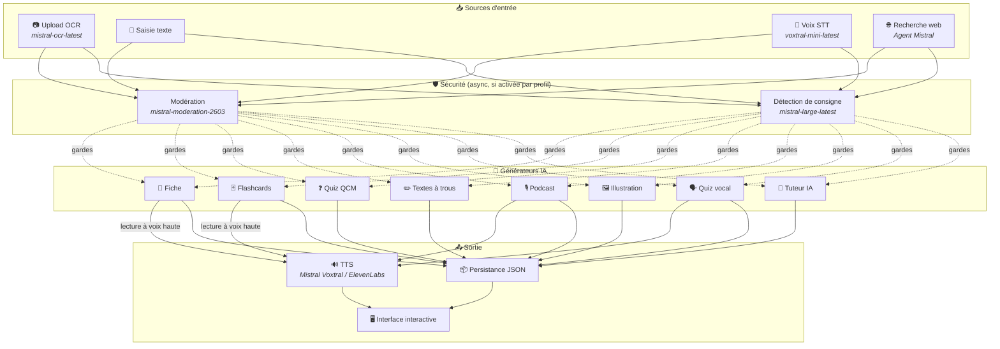
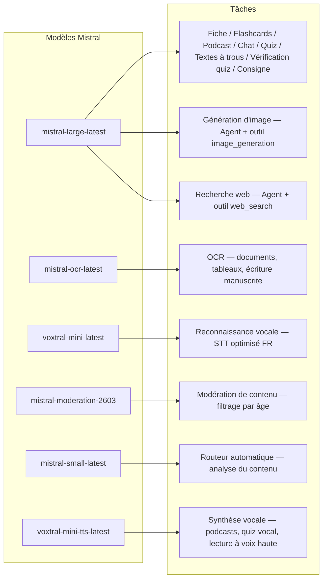
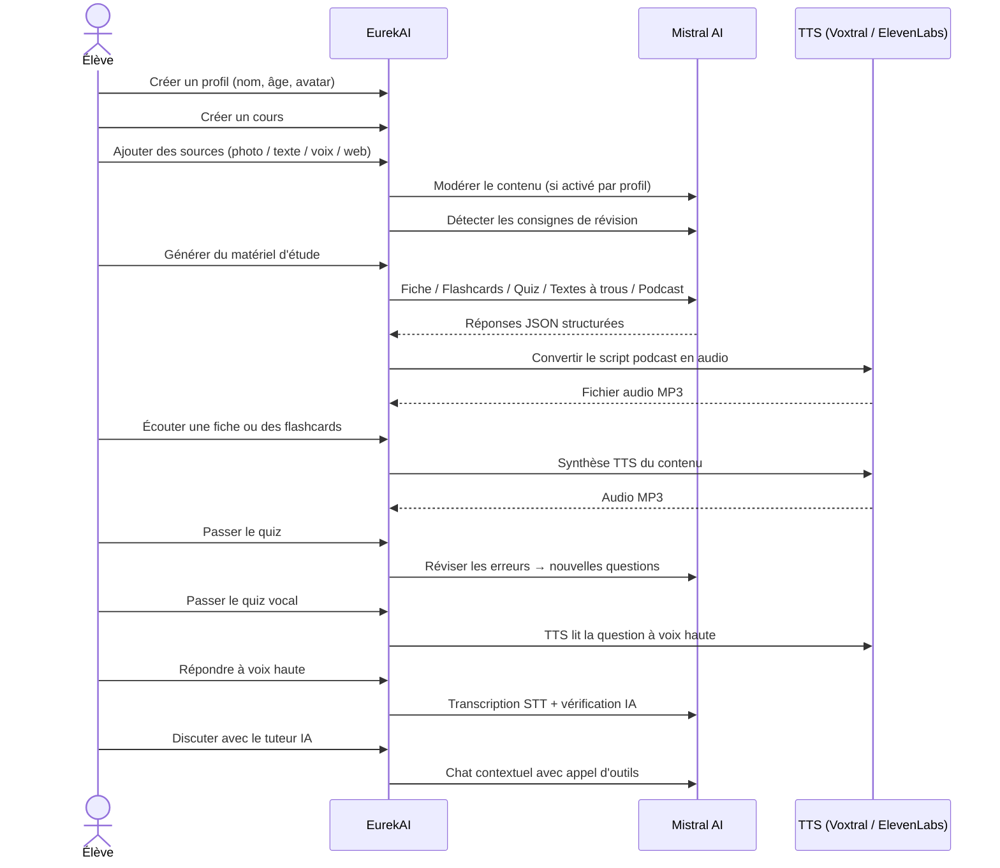

<p align="center">
  
</p>

<h1 align="center">EurekAI</h1>

<p align="center">
  <strong>Przekształca dowolne treści w interaktywne doświadczenie edukacyjne — napędzane przez <a href="https://mistral.ai">Mistral AI</a>.</strong>
</p>

<p align="center">
  <a href="README-en.md">🇬🇧 English</a> · <a href="README-es.md">🇪🇸 Español</a> · <a href="README-pt.md">🇧🇷 Português</a> · <a href="README-de.md">🇩🇪 Deutsch</a> · <a href="README-it.md">🇮🇹 Italiano</a> · <a href="README-nl.md">🇳🇱 Nederlands</a> · <a href="README-ar.md">🇸🇦 العربية</a><br>
  <a href="README-hi.md">🇮🇳 हिन्दी</a> · <a href="README-zh.md">🇨🇳 中文</a> · <a href="README-ja.md">🇯🇵 日本語</a> · <a href="README-ko.md">🇰🇷 한국어</a> · <a href="README-pl.md">🇵🇱 Polski</a> · <a href="README-ro.md">🇷🇴 Română</a> · <a href="README-sv.md">🇸🇪 Svenska</a>
</p>

<p align="center">
  <a href="https://www.youtube.com/watch?v=_b1TQz2leoI"></a>
</p>

<h4 align="center">📊 Jakość kodu</h4>

<p align="center">
  <a href="https://sonarcloud.io/summary/new_code?id=jls42_EurekAI"></a>
  <a href="https://sonarcloud.io/summary/new_code?id=jls42_EurekAI"></a>
  <a href="https://sonarcloud.io/summary/new_code?id=jls42_EurekAI"></a>
  <a href="https://sonarcloud.io/summary/new_code?id=jls42_EurekAI"></a>
</p>
<p align="center">
  <a href="https://sonarcloud.io/summary/new_code?id=jls42_EurekAI"></a>
  <a href="https://sonarcloud.io/summary/new_code?id=jls42_EurekAI"></a>
  <a href="https://sonarcloud.io/summary/new_code?id=jls42_EurekAI"></a>
  <a href="https://sonarcloud.io/summary/new_code?id=jls42_EurekAI"></a>
</p>

---

## Historia — Dlaczego EurekAI?

**EurekAI** narodziło się podczas [Mistral AI Worldwide Hackathon](https://luma.com/mistralhack-online) ([strona oficjalna](https://worldwide-hackathon.mistral.ai/)) (marzec 2026). Potrzebowałem tematu — i pomysł przyszedł z czegoś bardzo konkretnego: regularnie przygotowuję kartkówki z moją córką i pomyślałem, że dzięki AI można to uczynić bardziej zabawnym i interaktywnym.

Cel: wziąć **dowolne wejście** — zdjęcie podręcznika, tekst skopiowany i wklejony, nagranie głosowe, wyszukiwanie w sieci — i przekształcić je w **notatki powtórkowe, fiszki, quizy, podcasty, teksty z lukami, ilustracje i więcej**. Wszystko napędzane przez francuskie modele Mistral AI, co czyni to rozwiązanie naturalnie dopasowanym do uczniów francuskojęzycznych.

Projekt został zapoczątkowany podczas hackathonu, a następnie kontynuowany i wzbogacany poza jego ramami. Cały kod został wygenerowany przez AI — głównie przez [Claude Code](https://docs.anthropic.com/en/docs/claude-code), z kilkoma wkładami za pomocą [Codex](https://openai.com/index/introducing-codex/).

---

## Funkcje

| | Funkcja | Opis |
|---|---|---|
| 📷 | **Przesyłanie OCR** | Zrób zdjęcie podręcznika lub notatek — Mistral OCR wyodrębnia z nich treść |
| 📝 | **Wprowadzanie tekstu** | Wpisz lub wklej dowolny tekst bezpośrednio |
| 🎤 | **Wejście głosowe** | Nagraj się — Voxtral STT transkrybuje twój głos |
| 🌐 | **Wyszukiwanie w sieci** | Zadaj pytanie — Agent Mistral szuka odpowiedzi w sieci |
| 📄 | **Notatki powtórkowe** | Strukturalne notatki z punktami kluczowymi, słownictwem, cytatami, anegdotami |
| 🃏 | **Fiszki** | 5–50 kart pytanie/odpowiedź z odniesieniami do źródeł dla aktywnego zapamiętywania |
| ❓ | **Quiz wielokrotnego wyboru (QCM)** | 5–50 pytań wielokrotnego wyboru z adaptacyjną rewizją błędów |
| ✏️ | **Teksty z lukami** | Ćwiczenia do uzupełnienia z podpowiedziami i tolerancyjną walidacją |
| 🎙️ | **Podcast** | Mini-podcast 2-głosowy konwertowany na audio przez Mistral Voxtral TTS |
| 🖼️ | **Ilustracje** | Obrazy edukacyjne generowane przez Agenta Mistral |
| 🗣️ | **Quiz głosowy** | Pytania odczytywane na głos, odpowiedź ustna, AI weryfikuje odpowiedź |
| 💬 | **Tutor AI** | Czat kontekstowy z twoimi dokumentami kursu, z wywoływaniem narzędzi |
| 🧠 | **Router automatyczny** | Router oparty na `mistral-small-latest` analizuje treść i proponuje kombinację generatorów spośród 7 typów |
| 🔒 | **Kontrola rodzicielska** | Moderacja według wieku, PIN rodzicielski, ograniczenia czatu |
| 🌍 | **Wielojęzyczność** | Interfejs dostępny w 9 językach; generacja AI sterowalna w 15 językach przez prompty |
| 🔊 | **Czytanie na głos** | Odtwarzaj notatki i fiszki przez Mistral Voxtral TTS lub ElevenLabs |

---

## Przegląd architektury



---

## Mapa użycia modeli



---

## Ścieżka użytkownika



---

## Dogłębne omówienie — Funkcje

### Wejście multimodalne

EurekAI akceptuje 4 typy źródeł, moderowane w zależności od profilu (domyślnie włączone dla dziecka i nastolatka):

- **Przesyłanie OCR** — Pliki JPG, PNG lub PDF przetwarzane przez `mistral-ocr-latest`. Obsługuje tekst drukowany, tabele i pismo ręczne.
- **Tekst swobodny** — Wpisz lub wklej dowolną treść. Moderowany przed zapisaniem, jeśli moderacja jest włączona.
- **Wejście głosowe** — Nagrywaj audio w przeglądarce. Transkrybowane przez `voxtral-mini-latest`. Ustawienie `language="fr"` optymalizuje rozpoznawanie.
- **Wyszukiwanie w sieci** — Wprowadź zapytanie. Tymczasowy Agent Mistral z narzędziem `web_search` pobiera i podsumowuje wyniki.

### Generowanie treści przez AI

Siedem typów generowanych materiałów edukacyjnych:

| Generator | Model | Wynik |
|---|---|---|
| **Notatka powtórkowa** | `mistral-large-latest` | Tytuł, streszczenie, 10–25 kluczowych punktów, słownictwo, cytaty, anegdota |
| **Fiszki** | `mistral-large-latest` | 5–50 kart pytanie/odpowiedź z odniesieniami do źródeł dla aktywnego zapamiętywania |
| **Quiz QCM** | `mistral-large-latest` | 5–50 pytań, po 4 opcje, wyjaśnienia, adaptacyjna rewizja |
| **Teksty z lukami** | `mistral-large-latest` | Zdania do uzupełnienia z podpowiedziami, tolerancyjna walidacja (Levenshtein) |
| **Podcast** | `mistral-large-latest` + Voxtral TTS | Skrypt 2 głosy → audio MP3 |
| **Ilustracja** | Agent `mistral-large-latest` | Ilustracja edukacyjna przez narzędzie `image_generation` |
| **Quiz głosowy** | `mistral-large-latest` + Voxtral TTS + STT | Pytania TTS → odpowiedź STT → weryfikacja AI |

### Tutor AI przez czat

Czatowy tutor z pełnym dostępem do dokumentów kursu:

- Wykorzystuje `mistral-large-latest`
- **Wywoływanie narzędzi**: może generować notatki, fiszki, quizy lub teksty z lukami podczas rozmowy
- Historia 50 wiadomości na kurs
- Moderacja treści, jeśli włączona dla profilu

### Router automatyczny

Router używa `mistral-small-latest` do analizy treści źródeł i proponowania najbardziej trafnych generatorów spośród 7 dostępnych. Interfejs pokazuje postęp w czasie rzeczywistym: najpierw faza analizy, potem pojedyncze generacje z możliwością anulowania.

### Uczenie adaptacyjne

- **Statystyki quizów**: śledzenie prób i dokładności dla każdego pytania
- **Powtórka quizu**: generuje 5–10 nowych pytań celowanych na słabe koncepty
- **Wykrywanie instrukcji**: wykrywa polecenia dotyczące powtórek ("Wiem tę lekcję jeśli umiem...") i priorytetyzuje je w generatorach tekstowych kompatybilnych (notatka, fiszki, quiz, teksty z lukami)

### Bezpieczeństwo i kontrola rodzicielska

- **4 grupy wiekowe**: dziecko (≤10 lat), nastolatek (11–15), student (16–25), dorosły (26+)
- **Moderacja treści**: `mistral-moderation-2603` z 5 kategoriami zablokowanymi dla dziecka/nastolatka (seksualne, nienawiść, przemoc, samouszkodzenia, jailbreaking), brak ograniczeń dla studenta/dorosłego
- **PIN rodzicielski**: hash SHA-256, wymagany dla profili poniżej 15 lat. Do środowiska produkcyjnego zalecany powolny hash z solą (Argon2id, bcrypt).
- **Ograniczenia czatu**: czat AI domyślnie wyłączony dla osób poniżej 16 lat, aktywowany przez rodziców

### System wieloprofilowy

- Wiele profili z imieniem, wiekiem, awatarem, preferencjami językowymi
- Projekty powiązane z profilami przez `profileId`
- Kaskadowe usuwanie: usunięcie profilu usuwa wszystkie jego projekty

### TTS — wielu dostawców

- **Mistral Voxtral TTS** (domyślnie): `voxtral-mini-tts-latest`, nie jest wymagany dodatkowy klucz
- **ElevenLabs** (alternatywnie): `eleven_v3`, naturalne głosy, wymaga `ELEVENLABS_API_KEY`
- Dostawca konfigurowalny w ustawieniach aplikacji

### Internacjonalizacja

- Interfejs dostępny w 9 językach: fr, en, es, pt, it, nl, de, hi, ar
- Prompty AI obsługują 15 języków (fr, en, es, de, it, pt, nl, ja, zh, ko, ar, hi, pl, ro, sv)
- Język konfigurowalny per profil

---

## Stos technologiczny

| Warstwa | Technologia | Rola |
|---|---|---|
| **Środowisko uruchomieniowe** | Node.js + TypeScript 5.x | Serwer i bezpieczeństwo typów |
| **Backend** | Express 4.x | API REST |
| **Serwer deweloperski** | Vite 7.x + tsx | HMR, partials Handlebars, proxy |
| **Frontend** | HTML + TailwindCSS 4.x + Alpine.js 3.x | Interfejs reaktywny, TypeScript kompilowany przez Vite |
| **Szablony** | vite-plugin-handlebars | Kompozycja HTML przez partials |
| **AI** | Mistral AI SDK 2.x | Czat, OCR, STT, TTS, Agenci, Moderacja |
| **TTS (domyślnie)** | Mistral Voxtral TTS | `voxtral-mini-tts-latest`, wbudowana synteza mowy |
| **TTS (alternatywnie)** | ElevenLabs SDK 2.x | `eleven_v3`, naturalne głosy |
| **Ikony** | Lucide | Biblioteka ikon SVG |
| **Markdown** | Marked | Renderowanie markdown w czacie |
| **Przesyłanie plików** | Multer 1.4 LTS | Obsługa formularzy multipart |
| **Audio** | ffmpeg-static | Łączenie segmentów audio |
| **Testy** | Vitest | Testy jednostkowe — pokrycie mierzone przez SonarCloud |
| **Trwałość** | Pliki JSON | Przechowywanie bez zależności |

---

## Referencja modeli

| Model | Zastosowanie | Dlaczego |
|---|---|---|
| `mistral-large-latest` | Notatka, Fiszki, Podcast, Quiz, Teksty z lukami, Czat, Weryfikacja quizu głosowego, Agent obrazów, Agent wyszukiwania w sieci, Wykrywanie instrukcji | Najlepszy w wielojęzyczności i w wykonywaniu instrukcji |
| `mistral-ocr-latest` | OCR dokumentów | Tekst drukowany, tabele, pismo ręczne |
| `voxtral-mini-latest` | Rozpoznawanie mowy (STT) | Wielojęzyczne STT, zoptymalizowane z `language="fr"` |
| `voxtral-mini-tts-latest` | Synteza mowy (TTS) | Podcasty, quizy głosowe, czytanie na głos |
| `mistral-moderation-2603` | Moderacja treści | 5 kategorii zablokowanych dla dziecka/nastolatka (+ jailbreaking) |
| `mistral-small-latest` | Router automatyczny | Szybka analiza treści do decyzji routingu |
| `eleven_v3` (ElevenLabs) | Synteza mowy (alternatywny TTS) | Naturalne głosy, alternatywa konfigurowalna |

---

## Szybki start

```bash
# Cloner le dépôt
git clone https://github.com/jls42/EurekAI.git
cd EurekAI

# Installer les dépendances
npm install

# Configurer les clés API
cp .env.example .env
# Éditez .env avec vos clés :
#   MISTRAL_API_KEY=votre_clé_ici           (requis)
#   ELEVENLABS_API_KEY=votre_clé_ici        (optionnel, TTS alternatif)
#   SONAR_TOKEN=...                          (optionnel, CI SonarCloud uniquement)

# Lancer le développement
npm run dev
# → Backend :  http://localhost:3000 (API)
# → Frontend : http://localhost:5173 (serveur Vite avec HMR)
```

> **Uwaga** : Mistral Voxtral TTS jest dostawcą domyślnym — nie jest wymagany dodatkowy klucz poza `MISTRAL_API_KEY`. ElevenLabs jest alternatywnym dostawcą TTS konfigurowalnym w ustawieniach.

---

## Struktura projektu

```
server.ts                 — Point d'entrée Express, monte les routes + config
config.ts                 — Config runtime (modèles, voix, TTS provider), persistée dans output/config.json
store.ts                  — ProjectStore : CRUD projets/sources/générations, persistance JSON
profiles.ts               — ProfileStore : gestion des profils, hachage PIN
types.ts                  — Types TypeScript : Source, Generation (7 types), QuizStats, Profile
prompts.ts                — Tous les prompts IA centralisés (system + user templates, 15 langues)

generators/
  ocr.ts                  — Upload + OCR via Mistral (JPG, PNG, PDF)
  summary.ts              — Génération de fiche de révision (JSON structuré)
  flashcards.ts           — Flashcards Q/R (5-50, configurable)
  quiz.ts                 — Quiz QCM (5-50 questions, configurable) + révision adaptative
  fill-blank.ts           — Exercices à trous avec validation tolérante
  podcast.ts              — Script podcast 2 voix
  quiz-vocal.ts           — Quiz vocal : questions TTS + réponses STT + vérification IA
  image.ts                — Génération d'image via Agent Mistral (outil image_generation)
  chat.ts                 — Tuteur IA par chat avec appel d'outils
  router.ts               — Routeur automatique (contenu → générateurs recommandés)
  consigne.ts             — Détection de consignes de révision
  tts-provider.ts         — Dispatch TTS multi-provider (Mistral Voxtral / ElevenLabs)
  tts.ts                  — Génération audio podcast (concaténation de segments)
  stt.ts                  — Voxtral STT (audio → texte)
  websearch.ts            — Agent Mistral avec outil web_search
  moderation.ts           — Modération de contenu (filtrage par âge)

routes/
  projects.ts             — CRUD projets
  profiles.ts             — CRUD profils avec gestion du PIN
  sources.ts              — Upload OCR, texte libre, voix STT, recherche web, modération
  generate.ts             — Endpoints de génération (7 types + auto + route)
  generations.ts          — Tentatives de quiz/fill-blank, réponses vocales, lecture à voix haute
  chat.ts                 — Chat IA avec appel d'outils

helpers/
  index.ts                — safeParseJson, unwrapJsonArray, extractAllText, timer
  audio.ts                — collectStream (ReadableStream → Buffer)
  fill-blank-validate.ts  — Validation tolérante des réponses (normalisation, Levenshtein)

src/                      — Frontend (Vite + Handlebars)
  index.html              — Point d'entrée HTML principal
  main.ts                 — Entrée frontend (init Alpine.js + icônes Lucide)
  app/                    — Modules applicatifs Alpine.js
    state.ts              — Gestion d'état réactif
    navigation.ts         — Routage des vues + gardes par âge
    profiles.ts           — Logique du sélecteur de profils
    projects.ts           — CRUD des cours
    sources.ts            — Gestionnaires d'upload de sources
    generate.ts           — Déclencheurs de génération (individuel, tout, auto 2 phases)
    generations.ts        — Affichage + actions sur les générations
    chat.ts               — Interface de chat
    config.ts             — Interface de configuration (modèles, voix, TTS provider)
    render.ts             — Helpers de rendu HTML
    i18n.ts               — Changement de langue
    ...
  components/
    quiz.ts               — Composant quiz interactif
    quiz-vocal.ts         — Composant quiz vocal
    fill-blank.ts         — Composant textes à trous
    flashcards.ts         — Composant flashcards avec retournement
    step-by-step.ts       — Mixin navigation pas-à-pas (quiz, fill-blank, flashcards)
  i18n/
    fr.ts, en.ts, es.ts, — Dictionnaires par langue (9 langues)
    pt.ts, it.ts, nl.ts,
    de.ts, hi.ts, ar.ts
    languages.ts          — Registre des langues UI disponibles
    index.ts              — Chargeur i18n
  partials/               — Partials HTML Handlebars (header, sidebar, dialogues, vues)
  styles/
    main.css              — Entrée TailwindCSS
    theme.css             — Variables de thème personnalisées

public/assets/            — Ressources statiques (logo, avatars)
output/                   — Données d'exécution (projets, config, fichiers audio)
```

---

## Referencja API

### Konfiguracja
| Metoda | Endpoint | Opis |
|---|---|---|
| `GET` | `/api/config` | Bieżąca konfiguracja |
| `PUT` | `/api/config` | Zmień konfigurację (modele, głosy, dostawca TTS) |
| `GET` | `/api/config/status` | Status API (Mistral, ElevenLabs, TTS) |
| `POST` | `/api/config/reset` | Zresetuj konfigurację do domyślnej |
| `GET` | `/api/config/voices` | Wymień głosy Mistral TTS (opcjonalne `?lang=fr`) |

### Profile
| Metoda | Endpoint | Opis |
|---|---|---|
| `GET` | `/api/profiles` | Wymień wszystkie profile |
| `POST` | `/api/profiles` | Utwórz profil |
| `PUT` | `/api/profiles/:id` | Modyfikuj profil (PIN wymagany dla < 15 lat) |
| `DELETE` | `/api/profiles/:id` | Usuń profil + kaskada projektów `{pin?}` → `{ok, deletedProjects}` |

### Projekty
| Metoda | Endpoint | Opis |
|---|---|---|
| `GET` | `/api/projects` | Wymień projekty (`?profileId=` opcjonalne) |
| `POST` | `/api/projects` | Utwórz projekt `{name, profileId}` |
| `GET` | `/api/projects/:pid` | Szczegóły projektu |
| `PUT` | `/api/projects/:pid` | Zmień nazwę `{name}` |
| `DELETE` | `/api/projects/:pid` | Usuń projekt |

### Źródła
| Metoda | Endpoint | Opis |
|---|---|---|
| `POST` | `/api/projects/:pid/sources/upload` | Upload OCR (pliki multipart) |
| `POST` | `/api/projects/:pid/sources/text` | Tekst swobodny `{text}` |
| `POST` | `/api/projects/:pid/sources/voice` | Głos STT (audio multipart) |
| `POST` | `/api/projects/:pid/sources/websearch` | Wyszukiwanie w sieci `{query}` |
| `DELETE` | `/api/projects/:pid/sources/:sid` | Usuń źródło |
| `POST` | `/api/projects/:pid/moderate` | Moderuj `{text}` |
| `POST` | `/api/projects/:pid/detect-consigne` | Wykrywaj `{text}` |
| `POST` | `/api/projects/:pid/detect-consigne` | Wykryj instrukcje do powtórek |

### Generowanie
| Metoda | Endpoint | Opis |
|---|---|---|
| `POST` | `/api/projects/:pid/generate/summary` | Notatka powtórkowa |
| `POST` | `/api/projects/:pid/generate/flashcards` | Fiszki |
| `POST` | `/api/projects/:pid/generate/quiz` | Quiz QCM |
| `POST` | `/api/projects/:pid/generate/fill-blank` | Teksty z lukami |
| `POST` | `/api/projects/:pid/generate/podcast` | Podcast |
| `POST` | `/api/projects/:pid/generate/image` | Ilustracja |
| `POST` | `/api/projects/:pid/generate/quiz-vocal` | Quiz głosowy |
| `POST` | `/api/projects/:pid/generate/quiz-review` | Rewizja adaptacyjna `{generationId, weakQuestions}` |
| `POST` | `/api/projects/:pid/generate/route` | Analiza routingu (plan generatorów do uruchomienia) |
| `POST` | `/api/projects/:pid/generate/auto` | Generacja auto backend (routing + 5 typów: summary, flashcards, quiz, fill-blank, podcast) |

Wszystkie trasy generacji akceptują `{sourceIds?, lang?, ageGroup?, count?, useConsigne?}`. `quiz-review` wymaga dodatkowo `{generationId, weakQuestions}`.

### CRUD generacji
| Metoda | Endpoint | Opis |
|---|---|---|
| `POST` | `/api/projects/:pid/generations/:gid/quiz-attempt` | Prześlij odpowiedzi do quizu `{answers}` |
| `POST` | `/api/projects/:pid/generations/:gid/fill-blank-attempt` | Prześlij odpowiedzi do tekstów z lukami `{answers}` |
| `POST` | `/api/projects/:pid/generations/:gid/vocal-answer` | Sprawdź odpowiedź ustną (audio + questionIndex) |
| `POST` | `/api/projects/:pid/generations/:gid/read-aloud` | Odtwarzanie TTS na głos (notatki/fiszki) |
| `PUT` | `/api/projects/:pid/generations/:gid` | Zmień nazwę `{title}` |
| `DELETE` | `/api/projects/:pid/generations/:gid` | Usuń generację |

### Czat
| Metoda | Endpoint | Opis |
|---|---|---|
| `GET` | `/api/projects/:pid/chat` | Pobierz historię czatu |
| `POST` | `/api/projects/:pid/chat` | Wyślij wiadomość `{message, lang, ageGroup}` |
| `DELETE` | `/api/projects/:pid/chat` | Wyczyść historię czatu |

---

## Decyzje architektoniczne

| Decyzja | Uzasadnienie |
|---|---|
| **Alpine.js zamiast React/Vue** | Minimalny ślad, lekka reaktywność z TypeScript kompilowanym przez Vite. Idealne na hackathon, gdzie liczy się szybkość. |
| **Trwałość w plikach JSON** | Zero zależności, natychmiastowy start. Brak bazy danych do skonfigurowania — zaczynamy od razu. |
| **Vite + Handlebars** | Najlepsze z obu światów: szybki HMR dla pracy deweloperskiej, partiale HTML do organizacji kodu, Tailwind JIT. |
| **Prompts centralisés** | Wszystkie prompty SI w `prompts.ts` — łatwo iterować, testować i dostosowywać według języka/grupy wiekowej. |
| **System wielogeneracyjny** | Każde wygenerowanie jest niezależnym obiektem z własnym ID — umożliwia wiele fiszek, quizów itp. na kurs. |
| **Prompty dostosowane do wieku** | 4 grupy wiekowe z różnym słownictwem, złożonością i tonem — ta sama treść uczy inaczej w zależności od ucznia. |
| **Funkcje oparte na Agentach** | Generowanie obrazów i wyszukiwanie w sieci korzystają z tymczasowych Agentów Mistral — własny cykl życia z automatycznym czyszczeniem. |
| **Wielo‑dostawczy TTS** | Domyślnie Mistral Voxtral TTS (bez dodatkowego klucza), ElevenLabs jako alternatywa — konfigurowalne bez restartu. |

---

## Podziękowania i uznania

- **[Mistral AI](https://mistral.ai)** — Modele SI (Large, OCR, Voxtral STT, Voxtral TTS, Moderation, Small) + Worldwide Hackathon
- **[ElevenLabs](https://elevenlabs.io)** — Alternatywny silnik syntezy mowy (`eleven_v3`)
- **[Alpine.js](https://alpinejs.dev)** — Lekki framework reaktywny
- **[TailwindCSS](https://tailwindcss.com)** — Framework CSS typu utility
- **[Vite](https://vitejs.dev)** — Narzędzie do budowania frontendu
- **[Lucide](https://lucide.dev)** — Biblioteka ikon
- **[Marked](https://marked.js.org)** — Parser Markdown

Zainicjowany podczas Mistral AI Worldwide Hackathon (marzec 2026), w całości opracowany przez SI przy użyciu Claude Code i Codex.

---

## Autor

**Julien LS** — [contact@jls42.org](mailto:contact@jls42.org)

## Licencja

[AGPL-3.0](LICENSE) — Prawa autorskie (C) 2026 Julien LS

**Ten dokument został przetłumaczony z wersji fr na język pl przy użyciu modelu gpt-5-mini. Aby uzyskać więcej informacji o procesie tłumaczenia, zobacz https://gitlab.com/jls42/ai-powered-markdown-translator**

