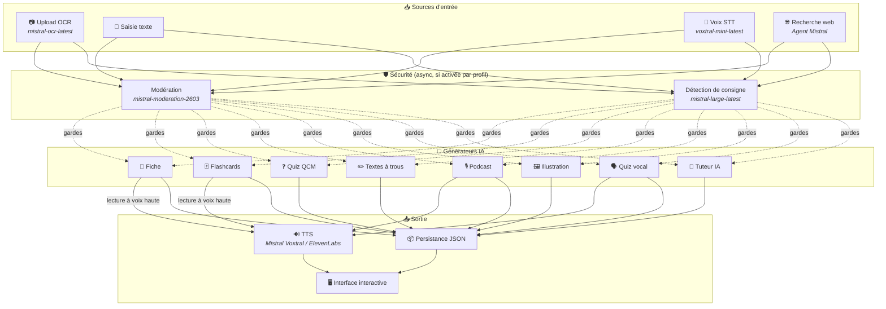
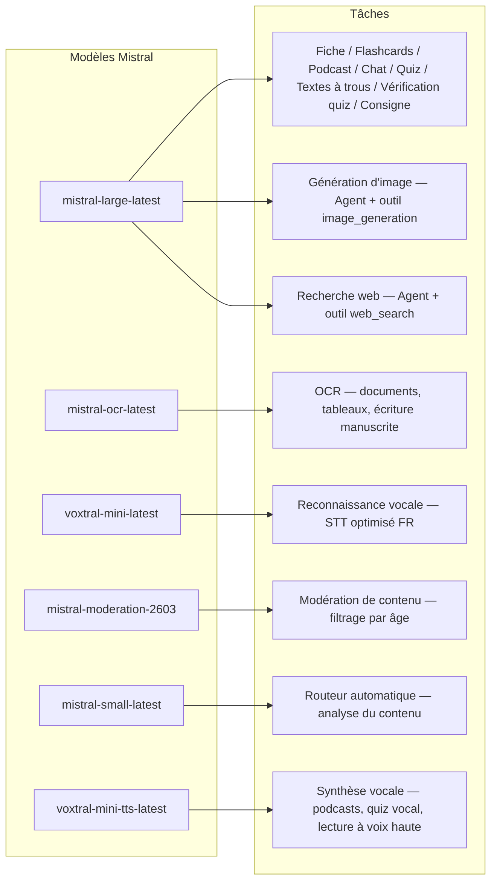
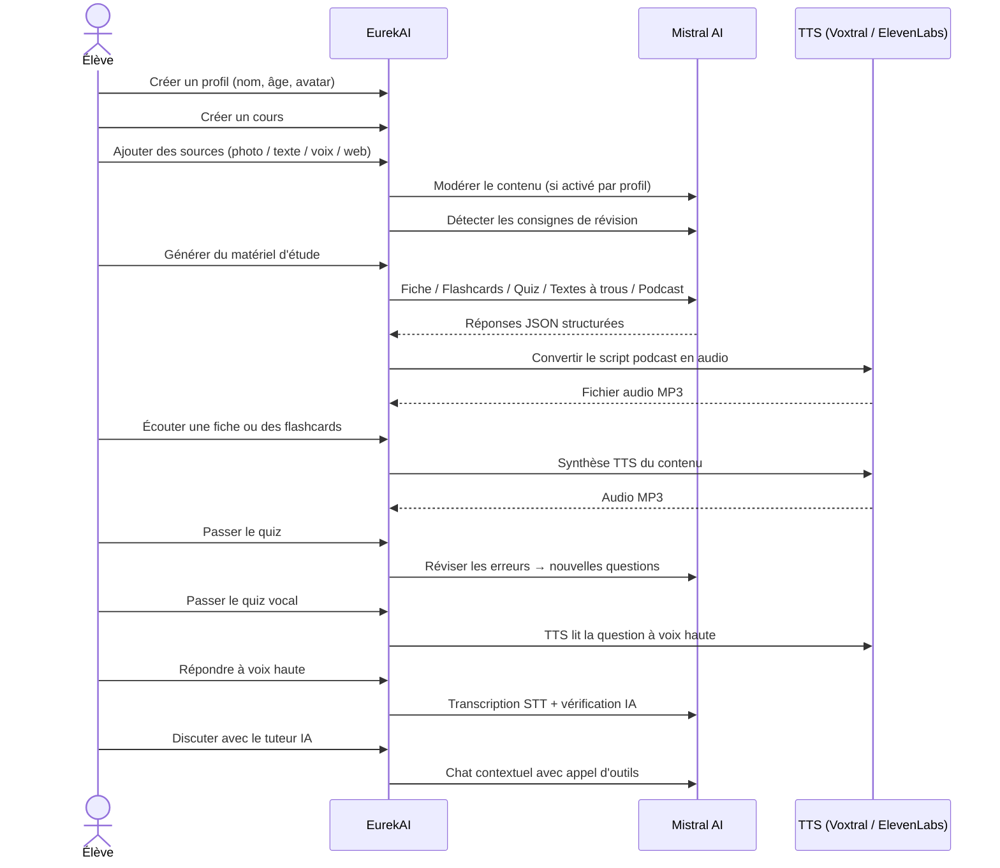

<p align="center">
  
</p>

<h1 align="center">EurekAI</h1>

<p align="center">
  <strong>Transforme qualquer conteúdo em experiência de aprendizado interativa — impulsionado por <a href="https://mistral.ai">Mistral AI</a>.</strong>
</p>

<p align="center">
  <a href="README-en.md">🇬🇧 English</a> · <a href="README-es.md">🇪🇸 Español</a> · <a href="README-pt.md">🇧🇷 Português</a> · <a href="README-de.md">🇩🇪 Deutsch</a> · <a href="README-it.md">🇮🇹 Italiano</a> · <a href="README-nl.md">🇳🇱 Nederlands</a> · <a href="README-ar.md">🇸🇦 العربية</a><br>
  <a href="README-hi.md">🇮🇳 हिन्दी</a> · <a href="README-zh.md">🇨🇳 中文</a> · <a href="README-ja.md">🇯🇵 日本語</a> · <a href="README-ko.md">🇰🇷 한국어</a> · <a href="README-pl.md">🇵🇱 Polski</a> · <a href="README-ro.md">🇷🇴 Română</a> · <a href="README-sv.md">🇸🇪 Svenska</a>
</p>

<p align="center">
  <a href="https://www.youtube.com/watch?v=_b1TQz2leoI"></a>
</p>

<h4 align="center">📊 Qualidade do código</h4>

<p align="center">
  <a href="https://sonarcloud.io/summary/new_code?id=jls42_EurekAI"></a>
  <a href="https://sonarcloud.io/summary/new_code?id=jls42_EurekAI"></a>
  <a href="https://sonarcloud.io/summary/new_code?id=jls42_EurekAI"></a>
  <a href="https://sonarcloud.io/summary/new_code?id=jls42_EurekAI"></a>
</p>
<p align="center">
  <a href="https://sonarcloud.io/summary/new_code?id=jls42_EurekAI"></a>
  <a href="https://sonarcloud.io/summary/new_code?id=jls42_EurekAI"></a>
  <a href="https://sonarcloud.io/summary/new_code?id=jls42_EurekAI"></a>
  <a href="https://sonarcloud.io/summary/new_code?id=jls42_EurekAI"></a>
</p>

---

## A história — Por que o EurekAI?

**EurekAI** nasceu durante o [Mistral AI Worldwide Hackathon](https://luma.com/mistralhack-online) ([site oficial](https://worldwide-hackathon.mistral.ai/)) (março de 2026). Eu precisava de um tema — e a ideia veio de algo muito concreto: eu preparo regularmente avaliações com minha filha, e pensei que deveria ser possível tornar isso mais lúdico e interativo graças à IA.

O objetivo: pegar **qualquer entrada** — uma foto do manual, um texto copiado, uma gravação de voz, uma pesquisa na web — e transformá-la em **fichas de revisão, flashcards, quizzes, podcasts, textos com lacunas, ilustrações e muito mais**. Tudo impulsionado pelos modelos franceses da Mistral AI, o que torna a solução naturalmente adequada para estudantes francófonos.

O projeto foi iniciado durante o hackathon, depois retomado e enriquecido fora dele. Todo o código foi gerado por IA — principalmente via [Claude Code](https://docs.anthropic.com/en/docs/claude-code), com algumas contribuições via [Codex](https://openai.com/index/introducing-codex/).

---

## Funcionalidades

| | Funcionalidade | Descrição |
|---|---|---|
| 📷 | **Upload OCR** | Tire foto do seu manual ou das suas anotações — o Mistral OCR extrai o conteúdo |
| 📝 | **Entrada de texto** | Digite ou cole qualquer texto diretamente |
| 🎤 | **Entrada vocal** | Grave-se — o Voxtral STT transcreve sua voz |
| 🌐 | **Pesquisa web** | Faça uma pergunta — um Agent Mistral busca respostas na web |
| 📄 | **Fichas de revisão** | Notas estruturadas com pontos-chave, vocabulário, citações, curiosidades |
| 🃏 | **Flashcards** | 5-50 cartões Q/R com referências às fontes para memorização ativa |
| ❓ | **Quiz QCM** | 5-50 perguntas de múltipla escolha com revisão adaptativa de erros |
| ✏️ | **Textos com lacunas** | Exercícios para completar com dicas e validação tolerante |
| 🎙️ | **Podcast** | Mini-podcast com 2 vozes convertido em áudio via Mistral Voxtral TTS |
| 🖼️ | **Ilustrações** | Imagens educativas geradas por um Agent Mistral |
| 🗣️ | **Quiz vocal** | Perguntas lidas em voz alta, resposta oral, a IA verifica a resposta |
| 💬 | **Tutor IA** | Chat contextual com seus documentos de curso, com chamada de ferramentas |
| 🧠 | **Roteador automático** | Um roteador baseado em `mistral-small-latest` analisa o conteúdo e propõe uma combinação de geradores entre os 7 tipos disponíveis |
| 🔒 | **Controle parental** | Moderação por idade, PIN parental, restrições do chat |
| 🌍 | **Multilingue** | Interface disponível em 9 idiomas; geração IA controlável em 15 idiomas via prompts |
| 🔊 | **Leitura em voz alta** | Ouça as fichas e flashcards via Mistral Voxtral TTS ou ElevenLabs |

---

## Visão geral da arquitetura



---

## Mapa de uso dos modelos



---

## Jornada do usuário



---

## Exploração aprofundada — Funcionalidades

### Entrada multimodal

EurekAI aceita 4 tipos de fontes, moderadas conforme o perfil (ativado por padrão para criança e adolescente):

- **Upload OCR** — Arquivos JPG, PNG ou PDF processados por `mistral-ocr-latest`. Lida com texto impresso, tabelas e escrita manual.
- **Texto livre** — Digite ou cole qualquer conteúdo. Moderado antes do armazenamento se a moderação estiver ativa.
- **Entrada vocal** — Grave áudio no navegador. Transcrito por `voxtral-mini-latest`. O parâmetro `language="fr"` otimiza o reconhecimento.
- **Pesquisa web** — Insira uma consulta. Um Agent Mistral temporário com a ferramenta `web_search` recupera e resume os resultados.

### Geração de conteúdo por IA

Sete tipos de material de aprendizado gerado:

| Gerador | Modelo | Saída |
|---|---|---|
| **Ficha de revisão** | `mistral-large-latest` | Título, resumo, 10-25 pontos-chave, vocabulário, citações, curiosidade |
| **Flashcards** | `mistral-large-latest` | 5-50 cartões Q/R com referências às fontes para memorização ativa |
| **Quiz QCM** | `mistral-large-latest` | 5-50 perguntas, 4 escolhas cada, explicações, revisão adaptativa |
| **Textos com lacunas** | `mistral-large-latest` | Frases para completar com dicas, validação tolerante (Levenshtein) |
| **Podcast** | `mistral-large-latest` + Voxtral TTS | Roteiro 2 vozes → áudio MP3 |
| **Ilustração** | Agent `mistral-large-latest` | Imagem educativa via a ferramenta `image_generation` |
| **Quiz vocal** | `mistral-large-latest` + Voxtral TTS + STT | Perguntas TTS → resposta STT → verificação pela IA |

### Tutor IA por chat

Um tutor conversacional com acesso completo aos documentos do curso:

- Utiliza `mistral-large-latest`
- **Chamada de ferramentas**: pode gerar fichas, flashcards, quizzes ou textos com lacunas durante a conversa
- Histórico de 50 mensagens por curso
- Moderação do conteúdo se ativada para o perfil

### Roteador automático

O roteador usa `mistral-small-latest` para analisar o conteúdo das fontes e propor os geradores mais pertinentes entre os 7 disponíveis. A interface mostra o progresso em tempo real: primeiro uma fase de análise, depois as gerações individuais com possibilidade de cancelamento.

### Aprendizado adaptativo

- **Estatísticas de quiz**: acompanhamento das tentativas e da precisão por pergunta
- **Revisão de quiz**: gera 5-10 novas perguntas direcionadas aos conceitos fracos
- **Detecção de instrução**: detecta instruções de revisão ("Eu sei minha lição se eu souber...") e as prioriza nos geradores textuais compatíveis (ficha, flashcards, quiz, textos com lacunas)

### Segurança & controle parental

- **4 faixas etárias**: criança (≤10 anos), adolescente (11-15), estudante (16-25), adulto (26+)
- **Moderação de conteúdo**: `mistral-moderation-2603` com 5 categorias bloqueadas para criança/ado (sexual, hate, violence, selfharm, jailbreaking), sem restrição para estudante/adulto
- **PIN parental**: hash SHA-256, exigido para perfis menores de 15 anos. Para um deployment em produção, prever um hash lento com salt (Argon2id, bcrypt).
- **Restrições do chat**: chat IA desativado por padrão para menores de 16 anos, ativável pelos pais

### Sistema multi-perfis

- Múltiplos perfis com nome, idade, avatar, preferências de idioma
- Projetos vinculados aos perfis via `profileId`
- Exclusão em cascata: excluir um perfil apaga todos os seus projetos

### TTS multi-provider

- **Mistral Voxtral TTS** (padrão): `voxtral-mini-tts-latest`, sem necessidade de chave adicional
- **ElevenLabs** (alternativo): `eleven_v3`, vozes naturais, requer `ELEVENLABS_API_KEY`
- Provider configurável nas configurações do aplicativo

### Internacionalização

- Interface disponível em 9 idiomas: fr, en, es, pt, it, nl, de, hi, ar
- Prompts IA suportam 15 idiomas (fr, en, es, de, it, pt, nl, ja, zh, ko, ar, hi, pl, ro, sv)
- Idioma configurável por perfil

---

## Stack técnico

| Camada | Tecnologia | Papel |
|---|---|---|
| **Runtime** | Node.js + TypeScript 5.x | Servidor e segurança de tipos |
| **Backend** | Express 4.x | API REST |
| **Servidor de dev** | Vite 7.x + tsx | HMR, partials Handlebars, proxy |
| **Frontend** | HTML + TailwindCSS 4.x + Alpine.js 3.x | Interface reativa, TypeScript compilado pelo Vite |
| **Templating** | vite-plugin-handlebars | Composição HTML por partials |
| **IA** | Mistral AI SDK 2.x | Chat, OCR, STT, TTS, Agents, Moderação |
| **TTS (padrão)** | Mistral Voxtral TTS | `voxtral-mini-tts-latest`, síntese vocal integrada |
| **TTS (alternativo)** | ElevenLabs SDK 2.x | `eleven_v3`, vozes naturais |
| **Ícones** | Lucide | Biblioteca de ícones SVG |
| **Markdown** | Marked | Renderização de markdown no chat |
| **Upload de arquivos** | Multer 1.4 LTS | Gestão de formulários multipart |
| **Áudio** | ffmpeg-static | Concatenação de segmentos de áudio |
| **Testes** | Vitest | Testes unitários — cobertura medida por SonarCloud |
| **Persistência** | Arquivos JSON | Armazenamento sem dependências |

---

## Referência dos modelos

| Modelo | Uso | Por quê |
|---|---|---|
| `mistral-large-latest` | Ficha, Flashcards, Podcast, Quiz, Textos com lacunas, Chat, Verificação de quiz vocal, Agent Image, Agent Web Search, Detecção de instrução | Melhor multilingue + seguimento de instruções |
| `mistral-ocr-latest` | OCR de documentos | Texto impresso, tabelas, escrita manual |
| `voxtral-mini-latest` | Reconhecimento de voz (STT) | STT multilingue, otimizado com `language="fr"` |
| `voxtral-mini-tts-latest` | Síntese vocal (TTS) | Podcasts, quiz vocal, leitura em voz alta |
| `mistral-moderation-2603` | Moderação de conteúdo | 5 categorias bloqueadas para criança/ado (+ jailbreaking) |
| `mistral-small-latest` | Roteador automático | Análise rápida do conteúdo para decisões de roteamento |
| `eleven_v3` (ElevenLabs) | Síntese vocal (TTS alternativo) | Vozes naturais, alternativa configurável |

---

## Início rápido

```bash
# Cloner le dépôt
git clone https://github.com/jls42/EurekAI.git
cd EurekAI

# Installer les dépendances
npm install

# Configurer les clés API
cp .env.example .env
# Éditez .env avec vos clés :
#   MISTRAL_API_KEY=votre_clé_ici           (requis)
#   ELEVENLABS_API_KEY=votre_clé_ici        (optionnel, TTS alternatif)
#   SONAR_TOKEN=...                          (optionnel, CI SonarCloud uniquement)

# Lancer le développement
npm run dev
# → Backend :  http://localhost:3000 (API)
# → Frontend : http://localhost:5173 (serveur Vite avec HMR)
```

> **Nota** : Mistral Voxtral TTS é o provider padrão — nenhuma chave adicional é necessária além de `MISTRAL_API_KEY`. ElevenLabs é um provider TTS alternativo configurável nas definições.

---

## Estrutura do projeto

```
server.ts                 — Point d'entrée Express, monte les routes + config
config.ts                 — Config runtime (modèles, voix, TTS provider), persistée dans output/config.json
store.ts                  — ProjectStore : CRUD projets/sources/générations, persistance JSON
profiles.ts               — ProfileStore : gestion des profils, hachage PIN
types.ts                  — Types TypeScript : Source, Generation (7 types), QuizStats, Profile
prompts.ts                — Tous les prompts IA centralisés (system + user templates, 15 langues)

generators/
  ocr.ts                  — Upload + OCR via Mistral (JPG, PNG, PDF)
  summary.ts              — Génération de fiche de révision (JSON structuré)
  flashcards.ts           — Flashcards Q/R (5-50, configurable)
  quiz.ts                 — Quiz QCM (5-50 questions, configurable) + révision adaptative
  fill-blank.ts           — Exercices à trous avec validation tolérante
  podcast.ts              — Script podcast 2 voix
  quiz-vocal.ts           — Quiz vocal : questions TTS + réponses STT + vérification IA
  image.ts                — Génération d'image via Agent Mistral (outil image_generation)
  chat.ts                 — Tuteur IA par chat avec appel d'outils
  router.ts               — Routeur automatique (contenu → générateurs recommandés)
  consigne.ts             — Détection de consignes de révision
  tts-provider.ts         — Dispatch TTS multi-provider (Mistral Voxtral / ElevenLabs)
  tts.ts                  — Génération audio podcast (concaténation de segments)
  stt.ts                  — Voxtral STT (audio → texte)
  websearch.ts            — Agent Mistral avec outil web_search
  moderation.ts           — Modération de contenu (filtrage par âge)

routes/
  projects.ts             — CRUD projets
  profiles.ts             — CRUD profils avec gestion du PIN
  sources.ts              — Upload OCR, texte libre, voix STT, recherche web, modération
  generate.ts             — Endpoints de génération (7 types + auto + route)
  generations.ts          — Tentatives de quiz/fill-blank, réponses vocales, lecture à voix haute
  chat.ts                 — Chat IA avec appel d'outils

helpers/
  index.ts                — safeParseJson, unwrapJsonArray, extractAllText, timer
  audio.ts                — collectStream (ReadableStream → Buffer)
  fill-blank-validate.ts  — Validation tolérante des réponses (normalisation, Levenshtein)

src/                      — Frontend (Vite + Handlebars)
  index.html              — Point d'entrée HTML principal
  main.ts                 — Entrée frontend (init Alpine.js + icônes Lucide)
  app/                    — Modules applicatifs Alpine.js
    state.ts              — Gestion d'état réactif
    navigation.ts         — Routage des vues + gardes par âge
    profiles.ts           — Logique du sélecteur de profils
    projects.ts           — CRUD des cours
    sources.ts            — Gestionnaires d'upload de sources
    generate.ts           — Déclencheurs de génération (individuel, tout, auto 2 phases)
    generations.ts        — Affichage + actions sur les générations
    chat.ts               — Interface de chat
    config.ts             — Interface de configuration (modèles, voix, TTS provider)
    render.ts             — Helpers de rendu HTML
    i18n.ts               — Changement de langue
    ...
  components/
    quiz.ts               — Composant quiz interactif
    quiz-vocal.ts         — Composant quiz vocal
    fill-blank.ts         — Composant textes à trous
    flashcards.ts         — Composant flashcards avec retournement
    step-by-step.ts       — Mixin navigation pas-à-pas (quiz, fill-blank, flashcards)
  i18n/
    fr.ts, en.ts, es.ts, — Dictionnaires par langue (9 langues)
    pt.ts, it.ts, nl.ts,
    de.ts, hi.ts, ar.ts
    languages.ts          — Registre des langues UI disponibles
    index.ts              — Chargeur i18n
  partials/               — Partials HTML Handlebars (header, sidebar, dialogues, vues)
  styles/
    main.css              — Entrée TailwindCSS
    theme.css             — Variables de thème personnalisées

public/assets/            — Ressources statiques (logo, avatars)
output/                   — Données d'exécution (projets, config, fichiers audio)
```

---

## Referência da API

### Config
| Método | Endpoint | Descrição |
|---|---|---|
| `GET` | `/api/config` | Configuração atual |
| `PUT` | `/api/config` | Modificar a config (modelos, vozes, provider TTS) |
| `GET` | `/api/config/status` | Status das APIs (Mistral, ElevenLabs, TTS) |
| `POST` | `/api/config/reset` | Resetar a config para o padrão |
| `GET` | `/api/config/voices` | Listar vozes Mistral TTS (opcional `?lang=fr`) |

### Perfis
| Método | Endpoint | Descrição |
|---|---|---|
| `GET` | `/api/profiles` | Listar todos os perfis |
| `POST` | `/api/profiles` | Criar um perfil |
| `PUT` | `/api/profiles/:id` | Modificar um perfil (PIN requerido para < 15 anos) |
| `DELETE` | `/api/profiles/:id` | Excluir um perfil + cascata de projetos `{pin?}` → `{ok, deletedProjects}` |

### Projetos
| Método | Endpoint | Descrição |
|---|---|---|
| `GET` | `/api/projects` | Listar os projetos (`?profileId=` opcional) |
| `POST` | `/api/projects` | Criar um projeto `{name, profileId}` |
| `GET` | `/api/projects/:pid` | Detalhes do projeto |
| `PUT` | `/api/projects/:pid` | Renomear `{name}` |
| `DELETE` | `/api/projects/:pid` | Excluir o projeto |

### Fontes
| Método | Endpoint | Descrição |
|---|---|---|
| `POST` | `/api/projects/:pid/sources/upload` | Upload OCR (arquivos multipart) |
| `POST` | `/api/projects/:pid/sources/text` | Texto livre `{text}` |
| `POST` | `/api/projects/:pid/sources/voice` | Voz STT (áudio multipart) |
| `POST` | `/api/projects/:pid/sources/websearch` | Pesquisa web `{query}` |
| `DELETE` | `/api/projects/:pid/sources/:sid` | Excluir uma fonte |
| `POST` | `/api/projects/:pid/moderate` | Moderar `{text}` |
| `POST` | `/api/projects/:pid/detect-consigne` | Detectar `POST` |

### Geração
| Método | Endpoint | Descrição |
|---|---|---|
| `POST` | `/api/projects/:pid/generate/summary` | Ficha de revisão |
| `POST` | `/api/projects/:pid/generate/flashcards` | Flashcards |
| `POST` | `/api/projects/:pid/generate/quiz` | Quiz QCM |
| `POST` | `/api/projects/:pid/generate/fill-blank` | Textos com lacunas |
| `POST` | `/api/projects/:pid/generate/podcast` | Podcast |
| `POST` | `/api/projects/:pid/generate/image` | Ilustração |
| `POST` | `/api/projects/:pid/generate/quiz-vocal` | Quiz vocal |
| `POST` | `/api/projects/:pid/generate/quiz-review` | Revisão adaptativa `{generationId, weakQuestions}` |
| `POST` | `/api/projects/:pid/generate/route` | Análise de roteamento (plano dos geradores a executar) |
| `POST` | `/api/projects/:pid/generate/auto` | Geração automática backend (roteamento + 5 tipos: resumo, flashcards, quiz, fill-blank, podcast) |

Todas as rotas de geração aceitam `{sourceIds?, lang?, ageGroup?, count?, useConsigne?}`. `quiz-review` exige além disso `{generationId, weakQuestions}`.

### CRUD Gerações
| Método | Endpoint | Descrição |
|---|---|---|
| `POST` | `/api/projects/:pid/generations/:gid/quiz-attempt` | Submeter as respostas do quiz `{answers}` |
| `POST` | `/api/projects/:pid/generations/:gid/fill-blank-attempt` | Submeter as respostas dos textos com lacunas `{answers}` |
| `POST` | `/api/projects/:pid/generations/:gid/vocal-answer` | Verificar uma resposta oral (áudio + questionIndex) |
| `POST` | `/api/projects/:pid/generations/:gid/read-aloud` | Reprodução TTS em voz alta (fichas/flashcards) |
| `PUT` | `/api/projects/:pid/generations/:gid` | Renomear `{title}` |
| `DELETE` | `/api/projects/:pid/generations/:gid` | Excluir a geração |

### Chat
| Método | Endpoint | Descrição |
|---|---|---|
| `GET` | `/api/projects/:pid/chat` | Recuperar o histórico do chat |
| `POST` | `/api/projects/:pid/chat` | Enviar uma mensagem `{message, lang, ageGroup}` |
| `DELETE` | `/api/projects/:pid/chat` | Apagar o histórico do chat |

---

## Decisões arquiteturais

| Decisão | Justificação |
|---|---|
| **Alpine.js em vez de React/Vue** | Pegada mínima, reatividade leve com TypeScript compilado pelo Vite. Perfeito para um hackathon onde a velocidade conta. |
| **Persistência em arquivos JSON** | Zero dependências, início instantâneo. Nenhum banco de dados a configurar — inicia-se e pronto. |
| **Vite + Handlebars** | O melhor dos dois mundos: HMR rápido para desenvolvimento, partials em HTML para a organização do código, Tailwind JIT. |
| **Prompts centralizados** | Todos os prompts de IA em `prompts.ts` — fácil de iterar, testar e adaptar por língua/faixa etária. |
| **Sistema multi-generaçõs** | Cada geração é um objeto independente com seu próprio ID — permite várias fichas, questionários, etc. por curso. |
| **Prompts adaptados por idade** | 4 faixas etárias com vocabulário, complexidade e tom diferentes — o mesmo conteúdo ensina de forma diferente conforme o aprendiz. |
| **Funcionalidades baseadas em Agentes** | A geração de imagens e a pesquisa na web utilizam Agentes Mistral temporários — ciclo de vida próprio com limpeza automática. |
| **TTS multi-fornecedor** | Mistral Voxtral TTS por padrão (sem chave adicional), ElevenLabs como alternativa — configurável sem reinício. |

---

## Créditos & agradecimentos

- **[Mistral AI](https://mistral.ai)** — Modelos de IA (Large, OCR, Voxtral STT, Voxtral TTS, Moderation, Small) + Hackathon Mundial
- **[ElevenLabs](https://elevenlabs.io)** — Motor de síntese de voz alternativo (`eleven_v3`)
- **[Alpine.js](https://alpinejs.dev)** — Framework reativo leve
- **[TailwindCSS](https://tailwindcss.com)** — Framework CSS utilitário
- **[Vite](https://vitejs.dev)** — Ferramenta de build frontend
- **[Lucide](https://lucide.dev)** — Biblioteca de ícones
- **[Marked](https://marked.js.org)** — Analisador Markdown

Iniciado durante o Mistral AI Worldwide Hackathon (março de 2026), desenvolvido inteiramente por IA com Claude Code e Codex.

---

## Autor

**Julien LS** — [contact@jls42.org](mailto:contact@jls42.org)

## Licença

[AGPL-3.0](LICENSE) — Copyright (C) 2026 Julien LS

**Este documento foi traduzido da versão fr para o idioma pt usando o modelo gpt-5-mini. Para mais informações sobre o processo de tradução, consulte https://gitlab.com/jls42/ai-powered-markdown-translator**

