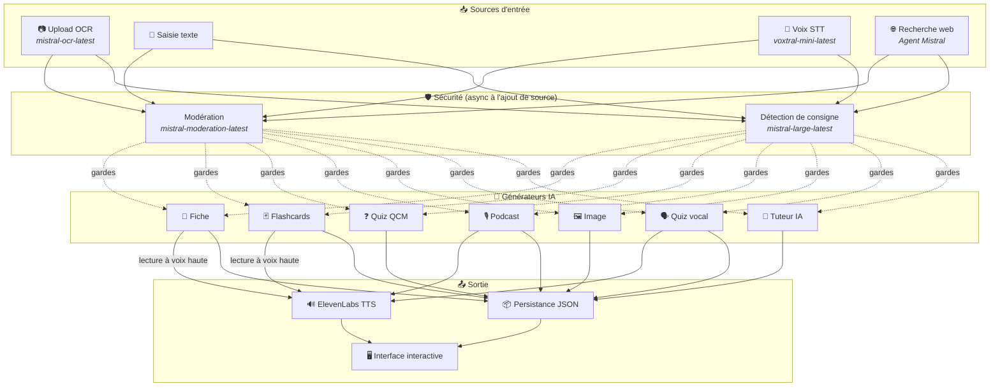
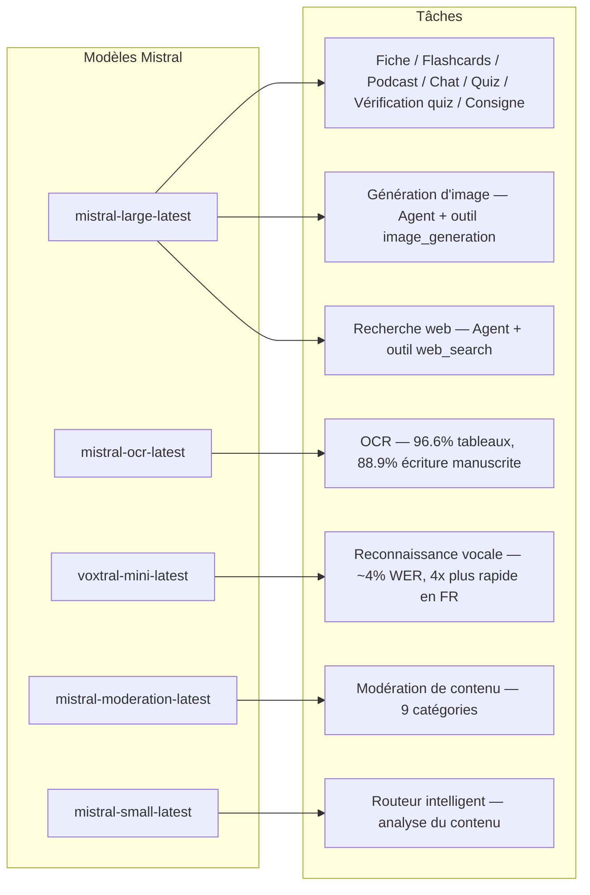
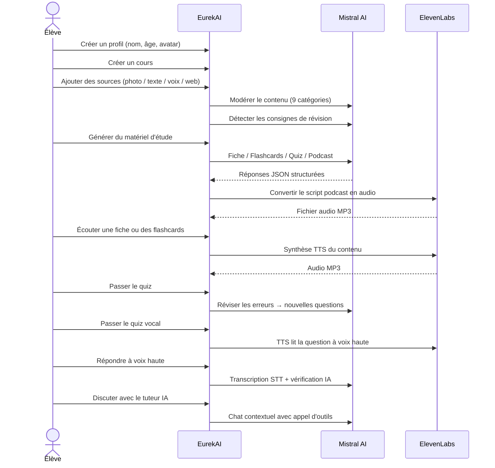

<p align="center">
  
</p>

<h1 align="center">EurekAI</h1>

<p align="center">
  <strong>Transforme qualquer conteúdo em uma experiência de aprendizagem interativa — com IA.</strong>
</p>

<p align="center">
  <a href="https://mistral.ai"></a>
  <a href="https://www.typescriptlang.org"></a>
  <a href="https://mistral.ai"></a>
  <a href="https://elevenlabs.io"></a>
</p>

<p align="center">
  <a href="https://www.youtube.com/watch?v=_b1TQz2leoI">▶️ Ver a demo no YouTube</a> · <a href="README-en.md">🇬🇧 Ler em inglês</a>
</p>

---

## A história — Por que EurekAI?

**EurekAI** nasceu durante o [Mistral AI Worldwide Hackathon](https://worldwidehackathon.mistral.ai/) (março de 2026). Eu precisava de um tema — e a ideia surgiu de algo muito concreto: preparo regularmente provas com minha filha, e pensei que deveria ser possível tornar isso mais lúdico e interativo com IA.

O objetivo: pegar **qualquer entrada** — uma foto do livro, um texto copiado e colado, uma gravação de voz, uma busca na web — e transformá-la em **resumos de revisão, flashcards, quizzes, podcasts, ilustrações e muito mais**. Tudo isso com os modelos franceses da Mistral AI, o que o torna uma solução naturalmente adequada para estudantes francófonos.

Cada linha de código foi escrita durante o hackathon. Todas as APIs e bibliotecas de código aberto são usadas em conformidade com as regras do hackathon.

---

## Funcionalidades

| | Funcionalidade | Descrição |
|---|---|---|
| 📷 | **Upload OCR** | Tire uma foto do seu livro ou das suas anotações — o Mistral OCR extrai o conteúdo |
| 📝 | **Entrada de texto** | Digite ou cole qualquer texto diretamente |
| 🎤 | **Entrada de voz** | Grave-se — Voxtral STT transcreve sua voz |
| 🌐 | **Busca na web** | Faça uma pergunta — um Agente Mistral busca as respostas na web |
| 📄 | **Resumos de revisão** | Notas estruturadas com pontos-chave, vocabulário, citações, anedotas |
| 🃏 | **Flashcards** | 5 cartões de perguntas e respostas com referências às fontes para memorização ativa |
| ❓ | **Quiz de múltipla escolha** | 10-20 perguntas de múltipla escolha com revisão adaptativa dos erros |
| 🎙️ | **Podcast** | Mini-podcast com 2 vozes (Alex & Zoé) convertido em áudio via ElevenLabs |
| 🖼️ | **Ilustrações** | Imagens educativas geradas por um Agente Mistral |
| 🗣️ | **Quiz por voz** | Perguntas lidas em voz alta, resposta oral, a IA verifica a resposta |
| 💬 | **Tutor IA** | Chat contextual com seus documentos de aula, com chamada de ferramentas |
| 🧠 | **Roteador inteligente** | A IA analisa seu conteúdo e recomenda os melhores geradores |
| 🔒 | **Controle parental** | Moderação por idade, PIN parental, restrições de chat |
| 🌍 | **Multilíngue** | Interface e conteúdo de IA completos em francês e inglês |
| 🔊 | **Leitura em voz alta** | Ouça os resumos e flashcards lidos em voz alta via ElevenLabs TTS |

---

## Visão geral da arquitetura



---

## Mapa de uso dos modelos



---

## Jornada do usuário



---

## Em profundidade — Funcionalidades

### Entrada multimodal

EurekAI aceita 4 tipos de fontes, todas moderadas antes do processamento:

- **Upload OCR** — Arquivos JPG, PNG ou PDF processados por `mistral-ocr-latest`. Lida com texto impresso, tabelas (96.6% de precisão) e escrita à mão (88.9% de precisão).
- **Texto livre** — Digite ou cole qualquer conteúdo. Passa pela moderação antes do armazenamento.
- **Entrada de voz** — Grave áudio no navegador. Transcrito por `voxtral-mini-latest` com ~4% WER. O parâmetro `language="fr"` o torna 4x mais rápido.
- **Busca na web** — Insira uma consulta. Um Agente Mistral temporário com a ferramenta `web_search` recupera e resume os resultados.

### Geração de conteúdo por IA

Seis tipos de material de aprendizagem gerados:

| Gerador | Modelo | Saída |
|---|---|---|
| **Resumo de revisão** | `mistral-large-latest` | Título, resumo, 10-25 pontos-chave, vocabulário, citações, anedota |
| **Flashcards** | `mistral-large-latest` | 5 cartões de perguntas e respostas com referências às fontes |
| **Quiz de múltipla escolha** | `mistral-large-latest` | 10-20 perguntas, 4 opções cada, explicações, revisão adaptativa |
| **Podcast** | `mistral-large-latest` + ElevenLabs | Roteiro em 2 vozes (Alex & Zoé) → áudio MP3 |
| **Ilustração** | Agente `mistral-large-latest` | Imagem educativa via a ferramenta `image_generation` |
| **Quiz por voz** | `mistral-large-latest` + ElevenLabs + Voxtral | Perguntas TTS → resposta STT → verificação por IA |

### Tutor IA via chat

Um tutor conversacional com acesso completo aos documentos de aula:

- Usa `mistral-large-latest` (janela de contexto de 128K tokens)
- **Chamada de ferramentas**: pode gerar resumos, flashcards ou quizzes online durante a conversa
- Histórico de 50 mensagens por curso
- Moderação de conteúdo para perfis conforme a idade

### Roteador automático inteligente

O roteador usa `mistral-small-latest` para analisar o conteúdo das fontes e recomendar quais geradores são mais relevantes — para que os alunos não precisem escolher manualmente.

### Aprendizagem adaptativa

- **Estatísticas de quiz**: acompanhamento das tentativas e da precisão por pergunta
- **Revisão de quiz**: gera 5-10 novas perguntas focadas nos conceitos fracos
- **Detecção de instruções**: detecta instruções de revisão ("Eu sei minha lição se eu sei...") e as prioriza em todos os geradores

### Segurança e controle parental

- **4 faixas etárias**: criança (6-10), adolescente (11-15), estudante (16+), adulto
- **Moderação de conteúdo**: 9 categorias via `mistral-moderation-latest`, limites adaptados por faixa etária
- **PIN parental**: hash SHA-256, exigido para perfis com menos de 15 anos
- **Restrições de chat**: chat de IA disponível apenas para perfis de 15 anos ou mais

### Sistema de múltiplos perfis

- Perfis múltiplos com nome, idade, avatar, preferências de idioma
- Projetos vinculados aos perfis via `profileId`
- Exclusão em cascata: excluir um perfil apaga todos os seus projetos

### Internacionalização

- Interface completa disponível em francês e inglês
- Prompts de IA suportam 2 idiomas hoje (FR, EN) com arquitetura pronta para 15 (es, de, it, pt, nl, ja, zh, ko, ar, hi, pl, ro, sv)
- Idioma configurável por perfil

---

## Stack técnica

| Camada | Tecnologia | Papel |
|---|---|---|
| **Runtime** | Node.js + TypeScript 5.7 | Servidor e segurança de tipos |
| **Backend** | Express 4.21 | API REST |
| **Servidor de desenvolvimento** | Vite 7.3 + tsx | HMR, partials Handlebars, proxy |
| **Frontend** | HTML + TailwindCSS 4.2 + Alpine.js 3.15 | Interface reativa, TypeScript compilado pelo Vite |
| **Template** | vite-plugin-handlebars | Composição HTML por partials |
| **IA** | Mistral AI SDK 1.14 | Chat, OCR, STT, Agents, Moderação |
| **TTS** | ElevenLabs SDK 2.36 | Síntese de voz para podcasts e quizzes por voz |
| **Ícones** | Lucide 0.575 | Biblioteca de ícones SVG |
| **Markdown** | Marked 17 | Renderização de markdown no chat |
| **Upload de arquivos** | Multer 1.4 | Gerenciamento de formulários multipart |
| **Áudio** | ffmpeg-static | Processamento de áudio |
| **Testes** | Vitest 4 | Testes unitários |
| **Persistência** | Arquivos JSON | Armazenamento sem dependência |

---

## Referência dos modelos

| Modelo | Uso | Por quê |
|---|---|---|
| `mistral-large-latest` | Resumo, Flashcards, Podcast, Quiz de múltipla escolha, Chat, Verificação do quiz, Agente de imagem, Agente de busca na web, Detecção de instruções | Melhor multilíngue + seguimento de instruções |
| `mistral-ocr-latest` | OCR de documentos | 96.6% de precisão em tabelas, 88.9% em escrita à mão |
| `voxtral-mini-latest` | Reconhecimento de voz | ~4% WER, `language="fr"` fornece 4x+ de velocidade |
| `mistral-moderation-latest` | Moderação de conteúdo | 9 categorias, segurança infantil |
| `mistral-small-latest` | Roteador inteligente | Análise rápida do conteúdo para decisões de roteamento |
| `eleven_v3` (ElevenLabs) | Síntese de voz | Vozes naturais em francês para podcasts e quizzes por voz |

---

## Início rápido

```bash
# Cloner le dépôt
git clone https://github.com/your-username/eurekai.git
cd eurekai

# Installer les dépendances
npm install

# Configurer les clés API
cp .env.example .env
# Éditez .env avec vos clés :
#   MISTRAL_API_KEY=votre_clé_ici
#   ELEVENLABS_API_KEY=votre_clé_ici  (optionnel, pour les fonctions audio)

# Lancer le développement
npm run dev
# → Backend :  http://localhost:3000 (API)
# → Frontend : http://localhost:5173 (serveur Vite avec HMR)
```

> **Nota**: ElevenLabs é opcional. Sem essa chave, as funções de podcast e quiz por voz gerarão os roteiros, mas não sintetizarão o áudio.

---

## Estrutura do projeto

```
server.ts                 — Point d'entrée Express, monte les routes + config
config.ts                 — Config runtime (modèles, voix, TTS), persistée dans output/config.json
store.ts                  — ProjectStore : CRUD projets/sources/générations, persistance JSON
profiles.ts               — ProfileStore : gestion des profils, hachage PIN
types.ts                  — Types TypeScript : Source, Generation (6 types), QuizStats, Profile
prompts.ts                — Tous les prompts IA centralisés (system + user templates, FR/EN)

generators/
  ocr.ts                  — Upload + OCR via Mistral (JPG, PNG, PDF)
  summary.ts              — Génération de fiche de révision (JSON structuré)
  flashcards.ts           — 5 flashcards Q/R
  quiz.ts                 — Quiz QCM (10-20 questions) + révision adaptative
  podcast.ts              — Script podcast 2 voix (Alex + Zoé)
  quiz-vocal.ts           — Quiz vocal : questions TTS + réponses STT + vérification IA
  image.ts                — Génération d'image via Agent Mistral (outil image_generation)
  chat.ts                 — Tuteur IA par chat avec appel d'outils
  router.ts               — Routeur automatique intelligent (contenu → générateurs recommandés)
  consigne.ts             — Détection de consignes de révision
  tts.ts                  — ElevenLabs TTS (eleven_v3, concaténation de segments)
  stt.ts                  — Voxtral STT (audio → texte)
  websearch.ts            — Agent Mistral avec outil web_search
  moderation.ts           — Modération de contenu (9 catégories)

routes/
  projects.ts             — CRUD projets
  sources.ts              — Upload OCR, texte libre, voix STT, recherche web, modération
  generate.ts             — Endpoints de génération (fiche/flashcards/quiz/podcast/image/vocal)
  generations.ts          — Tentatives de quiz, réponses vocales, lecture à voix haute, renommage, suppression
  chat.ts                 — Chat IA avec appel d'outils
  profiles.ts             — CRUD profils avec gestion du PIN

helpers/
  index.ts                — safeParseJson, unwrapJsonArray, extractAllText, timer
  audio.ts                — collectStream (ReadableStream → Buffer)

src/                      — Frontend (Vite + Handlebars)
  index.html              — Point d'entrée HTML principal
  main.ts                 — Entrée frontend (init Alpine.js + icônes Lucide)
  app/                    — Modules applicatifs Alpine.js
    state.ts              — Gestion d'état réactif
    navigation.ts         — Routage des vues + gardes par âge
    profiles.ts           — Logique du sélecteur de profils
    projects.ts           — CRUD des cours
    sources.ts            — Gestionnaires d'upload de sources
    generate.ts           — Déclencheurs de génération
    generations.ts        — Affichage + actions sur les générations
    chat.ts               — Interface de chat
    render.ts             — Helpers de rendu HTML
    i18n.ts               — Changement de langue
    ...
  components/
    quiz.ts               — Composant quiz interactif
    quiz-vocal.ts         — Composant quiz vocal
  i18n/
    fr.ts                 — Traductions françaises
    en.ts                 — Traductions anglaises
    index.ts              — Chargeur i18n
  partials/               — Partials HTML Handlebars (header, sidebar, dialogues, vues)
  styles/
    main.css              — Entrée TailwindCSS
    theme.css             — Variables de thème personnalisées

public/assets/            — Ressources statiques (logo, avatars)
output/                   — Données d'exécution (projets, config, fichiers audio)
```

---

## Referência da API

### Config
| Método | Endpoint | Descrição |
|---|---|---|
| `GET` | `/api/config` | Configuração atual |
| `PUT` | `/api/config` | Alterar a configuração (modelos, voz, TTS) |
| `GET` | `/api/config/status` | Status das APIs (Mistral, ElevenLabs) |

### Perfis
| Método | Endpoint | Descrição |
|---|---|---|
| `GET` | `/api/profiles` | Listar todos os perfis |
| `POST` | `/api/profiles` | Criar um perfil |
| `PUT` | `/api/profiles/:id` | Alterar um perfil (PIN exigido para < 15 anos) |
| `DELETE` | `/api/profiles/:id` | Excluir um perfil + cascata de projetos |

### Projetos
| Método | Endpoint | Descrição |
|---|---|---|
| `GET` | `/api/projects` | Listar os projetos |
| `POST` | `/api/projects` | Criar um projeto `{name, profileId}` |
| `GET` | `/api/projects/:pid` | Detalhes do projeto |
| `PUT` | `/api/projects/:pid` | Renomear `{name}` |
| `DELETE` | `/api/projects/:pid` | Excluir o projeto |

### Fontes
| Método | Endpoint | Descrição |
|---|---|---|
| `POST` | `/api/projects/:pid/sources/upload` | Upload OCR (arquivos multipart) |
| `POST` | `/api/projects/:pid/sources/text` | Texto livre `{text}` |
| `POST` | `/api/projects/:pid/sources/voice` | Voz STT (áudio multipart) |
| `POST` | `/api/projects/:pid/sources/websearch` | Busca na web `{query}` |
| `DELETE` | `/api/projects/:pid/sources/:sid` | Excluir uma fonte |
| `POST` | `/api/projects/:pid/moderate` | Moderar `{text}` |
| `POST` | `/api/projects/:pid/detect-consigne` | Detectar instruções de revisão |

### Geração
| Método | Endpoint | Descrição |
|---|---|---|
| `POST` | `/api/projects/:pid/generate/summary` | Resumo de revisão `{sourceIds?}` |
| `POST` | `/api/projects/:pid/generate/flashcards` | Flashcards `{sourceIds?}` |
| `POST` | `/api/projects/:pid/generate/quiz` | Quiz de múltipla escolha `{sourceIds?}` |
| `POST` | `/api/projects/:pid/generate/podcast` | Podcast `{sourceIds?}` |
| `POST` | `/api/projects/:pid/generate/image` | Ilustração `{sourceIds?}` |
| `POST` | `/api/projects/:pid/generate/quiz-vocal` | Quiz por voz `{sourceIds?}` |
| `POST` | `/api/projects/:pid/generate/quiz-review` | Revisão adaptativa `{generationId, weakQuestions}` |
| `POST` | `/api/projects/:pid/generate/auto` | Geração automática pelo roteador |

### CRUD de Gerações
| Método | Endpoint | Descrição |
|---|---|---|
| `POST` | `/api/projects/:pid/generations/:gid/quiz-attempt` | Enviar as respostas `{answers}` |
| `POST` | `/api/projects/:pid/generations/:gid/vocal-answer` | Verificar uma resposta oral (áudio multipart + questionIndex) |
| `POST` | `/api/projects/:pid/generations/:gid/read-aloud` | Leitura em voz alta via TTS (resumos/flashcards) |
| `PUT` | `/api/projects/:pid/generations/:gid` | Renomear `{title}` |
| `DELETE` | `/api/projects/:pid/generations/:gid` | Excluir a geração |

### Chat
| Método | Endpoint | Descrição |
|---|---|---|
| `GET` | `/api/projects/:pid/chat` | Recuperar o histórico do chat |
| `POST` | `/api/projects/:pid/chat` | Enviar uma mensagem `{message}` |
| `DELETE` | `/api/projects/:pid/chat` | Limpar o histórico do chat |

---

## Decisões arquitetônicas

| Decisão | Justificativa |
|---|---|
| **Alpine.js em vez de React/Vue** | Pegada mínima, reatividade leve com TypeScript compilado pelo Vite. Perfeito para um hackathon em que a velocidade conta. |
| **Persistência em arquivos JSON** | Zero dependências, inicialização instantânea. Nenhum banco de dados para configurar — é só iniciar e pronto. |
| **Vite + Handlebars** | O melhor dos dois mundos: HMR rápido para desenvolvimento, partials HTML para organização do código, Tailwind JIT. |
| **Prompts centralizados** | Todos os prompts de IA em `prompts.ts` — fácil iterar, testar e adaptar por idioma/faixa etária. |
| **Sistema de múltiplas gerações** | Cada geração é um objeto independente com seu próprio ID — permite vários resumos, quizzes etc. por curso. |
| **Prompts adaptados por idade** | 4 faixas etárias com vocabulário, complexidade e tom diferentes — o mesmo conteúdo ensina de forma diferente conforme o aluno. |
| **Funcionalidades baseadas em Agents** | A geração de imagens e a busca na web usam Agentes Mistral temporários — ciclo de vida limpo com limpeza automática. |

---

## Créditos e agradecimentos

- **[Mistral AI](https://mistral.ai)** — Modelos de IA (Large, OCR, Voxtral, Moderation, Small) + Worldwide Hackathon
- **[ElevenLabs](https://elevenlabs.io)** — Motor de síntese de voz (`eleven_v3`)
- **[Alpine.js](https://alpinejs.dev)** — Framework reativo leve
- **[TailwindCSS](https://tailwindcss.com)** — Framework CSS utilitário
- **[Vite](https://vitejs.dev)** — Ferramenta de build frontend
- **[Lucide](https://lucide.dev)** — Biblioteca de ícones
- **[Marked](https://marked.js.org)** — Parser Markdown

Construído com cuidado durante o Mistral AI Worldwide Hackathon, março de 2026.

---

## Autor

**Julien LS** — [contact@jls42.org](mailto:contact@jls42.org)

## Licença

[AGPL-3.0](LICENSE) — Copyright (C) 2026 Julien LS

**Este documento foi traduzido da versão fr para o idioma pt usando o modelo gpt-5.4-mini. Para mais informações sobre o processo de tradução, consulte https://gitlab.com/jls42/ai-powered-markdown-translator**

