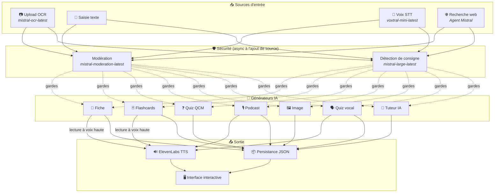
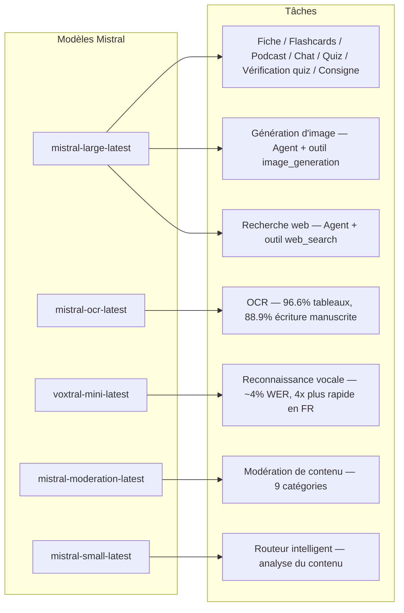
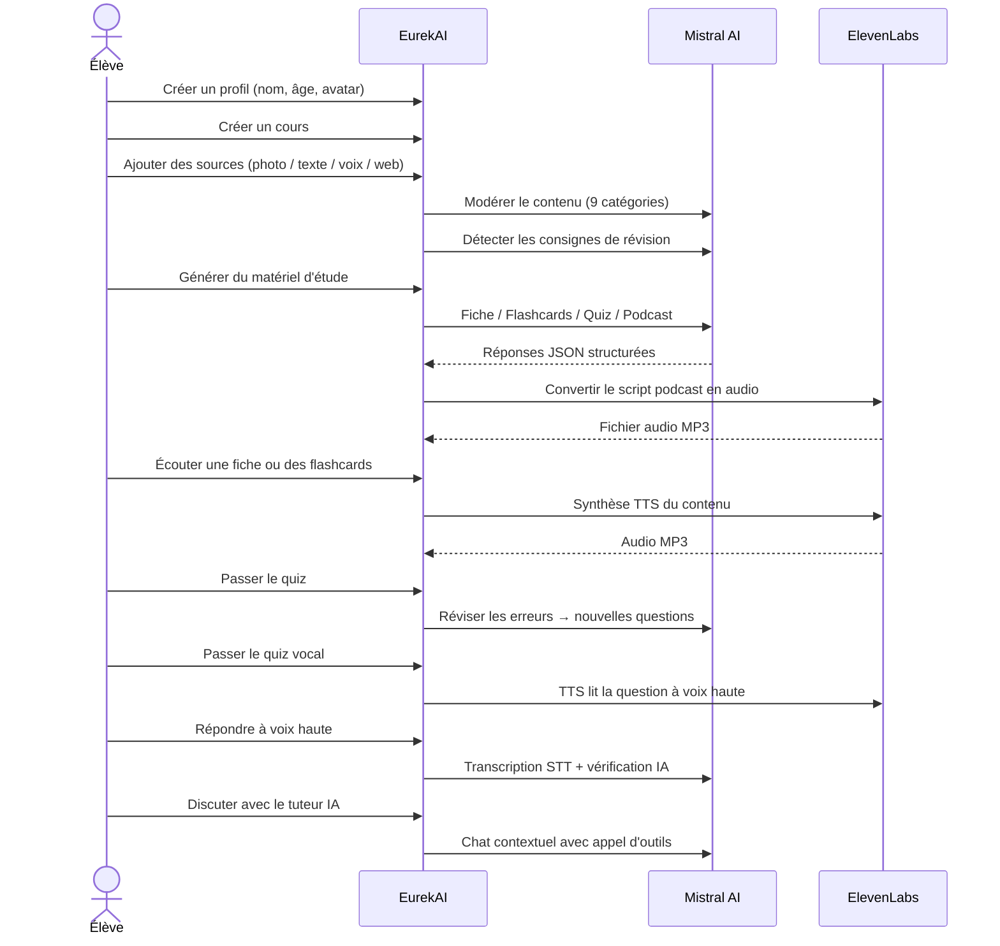

<p align="center">
  
</p>

<h1 align="center">EurekAI</h1>

<p align="center">
  <strong>Transformă orice conținut într-o experiență de învățare interactivă — alimentată de IA.</strong>
</p>

<p align="center">
  <a href="https://mistral.ai"></a>
  <a href="https://www.typescriptlang.org"></a>
  <a href="https://mistral.ai"></a>
  <a href="https://elevenlabs.io"></a>
</p>

<p align="center">
  <a href="https://www.youtube.com/watch?v=_b1TQz2leoI">▶️ Vezi demonstrația pe YouTube</a> · <a href="README-en.md">🇬🇧 Citește în engleză</a>
</p>

---

## Povestea — De ce EurekAI?

**EurekAI** s-a născut în timpul [Mistral AI Worldwide Hackathon](https://worldwidehackathon.mistral.ai/) (martie 2026). Aveam nevoie de un subiect — iar ideea a venit din ceva foarte concret: mă pregătesc regulat pentru teste împreună cu fiica mea și mi-am spus că ar trebui să fie posibil să fac asta mai distractiv și mai interactiv cu ajutorul IA.

Obiectivul: să iau **orice intrare** — o fotografie a manualului, un text copiat și lipit, o înregistrare vocală, o căutare web — și să o transform în **fișe de recapitulare, flashcards, quizuri, podcasturi, ilustrații și multe altele**. Totul alimentat de modelele franceze Mistral AI, ceea ce îl face o soluție potrivită în mod natural pentru elevii francofoni.

Fiecare linie de cod a fost scrisă în timpul hackathonului. Toate API-urile și bibliotecile open-source sunt folosite în conformitate cu regulile hackathonului.

---

## Funcționalități

| | Funcționalitate | Descriere |
|---|---|---|
| 📷 | **Încărcare OCR** | Fotografiază manualul sau notițele — Mistral OCR extrage conținutul |
| 📝 | **Introducere text** | Tastează sau lipește orice text direct |
| 🎤 | **Intrare vocală** | Înregistrează-te — Voxtral STT transcrie vocea ta |
| 🌐 | **Căutare web** | Pune o întrebare — un Agent Mistral caută răspunsurile pe web |
| 📄 | **Fișe de recapitulare** | Note structurate cu idei-cheie, vocabular, citate, anecdote |
| 🃏 | **Flashcards** | 5 cartonașe întrebare/răspuns cu referințe la surse pentru memorare activă |
| ❓ | **Quiz QCM** | 10-20 de întrebări cu răspunsuri multiple și recapitulare adaptivă a greșelilor |
| 🎙️ | **Podcast** | Mini-podcast în 2 voci (Alex & Zoé) convertit în audio prin ElevenLabs |
| 🖼️ | **Ilustrații** | Imagini educaționale generate de un Agent Mistral |
| 🗣️ | **Quiz vocal** | Întrebări citite cu voce tare, răspuns oral, IA verifică răspunsul |
| 💬 | **Tutor IA** | Chat contextual cu documentele tale de curs, cu apel de instrumente |
| 🧠 | **Router inteligent** | IA analizează conținutul tău și recomandă cei mai buni generatori |
| 🔒 | **Control parental** | Moderare în funcție de vârstă, PIN parental, restricții ale chatului |
| 🌍 | **Multilingv** | Interfață completă și conținut IA în franceză și engleză |
| 🔊 | **Citire cu voce tare** | Ascultă fișele și flashcards citite cu voce tare prin ElevenLabs TTS |

---

## Vedere de ansamblu asupra arhitecturii



---

## Harta de utilizare a modelelor



---

## Parcursul utilizatorului



---

## Analiză în profunzime — Funcționalități

### Intrare multi-modală

EurekAI acceptă 4 tipuri de surse, toate moderate înainte de procesare:

- **Încărcare OCR** — Fișiere JPG, PNG sau PDF procesate de `mistral-ocr-latest`. Gestionează textul imprimat, tabelele (96.6% precizie) și scrisul de mână (88.9% precizie).
- **Text liber** — Tastează sau lipește orice conținut. Trecerea prin moderare înainte de stocare.
- **Intrare vocală** — Înregistrează audio în browser. Transcris de `voxtral-mini-latest` cu ~4% WER. Parametrul `language="fr"` îl face de 4 ori mai rapid.
- **Căutare web** — Introdu o interogare. Un Agent Mistral temporar cu instrumentul `web_search` preia și rezumă rezultatele.

### Generare de conținut IA

Șase tipuri de materiale de învățare generate:

| Generator | Model | Rezultat |
|---|---|---|
| **Fișă de recapitulare** | `mistral-large-latest` | Titlu, rezumat, 10-25 puncte cheie, vocabular, citate, anecdotă |
| **Flashcards** | `mistral-large-latest` | 5 cartonașe Q/R cu referințe la surse |
| **Quiz QCM** | `mistral-large-latest` | 10-20 întrebări, câte 4 opțiuni, explicații, recapitulare adaptivă |
| **Podcast** | `mistral-large-latest` + ElevenLabs | Scenariu în 2 voci (Alex & Zoé) → audio MP3 |
| **Ilustrație** | Agent `mistral-large-latest` | Imagine educațională prin instrumentul `image_generation` |
| **Quiz vocal** | `mistral-large-latest` + ElevenLabs + Voxtral | Întrebări TTS → răspuns STT → verificare IA |

### Tutor IA prin chat

Un tutor conversațional cu acces complet la documentele de curs:

- Folosește `mistral-large-latest` (fereastră de context de 128K tokenuri)
- **Apel de instrumente**: poate genera în timpul conversației fișe, flashcards sau quizuri online
- Istoric de 50 de mesaje per curs
- Moderarea conținutului pentru profiluri în funcție de vârstă

### Router automat inteligent

Routerul folosește `mistral-small-latest` pentru a analiza conținutul surselor și a recomanda care generatori sunt cei mai relevanți — astfel încât elevii să nu fie nevoiți să aleagă manual.

### Învățare adaptivă

- **Statistici ale quizului**: urmărirea încercărilor și a preciziei pe întrebare
- **Recapitulare quiz**: generează 5-10 întrebări noi care vizează conceptele slabe
- **Detectarea instrucțiunilor**: detectează instrucțiuni de recapitulare („Știu lecția mea dacă știu...”) și le prioritizează în toți generatorii

### Securitate și control parental

- **4 grupuri de vârstă**: copil (6-10), adolescent (11-15), student (16+), adult
- **Moderarea conținutului**: 9 categorii prin `mistral-moderation-latest`, praguri adaptate pe grupe de vârstă
- **PIN parental**: hash SHA-256, necesar pentru profilurile sub 15 ani
- **Restricții ale chatului**: chatul IA disponibil doar pentru profilurile de 15 ani și peste

### Sistem multi-profil

- Mai multe profiluri cu nume, vârstă, avatar, preferințe de limbă
- Proiecte asociate profilurilor prin `profileId`
- Ștergere în cascadă: ștergerea unui profil elimină toate proiectele sale

### Internaționalizare

- Interfață completă disponibilă în franceză și engleză
- Prompturile IA suportă astăzi 2 limbi (FR, EN), cu arhitectură pregătită pentru 15 (es, de, it, pt, nl, ja, zh, ko, ar, hi, pl, ro, sv)
- Limba configurabilă per profil

---

## Stack tehnic

| Strat | Tehnologie | Rol |
|---|---|---|
| **Runtime** | Node.js + TypeScript 5.7 | Server și siguranța tipurilor |
| **Backend** | Express 4.21 | API REST |
| **Server de dezvoltare** | Vite 7.3 + tsx | HMR, partials Handlebars, proxy |
| **Frontend** | HTML + TailwindCSS 4.2 + Alpine.js 3.15 | Interfață reactivă, TypeScript compilat de Vite |
| **Templating** | vite-plugin-handlebars | Compunere HTML prin partials |
| **IA** | Mistral AI SDK 1.14 | Chat, OCR, STT, Agenți, Moderare |
| **TTS** | ElevenLabs SDK 2.36 | Sinteză vocală pentru podcasturi și quizuri vocale |
| **Iconițe** | Lucide 0.575 | Bibliotecă de iconițe SVG |
| **Markdown** | Marked 17 | Randare markdown în chat |
| **Încărcare fișiere** | Multer 1.4 | Gestionarea formularelor multipart |
| **Audio** | ffmpeg-static | Procesare audio |
| **Teste** | Vitest 4 | Teste unitare |
| **Persistență** | Fișiere JSON | Stocare fără dependențe |

---

## Referință modele

| Model | Utilizare | De ce |
|---|---|---|
| `mistral-large-latest` | Fișă, Flashcards, Podcast, Quiz QCM, Chat, Verificare quiz, Agent Imagine, Agent Căutare web, Detectare instrucțiuni | Cel mai bun pentru multilingual + urmărirea instrucțiunilor |
| `mistral-ocr-latest` | OCR pentru documente | 96.6% precizie la tabele, 88.9% la scris de mână |
| `voxtral-mini-latest` | Recunoaștere vocală | ~4% WER, `language="fr"` oferă viteză de 4x+ |
| `mistral-moderation-latest` | Moderarea conținutului | 9 categorii, siguranță pentru copii |
| `mistral-small-latest` | Router inteligent | Analiză rapidă a conținutului pentru decizii de rutare |
| `eleven_v3` (ElevenLabs) | Sinteză vocală | Voci naturale în franceză pentru podcasturi și quizuri vocale |

---

## Pornire rapidă

```bash
# Cloner le dépôt
git clone https://github.com/your-username/eurekai.git
cd eurekai

# Installer les dépendances
npm install

# Configurer les clés API
cp .env.example .env
# Éditez .env avec vos clés :
#   MISTRAL_API_KEY=votre_clé_ici
#   ELEVENLABS_API_KEY=votre_clé_ici  (optionnel, pour les fonctions audio)

# Lancer le développement
npm run dev
# → Backend :  http://localhost:3000 (API)
# → Frontend : http://localhost:5173 (serveur Vite avec HMR)
```

> **Notă**: ElevenLabs este opțional. Fără această cheie, funcțiile de podcast și quiz vocal vor genera scenariile, dar nu vor sintetiza audio.

---

## Structura proiectului

```
server.ts                 — Point d'entrée Express, monte les routes + config
config.ts                 — Config runtime (modèles, voix, TTS), persistée dans output/config.json
store.ts                  — ProjectStore : CRUD projets/sources/générations, persistance JSON
profiles.ts               — ProfileStore : gestion des profils, hachage PIN
types.ts                  — Types TypeScript : Source, Generation (6 types), QuizStats, Profile
prompts.ts                — Tous les prompts IA centralisés (system + user templates, FR/EN)

generators/
  ocr.ts                  — Upload + OCR via Mistral (JPG, PNG, PDF)
  summary.ts              — Génération de fiche de révision (JSON structuré)
  flashcards.ts           — 5 flashcards Q/R
  quiz.ts                 — Quiz QCM (10-20 questions) + révision adaptative
  podcast.ts              — Script podcast 2 voix (Alex + Zoé)
  quiz-vocal.ts           — Quiz vocal : questions TTS + réponses STT + vérification IA
  image.ts                — Génération d'image via Agent Mistral (outil image_generation)
  chat.ts                 — Tuteur IA par chat avec appel d'outils
  router.ts               — Routeur automatique intelligent (contenu → générateurs recommandés)
  consigne.ts             — Détection de consignes de révision
  tts.ts                  — ElevenLabs TTS (eleven_v3, concaténation de segments)
  stt.ts                  — Voxtral STT (audio → texte)
  websearch.ts            — Agent Mistral avec outil web_search
  moderation.ts           — Modération de contenu (9 catégories)

routes/
  projects.ts             — CRUD projets
  sources.ts              — Upload OCR, texte libre, voix STT, recherche web, modération
  generate.ts             — Endpoints de génération (fiche/flashcards/quiz/podcast/image/vocal)
  generations.ts          — Tentatives de quiz, réponses vocales, lecture à voix haute, renommage, suppression
  chat.ts                 — Chat IA avec appel d'outils
  profiles.ts             — CRUD profils avec gestion du PIN

helpers/
  index.ts                — safeParseJson, unwrapJsonArray, extractAllText, timer
  audio.ts                — collectStream (ReadableStream → Buffer)

src/                      — Frontend (Vite + Handlebars)
  index.html              — Point d'entrée HTML principal
  main.ts                 — Entrée frontend (init Alpine.js + icônes Lucide)
  app/                    — Modules applicatifs Alpine.js
    state.ts              — Gestion d'état réactif
    navigation.ts         — Routage des vues + gardes par âge
    profiles.ts           — Logique du sélecteur de profils
    projects.ts           — CRUD des cours
    sources.ts            — Gestionnaires d'upload de sources
    generate.ts           — Déclencheurs de génération
    generations.ts        — Affichage + actions sur les générations
    chat.ts               — Interface de chat
    render.ts             — Helpers de rendu HTML
    i18n.ts               — Changement de langue
    ...
  components/
    quiz.ts               — Composant quiz interactif
    quiz-vocal.ts         — Composant quiz vocal
  i18n/
    fr.ts                 — Traductions françaises
    en.ts                 — Traductions anglaises
    index.ts              — Chargeur i18n
  partials/               — Partials HTML Handlebars (header, sidebar, dialogues, vues)
  styles/
    main.css              — Entrée TailwindCSS
    theme.css             — Variables de thème personnalisées

public/assets/            — Ressources statiques (logo, avatars)
output/                   — Données d'exécution (projets, config, fichiers audio)
```

---

## Referință API

### Config
| Metodă | Endpoint | Descriere |
|---|---|---|
| `GET` | `/api/config` | Configurația curentă |
| `PUT` | `/api/config` | Modifică configurația (modele, voci, TTS) |
| `GET` | `/api/config/status` | Starea API-urilor (Mistral, ElevenLabs) |

### Profiluri
| Metodă | Endpoint | Descriere |
|---|---|---|
| `GET` | `/api/profiles` | Listează toate profilurile |
| `POST` | `/api/profiles` | Creează un profil |
| `PUT` | `/api/profiles/:id` | Modifică un profil (PIN necesar pentru < 15 ani) |
| `DELETE` | `/api/profiles/:id` | Șterge un profil + cascadă proiecte |

### Proiecte
| Metodă | Endpoint | Descriere |
|---|---|---|
| `GET` | `/api/projects` | Listează proiectele |
| `POST` | `/api/projects` | Creează un proiect `{name, profileId}` |
| `GET` | `/api/projects/:pid` | Detalii despre proiect |
| `PUT` | `/api/projects/:pid` | Redenumește `{name}` |
| `DELETE` | `/api/projects/:pid` | Șterge proiectul |

### Surse
| Metodă | Endpoint | Descriere |
|---|---|---|
| `POST` | `/api/projects/:pid/sources/upload` | Încărcare OCR (fișiere multipart) |
| `POST` | `/api/projects/:pid/sources/text` | Text liber `{text}` |
| `POST` | `/api/projects/:pid/sources/voice` | Voce STT (audio multipart) |
| `POST` | `/api/projects/:pid/sources/websearch` | Căutare web `{query}` |
| `DELETE` | `/api/projects/:pid/sources/:sid` | Șterge o sursă |
| `POST` | `/api/projects/:pid/moderate` | Moderează `{text}` |
| `POST` | `/api/projects/:pid/detect-consigne` | Detectează instrucțiunile de recapitulare |

### Generare
| Metodă | Endpoint | Descriere |
|---|---|---|
| `POST` | `/api/projects/:pid/generate/summary` | Fișă de recapitulare `{sourceIds?}` |
| `POST` | `/api/projects/:pid/generate/flashcards` | Flashcards `{sourceIds?}` |
| `POST` | `/api/projects/:pid/generate/quiz` | Quiz QCM `{sourceIds?}` |
| `POST` | `/api/projects/:pid/generate/podcast` | Podcast `{sourceIds?}` |
| `POST` | `/api/projects/:pid/generate/image` | Ilustrație `{sourceIds?}` |
| `POST` | `/api/projects/:pid/generate/quiz-vocal` | Quiz vocal `{sourceIds?}` |
| `POST` | `/api/projects/:pid/generate/quiz-review` | Recapitulare adaptivă `{generationId, weakQuestions}` |
| `POST` | `/api/projects/:pid/generate/auto` | Generare automată prin router |

### CRUD Generări
| Metodă | Endpoint | Descriere |
|---|---|---|
| `POST` | `/api/projects/:pid/generations/:gid/quiz-attempt` | Trimite răspunsurile `{answers}` |
| `POST` | `/api/projects/:pid/generations/:gid/vocal-answer` | Verifică un răspuns oral (audio multipart + questionIndex) |
| `POST` | `/api/projects/:pid/generations/:gid/read-aloud` | Citire TTS cu voce tare (fișe/flashcards) |
| `PUT` | `/api/projects/:pid/generations/:gid` | Redenumește `{title}` |
| `DELETE` | `/api/projects/:pid/generations/:gid` | Șterge generarea |

### Chat
| Metodă | Endpoint | Descriere |
|---|---|---|
| `GET` | `/api/projects/:pid/chat` | Preia istoricul chatului |
| `POST` | `/api/projects/:pid/chat` | Trimite un mesaj `{message}` |
| `DELETE` | `/api/projects/:pid/chat` | Șterge istoricul chatului |

---

## Decizii arhitecturale

| Decizie | Justificare |
|---|---|
| **Alpine.js în loc de React/Vue** | Amprentă minimă, reactivitate ușoară cu TypeScript compilat de Vite. Perfect pentru un hackathon în care viteza contează. |
| **Persistență în fișiere JSON** | Zero dependențe, pornire instantanee. Fără bază de date de configurat — pornești și gata. |
| **Vite + Handlebars** | Ce e mai bun din ambele lumi: HMR rapid pentru dezvoltare, partials HTML pentru organizarea codului, Tailwind JIT. |
| **Prompturi centralizate** | Toate prompturile IA în `prompts.ts` — ușor de iterat, testat și adaptat după limbă/grupă de vârstă. |
| **Sistem multi-generații** | Fiecare generare este un obiect independent cu propriul ID — permite mai multe fișe, quizuri etc. per curs. |
| **Prompturi adaptate pe vârstă** | 4 grupe de vârstă cu vocabular, complexitate și ton diferite — același conținut predă diferit în funcție de elev. |
| **Funcționalități bazate pe Agenți** | Generarea imaginilor și căutarea web folosesc Agenți Mistral temporari — ciclu de viață curat, cu curățare automată. |

---

## Credite și mulțumiri

- **[Mistral AI](https://mistral.ai)** — Modele IA (Large, OCR, Voxtral, Moderation, Small) + Worldwide Hackathon
- **[ElevenLabs](https://elevenlabs.io)** — Motor de sinteză vocală (`eleven_v3`)
- **[Alpine.js](https://alpinejs.dev)** — Framework reactiv ușor
- **[TailwindCSS](https://tailwindcss.com)** — Framework CSS utilitar
- **[Vite](https://vitejs.dev)** — Instrument de build pentru frontend
- **[Lucide](https://lucide.dev)** — Bibliotecă de iconițe
- **[Marked](https://marked.js.org)** — Parser Markdown

Construit cu grijă în timpul Mistral AI Worldwide Hackathon, martie 2026.

---

## Autor

**Julien LS** — [contact@jls42.org](mailto:contact@jls42.org)

## Licență

[AGPL-3.0](LICENSE) — Copyright (C) 2026 Julien LS

**Acest document a fost tradus din versiunea fr în limba ro folosind modelul gpt-5.4-mini. Pentru mai multe informații despre procesul de traducere, consultați https://gitlab.com/jls42/ai-powered-markdown-translator**

