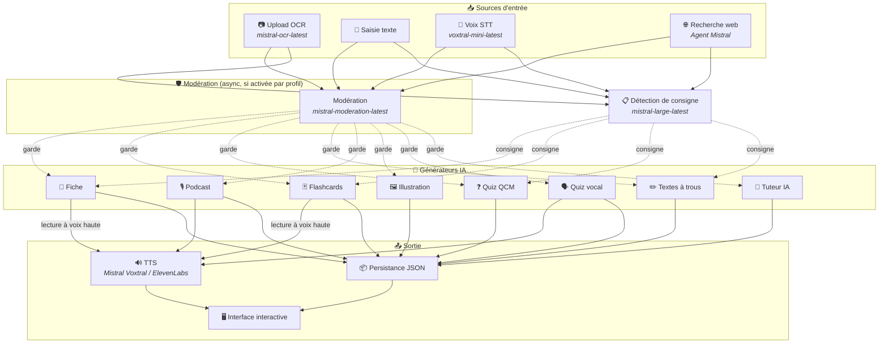
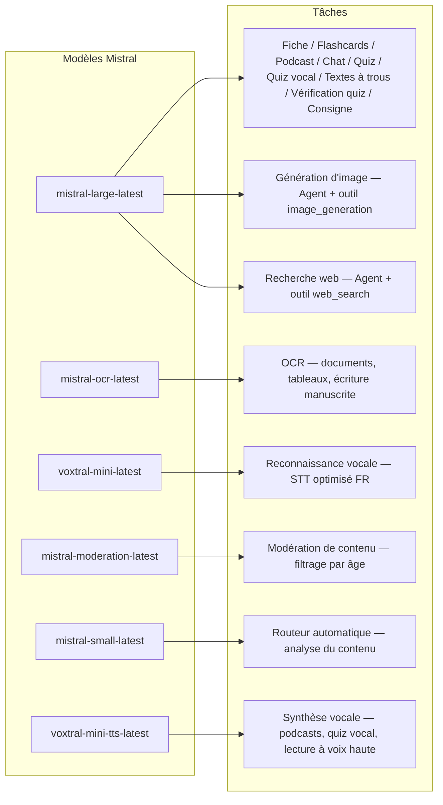
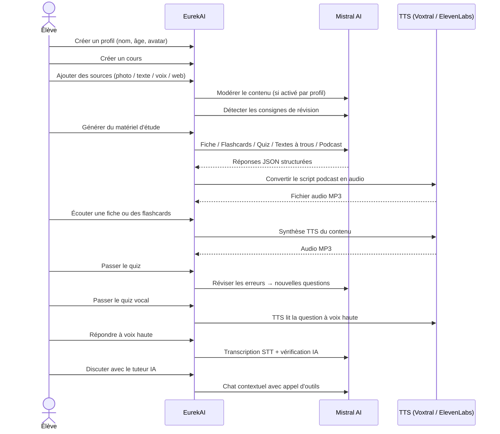

<p align="center">
  
</p>

<h1 align="center">EurekAI</h1>

<p align="center">
  <strong>Transformă orice conținut într-o experiență de învățare interactivă — propulsată de <a href="https://mistral.ai">Mistral AI</a>.</strong>
</p>

<p align="center">
  <a href="README-en.md">🇬🇧 Engleză</a> · <a href="README-es.md">🇪🇸 Spaniolă</a> · <a href="README-pt.md">🇧🇷 Portugheză</a> · <a href="README-de.md">🇩🇪 Germană</a> · <a href="README-it.md">🇮🇹 Italiană</a> · <a href="README-nl.md">🇳🇱 Olandeză</a> · <a href="README-ar.md">🇸🇦 Arabă</a><br>
  <a href="README-hi.md">🇮🇳 Hindi</a> · <a href="README-zh.md">🇨🇳 Chineză</a> · <a href="README-ja.md">🇯🇵 Japoneză</a> · <a href="README-ko.md">🇰🇷 Coreeană</a> · <a href="README-pl.md">🇵🇱 Poloneză</a> · <a href="README-ro.md">🇷🇴 Română</a> · <a href="README-sv.md">🇸🇪 Suedeză</a>
</p>

<p align="center">
  <a href="https://www.youtube.com/watch?v=_b1TQz2leoI"></a>
</p>

<h4 align="center">📊 Calitatea codului</h4>

<p align="center">
  <a href="https://sonarcloud.io/summary/new_code?id=jls42_EurekAI"></a>
  <a href="https://sonarcloud.io/summary/new_code?id=jls42_EurekAI"></a>
  <a href="https://sonarcloud.io/summary/new_code?id=jls42_EurekAI"></a>
  <a href="https://sonarcloud.io/summary/new_code?id=jls42_EurekAI"></a>
</p>
<p align="center">
  <a href="https://sonarcloud.io/summary/new_code?id=jls42_EurekAI"></a>
  <a href="https://sonarcloud.io/summary/new_code?id=jls42_EurekAI"></a>
  <a href="https://sonarcloud.io/summary/new_code?id=jls42_EurekAI"></a>
  <a href="https://sonarcloud.io/summary/new_code?id=jls42_EurekAI"></a>
</p>

---

## Povestea — De ce EurekAI ?

**EurekAI** s-a născut în timpul [Mistral AI Worldwide Hackathon](https://luma.com/mistralhack-online) ([site oficial](https://worldwide-hackathon.mistral.ai/)) (martie 2026). Aveam nevoie de un subiect — iar ideea a venit din ceva foarte concret: pregătesc frecvent testele cu fiica mea și mi-am spus că ar trebui să fie posibil să facem asta mai jucăuș și mai interactiv cu ajutorul IA.

Obiectivul: să preluăm **orice intrare** — o fotografie a manualului, un text copiat-lipitat, o înregistrare vocală, o căutare web — și să o transformăm în **fișe de revizuire, flashcards, quiz-uri, podcasturi, texte de completat, ilustrații și altele**. Totul alimentat de modelele franceze Mistral AI, ceea ce face soluția în mod natural potrivită pentru elevii francofoni.

Proiectul a fost inițiat în cadrul hackathonului, apoi reluat și îmbogățit ulterior. Întreg codul a fost generat de IA — în principal [Claude Code](https://docs.anthropic.com/en/docs/claude-code), cu câteva contribuții prin [Codex](https://openai.com/index/introducing-codex/).

---

## Funcționalități

| | Funcționalitate | Descriere |
|---|---|---|
| 📷 | **Upload OCR** | Fotografiați manualul sau notițele — Mistral OCR extrage conținutul |
| 📝 | **Introducere text** | Tastați sau lipiți orice text direct |
| 🎤 | **Intrare vocală** | Înregistrați-vă — Voxtral STT vă transcrie vocea |
| 🌐 | **Căutare web** | Puneți o întrebare — un Agent Mistral caută răspunsuri pe web |
| 📄 | **Fișe de revizuire** | Note structurate cu puncte cheie, vocabular, citate, anecdote |
| 🃏 | **Flashcards** | Carduri Q/R cu referințe către surse pentru memorare activă (număr configurabil) |
| ❓ | **Quiz QCM** | Întrebări cu alegere multiplă cu revizuire adaptivă a greșelilor (număr configurabil) |
| ✏️ | **Texte de completat** | Exerciții de completat cu indicii și validare tolerantă |
| 🎙️ | **Podcast** | Mini-podcast în 2 voci convertit în audio via Mistral Voxtral TTS |
| 🖼️ | **Ilustrații** | Imagini educaționale generate de un Agent Mistral |
| 🗣️ | **Quiz vocal** | Întrebări citite cu voce tare, răspuns oral, IA verifică răspunsul |
| 💬 | **Tutor IA** | Chat contextual cu documentele dvs. de curs, cu apel de unelte |
| 🧠 | **Rutator automat** | Un rutator bazat pe `mistral-small-latest` analizează conținutul și propune o combinație de generatoare dintre cele 7 disponibile |
| 🔒 | **Control parental** | Moderare pe vârstă, PIN parental, restricții în chat |
| 🌍 | **Multilingv** | Interfață disponibilă în 9 limbi; generarea IA controlabilă în 15 limbi prin prompts |
| 🔊 | **Citire cu voce tare** | Ascultați fișele și flashcards via Mistral Voxtral TTS sau ElevenLabs |

---

## Privire de ansamblu asupra arhitecturii



---

## Harta utilizării modelelor



---

## Parcursul utilizatorului



---

## Analiză detaliată — Funcționalități

### Intrare multimodală

EurekAI acceptă 4 tipuri de surse, moderate în funcție de profil (activat implicit pentru copil și adolescent):

- **Upload OCR** — Fișiere JPG, PNG sau PDF procesate de `mistral-ocr-latest`. Gestionează text tipărit, tabele și scris de mână.
- **Text liber** — Tastați sau lipiți orice conținut. Moderat înainte de stocare dacă moderarea este activată.
- **Intrare vocală** — Înregistrați audio în browser. Transcris de `voxtral-mini-latest`. Parametrul `language="fr"` optimizează recunoașterea.
- **Căutare web** — Introduceți o interogare. Un Agent Mistral temporar cu unealta `web_search` recuperează și rezumă rezultatele.

### Generare de conținut IA

Șapte tipuri de materiale de învățare generate:

| Generator | Model | Ieșire |
|---|---|---|
| **Fișă de revizuire** | `mistral-large-latest` | Titlu, rezumat, puncte cheie, vocabular, citate, anecdotă |
| **Flashcards** | `mistral-large-latest` | Carduri Q/R cu referințe către surse (număr configurabil) |
| **Quiz QCM** | `mistral-large-latest` | Întrebări cu alegere multiplă, explicații, revizuire adaptivă (număr configurabil) |
| **Texte de completat** | `mistral-large-latest` | Fraze de completat cu indicii, validare tolerantă (Levenshtein) |
| **Podcast** | `mistral-large-latest` + Voxtral TTS | Script în 2 voci → audio MP3 |
| **Ilustrație** | Agent `mistral-large-latest` | Imagine educațională via unealta `image_generation` |
| **Quiz vocal** | `mistral-large-latest` + Voxtral TTS + STT | Întrebări TTS → răspuns STT → verificare IA |

### Tutor IA prin chat

Un tutor conversațional cu acces complet la documentele de curs:

- Utilizează `mistral-large-latest`
- **Apel de unelte** : poate genera fișe, flashcards, quiz-uri sau texte de completat în timpul conversației
- Istoric de 50 de mesaje per curs
- Moderare a conținutului dacă este activată pentru profil

### Rutator automat

Rutatorul folosește `mistral-small-latest` pentru a analiza conținutul surselor și a propune generatoarele cele mai relevante dintre cele 7 disponibile. Interfața afișează progresul în timp real: mai întâi o fază de analiză, apoi generările individuale cu posibilitate de anulare.

### Învățare adaptivă

- **Statistici ale quiz-urilor** : urmărirea încercărilor și a acurateții pe întrebare
- **Revizuire de quiz** : generează 5-10 întrebări noi țintind conceptele slabe
- **Detecție de instrucțiune** : detectează instrucțiunile de revizuire ("Știu lecția dacă știu...") și le prioritizează în generatoarele textuale compatibile (fișă, flashcards, quiz, texte de completat)

### Securitate & control parental

- **4 grupe de vârstă** : copil (≤10 ani), adolescent (11-15), student (16-25), adult (26+)
- **Moderare a conținutului** : `mistral-moderation-latest` cu 5 categorii blocate pentru copil/adolescent (`sexual`, `hate_and_discrimination`, `violence_and_threats`, `selfharm`, `jailbreaking`), fără restricții pentru student/adult
- **PIN parental** : hash SHA-256, necesar pentru profilurile sub 15 ani. Pentru un mediu de producție, se recomandă un hash lent cu salt (Argon2id, bcrypt).
- **Restricții chat** : chat AI dezactivat implicit pentru minorii sub 16 ani, activabil de părinți

### Sistem multi-profiluri

- Profiluri multiple cu nume, vârstă, avatar, preferințe de limbă
- Proiecte legate de profiluri via `profileId`
- Ștergere în cascadă: ștergerea unui profil șterge toate proiectele sale

### TTS multi-furnizor

- **Mistral Voxtral TTS** (implicit) : `voxtral-mini-tts-latest`, fără cheie suplimentară necesară
- **ElevenLabs** (alternativ) : `eleven_v3`, voci naturale, necesită `ELEVENLABS_API_KEY`
- Furnizor configurabil în setările aplicației

### Internaționalizare

- Interfață disponibilă în 9 limbi : fr, en, es, pt, it, nl, de, hi, ar
- Prompts IA suportă 15 limbi (fr, en, es, de, it, pt, nl, ja, zh, ko, ar, hi, pl, ro, sv)
- Limba setabilă per profil

---

## Stivă tehnologică

| Strat | Tehnologie | Rol |
|---|---|---|
| **Runtime** | Node.js + TypeScript 6.x | Server și siguranța tipurilor |
| **Backend** | Express 5.x | API REST |
| **Server dev** | Vite 8.x (Rolldown) + tsx | HMR, partials Handlebars, proxy |
| **Frontend** | HTML + TailwindCSS 4.x + Alpine.js 3.x | Interfață reactivă, TypeScript compilat de Vite |
| **Templating** | vite-plugin-handlebars | Compoziție HTML prin partials |
| **IA** | Mistral AI SDK 2.x | Chat, OCR, STT, TTS, Agents, Moderare |
| **TTS (implicit)** | Mistral Voxtral TTS | `voxtral-mini-tts-latest`, sinteză vocală integrată |
| **TTS (alternativ)** | ElevenLabs SDK 2.x | `eleven_v3`, voci naturale |
| **Iconițe** | Lucide 1.x | Bibliotecă de iconițe SVG |
| **Markdown** | Marked | Redare markdown în chat |
| **Upload fișiere** | Multer 2.x | Gestionare formulare multipart |
| **Audio** | ffmpeg-static | Concatentare segmente audio |
| **Teste** | Vitest | Teste unitare — acoperire măsurată de SonarCloud |
| **Persistență** | Fișiere JSON | Stocare fără dependență |

---

## Referință a modelelor

| Model | Utilizare | De ce |
|---|---|---|
| `mistral-large-latest` | Fișă, Flashcards, Podcast, Quiz, Texte de completat, Chat, Verificare quiz vocal, Agent Imagine, Agent Căutare Web, Detectare instrucțiune | Cel mai bun multilingual + urmărire a instrucțiunilor |
| `mistral-ocr-latest` | OCR de documente | Text tipărit, tabele, scris de mână |
| `voxtral-mini-latest` | Recunoaștere vocală (STT) | STT multilingv, optimizat cu `language="fr"` |
| `voxtral-mini-tts-latest` | Sinteză vocală (TTS) | Podcasturi, quiz vocal, citire cu voce tare |
| `mistral-moderation-latest` | Moderare de conținut | 5 categorii blocate pentru copil/adolescent (+ jailbreaking) |
| `mistral-small-latest` | Rutator automat | Analiză rapidă a conținutului pentru decizii de rutare |
| `eleven_v3` (ElevenLabs) | Sinteză vocală (TTS alternativ) | Voci naturale, alternativă configurabilă |

---

## Pornire rapidă

```bash
# Cloner le dépôt
git clone https://github.com/jls42/EurekAI.git
cd EurekAI

# Installer les dépendances
npm install

# Configurer les clés API
cp .env.example .env
# Éditez .env avec vos clés :
#   MISTRAL_API_KEY=votre_clé_ici           (requis)
#   ELEVENLABS_API_KEY=votre_clé_ici        (optionnel, TTS alternatif)
#   SONAR_TOKEN=...                          (optionnel, CI SonarCloud uniquement)

# Lancer le développement
npm run dev
# → Backend :  http://localhost:3000 (API)
# → Frontend : http://localhost:5173 (serveur Vite avec HMR)
```

> **Notă** : Mistral Voxtral TTS este providerul implicit — nicio cheie suplimentară necesară dincolo de `MISTRAL_API_KEY`. ElevenLabs este un provider TTS alternativ configurabil în setări.

---

## Structura proiectului

```
server.ts                 — Point d'entrée Express, monte les routes + config
config.ts                 — Config runtime (modèles, voix, TTS provider), persistée dans output/config.json
store.ts                  — ProjectStore : CRUD projets/sources/générations, persistance JSON
profiles.ts               — ProfileStore : gestion des profils, hachage PIN
types.ts                  — Types TypeScript : Source, Generation (7 types), QuizStats, Profile
prompts.ts                — Tous les prompts IA centralisés (system + user templates, 15 langues)

generators/
  ocr.ts                  — Upload + OCR via Mistral (JPG, PNG, PDF)
  summary.ts              — Génération de fiche de révision (JSON structuré)
  flashcards.ts           — Flashcards Q/R (5-50, configurable)
  quiz.ts                 — Quiz QCM (5-50 questions, configurable) + révision adaptative
  fill-blank.ts           — Exercices à trous avec validation tolérante
  podcast.ts              — Script podcast 2 voix
  quiz-vocal.ts           — Quiz vocal : questions TTS + réponses STT + vérification IA
  image.ts                — Génération d'image via Agent Mistral (outil image_generation)
  chat.ts                 — Tuteur IA par chat avec appel d'outils
  router.ts               — Routeur automatique (contenu → générateurs recommandés)
  consigne.ts             — Détection de consignes de révision
  tts-provider.ts         — Dispatch TTS multi-provider (Mistral Voxtral / ElevenLabs)
  tts.ts                  — Génération audio podcast (concaténation de segments)
  stt.ts                  — Voxtral STT (audio → texte)
  websearch.ts            — Agent Mistral avec outil web_search
  moderation.ts           — Modération de contenu (filtrage par âge)

routes/
  projects.ts             — CRUD projets
  profiles.ts             — CRUD profils avec gestion du PIN
  sources.ts              — Upload OCR, texte libre, voix STT, recherche web, modération
  generate.ts             — Endpoints de génération (7 types + auto + route)
  generations.ts          — Tentatives de quiz/fill-blank, réponses vocales, lecture à voix haute
  chat.ts                 — Chat IA avec appel d'outils

helpers/
  index.ts                — getContent, stripJsonMarkdown, safeParseJson, unwrapJsonArray, extractAllText, timer
  audio.ts                — collectStream (ReadableStream → Buffer)
  fill-blank-validate.ts  — Validation tolérante des réponses (normalisation, Levenshtein)
  diversity.ts            — Diversité des générations (exclusion du contenu déjà produit, randomSeed)

src/                      — Frontend (Vite + Handlebars)
  index.html              — Point d'entrée HTML principal
  main.ts                 — Entrée frontend (init Alpine.js + icônes Lucide)
  app/                    — Modules applicatifs Alpine.js
    state.ts              — Gestion d'état réactif
    navigation.ts         — Routage des vues + gardes par âge
    profiles.ts           — Logique du sélecteur de profils
    projects.ts           — CRUD des cours
    sources.ts            — Gestionnaires d'upload de sources
    generate.ts           — Déclencheurs de génération (individuel, tout, auto 2 phases)
    generations.ts        — Affichage + actions sur les générations
    chat.ts               — Interface de chat
    config.ts             — Interface de configuration (modèles, voix, TTS provider)
    render.ts             — Helpers de rendu HTML
    i18n.ts               — Changement de langue
    ...
  components/
    quiz.ts               — Composant quiz interactif
    quiz-vocal.ts         — Composant quiz vocal
    fill-blank.ts         — Composant textes à trous
    flashcards.ts         — Composant flashcards avec retournement
    step-by-step.ts       — Mixin navigation pas-à-pas (quiz, fill-blank, flashcards)
  i18n/
    fr.ts, en.ts, es.ts, — Dictionnaires par langue (9 langues)
    pt.ts, it.ts, nl.ts,
    de.ts, hi.ts, ar.ts
    languages.ts          — Registre des langues UI disponibles
    index.ts              — Chargeur i18n
  partials/               — Partials HTML Handlebars (header, sidebar, dialogues, vues)
  styles/
    main.css              — Entrée TailwindCSS
    theme.css             — Variables de thème personnalisées

public/assets/            — Ressources statiques (logo, avatars)
output/                   — Données d'exécution (projets, config, fichiers audio)
```

---

## Referință API

### Config
| Metodă | Endpoint | Descriere |
|---|---|---|
| `GET` | `/api/config` | Configurația curentă |
| `PUT` | `/api/config` | Modifică config (modele, voci, provider TTS) |
| `GET` | `/api/config/status` | Stare API-urilor (Mistral, ElevenLabs, TTS) |
| `POST` | `/api/config/reset` | Resetează config la valorile implicite |
| `GET` | `/api/config/voices` | Listează vocile Mistral TTS (opțional `?lang=fr`) |

### Profiluri
| Metodă | Endpoint | Descriere |
|---|---|---|
| `GET` | `/api/profiles` | Listează toate profilurile |
| `POST` | `/api/profiles` | Creează un profil |
| `PUT` | `/api/profiles/:id` | Modifică un profil (PIN necesar pentru < 15 ani) |
| `DELETE` | `/api/profiles/:id` | Șterge un profil + cascade proiecte `{pin?}` → `{ok, deletedProjects}` |

### Proiecte
| Metodă | Endpoint | Descriere |
|---|---|---|
| `GET` | `/api/projects` | Listează proiectele (`?profileId=` opțional) |
| `POST` | `/api/projects` | Creează un proiect `{name, profileId}` |
| `GET` | `/api/projects/:pid` | Detalii proiect |
| `PUT` | `/api/projects/:pid` | Redenumește `{name}` |
| `DELETE` | `/api/projects/:pid` | Șterge proiectul |

### Surse
| Metodă | Endpoint | Descriere |
|---|---|---|
| `POST` | `/api/projects/:pid/sources/upload` | Upload OCR (fișiere multipart) |
| `POST` | `/api/projects/:pid/sources/text` | Text liber `{text}` |
| `POST` | `/api/projects/:pid/sources/voice` | Voce STT (audio multipart) |
| `POST` | `/api/projects/:pid/sources/websearch` | Căutare web `{query}` |
| `DELETE` | `/api/projects/:pid/sources/:sid` | Șterge o sursă |
| `POST` | `/api/projects/:pid/moderate` | Moderează `{text}` |
| `POST` | `/api/projects/:pid/detect-consigne` | Detectează `POST` |

### Generare
| Metodă | Endpoint | Descriere |
|---|---|---|
| `POST` | `/api/projects/:pid/generate/summary` | Fișă de revizuire |
| `POST` | `/api/projects/:pid/generate/flashcards` | Flashcards |
| `POST` | `/api/projects/:pid/generate/quiz` | Quiz QCM |
| `POST` | `/api/projects/:pid/generate/fill-blank` | Texte de completat |
| `POST` | `/api/projects/:pid/generate/podcast` | Podcast |
| `POST` | `/api/projects/:pid/generate/image` | Ilustrație |
| `POST` | `/api/projects/:pid/generate/quiz-vocal` | Quiz vocal |
| `POST` | `/api/projects/:pid/generate/quiz-review` | Revizuire adaptivă `{generationId, weakQuestions}` |
| `POST` | `/api/projects/:pid/generate/route` | Analiză de rutare (planul generatoarelor de lansat) |
| `POST` | `/api/projects/:pid/generate/auto` | Generare auto backend (rutare + 5 tipuri: summary, flashcards, quiz, fill-blank, podcast) |

Toate rutele de generare acceptă `{sourceIds?, lang?, ageGroup?, count?, useConsigne?}`. `quiz-review` solicită în plus `{generationId, weakQuestions}`.

### CRUD Generări
| Metodă | Endpoint | Descriere |
|---|---|---|
| `POST` | `/api/projects/:pid/generations/:gid/quiz-attempt` | Trimite răspunsurile la quiz `{answers}` |
| `POST` | `/api/projects/:pid/generations/:gid/fill-blank-attempt` | Trimite răspunsurile pentru textele de completat `{answers}` |
| `POST` | `/api/projects/:pid/generations/:gid/vocal-answer` | Verifică un răspuns oral (audio + questionIndex) |
| `POST` | `/api/projects/:pid/generations/:gid/read-aloud` | Redare TTS cu voce tare (fișe/flashcards) |
| `PUT` | `/api/projects/:pid/generations/:gid` | Redenumește `{title}` |
| `DELETE` | `/api/projects/:pid/generations/:gid` | Șterge generarea |

### Chat
| Metodă | Endpoint | Descriere |
|---|---|---|
| `GET` | `/api/projects/:pid/chat` | Preia istoricul chat-ului |
| `POST` | `/api/projects/:pid/chat` | Trimite un mesaj `{message, lang, ageGroup}` |
| `DELETE` | `/api/projects/:pid/chat` | Șterge istoricul chat-ului |

---

## Decizii arhitecturale

| Decizie | Justificare |
|---|---|
| **Alpine.js în loc de React/Vue** | Amprentă minimă, reactivitate ușoară cu TypeScript compilat de Vite. Perfect pentru un hackathon unde viteza contează. |
| **Persistență în fișiere JSON** | Zero dependențe, pornire instantanee. Nicio bază de date de configurat — pornești și funcționează. | **Vite + Handlebars** | Ce este mai bun din ambele lumi: HMR rapid pentru dezvoltare, partialuri HTML pentru organizarea codului, Tailwind JIT. |
| **Prompts centralisés** | Toate prompturile IA în `prompts.ts` — ușor de iterat, testat și adaptat pe limbă/grupă de vârstă. |
| **Système multi-générations** | Fiecare generație este un obiect independent cu propriul său ID — permite mai multe fișe, quiz-uri etc. per curs. |
| **Prompts adaptés par âge** | 4 grupe de vârstă cu vocabular, complexitate și ton diferite — același conținut este predat diferit în funcție de cursant. |
| **Fonctionnalités basées sur les Agents** | Generarea imaginilor și căutarea web folosesc Agenți Mistral temporari — ciclul de viață propriu cu curățare automată. |
| **TTS multi-provider** | Mistral Voxtral TTS implicit (fără cheie suplimentară), ElevenLabs ca alternativă — configurabil fără repornire. |

---

## Mulțumiri & recunoștințe

- **[Mistral AI](https://mistral.ai)** — Modele IA (Large, OCR, Voxtral STT, Voxtral TTS, Moderation, Small) + Hackathon-ul mondial
- **[ElevenLabs](https://elevenlabs.io)** — Motor alternativ de sinteză vocală (`eleven_v3`)
- **[Alpine.js](https://alpinejs.dev)** — Cadru reactiv ușor
- **[TailwindCSS](https://tailwindcss.com)** — Cadru CSS utilitar
- **[Vite](https://vitejs.dev)** — Instrument de construire frontend
- **[Lucide](https://lucide.dev)** — Bibliotecă de icoane
- **[Marked](https://marked.js.org)** — Parser Markdown

Inițiat în timpul Mistral AI Worldwide Hackathon (martie 2026), dezvoltat în întregime de IA cu Claude Code și Codex.

---

## Autor

**Julien LS** — [contact@jls42.org](mailto:contact@jls42.org)

## Licență

[AGPL-3.0](LICENSE) — Drepturi de autor (C) 2026 Julien LS

**Acest document a fost tradus din versiunea fr în limba ro folosind modelul gpt-5-mini. Pentru mai multe informații despre procesul de traducere, consultați https://gitlab.com/jls42/ai-powered-markdown-translator**

