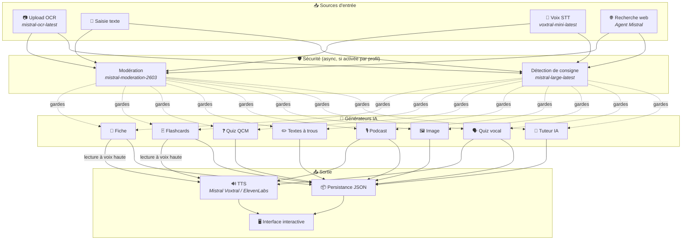
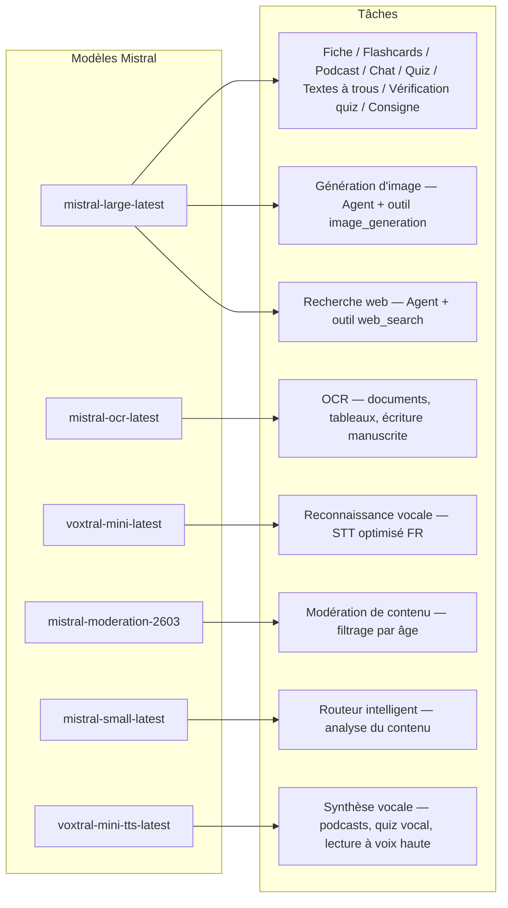
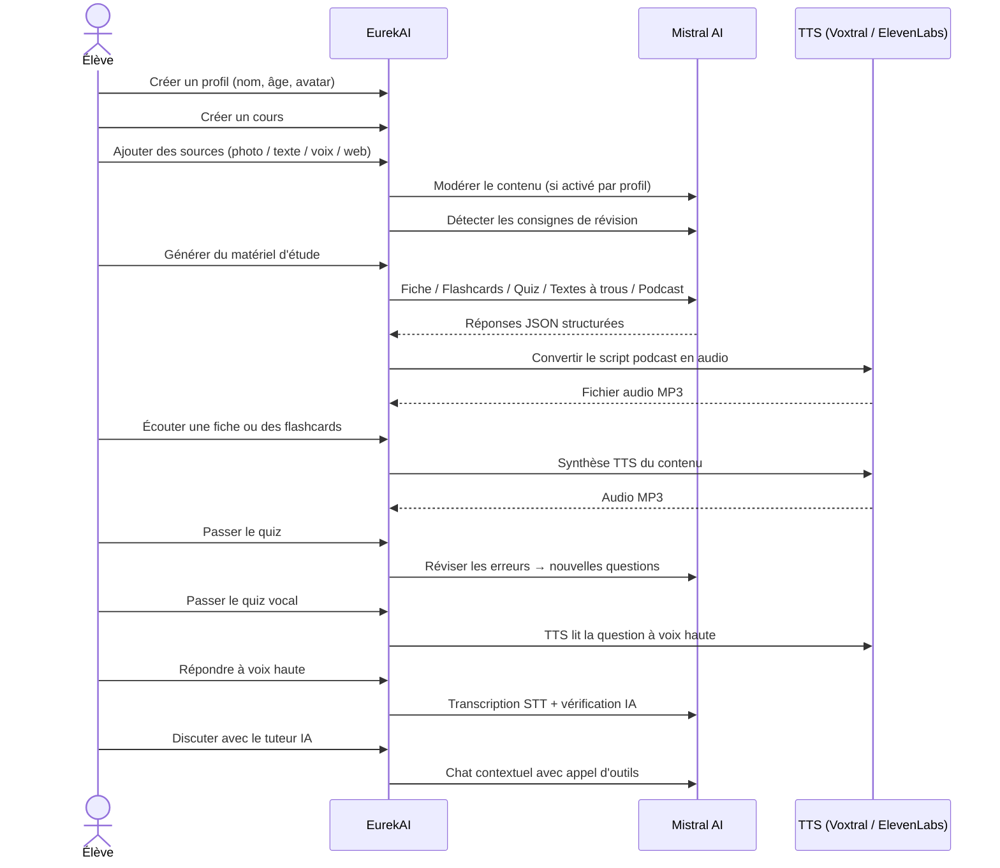

<p align="center">
  
</p>

<h1 align="center">EurekAI</h1>

<p align="center">
  <strong>Transformă orice conținut într-o experiență de învățare interactivă — alimentată de IA.</strong>
</p>

<p align="center">
  <a href="https://mistral.ai"></a>
  <a href="https://www.typescriptlang.org"></a>
  <a href="https://mistral.ai"></a>
  <a href="https://elevenlabs.io"></a>
</p>

<p align="center">
  <a href="https://www.youtube.com/watch?v=_b1TQz2leoI">▶️ Vezi demo-ul pe YouTube</a> · <a href="README-en.md">🇬🇧 Citiți în engleză</a>
</p>

<p align="center">
  <a href="https://sonarcloud.io/summary/new_code?id=jls42_EurekAI"></a>
  <a href="https://sonarcloud.io/summary/new_code?id=jls42_EurekAI"></a>
  <a href="https://sonarcloud.io/summary/new_code?id=jls42_EurekAI"></a>
  <a href="https://sonarcloud.io/summary/new_code?id=jls42_EurekAI"></a>
</p>
<p align="center">
  <a href="https://sonarcloud.io/summary/new_code?id=jls42_EurekAI"></a>
  <a href="https://sonarcloud.io/summary/new_code?id=jls42_EurekAI"></a>
  <a href="https://sonarcloud.io/summary/new_code?id=jls42_EurekAI"></a>
  <a href="https://sonarcloud.io/summary/new_code?id=jls42_EurekAI"></a>
</p>

---

## Povestea — De ce EurekAI ?

**EurekAI** a luat naștere în timpul [Hackathon-ul mondial Mistral AI](https://luma.com/mistralhack-online) ([site oficial](https://worldwide-hackathon.mistral.ai/)) (martie 2026). Aveam nevoie de un subiect — și ideea a venit din ceva foarte concret: îmi pregătesc în mod regulat testele cu fiica mea, și m-am gândit că ar trebui să fie posibil să facem asta mai distractiv și interactiv cu ajutorul IA.

Obiectivul: să preia **orice intrare** — o fotografie a manualului, un text copiat-lipat, o înregistrare vocală, o căutare web — și să o transforme în **fișe de recapitulare, flashcarduri, quizuri, podcasturi, texte de completat, ilustrații și altele**. Totul alimentat de modelele franceze de la Mistral AI, ceea ce îl face o soluție natural adaptată pentru elevii francofoni.

Fiecare linie de cod a fost scrisă în timpul hackathon-ului. Toate API-urile și bibliotecile open-source sunt folosite în conformitate cu regulile hackathon-ului.

---

## Funcționalități

| | Funcționalitate | Descriere |
|---|---|---|
| 📷 | **Upload OCR** | Fotografiați manualul sau notițele — Mistral OCR îi extrage conținutul |
| 📝 | **Introducere text** | Tastați sau lipiți orice text direct |
| 🎤 | **Intrare vocală** | Înregistrați-vă — Voxtral STT transcrie vocea |
| 🌐 | **Căutare web** | Puneți o întrebare — un Agent Mistral caută răspunsuri pe web |
| 📄 | **Fișe de recapitulare** | Note structurate cu puncte cheie, vocabular, citate, anecdote |
| 🃏 | **Flashcarduri** | 5-50 carduri Î/R cu referințe către surse pentru memorare activă |
| ❓ | **Quiz MCQ** | 5-50 întrebări cu alegere multiplă cu revizuire adaptativă a greșelilor |
| ✏️ | **Texte cu spații de completat** | Exerciții de completat cu indicii și validare tolerantă |
| 🎙️ | **Podcast** | Mini-podcast cu 2 voci convertit în audio via Mistral Voxtral TTS |
| 🖼️ | **Ilustrații** | Imagini educaționale generate de un Agent Mistral |
| 🗣️ | **Quiz vocal** | Întrebări citite cu voce tare, răspuns oral, IA verifică răspunsul |
| 💬 | **Tutor IA** | Chat contextual cu documentele tale de curs, cu apel de instrumente |
| 🧠 | **Rutare inteligentă** | IA analizează conținutul și recomandă generatoarele cele mai potrivite dintre cele 7 disponibile |
| 🔒 | **Control parental** | Moderare pe vârste, PIN parental, restricții chat |
| 🌍 | **Multilingv** | Interfață și conținut IA complete în franceză și engleză |
| 🔊 | **Redare vocală** | Ascultați fișele și flashcardurile via Mistral Voxtral TTS sau ElevenLabs |

---

## Prezentare generală a arhitecturii



---

## Hartă de utilizare a modelelor



---

## Parcursul utilizatorului



---

## Explorare detaliată — Funcționalități

### Intrare multimodală

EurekAI acceptă 4 tipuri de surse, moderate în funcție de profil (activate implicit pentru copil și adolescent):

- **Upload OCR** — Fișiere JPG, PNG sau PDF procesate de `mistral-ocr-latest`. Gestionează text tipărit, tabele și scrisul de mână.
- **Text liber** — Tastați sau lipiți orice conținut. Moderat înainte de stocare dacă moderarea este activă.
- **Intrare vocală** — Înregistrați audio în browser. Transcris de `voxtral-mini-latest`. Parametrul `language="fr"` optimizează recunoașterea.
- **Căutare web** — Introduceți o interogare. Un Agent Mistral temporar cu instrumentul `web_search` recuperează și rezumă rezultatele.

### Generare de conținut IA

Șapte tipuri de materiale de învățare generate :

| Generator | Model | Ieșire |
|---|---|---|
| **Fișă de recapitulare** | `mistral-large-latest` | Titlu, rezumat, 10-25 puncte cheie, vocabular, citate, anecdotă |
| **Flashcarduri** | `mistral-large-latest` | 5-50 carduri Î/R cu referințe către surse pentru memorare activă |
| **Quiz MCQ** | `mistral-large-latest` | 5-50 întrebări, 4 opțiuni fiecare, explicații, revizuire adaptativă |
| **Texte cu spații de completat** | `mistral-large-latest` | Fraze de completat cu indicii, validare tolerantă (Levenshtein) |
| **Podcast** | `mistral-large-latest` + Voxtral TTS | Script 2 voci → audio MP3 |
| **Ilustrație** | Agent `mistral-large-latest` | Imagine educațională via instrumentul `image_generation` |
| **Quiz vocal** | `mistral-large-latest` + Voxtral TTS + STT | Întrebări TTS → răspuns STT → verificare IA |

### Tutor IA prin chat

Un tutor conversațional cu acces complet la documentele de curs:

- Folosește `mistral-large-latest`
- **Apel de instrumente** : poate genera fișe, flashcarduri, quizuri sau texte de completat în timpul conversației
- Istoric de 50 de mesaje per curs
- Moderare a conținutului dacă este activată pentru profil

### Rutare automată inteligentă

Rutarea folosește `mistral-small-latest` pentru a analiza conținutul surselor și a recomanda care generatoare sunt cele mai potrivite dintre cele 7 disponibile — astfel elevii nu trebuie să aleagă manual. Interfața afișează progresul în timp real: mai întâi o fază de analiză, apoi generările individuale cu posibilitate de anulare.

### Învățare adaptativă

- **Statistici quiz** : urmărirea încercărilor și a acurateței pe întrebare
- **Revizuire quiz** : generează 5-10 întrebări noi care vizează conceptele slabe
- **Detecția instrucțiunilor** : detectează instrucțiunile de revizuire ("Știu lecția mea dacă știu...") și le prioritizează în toate generatoarele

### Securitate & control parental

- **4 grupe de vârstă** : copil (≤10 ani), adolescent (11-15), student (16-25), adult (26+)
- **Moderare a conținutului** : `mistral-moderation-2603` cu 5 categorii blocate pentru copil/adolescent (sexual, hate, violence, selfharm, jailbreaking), nicio restricție pentru student/adult
- **PIN parental** : hash SHA-256, necesar pentru profilurile cu vârsta sub 15 ani
- **Restricții chat** : chatul IA dezactivat implicit pentru cei sub 16 ani, activabil de către părinți

### Sistem multi-profil

- Profiluri multiple cu nume, vârstă, avatar, preferințe de limbă
- Proiecte legate de profiluri via `profileId`
- Ștergere în cascadă : ștergerea unui profil șterge toate proiectele sale

### TTS multi-provider

- **Mistral Voxtral TTS** (implicit) : `voxtral-mini-tts-latest`, nu este nevoie de cheie suplimentară
- **ElevenLabs** (alternativ) : `eleven_v3`, voci naturale, necesită `ELEVENLABS_API_KEY`
- Furnizor configurabil în setările aplicației

### Internaționalizare

- Interfață completă disponibilă în franceză și engleză
- Prompturile IA suportă 2 limbi astăzi (FR, EN) cu arhitectură pregătită pentru 15 (es, de, it, pt, nl, ja, zh, ko, ar, hi, pl, ro, sv)
- Limba configurabilă per profil

---

## Stack tehnic

| Strat | Tehnologie | Rol |
|---|---|---|
| **Runtime** | Node.js + TypeScript 5.7 | Server și siguranța tipurilor |
| **Backend** | Express 4.21 | API REST |
| **Server de dev** | Vite 7.3 + tsx | HMR, partials Handlebars, proxy |
| **Frontend** | HTML + TailwindCSS 4.2 + Alpine.js 3.15 | Interfață reactivă, TypeScript compilat de Vite |
| **Templating** | vite-plugin-handlebars | Compoziție HTML prin partials |
| **IA** | Mistral AI SDK 2.1 | Chat, OCR, STT, TTS, Agenți, Moderare |
| **TTS (implicit)** | Mistral Voxtral TTS | `voxtral-mini-tts-latest`, sinteză vocală integrată |
| **TTS (alternativ)** | ElevenLabs SDK 2.36 | `eleven_v3`, voci naturale |
| **Icoane** | Lucide 0.575 | Bibliotecă de icoane SVG |
| **Markdown** | Marked 17 | Redare markdown în chat |
| **Upload fișiere** | Multer 1.4 | Gestionarea formularelor multipart |
| **Audio** | ffmpeg-static | Concatenare de segmente audio |
| **Teste** | Vitest 4 | Teste unitare — acoperire măsurată de SonarCloud |
| **Persistență** | Fișiere JSON | Stocare fără dependențe |

---

## Referință a modelelor

| Model | Utilizare | De ce |
|---|---|---|
| `mistral-large-latest` | Fișă, Flashcards, Podcast, Quiz, Texte de completat, Chat, Verificare quiz vocal, Agent Image, Agent Web Search, Detecție consigne | Cel mai bun multilingv + urmărire a instrucțiunilor |
| `mistral-ocr-latest` | OCR de documents | Text tipărit, tabele, scris de mână |
| `voxtral-mini-latest` | Recunoaștere vocală (STT) | STT multilingv, optimizat cu `language="fr"` |
| `voxtral-mini-tts-latest` | Sinteză vocală (TTS) | Podcasturi, quiz vocal, redare vocală |
| `mistral-moderation-2603` | Moderare de conținut | 5 categorii blocate pentru copil/adolescent (+ jailbreaking) |
| `mistral-small-latest` | Router inteligent | Analiză rapidă a conținutului pentru decizii de rutare |
| `eleven_v3` (ElevenLabs) | Sinteză vocală (TTS alternativ) | Voci naturale, alternativă configurabilă |

---

## Început rapid

```bash
# Cloner le dépôt
git clone https://github.com/jls42/EurekAI.git
cd EurekAI

# Installer les dépendances
npm install

# Configurer les clés API
cp .env.example .env
# Éditez .env avec vos clés :
#   MISTRAL_API_KEY=votre_clé_ici           (requis)
#   ELEVENLABS_API_KEY=votre_clé_ici        (optionnel, TTS alternatif)

# Lancer le développement
npm run dev
# → Backend :  http://localhost:3000 (API)
# → Frontend : http://localhost:5173 (serveur Vite avec HMR)
```

> **Notă** : Mistral Voxtral TTS este furnizorul implicit — nu este necesară nicio cheie suplimentară dincolo de `MISTRAL_API_KEY`. ElevenLabs este un furnizor TTS alternativ configurabil în setările.

---

## Structura proiectului

```
server.ts                 — Point d'entrée Express, monte les routes + config
config.ts                 — Config runtime (modèles, voix, TTS provider), persistée dans output/config.json
store.ts                  — ProjectStore : CRUD projets/sources/générations, persistance JSON
profiles.ts               — ProfileStore : gestion des profils, hachage PIN
types.ts                  — Types TypeScript : Source, Generation (7 types), QuizStats, Profile
prompts.ts                — Tous les prompts IA centralisés (system + user templates, FR/EN)

generators/
  ocr.ts                  — Upload + OCR via Mistral (JPG, PNG, PDF)
  summary.ts              — Génération de fiche de révision (JSON structuré)
  flashcards.ts           — Flashcards Q/R (5-50, configurable)
  quiz.ts                 — Quiz QCM (5-50 questions, configurable) + révision adaptative
  fill-blank.ts           — Exercices à trous avec validation tolérante
  podcast.ts              — Script podcast 2 voix
  quiz-vocal.ts           — Quiz vocal : questions TTS + réponses STT + vérification IA
  image.ts                — Génération d'image via Agent Mistral (outil image_generation)
  chat.ts                 — Tuteur IA par chat avec appel d'outils
  router.ts               — Routeur automatique intelligent (contenu → générateurs recommandés)
  consigne.ts             — Détection de consignes de révision
  tts-provider.ts         — Dispatch TTS multi-provider (Mistral Voxtral / ElevenLabs)
  tts.ts                  — Génération audio podcast (concaténation de segments)
  stt.ts                  — Voxtral STT (audio → texte)
  websearch.ts            — Agent Mistral avec outil web_search
  moderation.ts           — Modération de contenu (filtrage par âge)

routes/
  projects.ts             — CRUD projets
  profiles.ts             — CRUD profils avec gestion du PIN
  sources.ts              — Upload OCR, texte libre, voix STT, recherche web, modération
  generate.ts             — Endpoints de génération (7 types + auto + route)
  generations.ts          — Tentatives de quiz/fill-blank, réponses vocales, lecture à voix haute
  chat.ts                 — Chat IA avec appel d'outils

helpers/
  index.ts                — safeParseJson, unwrapJsonArray, extractAllText, timer
  audio.ts                — collectStream (ReadableStream → Buffer)
  fill-blank-validate.ts  — Validation tolérante des réponses (normalisation, Levenshtein)

src/                      — Frontend (Vite + Handlebars)
  index.html              — Point d'entrée HTML principal
  main.ts                 — Entrée frontend (init Alpine.js + icônes Lucide)
  app/                    — Modules applicatifs Alpine.js
    state.ts              — Gestion d'état réactif
    navigation.ts         — Routage des vues + gardes par âge
    profiles.ts           — Logique du sélecteur de profils
    projects.ts           — CRUD des cours
    sources.ts            — Gestionnaires d'upload de sources
    generate.ts           — Déclencheurs de génération (individuel, tout, auto 2 phases)
    generations.ts        — Affichage + actions sur les générations
    chat.ts               — Interface de chat
    config.ts             — Interface de configuration (modèles, voix, TTS provider)
    render.ts             — Helpers de rendu HTML
    i18n.ts               — Changement de langue
    ...
  components/
    quiz.ts               — Composant quiz interactif
    quiz-vocal.ts         — Composant quiz vocal
    fill-blank.ts         — Composant textes à trous
    flashcards.ts         — Composant flashcards avec retournement
    step-by-step.ts       — Mixin navigation pas-à-pas (quiz, fill-blank, flashcards)
  i18n/
    fr.ts                 — Traductions françaises
    en.ts                 — Traductions anglaises
    index.ts              — Chargeur i18n
  partials/               — Partials HTML Handlebars (header, sidebar, dialogues, vues)
  styles/
    main.css              — Entrée TailwindCSS
    theme.css             — Variables de thème personnalisées

public/assets/            — Ressources statiques (logo, avatars)
output/                   — Données d'exécution (projets, config, fichiers audio)
```

---

## Referință API

### Config
| Metodă | Endpoint | Descriere |
|---|---|---|
| `GET` | `/api/config` | Configurație curentă |
| `PUT` | `/api/config` | Modifică config (modele, voci, furnizor TTS) |
| `GET` | `/api/config/status` | Stare API-uri (Mistral, ElevenLabs, TTS) |
| `POST` | `/api/config/reset` | Resetează config implicită |
| `GET` | `/api/config/voices` | Listează vocile Mistral TTS (opțional `?lang=fr`) |

### Profiluri
| Metodă | Endpoint | Descriere |
|---|---|---|
| `GET` | `/api/profiles` | Listează toate profilurile |
| `POST` | `/api/profiles` | Creează un profil |
| `PUT` | `/api/profiles/:id` | Modifică un profil (PIN necesar pentru < 15 ani) |
| `DELETE` | `/api/profiles/:id` | Șterge un profil + ștergere în cascadă proiecte |

### Proiecte
| Metodă | Endpoint | Descriere |
|---|---|---|
| `GET` | `/api/projects` | Listează proiectele |
| `POST` | `/api/projects` | Creează un proiect `{name, profileId}` |
| `GET` | `/api/projects/:pid` | Detalii proiect |
| `PUT` | `/api/projects/:pid` | Redenumește `{name}` |
| `DELETE` | `/api/projects/:pid` | Șterge proiectul |

### Surse
| Metodă | Endpoint | Descriere |
|---|---|---|
| `POST` | `/api/projects/:pid/sources/upload` | Upload OCR (fișiere multipart) |
| `POST` | `/api/projects/:pid/sources/text` | Text liber `{text}` |
| `POST` | `/api/projects/:pid/sources/voice` | Voce STT (audio multipart) |
| `POST` | `/api/projects/:pid/sources/websearch` | Căutare web `{query}` |
| `DELETE` | `/api/projects/:pid/sources/:sid` | Șterge o sursă |
| `POST` | `/api/projects/:pid/moderate` | Moderează `{text}` |
| `POST` | `/api/projects/:pid/detect-consigne` | Detectează instrucțiunile de revizuire |

### Generare
| Metodă | Endpoint | Descriere |
|---|---|---|
| `POST` | `/api/projects/:pid/generate/summary` | Fișă de recapitulare |
| `POST` | `/api/projects/:pid/generate/flashcards` | Flashcarduri |
| `POST` | `/api/projects/:pid/generate/quiz` | Quiz MCQ |
| `POST` | `/api/projects/:pid/generate/fill-blank` | Texte de completat |
| `POST` | `/api/projects/:pid/generate/podcast` | Podcast |
| `POST` | `/api/projects/:pid/generate/image` | Ilustrație |
| `POST` | `/api/projects/:pid/generate/quiz-vocal` | Quiz vocal |
| `POST` | `/api/projects/:pid/generate/quiz-review` | Revizuire adaptativă `{generationId, weakQuestions}` |
| `POST` | `/api/projects/:pid/generate/route` | Analiză de rutare (planul generatoarelor de lansat) |
| `POST` | `/api/projects/:pid/generate/auto` | Generare automată backend (rutare + 5 tipuri : summary, flashcards, quiz, fill-blank, podcast) |

Toate rutele de generare acceptă `{sourceIds?, lang?, ageGroup?, count?, useConsigne?}`.

### CRUD Generări
| Metodă | Endpoint | Descriere |
|---|---|---|
| `POST` | `/api/projects/:pid/generations/:gid/quiz-attempt` | Trimite răspunsurile quiz `{answers}` |
| `POST` | `/api/projects/:pid/generations/:gid/fill-blank-attempt` | Trimite răspunsurile pentru textele de completat `{answers}` |
| `POST` | `/api/projects/:pid/generations/:gid/vocal-answer` | Verifică un răspuns oral (audio + questionIndex) |
| `POST` | `/api/projects/:pid/generations/:gid/read-aloud` | Redare TTS cu voce tare (fișe/flashcarduri) |
| `PUT` | `/api/projects/:pid/generations/:gid` | Redenumește `{title}` |
| `DELETE` | `/api/projects/:pid/generations/:gid` | Șterge generarea |

### Chat
| Metodă | Endpoint | Descriere |
|---|---|---|
| `GET` | `/api/projects/:pid/chat` | Recuperează istoricul chatului |
| `POST` | `/api/projects/:pid/chat` | Trimite un mesaj `{message, lang, ageGroup}` |
| `DELETE` | `/api/projects/:pid/chat` | Șterge istoricul chatului |

---

## Decizii arhitecturale

| Decizie | Justificare |
|---|---|
| **Alpine.js în loc de React/Vue** | Amprentă minimă, reactivitate ușoară cu TypeScript compilat de Vite. Perfect pentru un hackathon unde viteza contează. |
| **Persistență în fișiere JSON** | Zero dependențe, pornire instantanee. Nicio bază de date de configurat — pornești și gata. |
| **Vite + Handlebars** | Ce e mai bun din ambele lumi : HMR rapid pentru dezvoltare, partials HTML pentru organizarea codului, Tailwind JIT. |
| **Prompturi centralizate** | Toate prompturile IA în `prompts.ts` — ușor de iterat, testat și adaptat pe limbă/grupă de vârstă. |
| **Sistem multi-generații** | Fiecare generație este un obiect independent cu propriul său ID — permite mai multe fișe, quiz-uri etc. pe curs. |
| **Prompturi adaptate în funcție de vârstă** | 4 grupe de vârstă cu vocabular, complexitate și ton diferite — același conținut predă diferit în funcție de cursant. |
| **Funcționalități bazate pe agenți** | Generarea de imagini și căutarea web folosesc agenți Mistral temporari — ciclu de viață izolat cu curățare automată. |
| **TTS multi-furnizor** | Mistral Voxtral TTS implicit (fără cheie suplimentară), ElevenLabs ca alternativă — configurabil fără repornire. |

---

## Credite & mulțumiri

- **[Mistral AI](https://mistral.ai)** — Modele IA (Large, OCR, Voxtral STT, Voxtral TTS, Moderation, Small) + Worldwide Hackathon
- **[ElevenLabs](https://elevenlabs.io)** — Motor alternativ de sinteză vocală (`eleven_v3`)
- **[Alpine.js](https://alpinejs.dev)** — Framework reactiv ușor
- **[TailwindCSS](https://tailwindcss.com)** — Framework CSS utilitar
- **[Vite](https://vitejs.dev)** — Unealtă de build pentru frontend
- **[Lucide](https://lucide.dev)** — Bibliotecă de icoane
- **[Marked](https://marked.js.org)** — Parser Markdown

Realizat cu grijă în timpul Mistral AI Worldwide Hackathon, martie 2026.

---

## Autor

**Julien LS** — [contact@jls42.org](mailto:contact@jls42.org)

## Licență

[AGPL-3.0](LICENSE) — Drepturi de autor (C) 2026 Julien LS

**Acest document a fost tradus din versiunea fr în limba ro folosind modelul gpt-5-mini. Pentru mai multe informații despre procesul de traducere, consultați https://gitlab.com/jls42/ai-powered-markdown-translator**

